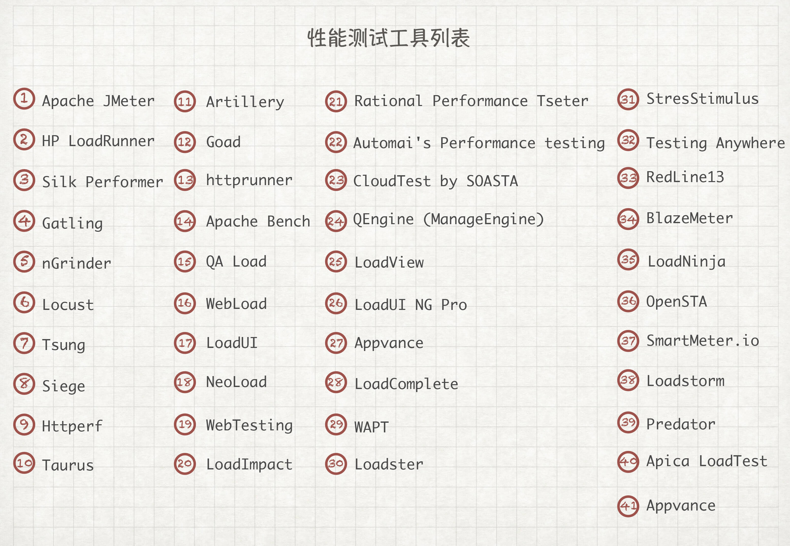
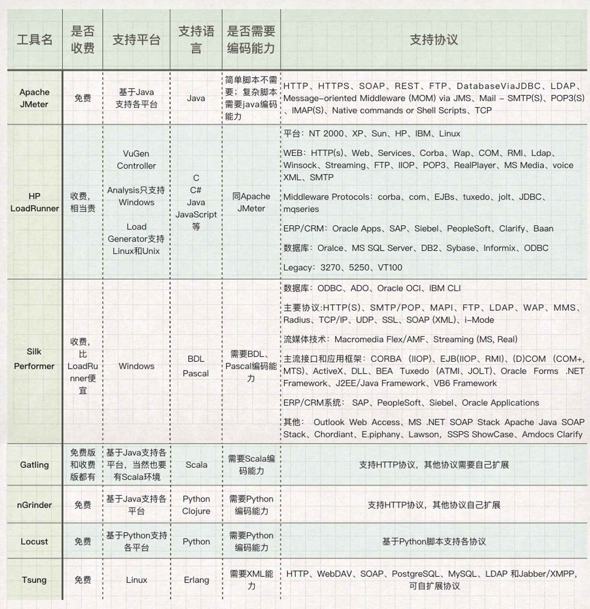
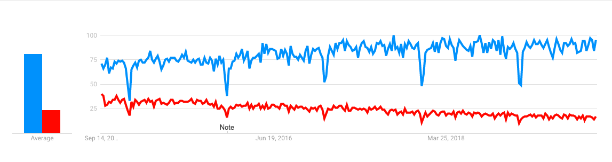
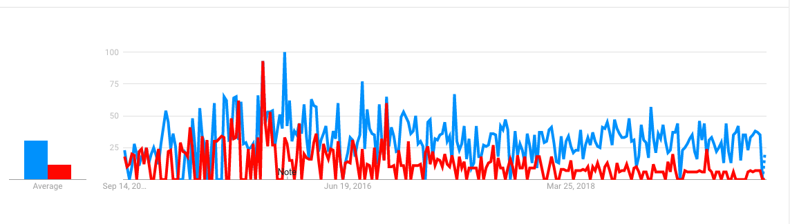

# 04丨JMeter和LoadRunner：要知道工具仅仅只是工具
做性能测试工作的人总是离不了性能测试工具，但当我们刚开始接触这类工具或者压测平台的时候，总是难免处在一种顾此失彼，焦虑又没想法的状态。

## 性能工程师的三大学习阶段

在我看来，对性能测试工程师本身来，多半会处在以下三个大的阶段。

### 性能工具学习期

JMeter和LoadRunner是我们常用的两个性能测试工具。曾经有人问我，应该学JMeter还是LoadRunner呢？我反问的是，你学这样的工具需要多久呢？一般对方因为初学并不清楚要多久，然后我会告诉他，如果你是认真努力的，想要全职学习，那么我觉得一个工具，纯从功能的使用的角度来说，自学两个星期应该就差不多了。如果你是在工作中学习，那就更简单了，工作中需要什么就学习什么，不用纠结。

而应该纠结的是什么呢？当你把JMeter、LoadRunner的基本功能学会了，你会发现这些工具其实就做了两件事情，做脚本和发压力。

但问题在于，脚本的逻辑和压力场景的逻辑，和工具本身无关，和业务场景有关。这时你可能就会问，场景怎么配置呢？

这才进入到了另一个阶段。

通常在这个阶段的时候，你会觉得自己有非常明确的疑问，有经验的人可能一句话就可以指点你了，解决掉你的疑问，就是告诉你选择什么工具，如何来用。

### 性能场景学习期

第二个阶段就是性能场景学习期。我们平时在很多场合下所说的场景范围都有些狭隘，觉得场景就是业务比例，就是用多少数据。而实际做过多个性能项目之后，你就会发现，工具中的一个小小的配置，也会对结果产生巨大的影响。

比如说压力策略，应该用一秒 Ramp up 10个用户，还是20个用户，还是100个用户？这应该怎么判断呢？

比如说，参数化数据应该用100条，还是100万条？还是有确定的值呢？有人说根据场景配置，可是根据什么样的场景怎么配置才合理呢？

比如说，在执行场景时应该看哪些数据？压力工具中的TPS、响应时间这些常规数据都会去看，其他的还要看什么呢？这就涉及到了监控策略。

再比如说，业务应该用什么样的比例设置到压力工具中？有人说直接在线上做测试不是挺直接？但是你知道什么样的业务可以，什么样的业务不可以吗？如何控制线上的性能测试？

在性能场景学习期这个阶段，你关心的将不再是工具的使用操作，而是如何做一个合理的性能测试。你可以学会调整业务比例，并设计到压力工具中；你可以学会参数化数据的提取逻辑；你可以学会场景中要观察哪些数据。

按照这个思路，再做几个项目，你就会慢慢摸着一些门道。

### 性能分析学习期

学会使用工具了，也有了场景设计的经验，通过监控工具也拿到了一堆大大小小的数据。可是，数据也太多了，还在不断的变化。我又怎么判断性能瓶颈在哪里呢？

做性能的人都会有这样的一个茫然。当你把一个性能测试结果发给了别人，别人会顺理成章地去问你：“响应时间为什么这么长？有没有优化空间？”

听到这种问题，你有没有无助的感觉？心里台词是：“我怎么知道？”但是嘴上却不敢说出来，因为似乎这是我应该给出的答案？

但是当你尝试给出答案时，你就进入了一个大坑，对这个问题做出回答，近乎一个无底洞，需要太多的基础知识，需要很强的逻辑分析，需要清晰的判断思路。

如果你到了这个阶段，你可能会发现自己走得非常痛苦，好像自己也不知道自己会什么，不会什么。要说工具吧，也完全会用，场景吧，也会配置，但为什么就是不会分析结果，不会整理数据，不会下结论呢？

但实际上，我觉得你不要焦虑自己不会什么，而应该把目光聚焦到你要解决的问题上。问题的解决，靠的是思维逻辑，靠的是判断，而不是靠工具。

也就是说，这时面对问题，你应该说的是“我想要看什么数据”，而不是“把数据都给我看看”。

看到这里，希望你能清晰地理解这两者之间的区别。

## 公司性能团队成长阶段

我刚才分析了一下作为个人的性能工程师是如何一步步成长的，在实际工作中，我们更多的需要与团队合作，团队的成长与我们个人的成长息息相关。

对于一个公司的一个性能团队来说，大概会处在这些阶段。

### 性能团队初建

这时的团队，可以执行场景，可以拿出数据，但工作出的结果并不理想。团队整体的价值就体现在每天跟着版本跑来跑去，一轮轮地测试下去，一个版本短则一两个星期，长则一个月。没有时间去考虑测试结果对整个软件生命周期的价值，在各种琐碎的项目中疲于奔命。做脚本，拿出TPS和响应时间，做版本基线比对，出数据罗列式的性能测试报告。

唉，想想人生就这么过去了，真是心有不甘。这时有多少人希望能有一个性能测试平台来拯救团队啊。

### 性能团队初成熟

到了这个阶段，团队已经可以应付版本的更迭带来的性能工作压力，团队合作良好，稍有余力，开始考虑团队价值所在，在公司的组织结构中应该承担什么样的职责。在产品的流水线上终于可以占有一席之地了。这样很好，只是从实际的技术细节上来说，仍然没有摆脱第一阶段中琐碎的工作，没有把性能的价值体现出来，只是一个报告提供机器。

这时就需要考虑平台上是不是可以加个SLA来限制一下？在各个流程的关卡上，是不是可以做些性能标准？是不是该考虑下准入准出规则了？是的，这时一个团队开始慢慢走向成熟，站住脚之后要开始争取尊重了。

### 性能团队已成熟

有了标准、流程，团队的合作能力也成熟了之后，团队“是时候展示真正的实力了”。但问题来了，什么才是性能团队的真正实力呢？

直观上说，主要体现在一下几个方面。

**1\. 通过你的测试和分析优化之后，性能提升了多少？**

这是一句非常简单直接的话。但是我相信有很多做性能测试工程师的人回答不出这样的问题。因为看着混乱的TPS曲线，自己都已经晕了，谁还知道性能提升了多少呢？

而一个成熟的团队应该回答的是：提升了10倍，我们调优了什么。这样的回答有理有据，底气十足。

**2\. 通过你的测试和分析优化之后，节省了多少成本？**

这个问题就没有那么好回答了，因为你要知道整体的容量规划，线上的真实运营性能。如果之前的版本用了200台机器，而通过我们的测试分析优化之后，只用到了100台机器，那成本就很明显了。

但是，在我的职业生涯中，很少看到有人这样来体现性能存在的价值。有些场合是不需要这样体现，有些场合是不知道这样体现。

## 对个人以及团队来说，工具应该如何选择

理顺了性能测试工程师和性能团队的成长路径，下面我们来说说个人或者团队选择工具的时候，应该如何考量。

在我十几年工作的生涯中，可以说有很多性能工具都是知道的，但是要说起用得熟练的，也无非就是那几个市场占有率非常高的工具。

下面列一下市场上大大小小、老老少少、长长短短的性能测试工具，以备大家查阅。

市面上大大小小的性能测试工作一共有四十余种。这里面有收费的，也有免费的；有开源的，有闭源的；有新鲜的，有不新鲜的；有活跃的，有半死不活的；有可以监控系统资源的，有只能做压力发起的。

你是不是有一种生无可恋的感觉？一个性能测试而已，有必要搞出这么多工具吗？

然而，你要记住，这些都是压力发起工具。

下面我对一些比较常见的工具做下比对，这些工具主要包括Apache JMeter、HP LoadRunner、Silk Performer、Gatling、nGrinder、Locust和Tsung。

仅比对这几个工具吧，因为从市场上来说，这几个算是经常看到的工具，以后我们再加入其他的工具和其他的属性。我们现在只说性能工具，不说一些企业做的性能平台云服务，因为云服务都是对企业来说的，我们放到后面再讲。

你从网络上可以很容易地找到这几个工具的特点，这几个都支持分布式。从上面那张表格中，你可以很容易对比出来，知道自己应该学什么工具了。

Gatling有免费版和收费版，基于Scala语言，而Scala又是基于Java的，你看这复杂的关系就让人不想用，但是这个工具性能很高，虽说只支持HTTP，但是由于支持Akka Actors和Async IO，可以达到很高的性能。Actors简化并发编译的异步消息特性让Gatling性能很高。

Locust这个工具是基于Python的，中文名翻译过来就是蝗虫，这名字取得挺有意思。在一个压力场景下，对服务器来说确实就像一堆蝗虫来了。

对市场的占有率来说，JMeter和LoadRunner以绝对的优势占据前两名，同时JMeter又以绝对的优势占据第一名。

下面来看一下，这两个工具的热度趋势。

这是全球范围近5年JMeter和LoadRunner热度（红色线是LoadRunner，蓝色线是JMeter）：

中国范围近5年JMeter和LoadRunner热度：

从上面的比对来看，我们可以很容易发现，近五年来，LoadRunner就一直在走下坡路，而JMeter一直处在上升的趋势。

## JMeter和LoadRunner的历史兴衰

我下面只说一下JMeter和LoadRunner的历史，让你对性能工具的兴衰史有一定的了解。

先说说LoadRunner吧，应该说，LoadRunner的历史，就是一段悲惨的回忆。2006年11月份以前，在Mercury时代，LoadRunner由于市场策略和工具优势很快占了第一名，势头很猛。当时还有另一个同样功能的工具Silk Performer，被打压得几乎抬不起头来。06年以后，Mercury以45亿美元被HP收购，包括QC、QTP等工具。但从那之后，LoadRunner的体积就在飞速膨胀，8.1的LoadRunner只有600M左右（如果我没记错的话），经历了几个版本的迭代，LoadRunner成功膨胀到4个G，并在后面规划performance center，在各地做质量中心。HP这一步步走得理直气壮，把市场折腾没了。现在LoadRunner如果想装到一台压力机上，都是很吃力的事情。我要是用的话，宁愿在XP系统上安装8.1版本，速度飞快。2016年，HPE和MicroFocus合并，LoadRunner也成了MicroFocus产品线的一部分，搞到现在，在中国的市场依然疲软。

而拥有同样竞品工具Silk Performer、Silk Test和Silk Test Manager的Segue公司，同年仅以1亿美元被另一个企业Borland收购。3年之后，Borland连同自己，以7500万美元卖给了MicroFocus。

至此，MicroFocus同时拥有了LoadRunner和Silk Performer。但可惜的是，这也照样干不过一个无心插柳柳成荫的开源工具JMeter。

JMeter的历史，可以说是屌丝逆袭的典型案例。1998年，Apache基金会的Stefano Mazzocchi是它最初的开发者，当时他只是为了测试Apache JServlet的性能（这个项目后来被Tomcat取代），后来JMeter被重构，又被用来测试Tomcat。其实一开始，JMeter的功能很简单。但是Apache Tomcat的势头实在是阻挡不住，再加上Java市场覆盖率实在是太高了，而JMeter做为一个开源免费的Java压力工具，有着众多的contributors，顶着Apache的大旗，想失败都难。就像ab工具是为了测试Apache HTTP server一样，JMeter应该说是和Apache Tomcat一起成长的。

与此同时，还有另一个Java开源工具The Grinder，这个工具的主要贡献者是Philip Aston、Calum Fitzgerald。

当时有一个开源测试平台叫NGrinder，是韩国公司NHN开源的。有很多所谓企业内部自研发的性能测试平台，就是从NGrinder借鉴来的，而NGrinder就是以The Grinder为基础开发的。可惜的是，The Grinder没有Apache这样的平台，作为一个很优秀的工具，它的维护更新还是不够快，不过NGrinder也给它带来了一定的荣耀。

到现在为止，JMeter还没有一个非常成熟的云测试平台支撑它，只有一些商业公司改动，加一些管理和项目属性，做为企业内部平台使用。还有一些企业把JMeter改造成商业产品，加上云基础架构的管理功能，就成了一套完整的商业平台，再加上炫丽的操作页面，棒棒的，有没有？

那么你有没有想过，为什么没有以JMeter为基础的开源云测试平台呢？难道JMeter的热爱者看不到云测试平台的价值吗？在我看来，做为性能测试工具，它实在是没有必要做成一个开源的测试平台，因为轮子就是轮子，要装成什么样的车就自己装吧。要是再换个角度来说，性能测试真的有必要用平台吗？

## 使用性能测试工具的误区在哪里

现在很多人都是看互联网大厂的技术栈，但是有没有想过自己企业需要的到底是什么样的产品？曾经有个测试工程师跟我说，他们公司为了解决性能问题，特意买了压测云服务，花了20万，结果问题还是没找出来。

所以工具应该如何用，完全取决于用的人，而不是工具本身。

压测工具也好，压测平台也好，都没有一个工具可以直接告诉你瓶颈在哪里，能告诉你的只是数据是什么。分析只有靠自己，在这个过程中，我们也会用到很多的分析剖析工具，用这些工具的人也都会知道，工具也只提供数据，不会告诉你瓶颈点在哪里。

那这个时候就有人提出疑问了：“有些工具不是说，上了这个工具之后，耗时一眼看透嘛？”是的呀，关键是你看过是什么耗时了吗？给你一个Java栈，那么长的栈，每个方法的消耗都给你，但是长的就肯定有问题吗？

关于剖析工具的，我们后面再写。本篇重点在压测工具上。

有人说JMeter BIO有问题，应该用AIO；有人说，压测工具没有后端系统性能监控数据，应该加一个监控插件。像JMeter中就有一个插件叫perfmon，把后端的系统资源拉到JMeter的界面中来看。在这一点上，LoadRunner老早就做过了，并且在之前的版本中还有个专门的组件叫tuning，目的就是把后端所有的系统、应用、数据库都配置到一个架构图中，压力一发起，就把有问题的组件标红。想法很好，可是这个功能为什么没有被广泛使用？当然，后面被HP收购后，这和HP的市场策略有关，但是在收购前的Mercury时代，该功能也没有被广泛使用。

我们从实际的生产场景来看，压测工具模拟的是真实用户，而监控在哪里，在运维后台里，数据的流向都不一样。如果你使用压测工具的同时，也把它做为收集性能监控数据的工具，本身流量就会冲突。

所以在压测工具中同时收集监控计数器，就是不符合真实场景的。

这样压测平台就有出现的必要了，我们可以看到出现了五花八门的压测平台，也会有后端监控数据的曲线，乍看起来，就两个字：全面！

可是，同样也没有告诉你瓶颈在哪里。

## 如果选择合适自己的工具？

所以我们用工具，一定要知道几点：

1. 工具能做什么？
2. 工具不能做什么？
3. 我们用工具的目标是什么？
4. 当工具达不到目标时，我们怎么办？

把这几个问题在用工具之前就想清楚，才是个成熟的测试工程师，有这样的工程师的团队，才是成熟的性能测试团队（当然，成熟的测试团队还要有其他的技术）。

对企业，举例来说：

如果是一个需要支持万级、亿级TPS的电商网站，本身就是云基础架构，那么可能最简单的就是直接买这家的云压测工具就好了。

这样做的优点是不用再买机器做压力了。压力发起，主要就是靠压力机的量堆出来大并发。

但缺点也很明显，一是不能长期使用，长期用，费用就高了。二是数据也只能自己保存比对，如果测试和版本跨度大，还是要自己比对，无法自动比对。最后一个缺点就是 压力机不受控了。

所以如果有这样需求的企业，也基本上可以自己开发一套云压测工具了，从使用周期和长远的成本上来看，自已开发，都是最划算的。

如果是一个需要支持每秒100TPS的企业内部业务系统，就完全没必要买什么云服务了，自己找一台4C8G的机器，可能就压得够了。

这样的话完全可控，压测结果数据也都可以随时查看，可以留存。

如果是一个需要支持万级TPS，但又不能用云服务的事业单位或政企，比如，军工业，那只能自己搭建一套测试环境了。这样做的优点是完全内部可控，数据非常安全，但缺点就是投入成本高。

对私企来说，开源永远是最好的选择，成本低，但是需要相关人员能力稍强一些，因为没有技术支持。

对政企和事业单位来说，收费是一个好的选择，因为有第三方服务可以叫过来随时支持。

对一个做短平快项目的企业来说，云服务会是一个好选择，成本低，不用长期维护数据。

对想做百年老店的企业来说，肯定是自己开发平台，尽量不选择云服务，因为技术是需要积累的。

对个人来说呢，不用举例，压测工具市场，现在肯定是首选学习JMeter，其次是LoadRunner。

JMeter的势头已经很明显了，并且功能在慢慢扩展。开源免费是巨大的优势。

而LoadRunner，不管它的市场现在有多凋零，它仍然是性能测试市场上，功能最为齐全的工具，没有之一。

## 总结

总体来说，性能测试工具的市场中，可以说现在的工具已经种类繁多了，并且各有优点。在项目中，根据具体的实施成本及企业中的规划，选择一个最适合的就可以了。也可以用它们来组建自己的平台。但是请注意， 不要觉得做平台可以解决性能测试的问题，其实平台只是解决了人工的成本。

如果单纯为了追潮流而把性能测试工具的使用成本升得特别高，那就不划算了。

## 思考题

今天的内容有点多，我提几个思考题，你就当是对文章的回顾吧。

你觉得企业选择性能工具应该考虑哪些方面呢？以及性能测试工具中是否必须做监控呢？

欢迎你在评论区写下你的思考，也欢迎把这篇文章分享给你的朋友或者同事，一起交流一下。