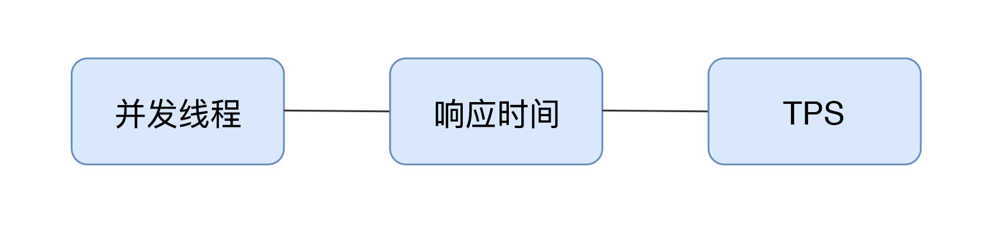
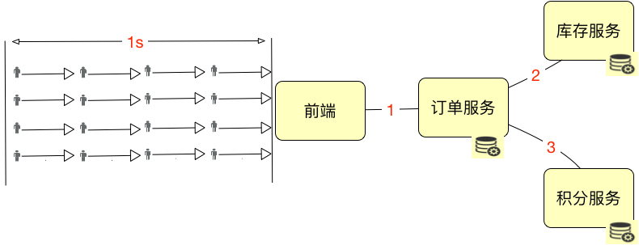
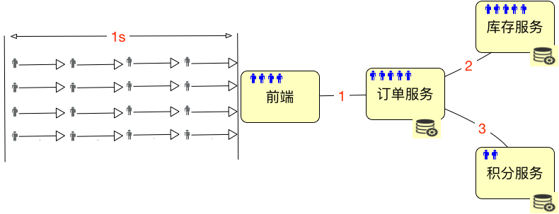
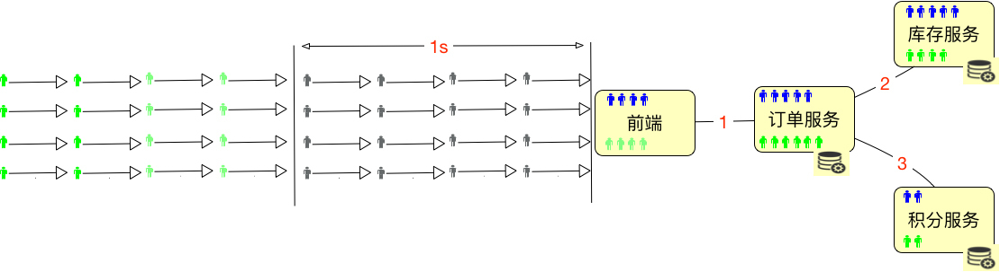
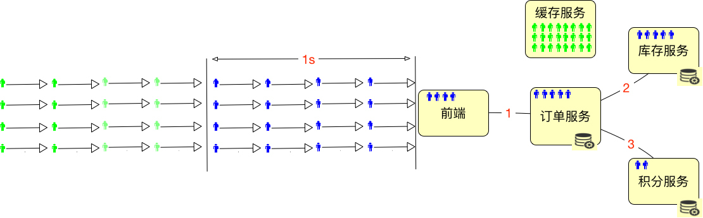
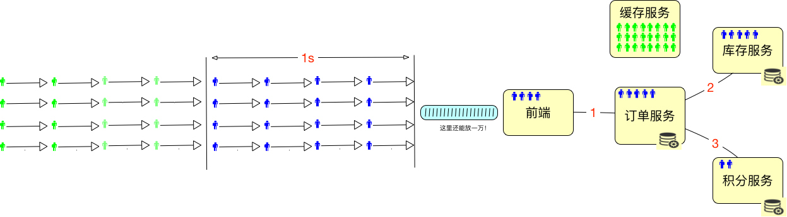
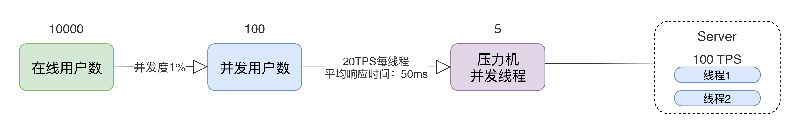
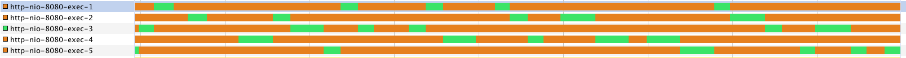
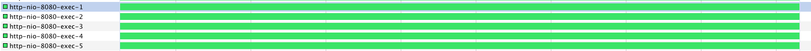

# 05丨指标关系：你知道并发用户数应该怎么算吗？
我在性能综述的那三篇文章中，描述了各种指标，比如TPS、RPS、QPS、HPS、CPM等。我也强调了，我们在实际工作的时候，应该对这些概念有统一的认识。



这样的话，在使用过程中，一个团队或企业从上到下都具有同样的概念意识，就可以避免出现沟通上的偏差。

我说一个故事。

我以前接触过一个咨询项目。在我接触之前，性能测试团队一直给老板汇报着一个数据，那就是10000TPS。并且在每个版本之后，都会出一个性能测试报告，老板一看，这个数据并没有少于10000TPS，很好。 后来，我进去一看，他们一直提的这个10000TPS指的是单业务的订单，并且是最基础的订单逻辑。那么问题来了，如果混合起来会怎么样呢？于是我就让他们做个混合容量场景，显然，提容量不提混合，只说单接口的容量是不能满足生产环境要求的。

结果怎么样呢？只能测试到6000TPS。于是我就要去跟老板解释说系统达到的指标是6000TPS。老板就恼火了呀，同样的系统，以前报的一直是10000TPS，现在怎么只有6000TPS了？不行，你们开发的这个版本肯定是有问题的。于是老板找到了研发VP，研发VP找到了研发经理，研发经理找了研发组长，研发组长又找到了开发工程师，开发工程师找到了我。我说之前不是混合场景的结果，现在混合容量场景最多达到6000TPS，你们可以自己来测。

然后证明，TPS确实只能达到6000。然后就是一轮又一轮的向上解释。

说这个故事是为了告诉你，你用TPS也好，RPS也好，QPS也好，甚至用西夏文来定义也不是不可以，只要在一个团队中，大家都懂就可以了。

但是，在性能市场上，我们总要用具有普适性的指标说明，而不是用混乱的体系。

在这里，我建议用TPS做为关键的性能指标。那么在今天的内容里，我们就要说明白TPS到底是什么。在第3篇文章中，我提到过在不同的测试目标中设置不同的事务，也就是TPS中的T要根据实际的业务产生变化。

那么问题又来了，TPS和并发数是什么关系呢？ 在并发中谁来承载”并发“这个概念呢？

说到这个，我们先说一下所谓的“绝对并发”和“相对并发”这两个概念。绝对并发指的是同一时刻的并发数；相对并发指的是一个时间段内发生的事情。

你能详细说一下这两个概念之间的区别吗？如果说不出来那简直太正常了，因为这两个概念把事情说得更复杂了。

## 什么是并发

下面我们就来说一下“并发”这个概念。



我们假设上图中的这些小人是严格按照这个逻辑到达系统的，那显然，系统的绝对并发用户数是4。如果描述1秒内的并发用户数，那就是16。是不是显而易见？

但是，在实际的系统中，用户通常是这样分配的：



也就是说，这些用户会分布在系统中不同的服务、网络等对象中。这时候”绝对并发“这个概念就难描述了，你说的是哪部分的绝对并发呢？

要说积分服务，那是2；要说库存服务，那是5；要说订单服务，它自己是5个请求正在处理，但同时它又hold住了5个到库存服务的链接，因为要等着它返回之后，再返回给前端。所以将绝对并发细分下去之后，你会发现头都大了，不知道要描述什么了。

有人说，我们可以通过CPU啊，I/O啊，或者内存来描述绝对并发，来看CPU在同一时刻处理的任务数。如果是这样的话，绝对并发还用算吗？那肯定是CPU的个数呀。有人说CPU 1ns就可以处理好多个任务了，这里的1ns也是时间段呀。要说绝对的某个时刻，任务数肯定不会大于CPU物理个数。

所以“绝对并发”这个概念，不管是用来描述硬件细化的层面，还是用来描述业务逻辑的层面，都是没什么意义的。

我们只要描述并发就好了，不用有“相对”和“绝对”的概念，这样可以简化沟通，也不会出错。

那么如何来描述上面的并发用户数呢？在这里我建议用TPS来承载“并发”这个概念。

并发数是16TPS，就是1秒内整个系统处理了16个事务。

这样描述就够了，别纠结。

## 在线用户数、并发用户数怎么计算

那么新问题又来了，在线用户数和并发用户数应该如何算呢？下面我们接着来看示意图：



如上图所示，总共有32个用户进入了系统，但是绿色的用户并没有任何动作，那么显然，在线用户数是32个，并发用户数是16个，这时的并发度就是50%。

但在一个系统中，通常都是下面这个样子的。



为了能hold住更多的用户，我们通常都会把一些数据放到Redis这样的缓存服务器中。所以在线用户数怎么算呢，如果仅从上面这种简单的图来看的话，其实就是缓存服务器能有多大，能hold住多少用户需要的数据。

最多再加上在超时路上的用户数。如下所示：



所以我们要是想知道在线的最大的用户数是多少，对于一个设计逻辑清晰的系统来说，不用测试就可以知道，直接拿缓存的内存来算就可以了。

假设一个用户进入系统之后，需要用10k内存来维护一个用户的信息，那么10G的内存就能hold住1,048,576个用户的数据，这就是最大在线用户数了。在实际的项目中，我们还会将超时放在一起来考虑。

但并发用户数不同，他们需要在系统中执行某个动作。我们要测试的重中之重，就是统计这些正在执行动作的并发用户数。

当我们统计生产环境中的在线用户数时，并发用户数也是要同时统计的。这里会涉及到一个概念： **并发度**。

要想计算并发用户和在线用户数之间的关系，都需要有并发度。

做性能的人都知道，我们有时会接到一个需求，那就是一定要测试出来 **系统最大在线用户数是多少**。这个需求怎么做呢？

很多人都是通过加思考时间（有的压力工具中叫等待时间，Sleep时间）来保持用户与系统之间的session不断，但实际上的并发度非常非常低。

我曾经看到一个小伙，在一台4C8G的笔记本上用LoadRunner跑了1万个用户，里面的error疯狂上涨，当然正常的事务也有。我问他，你这个场景有什么意义，这么多错？他说，老板要一个最大在线用户数。我说你这些都错了呀。他说，没事，我要的是Running User能达到最大就行，给老板交差。我只能默默地离开了。

这里有一个比较严重的理解误区，那就是压力工具中的线程或用户数到底是不是用来描述性能表现的？我们通过一个示意图来说明：



通过这个图，我们可以看到一个简单的计算逻辑：

1. 如果有10000个在线用户数，同时并发度是1%，那显然并发用户数就是100。
2. 如果每个线程的20TPS，显然只需要5个线程就够了（请注意，这里说的线程指的是压力机的线程数）。
3. 这时对Server来说，它处理的就是100TPS，平均响应时间是50ms。50ms就是根据1000ms/20TPS得来的（请注意，这里说的平均响应时间会在一个区间内浮动，但只要TPS不变，这个平均响应时间就不会变）。
4. 如果我们有两个Server线程来处理，那么一个线程就是50TPS，这个很直接吧。
5. 请大家注意，这里我有一个转换的细节，那就是 **并发用户数到压力机的并发线程数**。这一步，我们通常怎么做呢？就是基准测试的第一步。关于这一点，我们在后续的场景中交待。

而我们通常说的“并发”这个词，依赖TPS来承载的时候，指的都是Server端的处理能力，并不是压力工具上的并发线程数。在上面的例子中，我们说的并发就是指服务器上100TPS的处理能力，而不是指5个压力机的并发线程数。 **请你切记这一点，以免沟通障碍**。

在我带过的所有项目中，这都是一个沟通的前提。

所以，我一直在强调一点，这是一个基础的知识： **不要在意你用的是什么压力工具，只要在意你服务端的处理能力就可以了**。

## 示例

上面说了这么多，我们现在来看一个实例。这个例子很简单，就是：

JMeter（1个线程） - Nginx - Tomcat - MySQL

通过上面的逻辑，我们先来看看JMeter的处理情况：

```
summary +   5922 in 00:00:30 =  197.4/s Avg:     4 Min:     0 Max:    26 Err:     0 (0.00%) Active: 1 Started: 1 Finished: 0
summary =  35463 in 00:03:05 =  192.0/s Avg:     5 Min:     0 Max:   147 Err:     0 (0.00%)
summary +   5922 in 00:00:30 =  197.5/s Avg:     4 Min:     0 Max:    24 Err:     0 (0.00%) Active: 1 Started: 1 Finished: 0
summary =  41385 in 00:03:35 =  192.8/s Avg:     5 Min:     0 Max:   147 Err:     0 (0.00%)
summary +   5808 in 00:00:30 =  193.6/s Avg:     5 Min:     0 Max:    25 Err:     0 (0.00%) Active: 1 Started: 1 Finished: 0
summary =  47193 in 00:04:05 =  192.9/s Avg:     5 Min:     0 Max:   147 Err:     0 (0.00%)

```

我们可以看到，JMeter的平均响应时间基本都在5ms，因为只有一个压力机线程，所以它的TPS应该接近1000ms/5ms=200TPS。从测试结果上来看，也确实是接近的。有人说为什么会少一点？因为这里算的是平均数，并且这个数据是30s刷新一次，用30秒的时间内完成的事务数除以30s得到的，但是如果事务还没有完成，就不会计算在内了；同时，如果在这段时间内有一两个时间长的事务，也会拉低TPS。

那么对于服务端呢，我们来看看服务端线程的工作情况。



可以看到在服务端，我开了5个线程，但是服务端并没有一直干活，只有一个在干活的，其他的都处于空闲状态。

这是一种很合理的状态。但是你需要注意的是，这种合理的状态并不一定是对的性能状态。

1. 并发用户数（TPS）是193.6TPS。如果并发度为5%，在线用户数就是193.6/5%=3872。
2. 响应时间是5ms。
3. 压力机并发线程数是1。这一条，我们通常也不对非专业人士描述，只要性能测试工程师自己知道就可以了。

下面我们换一下场景，在压力机上启动10个线程。结果如下：

```
summary +  11742 in 00:00:30 =  391.3/s Avg:    25 Min:     0 Max:   335 Err:     0 (0.00%) Active: 10 Started: 10 Finished: 0
summary =  55761 in 00:02:24 =  386.6/s Avg:    25 Min:     0 Max:   346 Err:     0 (0.00%)
summary +  11924 in 00:00:30 =  397.5/s Avg:    25 Min:     0 Max:    80 Err:     0 (0.00%) Active: 10 Started: 10 Finished: 0
summary =  67685 in 00:02:54 =  388.5/s Avg:    25 Min:     0 Max:   346 Err:     0 (0.00%)
summary +  11884 in 00:00:30 =  396.2/s Avg:    25 Min:     0 Max:   240 Err:     0 (0.00%) Active: 10 Started: 10 Finished: 0
summary =  79569 in 00:03:24 =  389.6/s Avg:    25 Min:     0 Max:   346 Err:     0 (0.00%)

```

平均响应时间在25ms，我们来计算一处，(1000ms/25ms)\*10=400TPS，而最新刷出来的一条是396.2，是不是非常合理？

再回来看看服务端的线程：



同样是5个线程，现在就忙了很多。

1. 并发用户数（TPS）是396.2TPS。如果并发度为5%，在线用户数就是396.2/5%=7924。
2. 响应时间是25ms。
3. 压力机并发线程数是10。这一条，我们通常也不对非专业人士描述，只要性能测试工程师自己知道就可以了。

如果要有公式的话，这个计算公式将非常简单：

$TPS = \\frac{1000ms}{响应时间(单位ms)}\*压力机线程数$

我不打算再将此公式复杂化，所以就不再用字母替代了。

这就是我经常提到的， **对于压力工具来说，只要不报错，我们就关心TPS和响应时间就可以了，因为TPS反应出来的是和服务器对应的处理能力，至少压力线程数是多少，并不关键**。我想这时会有人能想起来JMeter的BIO和AIO之争吧。

你也许会说，这个我理解了，服务端有多少个线程，就可以支持多少个压力机上的并发线程。但是这取决于TPS有多少，如果服务端处理的快，那压力机的并发线程就可以更多一些。

这个逻辑看似很合理，但是通常服务端都是有业务逻辑的，既然有业务逻辑，显然不会比压力机快。

应该说，服务端需要更多的线程来处理压力机线程发过来的请求。所以我们用几台压力机就可以压几十台服务端的性能了。

如果在一个微服务的系统中，因为每个服务都只做一件事情，拆分得很细，我们要注意整个系统的容量水位，而不是看某一个服务的能力，这就是拉平整个系统的容量。

我曾经看一个人做压力的时候，压力工具中要使用4000个线程，结果给服务端的Tomcat上也配置了4000个线程，结果Tomcat一启动，稍微有点访问，CS就特别高，结果导致请求没处理多少，自己倒浪费了不少CPU。

## 总结

通过示意图和示例，我描述了在线用户数、并发用户数、TPS（这里我们假设了一个用户只对应一个事务）、响应时间之间的关系。有几点需要强调：

1. 通常所说的并发都是指服务端的并发，而不是指压力机上的并发线程数，因为服务端的并发才是服务器的处理能力。
2. 性能中常说的并发，是用TPS这样的概念来承载具体数值的。
3. 压力工具中的线程数、响应时间和TPS之间是有对应关系的。

这里既没有复杂的逻辑，也没有复杂的公式。希望你在性能项目中，能简化概念，注重实用性。

## 思考题

如果你吸收了今天的内容，不妨思考一下这几个问题：

如何理解“服务端的并发能力”这一描述？我为什么不提倡使用“绝对并发”和“相对并发”的概念呢？以及，我们为什么不推荐用CPU来计算并发数？