# 08丨案例： 手把手教你编写最简单的性能脚本
通常我们会遇到要手写脚本的时候，就要针对一些接口编写脚本。这时候，我们需要知道接口规范和后台的数据是什么。而有些性能测试工程师写脚本时，并不知道后端的逻辑，只知道实现脚本，事实上，只知道实现脚本是远远不够的。

在这一篇文章中，我不打算讲复杂的内容，只想针对新手写一步步的操作，描述最简单的脚本编写。如果你已经具有丰富的脚本编写经验，会觉得本文很简单。

我没有打算把JMeter的功能点一一罗列出来，作为一个性能测试的专栏，不写一下脚本的实现似乎不像个样子。在脚本实现中，我们最常用的协议就是HTTP和TCP了吧，所以在今天的内容里，我简单地说一下如何编写HTTP和TCP脚本，以应测试主题。

我先画个图说明一下。

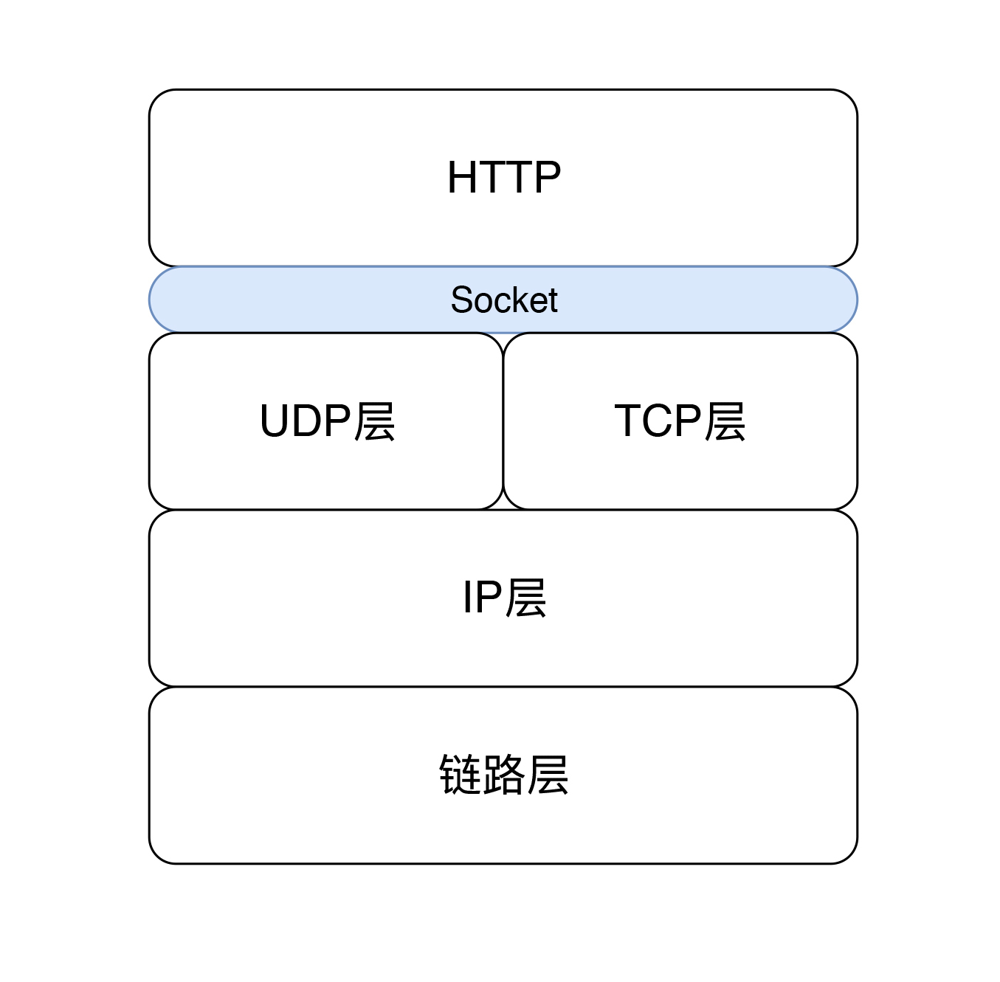

这样的图做性能的人一定要知道，相信很多人也画的出来。

我们知道HTTP是应用层的协议之一，现在很多场景都在用它，并且是用的HTTP1.1的版本，对应的是RFC2616，当然还有补充协议RFC7231、6265。

HTTP中只规定了传输的规则，规定了请求、响应、连接、方法、状态定义等。我们写脚本的时候，必须符合这些规则。比如为什么要在脚本中定义个Header？Header里为什么要那样写？这些在RFC中都说得明明白白了。

还有一点也需要注意，HTTP是通过Socket来使用TCP的，Socket做为套接层API，它本身不是协议，只规定了API。

而我们通常在JMeter中写TCP脚本，就是直接调用Socket层的API。TCP脚本和HTTP脚本最大的区别就是，TCP脚本中发送和接收的内容完全取决于Socket server是怎么处理的，并没有通用的规则。所以脚本中也就只有根据具体的项目来发挥了。

## 手工编写HTTP脚本

### 服务端代码逻辑说明

我们先自己编写一小段服务端代码的逻辑。现在用Spring Boot写一个示例，其实就是分分钟的事情。我们做性能测试的人至少要知道访问的是什么东西。

Controller关键代码如下：

```
@RestController
@RequestMapping(value = "pa")
public class PAController {

  @Autowired
  private PAService paService;

  //查询
  @GetMapping("/query/{id}")
  public ResultVO<User> getById(@PathVariable("id") String id) {
    User user = paService.getById(id);
    return ResultVO.<User>builder().success(user).build();
  }
}

```

Service关键代码如下：

```
  public User getById(String id) {
    return mapper.selectByPrimaryKey(id);
  }

```

用MyBatis组件实现对Mapper的操作。由于不是基础开发教程，这里只是为了说明逻辑，如果你感兴趣的话，可以自己编写一个接口示例。

逻辑调用关系如下：

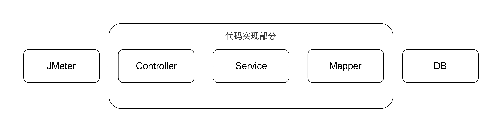

数据库中表的信息如下：

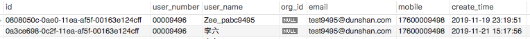

我们先看这个接口的访问逻辑：JMeter——SprintBoot的应用——MySQL。

## 1.编写JMeter脚本

### 1.1 创建线程组

首先创建一个线程组，配置如下：

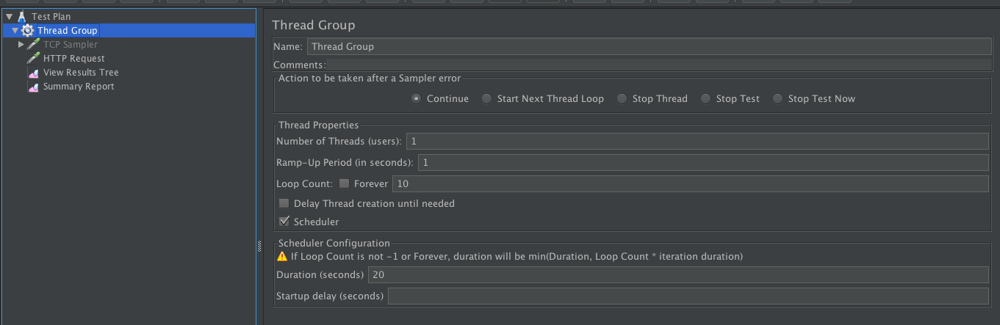

在这个线程组中，有几个关键配置，我来一一说明一下。

Number of Threads(users)：我们都知道这是JMeter中的线程数，也可以称之为用户数。但是在 [第2篇文章](https://time.geekbang.org/column/article/178076) 中，我已经说得非常明确了，这个线程数是产生TPS的，而一个线程产生多少TPS，取决于系统的响应时间有多快。所以我们用TPS这个概念来承载系统的负载能力，而不是用这里的线程数。

Ramp-up Period(in seconds)：递增时间，以秒为单位。指的就是上面配置的线程数将在多长时间内会全部递增完。如果我们配置了100线程，这里配置为10秒，那么就是100/(10s\*1000ms)=1线程/100ms；如果我们配置了10线程，这里配置为1秒，则是10/1000=1线程/100ms。这时我们要注意了哦，在10线程启动的这个阶段中，对服务器的压力是一样的。示意图如下：

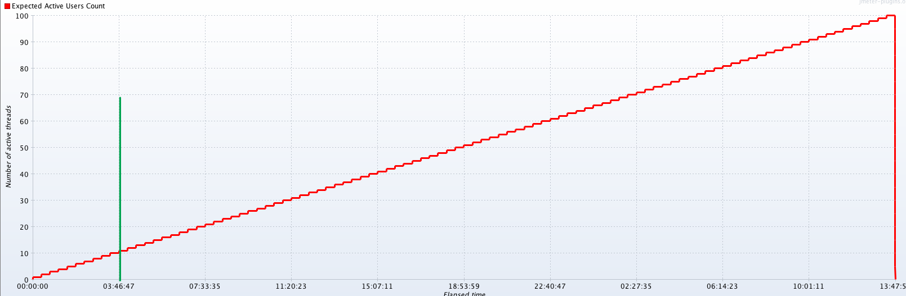

Loop Count这个值指的是一个线程中脚本迭代的次数。这里你需要注意，这个值和后面的Scheduler有一个判断关系，下面我们会提到。

Delay Thread creation until needed：这个含义从字面看不是特别清楚。这里有一个默认的知识点，那就是JMeter所有的线程是一开始就创建完成的，只是递增的时候会按照上面的规则递增。如果选择了这个选项，则不会在一开始创建所有线程，只有在需要时才会创建。这一点和LoadRunner中的初始化选项类似。只是不知道你有没有注意过，基本上，我们做性能测试的工程师，很少有选择这个选项的。选与不选之间，区别到底是什么呢？

如果不选择，在启动场景时，JMeter会用更多的CPU来创建线程，它会影响前面的一些请求的响应时间，因为压力机的CPU在做其他事情嘛。

如果选择了的话，就会在使用时再创建，CPU消耗会平均一些，但是这时会有另一个隐患，就是会稍微影响正在跑的线程。这个选项，选择与否，取决于压力机在执行过程中，它能产生多大的影响。如果你的线程数很多，一旦启动，压力机的CPU都被消耗在创建线程上了，那就可以考虑选择它，否则，可以不选择。

Scheduler Configuration：这里有一句重要的话， `If Loop Count is not -1 or Forever, duration will be min(Duration, Loop Count * iteration duration)`。举例来说，如果设置了Loop Count 为100，而响应时间是0.1秒，那么Loop `Count * iteration duration(这个就是响应时间) = 100 * 0.1 = 10秒`。

即便设置了Scheduler的Duration为100秒，线程仍然会以10秒为结束点。

如果没有设置Scheduler的Duration，那么你会看到，在JMeter运行到10秒时，控制台中会出现如下信息：

```
  2019-11-26 10:39:20,521 INFO o.a.j.t.JMeterThread: Thread finished: Thread Group 1-10

```

有些人不太理解这一点，经常会设置迭代次数，同时又设置Scheduler中的Duration。而对TPS来说，就会产生这样的图：

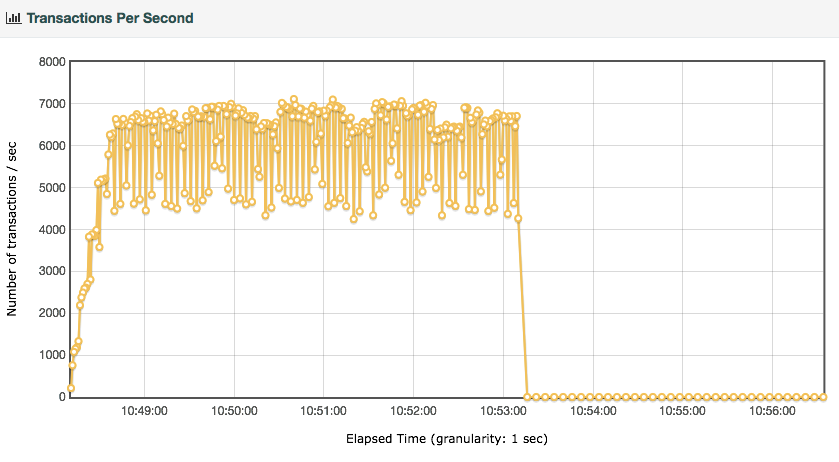

场景没执行完，结果TPS全掉下去了，于是开始查后端系统，其实和后端没有任何关系。

### 1.2 创建HTTP Sampler

### 1.2.1 GET接口

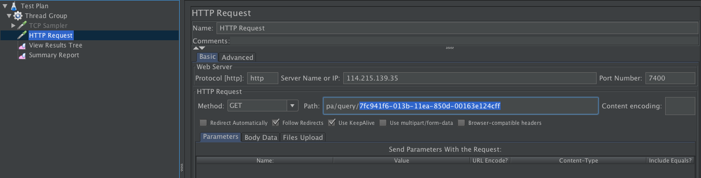

看上图，我将Method选择为GET。为什么要选择它？往上看我们的接口注解，这是一个GetMapping，所以这里要选择GET。

再看path中，这里是 `/pa/query/0808050c-0ae0-11ea-af5f-00163e124cff`，对应着 `“/query/{id}”`。

然后执行：

```
User user = paService.getById(id);

```

返回执行结果：

```
return ResultVO.<User>builder().success(user).build();

```

为什么要解释这一段呢？

做开发的人可能会觉得，你这个解释毫无意义呀，代码里已经写得很清楚了。事实上，在我的工作经历中，会发现很多做性能测试脚本的，实际上并不知道后端采用了什么样的技术，实现的是什么样的逻辑。

所以还是希望你可以自己写一些demo，去了解一些逻辑，然后在排除问题的时候，就非常清楚了。

接着我们执行脚本，就得到了如下结果：

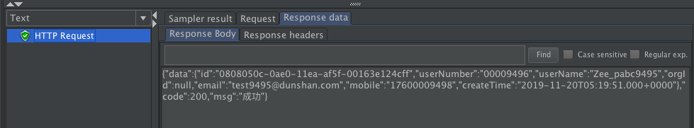

这样一个最简单的GET脚本就做好了。

前面我们提到过，URL中的ID是0808050c-0ae0-11ea-af5f-00163e124cff，这个数据来自于数据库中的第一条。

如果我们随便写一个数据，会得到什么结果呢？

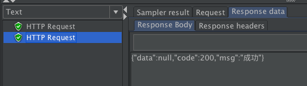

你会看到，结果一样得到了200的code，但是这个结果明显就不对了，明明没有查到，还是返回了成功。

所以说，业务的成功，只能靠业务来判断。这里只是查询成功了，没返回数据也是查询成功了。我将在后面给你说明如何加断言。

### 1.2.2 POST接口

下面我将Method改为POST，POST接口与GET接口的区别有这么几处：

1. 要把Path改为/pa/add；
2. 输入JSON格式的Body Data。

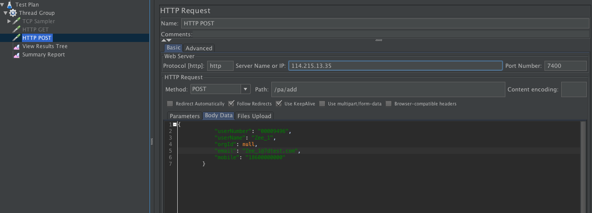

执行起来，查看下结果。

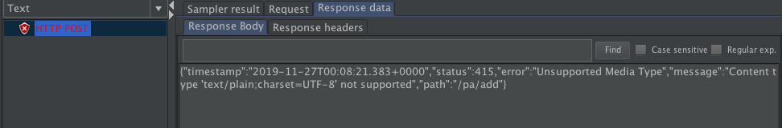

你会发现上来就错了，提示如下：

```
"status":415,"error":"Unsupported Media Type","message":"Content type 'text/plain;charset=UTF-8' not supported"

```

这里你需要注意，无论遇到什么问题，都要针对问题来处理。当看不懂问题信息时，先查资料，想办法看懂。这是处理问题的关键，我发现很多做性能测试的新同学，一旦碰到问题就懵了，晕头转向地瞎尝试。

我经常对我的团队成员说，先看懂问题，再处理问题，别瞎蒙！

上面这个问题其实提示得很清楚：“不支持的媒体类型”。这里就两个信息，一个是Content type，一个是charset。它们是JMeter中HTTP Header里默认自带的。我们要发送的是JSON数据，而JMeter默认是把它当成text发出去的，这就出现了问题。所以我们要加一个Header，将Content type指定为JSON。

加一个HTTP Header，如下所示：

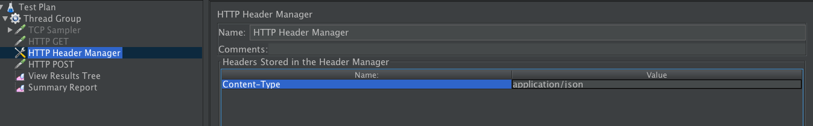

如果你不知道加什么样的Header，建议你用HTTP抓包工具抓一个看一看，比如说用Charles，抓到如下信息：

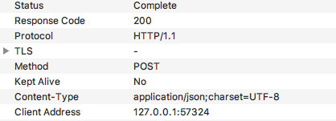

这时你就会知道头里的Content-Type原来是 `application/json;charset=UTF-8`。这里的charset=UTF-8可以不用写，因为它和默认的一样。

这时再回放，你就会看到如下结果：

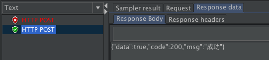

到此，一个POST脚本就完成了。是不是很简单。

在这里，我需要跟你强调的是，手工编写HTTP脚本时，要注意以下几点：

1. 要知道请求的类型，我们选择的类型和后端接口的实现类型要是一致的。
2. 业务的成功要有明确的业务判断（在下面的TCP中，我们再加断言来判断）。
3. 判断问题时，请求的逻辑路径要清晰。

编写完HTTP脚本时，我们再来看一下如何编写TCP脚本。

## 手工编写TCP脚本

### 服务端代码逻辑说明

我在这里写一个非常简单的服务端接收线程（如果你是开发，不要笑话，我只是为了说明脚本怎么写）。

```
package demo.socket;

import java.io.IOException;
import java.io.InputStream;
import java.io.OutputStream;
import java.net.ServerSocket;
import java.net.Socket;
import java.util.concurrent.ArrayBlockingQueue;
import java.util.concurrent.ThreadPoolExecutor;
import java.util.concurrent.TimeUnit;

public class SocketReceiver {
  //定义初始
  public static final int corePoolSize = 5;
  //定义最大线程池
  public static final int maximumPoolSize = 5;
  //定义socket队列长度
  public static final int blockingQueue = 50;

  /**
   * 初始化并启动服务
   */
  public void init() {
    //定义线程池
    ThreadPoolExecutor executor = new ThreadPoolExecutor(corePoolSize, maximumPoolSize, 0L,
        TimeUnit.MILLISECONDS, new ArrayBlockingQueue(blockingQueue));
    //定义serverSocket
    ServerSocket serverSocket = null;
    try {
      //启动serverSocket
      serverSocket = new ServerSocket(Constants.PORT);
      //输出服务启动地址
      System.out.println("服务已启动:" + serverSocket.getLocalSocketAddress().toString());
      //接收信息并传递给线程池
      while (true) {
        Socket socket = serverSocket.accept();
        executor.submit(new Handler(socket));
      }
    } catch (IOException e) {
      e.printStackTrace();
    } finally {
      if (serverSocket != null) {
        try {
          serverSocket.close(); //释放serverSocket
        } catch (IOException e) {
          e.printStackTrace();
        }
      }
    }
  }

  //处理请求类
  class Handler implements Runnable {

    private Socket socket;

    public Handler(Socket socket) {
      this.socket = socket;
    }

    public void run() {
      try {
        // 接收客户端的信息
        InputStream in = socket.getInputStream();
        int count = 0;
        while (count == 0) {
          count = in.available();
        }
        byte[] b = new byte[count];
        in.read(b);
        String message = new String(b);
        System.out.println(" receive request: " + socket.getInetAddress() + " " + message);

        // 睡2秒模拟思考时间，这里是为了模拟服务器端的业务处理时间
        try {
          Thread.sleep(2000);
        } catch (InterruptedException e) {
          e.printStackTrace();
        }

        // 向客户端发送确认消息
        //定义输出流outer
        OutputStream outer = socket.getOutputStream();
        //将客户端发送的信息加上确认信息ok
        String response = message + " is OK";
        //将输入信息保存到b_out中
        byte[] b_out = response.getBytes();
        //写入输入流
        outer.write(b_out);
        //推送输入流到客户端
        outer.flush();

      } catch (IOException e) {
        e.printStackTrace();
      } finally {
        // 关闭socket
        try {
          socket.close();
        } catch (IOException e) {
          e.printStackTrace();
        }
      }
    }
  }

  //程序入口
  public static void main(String[] args) {
    //定义服务端
    SocketReceiver receiver = new SocketReceiver();
    //启动服务端
    receiver.init();
  }
}

```

### 编写JMeter脚本

首先创建TCP Sampler。右键点击Thread Group - Add - Sampler - TCP Sampler即可创建。

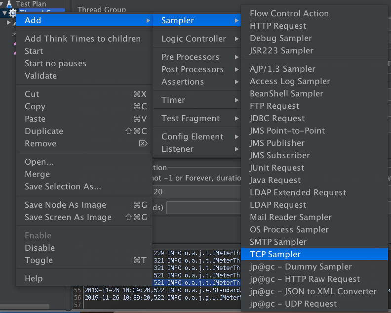

输入配置和要发送的信息。

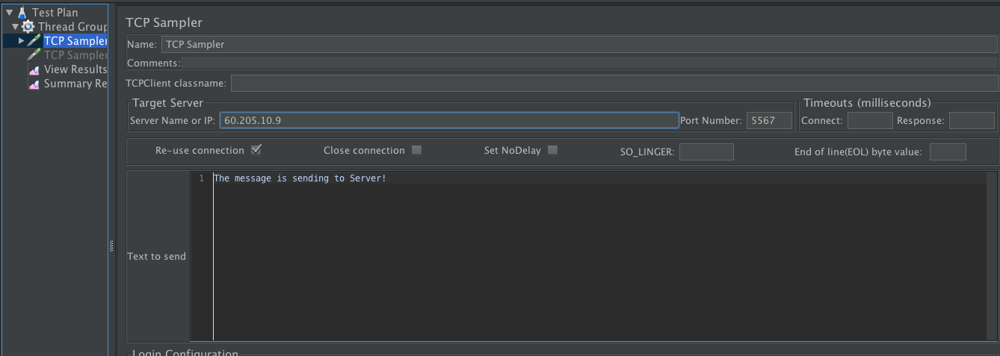

IP地址和端口是必须要输入的。对于创建一个TCP协议的JMeter脚本来说，简单地说，过程就是这样的：创建连接 - 发数据 - 关闭连接。

就这样，这个手工的脚本就完成了。

你可能会问，就这么简单吗？是的，手工编写就是这么简单。

但是（对嘛，但是才是重点），通常我们在创建TCP协议的脚本时，都是根据业务接口规范来说的， **复杂点其实不在脚本本身上，而是在接口的规则上**。

### 添加断言

我回放了一下脚本，发现如下情况：

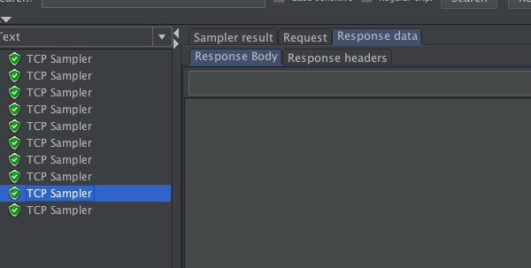

都执行对了呀，为什么下面的没有返回信息呢？这种情况下只有第一个请求有返回信息，但是下面也没有报错。这里就需要注意了。

**测试工具的成功，并不等于业务的成功**。

所以我们必须要做的就是响应断言，也就是返回值的判断。在JMeter中，断言有以下这些：

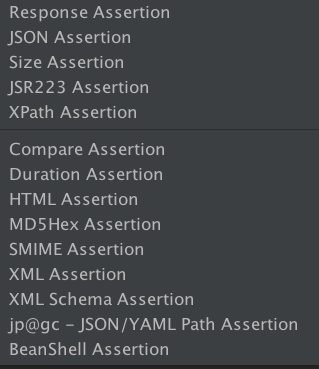

因为今天的文章不是工具的教程，所以我不打算全讲一遍。这里我只用最基础的响应断言。什么是断言呢？

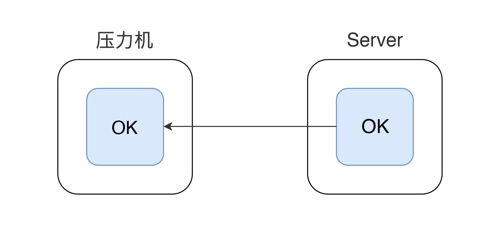

断言指的就是服务器端有一个业务成功的标识，会传递给客户端，客户端判断是否正常接收到了这个标识的过程。

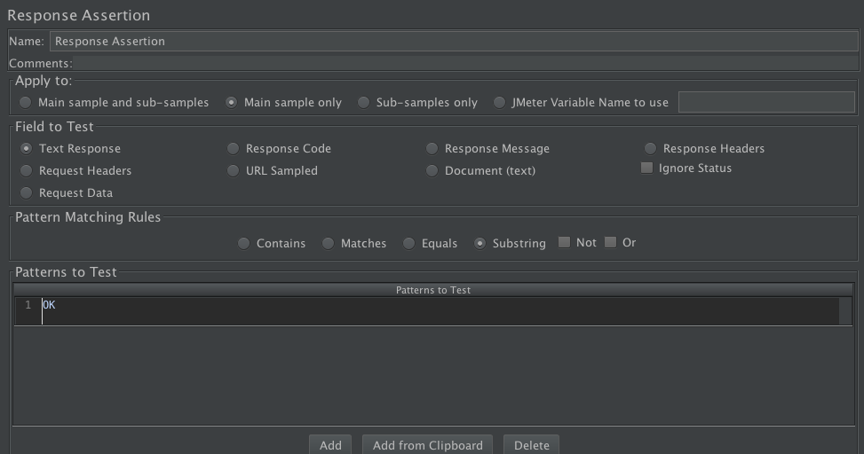

在这里我添加了一个断言，用以判断服务器是否返回了OK。 你要注意这个“OK”是从哪来的哦，它是从服务端的这一行代码中来的。

```
 String response = message + " is OK";

```

请注意，这个断言的信息，一是可以判断出业务的正确性。我在工作中发现有些人用页面中一些并不必要的文字来判断，这样就不对了，我们应该用有业务含义的判断标识。

如果我们再次回放脚本，你会发现除了第一个请求，后面9个请求都错了。

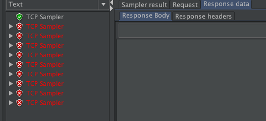

所以，在做脚本时，请你一定要注意， **断言是必须要加的**。

### 长短连接的问题

既然有错，肯定是要处理。我们查看一下JMeter的控制台错误信息：

```
2019-11-26 09:51:51,587 ERROR o.a.j.p.t.s.TCPSampler:
java.net.SocketException: Broken pipe (Write failed)
	at java.net.SocketOutputStream.socketWrite0(Native Method) ~[?:1.8.0_111]
	at java.net.SocketOutputStream.socketWrite(SocketOutputStream.java:109) ~[?:1.8.0_111]
	at java.net.SocketOutputStream.write(SocketOutputStream.java:141) ~[?:1.8.0_111]
	at org.apache.jmeter.protocol.tcp.sampler.TCPClientImpl.write(TCPClientImpl.java:78) ~[ApacheJMeter_tcp.jar:5.1.1 r1855137]
	at org.apache.jmeter.protocol.tcp.sampler.TCPSampler.sample(TCPSampler.java:401) [ApacheJMeter_tcp.jar:5.1.1 r1855137]
	at org.apache.jmeter.threads.JMeterThread.doSampling(JMeterThread.java:622) [ApacheJMeter_core.jar:5.1.1 r1855137]
	at org.apache.jmeter.threads.JMeterThread.executeSamplePackage(JMeterThread.java:546) [ApacheJMeter_core.jar:5.1.1 r1855137]
	at org.apache.jmeter.threads.JMeterThread.processSampler(JMeterThread.java:486) [ApacheJMeter_core.jar:5.1.1 r1855137]
	at org.apache.jmeter.threads.JMeterThread.run(JMeterThread.java:253) [ApacheJMeter_core.jar:5.1.1 r1855137]
  at java.lang.Thread.run(Thread.java:745) [?:1.8.0_111]

```

从字面上来看，就是通道瓦塔（被破坏）了，Broken pipe。这个提示表明客户端上没有这个连接了，而JMeter还以为有这个链接，于是接着用这个链接来发，显然是找不到这个通道，于是就报错了。

这是一个典型的压力工具这边的问题。

而服务端，只收到了一条请求。

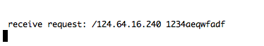

为什么会报这个错呢？因为我们代码是短链接的，服务端处理完之后，就把这个链接给断掉了。

这里是压力机上的抓包信息：

```
//从这里开始，上面已经看到了有Fin（结束）包了，后面还在发Push（发送数据）包。显然是通不了，还被服务端啪啪抽了两次reset。
11:58:07.042915 IP localhost.57677 > 60.205.107.9.m-oap: Flags [P.], seq 34:67, ack 41, win 4119, options [nop,nop,TS val 163718903 ecr 2122793206], length 33
11:58:07.046075 IP localhost.57677 > 60.205.107.9.m-oap: Flags [FP.], seq 67:331, ack 41, win 4119, options [nop,nop,TS val 163718906 ecr 2122793206], length 264
11:58:07.076393 IP 60.205.107.9.m-oap > localhost.57677: Flags [R], seq 3986768192, win 0, length 0
11:58:07.079156 IP 60.205.107.9.m-oap > localhost.57677: Flags [R], seq 3986768192, win 0, length 0

```

服务端的抓包信息：

```
//服务端也是没有办法，只能在看到了Push包之后，给回了个Reset包。
11:58:07.047001 IP 124.64.16.240.bones > 7dgroup1.enc-eps-mc-sec: Flags [P.], seq 34:67, ack 41, win 4119, options [nop,nop,TS val 163718903 ecr 2122793206], length 33
11:58:07.047077 IP 7dgroup1.enc-eps-mc-sec > 124.64.16.240.bones: Flags [R], seq 3986768192, win 0, length 0
11:58:07.054757 IP 124.64.16.240.bones > 7dgroup1.enc-eps-mc-sec: Flags [FP.], seq 67:331, ack 41, win 4119, options [nop,nop,TS val 163718906 ecr 2122793206], length 264
11:58:07.054844 IP 7dgroup1.enc-eps-mc-sec > 124.64.16.240.bones: Flags [R], seq 3986768192, win 0, length 0

```

这是为什么呢？因为在JMeter中，默认是复用TCP连接的，但是在我们这个示例中，服务端并没有保存这个连接。所以，我们应该在脚本中，把下图中的Re-use connection给去掉。

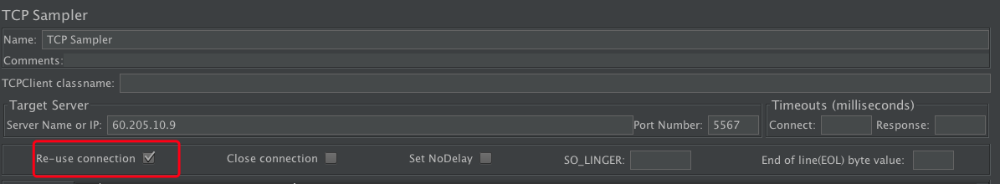

这时再回放脚本，你就会发现10次迭代全都对了。如下图所示：

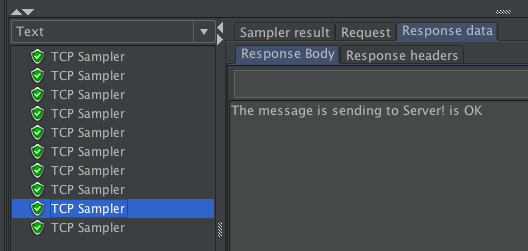

但是，这里还有一个知识点，希望你注意。短连接的时候，必然会产生更多的TCP连接的创建和销毁，对性能来说，这会让系统变得缓慢。

所以你可以看到上面10条迭代全都对了的同时，响应时间也增加了。

可能会有人问，那这怎么办呢？长短连接的选择取决于业务的需要，如果必须用短链接，那可能就需要更多的CPU来支撑；要是长连接，就需要更多的内存来支撑（用以保存TCP连接）。

根据业务需要，我们选择一个合适的就好。

### TCP连接超时

这个问题，应该说非常常见，我们这里只做问题的现象说明和解决，不做原理的探讨。原理的部分，我会在监控和分析部分加一说明。

下面这个错误，属于典型的主机连不上。

```
java.net.ConnectException: Operation timed out (Connection timed out)
	at java.net.PlainSocketImpl.socketConnect(Native Method) ~[?:1.8.0_111]
	at java.net.AbstractPlainSocketImpl.doConnect(AbstractPlainSocketImpl.java:350) ~[?:1.8.0_111]
	at java.net.AbstractPlainSocketImpl.connectToAddress(AbstractPlainSocketImpl.java:206) ~[?:1.8.0_111]
	at java.net.AbstractPlainSocketImpl.connect(AbstractPlainSocketImpl.java:188) ~[?:1.8.0_111]
	at java.net.SocksSocketImpl.connect(SocksSocketImpl.java:392) ~[?:1.8.0_111]
	at java.net.Socket.connect(Socket.java:589) ~[?:1.8.0_111]
	at org.apache.jmeter.protocol.tcp.sampler.TCPSampler.getSocket(TCPSampler.java:168) [ApacheJMeter_tcp.jar:5.1.1 r1855137]
	at org.apache.jmeter.protocol.tcp.sampler.TCPSampler.sample(TCPSampler.java:384) [ApacheJMeter_tcp.jar:5.1.1 r1855137]
	at org.apache.jmeter.threads.JMeterThread.doSampling(JMeterThread.java:622) [ApacheJMeter_core.jar:5.1.1 r1855137]
	at org.apache.jmeter.threads.JMeterThread.executeSamplePackage(JMeterThread.java:546) [ApacheJMeter_core.jar:5.1.1 r1855137]
	at org.apache.jmeter.threads.JMeterThread.processSampler(JMeterThread.java:486) [ApacheJMeter_core.jar:5.1.1 r1855137]
	at org.apache.jmeter.threads.JMeterThread.run(JMeterThread.java:253) [ApacheJMeter_core.jar:5.1.1 r1855137]
  at java.lang.Thread.run(Thread.java:745) [?:1.8.0_111]

```

time out是个如果你理解了逻辑，就觉得很简单，如果没理解逻辑，就觉得非常复杂的问题。

要想解决这个问题，就要先确定服务端是可以正常连通的。

如果不能正常连通，那么通常都是IP不正确、端口不正确、防火墙阻止之类的问题。解决了网络连通性的问题，就可以解决connection timed out的问题。

### 编写LoadRunner脚本

针对上面这个示例，如果你要想编写一个LoadRunner的示例脚本，也是简单到不行。

首先创建一个空的winsock脚本，复制下面代码到action里面。

```
//创建socket1
lrs_create_socket("socket1", "TCP", "RemoteHost=60.205.10.9:5567", LrsLastArg);
//走socket1, 发送buf1中定义的数据
lrs_send ("socket1", "buf1", LrsLastArg );
//走socket1，接收数据保存在buf2中
lrs_receive("socket1", "buf2",  LrsLastArg);
//关掉socket1
lrs_close_socket("socket1");

```

从上面的信息就可以看到，socket1这个标识是我们操作的基础。如果你在一个脚本中想处理两个socket，也是可以的，只要控制好你的标识不会乱就行。

接着再将下面的内容复制到data.ws里面。

```
send buf1 5
    "12345"

recv buf2 10

```

你可能会问，这个recv怎么不写返回的值是什么？

当你手写socket脚本的时候，都还没有运行，你怎么知道返回值是什么呢？所以这里，可以不用写。

而recv 后面的10是指接收10个字节。如果多了怎么办？截掉？！不会的，LoadRunner还是会把所有信息全部接收并保存下来，除非你提前定义了截取字符长度的函数。

最后看下我们回放的结果：

```
Action.c(6): lrs_create_socket(socket1, TCP, ...)
Action.c(7): lrs_send(socket1, buf1)
Action.c(8): lrs_receive(socket1, buf2)
Action.c(8): Mismatch in buffer's length (expected 10 bytes, 11 bytes actually received, difference in 1 bytes)
================================EXPECTED BUFFER================================
===============================================================================
================================RECEIVED BUFFER================================
	"12345 is OK"
===============================================================================
Action.c(8): callRecv:11 bytes were received
Action.c(9): lrs_close_socket(socket1)

```

看，脚本正常执行了，只是报了一个Mismatch，这是因为我们定义了buf2 是10字节，而我们实际上接收了11字节，所以这里给出了Mismatch。

到此，一个LoadRunner的手工TCP脚本就完成了。后面我们就可以根据需要，增强脚本了，加个参数化、关联、检查点等等。

## 总结

其实这篇文章只想告诉你一件事情，手工编写脚本，从基础上说，是非常简单的，只是有三点需要特别强调：

1. 涉及到业务规则和逻辑判断之后，编写脚本就复杂了起来。但是了解业务规则是做脚本的前提条件，也是性能测试工程师的第一步。
2. 编写脚本的时候，要知道后端的逻辑。这里的意思不是说，你一开始写脚本的时候，就要去读后端的代码，而是说你在遇到问题的时候，要分析整个链路上每个环节使用到了什么技术，以便快速地分析判断。
3. 写脚本是以 **最简为最佳**，用不着故意复杂。

脚本的细节功能有很多，而现在我们可以看到市场上的书籍也好，文档也好，基本上是在教人如何用工具，很少会从前到后地说明一个数据从哪发到哪，谁来处理这样的逻辑。

希望学习性能测试工具的你，不仅知其然，更知其所以然。

## 思考题

学习完今天的内容，你不妨思考一下，HTTP的GET和POST请求，在后端处理中有什么不同？断言的作用是什么？如何使用断言呢？

欢迎你在评论区写下你的思考，也欢迎把这篇文章分享给你的朋友或者同事，一起交流一下。