# 09丨关联和断言：一动一静，核心都是在取数据
对每一个性能测试工具来说，关联和断言都是应该具备的基本功能。

但是有很多新手对关联的逻辑并不是十分理解，甚至有人觉得关联和参数化是一样的，因为它们用的都是动态的数据，并且关联过来的数据也可以用到参数化中，但不一样的点是，关联的数据后续脚本中会用到，参数化则不会。断言倒是比较容易理解，就是做判断。

那么到底该怎样理解关联和断言呢？下面我们通过两个例子来思考一下。

## 关联

现在做性能测试的，有很多都是单纯的接口级测试，这样一来，关联就用得更少了。因为接口级的测试是一发一收就结束了，不需要将数据保存下来再发送出去。

那么什么样的数据需要关联呢？满足如下条件的数据都是需要关联的：

1. 数据是由服务器端生成的；
2. 数据在每一次请求时都是动态变化的；
3. 数据在后续的请求中需要再发送出去。

示意图如下：

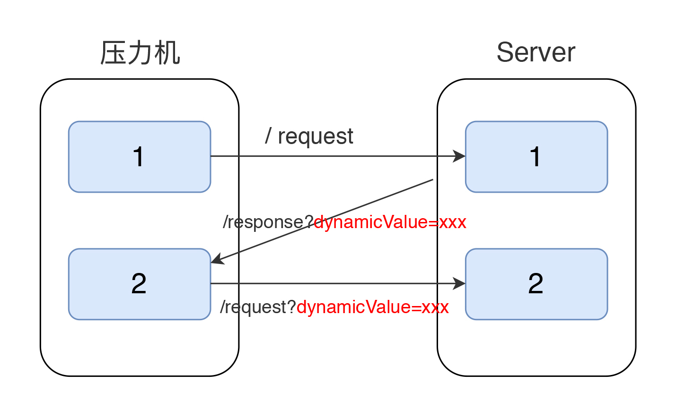

其实我们可以把关联的功能理解为取服务端返回的某个值。在这样的前提之下，我们可以把它用在很多场景之下。

举个例子，我们常见的Session ID就是一个典型的需要关联的数据。它需要在交互过程中标识一个客户端身份，这个身份要在后续的交互中一直存在，否则服务端就不认识这个客户端了。

再比如，我们现在用微服务已经非常多了，在Spring Boot中有一个spring-boot-starter-security，默认会提供一个基于HTTP Basic认证的安全防护策略。它在登录时会产生一个CSRF（Cross-Site Request Forgery）值，这个值典型地处于动态变化中。

下面我们来看一下这个值如何处理。

首先，录制登录、退出的脚本。操作如下：

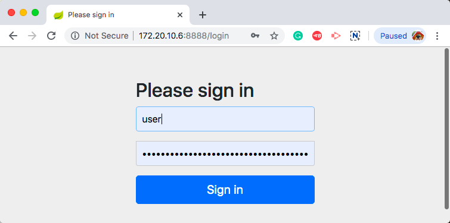

录出的脚本如下所示：

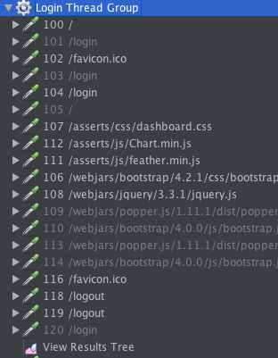

这时直接回放会得到如下结果：

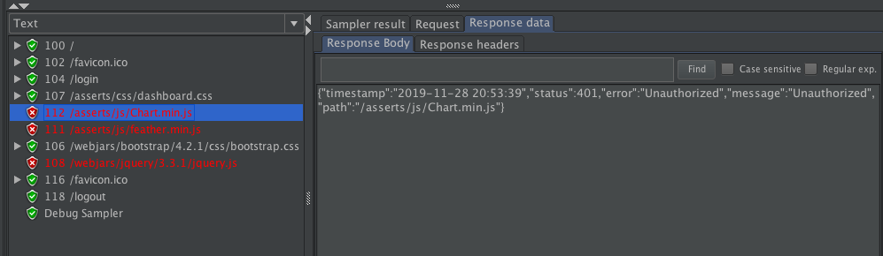

这回你会看到提示了，Unauthorized，没权限。

在回放的脚本中，我们看到了如下的登录返回信息。

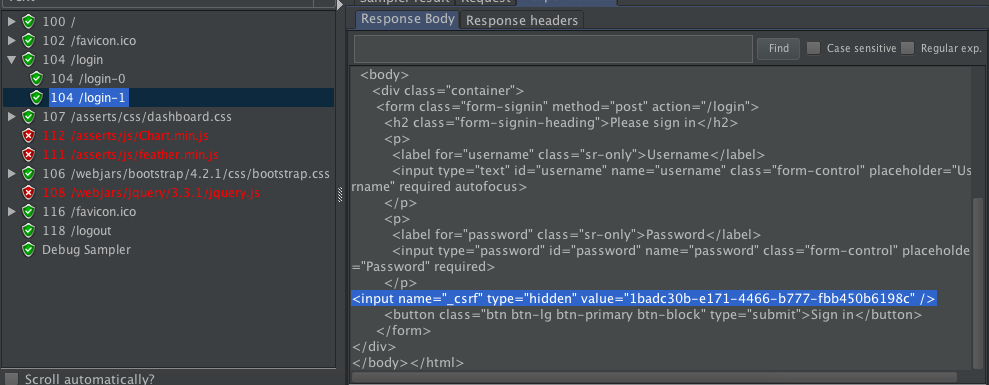

同时，在脚本中，我们可以看到登录时会使用到这个值。

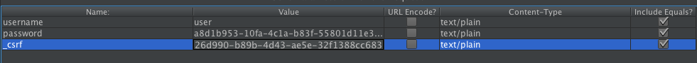

下面我们就把它关联了。

首先添加Cookies Manage。JMeter在处理CSRF时，需要添加一个Cookies manager。如下：

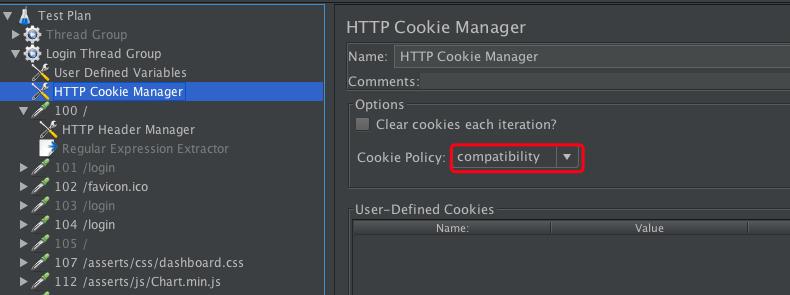

这里的Cookie Policy一定要选择compatibility，以兼容不同的cookie策略。

然后取动态值，在返回CSRF值的地方加一个正则表达式提取器来做关联。当然还有更多的提取器，我将在后面提及。

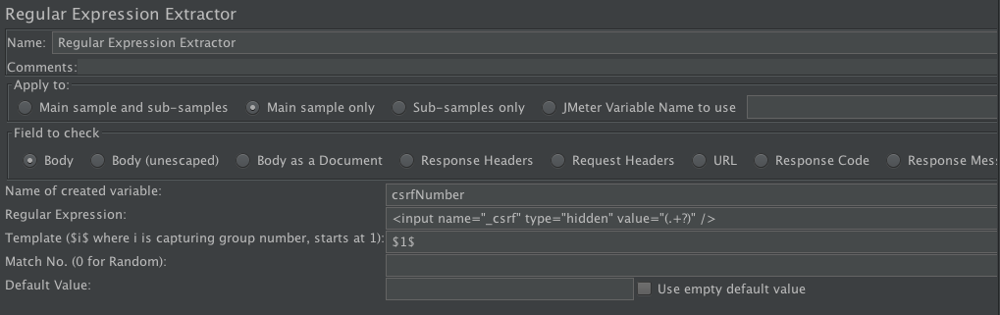

这里的 `<input name="_csrf" type="hidden" value="(.+?)" />`，就是要取出这个动态的变化值，保存到变量csrfNumber中去。

然后，发送动态值出去，将发送时的CSRF值替换成变量。

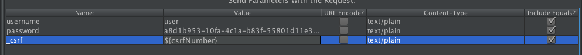

最后，再回放，就会得到如下结果。

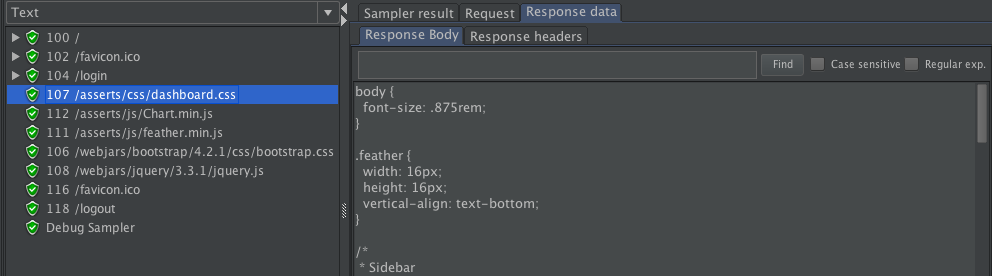

这样我们就能看到可以正常访问了。

这就是一个典型的关联过程。

上面是用的正则提取器，在JMeter中，还有其他的提取器，如下图所示：

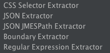

使用什么样的提取器取决于业务的需要，比如说如果你返回的是JSON格式，就可以使用上图中的JSON Extractor。

我们在很多的业务中，都可以看到大量的动态数据。所以做关联一定要有耐心，不然就会找得很混乱。

## 断言

在第8篇文章中，我们讲到手工编写脚本，有一个添加断言的动作。断言就是判断服务端的返回是不是正确的。

它的判断逻辑是这样的：

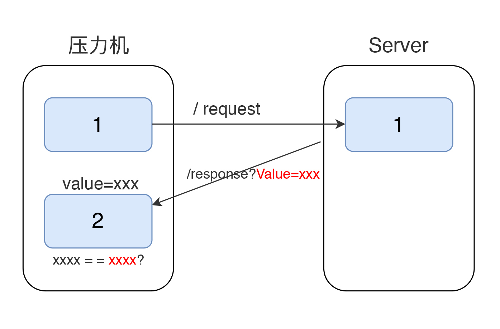

在压力工具中，我们已经知道要比对的值是什么了，接下来就看服务端返回的对不对了。下面我们来详细说一下这个逻辑。

先写一个POST接口脚本。

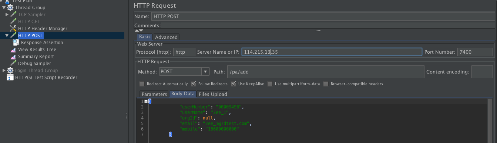

执行下，看到如下结果：


添加断言。

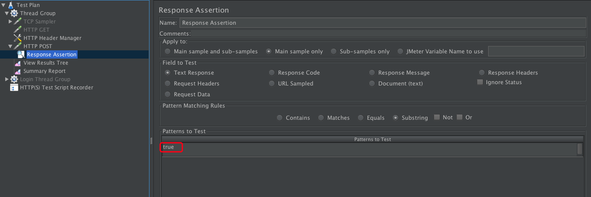

关键点来了，我们知道图片中的这个“true”服务端返回的，可是它到底是从服务端的什么地方产生的呢？

下面我们来看一下服务端的代码。处理我们的add请求的，是这样的代码段：

```
 @PostMapping("/add")
  public ResultVO<Boolean> add(@RequestBody User user) {
    Boolean result = paService.add(user);
    return ResultVO.<Boolean>builder().success(result).build();
  }

```

我们post出去的数据是：

```
{
    "userNumber": "00009496",
    "userName": "Zee_2",
    "orgId": null,
    "email": "Zee_2@7dtest.com",
    "mobile": "18600000000"
}

```

代码中对应的是：

```
@Override
    public String toString() {
        return "User{" +
            "id='" + id + '\'' +
            ", userNumber='" + userNumber + '\'' +
            ", userName='" + userName + '\'' +
            ", orgId='" + orgId + '\'' +
            ", email='" + email + '\'' +
            ", mobile='" + mobile + '\'' +
            ", createTime=" + createTime +
            '}';
    }

```

ID是自增的：

```
  @Id
    @GeneratedValue(strategy = GenerationType.IDENTITY, generator = "select uuid()")
    private String id;

```

然后由paServer.add添加到数据库里去：

```
Boolean result = paService.add(user);

```

add的实现是：

```
  public Boolean add(User user) {
    return mapper.insertSelective(user) > 0;
  }

```

这就是一个关键了。这里return的是 `mapper.insertSelective(user) > 0` 的结果，也就是一个true，也就是说，这时在数据库中插入了一条数据：

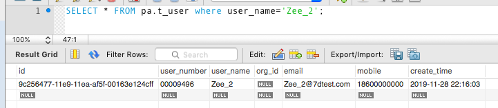

然后，build返回信息：

```
public ResultVO<T> build() {
      return new ResultVO<>(this.code, this.msg, this.data);
    }

```

这个时候，我们才看到下面的提示信息：

```
{"data":true,"code":200,"msg":"成功"}

```

也就是说，在数据库中成功插入1条数据之后，把1>0的判断结果，也就是true返回给result这个变量，然后通过 `public ResultVO<Boolean> add(@RequestBody User user)` 中的ResultVO返回给压力工具。

用图片来说的话，逻辑就是下面这样的：

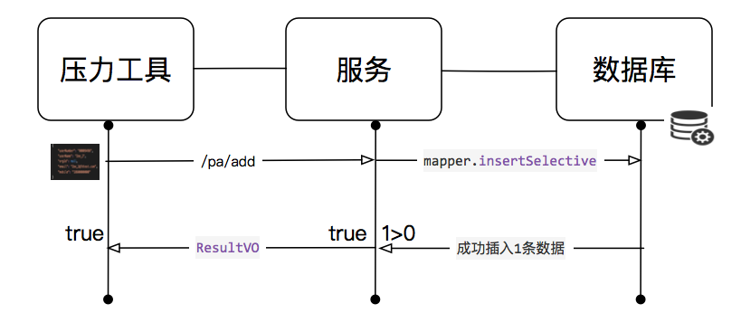

通过这一系列的解释，我就是想说明一个问题：断言中的true是从哪来的。

知道了这个问题的答案之后，我们就能理解，为什么这个true很重要了。因为有了它，就说明我们在数据库成功插入了数据。

断言是根据需要来设计的，而设计断言的前提就是完全理解这个逻辑。

当然我们也可以直接这样来写Controller：

```
 public String add(@RequestBody User user) {
    Boolean result = paService.add(user);
    return "Added successfully!";
  }

```

这时就没有true了。脚本运行结果如下：

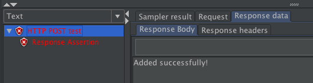

这时断言看似是失败的，因为我们断言判断的是“true”，但服务端没有返回“true”这个字符。而实际上，当我们从数据库中查看时，插入是成功的。

但是这种写法是有问题的，不管数据有没有插入成功，只要在add方法执行了，就会提示“ `Added successfully!`”。

在实际的工作中，也有开发这样写代码，这样的话，断言似乎都是对的，事务也是成功的，但实际上数据库中可能没有插进去数据。

## 总结

实际上，关联和断言的前半部分是一样的，都是从服务器返回信息中取出数据。但不同的是，关联取来的数据每次都会不同；而断言取出来的数据基本上都是一样的，除非出了错。

对服务端生成的，并且每次生成都不一样的动态变化的数据，那么将其 **取回来之后，在后续的请求中使用**，这种逻辑就是关联。

对服务端返回的，可标识业务成功与否的数据，将其取回来之后，做判断。这种逻辑就是断言。

## 思考题

最后给你留道思考题吧，你能说一下关联和断言的逻辑是什么吗？它们取数据的特点又是什么呢？

欢迎你在评论区写下你的思考，我会和你一起交流，也欢迎把这篇文章分享给你的朋友或者同事，一起交流进步。