# 10丨案例：在JMeter中如何设置参数化数据？
今天我们来做一个实例，看下在JMeter中，如何合理地设置参数化数据。

## 正式场景前的基准测试

在没有做业务混合场景之前，我们需要先做Benchmark测试，来确定一个登录业务能支持多少的业务量，这样就可以在业务混合场景中，根据场景中各业务的比例来确定登录的数据需要多少真实的数据。

我们继续用上一篇文章中用户登录的例子，单独测试登录业务，结果如下：

```
Java
summary +    125 in 00:00:04 =   31.0/s Avg:    28 Min:     0 Max:   869 Err:     0 (0.00%) Active: 1 Started: 1 Finished: 0
summary +   3404 in 00:00:30 =  113.2/s Avg:    31 Min:     0 Max:   361 Err:     0 (0.00%) Active: 6 Started: 6 Finished: 0
summary +   4444 in 00:00:30 =  148.4/s Avg:    57 Min:     0 Max:   623 Err:    10 (0.23%) Active: 11 Started: 11 Finished: 0

```

从上面的结果可以看到登录业务能达到的TPS是113左右，这里我们取整为100，以方便后续的计算。

## 在测试工具中配置参数

在上面的试探性测试场景中，不需要观察系统的资源，只需要根据TPS做相应的数据统计即可。

前面我们知道，在这个示例中只做了近10万条的用户数据，为了方便示例进程。

下面我们从数据库中查询可以支持登录5分钟不重复的用户数据。根据前面的公式，我们需要30000条数据。

```
Java
100x5mx60s=30000条

```

接下来连接数据库，取30000条数据，存放到文本中，如下所示：

```
Java
username,password
test00001,test00001
test00002,test00002
test00003,test00003
test00004,test00004
test00005,test00005
test00006,test00006
test00007,test00007
...................
test30000,test30000

```

## 参数化配置在JMeter中的使用说明

我们将这些用户配置到测试工具的参数当中，这里以JMeter的CSV Data Set Config功能为例。配置如下：


在JMeter的参数化配置中，有几个技术点，在这里说明一下。

“Allow quoted data?”这里有两个选择，分别是False和True。它的含义为是否允许带引号的数据，比如说在参数化文件中有这样的数据。

```
Java
"username","password"
"test00001","test00001"
"test00002","test00002"
...................
"test30000","test30000"

```

如果有引号，这个选择必须是True。如果设置为False，那么我们在脚本中会看到如下的数据：

```
Java
username=%22test00001%22password=%22test00001%22

```

由于设置为False，JMeter将（"）转换为了%22的URL编码，很显然这个数据是错的。如果选择为True，则显示如下：

```
Java
username=test00001password=test00001

```

这里就显示对了。

除此之外，还有如下几个功能点需要说明：

- Recycle on EOF? ：这里有三个选择，False、True和Edit。前两个选择非常容易理解。False是指在没有参数的时候不循环使用；True是指在没有参数的时候循环使用。Edit是指在没有参数的时候会根据定义的内容来调用函数或变量。
- Stop thread on EOF?：这里有三个选择，False、True和Edit。含义和上面一致。
- Sharing mode : 这里有四个选择，All threads、Current thread group、Current thread、Edit。

Sharing mode的前三个选择是比较容易理解的，参数是在所有线程中生效，在当前线程组生效，还是在当前线程中生效。但这里的Edit和前两个参数中的Edit相比，有不同的含义。这里选择了Edit之后，会出现一个输入框，就是说这里并不是给引用函数和参数使用的，而是要自己明确如何执行Sharing mode。那如何来使用呢？

举例来说，假设我们有Thread Group 1-5 五个线程组，但是参数化文件只想在Thread Group 1、3、5中使用，不想在线程组2、4中使用，那么很显然前面的几个选项都达不到目的，这时我们就可以选择Edit选项，在这里输入 `SharedWithThreadGroup1and3and5`。而在其他的线程组中配置其他参数化文件。

也就是说同样的一个变量名，在线程组1/3/5中取了一组数据，在线程组2/4中取了另一组数据。

以上三个参数的选项可以随意组合。于是就会得到如下表。

**需要注意的是，EOF是文件结束符的意思。在下面的解释中，为了更符合性能测试中的术语，特意解释为参数不足时。**

以上三个功能点根据参数设计得不同，会产生不同的组合，我们依次查看一下。

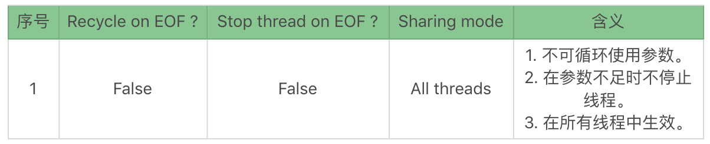

这个组合显然是矛盾的，没有参数时不让循环，还不让停止线程，这不是耍流氓吗？真实的结果是什么呢？当我们执行时就会发现，参数变成了这样：

```
username=%3CEOF%3E&password=%3CEOF%3E

```

服务端果然返回了： `{"flag":false,"errMsg":"账号不存在"}`。

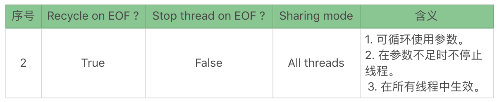

这个组合中第二个选项显然是没意义的，既然参数允许重复使用了，又怎么会发生参数不足停止线程的情况呢？

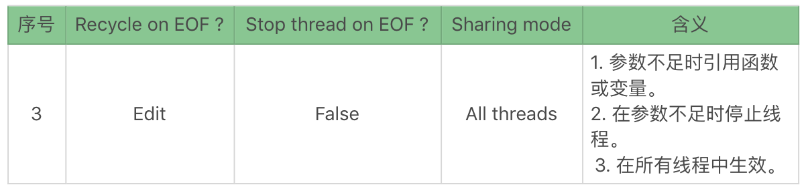

这个组合因为第一个选项为“Edit”所以变得不确定了，如果在Edit的函数或变量返回为True，则和第2种组合一样；如果返回为False，则和第1种组合一样。

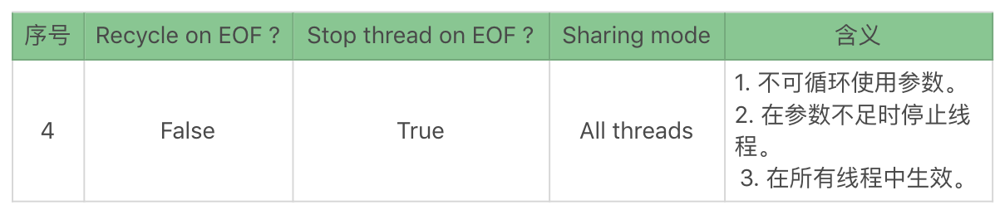

这是一个完全合情合理的组合！

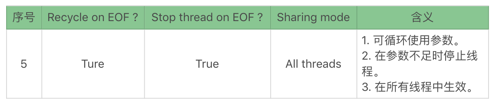

同第二个组合一样，第二个选项显然没有意义。

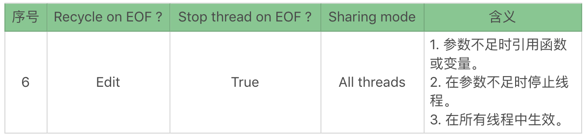

这个组合同样因为第一个选项为Edit，所以变得不确定了，如果在Edit的函数或变量返回为True，则和第3种组合一样；如果返回为False，则和第4种组合一样。

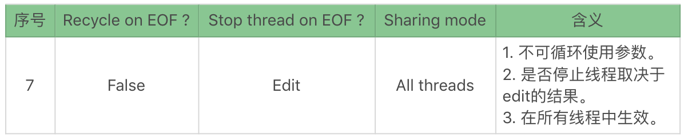

这个组合因为是否停止线程的不确定性会出现两种可能，有可能是第1种组合，也有可能是第4种组合。

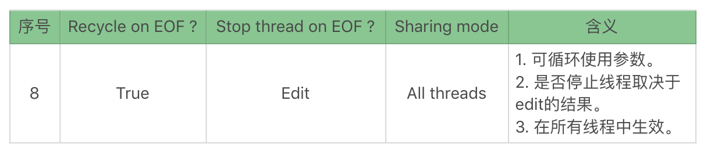

这个组合中是否停止线程的Edit配置没有意义，因为可循环使用参数，所以不会发生参数不足导致线程停止的情况。

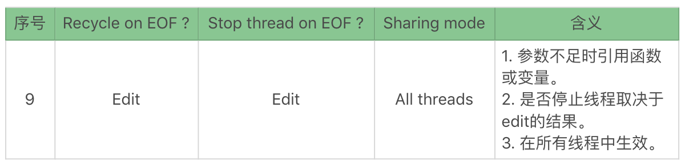

这是一个古怪的组合，具有相当的不确定性，有可能变成第1、2、4、5种组合。

下面我们再来看下其他衍生的设置组合。

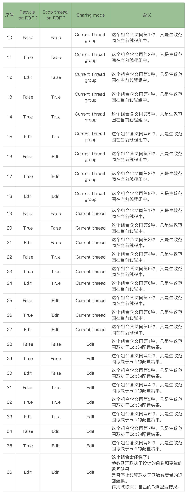

## 真实场景下的JMeter参数配置和执行结果

根据以上的描述，我们先用10个用户来测试下，将Stop `thread on EOF?` 改为True，将 `Recycle on EOF?` 改为False，其他不变。同时将线程组中配置为1个线程循环11次。这样设置的目的是为了看在数据不足时，是否可以根据规则停掉线程组。如下所示：


线程组配置如下：

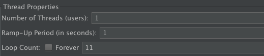

执行之后，我们会在日志中看到如下信息：

```
Java
2019-09-05 22:56:30,171 INFO o.a.j.t.JMeterThread: Stop Thread seen for thread Thread Group 1 1-1, reason: org.apache.jorphan.util.JMeterStopThreadException: End of file:/Users/Zee/Downloads/user10.csv detected for CSV DataSet:CSV Data Set Config configured with stopThread:true, recycle:false

```

可以看到在参数用完又不可循环使用参数的情况下，JMeter主动停止了线程。

我们延续使用上文中场景二的条件，即希望场景中每个线程的每次迭代都用不同的数据。

为了能很快地整理出实际的结果，我们只使用10条数据来模拟，条件设置如下：

```
线程组：2
线程（每线程组）：6
参数化数据：10条

```

执行完场景后，会在日志中看到如下信息：

```
Java
2019-09-07 23:24:25,585 INFO o.a.j.t.JMeterThread: Stop Thread seen for thread Thread Group 1 1-1, reason: org.apache.jorphan.util.JMeterStopThreadException: End of file:/Users/Zee/Downloads/user10.csv detected for CSV DataSet:CSV Data Set Config configured with stopThread:true, recycle:false
2019-09-07 23:24:25,452 INFO o.a.j.t.JMeterThread: Stop Thread seen for thread Thread Group 1 1-2, reason: org.apache.jorphan.util.JMeterStopThreadException: End of file:/Users/Zee/Downloads/user10.csv detected for CSV DataSet:CSV Data Set Config configured with stopThread:true, recycle:false
2019-09-07 23:24:23,406 INFO o.a.j.t.JMeterThread: Stop Thread seen for thread Thread Group 2 2-1, reason: org.apache.jorphan.util.JMeterStopThreadException: End of file:/Users/Zee/Downloads/user10.csv detected for CSV DataSet:CSV Data Set Config configured with stopThread:true, recycle:false
2019-09-07 23:24:25,517 INFO o.a.j.t.JMeterThread: Stop Thread seen for thread Thread Group 2 2-2, reason: org.apache.jorphan.util.JMeterStopThreadException: End of file:/Users/Zee/Downloads/user10.csv detected for CSV DataSet:CSV Data Set Config configured with stopThread:true, recycle:false

```

可见所有的线程都按我们的配置停止了线程，同时各线程取得参数如下表所示：

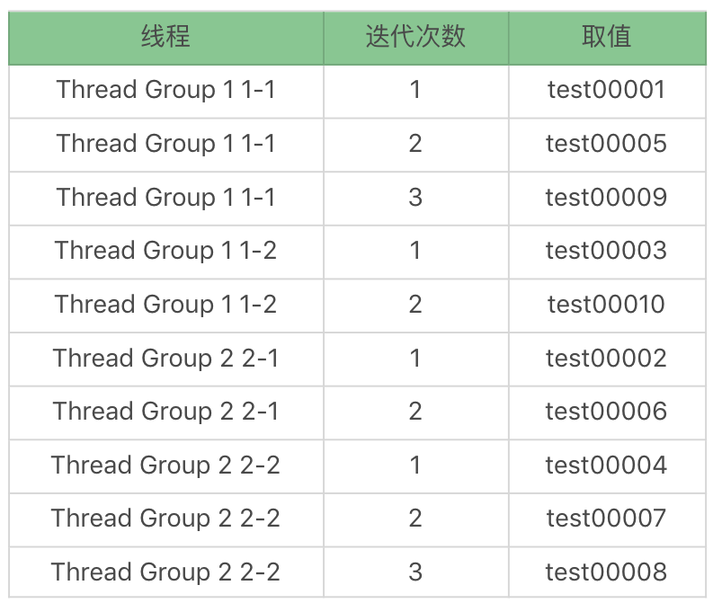

每次执行场景会有不同，不同点是线程组1有可能执行6次，而线程组2只执行4次；或者线程组1中的线程2执行次数比线程1执行次数多。但总体执行次数会是10次。

如果数据可以被线程平均分配，则每个线程的迭代次数会相同。如果数据不能被线程平均分配，则每个线程的迭代次数不会相同，但相差不会大。

## 参数化配置在LoadRunner中的使用说明

在LoadRunner中参数配置页面如下：

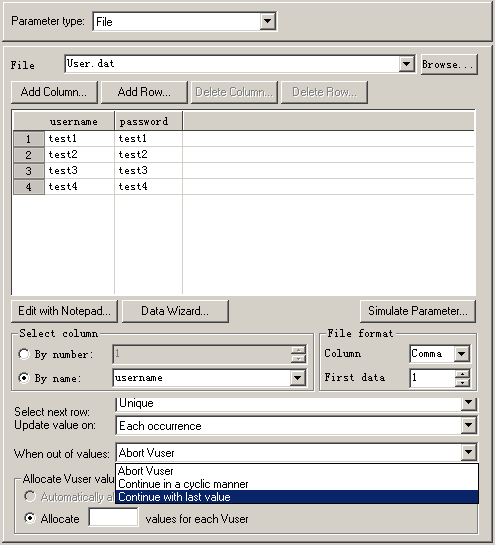

它的取值组合如下所示：

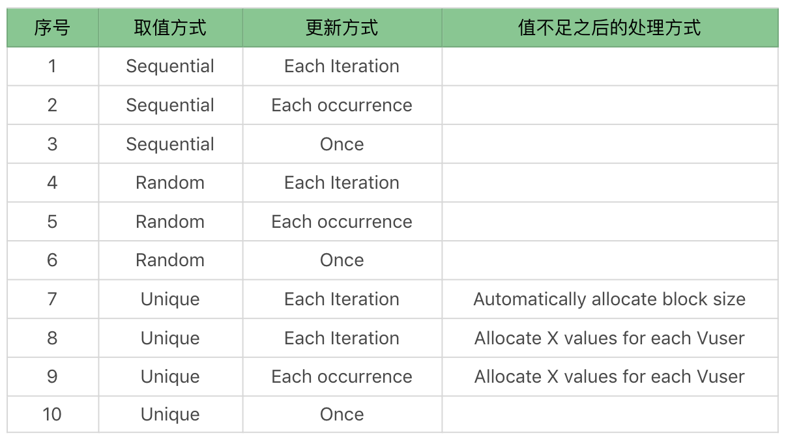

以上的组合中，组合7对应着上文中JMeter真实场景中每次迭代取不同数据的组合，即JMeter中的参数组合4。

## 总结

通过今天的内容，我们对性能测试中的参数化做了一次解析，在执行性能测试时，我们需要根据实际的业务场景选择不同的数据量和参数设置组合。

不同的压力工具在参数化的实现逻辑上也会不同，但是参数化必须依赖业务逻辑，而不是工具中能做到什么功能。所以在参数化之前，我们必须分析真实业务逻辑中如何使用数据，再在工具中选择相对应的组合参数的方式去实现。

这里我总结一下性能工作中参数化的逻辑，希望对你有所启发。

1. 分析业务场景；
2. 罗列出需要参数化的数据及相对应的关系；
3. 将参数化数据从数据库中取出或设计对应的生成规则；
4. 合理地将参数化数据保存在不同的文件中；
5. 在压力工具中设置相应的参数组合关系，以便实现模拟真实场景。

通过以上步骤，我们就可以合理的参数化数据，模拟出真实场景。

## 思考题

你可以思考一下下面几个问题：

1. 为什么参数化数据要符合生产环境的数据分布？
2. 为什么参数化数据要关注组合逻辑关系，而不是随意设置组合？

欢迎你在评论区写下你的思考，也欢迎把这篇文章分享给你的朋友或者同事，一起交流一下。