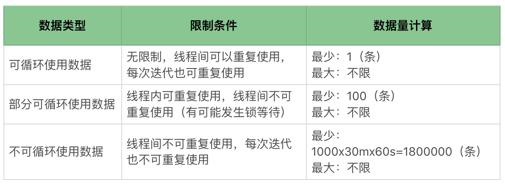
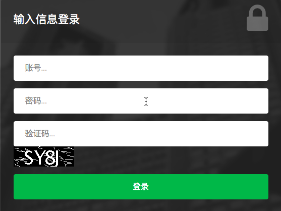
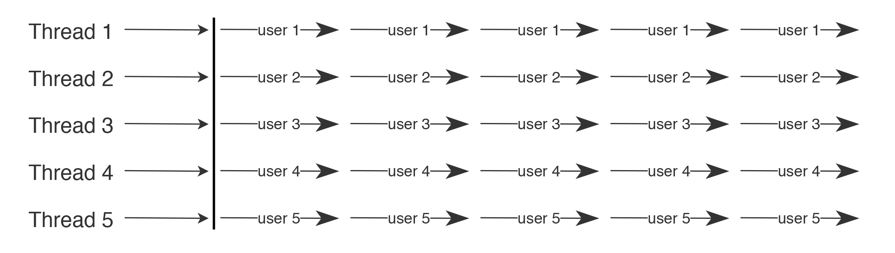
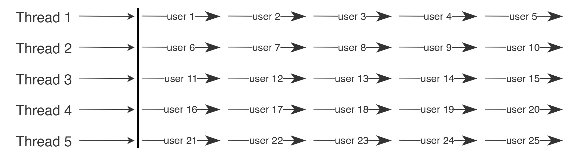
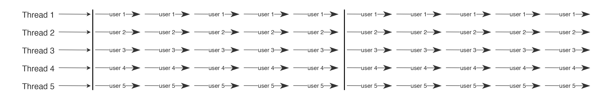
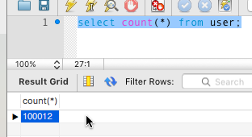
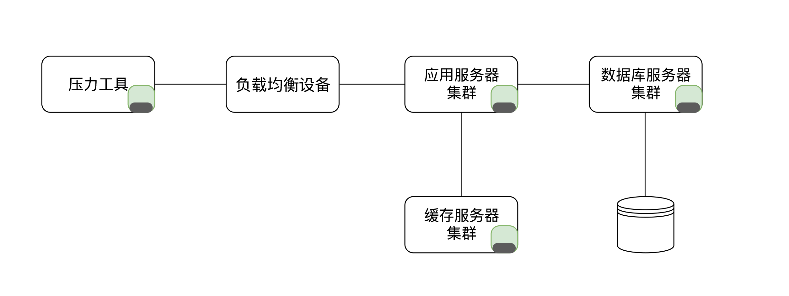
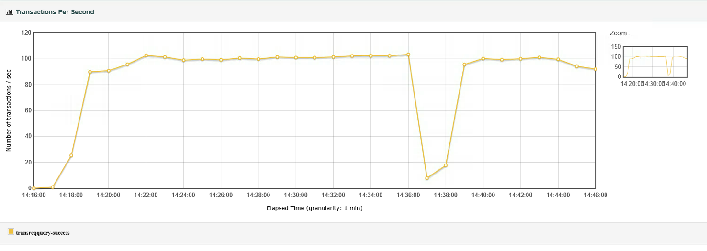

# 12丨性能场景：做参数化之前，我们需要考虑什么？
在性能测试中，我们要关注的数据主要有以下几类，分别是参数化数据、监控数据和基础铺底数据。

我们今天先描述第一种参数化数据，在后面的文章中再描述其他数据。

首先我们需要了解，为什么要关注性能场景中的参数化数据呢？我以下面的两个例子说明一下。

在我的工作经历中，见过很多初级性能测试工程师不知道如何设置合理的参数化数据，以至于数据会出现这两种情况。

1.数据不均衡

有些人直接用同一个数据执行混合场景测试，在这种情况下对服务器的压力和真实环境下的完全不一样。有时我们不得不造很多参数化数据，也有很多工程师不考虑数据库表中的数据直方图，就直接在少量的参数化数据中创建了大量的相关记录。比如说，在电商系统中造出大量的购买记录；在银行系统中造出大量的个人流水记录。

这些都不能满足真实用户场景的需要，导致的结果就是整个测试结果都毫无意义。

2.参数化数据量不足

有时候，如果我们选择用非常少量的数据运行大量业务操作的场景，就会导致压力和真实生产环境完全不一致。比如说，用100个数据运行出上万甚至上亿的业务操作。

那么到底该怎样才能合理地设置参数化数据呢？

## 参数化数据的疑问

根据我的经验，在参数化测试数据的获取和考虑上，我们一般会有以下四个常见的疑问。

1. 参数化数据应该用多少数据量？
2. 参数化数据从哪里来？
3. 参数多与少的选择对系统压力有什么影响？
4. 参数化数据在数据库中的直方图是否均衡？

接下来，我们对这些问题一一做出解答。

## 参数化数据应该用多少数据量？

首先，参数化数据要用到多少取决于场景，举例来说，对一个压力工具线程数为100，TPS有1000的系统，如果要运行30分钟，则应该取得的参数化数据是下面这样的。

数据类型、限制条件和数据量计算的方式如下表所示：



从技术角度看，根据数据类型就可以确定应该用多少条参数化数据了。但是这样考虑就够了吗？当然是不够的。因为除了技术的限制之外，还有业务场景的需求。

### 根据业务场景计算参数化数据量

在性能场景中，我们需要根据实际的业务场景来分析需要用到什么样的数据，以便计算数据量。这里的数据类型包括可循环使用的数据和不可循环使用的数据。用户登录是一个在各行业中几乎都会遇到的事务，我们拿它来举例说明，下面这张图是一个用户登录的界面。



这里需要用到两种数据，一个是帐号，一个是密码。帐号和密码一定是可以真实登录到系统的，不然无法完成后续的业务。很显然对于登录来说，不同的人一定是用不同的用户登录的。

### 场景一

首先我们来看下场景一。有时候我们做脚本时考虑的是，有多少线程（Thread）就配置多少用户，让每个线程在同一个用户上循环执行。

如下图所示：



需要注意的是，在本文中，每一个“—user1→”代表一次脚本完全的迭代。

这样的用户参数化配置，只能满足一些比较特定的场景。比如说，用户在早上登录系统之后，一直在系统中带着登录session做业务操作，并且不会退出，只有在下班时才退出系统。

当我们要模拟一天中的业务峰值时，可以像上面这样配置。登录一次，循环使用同一用户的Session信息。这就是前面提到的部分可循环数据。

在这样的场景中，有多少线程就需要准备多少用户数据。即：

```
Java
用户数据=线程个数

```

### 场景二

但在有些场景中，这是完全错误的配置方式。比如说电商系统，用同一个用户账号不停循环购买商品，就是不符合真实场景的。

这时侯怎么办？我们可以用在压力测试工具中模拟出来的线程的每一次迭代来代表一个用户，如下所示：



这就是不可循环使用的数据。在这样的场景中，就需要考虑场景的TPS和持续时间了。用户数据的计算方法是：

```
Java
tpsx持续时间（秒级）

```

我们举个例子，假如有一个100TPS的场景，持续30分钟。那么计算方式如下：

```
Java
100x30*60=180000（条用户数据）

```

这里再多说一句，压力工具的线程数量也并不是常说的并发数的概念。这个我们在 [前面](https://time.geekbang.org/column/article/181916) 已经说得很清楚了。

### 场景三

但是还有一种情况，就是在一个线程之中，可以循环使用固定条目的数据。如下所示：



在这种情况下，我们就需要根据实际的业务场景判断了。在100压力线程的场景中，如果准备了1000条数据，就可以让每个线程用10个不同的数据。

这样的场景没有固定的条数限制，只能根据实际的业务判断。

所以在配置参数之前，我们需要先判断这个参数是什么类型的数据。

如果是可循环使用的数据，那么它在真实的性能场景中非常少，也就是说只使用一条或几条测试数据的真实业务场景是非常少的。

## 参数化数据从哪里来？

计算了参数化数据量之后，还有一个重要的问题需要解决，就是参数化数据从哪里来呢？这一步的目的是要确保参数的有效性。

参数化数据从大体上划分，主要有两个来源。

### 第一类

用户输入的数据在后台数据库中已存在，比如我们上面示例中的用户数据。这类数据的特点是什么呢？

1. 存在后台数据库中；
2. 需要用户主动输入；
3. 用户输入的数据会和后台数据库中的数据做比对。

这类数据必须查询数据库之后再参数化到工具中。

### 第二类

用户输入的数据在后台数据库中不存在。在业务流中，这些数据会Insert或Update到数据库中。这类数据的特点是什么呢？

1. 数据库中原本不存在这些数据；
2. 在脚本执行成功后会将这些数据insert或update到数据库中；
3. 每个用户输入的数据可能相同，也可能不同，这取决于业务特点。

这类数据必须通过压力工具做参数化，同时也必须满足业务规则。

我同样用前面的用户参数为例，由于用户登录的时候一定要和数据库中的用户数据做比对，只有用户名密码都完全正确的情况下才可以成功登录，所以这样的用户参数一定要从后台数据库中查询得到。

在本例中，通过后台数据库用户表的查询真实可用的用户数共有10万。



如果在业务场景中，是不可循环使用的用户数据，那么很显然，在可以支持100TPS并发的系统中，这些用户数量只够使用16.67分钟。

```
Java
100000/100/60=16.67（分钟）

```

总之，参数化时需要确保数据来源以保证数据的有效性，千万不能随便造数据。这类数据应该满足两个条件：

1. 要满足生产环境中数据的分布；
2. 要满足性能场景中数据量的要求。

## 参数取多与少对系统压力有什么影响？

根据上文中的第二个条件，这里就要说一下数据量的要求了。

从经验上判断，对一个系统来说，获取的参数化数据是否合理，会直接影响压力测试的结果有没有意义。

我们根据下面这张图来理解一下数据在系统中的流转。



这张图中，绿色部分代表数据在各系统中的正常大小，而黑色部分代表压力工具中使用的数据量大小。如果压力工具使用的数据量少，那么应用服务器、缓存服务器、数据库服务器，都将使用少量的缓存来处理。

显然图中所示的黑色部分是很少的，完全不能把后端各类服务器的缓存占用到真实场景中应该有的大小，所以在这种状态之下是测试不出来真实场景下的压力的。

对数据库连接的存储设备来说同样也有影响。如果数据量少，则相应的存储的I/O使用就少。对于一个没有被Cache的数据来说，首次使用肯定会触发I/O，也就是会产生寻址、PageFalut等情况。

参数取得过多，对系统的压力就会大；参数取得过少，不符合真实场景中的数据量，则无法测试出系统真实的压力。

## 参数化数据在数据库中的直方图是否均衡？

对于参数化数据来说，如果数据取自于数据库，我们通常要检查一下数据库中的数据直方图。 对于直接从生产上拿的数据来说，数据的分布更为精准。但是对于一些在测试环境中造的数据，则一定要在造数据之后，检查下数据分布是否与生产一致。

我们以一个案例开始。

在性能场景执行过程中，有一个业务的TPS如下图所示：



很明显，图中TPS中间掉下来的情况是非常不合理的。

为什么会导致这个情况呢？在这个示例中，这种现象是由抽取的数据量不合理导致的，我们来看一下数据分布。

```
客户iD，客户流水记录数
'客户ID1', '69865'
'客户ID2', '55075'
......
'客户ID5374728, '177'
'客户ID5374729', '176'
'客户ID5374730', '175'

```

显然通过统计之后，我们可以发现客户的流水记录数是完全不均衡的，而这个业务脚本是会返回客户的流水记录的。当用到记录数多的客户ID时，就会导致TPS严重下降，这是因为这些数据都要从存储设备中获取，一旦数据量多，就会导致一系列的资源开销；而用到记录数少的客户ID时，TPS就很高。

那么针对这种情况，我们该怎么处理呢？

首先分析业务逻辑，确认客户流水是否应该这么多。在这个场景中，我们分析过业务，客户的流水通常情况下都会在100~200之间，这是合理的情况，而上万的数据量就是完全不合理的。

然后我们过滤掉不合理的数据即可。

这样得到的参数化数据就符合真实场景了。

## 总结

在今天的文章中，需要你领悟到的是，参数化数据的合理性对性能场景有着举足轻重的作用。通常，我们在做参数化数据之前，需要先分析实际业务的逻辑。比如说：

1. 什么数据是唯一的？什么数据是可重复使用的？
2. 数据是客户主动输入，后端只保存即可，还是客户输入后，后端需要比对？

这些都是我们在做参数化之前要分析的部分。而参数化的数据量的重要性，不仅和业务需求相关，也和数据存储和查询的方式相关。这个话题我们在后面也会讨论到。

## 思考题

如果你吸收了这篇文章的内容，不妨思考一下下面这两道题：

1. 参数化数据的分析重点是哪些？在不同的场景中为什么参数化数据有如此大的差异？
2. 参数化数据的来源和获取要符合哪些规则？当不符合获取规则时，会产生什么问题？

欢迎你在评论区写下你的思考，也欢迎把这篇文章分享给你的朋友或者同事，一起交流学习一下。