# 13丨性能测试场景：如何进行场景设计？
我们在前面屡次强调了场景的重要性，今天终于到了要把实际场景拿出来解析的时候了。

在本篇文章中，为了保证数据的连续性，我用之前的项目资料来作明确地说明。同时为了模糊关键业务信息，以及让场景的描述更通用性，我会把所有的业务名隐去。

根据之前我们所说的，基准性能场景是为了测试出单业务的最大容量，以便在混合容量场景中判断哪个业务对整体容量最有影响。

今天的场景设计需要说明两个前提条件：

1. 这些业务都是实时的业务，不涉及批处理、大数据等业务。
2. 因为本篇着重讲场景的设计和具体项目的操作，所以不加系统资源的分析，避免信息混乱。

在这个场景设计中，首先，我们要列出自己要测试的业务比例、业务目标TPS和响应时间指标。

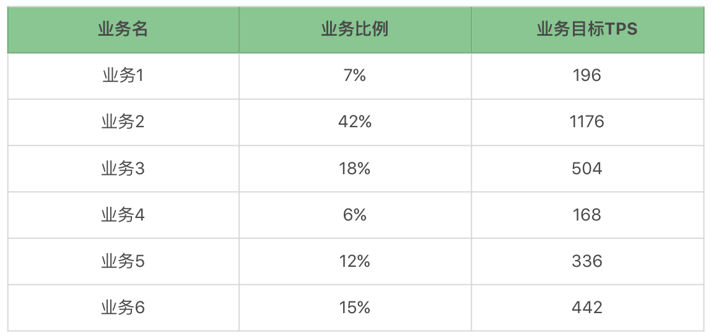

在这个项目中，响应时间指标是统一的，就是不大于100ms。

其实我们在做项目的时候，经常会这样制定一个统一的响应时间指标，这样做也不是完全因为懒，更多的是根本不知道如何定每个业务的时间。但我们性能测试人员要知道，这显然是不对的，因为业务不同，响应时间指标也应该不同，合理的做法是给出每个业务的响应时间指标。下面我们还会遇到响应时间定得不够细致的问题。

有了这个列表，下一步就是做基准性能测试了。

## 基准性能场景

有很多人做接口测试的时候，觉得接口的TPS真是高呀，于是就按照最高的TPS跟老板汇报。但我们一定要知道的是，接口的TPS再高，都无法说明容量场景的情况，除非这个服务只有这一个接口，并且也只为了测试服务，这时就不必有混合的情况了。

首先，我们要知道，每个业务在系统中的最大容量是多少。那么接下来，我们用上面的业务一个一个地做基准，看看结果如何。

### 业务1

场景执行时长：17分钟。

先看Statistics。

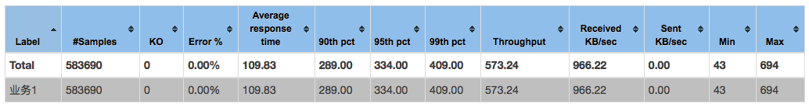

很多人喜欢用这个表中的数据来做报告，特别是90th pct、95th pct、99th pct。我不是说不能用，但是，我们要先知道这个场景是什么样，再来确定这些值是不是可以用。

从上图来看，TPS达到573.24，平均响应时间是109.83ms，发送字节很少，这里都没统计到，接收字节966.22KB/sec，这个值也非常低，最小响应时间43ms，最大响应时间694ms。

但是！这能说明什么呢？什么都说明不了呀。是好是坏？不知道呀。所以我们还需要看其他图。

我们先看一下线程图。

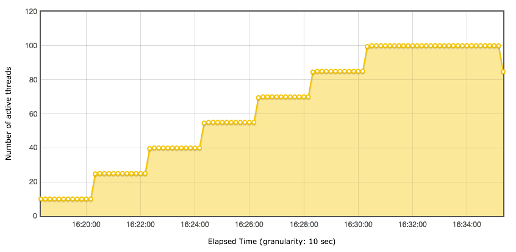

以每分钟15个用户的速度往上递增。

对应的响应时间图是下面这样的。

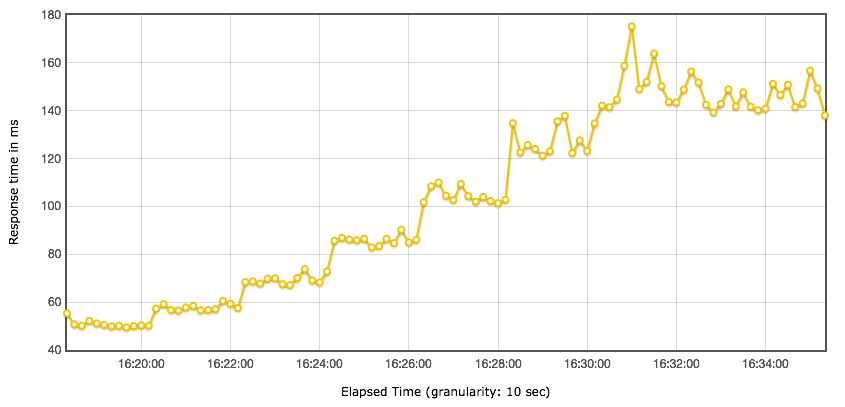

随着用户的增加，响应时间一直都在增加，显然瓶颈已经出现了。

我们再结合Statistics表格中几个和时间有关的值来想想一想，90th pct、95th pct、99th pct、平均响应时间还可以用吗？ Statistics的平均响应时间是109.83ms，但是你从响应时间图和线程图比对就可以看到，在不同的线程阶梯，响应时间是有很大差别的。所以Statistics中的响应时间都是针对整个场景来说的，然而 **在梯度加压的过程中，用Statistics中的数据是不合理的**。

接着我们再来看下TPS图：

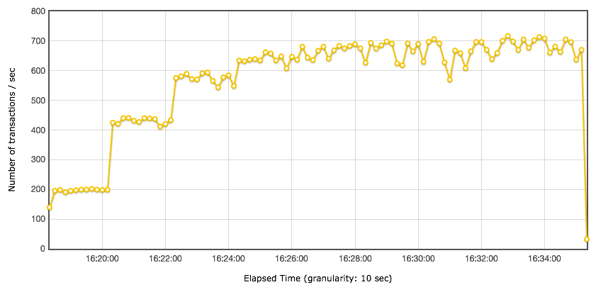

我们可以从TPS图上看到，最大TPS能达到680左右。我再啰嗦一句，请你不要再用所谓的”最大TPS拐点“这样的描述来说明TPS曲线，我在 [第6篇文章](https://time.geekbang.org/column/article/182912) 中也说过，性能的衰减是逐步的（也有突然的情况，那是非常明显的性能瓶颈了），在最大TPS出现之前，就已经可以判断瓶颈是否出现了。

结合上面四个图，我们就有了如下的判断：

1. 场景是递增的。
2. 压力线程上升到55（第四个阶梯）时，TPS达到上限680左右，但是明显的，性能在第三个阶梯就已经接近上限了，
3. 在压力线程达到55时，响应时间达到85ms左右，这个值并不高。

除此之外，其他的似乎不需要我们再做什么判断了。

也许这时候你会想问，那么瓶颈在哪里呢？总有人看到现象就想知道结果。但是这一次呢，我不打算满足这样的好奇心，因为本篇只是为了讲场景的逻辑，而不是瓶颈的分析。哈哈。

### 业务2

从业务2开始，我们不做啰嗦的数据解释了，只说明一下关键点。我们看图。

Statistics图：

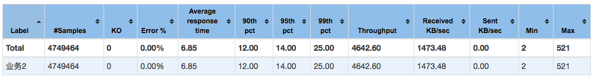

线程数：

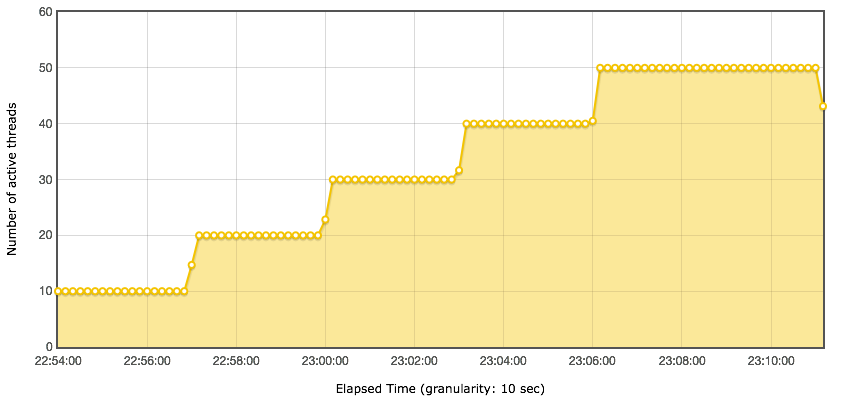

响应时间图：

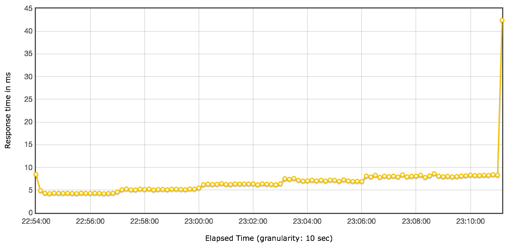

TPS图：

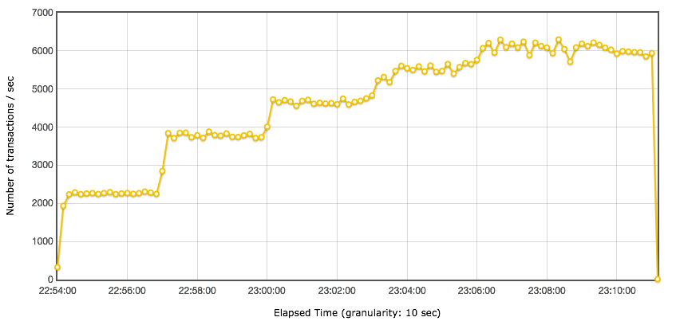

基于上面的四张图，我们可以看到：

1. 这个单业务的最大TPS在6000以上。
2. 响应时间变化比较小，基本上都在10ms以下，但也能明显看出在线程增加的过程中，响应时间也是在增加的。

这个业务由于TPS太高，响应时间太短，实在没啥可分析的。

### 业务3

接下来再看一下业务3的情况。

Statistics：

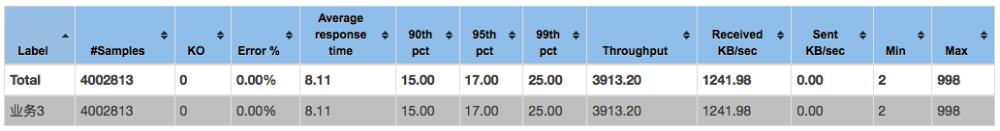

线程数：

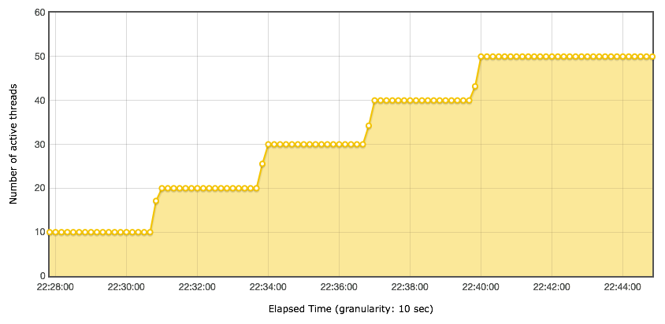

响应时间图：

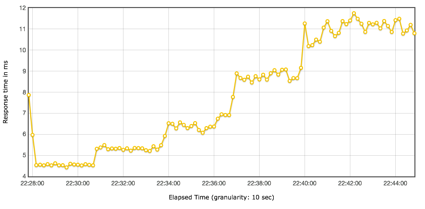

TPS图：

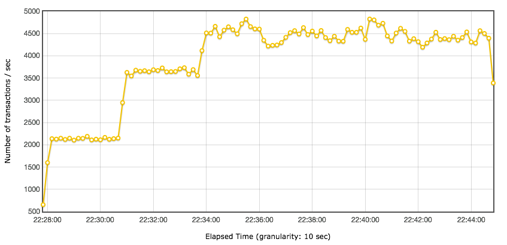

基于上面四张图，我们可以看到：

1. 最大TPS将近5000。
2. 响应时间随着用户的增加而增加，在达到4500TPS时，响应时间在6.5ms左右。

### 业务4

Statistics：

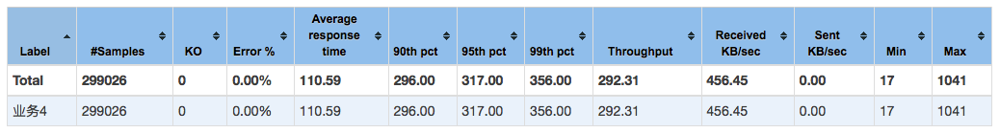

线程数：

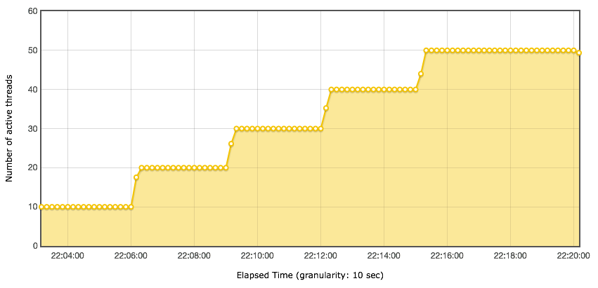

响应时间图：

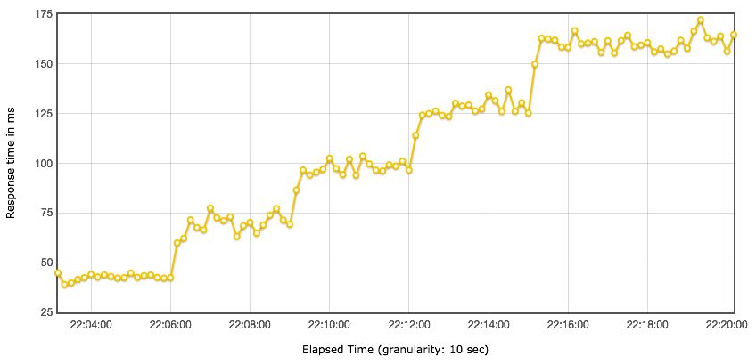

TPS图：

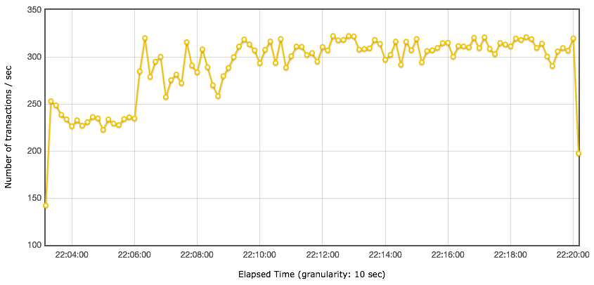

基于上面四张图，我们可以看到：

1. 最大TPS超过了300。
2. 响应时间随着用户的增而增加，在达到300TPS时，响应时间在70ms左右。

### 业务5

Statistics：

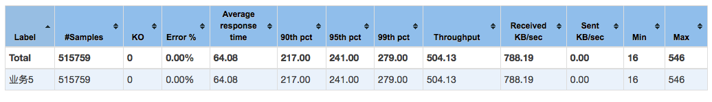

线程数：

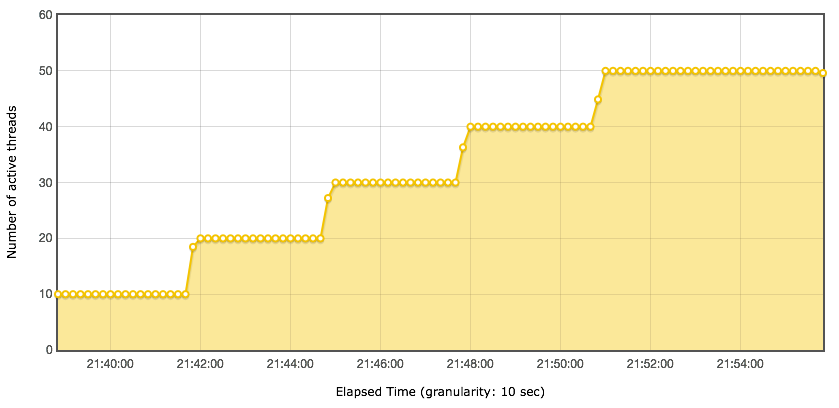

响应时间图：

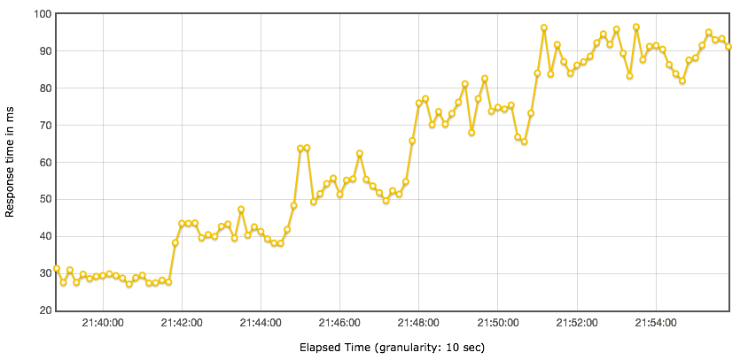

TPS图：

基于上面四张图，我们可以看到：

1. 最大TPS在550左右。
2. 响应时间随着用户的增而增加，在达到550TPS时，响应时间在55ms左右。

### 业务6

Statistics：

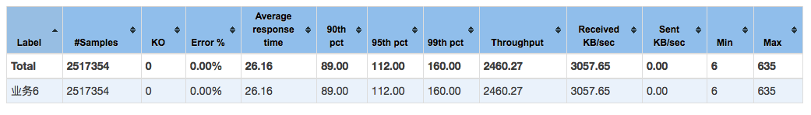

线程数：

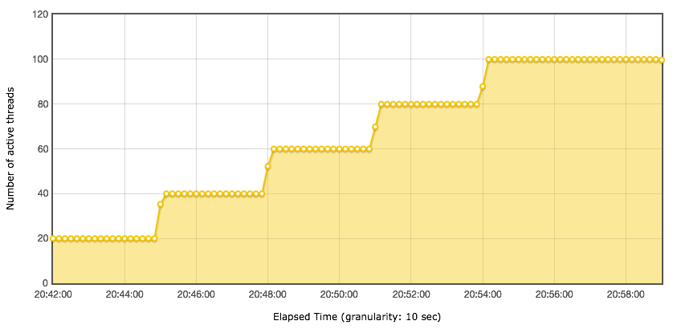

响应时间图：

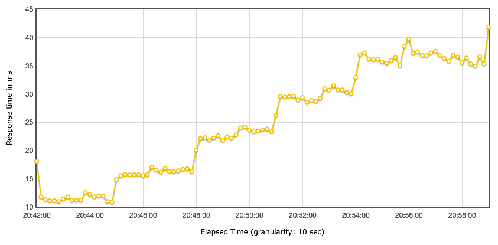

TPS图：

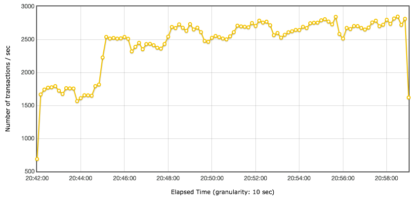

基于上面四张图，我们可以看到：

1. 最大TPS超过了2500。
2. 响应时间随着用户的增加而增加，在达到2500TPS时，响应时间在16ms左右。

有了上面这些单业务的容量结果，我们就可以做一个表格了：

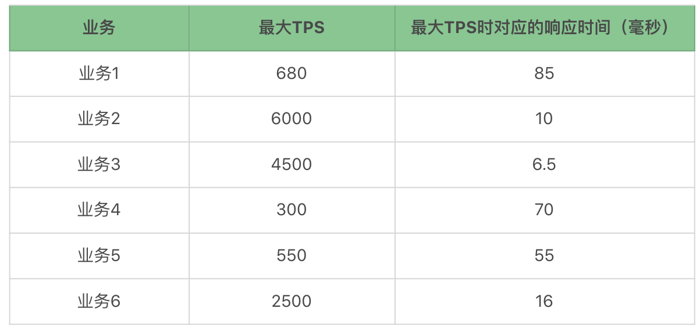

还记得我们前面提到响应时间都不能大于100ms吧。通过测试结果我们可以看到，业务1已经接近这个指标了，也就是说这个业务如果在活动或促销期，有可能出现峰值最大TPS超过承受值的情况，超过了前面制定的响应时间指标。

有了这些基础数据之后，下面我们就可以设计容量场景了。

## 容量性能场景

我们希望得到的容量场景在本文的一开始就已经给出。下面我们通过设计线程来得到这个容量场景的结果。

你需要记住我们的重点：

1. 场景不断。
2. 控制比例。

我们这里只说一个容量性能场景，并且这个场景是峰值业务场景。如果在你的项目中，有特定的业务日，那就要根据业务日的业务比例，重新做一个针对性的场景。

在满足了最开始提到的业务比例之后，我们不断增加压力，得到如下结果。

Statistics：

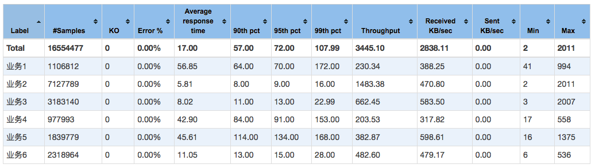

线程数：

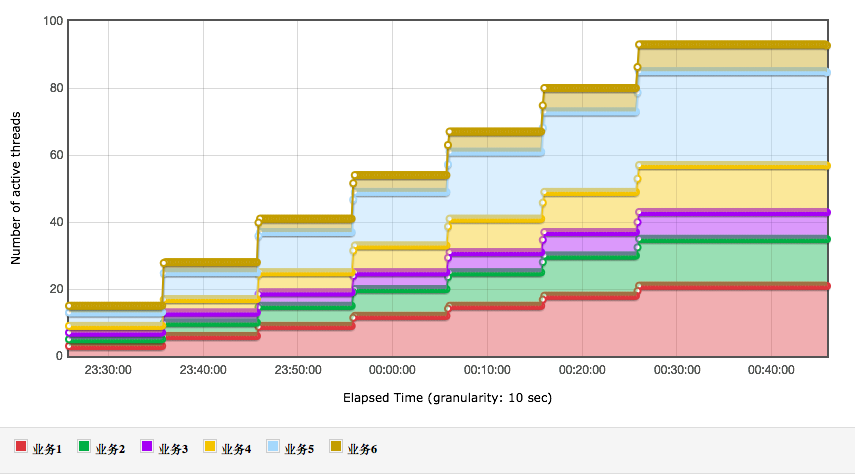

响应时间图：

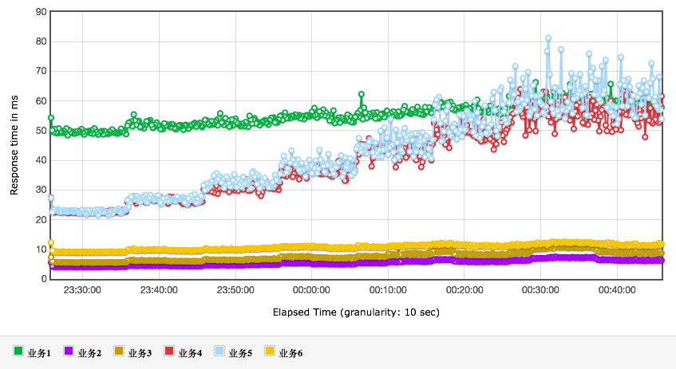

总TPS图：

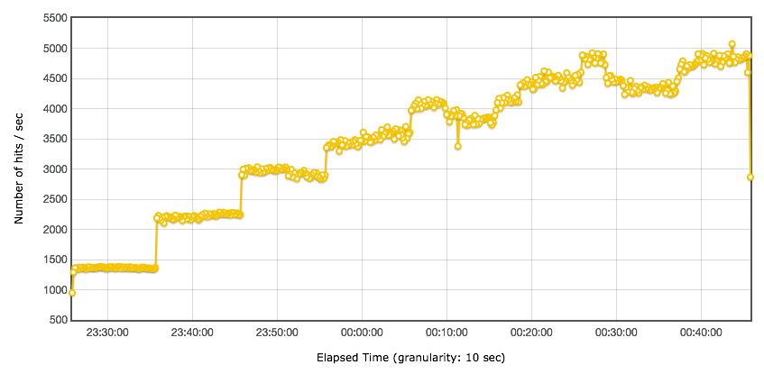

TPS细分图：

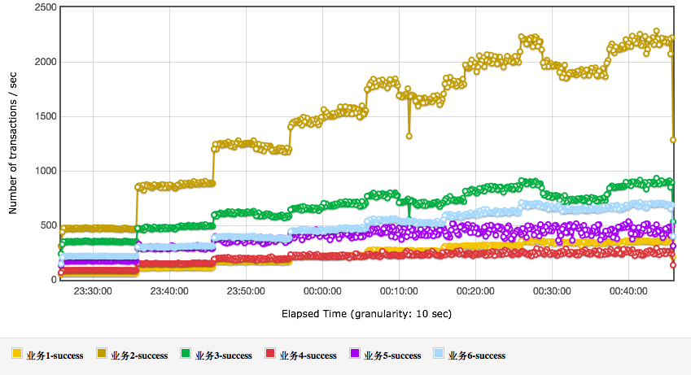

从上面的结果可以看到，业务4和业务5的响应时间，随着业务的增加而增加，这显然在容量上会影响整体的性能。

在具体的项目中，这就是我们要分析调优的后续方向。

还有一点请你注意，并不是说，看到了性能瓶颈就一定要解决，事实上，只要业务指标可控，不调优仍然可以上线。这一点也是很多做性能测试的人会纠结的地方，感觉看到这种有衰减趋势的，就一定要把它给调平了。其实这是没有必要的。我们做性能是为了让系统能支持业务，即使性能衰减已经出现，性能瓶颈也在了，只要线上业务没有超出容量场景的范围，那就仍然可以上线。

另外再说几句闲话，做技术的人容易钻进这样的牛角尖，觉得明显有问题，结果公司老板不支持去调优处理，显然是老板不重视性能测试，于是深感自己不得志，工作也无精打采的。这就没必要了，做性能不是为了炫技，应该为业务服务。

我们再说回来，从总TPS图上看到，在容量测试中，我们仍然测试到了系统的上限。这是一个好事情，让我们可以判断出线上的系统配置应该是什么样的。

在达到了系统上限时，我们来看一个业务的比例（请你注意，我是不赞同用表格来承载 **分析** 数据的，但是作为最终的结果，给老板看的时候，还是要尽量说得通俗易懂）。

如下所示：

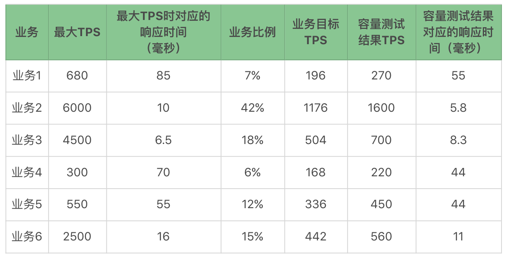

我们可以从上面的数据中看到，业务目标TPS已经达到，响应时间也没有超过指标。很好，这个容量就完全满足业务需求了。

但是！

如果业务要扩展的话，有两个业务将会先受到影响，那就是业务4和业务5，因为它们的测试TPS和最大TPS最为接近。这是在我们推算业务扩展之后，再做架构分析时要重点考虑的内容。如果是在实际的项目中，这里会标记一个业务扩展风险。

请你注意，根据架构，性能测试组需要根据当前的测试状态整理架构的关键配置给线上系统做为参考，并且每个项目都会不一样，所以并不是固定的内容。我想做运维的看到这些值可能会更为亲切。

在这里，我给一个之前项目中的示例（由于属于项目交付类文档，所以这里只截取部分技术片断），如下所示：

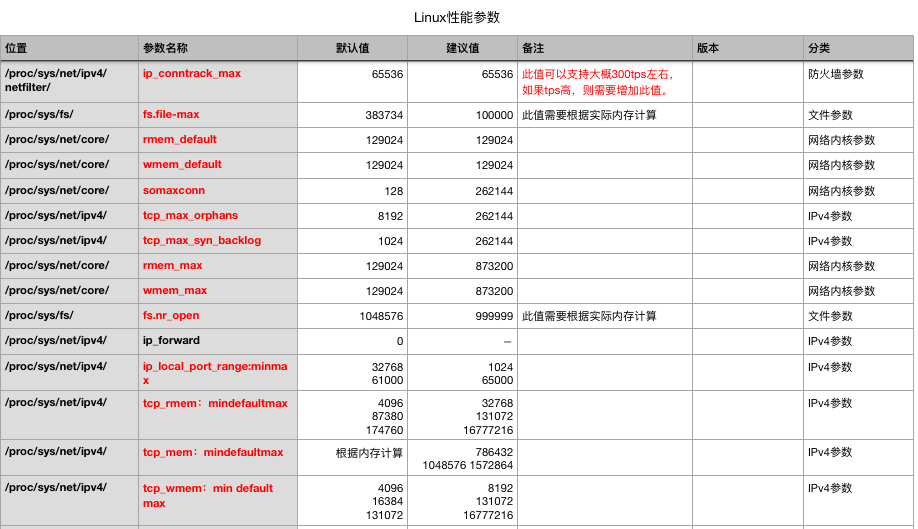

配置整理的范围包括架构中所有和性能相关的技术参数。如下所示：

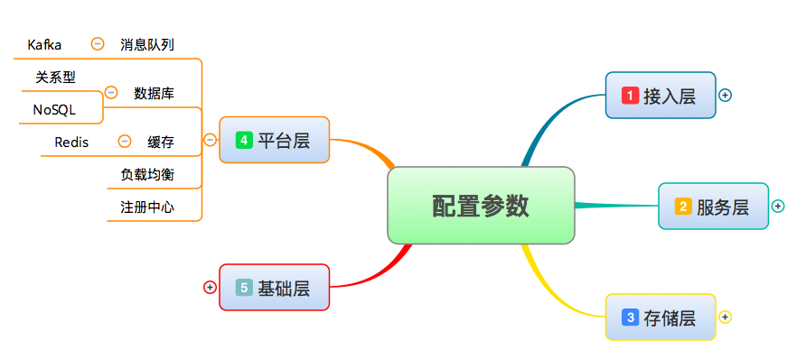

当然，这时我们也是要分析系统的资源使用率的。在本文为了避免混乱，所以我没有提及。在实际的项目中，我们还是要分析的哦。

说完了混合容量场景之后，我们回忆一下之前说过的两个重点，我的混合业务场景是不是没有断？是不是保持了业务比例？

下面我们就该说一下稳定性场景了。

## 稳定性性能场景

我在 [第1篇文章](https://time.geekbang.org/column/article/178068) 就提到过，稳定性场景的时间长度取决于系统上线后的运维周期。

在这个示例中，业务+运维部门联合给出了一个指标，那就是系统要稳定运行一周，支持2000万业务量。运维团队每周做全面系统的健康检查。当然谁没事也不用去重启系统，只要检查系统是否还在健康运行即可。大部分时候运维是等着系统警告的。

那么针对前面给出的容量结果，容量TPS能达到3800（业务1到业务6的容量测试结果TPS总和）。所以稳定性场景时间应该是：20000000/3800 = 1.46小时。

下面是两小时的稳定性场景运行情况，我在这里只做一下大概的说明。

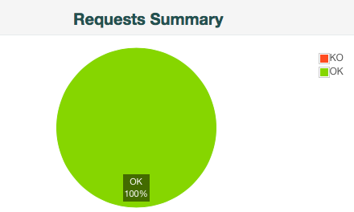

Statistics：

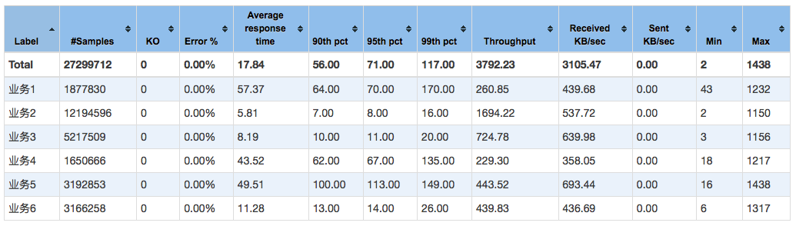

线程数：

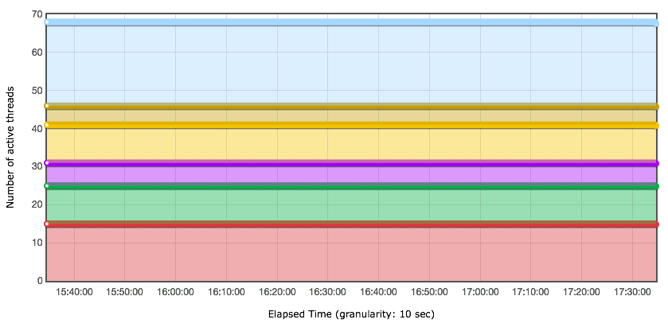

响应时间图：

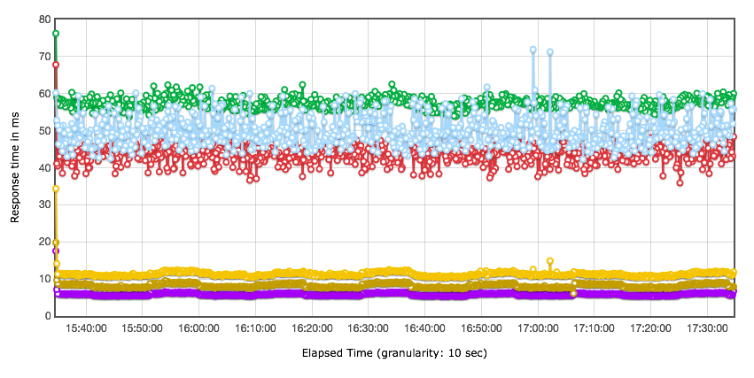

TPS细分图：

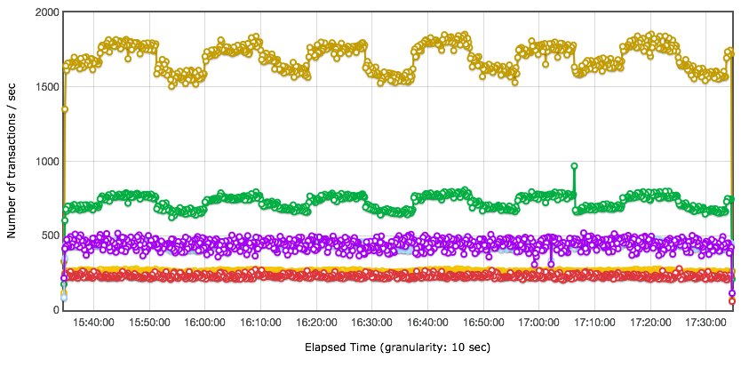

总TPS图：

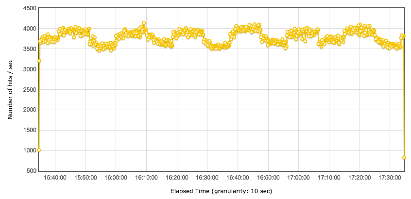

从上面几张图可以看出，业务2和业务3对总TPS的动荡产生了影响，但系统并没有报错。这种周期性的影响，你可以去分析具体的原因，由于本篇是场景篇，所以这里不写分析过程，直接给出原因，这种影响是参数化数据周期性使用所导致的，有些数据的关联记录数多，有些数据的关联记录数少，数据库中变化倒是不大，但由于TPS过高，表现出来得就比较明显了。

其他的业务都比较正常，也比较稳定，没有报错。

总体业务量达到27299712，也达到了稳定性业务量级的要求。

有一点，估计会有人提出疑问，你这个稳定性的总体TPS，看起来和容量测试场景中差不多呀，有必要用容量测试中的最大TPS来跑稳定性吗？

这里就涉及到另一个被误解的稳定性知识点了。有很多人在资料中看到，稳定性测试应该用最大TPS的80%来跑。看到没有，这似乎又是一个由28原则导致的惯性思维。

在这里我要澄清一下。在具体的项目实施过程中，完全没有必要遵守这些看似有道理，实则对具体项目没什么用的原则。

这个系统用最大TPS能跑下来，业务一直很正常，稳定性目标能达到，为什么不能用最大TPS来跑呢？本来稳定性场景就是为了知道会不会由于长时间处理业务而引发潜在瓶颈（像内存泄露是个典型问题）。至于用多大的TPS来运行，又有什么关系？只要系统在正常处理，资源没有出现问题，也没有报错，那这个场景就是有效的，目标也是能达到的。

所以说，这里的稳定性场景，完全合理。但是，你觉得这样就完了吗？当然没有，我们还有异常场景要做嘛。

## 异常性能场景

我之前有提到过，异常性能场景要看架构图，但是涉及到职业素养的问题，我这里只能画个示意图来说明此系统的架构，以此来实现逻辑的完整性。示意图如下所示：

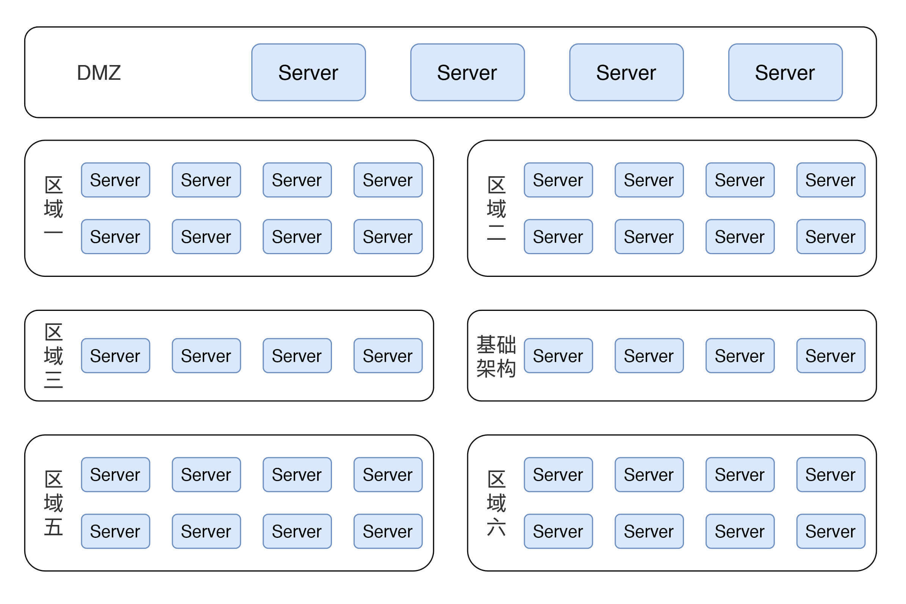

这是一个完全按生产架构来的示意图，在真实的测试过程中，也是这样搭建的。在这里有六个业务区域（包含基础架构区），也有DMZ区。

其实在每个区域中，根据架构中用到的技术组件，异常测试都有细化的场景设计，而在这里，我给你展示一个全局架构层的场景，用来说明异常场景。

这里运行的场景是：用容量场景中最大TPS的50%来做异常的压力背景。

咦，是不是会有人问：这里为什么只用50%了？稳定性性能场景不是还用100%的压力背景嘛？

这里我就要再说一遍，看目标！异常性能场景的目标是为了判断所要执行的操作对系统产生的影响，如果TPS不稳定，怎么能看出来异常点？当然是稳定无抖动的TPS是最容易做出异常动作产生的影响了。所以这里的50%是为了得到更为平稳的TPS曲线，以便做出正确的判断。

下面我们就要看异常场景的设计了。这是一个大的异常场景。

我分别对各区域中的业务应用服务器、数据库服务器以及基础架构服务器做异常操作（为了方便理解，下文我直接用kill来说明，其实在操作中，有些不是直接kill，像断电、断网卡的手段也都可以用，取决于如何操作更为准确）。

下面是具体的操作步骤和时间记录。

第一部分：业务应用服务器。停下如下区域的一半应用服务器，查看TPS、响应时间及其他服务器压力。

1. kill 区域三：17:02；
2. kill 区域一：17:15；
3. kill 区域二：17:20；
4. kill 区域五：17:25。

第二部分：基础架构服务器。停下一半的基础架构主机，查看TPS、响应时间及另外主机压力的恢复情况。

kill 一台基础架构主机中的某个服务的某个节点：17:30。

第三部分：数据库服务器。停下master数据库，查看切换时间，slave的压力及TPS的恢复情况。

1. reboot DB-20：17:36。6分钟之后恢复；
2. reboot DB-26：18:07。1分钟左右恢复；
3. reboot DB-2：18:20。2分钟之后恢复。

第四部分：启动master数据库。

第五部分：启动被停的应用服务。

1. start 区域五：18:28；
2. start 区域三：18:33；
3. start 区域一：18:38；
4. start 区域二：18:43。

第六部分：启动被停基础架构主机中的某个服务的某个节点。

start 基础架构主机中的某个服务的某个节点：18:48。

根据上面的步骤，这里我放出TPS图来做分析。

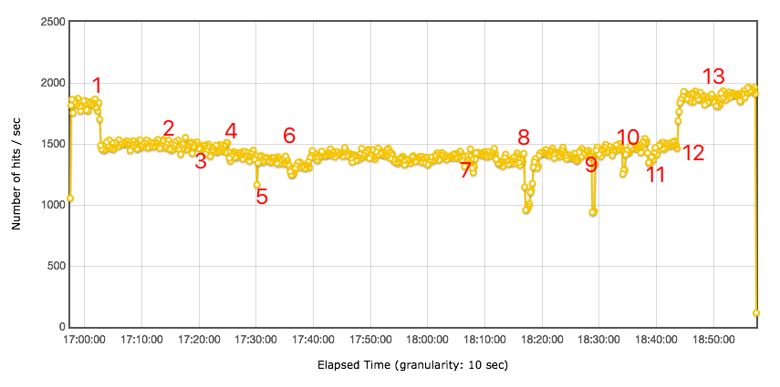

从上图中的TPS趋势可以看出，停掉一半的区域三应用服务器后，对TPS有明显的影响。为啥呢？

我们来看一下细分的TPS图：

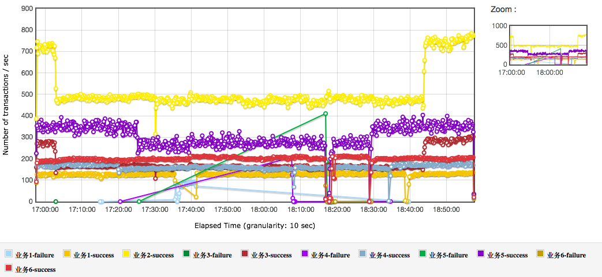

从图上看，并不是所有的TPS都在步骤1的时候受到了影响。受影响的只有业务2和业务3。显然只有业务2和业务3走到了这个区域。但是这仍然是一个BUG！！！

理论上，用一半的压力，停了一半的服务器，即便当前正在运行在被停掉的服务器上的session受到了影响，那TPS也应该会恢复的，但是TPS没恢复。所以先这里提个BUG。

另外，停掉区域一、二、五的一半应用服务器，影响不大，TPS有些许下降，但并没有报错，这个结果还可以接受。

停掉基础架构服务器时，TPS有下降，但很快恢复了，非常好。

在步骤6时，记录的信息是在6分钟之后恢复的，这个时间有点久了。我在这里拆开TPS细节来看一下。

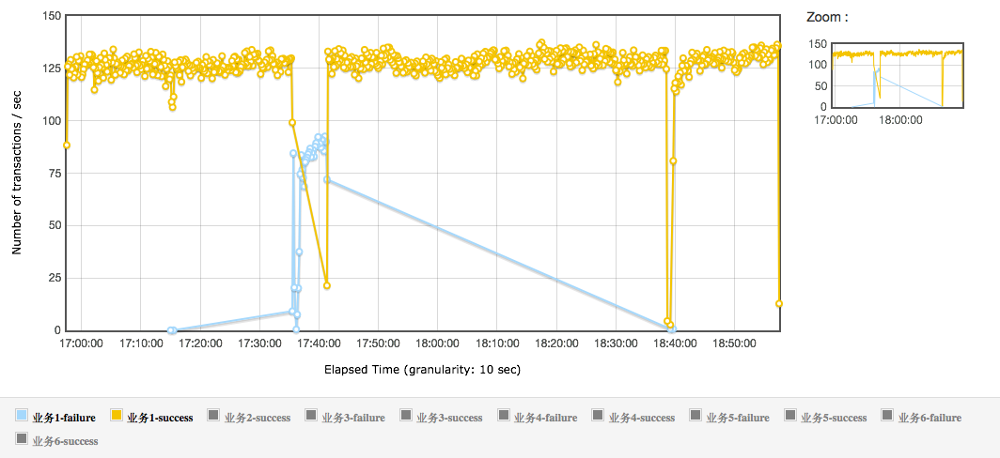

显然这段报错得比较多，6分钟，一个master库切换过去。这怎么能接受呢？报BUG！！！

另外，步骤8中，TPS显然下降到底了。还好时间并不长，在2分钟后恢复。这个可以报BUG。为什么说是 **可以** 报呢？因为这个时间并不算长。这里就有一个预期的问题。通常情况下，我们做DB master的异常切换，在这个架构中，是期望在1分钟内完成切换的。在我这个场景中，最快的数据库master切换是40s。

请你注意，我看到有些厂商说数据库可以达到秒级切换，这种说法未免过于空泛。如果把”不到1分钟“称为秒级的话，那就欲盖弥彰了。我理解的秒级切换是一秒内，而不是单位是秒就可以。

通常这种1秒内切换说的都只是数据库实例的前面一层，有叫Plus的，有叫Proxy的，并且说的不是从出现异常，到判断切换的过程。而是说从切换动作开始到结束。另外，这个秒级切换也是有背景条件的。我们不要看广告，要看实际的操作结果。

请注意，上面提到的容量场景和异常场景，都只是项目中的一个场景。其实在这个项目中，我还有很多其它的容量场景和异常场景。从场景设计上来说，这些场景都大同小异，但都需要在大量的调研分析之后才能设计得出来。

## 总结

在对基准场景、容量场景、稳定性场景和异常场景做了详细的，有逻辑的描述之后，相信你已经能体会到场景的博大精深了。

在本篇中，由于字数有限，我只对场景的具体执行过程中的关键点做了细致地描述。但是场景绝对不止这些哦，还有很多细节的内容。

同时，为了让理解更为清晰，这里我只描述了场景本身，场景包括的其他内容，比如说参数设计、监控设计等等，在本篇中都没有描述。

从这里，你大概能明白我说的场景对性能有多么重要了吧。

希望今天的这篇文章能给你在设计性能场景时提供参考。

## 思考题

看完了今天的文章，你能说一下性能场景应该按什么样的逻辑设计吗？以及在稳定性场景中，为什么不用最大TPS的80%来做？

欢迎你在评论区写下你的思考，也欢迎把这篇文章分享给你的朋友或者同事，一起交流一下。