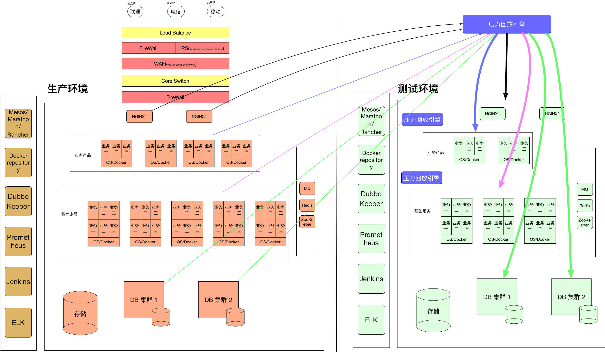
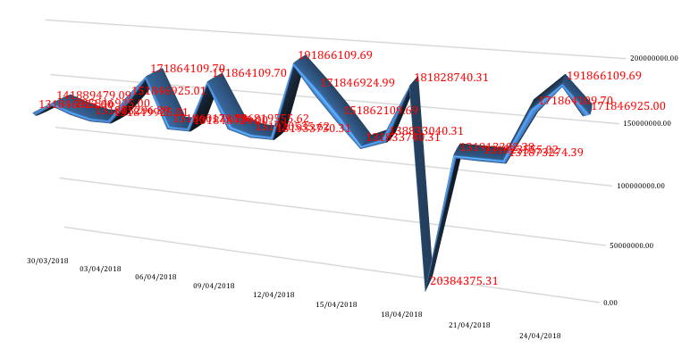
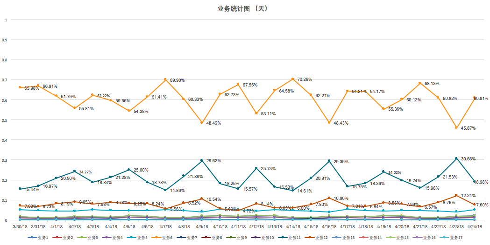
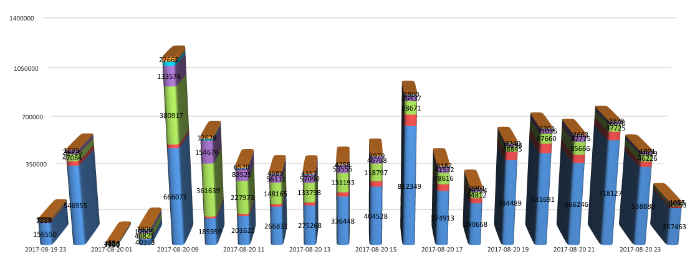
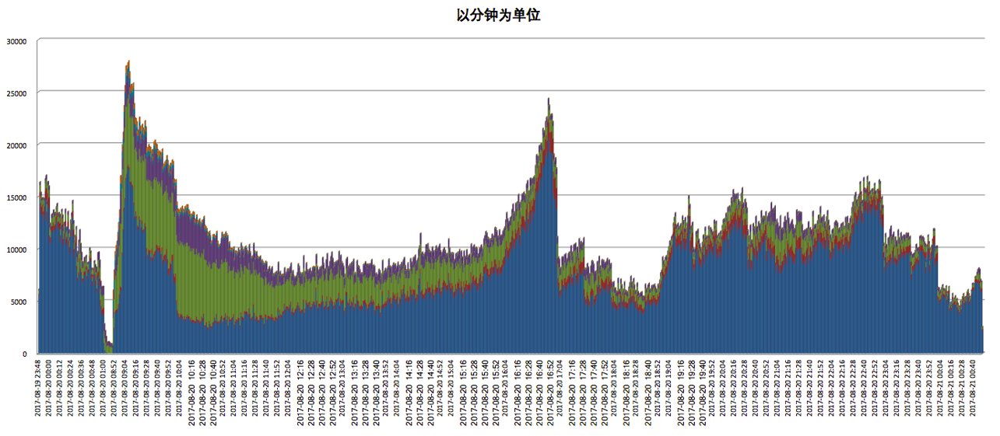
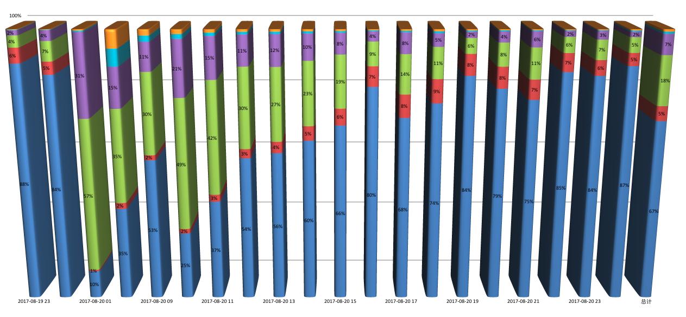
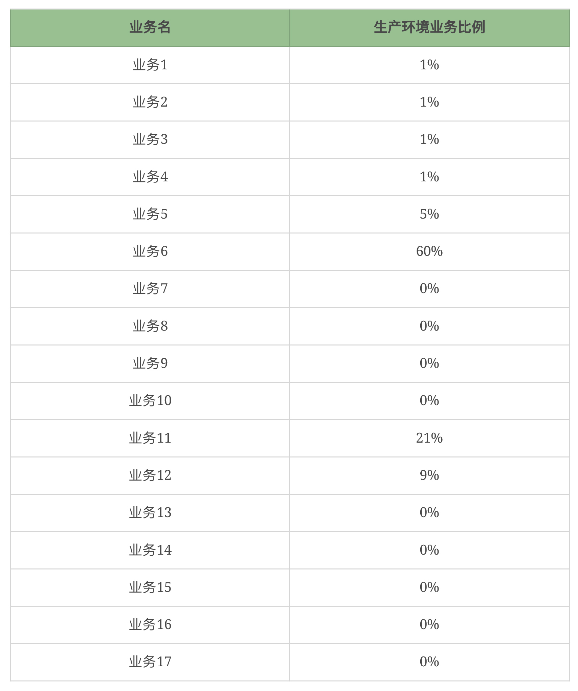
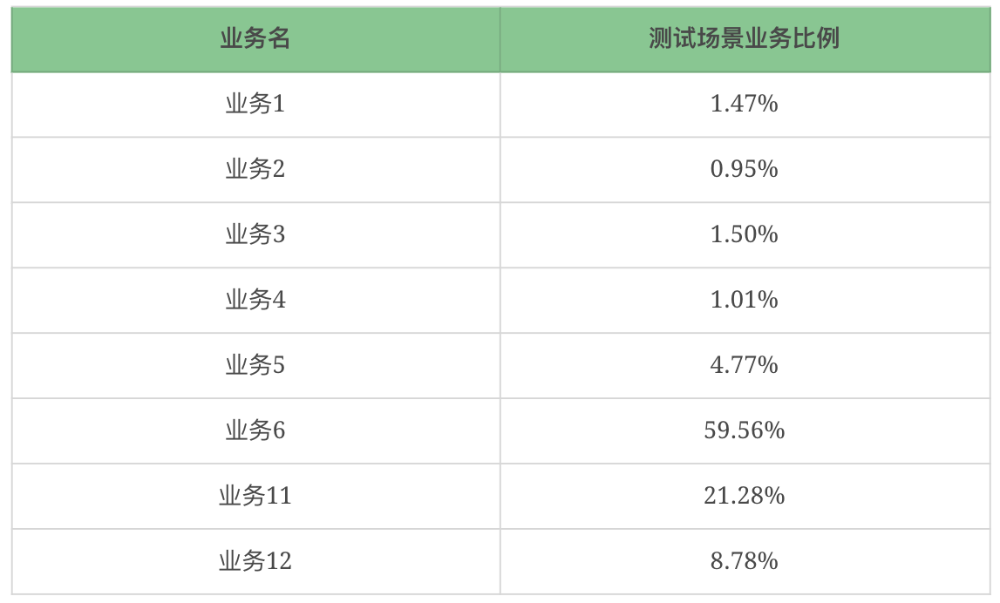
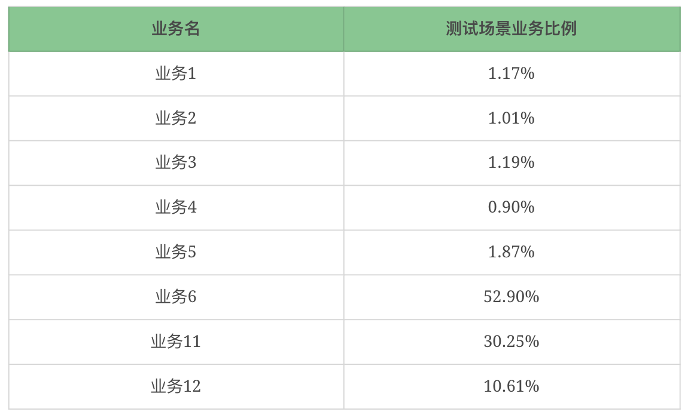
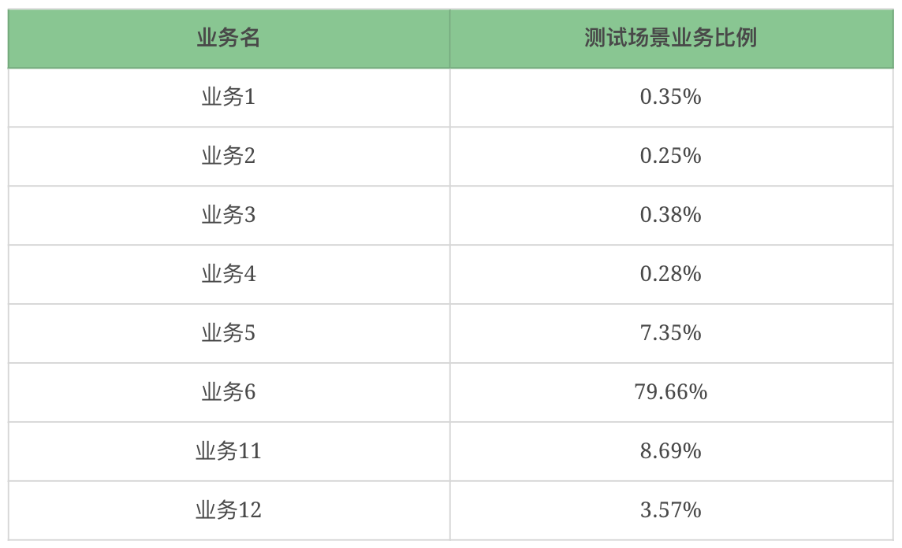

# 14丨性能测试场景：如何理解业务模型？
性能场景中的业务模型是性能测试工作中非常重要的一部分。而在我们真实的项目中，业务模型跟线上的业务模型不一样的情况实在是太多了。原因可能多种多样，这些原因大大降低了性能测试的价值。

有人说，就是因为这样才应该直接用生产流量的方式来做嘛，这样就不用管业务模型了，直接就有生产的业务模型了。没错，只要你能通过生产流量扩大回放的方式实现压力部分，确实可以不用考虑业务场景了。但这么做的前提也必须是你的生产流量来源是可以覆盖想要测试的业务场景的。

## 回放的逻辑

回放的逻辑是这样的。

如果你喜欢的话，还可以在每一个业务产品和基础架构的层面做接口的回放，甚至我们可以直接在数据库中回放SQL。而这些手段，都是为了模拟生产的业务模型。

这是非常容易理解的逻辑吧。

这里要批驳一个观点，就是有些人觉得只有通过生产流量回放的方式，才是真实地 模拟了线上的流量。事实上，这个观点是偏颇的。前几天有一个性能测试工程师问我一个流量回放过程中遇到的问题，谈到为什么要用流量回放。他说他们领导觉得这个最新潮最直接最正确，但实际上他得到的那段业务流量根本不能完全覆盖想测试的场景，最后折腾了一个月也是无功而返。

我知道，现在有很多人在各种场合说，可以直接在生产环境中，通过业务统计动态统计出业务场景，并实时实现到性能平台中去。这当然是一个很好的路子，但这个路子需要完整的技术实现，并且在不同的企业中，这种方式难就难在创建业务模型的统计算法，此外还要有高层领导的支持，才能真正实现完整的逻辑。

所以在今天的文章中，我想写的是最朴素的逻辑。那就是从生产数据统计，怎么转化到具体的场景中的业务模型。明白了这个逻辑之后，不管你是用生产流量回放，还是用实时业务量统计，还是线下业务量统计，你会发现原理都是一样的。

这是一个真实的案例，我已经把所有的业务名都替换掉了，同时对业务量级也做了降级调整，但这并不影响描述获取业务场景的完整性。

原系统的量级如下图所示：

这里我将降低10倍处理。

## 生产数据统计

首先我们从生产环境取出数据，粒度到秒级，取出所有业务的交易量数据。

业务量级按天统计的生成图如下：

我为什么要取这一段时间的数据呢？答案很简单，因为这一段时间完整地体现了这个 **业务系统的峰值数据**。

从这样的数据中取出业务量最高的一天，最大的业务量是2000万左右。

注意，我这里说的是业务量最高的一天，并不是说我们的业务场景只从这一天产生，还有别的时间，可能业务量不多，但是业务比例会完全不同，这也是要取出来的场景，所以这个统计数据到业务模型的分析过程会比较细致。我们把这一天的逻辑说完后，你就会明白其他的场景获取方式。

接着，我再以小时为单位统计出业务量比例。如下图所示：

从上图显然可以看出哪个小时的业务量最大，那就是9点。

但是呢，你不要忘记了，在16点的时候，明显蓝色表示的那个业务量是大于9点时的业务量的。这个也是要取出来的场景。

如果需要更细的数据，我们可以以分钟为单位看一下这个小时内的业务量分布。

如果你的业务有必要从分钟或秒来看的话，可以按分钟或秒来取场景比例。在我们今天的这个案例中，取到小时就已经足够。因为我要的是业务模型，而不是生产TPS量级。

另外，既然说到了这里，我再把生产TPS量级的统计说一下。有了上面的分钟统计比例，就可以很容易统计出生产环境中每个业务的最大TPS了。这里得到的TPS将是最有效的测试是否通过的SLA指标。

下面我们再以小时为单位做出百分比图。

为什么要做百分比图呢？因为这个比例才是我们在性能场景中设置的TPS比例，是最直接有效的比例。

## 业务模型计算过程

针对这一天中的数据，我们将做出以下三个业务模型。

1. 通用业务场景模型。就是将这一天的所有业务数加在一起，再将各业务整天的交易量加在一起，计算各业务量的比例。
2. 9点钟的业务模型。将9点钟的业务比例直接拿出来用。
3. 16点的业务模型。将16点钟的业务比例直接拿出来用。

首先我们看一下通用业务模型。

我们将上面的0%的业务全部删除，再计算一次百分比，得到测试场景中的业务比例。如下所示：

做为最基础的业务比例，这个可以覆盖大部分的业务时间了。

在通用的业务场景中，如果业务团队有给出明确的TPS指标，那就有依赖了。但是，如果没有给的话，也不要气馁。我们可以根据系统的运行时段，计算平均值即可。

因为我们这个系统是24小时系统，所以我用24小时来计算。得到如下值：

$TPS1 = \\frac{20000000}{24\*3600} = 231$

也就是说通用场景中，TPS不能低于231。

接着我们看下9点的业务模型。计算方法和上面一样，最后得出比例。

我们可以从小时图中看到，9点的业务量总和有120万左右。为了方便，这里我拿120万来计算。它的生产TPS就是：1,200,000 / 3600 = 333。

$TPS2 = \\frac{1200000}{3600} = 333$

显然，这个模型下做场景时就不能低于333TPS。

最后看一下16点的业务场景。

从小时图中，我们可以看到，16点的业务量总和有100万左右。为了方便，这里我拿100万来计算。它的生产TPS就是：

$TPS3 = \\frac{1,000,000}{3600} = 277$

显然，这个模型下做场景时就不能低于277TPS。

但是请注意，像9点业务模型中的业务11，占比达到30.25%；而16点业务模型中只有8.69%。虽然TPS差不多，但是业务比例差别大，这两种业务模型下，对系统资源的消耗会完全不一样。

最后我稍微说一下TPS的控制。

有了这个计算过程，当我们把这些比例设计到场景中去的时候，一定要注意这些TPS的比例在运行过程中，不能发生大的变化。一旦压力发起后，由于各业务的响应时间随着压力的增加发生的变化量不同，就会导致运行过程中业务比例出现很大的偏差。

我们做性能测试工程师的，都有过这样的经历。通常，在LoadRunner里，会用 `pacing` 来控制TPS，而用JMeter的，则会用 `Constant Throughput Timer` 来控制TPS。

## 总结

在这一篇中，我描述了业务模型的来源和计算过程。其实就是一些常规的求和平均计算，只要判断出哪一段业务是我们需要的就可以了。

另外我也强调了，不管用什么炫酷的手段来实现生产环境的流量模拟，最终的目标是实现和线上比较接近的业务模型。不是说一定用生产流量回放才是正确的，只有适合自己企业的手段才是最正确的。

## 问题

那么最后给你留两个问题，为什么业务比例对性能场景如此重要？以及如何在执行场景过程中控制TPS比例呢？

欢迎你在评论区写下你的思考，也欢迎把这篇文章分享给你的朋友或者同事，一起交流一下。