# 16丨案例：性能监控工具之Grafana+Prometheus+Exporters
在本模块中，我将把几个常用的监控部分给梳理一下。前面我们提到过，在性能监控图谱中，有操作系统、应用服务器、中间件、队列、缓存、数据库、网络、前端、负载均衡、Web服务器、存储、代码等很多需要监控的点。

显然这些监控点不能在一个专栏中全部覆盖并一一细化，我只能找最常用的几个，做些逻辑思路的说明，同时也把具体的实现描述出来。如果你遇到了其他的组件，也需要一一实现这些监控。

在本篇中，主要想说明白下图的这个监控逻辑。

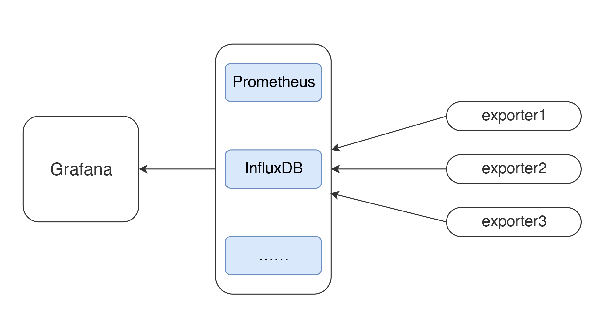

这应该是现在最流行的一套监控逻辑了吧。

我今天把常见的使用Grafana、Prometheus、InfluxDB、Exporters的数据展示方式说一下，如果你刚进入性能测试领域，也能有一个感性的认识。

有测试工具，有监控工具，才能做后续的性能分析和瓶颈定位，所以有必要把这些工具的逻辑跟你摆一摆。

所有做性能的人都应该知道一点，不管数据以什么样的形式展示，最要紧的还是看数据的来源和含义，以便做出正确的判断。

我先说明一下JMeter和node\_exporter到Grafana的数据展示逻辑。至于其他的Exporter，我就不再解释这个逻辑了，只说监控分析的部分。

## JMeter+InfluxDB+Grafana的数据展示逻辑

一般情况下，我们用JMeter做压力测试时，都是使用JMeter的控制台来查看结果。如下图所示：

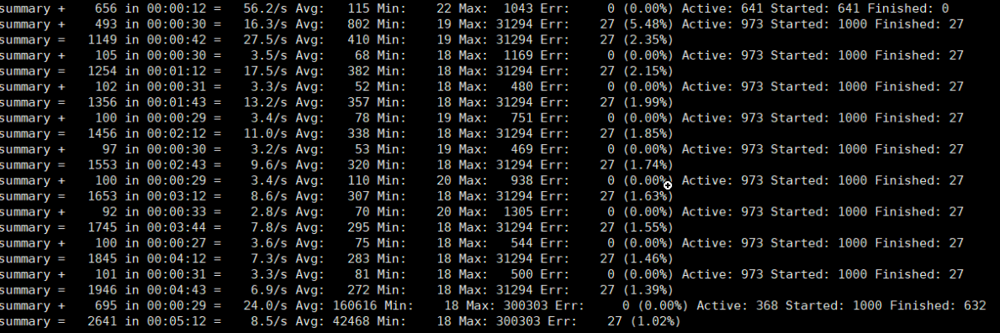

或者装个插件来看结果：

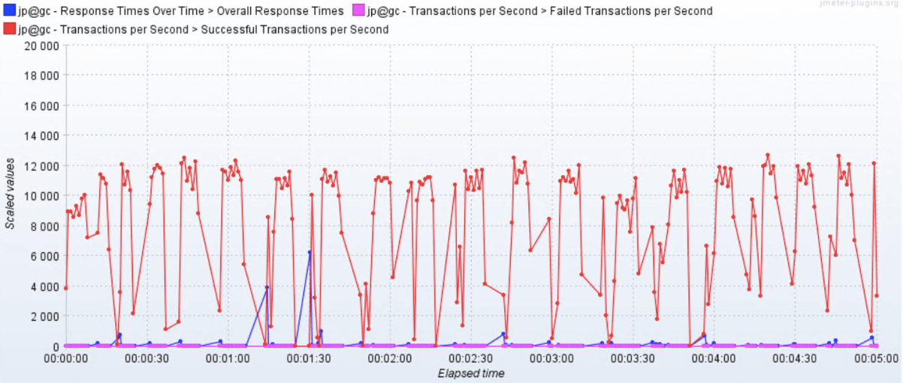

或者用JMeter来生成HTML：

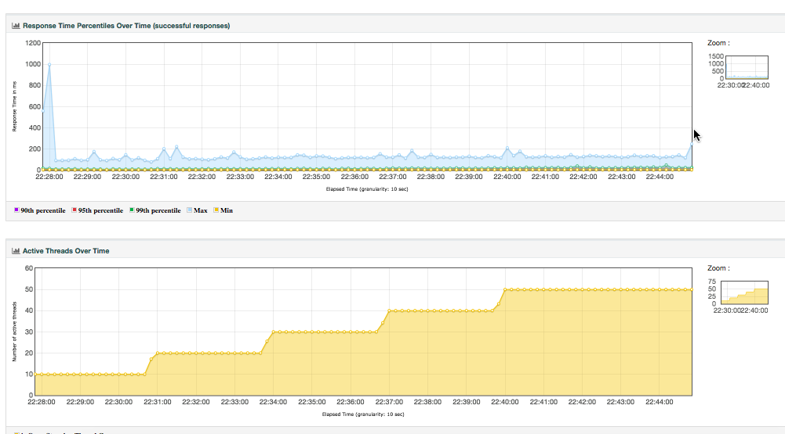

这样看都没有问题，我们在前面也强调过，对于压力工具来说，我们最多只关心三条曲线的数据：TPS（T由测试目标定义）、响应时间、错误率。这里的错误率还只是辅助排查问题的曲线，没有问题时，只看TPS和响应时间即可。

不过采取以上三种方式有几个方面的问题。

1. 整理结果时比较浪费时间。
2. 在GUI用插件看曲线，做高并发时并不现实。
3. 在场景运行时间比较长的时候，采用生成HTML的方式，会出现消耗内存过大的情况，而实际上，在生成的结果图中，有很多生成的图我们并不是那么关注。
4. 生成的结果保存之后再查看比较麻烦，还要一个个去找。

那么如何解决这几个问题呢？

用JMeter的Backend Listener帮我们实时发送数据到InfluxDB或Graphite可以解决这样的问题。Graphite Backend Listener的支持是在JMeter 2.13版本，InfluxdDB Backend Listener的支持是在JMeter 3.3的版本，它们都是用异步的方式把数据发送出来，以便查看。

其实有这个JMeter发送给InfluxDB的数据之后，我们不需要看上面的那些HTML数据，也可以直观地看到系统性能的性能趋势。并且这样保存下来的数据，在测试结束后想再次查看也比较方便比对。

JMeter+InfluxDB+Grafana的结构如下：

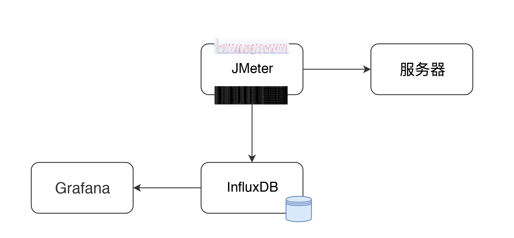

在这个结构中，JMeter发送压力到服务器的同时，统计下TPS、响应时间、线程数、错误率等信息。默认每30秒在控制台输出一次结果（在jmeter.properties中有一个参数#summariser.interval=30可以控制）。配置了Backend Listener之后，将统计出的结果异步发送到InfluxDB中。最后在Grafana中配置InfluxDB数据源和JMeter显示模板。

然后就可以实时查看JMeter的测试结果了，这里看到的数据和控制台的数据是一样。

但如果这么简单就说完了，这篇文章也就没价值了。下面我们来说一下，数据的传输和展示逻辑。

### JMeter中Backend Listener的配置

下面我们就InfluxDB的Backend Listener做个说明。它的配置比较简单，在脚本中加上即可。

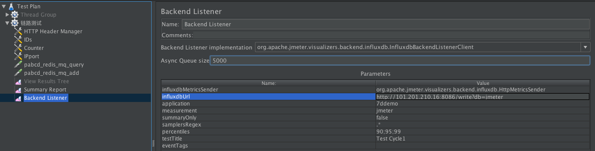

我们先配置好influxdb Url、application等信息，application这个配置可以看成是场景名。

那么JMeter如何将数据发给InfluxDB呢？请看源码中的关键代码，如下所示：

```
    private void addMetrics(String transaction, SamplerMetric metric) {
        // FOR ALL STATUS
        addMetric(transaction, metric.getTotal(), metric.getSentBytes(), metric.getReceivedBytes(), TAG_ALL, metric.getAllMean(), metric.getAllMinTime(),
                metric.getAllMaxTime(), allPercentiles.values(), metric::getAllPercentile);
        // FOR OK STATUS
        addMetric(transaction, metric.getSuccesses(), null, null, TAG_OK, metric.getOkMean(), metric.getOkMinTime(),
                metric.getOkMaxTime(), okPercentiles.values(), metric::getOkPercentile);
        // FOR KO STATUS
        addMetric(transaction, metric.getFailures(), null, null, TAG_KO, metric.getKoMean(), metric.getKoMinTime(),
                metric.getKoMaxTime(), koPercentiles.values(), metric::getKoPercentile);
​
​
        metric.getErrors().forEach((error, count) -> addErrorMetric(transaction, error.getResponseCode(),
                    error.getResponseMessage(), count));
    }

```

从这段代码可以看出，站在全局统计的视角来看，这里把JMeter运行的统计结果，比如事务的Total请求、发送接收字节、平均值、最大值、最小值等，都加到metric中，同时也会把成功和失败的事务信息添加到metric中去。

在源码中，还有更多的添加metric的步骤，你有兴趣的话，也可以看一下JMeter源码中的 `InfluxdbBackendListenerClient.java`。

保存了metric之后，再使用InfluxdbMetricsSender发送到Influxdb中去。发送关键代码如下：

```
   @Override
    public void writeAndSendMetrics() {
 ........
        if (!copyMetrics.isEmpty()) {
            try {
                if(httpRequest == null) {
                    httpRequest = createRequest(url);
                }
                StringBuilder sb = new StringBuilder(copyMetrics.size()*35);
                for (MetricTuple metric : copyMetrics) {
                    // Add TimeStamp in nanosecond from epoch ( default in InfluxDB )
                    sb.append(metric.measurement)
                        .append(metric.tag)
                        .append(" ") //$NON-NLS-1$
                        .append(metric.field)
                        .append(" ")
                        .append(metric.timestamp+"000000")
                        .append("\n"); //$NON-NLS-1$
                }

                StringEntity entity = new StringEntity(sb.toString(), StandardCharsets.UTF_8);

                httpRequest.setEntity(entity);
                lastRequest = httpClient.execute(httpRequest, new FutureCallback<HttpResponse>() {
                    @Override
                    public void completed(final HttpResponse response) {
                        int code = response.getStatusLine().getStatusCode();
                        /*
                         * HTTP response summary 2xx: If your write request received
                         * HTTP 204 No Content, it was a success! 4xx: InfluxDB
                         * could not understand the request. 5xx: The system is
                         * overloaded or significantly impaired.
                         */
                        if (MetricUtils.isSuccessCode(code)) {
                            if(log.isDebugEnabled()) {
                                log.debug("Success, number of metrics written: {}", copyMetrics.size());
                            }
                        } else {
                            log.error("Error writing metrics to influxDB Url: {}, responseCode: {}, responseBody: {}", url, code, getBody(response));
                        }
                    }
                    @Override
                    public void failed(final Exception ex) {
                        log.error("failed to send data to influxDB server : {}", ex.getMessage());
                    }
                    @Override
                    public void cancelled() {
                        log.warn("Request to influxDB server was cancelled");
                    }
                });
 ........
            }
        }
    }

```

通过writeAndSendMetrics，就将所有保存的metrics都发给了InfluxDB。

### InfluxDB中的存储结构

然后我们再来看下InfluxDB中如何存储：

```
> show databases
name: databases
name
----
_internal
jmeter
> use jmeter
Using database jmeter
>
> show MEASUREMENTS
name: measurements
name
----
events
jmeter
> select * from events where application='7ddemo'
name: events
time                application text                title
----                ----------- ----                -----
1575255462806000000 7ddemo      Test Cycle1 started ApacheJMeter
1575256463820000000 7ddemo      Test Cycle1 ended   ApacheJMeter
..............
n> select * from jmeter where application='7ddemo' limit 10
name: jmeter
time                application avg                count countError endedT hit max maxAT meanAT min minAT pct90.0            pct95.0           pct99.0 rb responseCode responseMessage sb startedT statut transaction
----                ----------- ---                ----- ---------- ------ --- --- ----- ------ --- ----- -------            -------           ------- -- ------------ --------------- -- -------- ------ -----------
1575255462821000000 7ddemo                                          0              0     0          0                                                                                     0               internal
1575255467818000000 7ddemo      232.82352941176472 17    0                 17  849              122       384.9999999999996  849               849     0                               0           all    all
1575255467824000000 7ddemo      232.82352941176472 17                          849              122       384.9999999999996  849               849     0                               0           all    0_openIndexPage
1575255467826000000 7ddemo      232.82352941176472 17                          849              122       384.9999999999996  849               849                                                 ok     0_openIndexPage
1575255467829000000 7ddemo                                          0              1     1          1                                                                                     1               internal
1575255472811000000 7ddemo      205.4418604651163  26    0                 26  849              122       252.6              271.4             849     0                               0           all    all
1575255472812000000 7ddemo                                          0              1     1          1                                                                                     1               internal
1575255472812000000 7ddemo      205.4418604651163  26                          849              122       252.6              271.4             849                                                 ok     0_openIndexPage
1575255472812000000 7ddemo      205.4418604651163  26                          849              122       252.6              271.4             849     0                               0           all    0_openIndexPage
1575255477811000000 7ddemo      198.2142857142857  27    0                 27  849              117       263.79999999999995 292.3500000000001 849     0                               0           all    all

```

这段代码也就是说，在InfluxDB中，创建了两个MEASUREMENTS，分别是events和jmeter。这两个各自存了数据，我们在界面中配置的testtile和eventTags放在了events这个MEASUREMENTS中。在模板中这两个值暂时都是不用的。

在jmeter这个MEASUREMENTS中，我们可以看到application和事务的统计信息，这些值和控制台一致。

在Grafana中显示的时候，就是从这个表中取出的数据，根据时序做的曲线。

### Grafana中的配置

有了JMeter发送到InfluxDB中的数据，下面就来配置一下Grafana中的展示。首先，要配置一个InfluxDB数据源。如下所示：

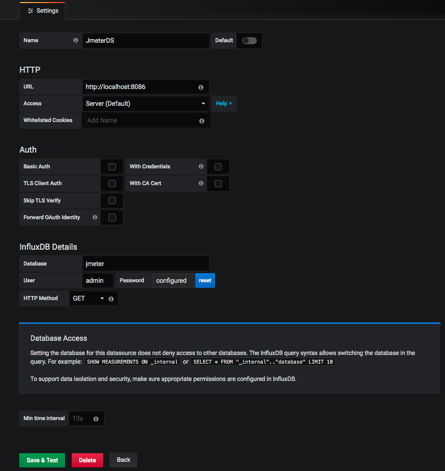

在这里配置好URL、Database、User、Password之后，直接点击保存即可。

然后添加一个JMeter dashboard，我们常用的dashboard是Grafana官方ID为5496的模板。导入进来后，选择好对应的数据源。

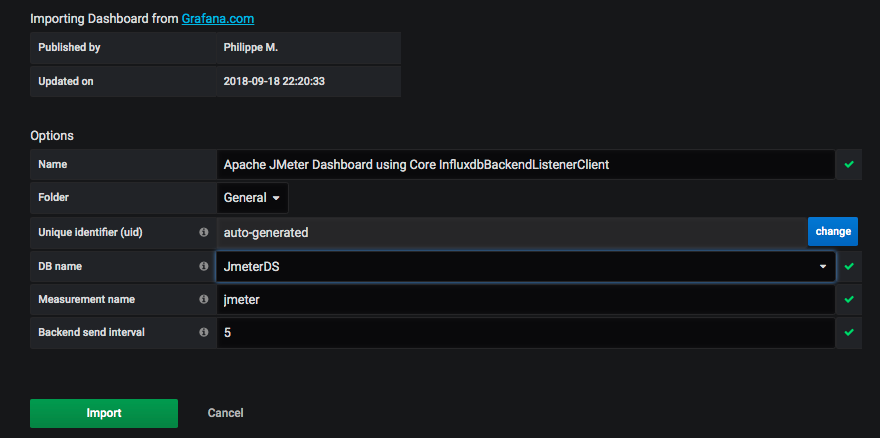

然后就看到界面了。

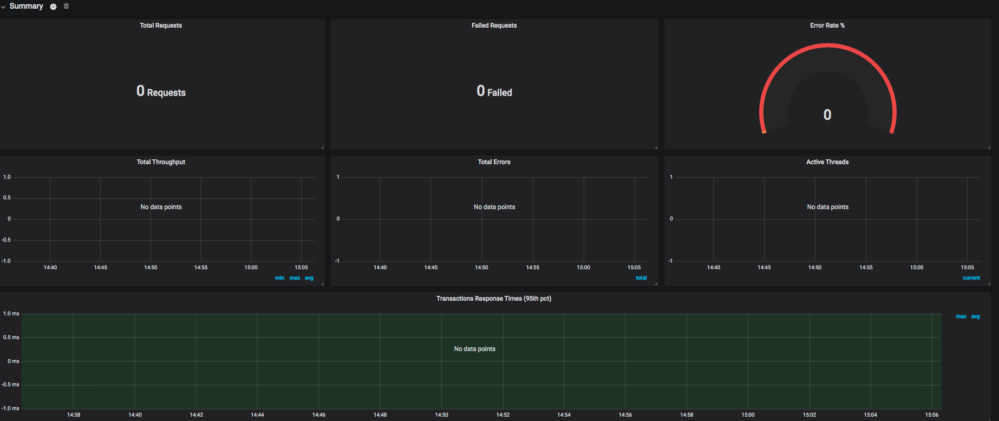

这时还没有数据，我们稍后做个示例，看下JMeter中的数据怎么和这个界面的数据对应起来。

我们先看下图中两个重要的数据查询语句吧。

TPS曲线：

```
SELECT last("count") / $send_interval FROM "$measurement_name" WHERE ("transaction" =~ /^$transaction$/ AND "statut" = 'ok') AND $timeFilter GROUP BY time($__interval)

```

上面这个就是Total TPS了，在这里称为throughput。关于这个概念，我在第一篇中就已经有了说明，这里再次提醒，概念的使用在团队中要有统一的认识，不要受行业内一些传统信息的误导。

这里取的数据来自MEASUREMENTS中成功状态的所有事务。

响应时间曲线：

```
SELECT mean("pct95.0") FROM "$measurement_name" WHERE ("application" =~ /^$application$/) AND $timeFilter GROUP BY "transaction", time($__interval) fill(null)

```

这里是用95 pct内的响应时间画出来的曲线。

整体展示出来的效果如下：

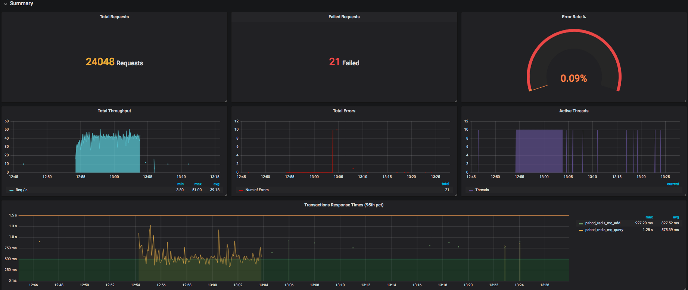

### 数据比对

首先，我们在JMeter中配置一个简单的场景。10个线程，每个线程迭代10次，以及两个HTTP请求。

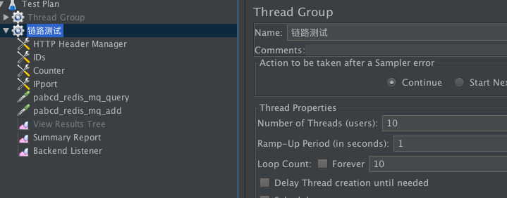

也就是说，这时会产生10x10x2=200次请求。我们用JMeter跑起来看一下。

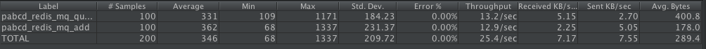

看到了吧，这个请求数和我们预想的一样。下面我们看一下Grafana中展示出来的结果。

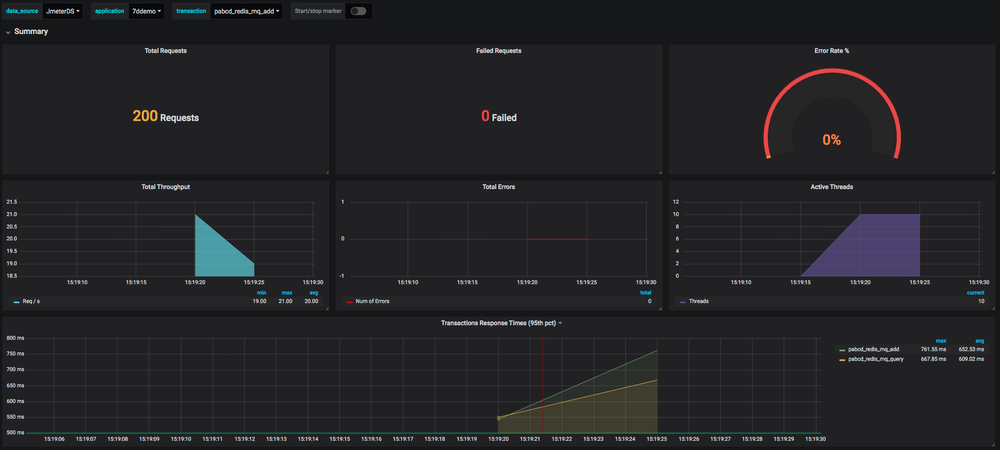

还有针对每个事务的统计情况。


至此，JMeter到Grafana的展示过程就完成了。以后我们就不用再保存JMeter的执行结果了，也不用等着JMeter输出HTML了。

## node\_exporter+Prometheus+Grafana的数据展示逻辑

对性能测试来说，在常用的Grafana+Prometheus+Exporter的逻辑中，第一步要看的就是操作系统资源了。所以在这一篇中，我们将以node\_exporter为例来说明一下操作系统抽取数据的逻辑，以便知道监控数据的来源，至于数据的含义，我们将在后续的文章中继续描述。

首先，我们还是要画一个图。

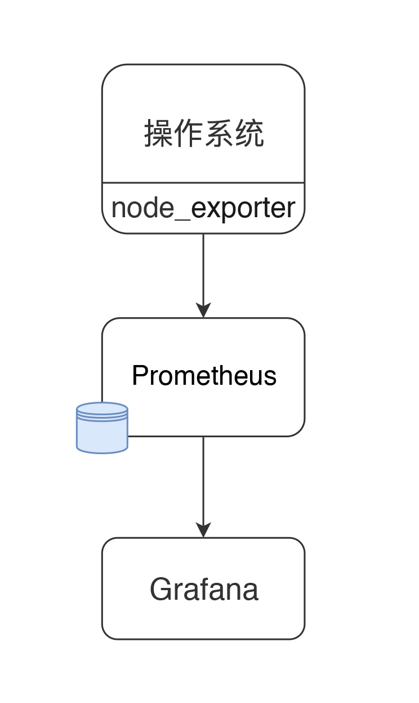

现在node\_exporter可以支持很多个操作系统了。官方列表如下：

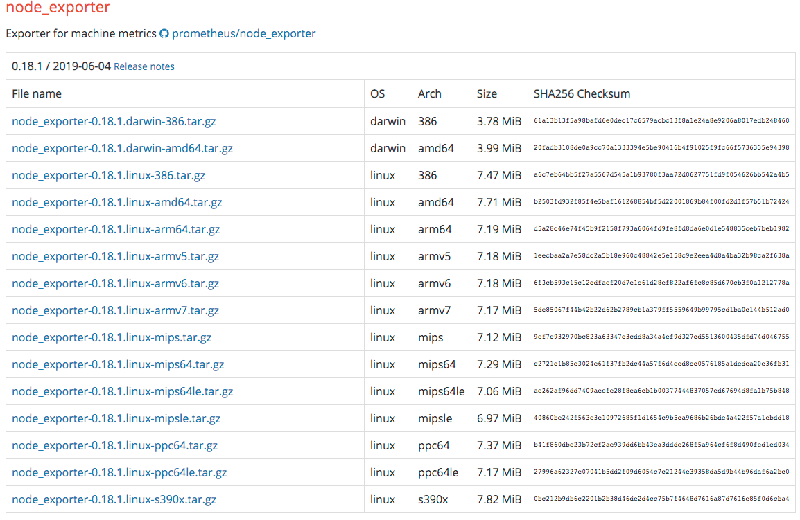

当然不是说只支持这些，你也可以扩展自己的Exporter。

### 配置node\_exporter

node\_exporter目录如下：

```
[root@7dgroup2 node_exporter-0.18.1.linux-amd64]# ll
total 16524
-rw-r--r-- 1 3434 3434    11357 Jun  5 00:50 LICENSE
-rwxr-xr-x 1 3434 3434 16878582 Jun  5 00:41 node_exporter
-rw-r--r-- 1 3434 3434      463 Jun  5 00:50 NOTICE

```

启动：

```
[root@7dgroup2 node_exporter-0.18.1.linux-amd64]#./node_exporter --web.listen-address=:9200 &

```

是不是很简洁？如果想看更多的功能 ，可以查看下它的帮助。

### 配置Prometheus

先下载Prometheus：

```
[root@7dgroup2 data]# wget -c https://github.com/prometheus/prometheus/releases/download/v2.14.0/prometheus-2.14.0.linux-amd64.tar.gz
..........
100%[=============================================================================================>] 58,625,125   465KB/s   in 6m 4s

2019-11-29 15:40:16 (157 KB/s) - ‘prometheus-2.14.0.linux-amd64.tar.gz’ saved [58625125/58625125]

[root@7dgroup2 data]

```

解压之后，我们可以看到目录结构如下：

```
[root@7dgroup2 prometheus-2.11.1.linux-amd64]# ll
total 120288
drwxr-xr-x. 2 3434 3434     4096 Jul 10 23:26 console_libraries
drwxr-xr-x. 2 3434 3434     4096 Jul 10 23:26 consoles
drwxr-xr-x. 3 root root     4096 Nov 30 12:55 data
-rw-r--r--. 1 3434 3434    11357 Jul 10 23:26 LICENSE
-rw-r--r--. 1 root root       35 Aug  7 23:19 node.yml
-rw-r--r--. 1 3434 3434     2770 Jul 10 23:26 NOTICE
-rwxr-xr-x. 1 3434 3434 76328852 Jul 10 21:53 prometheus
-rw-r--r--  1 3434 3434     1864 Sep 21 09:36 prometheus.yml
-rwxr-xr-x. 1 3434 3434 46672881 Jul 10 21:54 promtool
[root@7dgroup2 prometheus-2.11.1.linux-amd64]#

```

在 `prometheus.yml` 中添加如下配置，以取数据：

```
  - job_name: 's1'
    static_configs:
    - targets: ['172.17.211.143:9200']

```

启动：

```
[root@7dgroup2 data]# ./prometheus --config.file=prometheus.yml &

```

这样就行了吗？当然不是。根据上面的流程图，我们还需要配置Grafana。

### 配置Grafana

首先配置一个数据源，非常简单。如下所示：

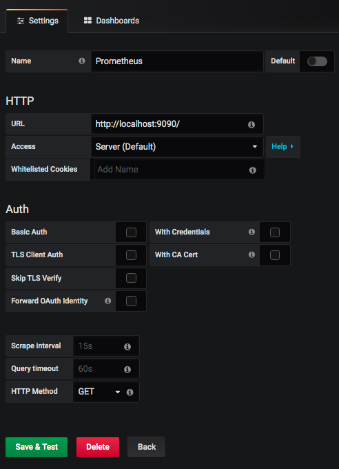

再配置一个node\_exporter的模板，比如我这里选择了官方模板（ID：11074），展示如下：

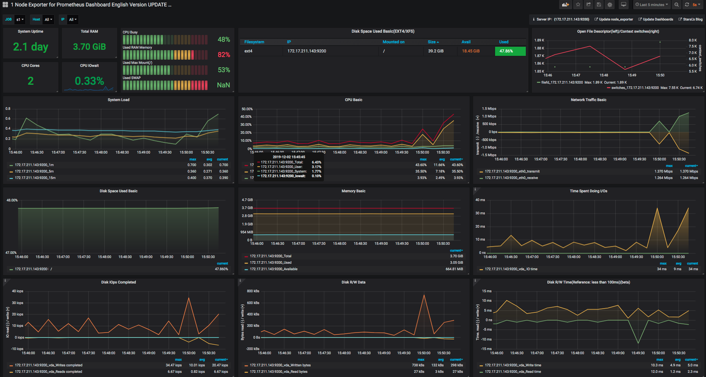

### 数据逻辑说明

说明完上面的过程之后，对我们做性能测试和分析的人来说，最重要的，就是要知道数据的来源和含义了。

拿上面图中的CPU使用率来说吧（因为CPU使用率是非常重要的一个计数器，所以我们今天先拿它来开刀）。

我们先点一下title上的edit，看一下它的query语句。

```
avg(irate(node_cpu_seconds_total{instance=~"$node",mode="system"}[30m])) by (instance)
avg(irate(node_cpu_seconds_total{instance=~"$node",mode="user"}[30m])) by (instance)
avg(irate(node_cpu_seconds_total{instance=~"$node",mode="iowait"}[30m])) by (instance)
1 - avg(irate(node_cpu_seconds_total{instance=~"$node",mode="idle"}[30m])) by (instance)

```

这些都是从Prometheus中取出来的数据，查询语句读了Prometheus中 `node_cpu_seconds_total` 的不同的模块数据。

下面我们来看一下， `node_exporter` 暴露出来的计数器。

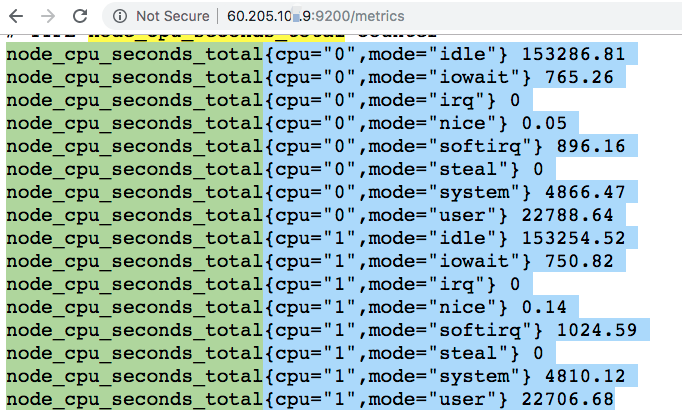

这些值和top一样，都来自于 `/proc/` 目录。下面这张图是top数据，我们可以比对一下。

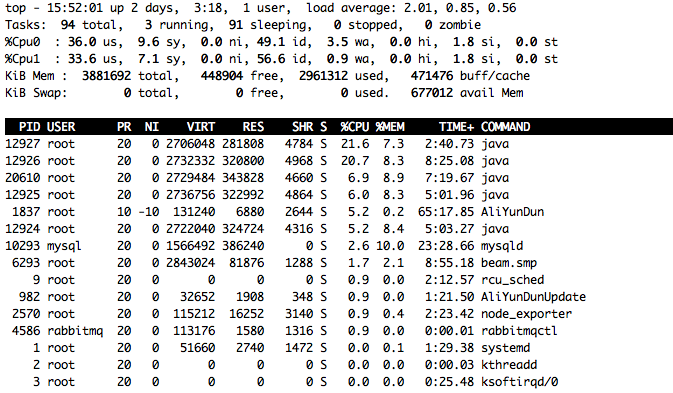

到此，我们就了解到了操作系统中监控数据的取值逻辑了，也就是从操作系统本身的计数器中取出值来，然后传给Prometheus，再由Grafana中的query语句查出相应的数据，最后由Grafana展示在界面上。

## 总结

为什么要解释数据的逻辑呢？

因为最近在工作中遇到一些情况，有人觉得有了Prometheus+Grafana+Exportor这样的组合工具之后，基本上都不再用手工执行什么命令了。但我们要了解的是，对于监控平台来说，它取的所有的数据必然是被监控者可以提供的数据，像node\_exporter这样小巧的监控收集器，它可以获取的监控数据，并不是整个系统全部的性能数据，只是取到了常见的计数器而已。

这些计数器不管是用命令查看，还是用这样炫酷的工具查看，它的值本身都不会变。所以不管是在监控平台上看到的数据，还是在命令行中看到的数据，我们最重要的是要知道含义以及这些值的变化对性能测试和分析的下一步骤的影响。

后面我们将着重来解释这些细节。

## 问题

最后我个问题吧，你可以自己去验证下。JMeter是如何把数据推送到Grafana中呢？另外，同样是监控操作系统的计数器，监控平台中的数据和监控命令中的数据有什么区别？

欢迎你在评论区写下你的思考，也欢迎把这篇文章分享给你的朋友或者同事，一起交流一下。