# 17丨CentOS：操作系统级监控及常用计数器解析（上）
我相信有一些人看到这篇文章的标题肯定有种不想看的感觉，因为这样的内容实在被写得太多太多了。操作系统分析嘛，无非就是CPU使用率、I/O使用率、内存使用率、网络使用率等各种使用率的描述。

然而因为视角的不同，在性能测试和分析中，这始终是我们绕不过去的分析点。我们得知道什么时候才需要去分析操作系统，以及要分析操作系统的什么内容。

首先，我们前面在性能分析方法中提到，性能分析要有起点，通常情况下，这个起点就是响应时间、TPS等压力工具给出来的信息。

我们判断了有瓶颈之后，通过拆分响应时间就可以知道在哪个环节上出了问题，再去详细分析这个操作系统。这就需要用到我们的分析决策树了。

你还记得我们 [在第6篇文章](https://time.geekbang.org/column/article/182912) 中提到的分析决策大树吗？今天我们单独把操作系统的这一环节给提出来，并加上前面说的细化过程，就可以得到下面的这个分析决策树。

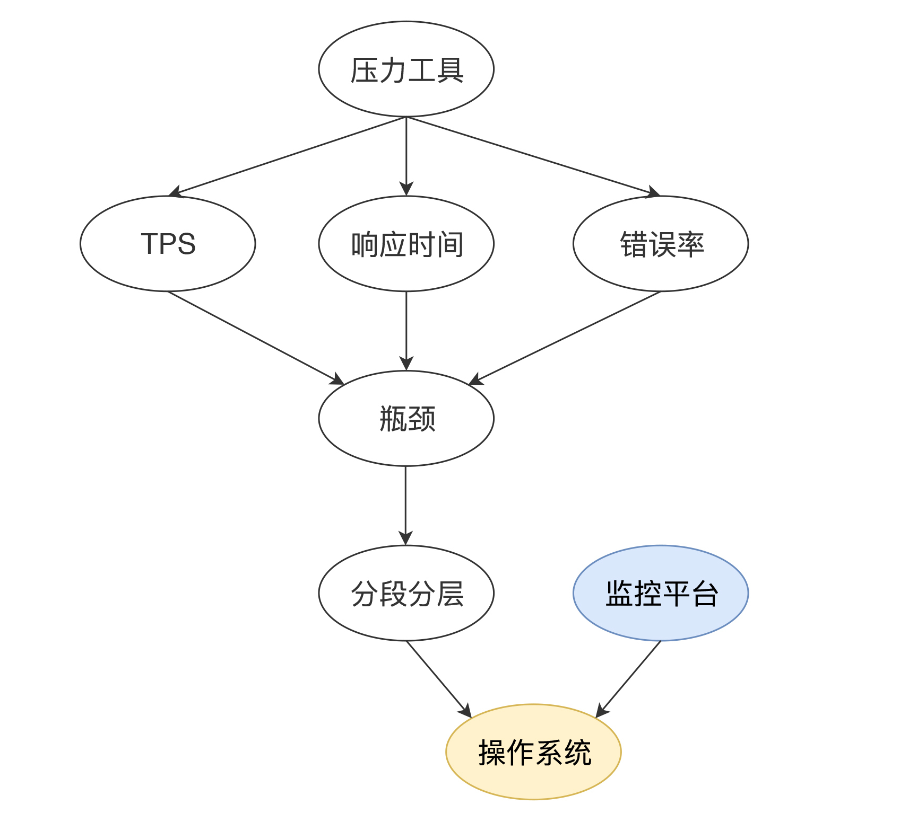

在分段分层确定了这个系统所运行的应用有问题之后，还要记起另一件事情，就是前面提到的“全局—定向”的监控思路。

既然说到了全局，我们得先知道操作系统中，都有哪些大的模块。这里就到了几乎所有性能测试人员看到就想吐的模块了，CPU、I/O、Memory、Network…

没办法，谁让操作系统就这么点东西呢。我先画一个思维导图给你看一下。

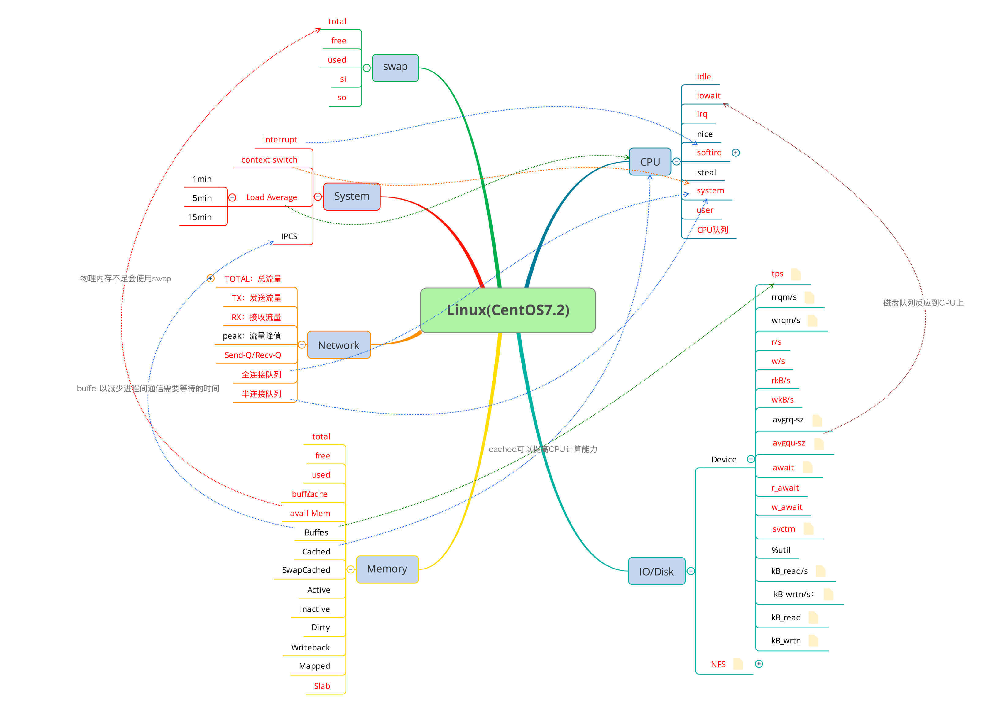

我很努力地把一些常见指标的相应关系都画到了图中，你是不是已经看晕了？看晕就对了，别着急。

我们先要知道的是，面对这些大的模块，到底要用什么的监控手段来实现对它们的监控呢？要知道，在一篇文章中不可能详尽地描述操作系统，我会尽量把我工作中经常使用到的一些和性能分析相关的、使用频度高的知识点整理给你。

## 监控命令

我们经常用到的Linux监控命令大概有这些： `top`、 `atop`、 `vmstat`、 `iostat`、 `iotop`、 `dstat`、 `sar` 等……请你注意我这里列的监控命令是指可以监控到相应模块的计数器，而不是说只能监控这个模块，因为大部分命令都是综合的工具集。

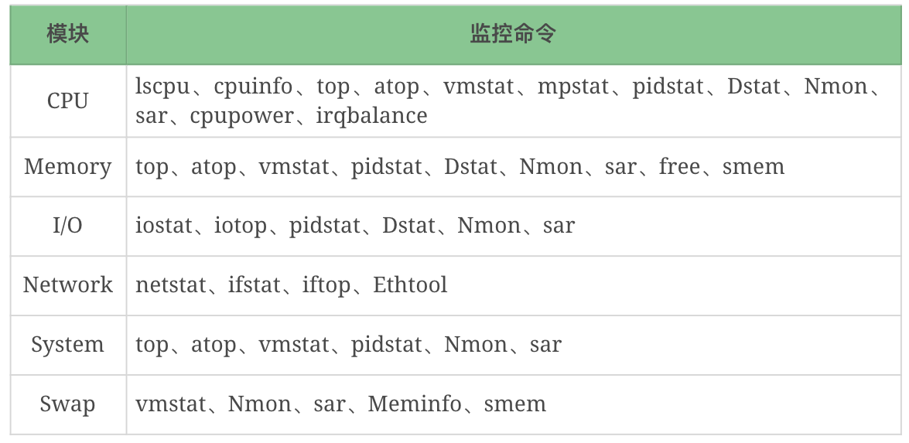

像这样的监控工具还能列上一堆，但这并不是关键，关键的是我们在什么时候能想起来用这些工具，以及知道这些工具的局限性。

比如说top，它能看CPU、内存、Swap、线程列表等信息，也可以把I/O算进去，因为它有CPU的wa计数器，但是它看不了Disk和Network，这就是明显的局限性。之后出现的 `atop` 对很多内容做了整理，有了Disk和Net信息，但是呢，在一些Linux发行版中又不是默认安装的。 `vmstat` 呢？它能看CPU、内存、队列、Disk、System、Swap等信息，但是它又看不了线程列表和网络信息。

像这样的局限，我还能说上两千字。

当工具让你眼花缭乱的时候，不要忘记最初的目标，我们要监控的是这几大模块：CPU、I/O、Memory、Network、System、Swap。

然后，我们再来对应前面提到的“全局—定向”监控的思路。如果你现在仅用命令来监控这个系统，你要执行哪几个呢？

对应文章前面的思维导图，我们做一个细致的表格。

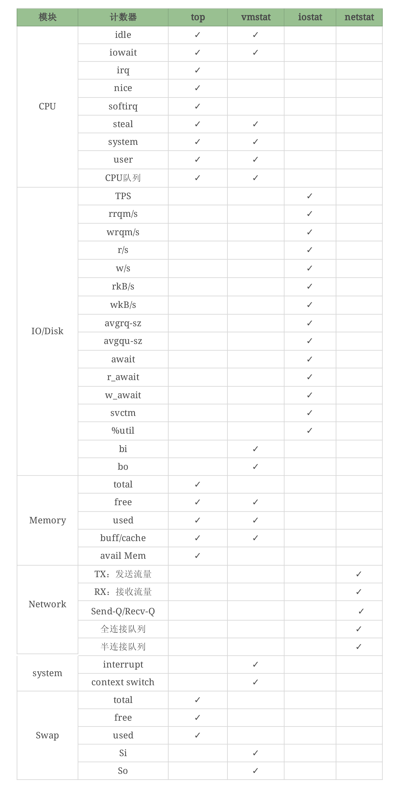

你会发现， `vmstat` 可以看Swap，但它能看的是 `si` 和 `so`，看不到其他的计数器，但是 `top` 可以看到这些计数器……像这样的细节还有很多。

因为计数器非常多，又不是每个都常用。但是万一某个时候就需要用了呢？这个时候如果你不知道的话，就无法继续分析下去。

这里我主要想告诉你什么呢？就是用命令的时候，你要知道这个命令能干什么，不能干什么。你可能会说，有这些么多的计数器，还有这么多的命令，光学个OS我得学到啥时候去？

我要告诉你的是监控的思考逻辑。你要知道的是，正是因为你要监控CPU的某个计数器才执行了这个命令，而不是因为自己知道这个命令才去执行。这个关系我们一定要搞清楚。

那么逻辑就是这样的：


比如说，我想看下OS各模块的性能表现，所以执行top这个命令看了一些计数器，同时我又知道，网络的信息在 `top` 中是看不到的，所以我要把OS大模块看完，还要用 `netstat` 看网络，以此类推。

如果你还是觉得这样不能直接刺激到你的神经，懵懂不知道看哪些命令。那么在这里，我用上面的工具给你做一个表格。

命令模块对照表：

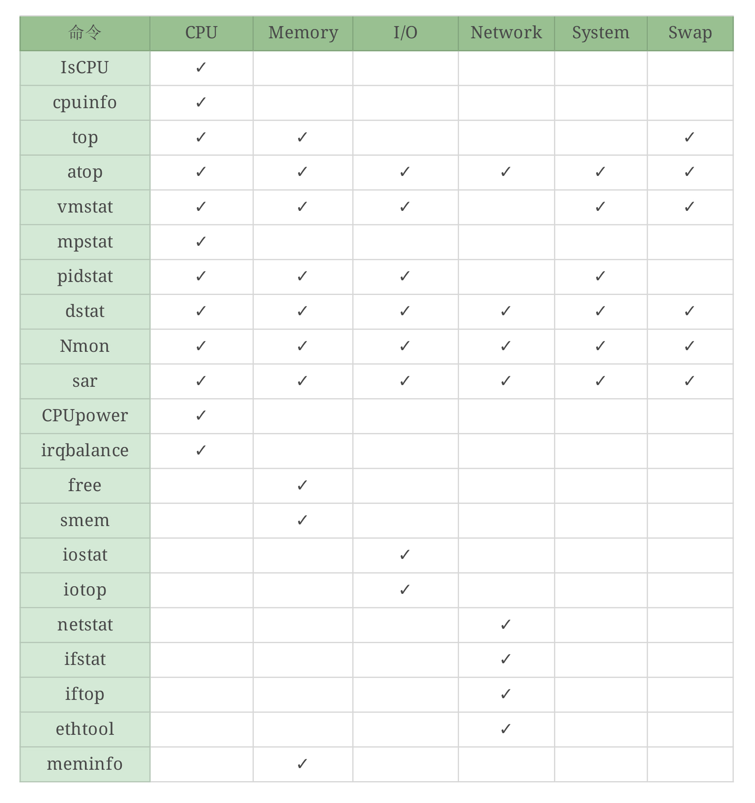

我虽然给出了这张表，但要想融会贯通，还需要你亲手画几遍，每个命令都练习很多遍。好，这个时候，我们就已经把全局监控的第一层的计数器基本看完了。

如果你站起来说：“高老师！你忽悠我，我这还有个想看的，你这里还没有！”

那你就在上面的表格中加上你想看的计数器和相关的命令就可以了，你的这个表格就会越来越丰富，丰富的过程中，也就慢慢厘清了自己的思路。

有了这些命令垫底之后，下面我们来看常用的监控平台。

## 监控平台Grafana+Prometheus+node\_exporter

这是现在用得比较多的监控平台了。在微服务时代，再加上Kubernetes+Docker的盛行，这个监控套装几乎是干IT的都知道。

我们来看一下常用的Dashboard。为了理解上的通用性，我这里都用默认的信息，不用自己定制的。

Grafana.com官方ID：8919的模板内容如下：

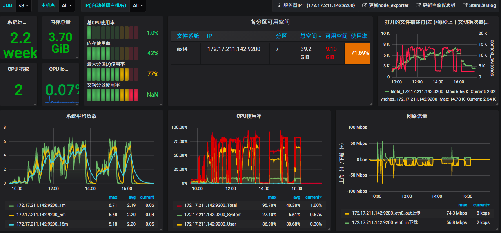

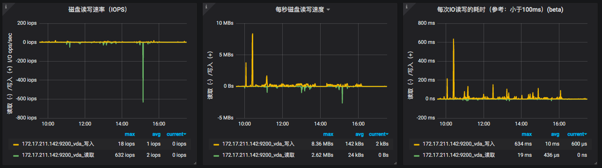

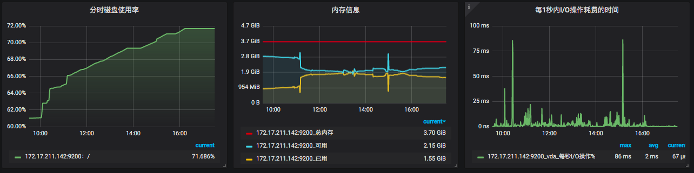

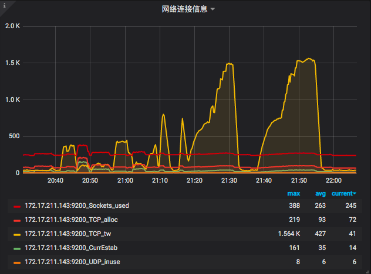

还记得我们要看系统的模块是哪几个吗？

- CPU
- Memory
- I/O
- Network
- System
- Swap

你可以自己对一下，是不是大模块都没有漏掉？确实没有。但是！上面的计数器你得理解。

我们先来看一下CPU。

上图中有了System、User、I/O Wait、Total，还记得我们上面说top里有8个CPU计数器吧，这里就4个怎么办？

Total这个值的计算方式是这样的：

```
    1 - avg(irate(node_cpu_seconds_total{instance=~"$node",mode="idle"}[30m])) by (instance)

```

也就是说，它包括除了空闲CPU的其他所有CPU使用率，这其实就有ni、hi、si、st、guest、gnice的值。当我们在这个图中看到System、User、I/O Wait都不高时，如果Total很高，那就是ni、hi、si、st、guest、gnice计数器中的某个值大了。这时你要想找问题，就得自己执行命令查看了。

看完CPU之后，再看一下Network。

上图中有网络流量图。可以看到只有“上传下载”，这个值似乎容易理解，但是不够细致。node\_exportor还提供了一个“网络连接信息”图。可以看到Sockets\_used、CurrEstab、TCP\_alloc、TCP\_tw、UDP\_inuse这些值，它们所代表的含义如下：

- Sockets\_used：已使用的所有协议套接字总量
- CurrEstab：当前状态为 ESTABLISHED 或 CLOSE-WAIT 的 TCP 连接数
- TCP\_alloc：已分配（已建立、已申请到sk\_buff）的TCP套接字数量
- TCP\_tw：等待关闭的TCP连接数
- UDP\_inuse：正在使用的 UDP 套接字数量

这些值也可以通过查看“cat /proc/net/sockstat”知道。这是监控工具套装给我们提供的便利，

然后我们再来看下Memory。

上图中有总内存、可用内存、已用内存这三个值。如果从应用的角度来看，我们现在对内存的分析，就要和语言相关了。像Java语言，一般会去分析JVM。我们对操作系统的物理内存的使用并不关注，在大部分场景下物理内存并没有成为我们的瓶颈点，但这并不是说在内存上就没有调优的空间了。

关于内存这一块，我不想展开太多。因为展开之后内容太多了，如果你有兴趣的话，可以找内存管理的资料来看看。

其他几个模块我就不再一一列了，I/O、System、Swap也都是有监控数据的。

从全局监控的角度上看，这些计数器也基本够看。但是对于做性能分析、定位瓶颈来说，这些值显然是不够的。

还记得我在前面提到的“先全局监控再定向监控”找证据链的理念吧。像node\_exporter这样的监控套装给我们提供的就是全局监控的数据，就是大面上覆盖了，细节上仍然不够。

那怎么办呢？下面我就来一一拆解一下。

## CPU

关于CPU的计数器，已经有很多的信息了。这里我再啰嗦一下。CPU常见的计数器是top中的8个值，也就是下面这些：

```
%Cpu(s):  0.7 us,  0.5 sy,  0.0 ni, 98.7 id,  0.0 wa,  0.0 hi,  0.2 si,  0.0 st

```

含义我就不写了，你搜一下就会知道。

在mpstat（Multi-Processor Statistics）中看到的是10个计数器：

```
[root@7dgroup3 ~]# mpstat -P ALL 3
Linux 3.10.0-957.21.3.el7.x86_64 (7dgroup3) 	12/27/2019 	_x86_64_	(2 CPU)

03:46:25 PM  CPU    %usr   %nice    %sys %iowait    %irq   %soft  %steal  %guest  %gnice   %idle
03:46:28 PM  all    0.17    0.00    0.17    0.00    0.00    0.00    0.00    0.00    0.00   99.66
03:46:28 PM    0    0.33    0.00    0.00    0.00    0.00    0.00    0.00    0.00    0.00   99.67
03:46:28 PM    1    0.00    0.00    0.00    0.00    0.00    0.00    0.00    0.00    0.00  100.00

```

这里多出来 `%guest`、 `%gnice` 两个值。他们的含义在Linux man page中有详细的说明。

> %guest ：Show the percentage of time spent by the CPU or CPUs to run a virtual processor.

> %gnice：Show the percentage of time spent by the CPU or CPUs to run a niced guest.

你可以看到计数器的名字稍有不同，像 `top` 中的 `wa` 在 `mpstat` 中是 `%iowait`， `si` 是mpstat中的 `%soft`。

在Linux中，这就是我们经常查看的CPU计数器了。在我的性能生涯中，常见的问题大部分都是体现在这么几个计数器上（排名有先后）：

1. us
2. wa
3. sy
4. si

首先，为了确定看到CPU高之后，接着往下分析的方向是绝对没有错的，建议你用 `Perf top -g` 先看一下CPU热点。 `perf` 默认用的是 `cpu-clock` 事件。这一步只是为了确定方向对不对。

那么如何从这几个计数器找到后续的证据链呢？下面就是我们定向监控分析的过程了。 **我要狂敲黑板了！！！**

us CPU是用户态进程消耗的CPU百分比。大家都知道怎么往下落。这个链就是下面这样的：

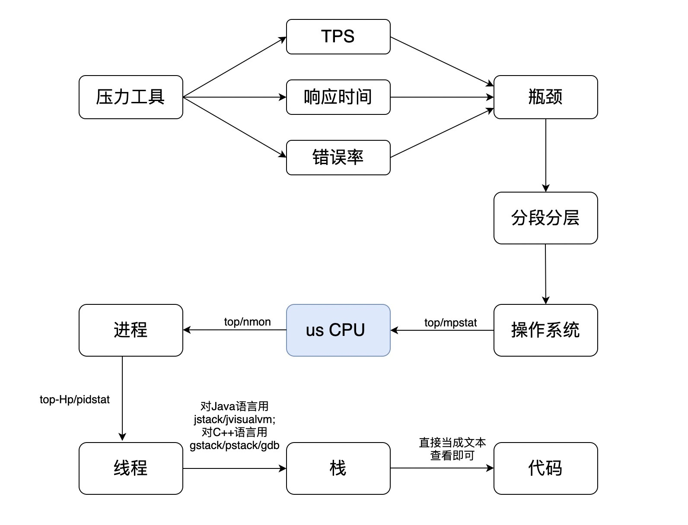

当然不是只有这几个命令可以用，你可以找到大把的工具用，我只是列出来常用的。你要是想炫技，可以自己写些脚本来做。这个过程几乎被写烂了，所以，我就不多余举例子了。

`wa cpu` 是I/O读写等待消耗的CPU百分比。这个证据链怎么往下落呢？来看一下。

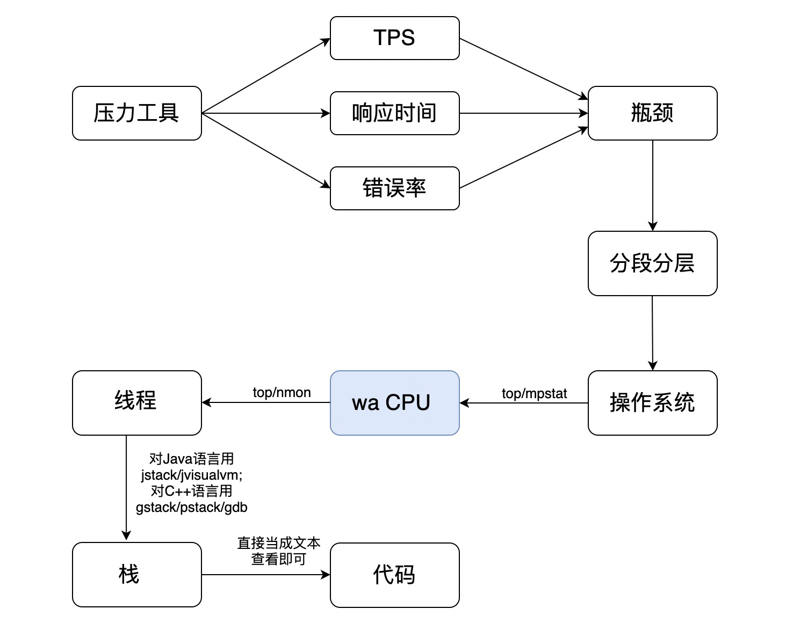

你看中间有一步跳跃，这就是wa CPU直接跳到线程了。为什么没有进程了呢？那是因为iotop有直接到线程的能力。如果你想先看进程也可以，记得执行iotop -P。

sy CPU是内核消耗的CPU百分比。这个问题就有点复杂了，因为它并没有一个固定的套路。但是它的分析链路仍然和us CPU高的分析链路差不多，只是这个进程可能不是应用的，而是系统自己的。但是，是什么导致内核进程占用CPU高呢。这可能和应用有关，当然也可能和配置有关。那么现在我们画一个它的分析链路。

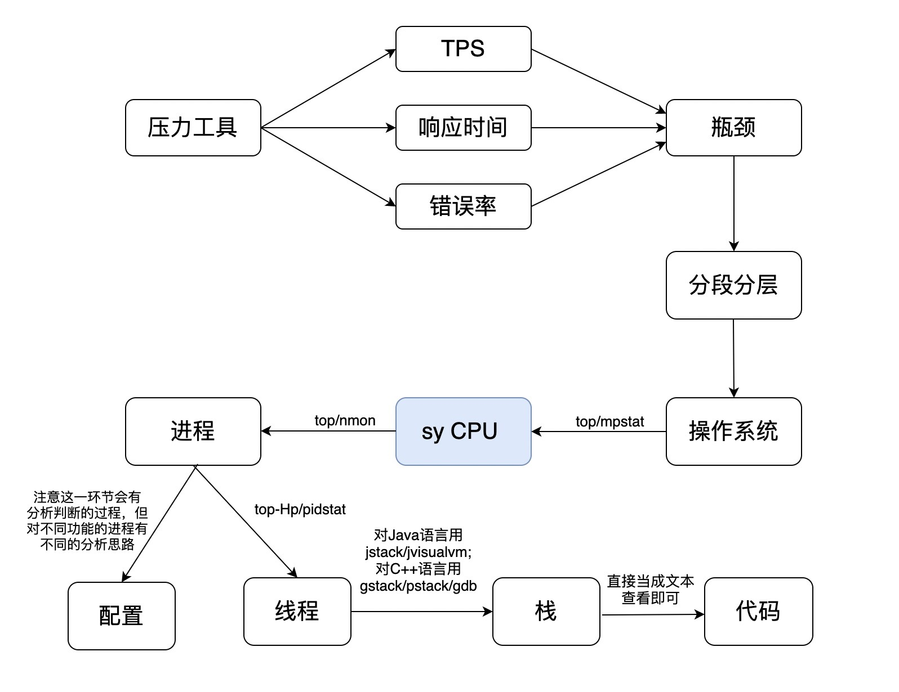

其实在实际的分析过程中，也是这样的。如果我们看到一个系统的进程消耗了更多的资源，那就要去查一下这个进程是干吗的，看它的运行逻辑和配置文件。不一定所有情况都是配置的问题，但绝大多数情况是这个原因，只能说，在系统级别，我们遇到的内核进程本身有性能问题的情况还是很少的。大部分时候都只是配置问题。

si CPU是软中断消耗的CPU百分比。什么是软中断呢？在wikipedia.org中有这样的描述：

> In digital computers, an interrupt is an input signal to the processor indicating an event that needs immediate attention. An interrupt signal alerts the processor and serves as a request for the processor to interrupt the currently executing code, so that the event can be processed in a timely manner. If the request is accepted, the processor responds by suspending its current activities, saving its state, and executing a function called an interrupt handler (or an interrupt service routine, ISR) to deal with the event. This interruption is temporary, and, unless the interrupt indicates a fatal error, the processor resumes normal activities after the interrupt handler finishes.

简单点来说，当出现异常或资源争用时，它是用来管理秩序的。CPU正在吭哧吭哧着干活呢，突然来了一个优先级高的，needs immediate attention，这时就会发一个中断信号给CPU。作为一个干活的，CPU谁的话都得听，这时候就把手头的工作现场保存一下，干这个优先级高的活。除非这个中断是致命的，不然CPU会在干完这个活之后再回去干之前的活，这就是一次软中断。

这个值，越多就越有问题，关键是它有多少才是有问题呢？这一点你从来没有看过有人给建议值对不对？因为它根本没有可以参考的值，在不同的应用和硬件环境中，si CPU都会有很大差别。我见过软中断每秒几万多就有问题的，也见过软中断每秒20万都没有问题的。

下面我来照例画个分析的图看一下。

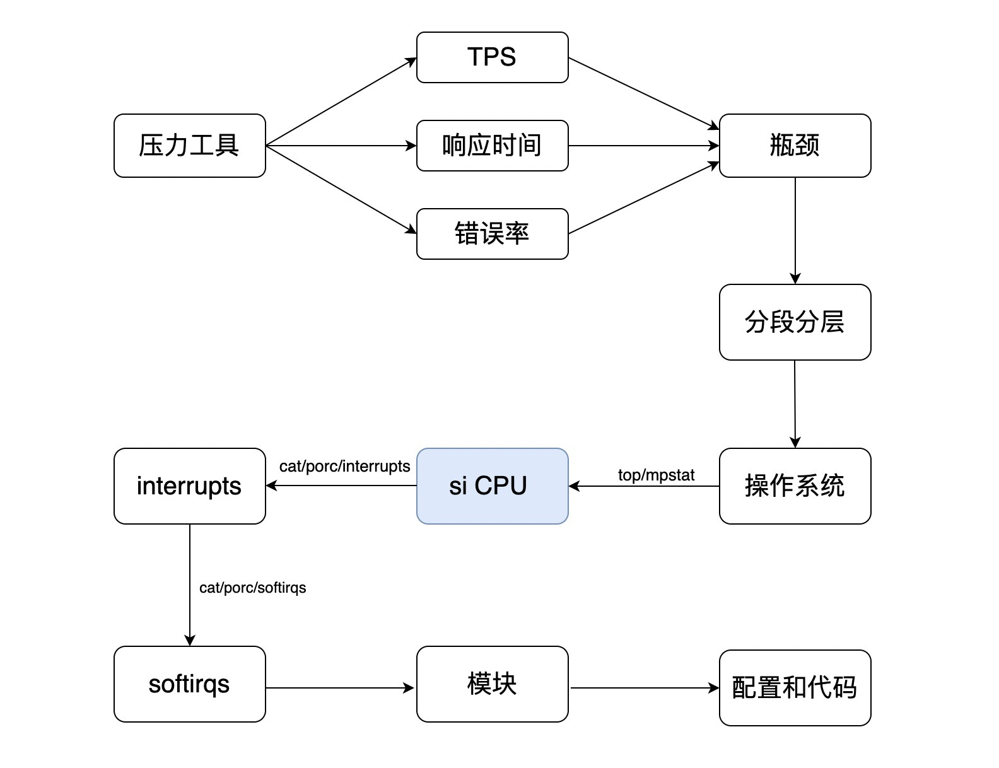

在这个判断的链路中，就是要把si的中断模块找出来，然后再分析这个模块的功能和配置。比如我们看网卡的中断，这是常见的一种性能问题。我们要知道网络是带宽不够？还是配置得不对？还是防火墙？还是啥啥啥别的原因？

如果是其他的模块也是一样的逻辑。

好，在知道了上面这几个常见的CPU计数器的分析证据链逻辑之后，我就不再详细画其他的CPU的计数器了。

ni呢，在我职业生涯中就没见过它高过；hi倒是见过，不过是因为硬件坏了；st呢，只有无良商家不断超卖虚拟服务器才会出现。如果你在一个企业内部搭建的虚拟化基础平台上也经常看见这种情况，那就是公司太穷了，硬件都不够用。

## 总结

在操作系统的分析过程中，CPU绝对是一个重点分析的对象，它的一举一动都牵动着性能分析的人，所以我们需要在CPU的高低上花很多的时间去分析判断。

幸运的是，当CPU使用率高的时候，我们可以有很多的手段来找到对应的根本原因。这个过程不仅分析思路完整，而且工具繁多。它不像网络那么绕，也不像内存那么复杂，逻辑上还是很清楚的。

## 思考题

看完了今天的内容，你不妨说一下为什么CPU是很多性能问题分析的方向性指标？

欢迎你在评论区写下你的思考，也欢迎把这篇文章分享给你的朋友或者同事，一起交流一下。