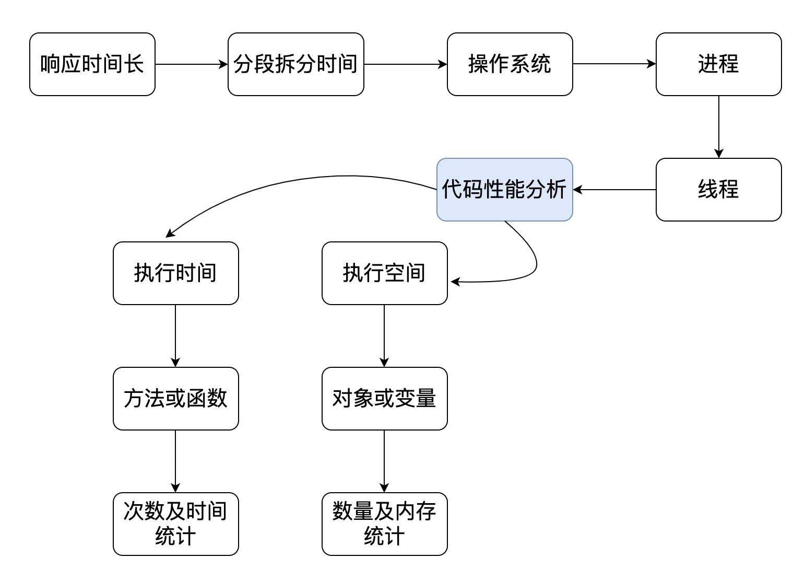
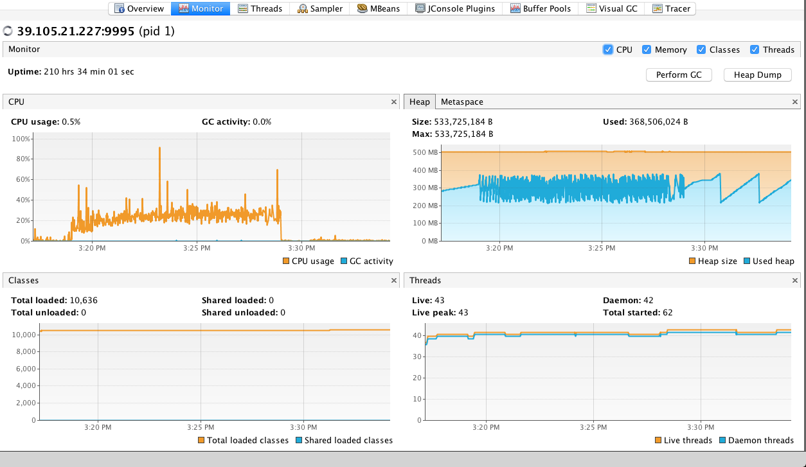
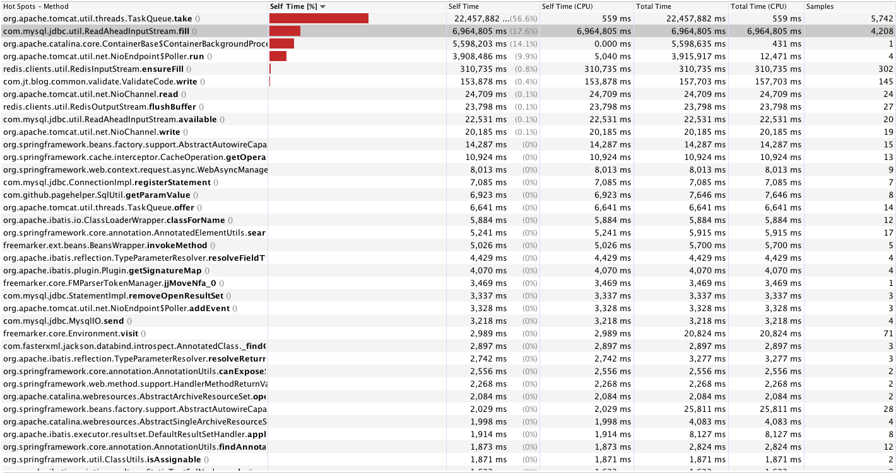
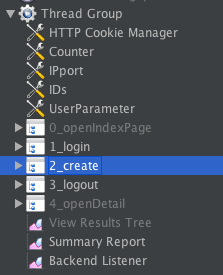
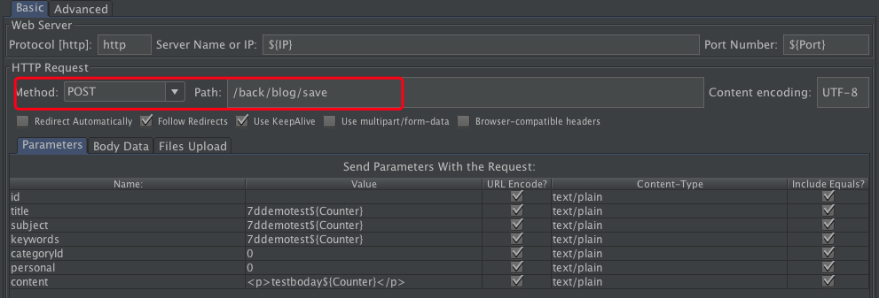
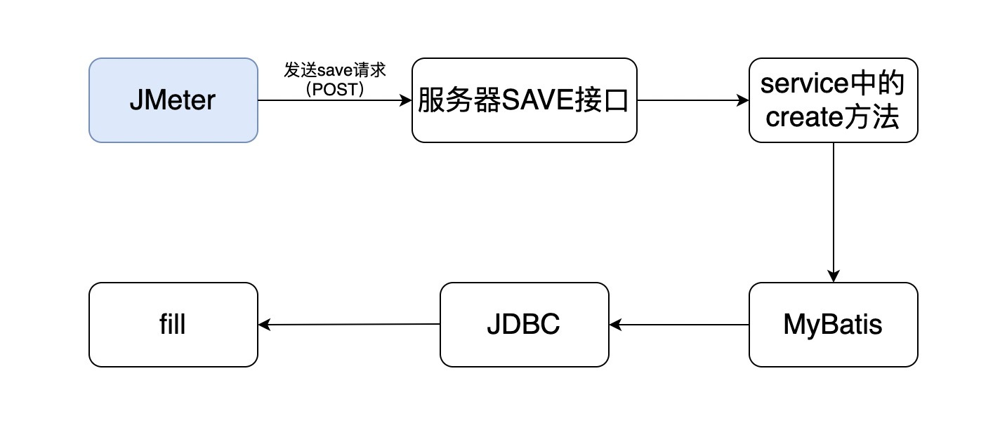
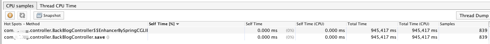
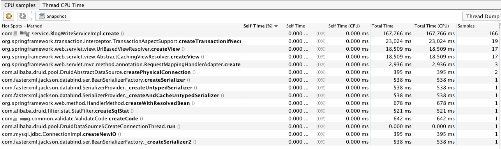
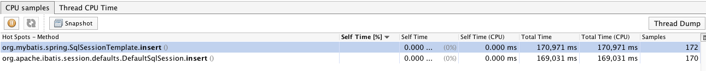

# 19丨Java & C ++：代码级监控及常用计数器解析（上）
在性能测试分析中，有一部分人存在着一个思路上的误解，那就是一开始就一头扎进代码里，折腾代码性能。这是我非常反对的一种做法。

事实上，要想这么做，有一个前提，那就是架构中的其他组件都经过了千锤百炼，出现问题的可能性极低。

实际上，我凭着十几年的经验来看，大部分时候，代码出现严重性能瓶颈的情况还真是不多。再加上现在成熟的框架那么多，程序员们很多情况下只写业务实现。在这种情况下，代码出现性能瓶颈的可能性就更低了。

但我们今天终归要说代码级的监控及常用的计数器。如何去评估一个业务系统的代码性能呢？在我看来，分析的思路是下面这个样子的。



从上图可以看到，分析的时候有两个关键点：执行时间和执行空间。我相信很多人都清楚，我们要很快找到执行时间耗在哪一段和空间耗在哪里。

现在我们来实际操作一下，看如何判断。

## Java类应用查找方法执行时间

首先你得选择一个合适的监控工具。Java方法类的监控工具有很多，这里我选择JDK里自带的jvisualvm。

顺便说一下，我的Java版本号是这个：

```
(base) GaoLouMac:~ Zee$ java -version
java version "1.8.0_111"
Java(TM) SE Runtime Environment (build 1.8.0_111-b14)
Java HotSpot(TM) 64-Bit Server VM (build 25.111-b14, mixed mode)

```

打开应用服务器上的JMX之后，连上jvisualvm，你会看到这样的视图。



这里再啰嗦一下我们的目标，这时我们要找到消耗CPU的方法，所以要先点 `Sampler - CPU`，你可以看到如下视图。



从上图可以看到方法执行的累积时间，分别为自用时间百分比、自用时间、自用时间中消耗CPU的时间、总时间、总时间中消耗CPU的时间、样本数。

从这些数据中就可以看到方法的执行效率了。

但是，这里面Method这么多，我怎么知道哪个跟我的方法执行时间有关呢？比如说上面这个应用中，最消耗CPU的是JDBC的一个方法fill。这合理吗？

先来看一下我的脚本。



从结构上你就能看出来，我做了登录，然后就做了创建的动作，接着就退出了。

这几个操作和数据库都有交互。拿create这个步骤来说，它的脚本非常直接，就是一个POST接口。



还记得前面我们怎么说查看后端的运行逻辑的吗？后端接收这个POST的代码如下：

```
    @RequestMapping("/save")
    @ResponseBody
    public Object save(Blog blog, HttpSession session){
        try{
            Long id = blog.getId();
            if(id==null){
                User user = (User)session.getAttribute("user");
                blog.setAuthor(user.getName());
                blog.setUserId(user.getId());
                blog.setCreateTime(new Date());
                blog.setLastModifyTime(new Date());
                blogWriteService.create(blog);
            }else {
                blog.setLastModifyTime(new Date());
                blogWriteService.update(blog);
            }
        }catch (Exception e){
            throw new JsonResponseException(e.getMessage());
        }
        return true;
    }

```

这段代码的功能就是讲前端内容接收过来放到实体中，然后通过create方法写到数据库中。那么create是怎么实现的呢？

```
    public void  create(Blog blog) {
        mapper.insert(blog);
        BlogStatistics blogStatistics = new BlogStatistics(blog.getId());
        blogStatisticsMapper.insert(blogStatistics);

```

它就是一个mapper.insert，显然这个create是我们自己实现的代码，里面其实没有什么逻辑。而ReadAheadInputStream.fill是create中的MyBatis调用的JDBC中的方法。 从压力工具到数据库的调用逻辑就是：



而我们看到的最耗时的方法是最后一个，也就是fill。实际上，我们应该关心的是save接口到底怎么样。我们来过滤下看看。



从save的结果上来看，它本身并没有耗什么时间，都是后面的调用在消耗时间。

我们再来看看cerate。



它本身也没消耗什么时间。

顺着逻辑图，我们再接着看MyBatis中的insert方法。



就这样一层层找下去，最后肯定就找到了fill这个方法了。但是你怎么知道整个调用逻辑中有哪些层级呢？你说我可以看源码。当然不是不可以。但要是没有源码呢？做性能分析的人经常没有源码呀。

这个时候，我们就要来看栈了。这里我打印了一个调用栈，我们来看下这个逻辑。

```
"http-nio-8080-exec-1" - Thread t@42
   java.lang.Thread.State: RUNNABLE
	...............
	at com.mysql.jdbc.util.ReadAheadInputStream.fill(ReadAheadInputStream.java:100)
    ...............
    ...............
    at com.sun.proxy.$Proxy87.create(Unknown Source)
	...............
	at com.blog.controller.BackBlogController.save(BackBlogController.java:85)
	...............
	at java.lang.Thread.run(Thread.java:745)

   Locked ownable synchronizers:
	- locked <4b6968c3> (a java.util.concurrent.ThreadPoolExecutor$Worker)

```

我把其他的都给清掉了，我们只看最简单的栈逻辑，其中UnknownSource的部分是因为反射实现的insert没有把源码反编译出来。

其实这个栈有117行，我怕你看晕。

从这一层一层的关系中，我们就可以知道调用逻辑了。知道调用逻辑的方法有很多，看源码也行，看编译后运行的代码也行，关键在于知道谁调了谁，这样就行了。

我这个还算是清晰的调用逻辑，要是代码调用关系再复杂一些，分分钟有想死有没有？

不过比较好的是，像jvisualvm这样的工具给我们提供了很多便利。这时可能有人会跳起来了，为什么不用Arthas、BTrace之类的工具呢？如果你喜欢的话，可以把Athas弄上，像下面这样。

```
[arthas@1]$ trace com.blog.controller.BackBlogController save
Press Q or Ctrl+C to abort.
Affect(class-cnt:2 , method-cnt:2) cost in 320 ms.
`---ts=2020-01-06 10:38:37;thread_name=http-nio-8080-exec-2;id=2b;is_daemon=true;priority=5;TCCL=org.apache.catalina.loader.ParallelWebappClassLoader@4f2895f8
    `---[29.048684ms] com.blog.controller.BackBlogController$$EnhancerBySpringCGLIB$$586fe45c:save()
        `---[28.914387ms] org.springframework.cglib.proxy.MethodInterceptor:intercept() #0
            `---[27.897315ms] com.blog.controller.BackBlogController:save()
                ...............
                `---[24.192784ms] com.blog.service.BlogWriteService:create() #85

```

这也能看出来creat是消耗了时间的。如果你接着跟踪create方法。如下所示：

```
[arthas@1]$ trace com.blog.service.BlogWriteService create //这一行是arthas中跟踪class中的某个具体方法的语句。
Press Q or Ctrl+C to abort.
Affect(class-cnt:2 , method-cnt:2) cost in 199 ms. //被跟踪方法的处理次数和时长
`---ts=2020-01-06 10:41:51;thread_name=http-nio-8080-exec-4;id=2f;is_daemon=true;priority=5;TCCL=org.apache.catalina.loader.ParallelWebappClassLoader@4f2895f8
    `---[6.939189ms] com.sun.proxy.$Proxy87:create()
`---ts=2020-01-06 10:41:51;thread_name=http-nio-8080-exec-10;id=38;is_daemon=true;priority=5;TCCL=org.apache.catalina.loader.ParallelWebappClassLoader@4f2895f8
        `---[4.144799ms] com.blog.service.BlogWriteServiceImpl:create()  //写接口中create方法耗时
            +---[2.131934ms] tk.mybatis.mapper.common.Mapper:insert() #24   //mybatis中insert方法耗时
                ...............
            `---[1.95441ms] com.blog.mapper.BlogStatisticsMapper:insert() #26 //insert方法调用了上面的create方法耗时

```

要是接着往下跟踪，就可以看到反射这一块了。

```
[arthas@1]$ trace tk.mybatis.mapper.common.Mapper insert
Press Q or Ctrl+C to abort.
Affect(class-cnt:5 , method-cnt:5) cost in 397 ms.
`---ts=2020-01-06 10:44:01;thread_name=http-nio-8080-exec-5;id=33;is_daemon=true;priority=5;TCCL=org.apache.catalina.loader.ParallelWebappClassLoader@4f2895f8
    `---[3.800107ms] com.sun.proxy.$Proxy80:insert()

```

类似的，你还可以玩JDK自带的工具jdb，它也可以直接attach到一个进程上，调试能力也是不弱的。

在我看来，这些工具、手段都是为了实现从 `响应时间长<->代码行` 的分析过程。思路是最重要的。

另外也要说一下，现在有的APM工具也可以实现这样的功能，但是呢，我并不建议一开始就上这么细致的工具，因为不管APM产品吹得有多牛逼，它都是要消耗10%左右的CPU的。并且，你觉得直接在生产上装一个APM工具的agent到业务系统中是合理的吗？如果是自己实现的metrics方法，输出性能数据尚可接受，如果是别人的这类工具，还是算了。

在大部分时候，我都不建议在生产上用APM工具。万一生产上真的有极端的情况，需要看细致的性能问题，再临时attach上去，也可以做到。何必为了可能出现的问题而长时间地消耗资源呢。

## 总结

大部分时间里，性能测试和分析都在和时间打交道，而在时间的拆分逻辑中，我们在前面也提到过思路，如何一步步把时间拆解到应用当中，那就是 **分段**。

当拆解到应用当中之后，就是抓函数方法的执行时间了。这是保证我们从前到后分析逻辑的关键一环，请你注意，是关键一环，而不是最初的一环。

通过这篇文章我想告诉你，在大部分的开发语言中，都有手段直接将方法的执行时间消耗抓出来，你可能现在还不知道是什么方法，没关系，因为跟踪的手段有很多，你可以临时去学习如何操作。

我只要在你的脑子里种下这样的一种印象，那就是，有办法抓到函数方法的执行时间消耗在哪里！

## 思考题

最后给你留两道思考题吧。我为什么不建议在生产环境中一开始就上APM类工具来抓取方法的执行时间呢？你有什么方法可以抓取到Java语言中的方法执行时间？如果你擅长其他语言，也可以描述其他语言中的方法执行时间抓取工具。

欢迎你在评论区写下你的思考，也欢迎把这篇文章分享给你的朋友或者同事，一起交流一下。