# 20丨Java & C ++：代码级监控及常用计数器解析（下）
在上一篇文章中，我们描述了在Java开发语言中如何抓取方法的执行时间，其中描述的操作也是我们在分析时经常使用的。

今天我们将接着描述如下几点内容：

1. Java语言中如何查找有问题的内存对象。
2. 简单介绍一下在C/C++语言中如何查找方法执行时间和对象的内存消耗。

之所以要描述C/C++语言的相关内容，就是为了告诉你，几乎在任何一语言中都有相应的工具，都有办法捕获到相应的内容。

下面我们来看看如何抓取Java应用中对象占用多大内存，以及如何分辨占用是合理的和不合理的。

## Java类应用查找对象内存消耗

对Java的内存分析通常都落在对JVM的使用上（不要认为我这句话说得片面），再具体一点，说的就是内存泄露和内存溢出。由于现在对象都是可变长的，内存溢出就不常见了；而由于底层框架的慢慢成熟，内存泄露现在也不常见了。

有人说了，那你还啰嗦个什么劲呢？别捉急呀，不常见不等于没有。只是说它不再是No.1级的问题，但是排在No.2级还是没问题的。

如果你的应用有了问题，看到了像这样的图：

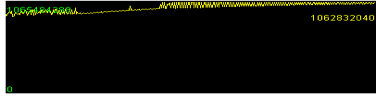

这是我在一个项目中遇到的问题，图片不够清晰，我们只要关注黄线的趋势就好。

之所以把它拿出来说事，是因为这个问题太极端了。上图是近20天的JVM使用率，从曲线的趋势上就可以看出来，它存在明显的内存泄露，但是又泄露得非常非常慢。这个系统要求24x365运行。

做过运维的人会知道，如此长时间的运行，运维时间长了之后，只会对这样的系统做常规的健康检查，因为前期天天关注它，又不出问题，眼睛都看瞎了，也不值得，于是后期就放松了警惕，慢慢懈怠。

而这个系统在生产上出现事故是在正常运行快到一年的时候，这个系统的业务量不大，十几个TPS的业务量级。这是一个外贸的系统，业务量虽然不大，但每个业务涉及的金额很大。其实出故障时间倒也不长，才几个小时，但是也干掉了几个总监级职位及相关人员。

如何对内存进行分析，仍然是性能测试分析的从业人员应该知道的知识点。

我们从技术的角度来说一下内存问题的排查思路。

这下我换个实例程序。我们照样用jvisualvm，记住哦，这时候Arthas之类的工具就没得玩了，因为Arthas只会操作栈，有很多在Java方面做性能分析的工具都是只分析栈的。在Java中动态操作对象，其实资源消耗非常高。打个比方，你可以想像一下，在一个课间休息的校园，像寻找一个特定的孩子有多难。

其实操作一个对象还有迹可循，但是内存中那么多对象，要想全都控制，那几乎是不理智的。所以，我们首先要看内存整体的健康状态。

### 内存趋势判断

**场景一：典型的正常内存的场景**

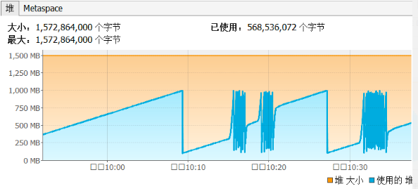

看了这个图后，要有如下几个反应：

1. 内存使用很正常，回收健康。
2. 内存从目前的压力级别上来看，够用，无需再增加。
3. 无内存泄露的情况，因为回收之后基本回到了同一水位上。
4. 基本也能看得出来GC够快。为什么说基本呢？因为最好还是看一下这张图。

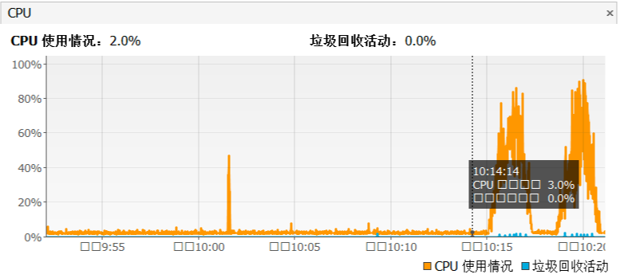

从这张图可以看到，当应用在压力场景之后，GC并没有消耗过多的CPU。

**场景二：典型的内存分配过多的场景**

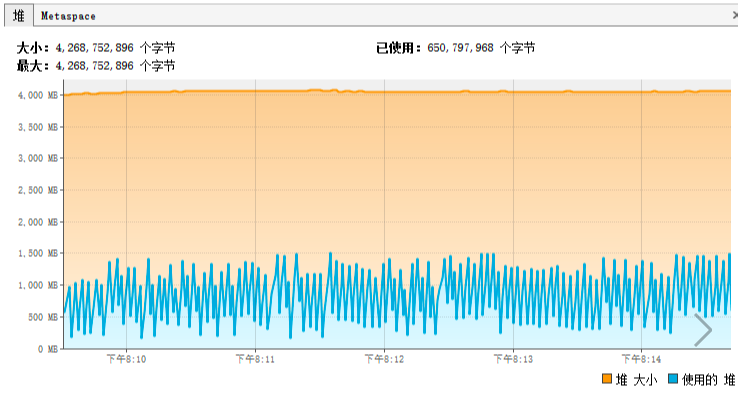

从这张图我们可以看出来：

1. 内存使用很正常，回收健康。
2. 从目前的压力级别上来看，内存不仅够用，而且过多。
3. 无内存泄露的情况。

**场景三：典型的内存不够用的场景**

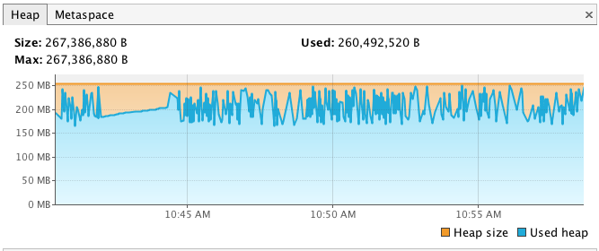

从这张图我们可以看出来：

1. 内存使用很正常，回收健康。
2. 从目前的压力级别上来看， **内存不够用，需再增加。**
3. CPU可看可不看，因为现在看似乎没多大意义，先加了内存再说。
4. 无内存泄露的情况，因为回收之后基本回到了同一水位上。

**场景四：典型的内存泄露到爆的场景**

为了显示我能力的多样性，我换个工具的监控结果。

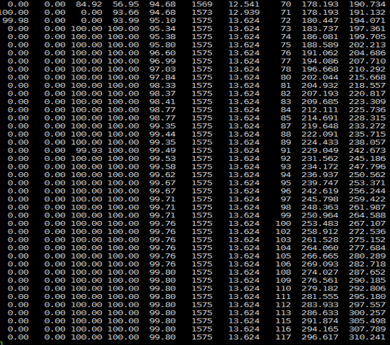

看到上面这张图，你可能觉得人生面对着挑战：“啥玩意？”

实际上，这张图说明以下四点：

1. 年轻代（第三列）、年老代（第四列）全满了，持久代在不断增加，并且也没有释放过。
2. 两个保留区（第一列、第二列）都是空的。
3. Yonug GC（第六列）已经不做了。
4. Full GC（第八列）一直都在尝试做回收的动作，但是一直也没成功，因为年轻代、年老代都没回收下来，持久代也在不停涨。

如果出现了1和2的话，不用看什么具体对象内存的消耗，只要像网上那些只玩JVM参数的人一样，调调参数就行了。

但是如果出现3和4，对于3还要再判断一下，之前的内存是不是设置得太小了？如果是，就调大，看能不能到场景一的状态。如果不是，那就得像场景四一样，查一下内存到底消耗在哪个对象上了。

### 查找增加的内存

**逻辑一**

下面我们来说说如何判断性能测试过程中内存的变化。

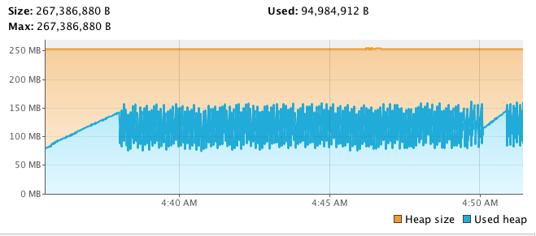

我们在内存中经常看到的对象是这样的。

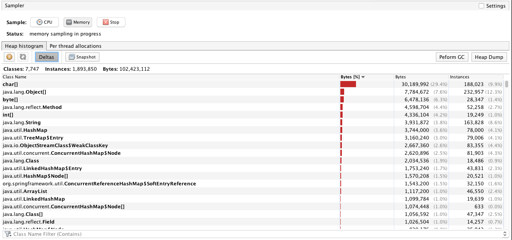

如果你用jmap的话，会看到如下信息。

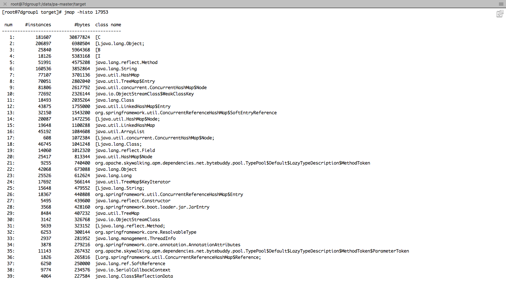

你可能会问，这么多的内容，我到底要看什么呢？这也是性能测试人员经常遇到的问题，明明数据都在眼前，就是不知道从哪下嘴。

我建议你不要看这些底层的对象类型，因为实在是有点多哇。在这里我们最好是看自己代码调用的对象的内存占用大小增量。

1. 先过滤下我们自己的包。
2. 点击一下Deltas，就能看到下面的截图。

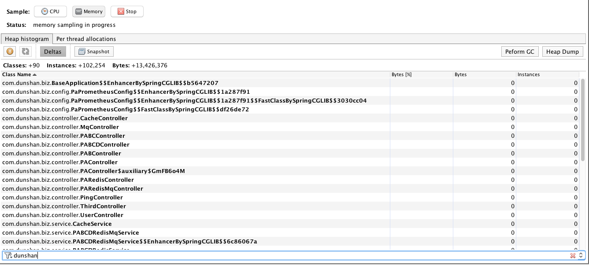

在刚开始点击Deltas之后，会看到全是零的对象。

下面我们来做下压力，观察一下。

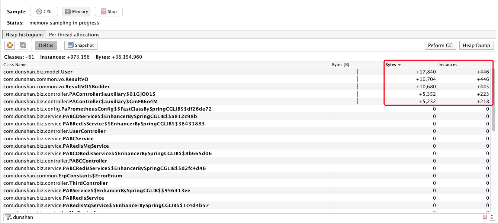

你看现在对象的实体都在往上增加对吧？但是当压力停止之后，该回收的都回收了，而有些必须长久使用的对象，在架构设计上也应该清晰地判断增量，不然就有可能导致内存不够。出现这种情况一般是架构师的失职。像这类东西应该写到公司的代码规范里。

当内存正常回收之后，再观察Deltas，应该会看到大部分对象都回收了的状态。如下所示：

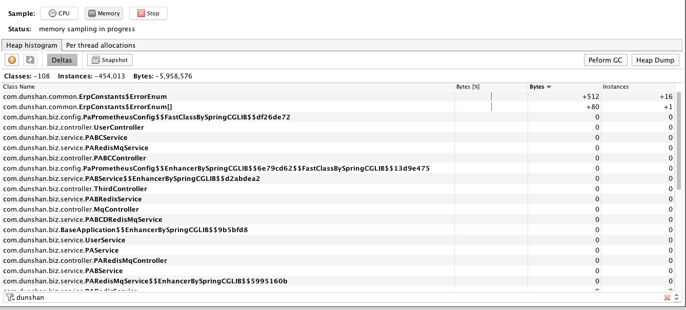

临时的对象也都清理了。 这就是正常的结果。

如果停止压力之后，又做了正常的FullGC回收了之后，还是像下面这样。

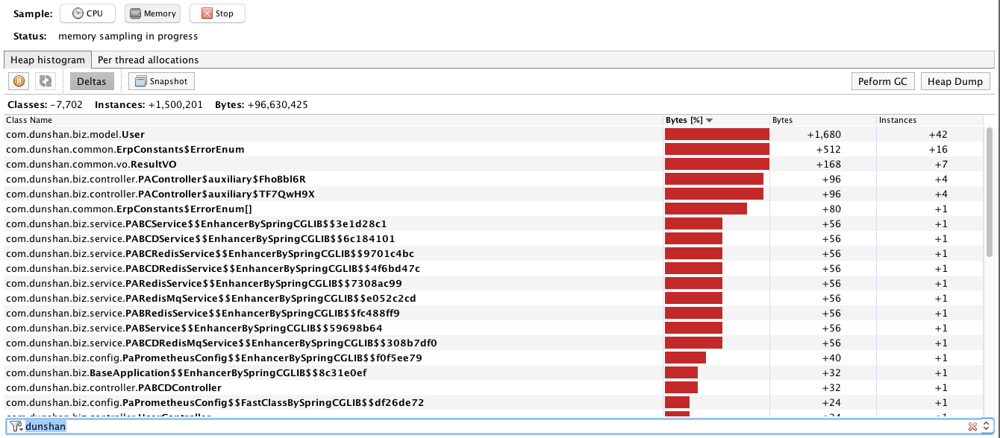

那就显然有问题了。回收不了的对象就是典型的内存泄露了。

**逻辑二**

我们看下面这个图。这是jmap做出来的heapdump，然后用MAT打开的。

1.第一个可疑的内存泄露点占了466.4MB的内存。

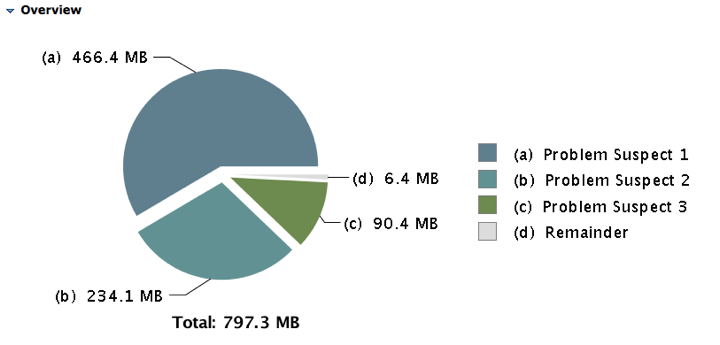

2.找到内存消耗点的多的内容。如下所示。

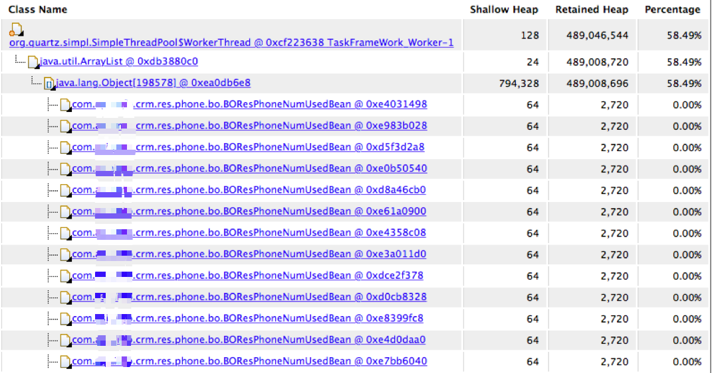

这是一个实体bean。每个倒是不大，但是架不住有79万个。

3.看它对应的栈。

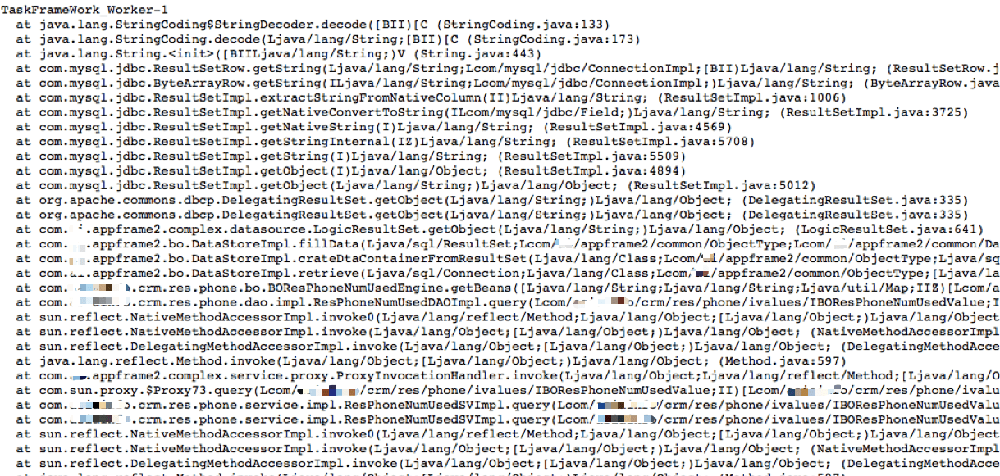

就是一个数据库操作。

4.取出SQL，查看执行计划如下。

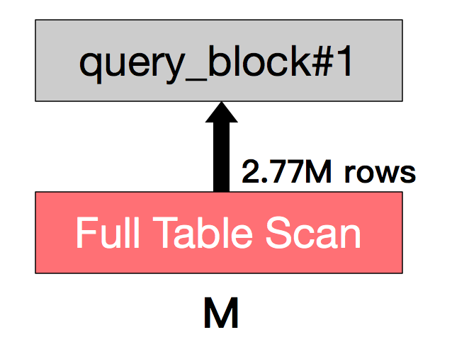

这是曲线的SQL查询数据过多，导致内存不够用。这个不叫泄露，这是溢出。因为要是一个人查询，就可能没事嘛，但是多个人一起查了，才会出问题。从业务的代码实现的角度上说，这绝对是个有问题的设计逻辑。如果真是必须全表扫描的，你得规定这个功能怎么用呀。如果不用全表扫描，干嘛不做过滤呢？

其实在Java中查找内存消耗的手段还有很多。你喜欢怎么玩就怎么玩，只要找得到就好。我只是给两种我觉得常用又易用的方式。

## C/C++类应用查找方法执行时间

对C/C++的应用来说，我们可以用google-perftools查找方法执行时间。当然，在这之时，你需要先安装配置好google-perftools和libunwind。

google-perftools是针对C/C++程序的性能分析工具。使用它，可以对CPU时间片、内存等系统资源的分配和使用进行分析。

使用步骤如下：

1. 编译目标程序，加入对 google-perftools 库的依赖。
2. 运行目标程序，在代码中加入启动/终止剖析的开关。
3. 将生成的结果通过剖析工具生成相应的调用图。

你可以在代码中加入固定输出剖析数据的开关，当运行到某段代码时就会执行。当然你也可以在代码中只加入接收信号的功能，然后在运行的过程中，通过kill命令给正在运行的程序发送指令，从而控制开关。

我来举个例子。如果我们有一个函数f，我想知道它的执行效率。硬编码的方式就是在调用这个函数的前后加上剖析开关。

```
ProfilerStart("test.prof");//开启性能分析
f();
ProfilerStop();//停止性能分析

```

在程序编译之后，会在同目录生成一个叫a.out的可执行文件。

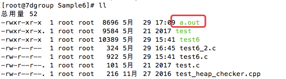

执行这个文件，就会生成test.prof文件。

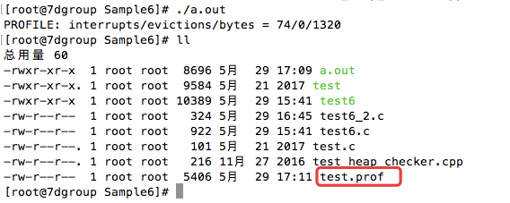

然后执行命令：

```
pprof --pdf a.out test.prof >test.pdf

```

打开这个PDF就可以看到如下图：

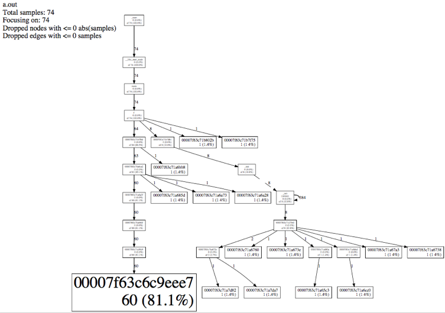

你看到上面有很多只有地址而没有函数名的调用吗？那是没有符号表。这里我们不分析那些不是我们自己的函数，我们只看自己的函数f。

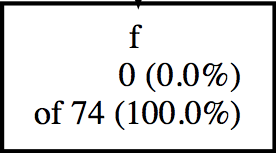

看这一段，它有三行。

- 第一行：函数名；
- 第二行：不包含内部函数调用的样本数 (百分比) ；
- 第三行：of 包含内部函数调用的样本数 (百分比)。

是不是和Java中self time/total time有异曲同工之妙？它也可以实现从CPU使用率高到具体函数的定位。

你也许会说，这个有点复杂，还要在代码里加这么多，编译还要加上动态库啥的。当然了，你还可以用perf工具来跟踪CPU clock，在代码编译时加上调试参数，就可以直接用perf top -g看调用过程由每个函数所消耗的CPU时钟。你还可以用systemtap来自己写代码进行动态跟踪。

## C/C++类应用查找对象内存消耗

其实googler perftools也可以分析内存，但是我觉得它没有Valgrind好使。所以在这一部分，我用valgrind来告诉你如何查找到C/C++的内存消耗。

valgrind能实现这些功能：

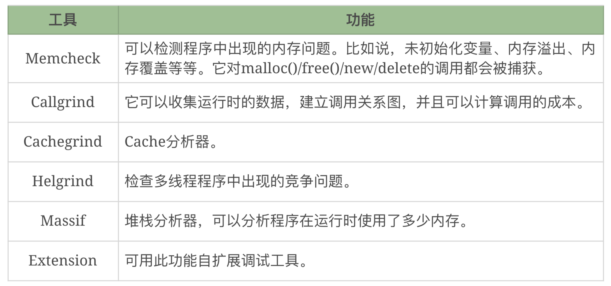

这里举一个内存泄露的小例子。这是一段再无聊不过的代码：

```
 #include <stdlib.h>

  void f(void)
  {
     int* x = malloc(10 * sizeof(int));
     x[10] = 0;        // problem 1: heap block overrun
  }                    // problem 2: memory leak -- x not freed

  int main(void)
  {
     f();
     return 0;

```

我们不断分配，而不释放。

编译运行之后，我们可以看到如下结果。

```
[root@7dgroup Sample10]# gcc -Wall -o test5 test5.c
[root@7dgroup Sample10]# valgrind --tool=memcheck --leak-check=full ./test5
==318== Memcheck, a memory error detector
==318== Copyright (C) 2002-2013, and GNU GPL'd, by Julian Seward et al.
==318== Using Valgrind-3.10.0 and LibVEX; rerun with -h for copyright info
==318== Command: ./test5
==318==
==318== Invalid write of size 4
==318==    at 0x40054E: f (in /root/GDB/Sample10/test5)
==318==    by 0x40055E: main (in /root/GDB/Sample10/test5)
==318==  Address 0x51f7068 is 0 bytes after a block of size 40 alloc'd
==318==    at 0x4C29BFD: malloc (in /usr/lib64/valgrind/vgpreload_memcheck-amd64-linux.so)
==318==    by 0x400541: f (in /root/GDB/Sample10/test5)
==318==    by 0x40055E: main (in /root/GDB/Sample10/test5)
==318==
==318==
==318== HEAP SUMMARY:
==318==     in use at exit: 40 bytes in 1 blocks
==318==   total heap usage: 1 allocs, 0 frees, 40 bytes allocated
==318==
==318== 40 bytes in 1 blocks are definitely lost in loss record 1 of 1
==318==    at 0x4C29BFD: malloc (in /usr/lib64/valgrind/vgpreload_memcheck-amd64-linux.so)
==318==    by 0x400541: f (in /root/GDB/Sample10/test5)
==318==    by 0x40055E: main (in /root/GDB/Sample10/test5)
==318==
==318== LEAK SUMMARY:
==318==    definitely lost: 40 bytes in 1 blocks
==318==    indirectly lost: 0 bytes in 0 blocks
==318==      possibly lost: 0 bytes in 0 blocks
==318==    still reachable: 0 bytes in 0 blocks
==318==         suppressed: 0 bytes in 0 blocks
==318==
==318== For counts of detected and suppressed errors, rerun with: -v
==318== ERROR SUMMARY: 2 errors from 2 contexts (suppressed: 1 from 1)
[root@7dgroup Sample10]#

```

主要看一下这行。

```
==318==   total heap usage: 1 allocs, 0 frees, 40 bytes allocated

```

这里分配了40个字节的一块内存，但是0释放，所以就泄露了。

请你注意，在调试自己的程序时，要像Java一样，分析内存的泄露，在压力前和压力后做内存的比对。在压力中则不用做。

## 总结

不管是什么语言的应用，在性能分析的过程中，都是分析两个方法。

1. 执行速度够不够快。只有够快才能满足更高的TPS。
2. 执行过程中内存用得多不多。内存用得少，才可以同时支持更多的请求。

我觉得对性能测试过程中的分析来说，这两点足够你解决代码上的问题了。有人说，为什么不说I/O的事情呢。其实I/O仍然是读写量的多少，也会反应用内存中。至于磁盘本身性能跟不上，那是另一个话题。

## 思考题

最后给你留两个思考题吧。对代码的性能分析过程中，主要是哪两点呢？针对代码分析的这两点，有什么样的分析链路？

欢迎你在评论区写下自己的思考，也欢迎把这篇文章分享给你的朋友或者同事，一起交流一下。