# 21丨Tomcat：中间件监控及常用计数器解析
在当今Spring Cloud微服务架构盛行的时代，Tomcat仍然作为应用最广的应用服务器而存在着，所以我们不得不说一说对它的性能分析。

很多时候，我们做性能测试分析时，都会把Tomcat这类的应用弄混淆。对它的监控和分析，总是会和JDK、框架代码、业务代码混合来看，这就导致了分析上的混乱。我们应该把这些分析内容分隔开来，哪些是tomcat，哪些是JDK等。

在我看来，Tomcat、WebLogic、WebSphere、JBoss等，它们都具有同样的分析思路。因为Tomcat的市场范围更大，所以，今天，我们以它为例来说明这类应用应该如何分析。

首先我们得知道它的架构是什么样的。

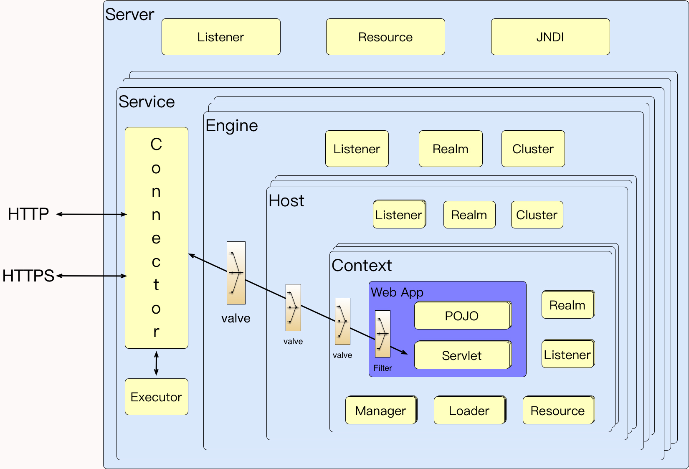

这是一个在网上随处可见的架构图，它能告诉我们Tomcat内部如何运作。如果你有兴趣，还可以看一下官方对它的架构描述。

然而，我们做性能分析的人真的要完全掌握这些细节吗？当然不是。从经验上来说，基本上有几大方面，是Tomcat优化时需要关注的。

如下图所示：

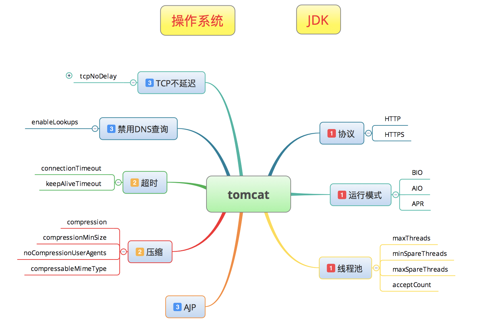

最上面，我放了两个框，分别是操作系统和JDK。因为要调优Tomcat，和这两者非常相关，但是操作系统和JDK又各自有独立的分析逻辑，而在本篇中，我专门讲Tomcat类型的组件，所以上面两块的内容我将尽量不涉及，以免混乱。

在Tomcat的性能分析中，我将我认为重要的几个技术点列在了思维导图中，同时也对它们做了重要程度的标识。在我分析经验中，这些内容已经包括了大部分的优化场景。

## 运行模式之争

有很多人对运行模式非常敏感，大家也看到经常有文章说：“对于性能来说，显然是BIO<NIO<APR的。”然而也有人做过测试说，其实不见得BIO性能就最差，这取决于应用场景；也有人说在压力低的情况下，显然BIO的性能更高。

从我的经验上来说，真的没必要纠结这一点。本着对Tomcat官方的信任，我觉得最好就是用官方给的默认运行模式，它肯定是经过了更严格的测试才被选择的。这就跟相信世上好人多是一样的道理。

现在新的Tomcat版本中默认的是NIO了，你可以在启动日志中看到相应的信息，如下所示：

```
21-Jan-2020 16:50:57.989 INFO [main] org.apache.coyote.AbstractProtocol.init Initializing ProtocolHandler ["https-jsse-nio-443"]

```

简单地说BIO和NIO的区别如下面两张图所示。

BIO图示：


NIO图示：


要理解这个区别，首先得知道几个知识点：

1. Acceptor是TCP层面的东西，它负责完成TCP握手的过程，放入全连接队列，然后将数据生成request，调用servlet容器处理。
2. 而Worker干的就是接到request数据，处理后给出response。
3. Poller是一个队列，属于典型的生产者-消费者模式。

知道了这些，你就会明白其实对于Acceptor和Worker本身来说，仍然是阻塞的。而这个Poller只能是在大并发的时候，可以hold住更多的请求而已，看起来Tomcat处理请求的容量增加了，但是我们还是要在具体的应用中去测试，来比对响应时间的差异。

但是还有一点区别我们得知道，Tomcat的keepAliveTimeout参数默认使用的是connectionTimeout的值。这样一来，由于使用BIO时，Acceptor读取socket中的数据并传递给Worker这个过程是阻塞的，意味着当代码执行到Worker中时，这个socket仍然被占着；而使用NIO时，Acceptor读取socket数据后交给了Poller了，Worker从Poller中得到请求内容并处理，这个过程就分开了，这样Worker在处理时就不会阻塞socket，所以Tomcat可以处理更多的socket，这才是NIO性能提升的关键点。

而APR是个啥呢？它是利用了OS中的能力来进行高并发地文件读取或者网络传输，来提高对静态文件的处理。有很多网上的实验结果都可以证明，在具体的应用中它并没有比NIO的性能高到哪里去，并且配置起来还麻烦，所以这个模式现在并没有很广泛的使用。

所以在Tomcat中，运行模式之争应该说已经不存在了。

## 请求量、请求时间、响应时间

这是我希望你能在分析Tomcat时关注的内容。我们有很多种方式可以看这些信息，最简单的就是访问日志了。通过在conf/server.xml中做如下配置：

```
<Valve className="org.apache.catalina.valves.AccessLogValve" directory="logs"
             prefix="localhost_access_log" suffix=".txt"
             pattern="%h %l %u %t &quot;%r&quot; %s %b %D %F" />

```

其中%D就是请求时间，%F是响应时间。配置了之后，在日志中就会看到如下内容：

```
172.17.211.144 - - [21/Jan/2020:18:06:57 +0800] "POST /back/save HTTP/1.1" 200 14 29 29
172.17.211.144 - - [21/Jan/2020:18:06:57 +0800] "GET /validate/code/pic HTTP/1.1" 200 541 5 0

```

最后两列就是请求时间和响应时间。通过这两个时间的比对，你就可以知道，Tomcat本身消耗了多少时间以及Tomcat之后的操作又消耗了多少时间。

当然，如果你喜欢的话，也可以看这样的监控图表。

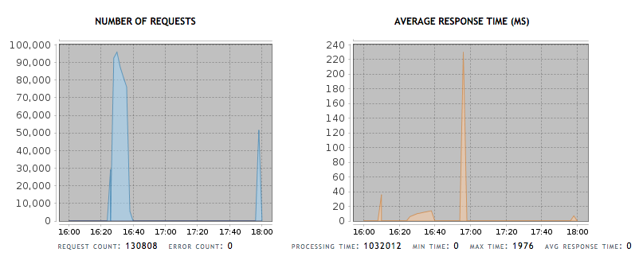

这是一个小工具Probe的监控数据，从这里，你可以知道Tomcat这段时间处理了多少请求，以及处理这些请求的时间、最大时间、最小时间和平均时间。

但是！我不建议用这个工具来监控Tomcat，因为它性能差。你可能会问，那你还说它干吗？因为其他的性能监控工具中，很少有见到这个角度的图表展示，在这里只是为了告诉你，分析Tomcat全局性能状态时，可以通过总请求数，以及平均响应时间来看Tomcat的全局处理能力如何。

当然这些数据你同样可以通过分析访问日志获取。

显然有了这些数据，我们就可以做一个大体的判断了。在服务节点多的时候，只要看这里的平均响应时间，你就能知道在这个Tomcat上有没有消耗掉你在压力工具中看到的响应时间。

下面我通过测试结果来说明几个Tomcat中常用的优化动作。

在展示优化动作之前，先看一下connector基本配置：

```
<Connector
    SSLEnabled="true"
    acceptCount="100"
    clientAuth="false"
    disableUploadTimeout="true"
    enableLookups="false"
    maxThreads="25"
    port="443"
    connectionTimeout="20000"
    keystoreFile="/PathToTomcat/bin/server.keystore"
    keystorePass="12345678"
    protocol="org.apache.coyote.http11.Http11NioProtocol"
    scheme="https"
    secure="true"
    sslProtocol="TLS" />

```

这只是一个基本配置。至于是不是最优的配置，我们需要在针对一个应用测试的过程中慢慢来看。

比如有人会说，你这里为什么不配置minSpareThreads和maxSpareThreads之类的参数？首先，我们要知道，为什么要配置这两个参数？对于一个线程数超高的应用来说，长期维护大量的线程肯定会导致操作系统中context switch的增加，在一个应用的波峰波谷差别较大的时候，我们用这两个参数其实是为了减少在波谷时产生的维护成本。但是同时你也要知道，在线程不够用的时候，开新的线程也同样需要成本，所以这两个值需不需要配置，完全取决于应用场景的具体测试结果。

总之，所有的配置都需要在具体的应用场景测试了之后，再下定论，别凭感觉。

## 协议 HTTP、HTTPS

我们知道在HTTPS的协议中，因为加入了SSL证书会导致性能下降，但是对有些应用来说，又不得不用SSL证书。在这里我自己配置了一个证书，来给你看看证书对性能产生的影响。


我的证书配置是这样的：

- 根证书：RSA证书、sha256，8192位
- 中级证书：RSA，sha256、4096位
- 终端证书：RSA，sha256、4096位

一般情况下，SSL证书都是分为三层的。在这个例子中，我生成的时候还特意用了高位数，位数越高，对性能影响越大，因为计算成本增加了。现在我们在市场上买的证书，根据价值的不同，加密方式和位数都会不一样，请稍微注意一下。

下面来看看测试结果。

Tomcat with SSL：

```text
summary +    588 in 00:00:13 =   46.0/s Avg:    10 Min:     1 Max:   804 Err:     0 (0.00%) Active: 1 Started: 1 Finished: 0
summary +   4403 in 00:00:30 =  146.8/s Avg:     4 Min:     0 Max:    87 Err:     0 (0.00%) Active: 2 Started: 2 Finished: 0
summary =   4991 in 00:00:43 =  116.7/s Avg:     5 Min:     0 Max:   804 Err:     0 (0.00%)
summary +   7107 in 00:00:30 =  237.1/s Avg:     4 Min:     0 Max:    77 Err:     0 (0.00%) Active: 3 Started: 3 Finished: 0
summary =  12098 in 00:01:13 =  166.3/s Avg:     5 Min:     0 Max:   804 Err:     0 (0.00%)
summary +  11121 in 00:00:30 =  370.7/s Avg:     4 Min:     0 Max:    72 Err:     0 (0.00%) Active: 4 Started: 4 Finished: 0
summary =  23219 in 00:01:43 =  226.0/s Avg:     4 Min:     0 Max:   804 Err:     0 (0.00%)
summary +  12709 in 00:00:30 =  423.6/s Avg:     4 Min:     0 Max:    87 Err:     0 (0.00%) Active: 5 Started: 5 Finished: 0
summary =  35928 in 00:02:13 =  270.6/s Avg:     4 Min:     0 Max:   804 Err:     0 (0.00%)
summary +  14548 in 00:00:30 =  485.0/s Avg:     4 Min:     0 Max:    69 Err:     0 (0.00%) Active: 6 Started: 6 Finished: 0
summary =  50476 in 00:02:43 =  310.1/s Avg:     4 Min:     0 Max:   804 Err:     0 (0.00%)
summary +  15810 in 00:00:30 =  527.0/s Avg:     5 Min:     0 Max:    83 Err:     0 (0.00%) Active: 7 Started: 7 Finished: 0
summary =  66286 in 00:03:13 =  343.9/s Avg:     4 Min:     0 Max:   804 Err:     0 (0.00%)
summary +  15242 in 00:00:30 =  508.0/s Avg:     5 Min:     0 Max:    77 Err:     0 (0.00%) Active: 8 Started: 8 Finished: 0
summary =  81528 in 00:03:43 =  366.0/s Avg:     4 Min:     0 Max:   804 Err:     0 (0.00%)
summary +  16709 in 00:00:30 =  557.1/s Avg:     5 Min:     0 Max:    75 Err:     0 (0.00%) Active: 9 Started: 9 Finished: 0
summary =  98237 in 00:04:13 =  388.7/s Avg:     5 Min:     0 Max:   804 Err:     0 (0.00%)
summary +  17099 in 00:00:30 =  570.0/s Avg:     6 Min:     0 Max:   161 Err:     0 (0.00%) Active: 10 Started: 10 Finished: 0
summary = 115336 in 00:04:43 =  407.9/s Avg:     5 Min:     0 Max:   804 Err:     0 (0.00%)

```

Tomcat without SSL：

```text
summary +     12 in 00:00:03 =    4.2/s Avg:   148 Min:     4 Max:   937 Err:     0 (0.00%) Active: 1 Started: 1 Finished: 0
summary +   3531 in 00:00:30 =  117.8/s Avg:     4 Min:     0 Max:    63 Err:     0 (0.00%) Active: 2 Started: 2 Finished: 0
summary =   3543 in 00:00:33 =  107.8/s Avg:     4 Min:     0 Max:   937 Err:     0 (0.00%)
summary +   7283 in 00:00:30 =  242.8/s Avg:     4 Min:     0 Max:    90 Err:     0 (0.00%) Active: 3 Started: 3 Finished: 0
summary =  10826 in 00:01:03 =  172.2/s Avg:     4 Min:     0 Max:   937 Err:     0 (0.00%)
summary +   9554 in 00:00:30 =  318.5/s Avg:     3 Min:     0 Max:    35 Err:     0 (0.00%) Active: 4 Started: 4 Finished: 0
summary =  20380 in 00:01:33 =  219.5/s Avg:     4 Min:     0 Max:   937 Err:     0 (0.00%)
summary +  14747 in 00:00:30 =  491.6/s Avg:     3 Min:     0 Max:    49 Err:     0 (0.00%) Active: 5 Started: 5 Finished: 0
summary =  35127 in 00:02:03 =  285.9/s Avg:     3 Min:     0 Max:   937 Err:     0 (0.00%)
summary +  16844 in 00:00:30 =  561.4/s Avg:     3 Min:     0 Max:    47 Err:     0 (0.00%) Active: 6 Started: 6 Finished: 0
summary =  51971 in 00:02:33 =  340.0/s Avg:     3 Min:     0 Max:   937 Err:     0 (0.00%)
summary +  17547 in 00:00:30 =  585.0/s Avg:     3 Min:     0 Max:    47 Err:     0 (0.00%) Active: 7 Started: 7 Finished: 0
summary =  69518 in 00:03:03 =  380.2/s Avg:     3 Min:     0 Max:   937 Err:     0 (0.00%)
summary +  18798 in 00:00:30 =  626.6/s Avg:     4 Min:     0 Max:   213 Err:     0 (0.00%) Active: 8 Started: 8 Finished: 0
summary =  88316 in 00:03:33 =  414.9/s Avg:     3 Min:     0 Max:   937 Err:     0 (0.00%)
summary +  18529 in 00:00:30 =  617.6/s Avg:     4 Min:     0 Max:   204 Err:     0 (0.00%) Active: 9 Started: 9 Finished: 0
summary = 106845 in 00:04:03 =  439.9/s Avg:     3 Min:     0 Max:   937 Err:     0 (0.00%)
summary +  18837 in 00:00:30 =  627.9/s Avg:     4 Min:     0 Max:    53 Err:     0 (0.00%) Active: 10 Started: 10 Finished: 0
summary = 125682 in 00:04:33 =  460.6/s Avg:     4 Min:     0 Max:   937 Err:     0 (0.00%)

```

这里稍微啰嗦一下，我们以这种终端直接输出的数据看JMeter的结果时，主要关注下"summary +"的数据，因为"summary ="的数据是整个场景执行的平均数据。另外，第一行的数据会不准确，可以忽略，如果你把粒度调低一些，可以看到更细的数据。

通过上面的数据可以看到，没有SSL比有SSL证书是要高出一些TPS的。如下图所示：

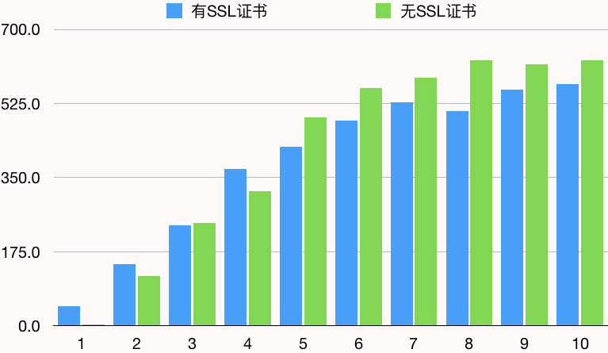

显然SSL证书对性能有明显的影响了，最大的影响到18.93%，是在8个线程时，而在五六个线程时，TPS损耗有13%左右。

这和加密位数、应用场景等都有关系，所以这一段可以给你的结论就是：SSL证书对性能会有损耗。但具体损耗是多少，在你的应用场景中需要具体测试。

### 线程池

Tomcat的线程池，一直是调优Tomcat的重点对象。在我的工作经验中，我发现经常有人不太清楚对Tomcat应该配置多大的线程池。

之前，我见过有一个人在一个4C8G的机器上把一个Tomcat节点的线程池配置到了4000。我问他为什么要这么配置，他说想支持4000的并发用户。

我们先不说他有没有理解在线用户、并发用户和TPS之间的逻辑关系，只说把Tomcat配置为4000这个事情。就算Tomcat能支撑得住4000，但机器能撑得住吗？结果还没跑多少压力线程，操作系统的CS就不断走高，消耗了大量的sy CPU，只有少量的us CPU能处理正常的业务。

然后我告诉他把Tomcat线程数调到默认的200先看看，结果TPS上升了好几倍。

这就是对线程在系统中运行的逻辑不理解导致的情况。

我们在测试的时候，先得学会判断：线程数到底够不够用。要是不够用，但又有足够的硬件资源，那你可以增加线程。

但是在增加线程之前，先要判断，代码是不是运行得足够快，如果代码本身就慢，那就先优化代码，再调整线程。

这里就有一个小的分析链路了。如下所示：

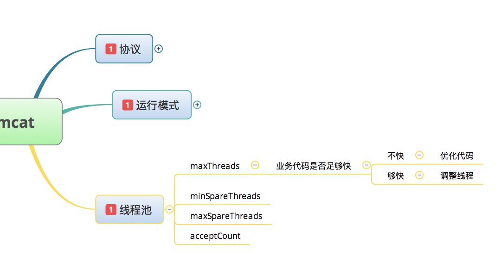

怎么来判断代码运行得足够快呢？

下面我们来看几个例子，然后我会说一下如何判断代码快不快（当然这个具体的应用也有关，你还需要在具体的应用中做详细地分析哦）。

### 场景一：当压力线程远远小于服务端线程数时


测试结果：

```text
summary +    930 in 00:00:16 =   59.7/s Avg:     7 Min:     0 Max:   922 Err:     0 (0.00%) Active: 1 Started: 1 Finished: 0
summary +   4546 in 00:00:30 =  151.6/s Avg:     3 Min:     0 Max:    46 Err:     0 (0.00%) Active: 1 Started: 1 Finished: 0
summary =   5476 in 00:00:46 =  120.2/s Avg:     3 Min:     0 Max:   922 Err:     0 (0.00%)
summary +   5822 in 00:00:30 =  194.0/s Avg:     2 Min:     0 Max:    32 Err:     0 (0.00%) Active: 1 Started: 1 Finished: 0
summary =  11298 in 00:01:16 =  149.5/s Avg:     3 Min:     0 Max:   922 Err:     0 (0.00%)
summary +   5295 in 00:00:24 =  216.5/s Avg:     2 Min:     0 Max:    26 Err:     0 (0.00%) Active: 0 Started: 1 Finished: 1
summary =  16593 in 00:01:40 =  165.9/s Avg:     2 Min:     0 Max:   922 Err:     0 (0.00%)

```

线程监控结果：

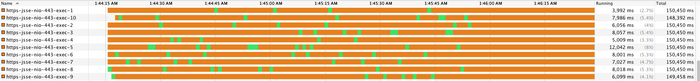

jvisualvm的thread监控图是每秒刷新一次，其中橙色代表TIMED\_WAITING状态，没活干；绿色代表RUNNABLE状态，在干活。

通过这个测试结果，你可以看到，在只有一个压力线程的情况下，这10个Worker是轮流提供响应的。

这就是 **典型的线程足够用的状态**。

### 场景二：当压力线程数通过递增，慢慢超过服务端线程数时


测试结果：

```text
summary +   4529 in 00:00:22 =  203.6/s Avg:     2 Min:     0 Max:   464 Err:     0 (0.00%) Active: 2 Started: 2 Finished: 0
summary +  11023 in 00:00:30 =  367.7/s Avg:     2 Min:     0 Max:    71 Err:     0 (0.00%) Active: 3 Started: 3 Finished: 0
summary =  15552 in 00:00:52 =  297.8/s Avg:     2 Min:     0 Max:   464 Err:     0 (0.00%)
summary +  15131 in 00:00:30 =  504.4/s Avg:     2 Min:     0 Max:   166 Err:     0 (0.00%) Active: 5 Started: 5 Finished: 0
summary =  30683 in 00:01:22 =  373.2/s Avg:     2 Min:     0 Max:   464 Err:     0 (0.00%)
summary +  17420 in 00:00:30 =  580.7/s Avg:     3 Min:     0 Max:    68 Err:     0 (0.00%) Active: 6 Started: 6 Finished: 0
summary =  48103 in 00:01:52 =  428.6/s Avg:     3 Min:     0 Max:   464 Err:     0 (0.00%)
summary +  17416 in 00:00:30 =  580.5/s Avg:     3 Min:     0 Max:    72 Err:     0 (0.00%) Active: 8 Started: 8 Finished: 0
summary =  65519 in 00:02:22 =  460.7/s Avg:     3 Min:     0 Max:   464 Err:     0 (0.00%)
summary +  17389 in 00:00:30 =  579.6/s Avg:     4 Min:     0 Max:    71 Err:     0 (0.00%) Active: 9 Started: 9 Finished: 0
summary =  82908 in 00:02:52 =  481.4/s Avg:     3 Min:     0 Max:   464 Err:     0 (0.00%)
summary +  18591 in 00:00:30 =  619.8/s Avg:     4 Min:     0 Max:    82 Err:     0 (0.00%) Active: 11 Started: 11 Finished: 0
summary = 101499 in 00:03:22 =  501.9/s Avg:     3 Min:     0 Max:   464 Err:     0 (0.00%)
summary +  18692 in 00:00:30 =  623.1/s Avg:     5 Min:     0 Max:    72 Err:     0 (0.00%) Active: 12 Started: 12 Finished: 0
summary = 120191 in 00:03:52 =  517.6/s Avg:     4 Min:     0 Max:   464 Err:     0 (0.00%)
summary +  18577 in 00:00:30 =  619.2/s Avg:     6 Min:     0 Max:    83 Err:     0 (0.00%) Active: 14 Started: 14 Finished: 0
summary = 138768 in 00:04:22 =  529.2/s Avg:     4 Min:     0 Max:   464 Err:     0 (0.00%)
summary +  19371 in 00:00:30 =  645.7/s Avg:     6 Min:     0 Max:   113 Err:     0 (0.00%) Active: 15 Started: 15 Finished: 0
summary = 158139 in 00:04:52 =  541.2/s Avg:     4 Min:     0 Max:   464 Err:     0 (0.00%)
summary +  18891 in 00:00:30 =  629.7/s Avg:     7 Min:     0 Max:   146 Err:     0 (0.00%) Active: 17 Started: 17 Finished: 0
summary = 177030 in 00:05:22 =  549.4/s Avg:     4 Min:     0 Max:   464 Err:     0 (0.00%)
summary +  19075 in 00:00:30 =  635.6/s Avg:     7 Min:     0 Max:    99 Err:     0 (0.00%) Active: 18 Started: 18 Finished: 0
summary = 196105 in 00:05:52 =  556.7/s Avg:     5 Min:     0 Max:   464 Err:     0 (0.00%)
summary +  18782 in 00:00:30 =  625.4/s Avg:     8 Min:     0 Max:   122 Err:     0 (0.00%) Active: 20 Started: 20 Finished: 0
summary = 214887 in 00:06:22 =  562.1/s Avg:     5 Min:     0 Max:   464 Err:     0 (0.00%)
summary +  18911 in 00:00:30 =  631.3/s Avg:     8 Min:     0 Max:   146 Err:     0 (0.00%) Active: 21 Started: 21 Finished: 0
summary = 233798 in 00:06:52 =  567.2/s Avg:     5 Min:     0 Max:   464 Err:     0 (0.00%)
summary +  18153 in 00:00:30 =  605.1/s Avg:     9 Min:     0 Max:   147 Err:     0 (0.00%) Active: 23 Started: 23 Finished: 0
summary = 251951 in 00:07:22 =  569.7/s Avg:     5 Min:     0 Max:   464 Err:     0 (0.00%)
summary +  14704 in 00:00:30 =  490.1/s Avg:    10 Min:     0 Max:   175 Err:     0 (0.00%) Active: 24 Started: 24 Finished: 0
summary = 266655 in 00:07:52 =  564.7/s Avg:     6 Min:     0 Max:   464 Err:     0 (0.00%)
summary +  18196 in 00:00:30 =  606.6/s Avg:    10 Min:     0 Max:   147 Err:     0 (0.00%) Active: 26 Started: 26 Finished: 0
summary = 284851 in 00:08:22 =  567.2/s Avg:     6 Min:     0 Max:   464 Err:     0 (0.00%)
summary +  17768 in 00:00:30 =  592.3/s Avg:    10 Min:     0 Max:   227 Err:     0 (0.00%) Active: 27 Started: 27 Finished: 0
summary = 302619 in 00:08:52 =  568.6/s Avg:     6 Min:     0 Max:   464 Err:     0 (0.00%)
summary +  16754 in 00:00:30 =  558.2/s Avg:    12 Min:     0 Max:   218 Err:     0 (0.00%) Active: 29 Started: 29 Finished: 0
summary = 319373 in 00:09:22 =  568.0/s Avg:     7 Min:     0 Max:   464 Err:     0 (0.00%)
summary +  17216 in 00:00:30 =  574.0/s Avg:    12 Min:     0 Max:   249 Err:     0 (0.00%) Active: 30 Started: 30 Finished: 0
summary = 336589 in 00:09:52 =  568.3/s Avg:     7 Min:     0 Max:   464 Err:     0 (0.00%)

```

线程监控结果：

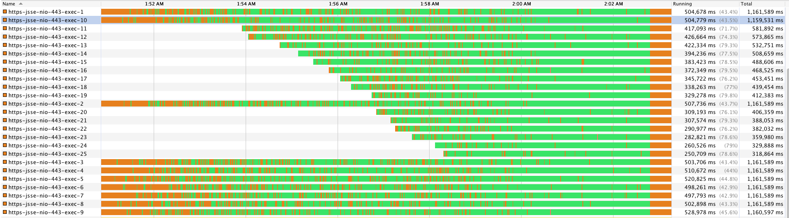

在这个场景中，我特意把压力工具中的线程数设置得高于Tomcat线程数，并且通过递增的方式加压。

一开始线程数是足够用的，还有挺多的时间处于空闲状态。但随着压力的增加，Tomcat的线程越来越忙，直到不够用，于是Tomcat就自己调整了线程数，直到maxThreads的值。然后线程的空闲状态就越来越少，到最后几乎没有空闲状态了。

你也可以看到响应时间随着线程数的不够用而不断的增加。

这就是 **典型的线程配置不够的状态**。

### 场景三：当压力线程数远高于服务端线程数时


测试结果：

```text
summary +      1 in 00:00:02 =    0.5/s Avg:  1724 Min:  1724 Max:  1724 Err:     0 (0.00%) Active: 50 Started: 50 Finished: 0
summary +   5821 in 00:00:28 =  204.3/s Avg:   128 Min:     1 Max:  1798 Err:     0 (0.00%) Active: 50 Started: 50 Finished: 0
summary =   5822 in 00:00:31 =  190.8/s Avg:   129 Min:     1 Max:  1798 Err:     0 (0.00%)
summary +  10881 in 00:00:30 =  362.7/s Avg:    57 Min:     1 Max:   405 Err:     0 (0.00%) Active: 50 Started: 50 Finished: 0
summary =  16703 in 00:01:01 =  276.0/s Avg:    82 Min:     1 Max:  1798 Err:     0 (0.00%)
summary +  11548 in 00:00:30 =  384.9/s Avg:    52 Min:     1 Max:   308 Err:     0 (0.00%) Active: 50 Started: 50 Finished: 0
summary =  28251 in 00:01:31 =  312.1/s Avg:    70 Min:     1 Max:  1798 Err:     0 (0.00%)
summary +   3747 in 00:00:10 =  387.8/s Avg:    51 Min:     1 Max:   328 Err:     0 (0.00%) Active: 0 Started: 50 Finished: 50
summary =  31998 in 00:01:40 =  319.4/s Avg:    67 Min:     1 Max:  1798 Err:     0 (0.00%)

```

线程监控结果：


在这个压力场景中，我直接把压力线程加上来，并且高于Tomcat的处理线程，Tomcat一下就上到了maxThreads的上限，然后就几乎没再闲过。同时你也可以看到响应时间远远大于场景二中的响应时间。

这就是 **典型的压力过高的状态**。

对比前面三个场景，我们再比对之前专栏中的文章内容，就可以理解几个关键的知识点了。

首先，压力工具中的线程数到底应不应该在没有报错的情况下无休止地增加？

显然即使你增加，对服务端能处理的请求来说，并没有什么意义，只会导致响应时间的变长。

其次，把压力线程理解为并发用户数到底对不对？

如果你把压力线程理解为并发用户，通过这几个示例就可以看到，服务端能处理的压力线程必然不会超过自身的线程上限，也就是说，把压力线程理解为并发用户，并发用户的上限是固定的。你都不用测试，直接看服务端的线程数配置为多大就够了。这也是为什么我一再强调并发用户数不能用压力线程来描述，不能用压力线程来承载服务端性能指标的关键点。

而用TPS来描述的时候，因为有了“秒”的概念，就有了时间段，而在这个时间段内得到的响应都认为是被支持了的，所以用TPS来描述会更为合理。

而T的定义具有业务含义时，也就对应起了技术和业务之间的关系，这个逻辑也就完整了。

从这里你也可以看到，我在整个专栏中所描述的概念在具体的落地时，都会秉承它的连贯性，要不然一个飞在空中的概念就没有意义了。

### 场景四：设置最大最小空闲线程数


测试结果：

```text
summary +      1 in 00:00:01 =    0.9/s Avg:   730 Min:   730 Max:   730 Err:     0 (0.00%) Active: 1 Started: 1 Finished: 0
summary +   2915 in 00:00:30 =   97.5/s Avg:     5 Min:     0 Max:  1126 Err:     0 (0.00%) Active: 2 Started: 2 Finished: 0
summary =   2916 in 00:00:31 =   94.1/s Avg:     5 Min:     0 Max:  1126 Err:     0 (0.00%)
summary +   6690 in 00:00:30 =  222.9/s Avg:     4 Min:     0 Max:    81 Err:     0 (0.00%) Active: 4 Started: 4 Finished: 0
summary =   9606 in 00:01:01 =  157.5/s Avg:     4 Min:     0 Max:  1126 Err:     0 (0.00%)
summary +   9968 in 00:00:30 =  332.4/s Avg:     4 Min:     0 Max:    88 Err:     0 (0.00%) Active: 5 Started: 5 Finished: 0
summary =  19574 in 00:01:31 =  215.2/s Avg:     4 Min:     0 Max:  1126 Err:     0 (0.00%)
summary +  14140 in 00:00:30 =  471.1/s Avg:     3 Min:     0 Max:    87 Err:     0 (0.00%) Active: 7 Started: 7 Finished: 0
summary =  33714 in 00:02:01 =  278.6/s Avg:     4 Min:     0 Max:  1126 Err:     0 (0.00%)
summary +  14985 in 00:00:30 =  499.8/s Avg:     4 Min:     0 Max:    84 Err:     0 (0.00%) Active: 8 Started: 8 Finished: 0
summary =  48699 in 00:02:31 =  322.6/s Avg:     4 Min:     0 Max:  1126 Err:     0 (0.00%)
summary +  16446 in 00:00:30 =  548.1/s Avg:     4 Min:     0 Max:    76 Err:     0 (0.00%) Active: 10 Started: 10 Finished: 0
summary =  65145 in 00:03:01 =  360.0/s Avg:     4 Min:     0 Max:  1126 Err:     0 (0.00%)
summary +  16171 in 00:00:30 =  539.2/s Avg:     5 Min:     0 Max:   410 Err:     0 (0.00%) Active: 11 Started: 11 Finished: 0
summary =  81316 in 00:03:31 =  385.4/s Avg:     4 Min:     0 Max:  1126 Err:     0 (0.00%)
summary +  16419 in 00:00:30 =  547.2/s Avg:     7 Min:     0 Max:   646 Err:     0 (0.00%) Active: 13 Started: 13 Finished: 0
summary =  97735 in 00:04:01 =  405.6/s Avg:     5 Min:     0 Max:  1126 Err:     0 (0.00%)
summary +  15981 in 00:00:30 =  532.7/s Avg:     9 Min:     0 Max:   832 Err:     0 (0.00%) Active: 14 Started: 14 Finished: 0
summary = 113716 in 00:04:31 =  419.7/s Avg:     5 Min:     0 Max:  1126 Err:     0 (0.00%)
summary +  16064 in 00:00:30 =  535.6/s Avg:    11 Min:     0 Max:   888 Err:     0 (0.00%) Active: 16 Started: 16 Finished: 0
summary = 129780 in 00:05:01 =  431.2/s Avg:     6 Min:     0 Max:  1126 Err:     0 (0.00%)
summary +  15446 in 00:00:30 =  514.8/s Avg:    10 Min:     0 Max:  1022 Err:     0 (0.00%) Active: 17 Started: 17 Finished: 0
summary = 145226 in 00:05:31 =  438.8/s Avg:     6 Min:     0 Max:  1126 Err:     0 (0.00%)
summary +  14643 in 00:00:30 =  488.1/s Avg:    12 Min:     0 Max:  1114 Err:     0 (0.00%) Active: 19 Started: 19 Finished: 0
summary = 159869 in 00:06:01 =  442.9/s Avg:     7 Min:     0 Max:  1126 Err:     0 (0.00%)
summary +  14805 in 00:00:30 =  493.5/s Avg:    13 Min:     0 Max:  1250 Err:     0 (0.00%) Active: 20 Started: 20 Finished: 0
summary = 174674 in 00:06:31 =  446.8/s Avg:     7 Min:     0 Max:  1250 Err:     0 (0.00%)
summary +  14446 in 00:00:30 =  481.5/s Avg:    15 Min:     0 Max:  1385 Err:     0 (0.00%) Active: 22 Started: 22 Finished: 0
summary = 189120 in 00:07:01 =  449.2/s Avg:     8 Min:     0 Max:  1385 Err:     0 (0.00%)
summary +  14310 in 00:00:30 =  477.1/s Avg:    17 Min:     0 Max:  1454 Err:     0 (0.00%) Active: 23 Started: 23 Finished: 0
summary = 203430 in 00:07:31 =  451.1/s Avg:     9 Min:     0 Max:  1454 Err:     0 (0.00%)
summary +  13856 in 00:00:30 =  461.8/s Avg:    18 Min:     0 Max:  1454 Err:     0 (0.00%) Active: 25 Started: 25 Finished: 0
summary = 217286 in 00:08:01 =  451.8/s Avg:     9 Min:     0 Max:  1454 Err:     0 (0.00%)
summary +  13643 in 00:00:30 =  454.8/s Avg:    18 Min:     0 Max:  1591 Err:     0 (0.00%) Active: 26 Started: 26 Finished: 0
summary = 230929 in 00:08:31 =  451.9/s Avg:    10 Min:     0 Max:  1591 Err:     0 (0.00%)
summary +  13605 in 00:00:30 =  453.5/s Avg:    21 Min:     0 Max:  1593 Err:     0 (0.00%) Active: 28 Started: 28 Finished: 0
summary = 244534 in 00:09:01 =  452.0/s Avg:    10 Min:     0 Max:  1593 Err:     0 (0.00%)
summary +  13316 in 00:00:30 =  443.7/s Avg:    23 Min:     0 Max:  1598 Err:     0 (0.00%) Active: 29 Started: 29 Finished: 0
summary = 257850 in 00:09:31 =  451.6/s Avg:    11 Min:     0 Max:  1598 Err:     0 (0.00%)
summary +  12538 in 00:00:30 =  418.1/s Avg:    24 Min:     0 Max:  1599 Err:     0 (0.00%) Active: 30 Started: 30 Finished: 0
summary = 270388 in 00:10:01 =  449.9/s Avg:    12 Min:     0 Max:  1599 Err:     0 (0.00%)

```

线程监控结果：

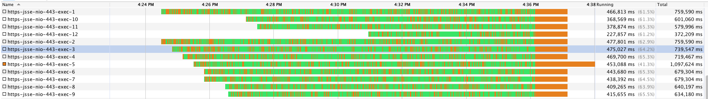

这个场景是为了描述minSpareThreads和maxSpareThreads的能力，我们可以看到场景结束了之后，线程确实被回收了。

记住，这个回收的价值在于，当再次有少量请求进来时不会导致过多的维护线程的成本，从而导致TPS的下降。如果你的应用中，本身线程数就不是非常大，即使长时间维护着固定的线程池也不会有大的成本，那么不配置这两个参数也是可以的。

### 禁用AJP

什么是AJP呢？你可以点击 [这里](https://Tomcat.apache.org/connectors-doc/ajp/ajpv13a.html) 看一下。

AJP是个二进制的TCP传输协议，相比HTTP来说有更高的性能和效率，只是支持AJP的代理服务器不多。在我们常用的应用场景中，用Nginx来连接Tomcat较多，AJP协议是用不上的，因为Nginx官方根本就没有支持AJP协议的模块。当然也有人提供过AJP的Nginx代理模块，只是实际应用的也不多。

下面我们看禁用AJP和启用AJP产生的效果。

首先看下启用AJP的测试结果。


启动AJP（在Tomcat的conf/server.xml中配置）：

```
<Connector port="8009" protocol="AJP/1.3" redirectPort="8443" />

```

启动日志：

```
21-Jan-2020 01:14:58.404 INFO [main] org.apache.coyote.AbstractProtocol.start Starting ProtocolHandler [ajp-nio-8009]

```

测试结果为下面这样：

```text
summary +      4 in 00:00:02 =    1.8/s Avg:   482 Min:   188 Max:   903 Err:     0 (0.00%) Active: 1 Started: 1 Finished: 0
summary +   2704 in 00:00:29 =   92.8/s Avg:     5 Min:     0 Max:    83 Err:     0 (0.00%) Active: 2 Started: 2 Finished: 0
summary =   2708 in 00:00:31 =   86.4/s Avg:     5 Min:     0 Max:   903 Err:     0 (0.00%)
summary +   6154 in 00:00:30 =  205.1/s Avg:     4 Min:     0 Max:    89 Err:     0 (0.00%) Active: 3 Started: 3 Finished: 0
summary =   8862 in 00:01:01 =  144.5/s Avg:     5 Min:     0 Max:   903 Err:     0 (0.00%)
summary +   8818 in 00:00:30 =  293.9/s Avg:     4 Min:     0 Max:    71 Err:     0 (0.00%) Active: 4 Started: 4 Finished: 0
summary =  17680 in 00:01:31 =  193.6/s Avg:     4 Min:     0 Max:   903 Err:     0 (0.00%)
summary +  13267 in 00:00:30 =  442.3/s Avg:     4 Min:     0 Max:    66 Err:     0 (0.00%) Active: 5 Started: 5 Finished: 0
summary =  30947 in 00:02:01 =  255.0/s Avg:     4 Min:     0 Max:   903 Err:     0 (0.00%)
summary +  13004 in 00:00:30 =  433.4/s Avg:     4 Min:     0 Max:    59 Err:     0 (0.00%) Active: 6 Started: 6 Finished: 0
summary =  43951 in 00:02:31 =  290.4/s Avg:     4 Min:     0 Max:   903 Err:     0 (0.00%)
summary +  15800 in 00:00:30 =  526.6/s Avg:     4 Min:     0 Max:    88 Err:     0 (0.00%) Active: 7 Started: 7 Finished: 0
summary =  59751 in 00:03:01 =  329.5/s Avg:     4 Min:     0 Max:   903 Err:     0 (0.00%)
summary +  16766 in 00:00:30 =  559.0/s Avg:     5 Min:     0 Max:    90 Err:     0 (0.00%) Active: 8 Started: 8 Finished: 0
summary =  76517 in 00:03:31 =  362.1/s Avg:     4 Min:     0 Max:   903 Err:     0 (0.00%)
summary +  16760 in 00:00:30 =  558.6/s Avg:     5 Min:     0 Max:    67 Err:     0 (0.00%) Active: 9 Started: 9 Finished: 0
summary =  93277 in 00:04:01 =  386.5/s Avg:     4 Min:     0 Max:   903 Err:     0 (0.00%)
summary +  16991 in 00:00:30 =  566.4/s Avg:     6 Min:     0 Max:   148 Err:     0 (0.00%) Active: 10 Started: 10 Finished: 0
summary = 110268 in 00:04:31 =  406.4/s Avg:     5 Min:     0 Max:   903 Err:     0 (0.00%)

```

然后我们再看下禁用AJP的测试结果。

禁用AJP：

```
<!-- Connector port="8009" protocol="AJP/1.3" redirectPort="8443" -->

```

无启动日志。

测试结果：

```text
summary +     90 in 00:00:05 =   16.9/s Avg:    33 Min:     2 Max:   812 Err:     0 (0.00%) Active: 1 Started: 1 Finished: 0
summary +   3443 in 00:00:30 =  115.0/s Avg:     4 Min:     0 Max:    93 Err:     0 (0.00%) Active: 2 Started: 2 Finished: 0
summary =   3533 in 00:00:35 =  100.2/s Avg:     5 Min:     0 Max:   812 Err:     0 (0.00%)
summary +   7245 in 00:00:30 =  241.5/s Avg:     4 Min:     0 Max:    75 Err:     0 (0.00%) Active: 3 Started: 3 Finished: 0
summary =  10778 in 00:01:05 =  165.2/s Avg:     4 Min:     0 Max:   812 Err:     0 (0.00%)
summary +  11029 in 00:00:30 =  367.6/s Avg:     4 Min:     0 Max:   335 Err:     0 (0.00%) Active: 4 Started: 4 Finished: 0
summary =  21807 in 00:01:35 =  228.9/s Avg:     4 Min:     0 Max:   812 Err:     0 (0.00%)
summary +  12227 in 00:00:30 =  407.5/s Avg:     4 Min:     0 Max:    67 Err:     0 (0.00%) Active: 5 Started: 5 Finished: 0
summary =  34034 in 00:02:05 =  271.7/s Avg:     4 Min:     0 Max:   812 Err:     0 (0.00%)
summary +  14735 in 00:00:30 =  491.4/s Avg:     4 Min:     0 Max:    72 Err:     0 (0.00%) Active: 6 Started: 6 Finished: 0
summary =  48769 in 00:02:35 =  314.1/s Avg:     4 Min:     0 Max:   812 Err:     0 (0.00%)
summary +  16574 in 00:00:30 =  552.5/s Avg:     4 Min:     0 Max:    65 Err:     0 (0.00%) Active: 7 Started: 7 Finished: 0
summary =  65343 in 00:03:05 =  352.7/s Avg:     4 Min:     0 Max:   812 Err:     0 (0.00%)
summary +  17488 in 00:00:30 =  582.9/s Avg:     4 Min:     0 Max:    70 Err:     0 (0.00%) Active: 8 Started: 8 Finished: 0
summary =  82831 in 00:03:35 =  384.8/s Avg:     4 Min:     0 Max:   812 Err:     0 (0.00%)
summary +  16933 in 00:00:30 =  564.5/s Avg:     5 Min:     0 Max:    87 Err:     0 (0.00%) Active: 9 Started: 9 Finished: 0
summary =  99764 in 00:04:05 =  406.8/s Avg:     4 Min:     0 Max:   812 Err:     0 (0.00%)
summary +  17363 in 00:00:30 =  578.8/s Avg:     6 Min:     0 Max:    76 Err:     0 (0.00%) Active: 10 Started: 10 Finished: 0
summary = 117127 in 00:04:35 =  425.5/s Avg:     4 Min:     0 Max:   812 Err:     0 (0.00%)

```

通过比对，如下图所示：

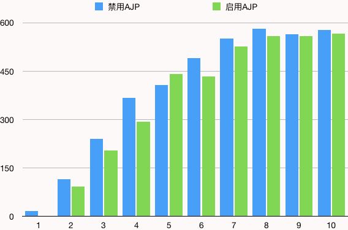

禁用AJP确实性能会高一点，在这个场景中最高的时候，同压力线程下，性能高出近20%。

### 压缩

在很多的压力测试中，我们说压缩这个功能都是基于两个目标：

1. 减少带宽的消耗；
2. 减少传输的时间；

但是这必然会导致服务端CPU消耗的增加，这是个必然的过程。所以它的配置前提就是CPU足够用，带宽不够用。如果你带宽足够用，CPU不够用时，显然这样做是不理智的。

下面我们来看一下Tomcat中压缩和不压缩产生的结果。

首先是不压缩。

```text
summary +    588 in 00:00:13 =   46.0/s Avg:    10 Min:     1 Max:   804 Err:     0 (0.00%) Active: 1 Started: 1 Finished: 0
summary +   4403 in 00:00:30 =  146.8/s Avg:     4 Min:     0 Max:    87 Err:     0 (0.00%) Active: 2 Started: 2 Finished: 0
summary =   4991 in 00:00:43 =  116.7/s Avg:     5 Min:     0 Max:   804 Err:     0 (0.00%)
summary +   7107 in 00:00:30 =  237.1/s Avg:     4 Min:     0 Max:    77 Err:     0 (0.00%) Active: 3 Started: 3 Finished: 0
summary =  12098 in 00:01:13 =  166.3/s Avg:     5 Min:     0 Max:   804 Err:     0 (0.00%)
summary +  11121 in 00:00:30 =  370.7/s Avg:     4 Min:     0 Max:    72 Err:     0 (0.00%) Active: 4 Started: 4 Finished: 0
summary =  23219 in 00:01:43 =  226.0/s Avg:     4 Min:     0 Max:   804 Err:     0 (0.00%)
summary +  12709 in 00:00:30 =  423.6/s Avg:     4 Min:     0 Max:    87 Err:     0 (0.00%) Active: 5 Started: 5 Finished: 0
summary =  35928 in 00:02:13 =  270.6/s Avg:     4 Min:     0 Max:   804 Err:     0 (0.00%)
summary +  14548 in 00:00:30 =  485.0/s Avg:     4 Min:     0 Max:    69 Err:     0 (0.00%) Active: 6 Started: 6 Finished: 0
summary =  50476 in 00:02:43 =  310.1/s Avg:     4 Min:     0 Max:   804 Err:     0 (0.00%)
summary +  15810 in 00:00:30 =  527.0/s Avg:     5 Min:     0 Max:    83 Err:     0 (0.00%) Active: 7 Started: 7 Finished: 0
summary =  66286 in 00:03:13 =  343.9/s Avg:     4 Min:     0 Max:   804 Err:     0 (0.00%)
summary +  15242 in 00:00:30 =  508.0/s Avg:     5 Min:     0 Max:    77 Err:     0 (0.00%) Active: 8 Started: 8 Finished: 0
summary =  81528 in 00:03:43 =  366.0/s Avg:     4 Min:     0 Max:   804 Err:     0 (0.00%)
summary +  16709 in 00:00:30 =  557.1/s Avg:     5 Min:     0 Max:    75 Err:     0 (0.00%) Active: 9 Started: 9 Finished: 0
summary =  98237 in 00:04:13 =  388.7/s Avg:     5 Min:     0 Max:   804 Err:     0 (0.00%)
summary +  17099 in 00:00:30 =  570.0/s Avg:     6 Min:     0 Max:   161 Err:     0 (0.00%) Active: 10 Started: 10 Finished: 0
summary = 115336 in 00:04:43 =  407.9/s Avg:     5 Min:     0 Max:   804 Err:     0 (0.00%)

```

网络流量：

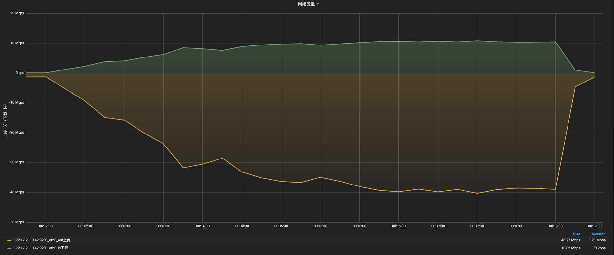

然后是压缩。

在这里，我为了让压缩生效的范围更大，把最小值设置为了10bytes。

```text
compression="on" compressionMinSize="10" noCompressionUserAgents="gozilla,traviata" compressableMimeType="text/html,text/xml,application/javascript,text/javascript,text/css,text/plain,text/json"

summary +   1037 in 00:00:09 =  117.5/s Avg:     4 Min:     0 Max:   418 Err:     0 (0.00%) Active: 1 Started: 1 Finished: 0
summary +   5832 in 00:00:30 =  194.2/s Avg:     3 Min:     0 Max:    74 Err:     0 (0.00%) Active: 2 Started: 2 Finished: 0
summary =   6869 in 00:00:39 =  176.8/s Avg:     3 Min:     0 Max:   418 Err:     0 (0.00%)
summary +  10378 in 00:00:30 =  346.3/s Avg:     3 Min:     0 Max:    71 Err:     0 (0.00%) Active: 3 Started: 3 Finished: 0
summary =  17247 in 00:01:09 =  250.6/s Avg:     3 Min:     0 Max:   418 Err:     0 (0.00%)
summary +  12670 in 00:00:30 =  422.2/s Avg:     3 Min:     0 Max:    64 Err:     0 (0.00%) Active: 4 Started: 4 Finished: 0
summary =  29917 in 00:01:39 =  302.7/s Avg:     3 Min:     0 Max:   418 Err:     0 (0.00%)
summary +  13917 in 00:00:30 =  464.0/s Avg:     4 Min:     0 Max:    78 Err:     0 (0.00%) Active: 5 Started: 5 Finished: 0
summary =  43834 in 00:02:09 =  340.3/s Avg:     3 Min:     0 Max:   418 Err:     0 (0.00%)
summary +  14815 in 00:00:30 =  493.9/s Avg:     4 Min:     0 Max:    79 Err:     0 (0.00%) Active: 6 Started: 6 Finished: 0
summary =  58649 in 00:02:39 =  369.3/s Avg:     3 Min:     0 Max:   418 Err:     0 (0.00%)
summary +  15710 in 00:00:30 =  523.6/s Avg:     5 Min:     0 Max:    89 Err:     0 (0.00%) Active: 7 Started: 7 Finished: 0
summary =  74359 in 00:03:09 =  393.8/s Avg:     4 Min:     0 Max:   418 Err:     0 (0.00%)
summary +  16059 in 00:00:30 =  535.3/s Avg:     5 Min:     0 Max:    70 Err:     0 (0.00%) Active: 8 Started: 8 Finished: 0
summary =  90418 in 00:03:39 =  413.2/s Avg:     4 Min:     0 Max:   418 Err:     0 (0.00%)
summary +  15909 in 00:00:30 =  530.2/s Avg:     6 Min:     0 Max:    96 Err:     0 (0.00%) Active: 9 Started: 9 Finished: 0
summary = 106327 in 00:04:09 =  427.3/s Avg:     4 Min:     0 Max:   418 Err:     0 (0.00%)
summary +  16011 in 00:00:30 =  533.8/s Avg:     6 Min:     0 Max:    75 Err:     0 (0.00%) Active: 10 Started: 10 Finished: 0
summary = 122338 in 00:04:39 =  438.8/s Avg:     4 Min:     0 Max:   418 Err:     0 (0.00%)

```

网络流量：

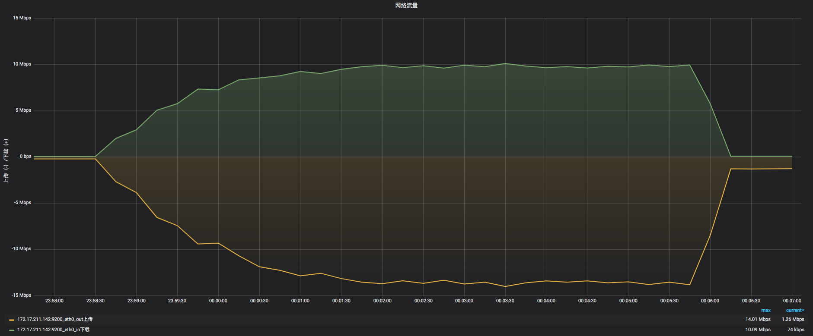

通过上面的测试比对结果可以看到：

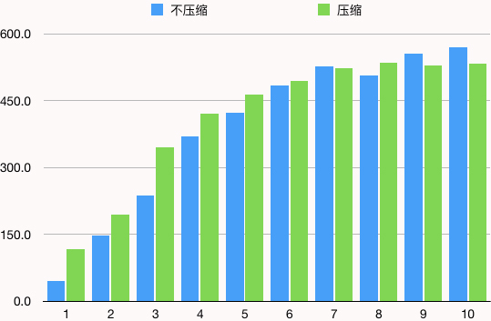

确实在CPU资源足够用的时候，采用压缩，TPS要大一些，但随着压力的增加，CPU资源不够了之后，压缩就没啥用了。

从带宽传输上可以看到，不压缩时最大带宽达到40M，而压缩时最大带宽只有14M，可见压缩对带宽的作用还是很显著的。

### acceptCount

在上面的思维导图中，线程池最后一个参数就是acceptCount，这个值就比较容易理解，就是TCP的接收队列长度。

这次我直接用一个大压力的场景说明它的值大小的区别。我直接上50个线程。为什么要这么做呢，就是为了让队列产生得多一些。

下面我们直接来看结果吧。

### acceptCount=“10000”

测试结果：

```text
summary +   2400 in 00:00:11 =  217.6/s Avg:   108 Min:     3 Max:  1176 Err:     0 (0.00%) Active: 50 Started: 50 Finished: 0
summary +  10322 in 00:00:30 =  344.1/s Avg:    62 Min:     1 Max:   470 Err:     0 (0.00%) Active: 50 Started: 50 Finished: 0
summary =  12722 in 00:00:41 =  310.1/s Avg:    71 Min:     1 Max:  1176 Err:     0 (0.00%)
summary +  12660 in 00:00:30 =  422.0/s Avg:    49 Min:     0 Max:   331 Err:     0 (0.00%) Active: 50 Started: 50 Finished: 0
summary =  25382 in 00:01:11 =  357.4/s Avg:    60 Min:     0 Max:  1176 Err:     0 (0.00%)
summary +  13337 in 00:00:30 =  444.6/s Avg:    46 Min:     1 Max:   410 Err:     0 (0.00%) Active: 50 Started: 50 Finished: 0
summary =  38719 in 00:01:41 =  383.3/s Avg:    55 Min:     0 Max:  1176 Err:     0 (0.00%)
summary +  14176 in 00:00:30 =  472.4/s Avg:    43 Min:     0 Max:   302 Err:     0 (0.00%) Active: 50 Started: 50 Finished: 0
summary =  52895 in 00:02:11 =  403.7/s Avg:    52 Min:     0 Max:  1176 Err:     0 (0.00%)
summary +  14696 in 00:00:30 =  489.7/s Avg:    42 Min:     1 Max:   261 Err:     0 (0.00%) Active: 50 Started: 50 Finished: 0
summary =  67591 in 00:02:41 =  419.7/s Avg:    50 Min:     0 Max:  1176 Err:     0 (0.00%)
summary +  16191 in 00:00:30 =  539.9/s Avg:    38 Min:     0 Max:   320 Err:     0 (0.00%) Active: 50 Started: 50 Finished: 0
summary =  83782 in 00:03:11 =  438.6/s Avg:    47 Min:     0 Max:  1176 Err:     0 (0.00%)
summary +   5299 in 00:00:09 =  580.1/s Avg:    36 Min:     1 Max:   201 Err:     0 (0.00%) Active: 0 Started: 50 Finished: 50
summary =  89081 in 00:03:20 =  445.0/s Avg:    47 Min:     0 Max:  1176 Err:     0 (0.00%)

```

### acceptCount=“100”

测试结果：

```text
summary +   1115 in 00:00:11 =  100.1/s Avg:   306 Min:    11 Max:  1936 Err:     0 (0.00%) Active: 50 Started: 50 Finished: 0
summary +   7923 in 00:00:30 =  264.1/s Avg:    87 Min:     1 Max:   521 Err:     0 (0.00%) Active: 50 Started: 50 Finished: 0
summary =   9038 in 00:00:41 =  219.7/s Avg:   114 Min:     1 Max:  1936 Err:     0 (0.00%)
summary +  11414 in 00:00:30 =  380.5/s Avg:    56 Min:     1 Max:   381 Err:     0 (0.00%) Active: 50 Started: 50 Finished: 0
summary =  20452 in 00:01:11 =  287.5/s Avg:    81 Min:     1 Max:  1936 Err:     0 (0.00%)
summary +  11949 in 00:00:30 =  398.4/s Avg:    51 Min:     0 Max:   390 Err:     0 (0.00%) Active: 50 Started: 50 Finished: 0
summary =  32401 in 00:01:41 =  320.4/s Avg:    70 Min:     0 Max:  1936 Err:     0 (0.00%)
summary +  13403 in 00:00:30 =  446.7/s Avg:    46 Min:     0 Max:   326 Err:     0 (0.00%) Active: 50 Started: 50 Finished: 0
summary =  45804 in 00:02:11 =  349.3/s Avg:    63 Min:     0 Max:  1936 Err:     0 (0.00%)
summary +  13271 in 00:00:30 =  442.4/s Avg:    45 Min:     0 Max:   295 Err:     0 (0.00%) Active: 50 Started: 50 Finished: 0
summary =  59075 in 00:02:41 =  366.6/s Avg:    59 Min:     0 Max:  1936 Err:     0 (0.00%)
summary +  14307 in 00:00:30 =  476.9/s Avg:    43 Min:     1 Max:   288 Err:     0 (0.00%) Active: 50 Started: 50 Finished: 0
summary =  73382 in 00:03:11 =  383.9/s Avg:    56 Min:     0 Max:  1936 Err:     0 (0.00%)
summary +   4292 in 00:00:09 =  476.3/s Avg:    42 Min:     1 Max:   226 Err:     0 (0.00%) Active: 0 Started: 50 Finished: 50
summary =  77674 in 00:03:20 =  388.1/s Avg:    55 Min:     0 Max:  1936 Err:     0 (0.00%)

```

通过上面的结果，可以得到下图：

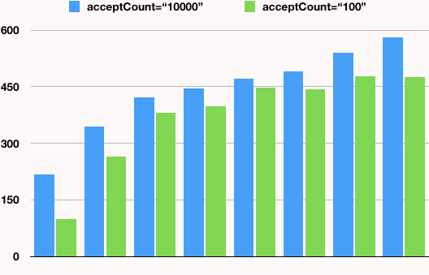

可见当acceptCount大时，对TPS还是有明显帮助的。

接下来，我们再看下connectionTimeout。

### connectionTimeout

我需要说明的是，以下场景均基于以下配置：acceptCount=“10000”。

这个值对我们来说，也是非常关键的数据，因为它影响着KeepAlive的超时和connection的超时。

我们在性能分析的时候，会遇到一种情况是，很多应用都用默认超时，而在压力大的时候，会有少量的报错是因为前端的超时已经到了，而后端还没到，因为毕竟后端是后接收到的请求。这就导致了大压力下少量的错误是因为超时配置导致的。

所以我们通常都会画一个图如下所示：

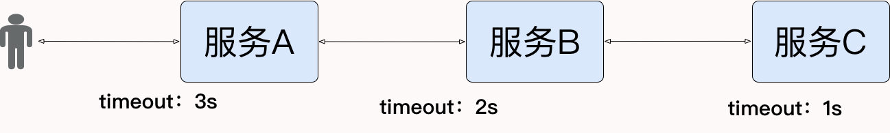

而在真实的应用场景中，应该配置多长时间的超时一定是经过严格的测试的。

下面我们来看看结果。

当 `connectionTimeout="20000"` 时，这个结果直接拿上面的测试结果复用。

测试结果：

```text
summary +   2400 in 00:00:11 =  217.6/s Avg:   108 Min:     3 Max:  1176 Err:     0 (0.00%) Active: 50 Started: 50 Finished: 0
summary +  10322 in 00:00:30 =  344.1/s Avg:    62 Min:     1 Max:   470 Err:     0 (0.00%) Active: 50 Started: 50 Finished: 0
summary =  12722 in 00:00:41 =  310.1/s Avg:    71 Min:     1 Max:  1176 Err:     0 (0.00%)
summary +  12660 in 00:00:30 =  422.0/s Avg:    49 Min:     0 Max:   331 Err:     0 (0.00%) Active: 50 Started: 50 Finished: 0
summary =  25382 in 00:01:11 =  357.4/s Avg:    60 Min:     0 Max:  1176 Err:     0 (0.00%)
summary +  13337 in 00:00:30 =  444.6/s Avg:    46 Min:     1 Max:   410 Err:     0 (0.00%) Active: 50 Started: 50 Finished: 0
summary =  38719 in 00:01:41 =  383.3/s Avg:    55 Min:     0 Max:  1176 Err:     0 (0.00%)
summary +  14176 in 00:00:30 =  472.4/s Avg:    43 Min:     0 Max:   302 Err:     0 (0.00%) Active: 50 Started: 50 Finished: 0
summary =  52895 in 00:02:11 =  403.7/s Avg:    52 Min:     0 Max:  1176 Err:     0 (0.00%)
summary +  14696 in 00:00:30 =  489.7/s Avg:    42 Min:     1 Max:   261 Err:     0 (0.00%) Active: 50 Started: 50 Finished: 0
summary =  67591 in 00:02:41 =  419.7/s Avg:    50 Min:     0 Max:  1176 Err:     0 (0.00%)
summary +  16191 in 00:00:30 =  539.9/s Avg:    38 Min:     0 Max:   320 Err:     0 (0.00%) Active: 50 Started: 50 Finished: 0
summary =  83782 in 00:03:11 =  438.6/s Avg:    47 Min:     0 Max:  1176 Err:     0 (0.00%)
summary +   5299 in 00:00:09 =  580.1/s Avg:    36 Min:     1 Max:   201 Err:     0 (0.00%) Active: 0 Started: 50 Finished: 50
summary =  89081 in 00:03:20 =  445.0/s Avg:    47 Min:     0 Max:  1176 Err:     0 (0.00%)

```

当connectionTimeout="200"时，测试结果为：

```text
summary +   1540 in 00:00:13 =  117.5/s Avg:   258 Min:     7 Max:  2150 Err:    15 (0.97%) Active: 50 Started: 50 Finished: 0
summary +  10080 in 00:00:30 =  336.4/s Avg:    65 Min:     1 Max:   465 Err:     0 (0.00%) Active: 50 Started: 50 Finished: 0
summary =  11620 in 00:00:43 =  269.8/s Avg:    90 Min:     1 Max:  2150 Err:    15 (0.13%)
summary +  12691 in 00:00:30 =  422.8/s Avg:    49 Min:     0 Max:   317 Err:     0 (0.00%) Active: 50 Started: 50 Finished: 0
summary =  24311 in 00:01:13 =  332.6/s Avg:    69 Min:     0 Max:  2150 Err:    15 (0.06%)
summary +  12707 in 00:00:30 =  423.8/s Avg:    48 Min:     1 Max:   312 Err:     0 (0.00%) Active: 50 Started: 50 Finished: 0
summary =  37018 in 00:01:43 =  359.2/s Avg:    62 Min:     0 Max:  2150 Err:    15 (0.04%)
summary +  13530 in 00:00:30 =  450.7/s Avg:    45 Min:     0 Max:   306 Err:     0 (0.00%) Active: 50 Started: 50 Finished: 0
summary =  50548 in 00:02:13 =  379.8/s Avg:    57 Min:     0 Max:  2150 Err:    15 (0.03%)
summary +  13791 in 00:00:30 =  460.0/s Avg:    44 Min:     1 Max:   344 Err:     0 (0.00%) Active: 50 Started: 50 Finished: 0
summary =  64339 in 00:02:43 =  394.5/s Avg:    55 Min:     0 Max:  2150 Err:    15 (0.02%)
summary +  14840 in 00:00:30 =  494.6/s Avg:    41 Min:     0 Max:   319 Err:     0 (0.00%) Active: 50 Started: 50 Finished: 0
summary =  79179 in 00:03:13 =  410.1/s Avg:    52 Min:     0 Max:  2150 Err:    15 (0.02%)
summary +   3734 in 00:00:07 =  530.5/s Avg:    39 Min:     1 Max:   282 Err:     0 (0.00%) Active: 0 Started: 50 Finished: 50
summary =  82913 in 00:03:20 =  414.3/s Avg:    51 Min:     0 Max:  2150 Err:    15 (0.02%)

```

看到没有，一开始就有少量的报错产生了，但一些我没加断言的报错应该没有在这里没显示出来。

所以根据应用的重要性，超时长度在具体的应用场景中，一定要做严格的测试。把完整的业务链路图画出来之后，一个个环节分析超时应该设置为多大，才是合理的做法。

## 总结

至于其他的Tomcat调优参数，你可以在自己的场景中实际操作一下。

总之，Tomcat的优化就是这么几个关键环节：协议、运行模式（尽管现在我认为它已经不再有争议了，但是当你用老版本的Tomcat时还是要注意一下）、线程池（关键中的关键）等。

不止是Tomcat这样，其他类似的应用服务器也是一样。尽管这些应用服务器在架构设计上会不同，但是在我的调优生涯中，针对这样的应用服务器，可调优的关键点真的就这么几个。

可见这样的应用服务器本身可调优的点并不多。如果你要调的是SpringBoot中的Tomcat组件，也可以用同样的思路。

最后我还是要说，在你的具体工作中，一定要拿实际测试结果来分析判断，以免产生偏差。在任何时候，都要知道，性能测试的计数器中，没有哪个计数器的值可以直接告诉你性能问题的原因，只有通过自己的分析判断才能找得到。

## 思考题

最后给你留两道思考题吧。类似Tomcat的应用服务器，应该如何拆解监控计数器呢？我们应该如何判断应用服务器的线程是否够用？

欢迎你在评论区写下你的思考，也欢迎把这篇文章分享给你的朋友或者同事，一起交流进步一下。