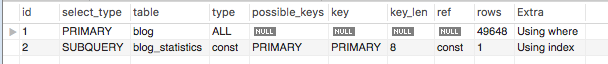
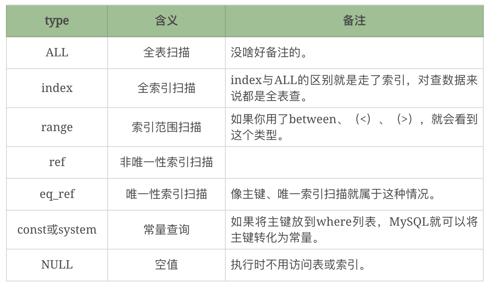
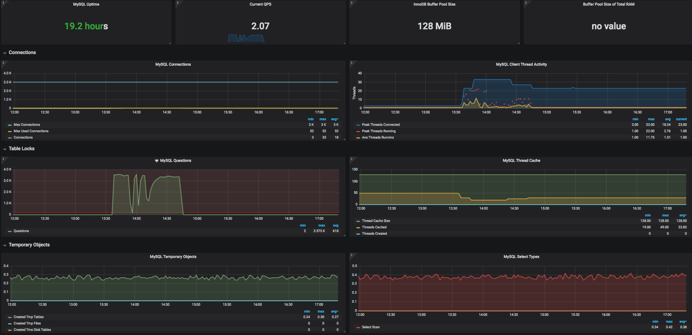
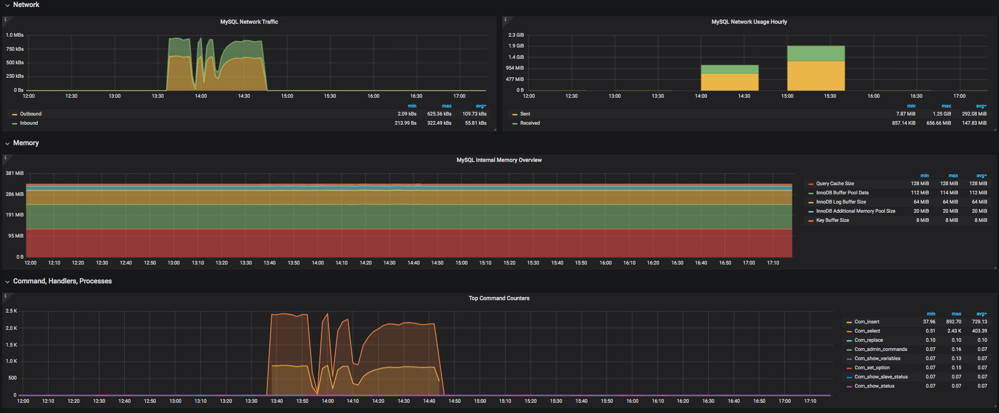
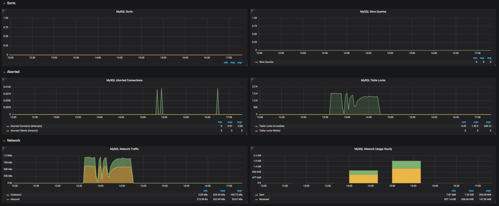

# 23丨MySQL：数据库级监控及常用计数器解析（下）
上一篇文章中，我们讲了有关数据库的全局分析，那么在今天的文章中，我们继续看看在数据库中，如何做定向分析。

还记得我在上篇文章中提到的工具吗？mysqlreport、pt-query-digest和mysql\_exportor+Prometheus+Grafana。我们在上一篇中已经讲完了mysqlreport，今天我们来看看剩下的这几个。

## 定向抓取SQL：pt-query-digest

`pt-query-digest` 是个挺好的工具，它可以分析 `slow log`、 `general log`、 `binary log`，还能分析tcpdump抓取的MySQL协议数据，可见这个工具有多强大。 `pt-query-digest` 属于Percona-tool工具集，这个Percona公司还出了好几个特别好使的监控MySQL的工具。

`pt-query-digest` 分析slow log时产生的报告逻辑非常清晰，并且数据也比较完整。执行命令后就会生成一个报告。

我来稍微解释一下这个报告。我们先看这个报告的第一个部分：

```
# 88.3s user time, 2.5s system time, 18.73M rss, 2.35G vsz
# Current date: Thu Jun 22 11:30:02 2017
# Hostname: localhost
# Files: /Users/Zee/Downloads/log/10.21.0.30/4001/TENCENT64-slow.log.last
# Overall: 210.18k total, 43 unique, 0.26 QPS, 0.14x concurrency _________
# Time range: 2017-06-12 21:20:51 to 2017-06-22 09:26:38
# Attribute          total     min     max     avg     95%  stddev  median
# ============     ======= ======= ======= ======= ======= ======= =======
# Exec time        118079s   100ms      9s   562ms      2s   612ms   293ms
# Lock time            15s       0     7ms    71us   119us    38us    69us
# Rows sent          1.91M       0  48.42k    9.53   23.65  140.48    2.90
# Rows examine      13.99G       0   3.76M  69.79k 101.89k  33.28k  68.96k
# Rows affecte       3.36M       0   1.98M   16.76    0.99   4.90k       0
# Query size       102.82M       6  10.96k  512.99  719.66  265.43  719.66

```

从上表中可以看得出来，在这个慢日志中，总执行时间达到了118079s，平均执行时间为562ms，最长执行时间为9s，标准方差为612ms。

可见在此示例中，SQL执行还是有点慢的。

这时也许会有人问，SQL执行多长时间才是慢呢？之前在一个金融机构，我跟一个做核心系统的团队讨论他们的SQL执行时间指标。他们判断之后说，希望SQL平均执行时间指标定在500ms。我说，你们要500ms，那前面还有一连串的节点才能到达最终的用户，如果每个环节都这样要求自己，那最终的用户不就明显感觉到很慢了吗？

经过一轮轮的讨论，最后定在了100ms以内。

其实从我的经验上来看，对于大部分实时的业务，一个SQL执行的平均时间指标定在100ms都多了。但是对性能来说就是这样，在所有的环节中都没有固定的标准，只有经验数据和不断演化的系统性能能力。

我们再接着分析上面的数据。再来看 `pt-query-digest` 给出的负载报表：

```
# Profile
# Rank Query ID           Response time    Calls  R/Call V/M   Item
# ==== ================== ================ ====== ====== ===== ===========
#    1 0x6A516B681113449F 73081.7989 61.9%  76338 0.9573  0.71 UPDATE mb_trans
#    2 0x90194A5C40980DA7 38014.5008 32.2% 105778 0.3594  0.20 SELECT mb_trans mb_trans_finan
#    3 0x9B56065EE2D0A5C8  3893.9757  3.3%   9709 0.4011  0.11 UPDATE mb_finan
# MISC 0xMISC              3088.5453  2.6%  18353 0.1683   0.0 <40 ITEMS>

```

从这个表中可以看到，有两个SQL的执行时间占了总执行时间的94%，显然这两个SQL是要接下来要分析的重点。

我们再接着看这个工具给出的第一个SQL的性能报表：

```
# Query 1: 0.30 QPS, 0.29x concurrency, ID 0x6A516B681113449F at byte 127303589
# This item is included in the report because it matches --limit.
# Scores: V/M = 0.71
# Time range: 2017-06-16 21:12:05 to 2017-06-19 18:50:59
# Attribute    pct   total     min     max     avg     95%  stddev  median
# ============ === ======= ======= ======= ======= ======= ======= =======
# Count         36   76338
# Exec time     61  73082s   100ms      5s   957ms      2s   823ms   672ms
# Lock time     19      3s    20us     7ms    38us    66us    29us    33us
# Rows sent      0       0       0       0       0       0       0       0
# Rows examine  36   5.06G   3.82k 108.02k  69.57k 101.89k  22.70k  68.96k
# Rows affecte   2  74.55k       1       1       1       1       0       1
# Query size    12  12.36M     161     263  169.75  192.76   11.55  158.58
# String:
# Databases    db_bank
# Hosts        10.21.16.50 (38297/50%)... 1 more
# Users        user1
# Query_time distribution
#   1us
#  10us
# 100us
#   1ms
#  10ms
# 100ms  ################################################################
#    1s  #########################################
#  10s+
# Tables
#    SHOW TABLE STATUS FROM `db_bank` LIKE 'mb_trans'\G
#    SHOW CREATE TABLE `db_bank`.`mb_trans`\G
UPDATE mb_trans
		SET
		resCode='PCX00000',resultMes='交易成功',payTranStatus='P03',payRouteCode='CMA'
		WHERE
		seqNo='20170619PM010394356875'\G
# Converted for EXPLAIN
# EXPLAIN /*!50100 PARTITIONS*/
select
		resCode='PCX00000',resultMes='交易成功',payTranStatus='P03',payRouteCode='CMA' from mb_trans where
		seqNo='20170619PM010394356875'\G

```

从查询时间分布图上来看，这个语句的执行时间在100ms~1s之间居多，95%的执行时间在2s以下。那么这个SQL就是我们接下来要调优的重点了。

第二个SQL我就不赘述了，因为逻辑是完全一样的。

通过对慢日志的分析，我们可以很快知道哪个SQL是慢的了。当然你用 `mysqldumpslow` 分析，也会得到一样的结果。

## SQL剖析：profiling

在分析数据库的性能时，显然对SQL的分析是绕不过去的一个环节。但是我之前也说过了，上来就对SQL进行全面剖析也是不合逻辑的，因为SQL那么多，如果对每个SQL都进行详细的执行步骤解析，显然会拖慢整个系统，而且，对一些执行快的SQL进行分析也没有什么必要，徒增资源消耗。

通过上面的分析过程，我们已经定位到了具体是哪个SQL执行得慢，那么下面就是要知道SQL的执行细节。无论是在Oracle还是在MySQL中，我们都要去看执行计划。

比如说下面这样的：



上图中 `select_type` 是子句类型的意思，有简单有复杂，但是它不能说明什么成本的问题。在这里，最重要的内容是type，因为type可以告诉你访问这个表的时候，是通过什么样的方式访问的。上图中的ALL是全表扫描的意思。type还有如下几个值：



执行计划中的 `possible_keys` 会列出可能使用到的索引值。key这一列会列出执行时使用到的索引值。

以上信息就是MySQL的执行计划中比较重要的部分了。这些信息可以帮助我们做SQL的分析，为优化提供证据。

除了执行计划外，MySQL还提供了 `profiling`，这个有什么用呢？它可以把SQL执行的每一个步骤详细列出来，从一个SQL进入到数据库中，到执行完这整个生命周期。

MySQL的 `profiling` 在 `session` 级生效，所以当你用了慢日志，知道哪个SQL有问题之后，再用这个功能是最见成效的。如果想一开始就把所有 `session` 的 `SQL profiling` 功能打开，那成本就太高了。

下面我来详细解释一下profiling的用法和功能。

### profiling操作步骤

profiling的操作步骤比较简单，如下所示：

```
步骤一 ：set profiling=1;  //这一步是为了打开profiling功能
步骤二 ：执行语句           //执行你从慢日志中看到的语句
步骤三 ：show profiles;    //这一步是为了查找步骤二中执行的语句的ID
步骤四 ：show profile all for query id; //这一步是为了显示出profiling的结果

```

我们实际执行一下上面的步骤：

```
// 步骤一：打开profiling功能
mysql> set profiling=1;
Query OK, 0 rows affected, 1 warning (0.00 sec)
// 这一步只是为了确认一下profiles列表有没有值，可以不用执行。
mysql> show profiles;
Empty set, 1 warning (0.00 sec)
// 步骤二：执行语句
mysql> select * from t_user where user_name='Zee0355916';
+--------------------------------------+-------------+------------+--------+----------------------+-------------+---------------------+
| id                                   | user_number | user_name  | org_id | email                | mobile      | create_time         |
+--------------------------------------+-------------+------------+--------+----------------------+-------------+---------------------+
| 00000d2d-32a8-11ea-91f8-00163e124cff | 00009496    | Zee0355916 | NULL   | test9495@dunshan.com | 17600009498 | 2020-01-09 14:19:32 |
| 77bdb1ef-32a6-11ea-91f8-00163e124cff | 00009496    | Zee0355916 | NULL   | test9495@dunshan.com | 17600009498 | 2020-01-09 14:08:34 |
| d4338339-32a2-11ea-91f8-00163e124cff | 00009496    | Zee0355916 | NULL   | test9495@dunshan.com | 17600009498 | 2020-01-09 13:42:31 |
+--------------------------------------+-------------+------------+--------+----------------------+-------------+---------------------+
3 rows in set (14.33 sec)
// 步骤三：查看profiles列表中，有了我们刚才执行的语句
mysql> show profiles;
+----------+-------------+---------------------------------------------------+
| Query_ID | Duration    | Query                                             |
+----------+-------------+---------------------------------------------------+
|        1 | 14.34078475 | select * from t_user where user_name='Zee0355916' |
+----------+-------------+---------------------------------------------------+
1 row in set, 1 warning (0.00 sec)
// 步骤四：看这个语句的profile信息
mysql> show profile all for query 1;
+--------------------------------+-----------+----------+------------+-------------------+---------------------+--------------+---------------+---------------+-------------------+-------------------+-------------------+-------+-----------------------+------------------+-------------+
| Status                         | Duration  | CPU_user | CPU_system | Context_voluntary | Context_involuntary | Block_ops_in | Block_ops_out | Messages_sent | Messages_received | Page_faults_major | Page_faults_minor | Swaps | Source_function       | Source_file      | Source_line |
+--------------------------------+-----------+----------+------------+-------------------+---------------------+--------------+---------------+---------------+-------------------+-------------------+-------------------+-------+-----------------------+------------------+-------------+
| starting                       |  0.000024 | 0.000012 |   0.000005 |                 0 |                   0 |            0 |             0 |             0 |                 0 |                 0 |                 0 |     0 | NULL                  | NULL             |        NULL |
| Waiting for query cache lock   |  0.000004 | 0.000003 |   0.000001 |                 0 |                   0 |            0 |             0 |             0 |                 0 |                 0 |                 0 |     0 | try_lock              | sql_cache.cc     |         468 |
| init                           |  0.000003 | 0.000002 |   0.000001 |                 0 |                   0 |            0 |             0 |             0 |                 0 |                 0 |                 0 |     0 | try_lock              | sql_cache.cc     |         468 |
| checking query cache for query |  0.000052 | 0.000036 |   0.000015 |                 0 |                   0 |            0 |             0 |             0 |                 0 |                 0 |                 0 |     0 | send_result_to_client | sql_cache.cc     |        1601 |
| checking permissions           |  0.000007 | 0.000005 |   0.000002 |                 0 |                   0 |            0 |             0 |             0 |                 0 |                 0 |                 0 |     0 | check_access          | sql_parse.cc     |        5316 |
| Opening tables                 |  0.000032 | 0.000023 |   0.000009 |                 0 |                   0 |            0 |             0 |             0 |                 0 |                 0 |                 0 |     0 | open_tables           | sql_base.cc      |        5095 |
| init                           |  0.000042 | 0.000029 |   0.000013 |                 0 |                   0 |            0 |             0 |             0 |                 0 |                 0 |                 0 |     0 | mysql_prepare_select  | sql_select.cc    |        1051 |
| System lock                    |  0.000016 | 0.000011 |   0.000004 |                 0 |                   0 |            0 |             0 |             0 |                 0 |                 0 |                 0 |     0 | mysql_lock_tables     | lock.cc          |         304 |
| Waiting for query cache lock   |  0.000003 | 0.000002 |   0.000001 |                 0 |                   0 |            0 |             0 |             0 |                 0 |                 0 |                 0 |     0 | try_lock              | sql_cache.cc     |         468 |
| System lock                    |  0.000020 | 0.000014 |   0.000006 |                 0 |                   0 |            0 |             0 |             0 |                 0 |                 0 |                 0 |     0 | try_lock              | sql_cache.cc     |         468 |
| optimizing                     |  0.000012 | 0.000009 |   0.000004 |                 0 |                   0 |            0 |             0 |             0 |                 0 |                 0 |                 0 |     0 | optimize              | sql_optimizer.cc |         139 |
| statistics                     |  0.000019 | 0.000013 |   0.000005 |                 0 |                   0 |            0 |             0 |             0 |                 0 |                 0 |                 0 |     0 | optimize              | sql_optimizer.cc |         365 |
| preparing                      |  0.000015 | 0.000010 |   0.000005 |                 0 |                   0 |            0 |             0 |             0 |                 0 |                 0 |                 0 |     0 | optimize              | sql_optimizer.cc |         488 |
| executing                      |  0.000004 | 0.000003 |   0.000001 |                 0 |                   0 |            0 |             0 |             0 |                 0 |                 0 |                 0 |     0 | exec                  | sql_executor.cc  |         110 |
| Sending data                   | 14.324781 | 4.676869 |   0.762349 |              1316 |                 132 |      2499624 |           288 |             0 |                 0 |                 8 |             30862 |     0 | exec                  | sql_executor.cc  |         190 |
| end                            |  0.000015 | 0.000007 |   0.000002 |                 0 |                   0 |            0 |             0 |             0 |                 0 |                 0 |                 0 |     0 | mysql_execute_select  | sql_select.cc    |        1106 |
| query end                      |  0.000006 | 0.000005 |   0.000001 |                 0 |                   0 |            0 |             0 |             0 |                 0 |                 0 |                 0 |     0 | mysql_execute_command | sql_parse.cc     |        5015 |
| closing tables                 |  0.000016 | 0.000013 |   0.000003 |                 0 |                   0 |            0 |             0 |             0 |                 0 |                 0 |                 0 |     0 | mysql_execute_command | sql_parse.cc     |        5063 |
| freeing items                  |  0.000013 | 0.000010 |   0.000003 |                 0 |                   0 |            0 |             0 |             0 |                 0 |                 0 |                 2 |     0 | mysql_parse           | sql_parse.cc     |        6490 |
| Waiting for query cache lock   |  0.000003 | 0.000002 |   0.000000 |                 0 |                   0 |            0 |             0 |             0 |                 0 |                 0 |                 0 |     0 | try_lock              | sql_cache.cc     |         468 |
| freeing items                  |  0.000014 | 0.000012 |   0.000003 |                 0 |                   0 |            0 |             0 |             0 |                 0 |                 0 |                 0 |     0 | try_lock              | sql_cache.cc     |         468 |
| Waiting for query cache lock   |  0.000003 | 0.000002 |   0.000000 |                 0 |                   0 |            0 |             0 |             0 |                 0 |                 0 |                 0 |     0 | try_lock              | sql_cache.cc     |         468 |
| freeing items                  |  0.000003 | 0.000002 |   0.000001 |                 0 |                   0 |            0 |             0 |             0 |                 0 |                 0 |                 0 |     0 | try_lock              | sql_cache.cc     |         468 |
| storing result in query cache  |  0.000004 | 0.000002 |   0.000000 |                 0 |                   0 |            0 |             0 |             0 |                 0 |                 0 |                 0 |     0 | end_of_result         | sql_cache.cc     |        1034 |
| logging slow query             |  0.015645 | 0.000084 |   0.000020 |                 2 |                   0 |           16 |             8 |             0 |                 0 |                 0 |                 2 |     0 | log_slow_do           | sql_parse.cc     |        1935 |
| cleaning up                    |  0.000034 | 0.000024 |   0.000006 |                 0 |                   0 |            0 |             0 |             0 |                 0 |                 0 |                 0 |     0 | dispatch_command      | sql_parse.cc     |        1837 |
+--------------------------------+-----------+----------+------------+-------------------+---------------------+--------------+---------------+---------------+-------------------+-------------------+-------------------+-------+-----------------------+------------------+-------------+
26 rows in set, 1 warning (0.02 sec)

```

非常长，从这样的数据中，我们就看到了一个语句在数据库中从开始到结束的整个生命周期。

对生命周期中的每个步骤进行统计之后，我们就可以看到每个步骤所消耗的时间。不仅如此，还能看到如下这些信息：

- BLOCK IO
- Context Switches
- CPU
- IPC
- MEMORY
- Page Fault
- SOURCE
- SWAPS

有了这些信息，我们基本上就可以判断语句哪里有问题了。

从上面这个示例语句中，你可以看到 `Sending data` 这一步消耗了14秒的时间，并且从后面的数据中，也可以看到主动上下文切换有1316次，被动的有132次，块操作的量也非常大。

碰到这样的情况，我们就得先知道这个 `Sending data` 到底是什么东西。下面我们结合之前说的到的执行计划，一起看一下：

```
mysql> explain select * from t_user where user_name='Zee0355916';
+----+-------------+--------+------+---------------+------+---------+------+---------+-------------+
| id | select_type | table  | type | possible_keys | key  | key_len | ref  | rows    | Extra       |
+----+-------------+--------+------+---------------+------+---------+------+---------+-------------+
|  1 | SIMPLE      | t_user | ALL  | NULL          | NULL | NULL    | NULL | 3868195 | Using where |
+----+-------------+--------+------+---------------+------+---------+------+---------+-------------+
1 row in set (0.00 sec)

```

这就是个典型的全表扫描，所以下一步就是检查有没有创建索引。

```
mysql> show indexes from t_user;
+--------+------------+----------+--------------+-------------+-----------+-------------+----------+--------+------+------------+---------+---------------+
| Table  | Non_unique | Key_name | Seq_in_index | Column_name | Collation | Cardinality | Sub_part | Packed | Null | Index_type | Comment | Index_comment |
+--------+------------+----------+--------------+-------------+-----------+-------------+----------+--------+------+------------+---------+---------------+
| t_user |          0 | PRIMARY  |            1 | id          | A         |     3868195 |     NULL | NULL   |      | BTREE      |         |               |
+--------+------------+----------+--------------+-------------+-----------+-------------+----------+--------+------+------------+---------+---------------+
1 row in set (0.00 sec)

mysql>

```

还是有一个主键索引的，但由于我们没用主键来查，所以用不到。

有些性能测试工程师面对这种情况可能会有这种想法：第一次没有查索引，但是把所有数据都调到缓存里了呀，所以第二次就快了嘛，于是有些人可能想尽快“完成”工作，就用重复的数据。

这里我再执行一遍，你可以看看是什么结果：

```
+----------+-------------+-----------------------------------------------------------+
| Query_ID | Duration    | Query                                                     |
+----------+-------------+-----------------------------------------------------------+
|        1 | 14.34078475 | select * from t_user where user_name='Zee0355916'         |
|        2 |  0.00006675 | show profile all for 1                                    |
|        3 |  0.00031700 | explain select * from t_user where user_name='Zee0355916' |
|        4 |  0.00040025 | show indexes from t_user                                  |
+----------+-------------+-----------------------------------------------------------+
6 rows in set, 1 warning (0.00 sec)

mysql> select * from t_user where user_name='Zee0355916';
+--------------------------------------+-------------+------------+--------+----------------------+-------------+---------------------+
| id                                   | user_number | user_name  | org_id | email                | mobile      | create_time         |
+--------------------------------------+-------------+------------+--------+----------------------+-------------+---------------------+
| 00000d2d-32a8-11ea-91f8-00163e124cff | 00009496    | Zee0355916 | NULL   | test9495@dunshan.com | 17600009498 | 2020-01-09 14:19:32 |
| 77bdb1ef-32a6-11ea-91f8-00163e124cff | 00009496    | Zee0355916 | NULL   | test9495@dunshan.com | 17600009498 | 2020-01-09 14:08:34 |
| d4338339-32a2-11ea-91f8-00163e124cff | 00009496    | Zee0355916 | NULL   | test9495@dunshan.com | 17600009498 | 2020-01-09 13:42:31 |
+--------------------------------------+-------------+------------+--------+----------------------+-------------+---------------------+
3 rows in set (0.00 sec)

mysql> show profiles;
+----------+-------------+-----------------------------------------------------------+
| Query_ID | Duration    | Query                                                     |
+----------+-------------+-----------------------------------------------------------+
|        1 | 14.34078475 | select * from t_user where user_name='Zee0355916'         |
|        2 |  0.00006675 | show profile all for 1                                    |
|        3 |  0.00031700 | explain select * from t_user where user_name='Zee0355916' |
|        4 |  0.00040025 | show indexes from t_user                                  |
|        5 |  0.00027325 | select * from t_user where user_name='Zee0355916'         |
+----------+-------------+-----------------------------------------------------------+
7 rows in set, 1 warning (0.00 sec)

mysql> show profile all for query 5;
+--------------------------------+----------+----------+------------+-------------------+---------------------+--------------+---------------+---------------+-------------------+-------------------+-------------------+-------+-----------------------+--------------+-------------+
| Status                         | Duration | CPU_user | CPU_system | Context_voluntary | Context_involuntary | Block_ops_in | Block_ops_out | Messages_sent | Messages_received | Page_faults_major | Page_faults_minor | Swaps | Source_function       | Source_file  | Source_line |
+--------------------------------+----------+----------+------------+-------------------+---------------------+--------------+---------------+---------------+-------------------+-------------------+-------------------+-------+-----------------------+--------------+-------------+
| starting                       | 0.000029 | 0.000018 |   0.000004 |                 0 |                   0 |            0 |             0 |             0 |                 0 |                 0 |                 0 |     0 | NULL                  | NULL         |        NULL |
| Waiting for query cache lock   | 0.000006 | 0.000003 |   0.000001 |                 0 |                   0 |            0 |             0 |             0 |                 0 |                 0 |                 0 |     0 | try_lock              | sql_cache.cc |         468 |
| init                           | 0.000003 | 0.000003 |   0.000000 |                 0 |                   0 |            0 |             0 |             0 |                 0 |                 0 |                 0 |     0 | try_lock              | sql_cache.cc |         468 |
| checking query cache for query | 0.000008 | 0.000006 |   0.000002 |                 0 |                   0 |            0 |             0 |             0 |                 0 |                 0 |                 0 |     0 | send_result_to_client | sql_cache.cc |        1601 |
| checking privileges on cached  | 0.000003 | 0.000002 |   0.000000 |                 0 |                   0 |            0 |             0 |             0 |                 0 |                 0 |                 0 |     0 | send_result_to_client | sql_cache.cc |        1692 |
| checking permissions           | 0.000010 | 0.000192 |   0.000000 |                 0 |                   0 |            0 |             0 |             0 |                 0 |                 0 |                 0 |     0 | check_access          | sql_parse.cc |        5316 |
| sending cached result to clien | 0.000210 | 0.000028 |   0.000000 |                 0 |                   0 |            0 |             0 |             0 |                 0 |                 0 |                 1 |     0 | send_result_to_client | sql_cache.cc |        1803 |
| cleaning up                    | 0.000006 | 0.000006 |   0.000000 |                 0 |                   0 |            0 |             0 |             0 |                 0 |                 0 |                 0 |     0 | dispatch_command      | sql_parse.cc |        1837 |
+--------------------------------+----------+----------+------------+-------------------+---------------------+--------------+---------------+---------------+-------------------+-------------------+-------------------+-------+-----------------------+--------------+-------------+
8 rows in set, 1 warning (0.00 sec)

mys

```

看到没有，在用重复数据的时候确实会让响应时间快很多，因为数据直接从 `cache` 中发给 `client` 了。

但是，这种作法请你坚决制止，因为它不符合真实生产的样子。当你再换一个数据的时候，就会歇菜，还要再经过14秒的时间做全表扫描。

所以正确的做法是创建合适的索引，让语句在执行任何一条数据时都能快起来，那么，我们现在就创建一个索引，再看执行结果。

```
// 创建索引
mysql> ALTER TABLE t_user ADD INDEX username_idx (user_name);
Query OK, 0 rows affected (44.69 sec)
Records: 0  Duplicates: 0  Warnings: 0
// 分析表
mysql> analyze table t_user;
+-----------+---------+----------+----------+
| Table     | Op      | Msg_type | Msg_text |
+-----------+---------+----------+----------+
| pa.t_user | analyze | status   | OK       |
+-----------+---------+----------+----------+
1 row in set (0.08 sec)
// 执行语句
mysql> select * from t_user where user_name='Zee0046948';
+--------------------------------------+-------------+------------+--------+----------------------+-------------+---------------------+
| id                                   | user_number | user_name  | org_id | email                | mobile      | create_time         |
+--------------------------------------+-------------+------------+--------+----------------------+-------------+---------------------+
| 000061a2-31c2-11ea-8d89-00163e124cff | 00009496    | Zee0046948 | NULL   | test9495@dunshan.com | 17600009498 | 2020-01-08 10:53:08 |
| 047d7ae1-32a2-11ea-91f8-00163e124cff | 00009496    | Zee0046948 | NULL   | test9495@dunshan.com | 17600009498 | 2020-01-09 13:36:42 |
| 1abfa543-318f-11ea-8d89-00163e124cff | 00009496    | Zee0046948 | NULL   | test9495@dunshan.com | 17600009498 | 2020-01-08 04:48:48 |
| 671c4014-3222-11ea-91f8-00163e124cff | 00009496    | Zee0046948 | NULL   | test9495@dunshan.com | 17600009498 | 2020-01-08 22:23:12 |
| 9de16dd3-32a5-11ea-91f8-00163e124cff | 00009496    | Zee0046948 | NULL   | test9495@dunshan.com | 17600009498 | 2020-01-09 14:02:28 |
| dd4ab182-32a4-11ea-91f8-00163e124cff | 00009496    | Zee0046948 | NULL   | test9495@dunshan.com | 17600009498 | 2020-01-09 13:57:05 |
| f507067e-32a6-11ea-91f8-00163e124cff | 00009496    | Zee0046948 | NULL   | test9495@dunshan.com | 17600009498 | 2020-01-09 14:12:04 |
| f7b82744-3185-11ea-8d89-00163e124cff | 00009496    | Zee0046948 | NULL   | test9495@dunshan.com | 17600009498 | 2020-01-08 03:43:24 |
+--------------------------------------+-------------+------------+--------+----------------------+-------------+---------------------+
8 rows in set (0.02 sec)
// 查看Query_ID
mysql> show profiles;
+----------+-------------+-----------------------------------------------------------+
| Query_ID | Duration    | Query                                                     |
+----------+-------------+-----------------------------------------------------------+
|        1 | 14.34078475 | select * from t_user where user_name='Zee0355916'         |
|        2 |  0.00006675 | show profile all for 1                                    |
|        3 |  0.00031700 | explain select * from t_user where user_name='Zee0355916' |
|        4 |  0.00005875 | show indexes for table t_user                             |
|        5 |  0.00005850 | show indexes for t_user                                   |
|        6 |  0.00040025 | show indexes from t_user                                  |
|        7 |  0.00027325 | select * from t_user where user_name='Zee0355916'         |
|        8 |  0.00032100 | explain select * from t_user where user_name='Zee0355916' |
|        9 | 12.22490550 | select * from t_user where user_name='Zee0046945'         |
|       10 |  0.00112450 | select * from t_user limit 20                             |
|       11 | 44.68370500 | ALTER TABLE t_user ADD INDEX username_idx (user_name)     |
|       12 |  0.07385150 | analyze table t_user                                      |
|       13 |  0.01516450 | select * from t_user where user_name='Zee0046948'         |
+----------+-------------+-----------------------------------------------------------+
13 rows in set, 1 warning (0.00 sec)
// 查看profile信息
mysql> show profile all for query 13;
+--------------------------------+----------+----------+------------+-------------------+---------------------+--------------+---------------+---------------+-------------------+-------------------+-------------------+-------+-----------------------+------------------+-------------+
| Status                         | Duration | CPU_user | CPU_system | Context_voluntary | Context_involuntary | Block_ops_in | Block_ops_out | Messages_sent | Messages_received | Page_faults_major | Page_faults_minor | Swaps | Source_function       | Source_file      | Source_line |
+--------------------------------+----------+----------+------------+-------------------+---------------------+--------------+---------------+---------------+-------------------+-------------------+-------------------+-------+-----------------------+------------------+-------------+
| starting                       | 0.000030 | 0.000017 |   0.000004 |                 0 |                   0 |            0 |             0 |             0 |                 0 |                 0 |                 0 |     0 | NULL                  | NULL             |        NULL |
| Waiting for query cache lock   | 0.000005 | 0.000004 |   0.000001 |                 0 |                   0 |            0 |             0 |             0 |                 0 |                 0 |                 0 |     0 | try_lock              | sql_cache.cc     |         468 |
| init                           | 0.000003 | 0.000002 |   0.000000 |                 0 |                   0 |            0 |             0 |             0 |                 0 |                 0 |                 0 |     0 | try_lock              | sql_cache.cc     |         468 |
| checking query cache for query | 0.000060 | 0.000050 |   0.000011 |                 0 |                   0 |            0 |             0 |             0 |                 0 |                 0 |                 0 |     0 | send_result_to_client | sql_cache.cc     |        1601 |
| checking permissions           | 0.000009 | 0.000007 |   0.000002 |                 0 |                   0 |            0 |             0 |             0 |                 0 |                 0 |                 0 |     0 | check_access          | sql_parse.cc     |        5316 |
| Opening tables                 | 0.000671 | 0.000412 |   0.000000 |                 1 |                   0 |            8 |             0 |             0 |                 0 |                 0 |                 1 |     0 | open_tables           | sql_base.cc      |        5095 |
| init                           | 0.006018 | 0.000082 |   0.000899 |                 1 |                   0 |         5408 |             0 |             0 |                 0 |                 1 |                 0 |     0 | mysql_prepare_select  | sql_select.cc    |        1051 |
| System lock                    | 0.000017 | 0.000011 |   0.000003 |                 0 |                   0 |            0 |             0 |             0 |                 0 |                 0 |                 0 |     0 | mysql_lock_tables     | lock.cc          |         304 |
| Waiting for query cache lock   | 0.000003 | 0.000003 |   0.000000 |                 0 |                   0 |            0 |             0 |             0 |                 0 |                 0 |                 0 |     0 | try_lock              | sql_cache.cc     |         468 |
| System lock                    | 0.000019 | 0.000015 |   0.000004 |                 0 |                   0 |            0 |             0 |             0 |                 0 |                 0 |                 0 |     0 | try_lock              | sql_cache.cc     |         468 |
| optimizing                     | 0.000012 | 0.000010 |   0.000002 |                 0 |                   0 |            0 |             0 |             0 |                 0 |                 0 |                 0 |     0 | optimize              | sql_optimizer.cc |         139 |
| statistics                     | 0.001432 | 0.000167 |   0.000037 |                 1 |                   0 |           32 |             0 |             0 |                 0 |                 0 |                 4 |     0 | optimize              | sql_optimizer.cc |         365 |
| preparing                      | 0.000026 | 0.000043 |   0.000009 |                 0 |                   0 |            0 |             0 |             0 |                 0 |                 0 |                 1 |     0 | optimize              | sql_optimizer.cc |         488 |
| executing                      | 0.000034 | 0.000005 |   0.000001 |                 0 |                   0 |            0 |             0 |             0 |                 0 |                 0 |                 0 |     0 | exec                  | sql_executor.cc  |         110 |
| Sending data                   | 0.006727 | 0.000439 |   0.001111 |                13 |                   0 |         1536 |             0 |             0 |                 0 |                 0 |                 1 |     0 | exec                  | sql_executor.cc  |         190 |
| end                            | 0.000014 | 0.000007 |   0.000002 |                 0 |                   0 |            0 |             0 |             0 |                 0 |                 0 |                 0 |     0 | mysql_execute_select  | sql_select.cc    |        1106 |
| query end                      | 0.000009 | 0.000008 |   0.000001 |                 0 |                   0 |            0 |             0 |             0 |                 0 |                 0 |                 0 |     0 | mysql_execute_command | sql_parse.cc     |        5015 |
| closing tables                 | 0.000015 | 0.000012 |   0.000003 |                 0 |                   0 |            0 |             0 |             0 |                 0 |                 0 |                 0 |     0 | mysql_execute_command | sql_parse.cc     |        5063 |
| freeing items                  | 0.000010 | 0.000008 |   0.000002 |                 0 |                   0 |            0 |             0 |             0 |                 0 |                 0 |                 0 |     0 | mysql_parse           | sql_parse.cc     |        6490 |
| Waiting for query cache lock   | 0.000003 | 0.000002 |   0.000000 |                 0 |                   0 |            0 |             0 |             0 |                 0 |                 0 |                 0 |     0 | try_lock              | sql_cache.cc     |         468 |
| freeing items                  | 0.000027 | 0.000022 |   0.000005 |                 0 |                   0 |            0 |             0 |             0 |                 0 |                 0 |                 0 |     0 | try_lock              | sql_cache.cc     |         468 |
| Waiting for query cache lock   | 0.000003 | 0.000002 |   0.000001 |                 0 |                   0 |            0 |             0 |             0 |                 0 |                 0 |                 0 |     0 | try_lock              | sql_cache.cc     |         468 |
| freeing items                  | 0.000003 | 0.000002 |   0.000000 |                 0 |                   0 |            0 |             0 |             0 |                 0 |                 0 |                 0 |     0 | try_lock              | sql_cache.cc     |         468 |
| storing result in query cache  | 0.000004 | 0.000004 |   0.000001 |                 0 |                   0 |            0 |             0 |             0 |                 0 |                 0 |                 0 |     0 | end_of_result         | sql_cache.cc     |        1034 |
| cleaning up                    | 0.000015 | 0.000012 |   0.000003 |                 0 |                   0 |            0 |             0 |             0 |                 0 |                 0 |                 0 |     0 | dispatch_command      | sql_parse.cc     |        1837 |
+--------------------------------+----------+----------+------------+-------------------+---------------------+--------------+---------------+---------------+-------------------+-------------------+-------------------+-------+-----------------------+------------------+-------------+
25 rows in set, 1 warning (0.01 sec)

mysql>

```

从上面最后的profile信息你可以看出来，步骤一点没少，但是速度快了很多，这才是正确的优化思路。

在上一篇文章中，我描述了在一个数据库中，如何从全局监控的角度查看数据，今天讲的是如何找到具体慢的SQL，以及如何定位这个SQL的问题。

当然不是所有的情况下，都是SQL的问题，也有可能是配置的问题，也有可能是硬件的问题。不管什么样的问题，其分析思路都是这样的，也就是我总是在强调的：全局监控-定向监控。

当然，在这里我也应该给出MySQL分析决策树的思路。从 `mysqlreport` 的划分上，给出几个具体的分析决策树的树枝。


这是常见的问题，如果你有兴趣，可以自己完善这棵完整的树，因为你可能会有不一样的划分计数器的工具或思路，所以这个树是可以灵活变化的。

你一定要记得，别人给你的东西，永远变不成自己的东西，它们只能引导你。如果你自己动手去做一遍，哪怕只画出一个分枝来，都会是很大的进步。

如果你想用其他的全局监控工具，也可以考虑如下的组合，也就是mysql\_exportor+Prometheus+Grafana。

## mysql\_exportor+Prometheus+Grafana

我在前面也屡次提到过这类组合，不同的exportors结合Prometheus+Grafana，可以实现实时监控及数据的保存。

在这里我们看一下 `mysql_exportor` 可以给我们提供什么样的监控数据。这里截几个图，给你大概看一下这个套装工具能看什么内容，有兴趣的话，你也可以自己搭建一下。







## 总结

有关数据库的知识实在是太多了，在这两篇文章中，我重点想告诉你的，就是分析数据库应该具有的思路。至于其他的知识点，我想应该是你打开文章之前就应该储备的东西。

我们再来总结一下，在数据库的分析中，最有可能在三个方面出现问题：

1. 硬件配置
2. 数据库配置
3. SQL语句

对于硬件配置来说，我们只能在解决了2和3的问题之后，再来评估到底多少硬件够用的。而面对数据库配置问题，这个实在没什么好招，只能去了解数据库架构等一系列的知识之后，再学着解决。而SQL的问题呢，应该说是我们在性能测试和分析中最常见的了。SQL性能问题的分析思路也比较清晰，那就是判断出具体的SQL瓶颈点，进而做相应的优化，切记不要蒙！

现在的数据库类别比之前多太多了，每种数据库都有自己的架构和使用场景，我们要在充分了解了之后，才能下手去调。

## 思考题

我在这里照例留两个问题。你能说一下数据库分析的大体思路是什么吗？如何在数据库中迅速找到一个慢SQL的根本原因呢？

欢迎你在评论区写下你的思考，也欢迎把这篇文章分享给你的朋友或者同事，一起交流一下。