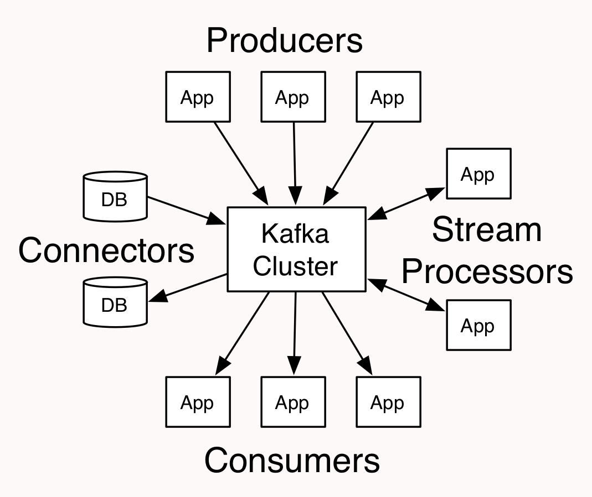
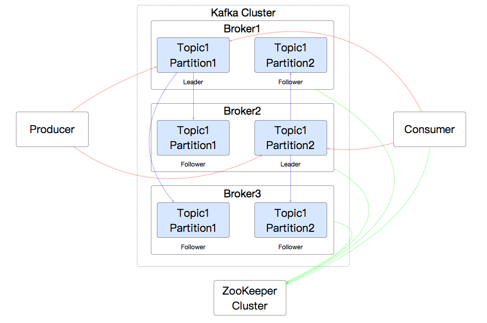
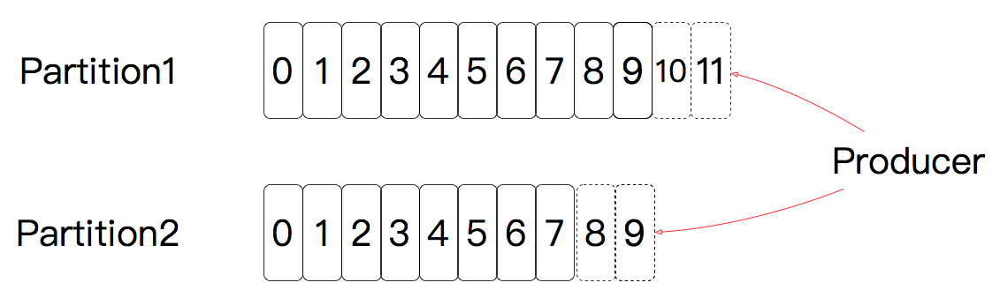
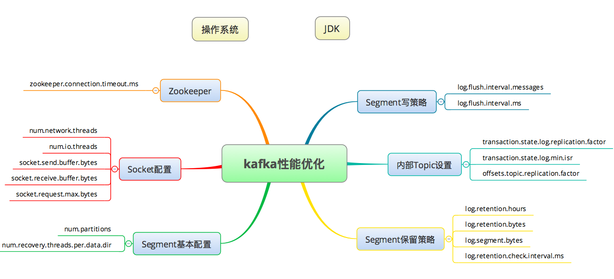
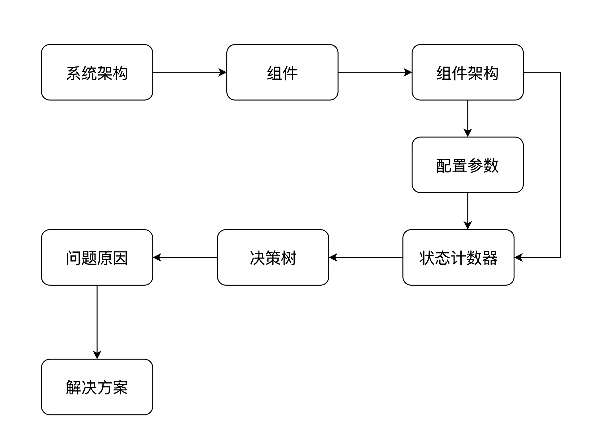
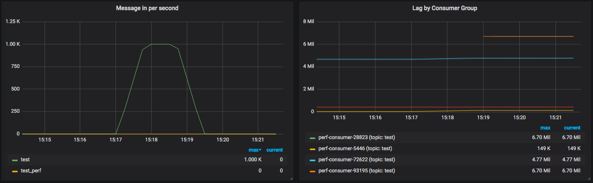
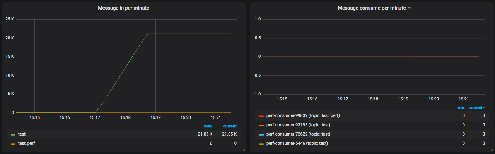
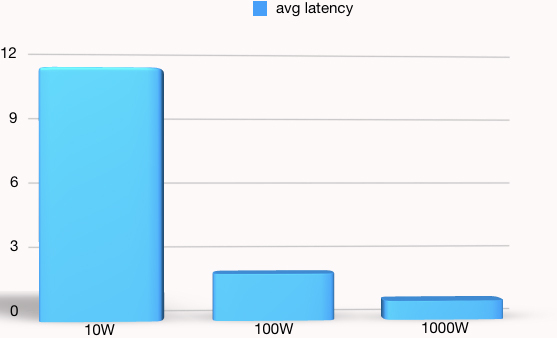

# 24丨Kafka：性能监控工具之队列级监控及常用计数器解析
在我看来队列服务器是最简单的一种组件了。因为队列给我们下手的机会实在是并不多。我们只是用它，如果想改变它就只能去改代码，其他的都只是配置问题。

在当前的市场中，Kafka算是用得非常火的一个队列服务器了，所以今天，我选择它来做一些解读。

虽然我在前面一直在强调分析的思路，但在这一篇中，我打算换个思路，不是像以前那样，直接给你一个结论型的思维导图，而是一起来分析一个组件，让我们看看从哪里下手，来观察一个被分析对象的相关配置。

## 了解Kafka的基本知识

我们先看一下这张图，以便更好地了解一个队列服务器。



这是Kafka官网上的一个图。从这个图中可以看到，对Kafka来说，这就像一个典型的集线器。那它里面的结构是什么样子的呢？根据我的理解，我画了一个如下的示意图：



在这个图中，有三个Broker，也就是三个集群节点。每个消息有一个leader partition，还有两个follower partition。我没有画更多的Producer和Consumer、Consumer Group，是觉得线太多了容易乱。

因为Producer和Consumer肯定会从leader partition中读写数据，而Kafka也保证了leader在不同broker上的均衡，所以Kafka的集群能力很好。

我们再看一下消息是如何在Kafka中被存储的。



上图是Kafka数据的存储方式，也就是每个分区都是一直往后面加的。

我们再来看一下它的数据存储方式。

首先是目录：

```
drwxr-xr-x 2 root root 4096 Feb  7 23:39 test-0
drwxr-xr-x 2 root root 4096 Feb  7 01:34 test_perf-1
drwxr-xr-x 2 root root 4096 Feb  7 01:34 test_perf-4

```

Kafka的目录是根据topic创建的，每个目录名中也包括一个partition。比如上面名字中的test\_perf-1就是topic名是test\_perf，partition就是1。

接着再来看下文件：

```
[root@node-2 test-2]# ll
total 10850656
-rw-r--r-- 1 root root     493128 Feb  9 14:14 00000000000000000000.index
-rw-r--r-- 1 root root 1073739646 Feb  9 14:14 00000000000000000000.log
-rw-r--r-- 1 root root     630504 Feb  9 14:14 00000000000000000000.timeindex
-rw-r--r-- 1 root root     443520 Feb  9 14:16 00000000000000240212.index
-rw-r--r-- 1 root root 1073727327 Feb  9 14:16 00000000000000240212.log
-rw-r--r-- 1 root root     551052 Feb  9 14:16 00000000000000240212.timeindex
-rw-r--r-- 1 root root     448840 Feb  9 14:18 00000000000000453584.index
-rw-r--r-- 1 root root 1073729759 Feb  9 14:18 00000000000000453584.log
-rw-r--r-- 1 root root     556920 Feb  9 14:18 00000000000000453584.timeindex
.........................
-rw-r--r-- 1 root root         12 Feb  9 13:14 leader-epoch-checkpoint
[root@node-2 test-2]#

```

有索引文件，有数据文件，也有时间索引文件，非常明显的三个后缀名。索引文件显然就是指向message在数据文件中的什么位置，而这些数据文件就是一个个的Segment，也就是一段一段的。这些文件的大小受server.properties文件中的log.segment.bytes参数限制，默认为1G。

要查到相应的message就要先查索引文件，找到message的位置；然后从log文件中找到具体的message。

在这个逻辑中，Segment的大小就很有讲究了，太细就会导致索引文件过大，查找索引费时间；太粗了就会导致查找得不够精准。那么该如何配置呢？也要通过性能测试才能知道。

有了这些信息之后，我们再看下Kafka高效的原因：

1. Kafka直接使用Linux文件系统的Cache来高效缓存数据。
2. Kafka采用Linux Zero-Copy技术提高发送性能（不懂Linux Zero-copy的请自行补课）。
3. Kafka服务端采用的是selector多线程模式（从逻辑上理解，它和Tomcat的NIO类似，我就不单独画图了，以免占篇幅）。
4. Kafka采用二分法找数据。

总体来说，就是一个Java的应用，直接使用文件系统和操作系统的特性实现了队列的高效应用场景。

## 配置文件

我们先来查看一下Kafka的配置文件中都有什么，为了简洁，在这里，我把一些注释以及和性能无关的配置删除了。当然如果你有兴趣的话，可以到Kafka的config目录中找到server.properties中，以查看这些内容。

```
############################# Socket Server Settings #############################
num.network.threads=3
num.io.threads=8
socket.send.buffer.bytes=102400
socket.receive.buffer.bytes=102400
socket.request.max.bytes=104857600

############################# Log Basics #############################
num.partitions=10
num.recovery.threads.per.data.dir=1

############################# Internal Topic Settings  #############################
offsets.topic.replication.factor=1
transaction.state.log.replication.factor=1
transaction.state.log.min.isr=1

############################# Log Flush Policy #############################
log.flush.interval.messages=10000
log.flush.interval.ms=1000

############################# Log Retention Policy #############################
log.retention.check.interval.ms=300000

############################# Zookeeper #############################
zookeeper.connection.timeout.ms=6000

############################# Group Coordinator Settings #############################
group.initial.rebalance.delay

```

其实配置文件并不多，对不对？从配置名称上也很容易知道它们和什么相关。这里比较重要的参数就是Socket Server相关的，以及和log相关的。

我觉得到了这里，这个逻辑就基本清楚了，对Kafka的性能优化也就有了大体的判断。

## 构建Kafka的性能优化思维导图

我们可以根据以上的知识画出如下所示的，Kafka的基本优化点：



同样的，我把操作系统和JDK方面的优化当成独立的部分，在上图中只把Kafka相关的内容列出来。

有了上面的知识，也有了这个思维逻辑，那么就可以理出针对一个Kafka应用要干的事情：

1. 先分析一下具体的应用场景，关键是topic、partition数量、message大小。
2. 确定要支撑的业务容量和时间长度。
3. 分析架构中需要的broker量级、partition、Segment等配置。这些配置应该是架构师给出的准确预估，如果不能给出，那只能靠我们，也就是做性能测试的人给出具体的结论了。

## 对组件的性能分析思路

我想告诉你的是对一个组件的性能分析思路。如果你有了下面这张图所示的思路，那至少可以覆盖大部分的性能问题了。这个思路就是：



对于Kafka这样的队列服务器来说，状态计数器是啥子呢？让我们看一下Kafka的一个Grafana Dashboard。






从这几个图就能看得出来，最重要的是每秒产生了多少message，以及消费时间间隔。这两个对我们来说是最重要的队列计数器了。

但是它们能不能告诉我们现在的队列服务器有没有瓶颈呢？显然是不能的。

对于队列来说，消息都是异步被消费者取走的。所以队列中要有保存消息的能力，但是保存多久呢？永远保存吗？显然不现实。但是如果保存得太短了，正常的业务都可能做不下去，所以，我们要制定策略，哪些topic是实时处理的，处理不完怎么办？内存多大，能保存多少消息，积压了怎么办？

所以对于队列服务器，只看上面的那几个计数器，我觉得过于片面。

我们前面提到的grafana+prometheus监控操作系统、MySQL的DashBoard都有非常完整的数据，但是Kafka的DashBoard显然信息不够，不能判断它自己有没有问题。

操作系统的监控指标对Kafka来说，也是异常的重要。就像之前我说过的那样，操作系统是不可绕过的分析节点。所以所有要做性能测试和性能分析的人，首先要学的就是操作系统方面的知识。

## 示例

下面我们来看一个简单测试示例。

### 生产10W消息

在这个示例中，共生产10W的消息，每个消息大小是2000字节，每秒产生5000个消息。

```
[root@node-1 Kafka_2.13-2.4.0]# /home/zee/Kafka/Kafka_2.13-2.4.0/bin/Kafka-producer-perf-test.sh --topic test --num-records 100000 --record-size 2000 --throughput 5000 --producer-props bootstrap.servers=172.18.0.2:9092,172.19.0.14:9092,172.20.0.7:9092
24997 records sent, 4999.4 records/sec (9.54 MB/sec), 15.8 ms avg latency, 398.0 ms max latency.
25010 records sent, 5001.0 records/sec (9.54 MB/sec), 26.0 ms avg latency, 514.0 ms max latency.
25000 records sent, 5000.0 records/sec (9.54 MB/sec), 1.1 ms avg latency, 24.0 ms max latency.
100000 records sent, 4998.000800 records/sec (9.53 MB/sec), 11.03 ms avg latency, 514.00 ms max latency, 1 ms 50th, 52 ms 95th, 305 ms 99th, 501 ms 99.9th.

```

可以看到每秒有9.53MB的消息产生，平均响应时延是11.03ms，最大时延是514ms。

### 生产100W消息

在这个示例中，共生产100W的消息，每个消息大小是2000字节，每秒产生5000个消息。

```
[root@node-4 bin]# /home/zee/Kafka/Kafka_2.13-2.4.0/bin/Kafka-producer-perf-test.sh --topic test_perf --num-records 1000000 --record-size 2000 --throughput 5000 --producer-props bootstrap.servers=172.17.0.11:9092,172.19.0.14:9092,172.20.0.7:9092
24992 records sent, 4996.4 records/sec (9.53 MB/sec), 21.7 ms avg latency, 482.0 ms max latency.
25025 records sent, 5004.0 records/sec (9.54 MB/sec), 0.9 ms avg latency, 16.0 ms max latency.
........
25000 records sent, 5000.0 records/sec (9.54 MB/sec), 0.6 ms avg latency, 9.0 ms max latency.
25005 records sent, 5001.0 records/sec (9.54 MB/sec), 0.7 ms avg latency, 30.0 ms max latency.
1000000 records sent, 4999.625028 records/sec (9.54 MB/sec), 2.05 ms avg latency, 482.00 ms max latency, 1 ms 50th, 1 ms 95th, 16 ms 99th, 267 ms 99.9th.

```

可以看到每秒有9.54MB的消息产生，平均响应时延是2.05ms，最大时延是482ms。

### 生产1000W消息

在这个示例中，生产1000W消息，其他参数不变：

```
[root@node-4 bin]# /home/zee/Kafka/Kafka_2.13-2.4.0/bin/Kafka-producer-perf-test.sh --topic test_perf --num-records 10000000 --record-size 2000 --throughput 5000 --producer-props bootstrap.servers=172.17.0.11:9092,172.19.0.14:9092,172.20.0.7:9092
24992 records sent, 4998.4 records/sec (9.53 MB/sec), 22.7 ms avg latency, 480.0 ms max latency.
25015 records sent, 5002.0 records/sec (9.54 MB/sec), 0.8 ms avg latency, 13.0 ms max latency.
25005 records sent, 5000.0 records/sec (9.54 MB/sec), 0.7 ms avg latency, 21.0 ms max latency.
..........
25000 records sent, 5000.0 records/sec (9.54 MB/sec), 0.7 ms avg latency, 26.0 ms max latency.
25010 records sent, 5001.0 records/sec (9.54 MB/sec), 0.7 ms avg latency, 24.0 ms max latency.
10000000 records sent, 4999.900002 records/sec (9.54 MB/sec), 0.83 ms avg latency, 532.00 ms max latency, 1 ms 50th, 1 ms 95th, 4 ms 99th, 65 ms 99.9th.

```

从结果可以看到，每秒还是9.54MB大小的消息，平均时延0.83ms，最大时延是532ms。

来做一个图比对一下：



从这个图就明显看出生产的消息越少，平均响应时间越长。可见顺序写得越多，那每次写的平均时间就会越小，所以Kafka在大数据量的读写中会表现得非常好。

## 总结

严格来说，这一篇文章是为了告诉你一个逻辑，那就是对一个组件不了解的时候，如何用你的基础技术知识把对组件的性能优化方向整理出来，以及如何通过自己的基础知识来做一个非常合理的分析。

这个逻辑就是：

1. 先了解这个组件的基本知识：包括架构、实现原理等信息。
2. 再整理出这个组件的配置参数。
3. 找到合适的全局监控工具。
4. 做压力测试时给出明显的判断。

这是个大体的逻辑，当然这个逻辑还有一个前提，那就是你得有相应的基础知识，在Kafka的这个分析中，要有操作系统和Java的基础知识，在实操中还需要多找几个不懂的组件做些练习才能理解这个逻辑的真谛。

就我自己来说，我会找一个完全没有接触过的组件，从安装部署开始直到性能测试、瓶颈判断、优化分析，看看需要多长时间，我才能理解得了这个组件。

这种思维方式，给了我很多的安全感，就是遇到了没接触过的内容，也不至心慌气短。

## 思考题

最后给你留两道思考题吧，你觉得如何分析一个未知组件呢？Kafka的分析逻辑又是什么？

欢迎你用自己的理解思考一下这两个问题，也欢迎把这篇文章分享给你的朋友或者同事，一起交流一下。