# 25丨SkyWalking：性能监控工具之链路级监控及常用计数器解析
在微服务横行的年代，没有链路级监控简直就是灾难。技术在不断的发展过程中，总是会有新的工具被推出来，它们存在的价值就是解决问题。链路监控工具存在的价值就是尽快找到微服务中哪一个环节是最慢的。

## 我们对微服务的态度究竟是怎样的？

但是在讲链路级监控之前，我需要再说一下我们对微服务的态度。

我们认为微服务性能好，具有良好的扩展性，于是很多企业会把自己的架构改为微服务，但是呢，在不需要使用新技术的系统中，盲目地迷信和使用市场上被推崇的新技术，只会带来问题。

在前面我举过一个例子，我见过一个物流项目，开发团队认为拆分服务是可以让性能提高的一个重要技术思路，于是他们不断地细分项目。在不到百万级的车辆体量的项目阶段中，一个物流系统已经被拆分成了三四十个子项目，最后开发团队和运维团队都不堪重负，因为维护的成本变高了。于是，开发团队开始反省，认为应该合并一些子项目，最后就形成了中台项目。

这不是玩笑，而是一个真实的案例。

至于项目能不能拆分成多个微服务，你需要对整个项目的容量、硬件的体量进行评估。如果评估完觉得不需要，那么尽量不要干这种为了炫耀技术，而害人害已害公司的事情。如果确实有需要，那没什么说的，该拆就拆。

但是在拆的过程也一定要知道，对于多个微服务来说，相关的支持手段（比如说服务健康状态、链路跟踪、日志收集分析系统等）一定要跟上，如果跟不上，那就是灾难了。

## 链路级监控对微服务的重要作用

在微服务架构的系统中，没有好的链路监控工具，对性能分析来说就是灾难，因为体力活实在是太多了。这就是链路级监控在微服务中存在的价值了。

特别是现在Kubernetes+Docker的基础架构也在不断地被应用。微服务往里面一放，有问题想查都不知道从哪下手。因为容器出现问题被重启之后，可能你都不知道问题在哪个node上，只能通过Kubernetes先查在哪个node上，再查相应的日志等信息，这样就增加了很多工作量。

说回我们的链路监控，在一个合理的微服务架构中，一开始的架构规划就应该包括 **链路监控**。可以用开源的，可以用商业的，也可以自己编写度量器做埋点。总之不管怎么实现，只要实现了就好。

常见的链路监控工具，我们都称之为APM（Application Performance Management或者 Application Performance Monitoring），而这些APM工具都是参考2010年Google的一个论文来做的。这篇有名的论文就叫Dapper, a Large-Scale Distributed Systems Tracing Infrastructure，点击 [原文链接](https://static.googleusercontent.com/media/research.google.com/zh-CN//archive/papers/dapper-2010-1.pdf) 就能看到。在 [Github](http://bigbully.github.io/Dapper-translation/) 上有人翻译成中文，有兴趣的话，你可以去看看。

在商业市场当然有很多APM工具可以使用了。在这里，我就不给它们打广告了。重点推荐几个开源的好用的工具，它们分别是Pinpoint、SkyWalking、Zipkin、CAT。

我们简单比对一下：

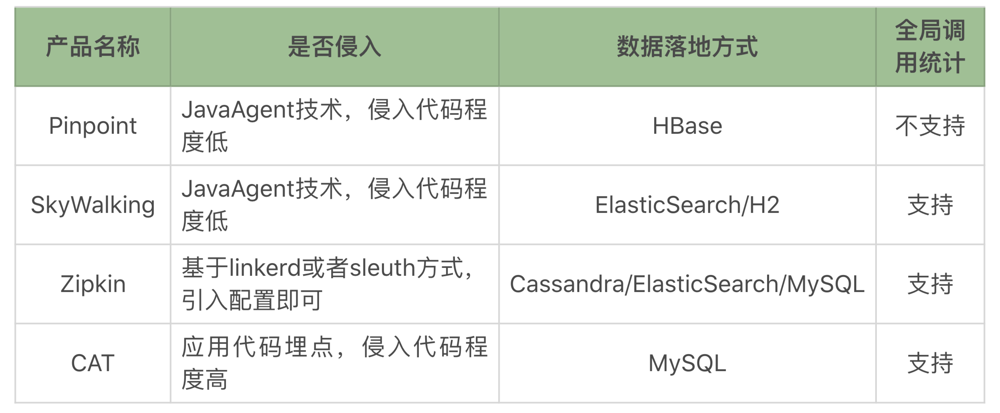

每个产品都有自己的特点，产品之间也有细微的差别。网络上也有人对这几个工具做过测试比对，得到的结论是每个产品对性能的影响都在10%以下，其中SkyWalking对性能的影响最小。

在今天的内容里，我之所以用SkyWalking说明链路监控，原因只有一个：中国开发者贡献的，必须得支持！

## SkyWalking的链路关系

为了说明链路的调用逻辑，我这里准备了几个非常简单的Spring Cloud应用。在这个示例中，我有四个服务。这四个服务会有相互的调用关系。如下所示：

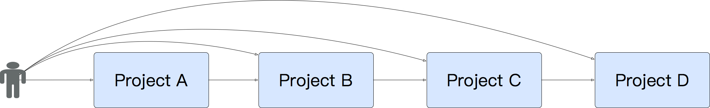

其中用户可以直接访问Project A、B、C、D中的任何一个服务。同时这些服务器都会注册到Eureka中去，它们也会分别连Redis、RabbitMQ、MySQL等服务。

我们来看看SkyWalking是怎么体现链路关系的。

### 启动微服务Project A

首先我们启动Project A。为了让你能清晰地看到配置，我直接把Agent放到执行的命令行中。如下所示：

```
nohup java -javaagent:/data/pa/agent/skywalking-agent.jar -jar -Xms128m -Xmx128m /data/pb/target/pa.jar --spring.profiles.active=prod &

```

接着我们访问Project A，通过Postman来访问这个示例提供的接口：

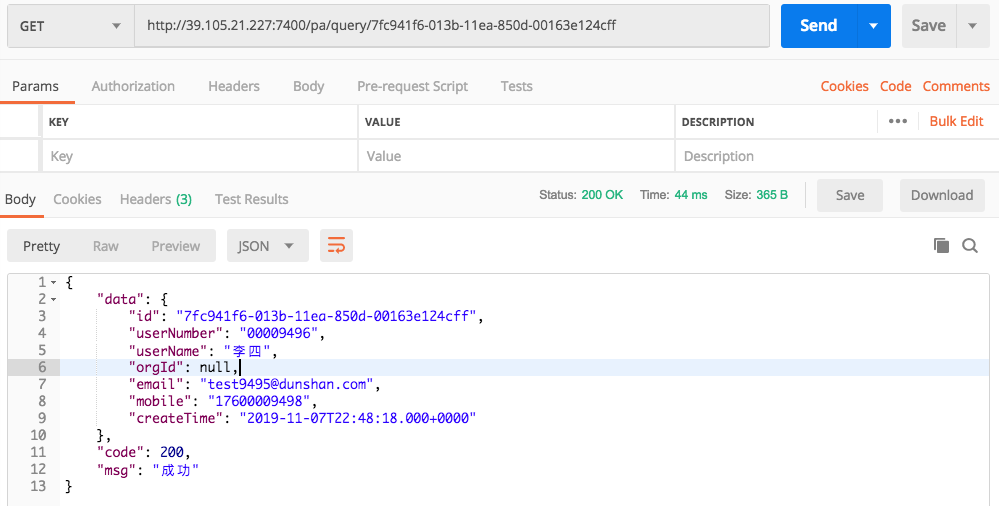

然后我们再来查看SkyWalking首页：

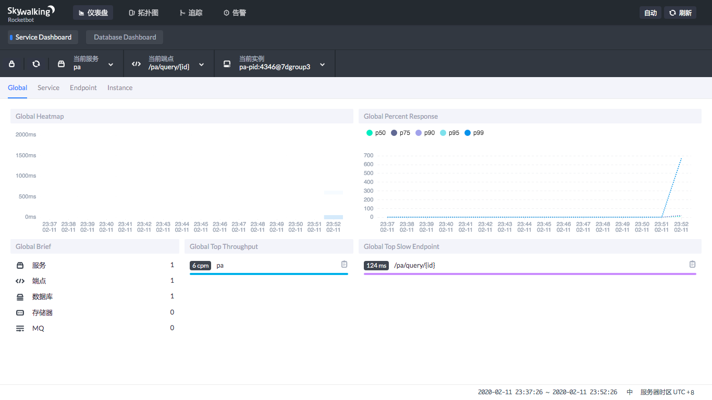

最后我们查看拓扑图：

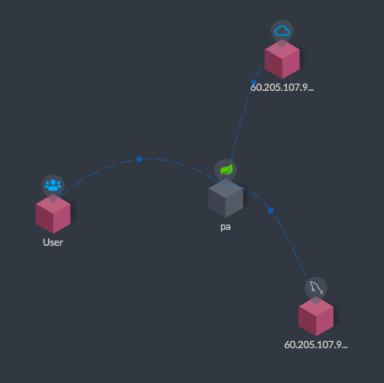

从上面这张拓扑图中可以看到，当我访问了pa之后，这个pa链接了另外两个系统，一个是Eureka，另一个是MySQL。

加了Agent之后，至少我们可以看到这个服务现在在访问谁了。但是因为只有一个服务，所以还看不出来链路在哪里，现在我们启动Project B。

### 启动微服务Project B

首先启动Project B：

```
nohup java -javaagent:/data/pb/agent/skywalking-agent.jar -jar -Xms128m -Xmx128m /data/pb/target/pb.jar --spring.profiles.active=prod &

```

接着查看SkyWalking的拓扑图：

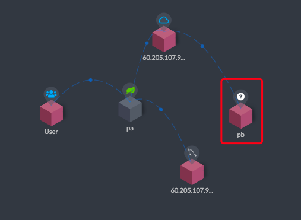

你可以看到pb（即Project B）服务上有一个有一个问号，因为它还没有被人访问过。不过已经连上了Eureka，所以和Eureka之间有条线。

然后我们使用Postman访问Project B：

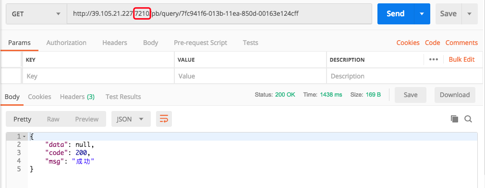

请注意，这里我直接访问了Project B，并没有通过Project A访问。

然后我们再来查看一下拓扑图：

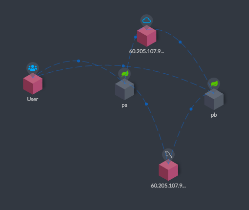

现在可以看到上图中User和pb（即Project B）之间有连线了吧。

这还只是单独的访问逻辑。

### 通过Project A访问Project B

首先我们使用Postman访问pab接口：

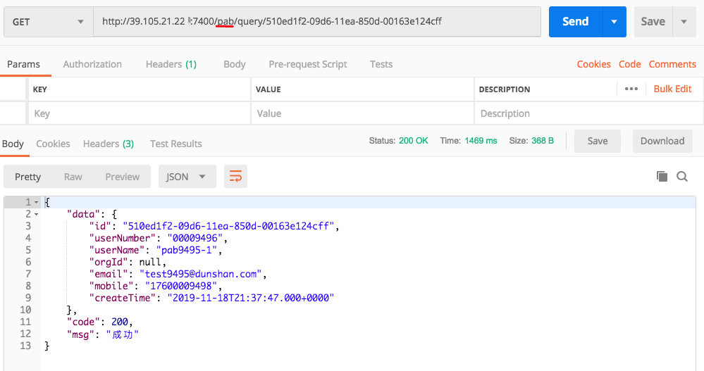

注意，这里我通过Project A访问了Project B。

我们再来看拓扑图：

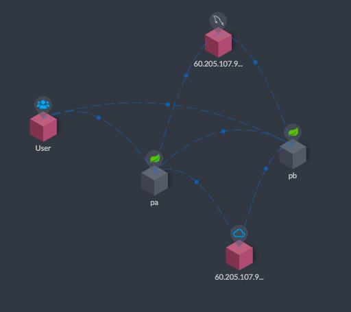

看到了吧，pa（即Project A）和pb（即Project B）之间有连接线了。这就是SkyWalking的trace功能了。

下面我将Project C、Project D都启动，也都串行访问一下，即pa-pb-pc-pd。

我们通过拓扑图看下时间消耗，启动其他微服务并查看各服务响应时间。

首先，pa-pb-pc-pd串行访问：

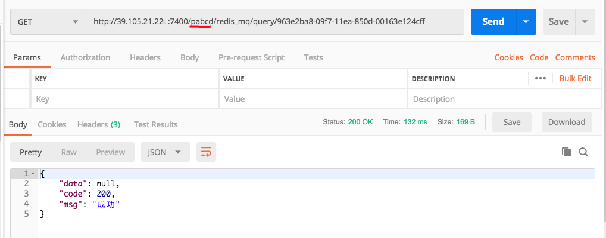

然后我们查看一下链路拓扑图：

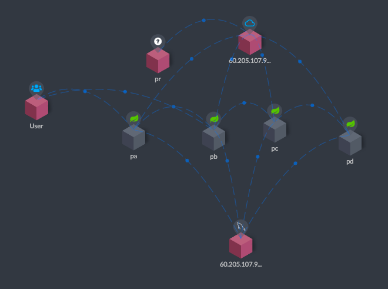

这样，我们就看到了pa-pb-pc-pd的一条完整的链路。因为我们在前面直接访问了pb，所以可以看到user到pb之间也有连线。

当然SkyWaling的功能不止是拓扑图。我们来看一个拓扑图的全部界面。

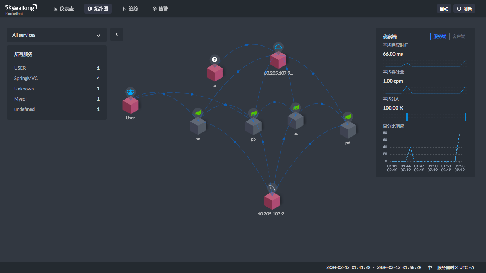

从上图就可以看到，当你点击两个服务之间连线上的那个蓝色点的时候，在右边会显示一个状态曲线。在这个状态曲线中，我们可以看到这两个服务之间的平均吞吐量（cpm）和平均响应时间（ms）。这样，我们就知道在这个链路上哪里消耗了时间。

现在，让我们来点一下看看。

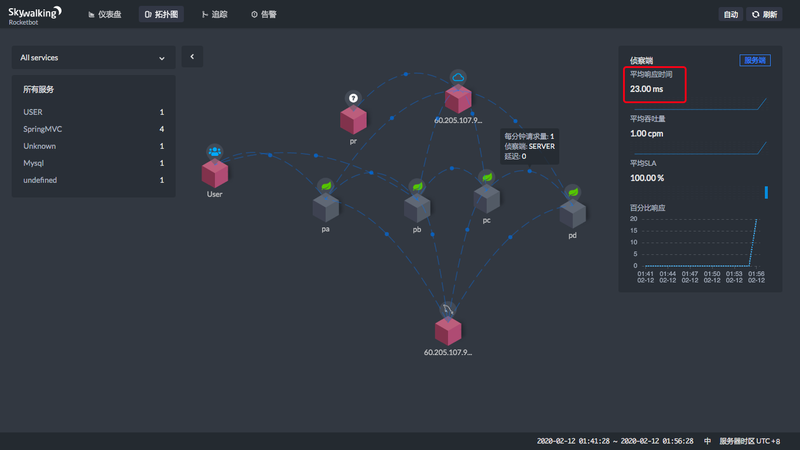

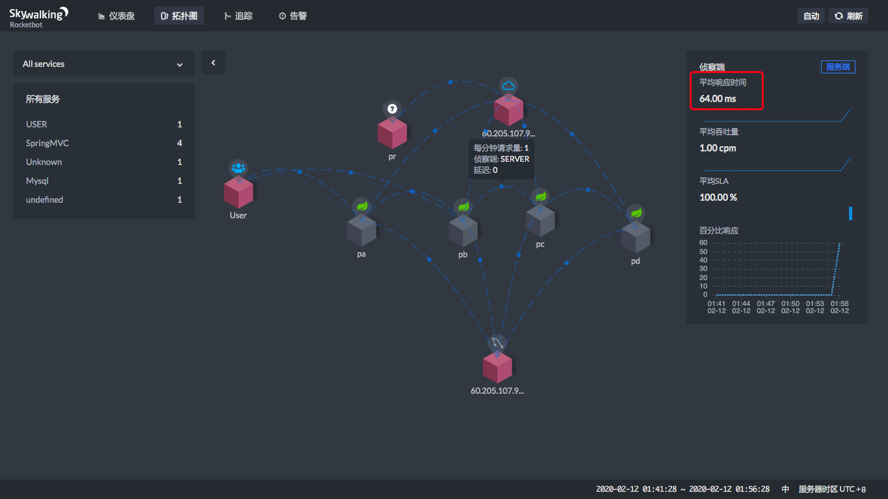

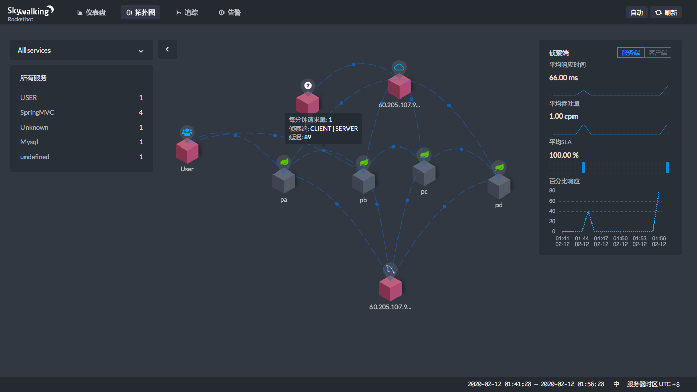

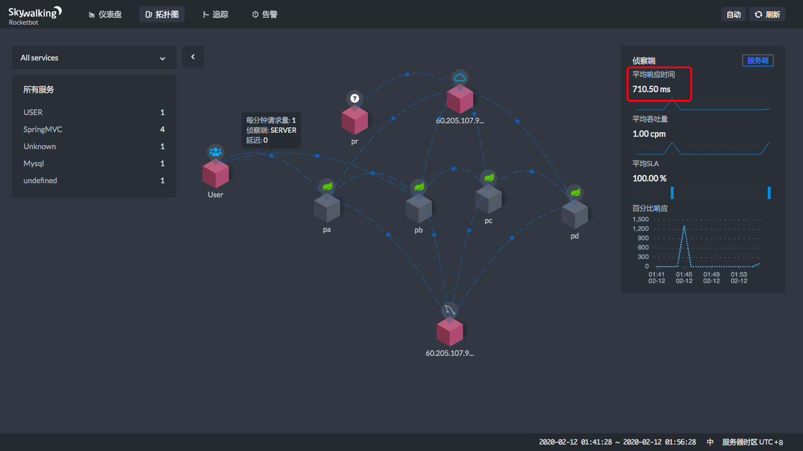

通过这四个图，就能看到在每一个服务节点上，响应时间消耗了多少。

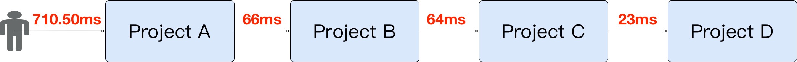

通过上面的时间，显然也可以算出每个服务自己消耗了多少时间。用前面的时间减去后面的时间，就可以算出来，很简单吧。

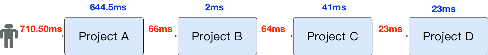

上面的User是通过公网访问的，所以这里的时间也包括了网络的时间，不是说ProjectA上就会消耗600多ms。

## 追踪请求

从上面的图中，我们可以看到服务之间的整体性能表现，但是一个具体的请求节点是哪些，并体现不出来。SkyWalking提供了追踪功能，可以看到一个请求被拆分成了哪些子请求。如下所示：

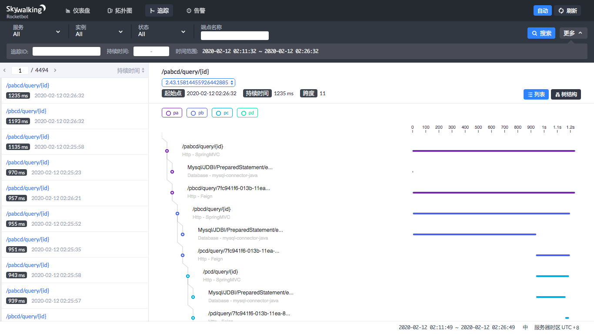

通过追踪页面，我们可以看到请求都已经按照响应时间的高低排好序了，点击就可以看到这个请求的拆分以及拆分的每个子请求所消耗的时间。

此外它还提供了树结构。

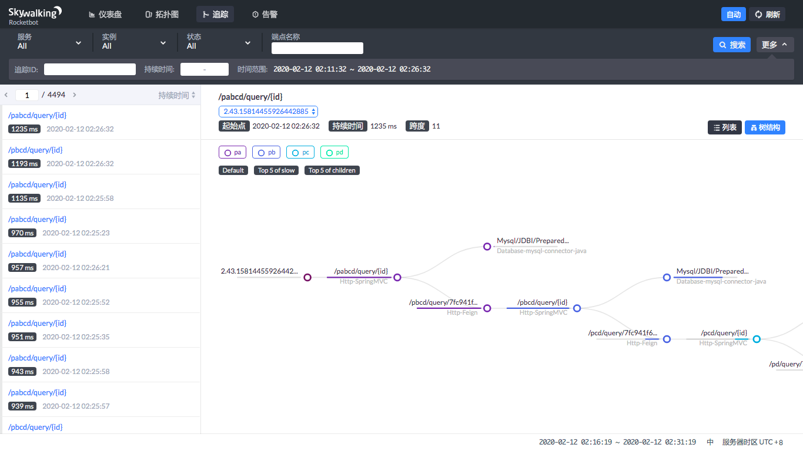

这样一来，调用过程清晰明了。

下面我们就压起来，通过SkyWalking来判断下性能瓶颈，以确定它在性能测试和分析中的作用。

这个场景是用JMeter来压pabcd接口，以此查看SkyWalking可以给我们一个什么样的结果。

JMeter结果如下：

```
[root@7dgroup2 script]# /home/gaolou/apache-jmeter-5.1.1/bin/jmeter -n -t pabcddemo.jmx
Creating summariser <summary>
Created the tree successfully using pabcddemo.jmx
Starting the test @ Wed Feb 12 02:21:47 CST 2020 (1581445307090)
Waiting for possible Shutdown/StopTestNow/HeapDump/ThreadDump message on port 4445
summary +    165 in 00:00:12 =   13.8/s Avg:    69 Min:    36 Max:   153 Err:     0 (0.00%) Active: 1 Started: 1 Finished: 0
summary +    687 in 00:00:30 =   22.9/s Avg:    59 Min:    26 Max:   206 Err:     0 (0.00%) Active: 2 Started: 2 Finished: 0
summary =    852 in 00:00:42 =   20.3/s Avg:    61 Min:    26 Max:   206 Err:     0 (0.00%)
summary +   1182 in 00:00:30 =   39.4/s Avg:    60 Min:    24 Max:   240 Err:     0 (0.00%) Active: 3 Started: 3 Finished: 0
summary =   2034 in 00:01:12 =   28.3/s Avg:    60 Min:    24 Max:   240 Err:     0 (0.00%)
summary +   1717 in 00:00:30 =   57.3/s Avg:    58 Min:    18 Max:   238 Err:     0 (0.00%) Active: 4 Started: 4 Finished: 0
summary =   3751 in 00:01:42 =   36.8/s Avg:    59 Min:    18 Max:   240 Err:     0 (0.00%)
summary +   2148 in 00:00:30 =   71.7/s Avg:    60 Min:    13 Max:   509 Err:     0 (0.00%) Active: 5 Started: 5 Finished: 0
summary =   5899 in 00:02:12 =   44.7/s Avg:    60 Min:    13 Max:   509 Err:     0 (0.00%)
summary +   2105 in 00:00:30 =   70.1/s Avg:    76 Min:    16 Max:   507 Err:     0 (0.00%) Active: 6 Started: 6 Finished: 0
summary =   8004 in 00:02:42 =   49.4/s Avg:    64 Min:    13 Max:   509 Err:     0 (0.00%)
summary +   2090 in 00:00:30 =   69.6/s Avg:    91 Min:    15 Max:   507 Err:     0 (0.00%) Active: 7 Started: 7 Finished: 0
summary =  10094 in 00:03:12 =   52.6/s Avg:    70 Min:    13 Max:   509 Err:     0 (0.00%)
summary +   2093 in 00:00:30 =   69.8/s Avg:   105 Min:    17 Max:   987 Err:     0 (0.00%) Active: 8 Started: 8 Finished: 0
summary =  12187 in 00:03:42 =   54.9/s Avg:    76 Min:    13 Max:   987 Err:     0 (0.00%)
summary +   2080 in 00:00:30 =   69.4/s Avg:   120 Min:    10 Max:  1135 Err:     0 (0.00%) Active: 9 Started: 9 Finished: 0
summary =  14267 in 00:04:12 =   56.6/s Avg:    82 Min:    10 Max:  1135 Err:     0 (0.00%)
summary +   2074 in 00:00:30 =   69.1/s Avg:   136 Min:    11 Max:   961 Err:     0 (0.00%) Active: 10 Started: 10 Finished: 0
summary =  16341 in 00:04:42 =   58.0/s Avg:    89 Min:    10 Max:  1135 Err:     0 (0.00%)
summary +   2057 in 00:00:30 =   68.6/s Avg:   144 Min:     9 Max:  1237 Err:     0 (0.00%) Active: 10 Started: 10 Finished: 0
summary =  18398 in 00:05:12 =   59.0/s Avg:    95 Min:     9 Max:  1237 Err:     0 (0.00%)
summary +   2063 in 00:00:30 =   68.7/s Avg:   145 Min:     9 Max:  1123 Err:     0 (0.00%) Active: 10 Started: 10 Finished: 0
summary =  20461 in 00:05:42 =   59.8/s Avg:   100 Min:     9 Max:  1237 Err:     0 (0.00%)
summary +   2058 in 00:00:30 =   68.6/s Avg:   145 Min:     8 Max:  1113 Err:     0 (0.00%) Active: 10 Started: 10 Finished: 0
summary =  22519 in 00:06:12 =   60.5/s Avg:   104 Min:     8 Max:  1237 Err:     0 (0.00%)
..................

```

为了不占篇幅，这里我把后面的部分截掉了，因为后面的10个线程的数据和上面的10个线程的数据差不多。

从JMeter的结果中可以看到，当线程增加的时候，确实响应时间也在不断增加。下面我们来看一下SkyWalking中的健康状态。

### Service Dashboard：

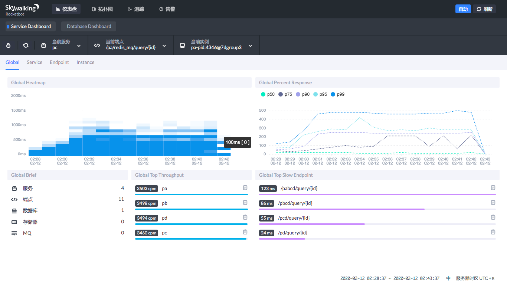

在Service DashBoard中，你可以看到热力图，也就是在哪个时间段微服务比较繁忙，也可以看到微服务吞吐量的排序和慢端点的排序。

通过这个图，我们可以很快定位到哪个服务的哪个接口慢。图中直接就给出来了。

在Service DashBoard中，你还可以选择当前服务、当前端点和当前实例。

它们之间的关系是什么呢？实例就是一个具体的进程，服务是微服务的名字，至于端点，那就是接口了。你可以在多个主机上执行同样的微服务，那么每个主机上启动的就是具体的实例，有着共同的功能。

### Database Dashboard

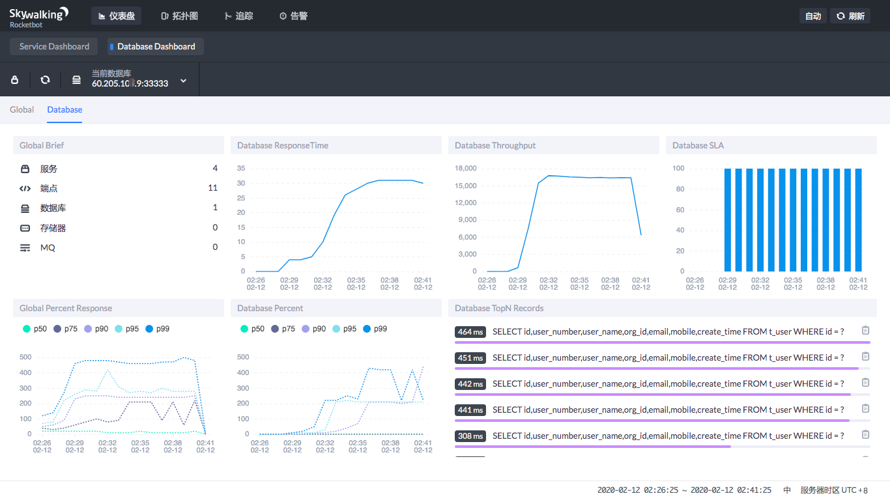

在Database Dashboard中，你可以看到数据库的处理能力——数据库的吞吐能力、SQL的执行时间百分比，以及哪些SQL慢。

通过这个图，我们可以直接判断出，现在数据库服务在压力下的处理能力。比如说我的这个示例：明显的就是压力上来了之后，数据库的SQL执行时间变长了。

在左下角的图中可以看到，90%的SQL在250ms左右，99%的SQL在压力下处于500ms以下。

这就是明显要调优的SQL，因为一个select，还是精确查找，怎么可能这么慢。

在右下角可以直接看到哪个SQL慢，这就可以用到前面文章中提到的数据库剖析功能了。

## 总结

对微服务来说，链路监控工具是标配。在性能分析中，需要查看微服务的性能状态时必须用到链路监控工具。

我们用APM工具要实现的就是以下四点：

1. 查看微服务节点的健康状态。
2. 判断响应时间的消耗点。
3. 通过我们前文中提到的 **定向监控手段** 进行详细地问题定位，细化到组件的配置、代码行和SQL层级。
4. 最后根据定位的根本原因，提出具体的性能瓶颈解决方案。

从上面的步骤就可以看出，从性能瓶颈的判断逻辑上，APM工具给我们提供了很多便利。但是，APM工具也不能告诉你性能瓶颈的根本原因，因此还是需要定向分析来做细化。这也是我一直推崇的，创建性能瓶颈分析决策树，要有完整的逻辑思路的原因。

## 一个小声明

后续的一篇文章原计划是《性能分析之CPU分析：从CPU调用高到具体代码行》。可是想来想去，这里面的内容在整个专栏中的多篇文章中均有涉及，你可以参考《 [CentOS：操作系统级监控及常用计数器解析](https://time.geekbang.org/column/article/191503)》《 [Java & C++：代码级监控及常用计数器解析](https://time.geekbang.org/column/article/193551)》这两篇文章。

至于分析决策树，我在《 [倾囊相授：我毕生所学的性能分析思路都在这里了](https://time.geekbang.org/column/article/182912)》中也都已经提到。

基于此，我认为没必要单独再写一篇文章凑篇幅，所以后面将跳过这一篇，请知悉。

## 思考题

了解了今天的内容后，你可以说一下APM工具可以为我们提供哪些分析便利吗？SkyWalking有哪些具体的功能点可以帮助我们进行性能分析呢？

欢迎你在评论区写下你的思考，也欢迎把这篇文章分享给你的朋友或者同事，一起交流一下。