# 26丨案例：手把手带你理解TPS趋势分析
在性能分析中，前端的性能工具，我们只需要关注几条曲线就够了：TPS、响应时间和错误率。这是我经常强调的。

但是关注TPS到底应该关注什么内容，如何判断趋势，判断了趋势之后，又该如何做出调整，调整之后如何定位原因，这才是我们关注TPS的一系列动作。

今天，我们就通过一个实际的案例来解析什么叫TPS的趋势分析。

## 案例描述

这是一个案例，用一个2C4G的Docker容器做服务器。结构简单至极，如下所示：

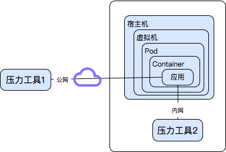

当用个人电脑（上图中压力工具1）测试云端服务器时，达到200多TPS。但是当用云端同网段压力机（上图中压力工具2）测试时，TPS只有30多，并且内网压力机资源比本地压力机要高出很多，服务器资源也没有用完。

在这样的问题面前，我通常都会有一堆的问题要问。

- 现象是什么？
- 脚本是什么？
- 数据是什么？
- 架构是什么？
- 用了哪些监控工具？
- 看了哪些计数器？

在分析之前，这些问题都是需要收集的信息，而实际上在分析的过程中，我们会发现各种数据的缺失，特别是远程分析的时候，对方总是不知道应该给出什么数据。

我们针对这个案例实际说明一下。

这个案例的现象是TPS低，资源用不上。

下面是一个RPC脚本的主要代码部分。

```
public SampleResult runTest(JavaSamplerContext arg0) {
    // 定义results为SampleResult类
    SampleResult results = new SampleResult();
    // 定义url、主机、端口
    String url = arg0.getParameter("url");
    String host = arg0.getParameter("host");
    int port = Integer.parseInt(arg0.getParameter("port"));
    results.sampleStart();

    try {
        message=detaildata_client.detaildata_test(url);// 访问URL并将结果保存在message中
        System.out.println(message); //打印message，注意这里
        results.setResponseData("返回值："+ message, "utf-8");
        results.setDataType(SampleResult.TEXT);
        results.setSuccessful(true);
    } catch (Throwable e) {
        results.setSuccessful(false);
        e.printStackTrace();
    } finally {
        String temp_results=results.getResponseDataAsString();
        results.setResponseData("请求值："+arg0.getParameter("url")+"\n"+"返回值:"+temp_results, "utf-8");
        results.sampleEnd();
    }

    return results;

```

JMeter脚本关键部分：

```
<stringProp name="ThreadGroup.num_threads">100</stringProp>
//我们来看这里，ramp_time只有1秒，意味着线程是在1秒内启动的，这种场景基本上都和真实的生产场景不相符。
<stringProp name="ThreadGroup.ramp_time">1</stringProp>
<boolProp name="ThreadGroup.scheduler">true</boolProp>
<stringProp name="ThreadGroup.duration">300</stringProp>
...............
<CSVDataSet guiclass="TestBeanGUI" testclass="CSVDataSet" testname="CSV Data File Config" enabled="true">
  <stringProp name="delimiter">,</stringProp>
  <stringProp name="fileEncoding">utf-8</stringProp>
  <stringProp name="filename">filename</stringProp>
  <boolProp name="ignoreFirstLine">false</boolProp>
  <boolProp name="quotedData">false</boolProp>
  <boolProp name="recycle">true</boolProp>
  <stringProp name="shareMode">shareMode.all</stringProp>
  <boolProp name="stopThread">false</boolProp>
  <stringProp name="variableNames">url</stringProp>
</CSVDataSet>

```

在这个脚本中，逻辑非常简单，一个RPC接口：1. 发出请求；2. 返回响应；3. 打印返回信息。

本机跑出来的结果如下：

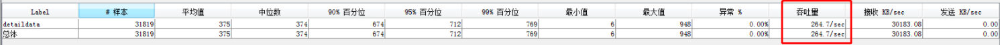

在这个案例中，参数化数据就是根据真实的业务量来计算的，这个可以肯定没有问题。

那么架构呢？在最上面的图中已经有了部署的说明。在逻辑实现上，也就是一个很简单的服务端，内部并没有复杂的逻辑。所用到的监控工具是top、Vmstat。

看了哪些计数器呢？CPU、内存、I/O等。

下面我们开始分析。

## 第一阶段

对公网上的测试来说，基本上压力都会在网络上，因为出入口带宽会成为瓶颈，所以先要看一眼自己的带宽用到了多少，再比对一下出口路由上的带宽。

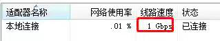

这里1Gbps只用到了0.01%，也就是(1000/8)x0.01%=12.5k（这里是将带宽bit换成byte计算）。

在这样的带宽使用率之下，即使是公网也不见得会有问题，更别说在内网了。可见带宽不是瓶颈点。

既然这样，我们直接在内网里来做分析，看原因是什么。

但是我们要以什么样的场景来跑呢？因为带宽现在看到用得并不多，但TPS也上不去。 **首先应该想到的场景就是把TPS** 曲线给做出梯度来。

为什么要这么做？最重要的就是要知道到底TPS在多少压力线程下会达到最大值，也就是我在各种场合经常强调的一个场景，最大TPS场景。关于这种曲线，我们不需要性能指标应该就可以做得出来。如下图所示：

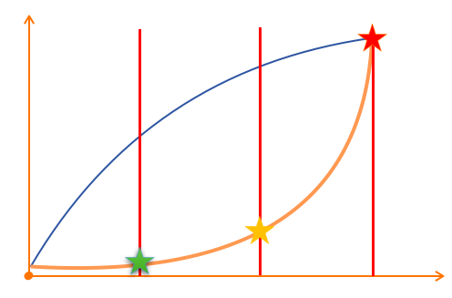

在一个 **既定场景、既定数据、既定环境** 的压力场景中，我们一定要拿到这样趋势的TPS和RT曲线。其中绿色和红色的点都是不需要业务指标来限定的，而是通过压力场景中观察TPS趋势线来确定。

我来解读一下这个趋势图：

1. 响应时间一定是从低到高慢慢增加的；
2. TPS一定也是从低到高慢慢增加的，并且在前面的梯度中，可以和线程数保持正比关联。举例来说，如果1个线程TPS是10，那2个线程的TPS要在20。依次类推。

而在这个例子中，前面有提到100线程1秒加载完，这样的比例完全看不出来梯度在哪，所以，改为100秒加载100个线程，再来看看梯度。

测试结果如下：

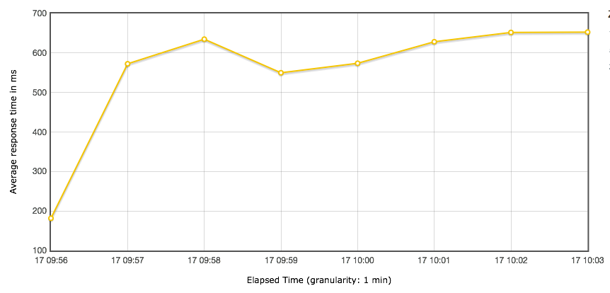

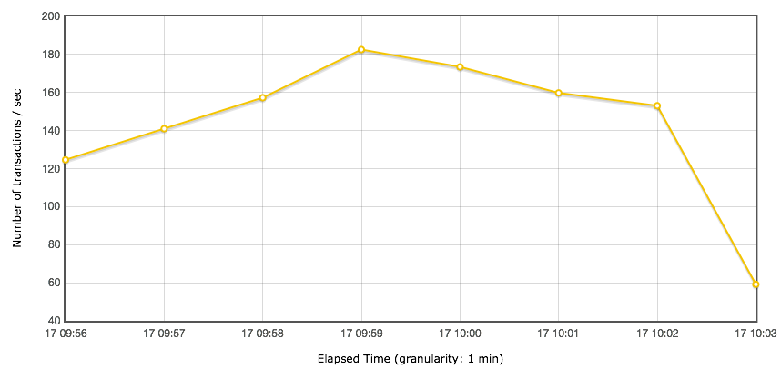

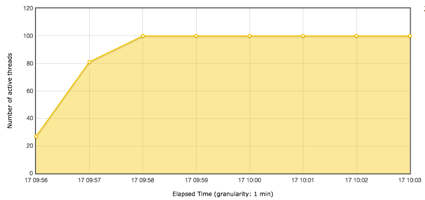

从这个结果可以看出几点：

1.TPS一点梯度没看出来。为什么说没有看出来呢？这里我发一个有明显梯度的TPS曲线出来以备参考（这张图不是本实例中的，只用来做分析比对）：

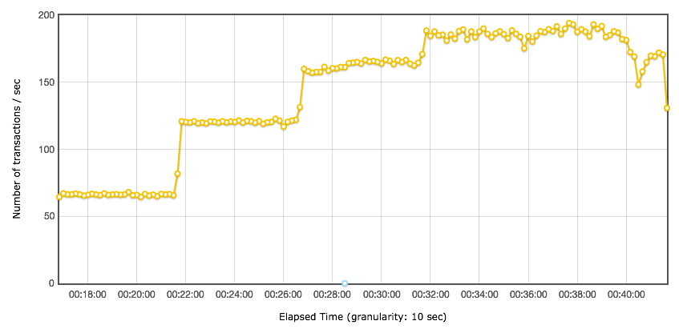

2.响应时间增加的太快了，明显不符合前面我们说的那个判断逻辑。那什么才是我们判断的逻辑呢？这里我发一个有明显梯度的出来以备参考（这张图不是本实例中的，只用来做分析比对）：

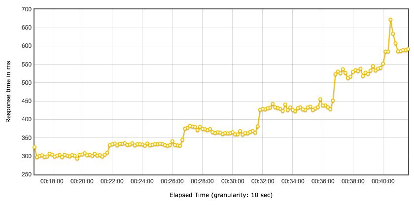

1. 粒度太粗，对一个duration只有五分钟的场景来说，这样的粒度完全看不出过程中产生的毛刺。
2. 至少看到内网的TPS能到180了，但是这里没有做过其他改变，只是把Ramp-up放缓了一些，所以我觉得这个案例的信息是有问题的。

## 第二阶段

针对以上的问题，下面要怎么玩？我们列一下要做的事情。

1. 将Ramp-up再放缓，改为300秒。这一步是为了将梯度展示出来。
2. 将粒度改小，JMeter默认是60秒，这里改为1秒。这一步是为了将毛刺显示出来。强调一点，如果不是调优过程，而是为了出结果报告的话，粒度可以设置大一些。至于应该设置为多大，完全取决于目标。

接着我们再执行一遍，看看测试结果：

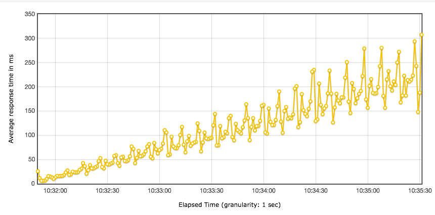

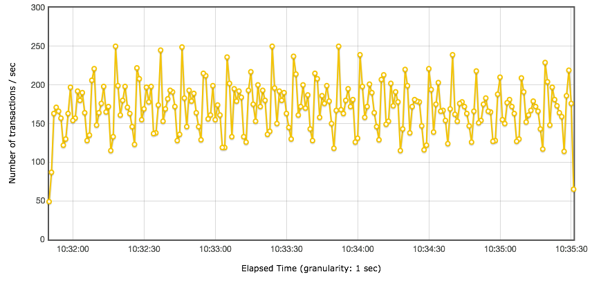

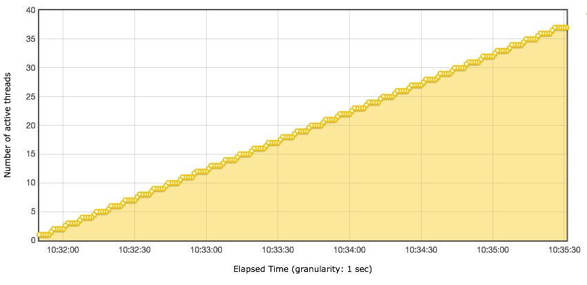

这样看下来，有点意思了哈。明显可以看到如下几个信息了。

1. 响应时间随线程数的增加而增加了。
2. TPS的梯度还是没有出来。

显然还是没有达到我们说的梯度的样子。但是这里我们可以看到一个明显的信息，线程梯度已经算是比较缓的了，为什么响应时间还是增加得那么快？

这里的服务器端压力情况呢？如下所示：

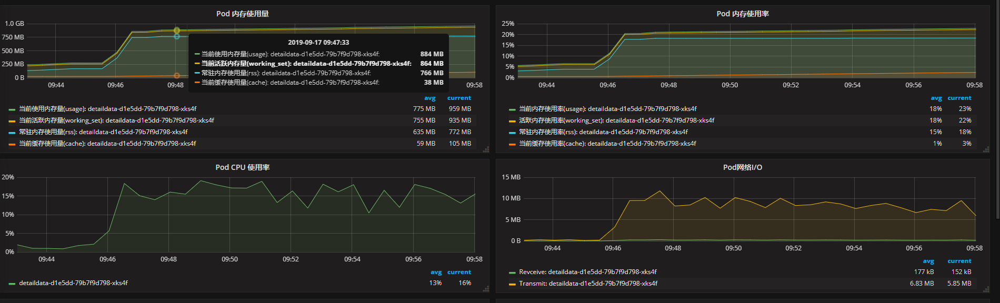

从监控图大概看一下，服务端CPU、内存、网络几乎都没用到多少，有一种压力没有到服务端的感觉。

在这一步要注意，压力在哪里，一定要做出明确的判断。

在这里，当我们感觉服务端没有压力的时候，一定要同时查看下网络连接和吞吐量、队列、防火墙等等信息。查看队列是非常有效的判断阻塞在哪一方的方式。

如果服务端的send-Q积压，那就要查一下压力端了。如下所示：

```
State       Recv-Q Send-Q                      Local Address:Port                                     Peer Address:Port
......
LISTEN      0    54656                                    :::10001                                               :::*
......

```

在网络问题的判断中，我们一定要明确知道到底在哪一段消耗时间。我们来看一下发送数据的过程：

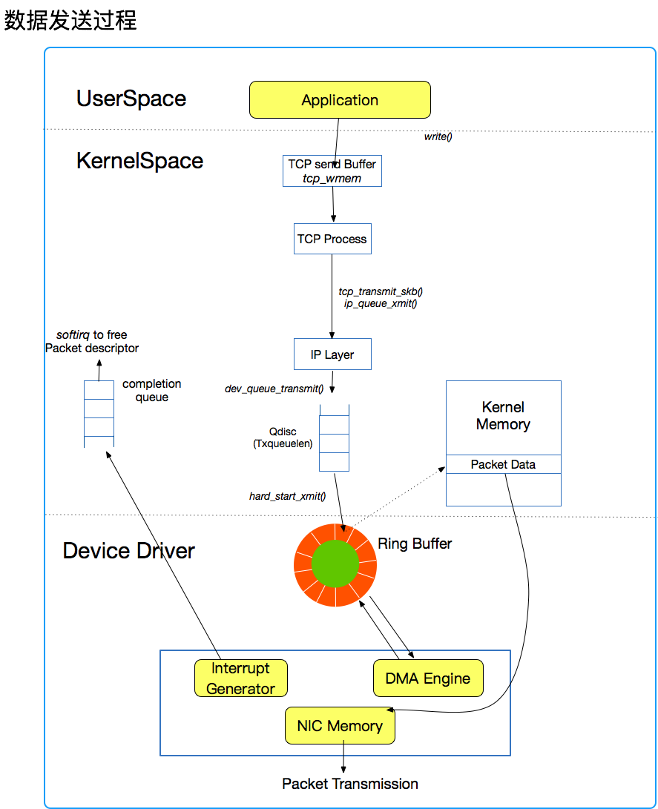

从上图可以看出，发送数据是先放到 `tcp_wmem` 缓存中，然后通过 `tcp_transmit_skb()` 放到TX Queue中，然后通过网卡的环形缓冲区发出去。而我们看到的send-Q就是Tx队列了。

查看压力端脚本，发现一个问题。

```
System.out.println(message);

```

一般情况下，我们在调试脚本的时候会打印日志，因为要看到请求和响应都是什么内容。但是压力过程中，基本上我们都会把日志关掉。 **一定要记住这一点，不管是什么压力工具，都要在压力测试中把日志关掉，不然TPS会受到很严重的影响**。

了解JMeter工具的都知道-n参数是命令行执行，并且不打印详细的返回信息的。但是这里，一直在打印日志，并且这个日志在JMeter中执行时加了-n参数也是没用的。

这样一来，时间全耗在打印日志中了。知道这里就好办了。我们在这里做两件事：

1. 把打印日志这一行代码注释掉，再执行一遍。
2. 把ramp-up时间再增加到600秒。

为什么我要执着于把ramp-up时间不断增加？在前面也有强调，就是要知道TPS和响应时间曲线的趋势。

在性能分析的过程中，我发现有很多性能工程师都是看平均值、最大值、最小值等等这些数据，并且也只是描述这样的数据，对曲线的趋势一点也不敏感。这是完全错误的思路，请注意，做性能分析一定要分析曲线的趋势，通过趋势的合理性来判断下一步要做的事情。

什么叫对曲线的趋势敏感？就是要对趋势做出判断，并且要控制曲线的趋势。

有时，我们经常会看到TPS特别混乱的曲线，像前面发的TPS图一样，抖动幅度非常大，这种情况就是完全不合理的，在遇到这种情况时，一定要记得降低压力线程。

你可能会问，降到多少呢？这里会有一个判断的标准， **就是一直降到TPS符合我们前面看到的那个示意图为止**。

再给你一个经验，如果实在不知道降多少，就从一个线程开始递增，直到把梯度趋势展示出来。

## 第三阶段

通过注释掉打印日志的代码，可以得到如下结果：

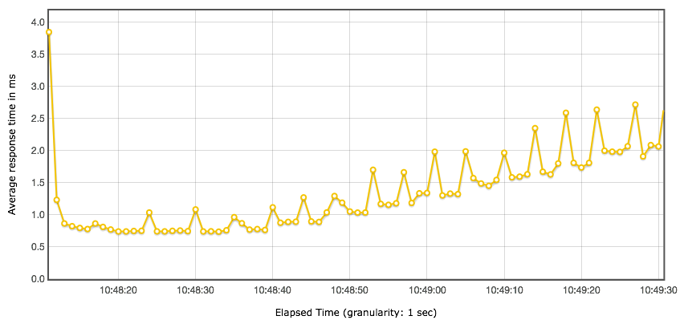

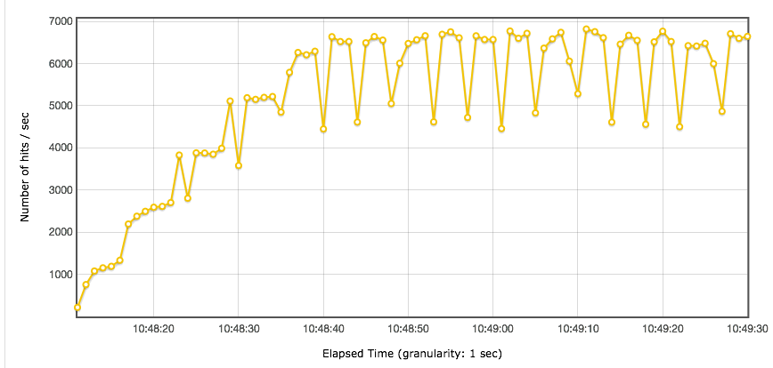

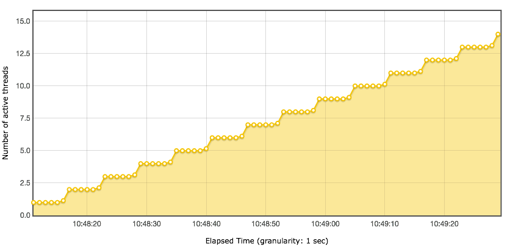

从TPS曲线上可以看到，梯度已经明显出来了。在有一个用户的时候，一秒就能达到1000多TPS，并且在持续上升；两个线程时达到2500以上，并且也是在持续上升的。

从响应时间上来看，也是符合这个趋势的，前面都在1ms以下，后面慢慢变长。

压力越大，曲线的毛刺就会越多，所以在TPS达到6000以上后，后面的TPS在每增加一个线程，都会出现强烈的抖动。

在这种情况下，我们再往下做，有两条路要走，当然这取决于我们的目标是什么。

1. 接着加压，看系统什么时候崩溃。做这件事情的目标是找到系统的崩溃点，在以后避免出现。
2. 将线程最大值设置为10，增加ramp up的时间，来看一下更明确的递增梯度，同时分析在线程增加过程中，系统资源分配对TPS的影响，以确定线上应该做相对应的配置。

## 总结

在这个案例中，我们将TPS从150多调到6000以上，就因为一句日志代码。

我分析过非常多的性能案例，到最后发现，很多情况下都是由各种简单的因素导致的，这一反差也会经常让人为这一路分析的艰辛不值得。

但我要说的是，性能分析就是这样，当你不知道问题在哪里的时候，有一个思路可以引导着你走向最终的原因，那才是最重要的。

我希望通过本文可以让你领悟到， **趋势** 这个词对曲线分析的重要性。在本文中，我们通过对曲线的不合理性做出判断，你需要记住以下三点：

1. 性能分析中，TPS和响应时间的曲线是要有明显的合逻辑的趋势的。如果不是，则要降线程，增加Ramp-up来让TPS趋于平稳。
2. 我们要对曲线的趋势敏感，响应时间的增加不可以过于陡峭，TPS的增幅在一开始要和线程数对应。
3. 当TPS和响应时间曲线抖动过于强烈，要想办法让曲线平稳下来，进而分析根本原因，才能给出线上的建议配置。

## 思考题

今天我结合案例具体说明了下如何分析TPS的趋势，如果你吸收了文章的内容，不妨思考一下这两个问题？

1. Ramp-up配置有什么样的作用？
2. 为什么说压力工具中TPS和响应时间曲线抖动过大会不易于分析？

欢迎你在评论区写下你的思考，也欢迎把这篇文章分享给你的朋友或者同事，一起学习交流一下。