# 27丨案例：带宽消耗以及Swap（上）
今天我们来看一个真实的案例。事情是这样的，之前有人在微信上问我一个问题，这个问题的现象很典型：典型的TPS上不去，响应时间增加，资源用不上。

大概的情况是这样的：有两台4C8G的服务器，一台服务器上有2个Tomcat，一台服务器上是DB。压测的混合场景有4个功能模块，其中3个访问一个Tomcat，另外一个访问一个Tomcat。

Tomcat的监控页面如下：

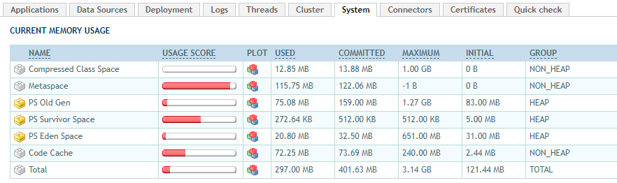

应用服务器系统资源监控页面如下：

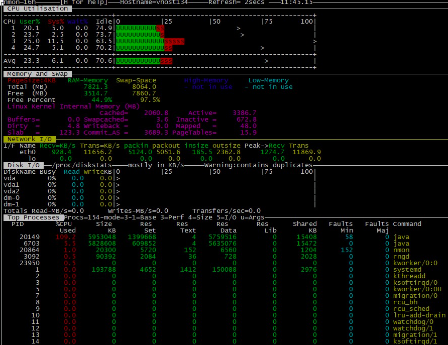

数据库服务器系统资源监控如下：

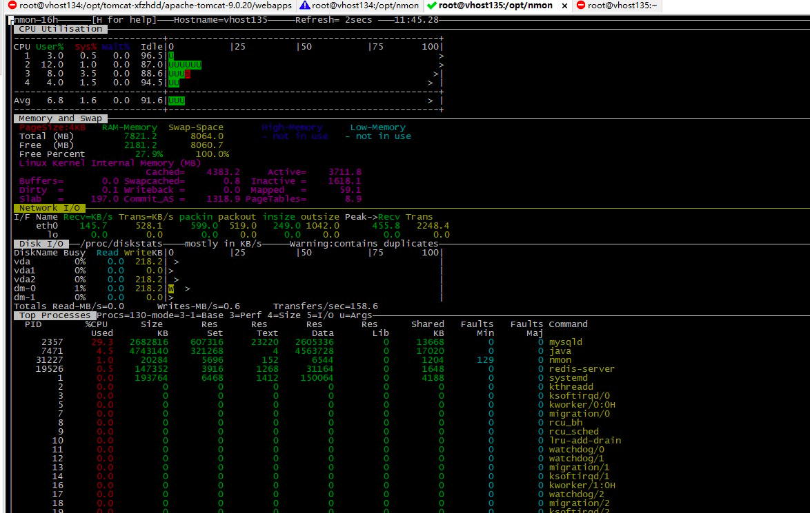

JMeter结果如下：

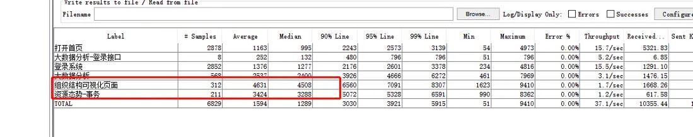

综上现象就是，单业务场景执行起来并不慢，但是一混合起来就很慢，应用服务器和数据库服务器的系统资源使用率并不高。请问慢在哪？

这是非常典型的询问性能问题的方式，虽然多给了系统资源信息，但是这些信息也不足以说明瓶颈在哪。

为什么呢？在现在多如牛毛的监控工具中，除非我们在系统中提前做好分析算法或警告，否则不会有监控工具主动告诉你， 监控出的某个数据有问题，而这个只能靠做性能分析的人来判断。

我在很多场合听一些“专家”说：性能分析判断要遵守木桶原理。但是在做具体技术分析的时候，又不给人说明白木桶的短板在哪里。这就好像，一个赛车手说要是有一个各方面都好的车，我肯定能得第一名，但是，我没有车。

话说出来轻而易举，但是请问木桶的短板怎么判断呢？因为CPU高，所以CPU就是短板吗？所以就要加CPU吗？这肯定是不对的。

因为这个例子并不大，所以可以细细地写下去。今天文章的目的就是要告诉你，性能问题分析到底应该是个什么分析思路。

## 分析的第一阶段

### 画架构图

做性能测试时，我们需要先画一个架构图，虽然简单，但是让自己脑子里时时记得架构图，是非常有必要的。因为架构级的分析，就是要胸怀架构，在看到一个问题点时，可以从架构图中立即反应出来问题的相关性。

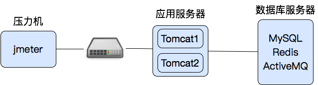

上面这张图是自己脑子里的逻辑图，数据在网络中的流转并不是这样，而是像下图这样。

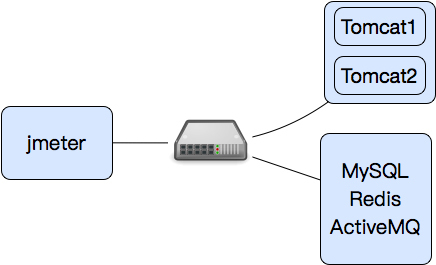

数据流是从压力机到应用服务器，应用服务器再到网络设备，再到数据库服务器；数据库把数据返回给应用服务器，应用服务器再通过网络设备给压力机。

如果把里面的Redis、ActiveMQ和MySQL的逻辑再细说明白，那么这个小小的应用都可以描述好一会。所以这里，我先大概描述一下，如果后面的分析中涉及到了相应的逻辑，再一点点加进来。

应用服务器只有一台，上面有两个Tomcat实例；数据库服务器有三个应用。混合场景中有四个业务，其中三个访问Tomcat1，第四个访问Tomcat2。

### 场景描述

有了场景大概的画像之后，我们再来看场景。根据测试工程师描述：

1. 响应时间慢的，都是可视化页面，有不少图片、JS、CSS等静态资源。公网上是用CDN的，现在只测试内网的部分。静态资源已经做了压缩。
2. 单业务测试的容量是可以满足要求的，但混合场景响应时间就长。系统资源用得并不多。
3. 压力场景是300线程，Ramp-up period是1秒。
4. Duration是72000。
5. 各参数化都已经做了，参数化数据也合理。
6. 测试环境都是内网。
7. 服务器是CentOS，压力机是Win10。

既然这样，我们还是要看看系统的各个资源，再来判断方向。我在很多场合都强调证据链。对架构比较简单的应用来说，我们都不用再做时间的拆分了，直接到各主机上看看资源就好了。

### 瓶颈分析定位

根据我们之前画的架构图，我们从应用服务器、数据库服务器和压力数据分别定位一下。

- 应用服务器

从前面的应用服务器资源来看，CPU使用率现在还不高，也基本都在us CPU（就是user消耗的CPU）上，比例也比较合理。

物理内存8G，还有3.5G。即使不多，对Java应用来说，也要先看JVM，只要不是page fault过多，我们可以先不用管物理内存。

网络资源接收900KB/s左右，发送11M左右。这样的带宽应该说是比较敏感的，因为对100Mbps和1000Mbps来说，我们要心里有一个数，一个是12.5MB（对应100Mbps），一个是125MB（对应1000Mbps），当和这样的带宽值接近的时候，就要考虑下是不是带宽导致的压力上不去。不过这里我们也不用先下定论。只是留个疑问在这里。

磁盘资源，基本上没有读写，很正常。

从Process列表中，也没看到什么异常数据。faults也都是min，major fault并没有。但在这个案例中，还部署了另一个监控工具，上面显示如下：

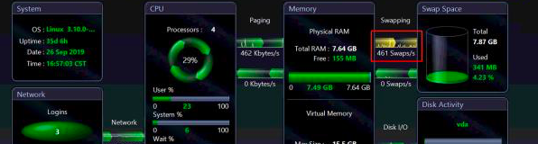

为什么这个Swapping要标黄呢？那肯定是过大了嘛。是的，你可以觉得swap过多。这个扣，我们也记在心里。在这里标红加粗敲黑板！

- 数据库服务器

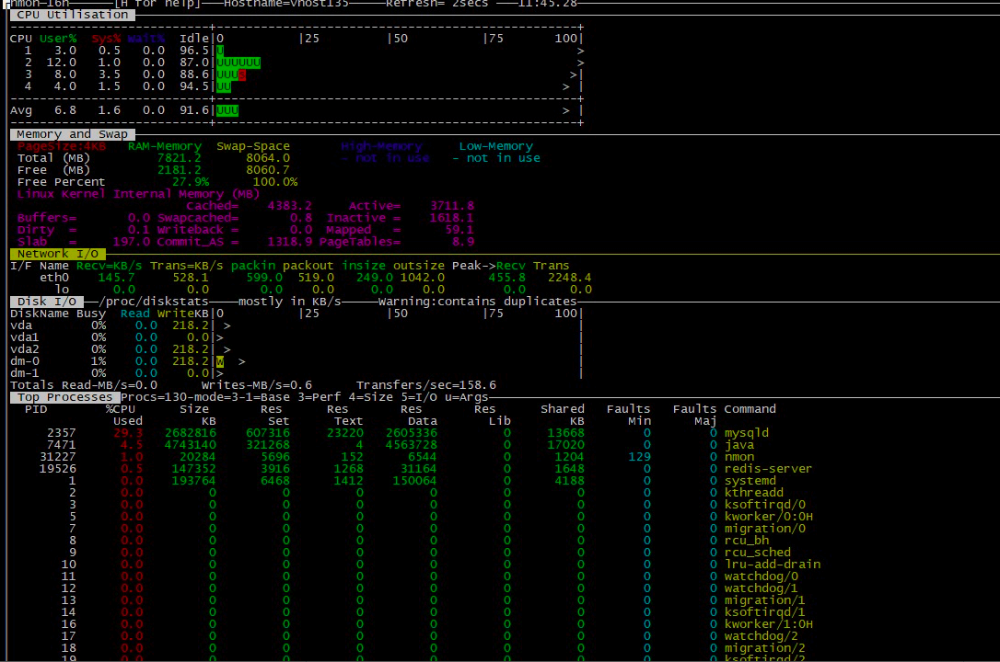

照样分析，CPU、内存、网络、磁盘、Process列表，并没看到哪里有异常的数据，连网络都只有500多k的发送。

这样的数据库资源状态告诉我们，它不在我们的问题分析主线上。接下来是压力数据。

- 压力数据

这是JMeter中的聚合报告：

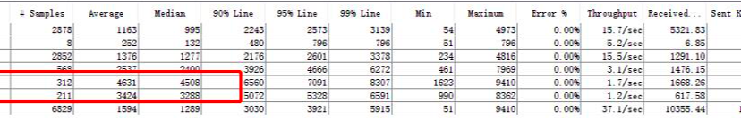

从上面这张图也能看出，响应时间确实挺长的，并且，300线程只有37的TPS，带宽总量10M左右。这个带宽倒是和应用服务器上的带宽使用量相当。关于这个带宽的判断请你一定注意，对于性能分析来说，带宽能不能对得上非常重要。比如，客户端接收了多少流量，服务端就应该是发出了多少流量。如果服务端发了很多包，但是客户端没有接收，那就是堵在队列上了。

既然其它的资源暂时没出现什么瓶颈。其实在这个时间里，如果是复杂的应用的话，我们最应该干的一件事情就是拆分时间。如下图所示：

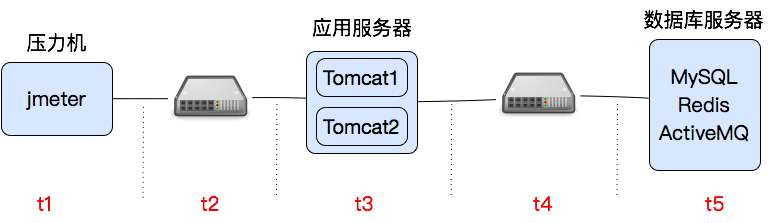

这里我把时间拆为t1-t5，具体分析哪一段为什么消耗了时间。我们可以在Tomcat中加上%D和%F两个参数来记录request和response的时间。

在没有做这个动作之前，我们先把前面的扣解决一下。首先，带宽是不是受了100Mbps的限制？

一般来说，判断网络的时候，我们会有几个判断点。

首先是带宽的流量大小，也就是前面我们看到的11M左右的值。一般来说，100Mbps是指的bit per second，但是在应用层基本上都是byte，所以对100Mbps来说，是12.5MB。

其次是，全连接和半连接队列是否已经溢出？

我们通过SYNs to LISTEN sockets dropped来判断半连接队列是否溢出，通过times the listen queue of a socket overflowed来判断全连接队列是否溢出。

通过实时的查看，这两个值的增加并不多。所以这里不会是问题点。

最后是发送和接收队列是否堆积？

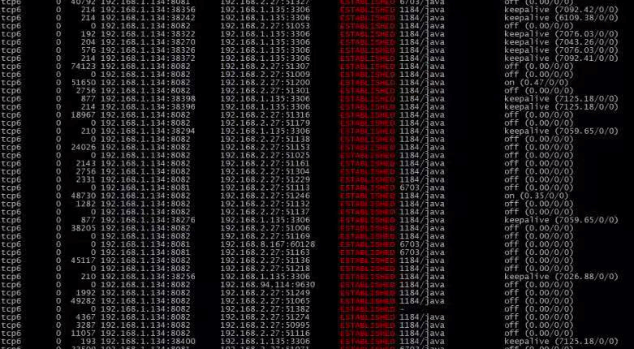

通过应用服务器上的send-Q（前面数第三列），可以看到服务器和压力机之间的的队列还是很长的，基本上每次查看都存在，这说明队列一直都有堆积。

我们再到压力机上看看带宽用了多少：

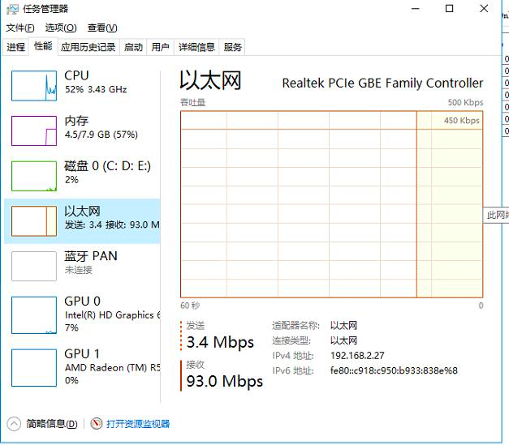

看这里也是用到了93Mbps，那么到这里我们就可以确定是网络问题导致的TPS上不去，响应时间增加，系统资源也用不上了。

和系统管理员确认宿主机的带宽后，被告知宿主机确实是100Mbps。

似乎这个分析到这里就可以结束了，直接把带宽加上再接着测试呗。但是，从项目实施的角度上说，这个问题，并不是阻塞性的。

为了把更多的性能问题提前找出来，现在我们先不下载静态资源，只发接口请求找下其他性能问题。这个带宽的问题，记一个bug就行了。

### 优化结果

我们将静态资源全都过滤掉之后，再次执行场景，结果是下面这样的。

JMeter压力数据：

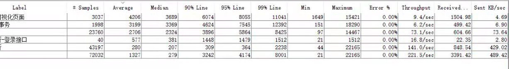

应用服务器带宽：

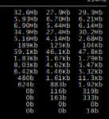

数据库服务器带宽：

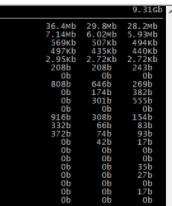

应用服务器网络队列：

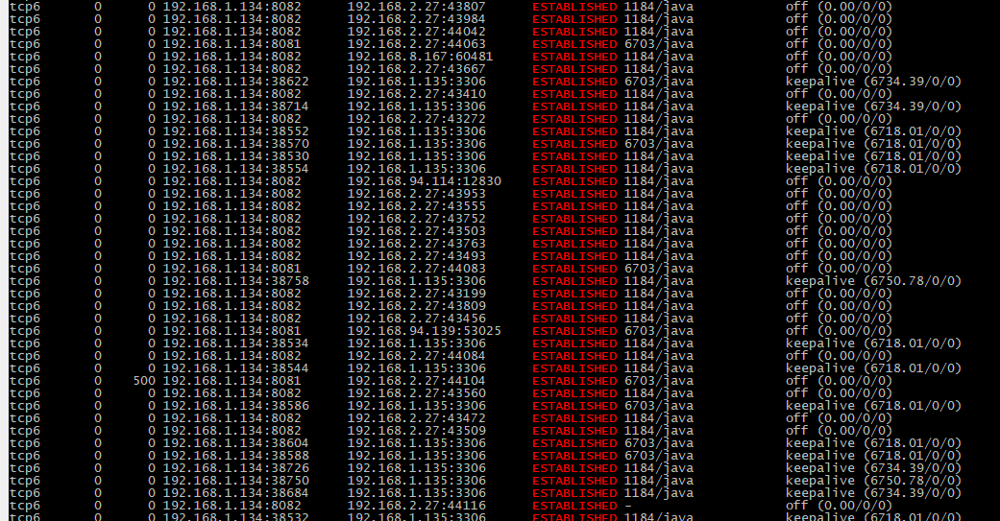

应用服务器资源监控：

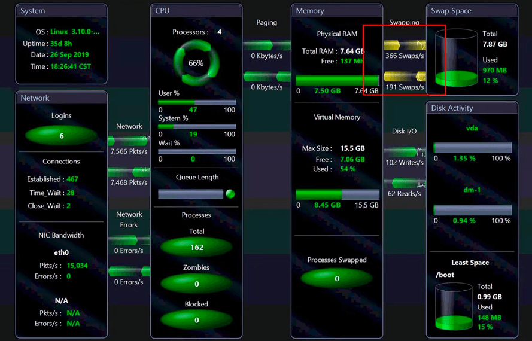

通过上面的结果可以看出：

1. TPS可以达到221.5了，并且Received和Sent的字节加一起不到4MB。
2. 应用服务器和数据库服务器的带宽都用到了近40Mbps，和JMeter结果也相当。
3. 应用服务器上的网络队列也没有堆积。
4. 应用服务器的CPU也已经能消耗到66%了，

当正在想通过过滤掉静态资源绕过带宽不足的现状来测试其他性能问题的时候，这时，Swap双向都标黄了。这时，性能测试工程师更纠结了，它为什么双向都黄了？CPU使用率才66%嘛。

其实，这两句话之间并没有什么关系，CPU使用率不管是多少，Swap该黄还是会黄。

这是为什么呢？这里卖个关子，在下一篇文章中，我们接着分析。

## 总结

带宽问题是性能分析中常见的问题之一，其难点就在于，带宽不像CPU使用率那么清晰可理解，它和TCP/IP协议的很多细节有关，像三次握手，四次挥手，队列长度，网络抖动、丢包、延时等等，都会影响性能，关键是这些判断点还不在同一个界面中，所以需要做分析的人有非常明确的分析思路才可以做得到。而且现在的监控分析工具中，对网络的判断也是非常薄弱的。

而Swap问题不能算是常见，只要出现，基本上就会很多人晕乎。解决的关键就是要明白Swap的原理，查到关联参数，然后就可以很快地定位了。

## 思考题

结合今天的内容，你能说一下网络的瓶颈如何判断吗？有哪几个队列？

欢迎你在评论区写下你的思考，也欢迎把这篇文章分享给你的朋友或者同事，一起交流一下。