# 28丨案例：带宽消耗以及Swap（下）
上一篇文章我主要分析了带宽消耗，今天，我们来看一下分析的第二和第三阶段，也就是Swap分析和数据库分析。

## 分析的第二阶段

### Swap的原理和对TPS的影响

前面有一个扣，是说swap多的问题。要理解swap为什么是黄的，得先知道什么是swap。我先画个简易的示意图。

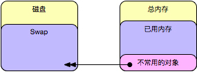

这里先解释一下，对于一个Linux系统来说，如果配置并开启了swap分区，那么默认的swappiness参数是60。

swappiness是在内存reclaim的时候生效的，而reclaim方式同时有两个动作：1. 将file相关内存进行回收；2. 将anon内存交换到swap分区。

所以swapiness值越大，swap分区就用得越多。

对我们现在分析的这个系统来说，来看一下：


我们看到这里配置了一个内存为8G左右，已经使用了7G多了，swappiness配置为30%。

通过free看到现在只有145M的物理内存剩余，可用内存也只有254M了。

所以上面图中的swap飘黄也是很合理的喽！

下面我们就针对应用服务器的swap来看是不是可优化。

所有人都知道，当swap被用的时候，性能肯定会下降，所以在我的测试过程中，一般我都建议把swap直接关掉测试性能，有人说这样有什么问题？

那就是没有swap，让不常用的对象直接占用物理内存，如果物理内存不够用，就把对象删了，后面再创建，这时会增加的是major fault，那就增加好了，反正是要性能差的。

说得如此硬气，那在生产中怎么办呢？开还是关？有人觉得关了心里有安稳，有人觉得开着心里会安稳。而一个系统、一个容器、一个节点，如果容量控制的非常好的情况下，我建议关掉。开着它，也只是心里上的安慰，不会有TPS处理能力上的提升。

### 瓶颈分析定位

既然知道了上面的大概原理。对一个运行Tomcat应用的服务器来说，那肯定是要先检查一下JVM设置为多大。先执行ps命令，看一下Java进程吧。

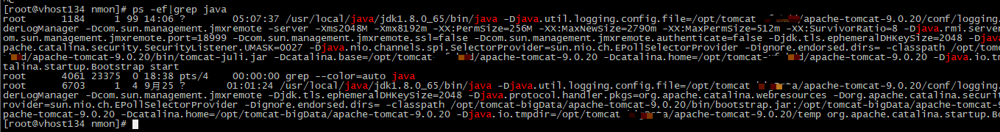

关键参数如下：

```
JAVA_OPTS="$JAVA_OPTS -server -Xms2048M -Xmx8192m -XX:PermSize=256M -XX:MaxNewSize=2790m -XX:MaxPermSize=512m -XX:SurvivorRatio=8"

```

JVM是1.8.0\_65。

这个参数配置有很大的问题。物理内存只有8个G，一个JVM heap就配置了8G，这让其他的东西怎么玩得起来？并且JDK是1.8了，配置permsize是又为啥呢？

虽说有多个地方配置不合理，但是我们也得要知道一下应该配置多少是合理的吧。

看参数的时候，JMX也配置上了，那就用工具来看吧。

首先来看一下系统资源。先看一下系统资源在压力下的表现：

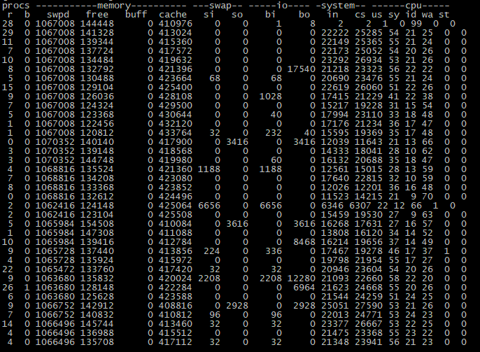

1. 队列已经出现，CS 2万多，in 2万多，说多不多。我们可以先放着。
2. I/O没什么压力，swap也一直有值，我们要解决的就是它。
3. us：sy接近2：1，这个是不良信号，记在心里，后面再说。

其次再看下JVM的情况：

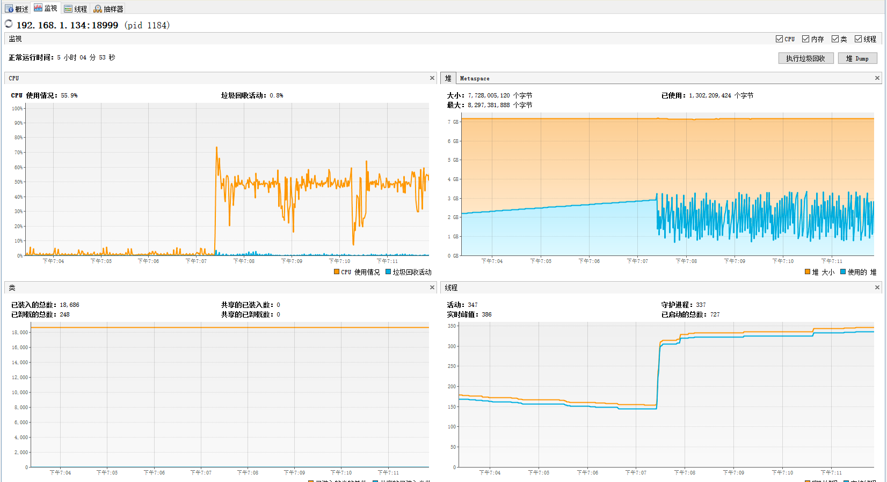

CPU使用在应用上的时间达到60%，GC上没耗什么时间，并且从堆的回收能力上来看，比较正常，只是只用到了3G左右，这里有必要给8G吗？

线程活动的达到347，看起来还是在增加的，这里也可能是个问题点，只是现在我们不用关心，它还没跳出来。

从这个JVM状态上来看，它完全用不到8G。在这种状态下，还有另一个Tomat，并且另一个Tomcat中也没有配置-Xmx -Xms参数，当没有配置时，默认-Xmx是物理内存的1/4。再加上thread用的，所以swap飘黄也是吻合的。

### 优化结果

首先，我们把JVM配置成最简，JVM设置为4G。

```
JAVA_OPTS="$JAVA_OPTS -server -Xms4096M -Xmx4096m"

```

perm区在1.8里都没有了，这几个参数也没啥用。在我的习惯中，MaxNewSize也是先看要用到多少，再决定配置不配置。有些应用自己不熟悉，也无法直接给出配置，只有测试之后再配置。

各部分配置为多大，都没有定数，要通过测试看需要多少。

而我们现在最重要的是先把性能调整上去，再考虑这些细节内容。这样修改JVM就是为了把物理内存使用率低下来，先不修改swapiness的比例是为了看下结果，如果用不到swap就不再调了，如果还是用了swap，再来调它。

当我们把JVM修改了之后，再执行起来场景。看到内容如下：

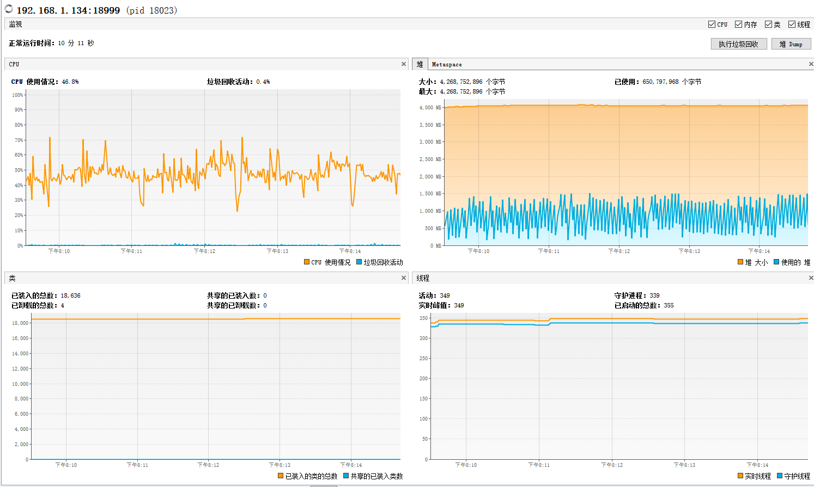

CPU使用率相对前面没有什么变化，但是堆4G只用到了1.5G，可见这个堆连4G都用不到。当然我们还是要分析下其他的内容。

还记得我们要解决的是什么问题吧？swap飘黄了！

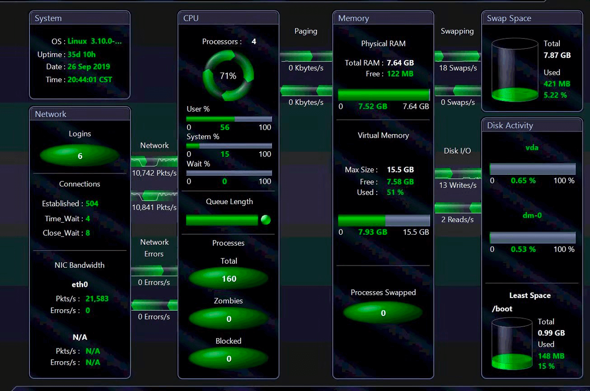

从这张图可以看到Swapping不报警了！CPU占用70%左右。说明现在available的内存是充足的。

这时我们再看一下系统资源，首先是应用服务器系统资源。

应用服务器系统资源vmstat如下：

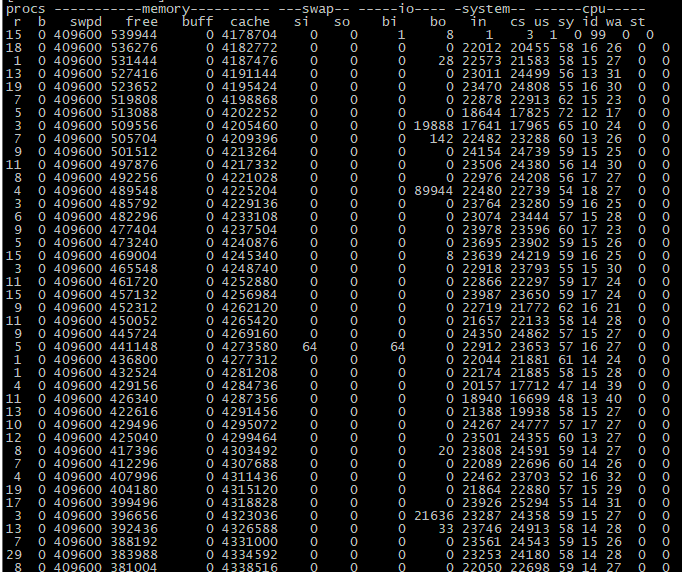

应用服务器系统资源top：

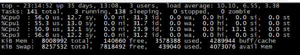

应用服务器系统资源iftop:

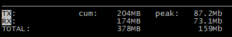

上图中可以看到，对比之前的资源，swap基本上没有了，CPU使用率多起来了。但是队列依旧长，sy CPU消耗还是有点多了。

应用服务器的si已经到了13.1%了，这个值要关注下，暂时还不能说是问题，但是接着增加下去，肯定会是问题。

网络已经超过70Mbps了，峰值上到87Mbps，这是一个好事，它说明现在处理的业务量确定多了。

接下来是数据库服务器系统资源：

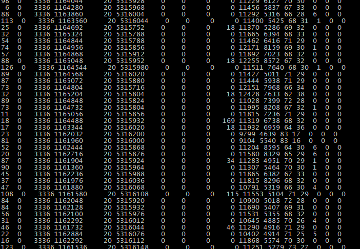

你可以看到数据库CPU都用到这么高了？

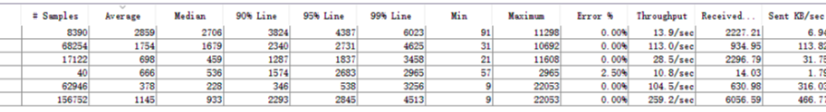

TPS能到259.2了，较之前的221.5没有提升多少。但是我们解决了swap的问题，还是有了一点点的提升。

那下一个瓶颈在哪里呢？通过上面的数据库资源来看，数据库早就已经被用到了100%的CPU，队列也嗖嗖地涨到了好几十，高的都超过100了。

可见我们在处理应用服务器的时候，数据库这边已经早就吃不消了。那下面，我们就先把应用服务器的优化部分放一下，再去分析下一个短板：数据库。

### 后续性能工作建议

但是这里并不是说应用服务器的优化工作就完成了，还有一些部分需要做的。

1. 优化JVM配置参数，至于应该配置成什么值，还需要再测试，可能会有人说，这个测试人员怎么知道呢？请你相信，如果这个值性能测试人员都测试不出来的话，一般的架构师也不可能知道该设置为多少。
2. 通过监控分析确定swapiness的值。
3. 网络带宽又快到占满了，如果TPS再提高，网络肯定又支撑不了。

这些扣也都放在这里。因为我们主要是找到系统的短板，并一一解决，才能使整体的TPS增加，虽说现在应用服务器上还有优化的空间，但是现在它不是最短的板。

我们在不忘记应用服务器这些问题的同时，再将目光转向数据库。

## 分析的第三阶段

### 瓶颈分析定位

先来看看数据库的系统资源。

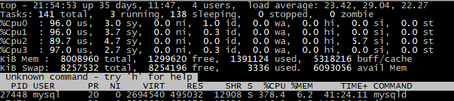

我在很多场合都在强调一个词：证据链。所以基本上分析也会是从OS层面开始。

但是证据链这个词说起来容易理解，实际上要想真的有链起来的能力，必须具有基础知识，像分析数据库就更明显。因为当我们不了解系统架构时，想说明一个事情就非常困难。

像上面的这个top，显然us CPU使用率非常地高，idle几乎没有了，只有一个si占了5.7%，这个si并不算高，我们在上一阶段看到的应用服务器的si都已经达到了13%了。

我们说si的高或者低，倒不是关键，关键的是它有没有成为我们的瓶颈点。在这个系统中，us cpu才是我们要关注的重点，因为它实在是太高了。

对于一个数据库来说，要干的事情就是执行SQL。当分析多了数据库之后，基本上也形成了套路。不管怎么样，还是先看一下基本的监控信息，以下截取一些Spotlight on MySQL的有用的图，如果你没有这个工具，用其他的监控工具也是一样的。

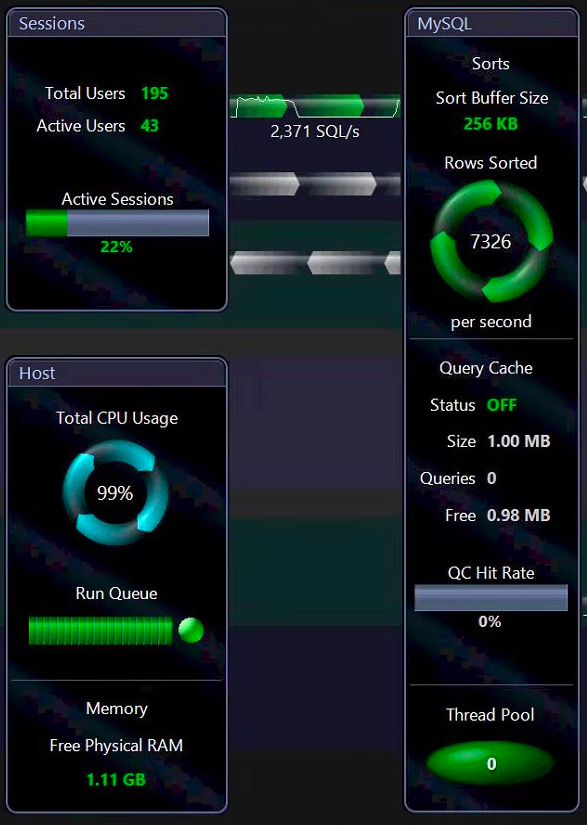

从上面的图可以看到，CPU使用率99%，Query Cache 是OFF的。记下这个位置！

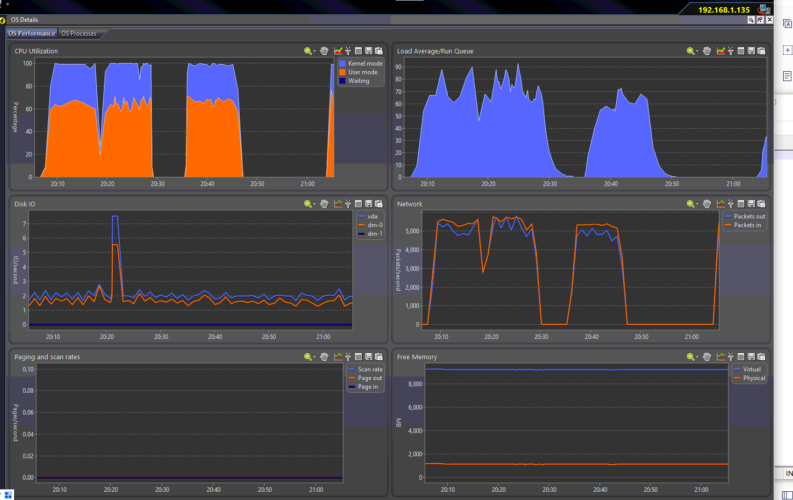

从上图看到，负载队列非常长，但Disk I/O没多少，说明队列和I/O无关，只是CPU的队列，非常好！

Network也不算大，进出每秒5000多个包，我们再来看一下网络用到多少了？

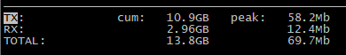

峰值也才70Mbps左右，即使是100Mbps带宽，现在仍然认为有余量（注意！我这里说有余量是因为我同时也检查了网络队列，并没有阻塞，并不是只看了这个值就武断地做了判断）。

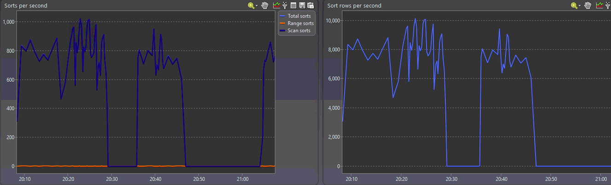

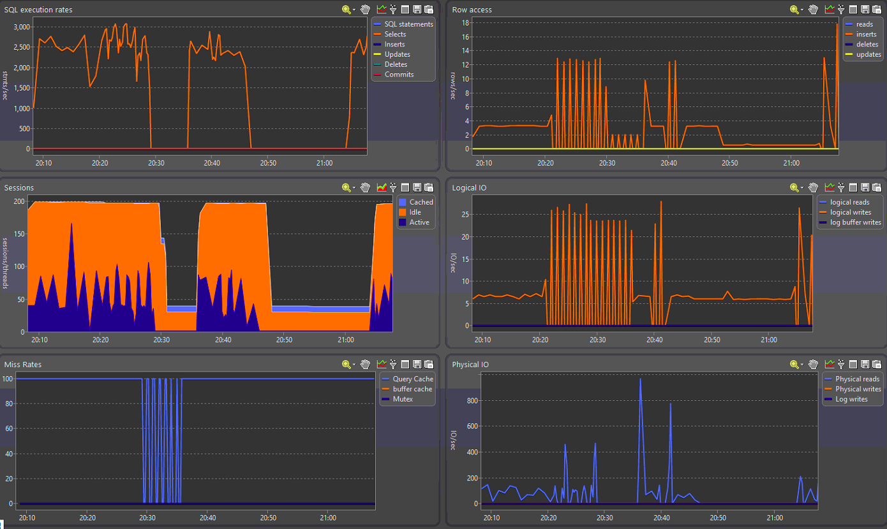

通过上面的图可以看到，每秒执行2500-3000的SQL，Sorts per second达到800-1000，Sort rows per second达到8000-10000。

session用得倒是也不多，但Miss Rates在压力过程中Query Cache都是在100%，并且从最上面的summary中可以看到Query Cache也是OFF的。

为什么没有在看到Query Cache是OFF的时候就敲黑板呢，这是因为在一些应用中，如果不是查询多的话，这个值OFF也不能说有问题，但是在这个应用中几乎所有的语句都是select，那这个Query Cache再不打开就说不过去了呀。这里先记录下这个问题，待会我们的优化动作就是打开Query Cache。

不管怎么说，对一个数据库来说，主要是执行SQL嘛，而对MySQL来说，不看slow log，还能看什么呢。

通过整理slow log，看到如下内容：

```
# Overall: 280 total, 1 unique, 0.59 QPS, 9.53x concurrency ______________
# Time range: 2019-09-26T13:44:08 to 2019-09-26T13:52:06
# Attribute          total     min     max     avg     95%  stddev  median
# ============     ======= ======= ======= ======= ======= ======= =======
# Exec time          4555s     12s     19s     16s     18s      2s     16s
# Lock time           52ms   130us   662us   185us   273us    53us   167us
# Rows sent              0       0       0       0       0       0       0
# Rows examine      30.81M 112.69k 112.69k 112.69k 112.69k       0 112.69k
# Query size       186.48k     682     682     682     682       0     682

# Profile
# Rank Query ID           Response time    Calls R/Call  V/M   Item
# ==== ================== ================ ===== ======= ===== ===========
#    1 0xBED932B8C940697E 4555.0867 100.0%   280 16.2682  0.16 SELECT test2

```

什么情况？只有1 unique？0.59TPS？我前面的TPS可是有259.2，这结果一看就感觉不对。

查看一下long\_query\_time，配置成了10s，怪不得看不到慢SQL。

改long\_query\_time为1s，再跑一遍。看到如下结果：

```
# Overall: 620.47k total, 30 unique, 259.39 QPS, 16.76x concurrency ______
# Time range: 2019-09-26T13:44:08 to 2019-09-26T14:24:00
# Attribute          total     min     max     avg     95%  stddev  median
# ============     ======= ======= ======= ======= ======= ======= =======
# Exec time         40082s    88us     23s    65ms   323ms   649ms   332us
# Lock time            61s    30us   363ms    97us   152us     1ms    69us
# Rows sent          1.92M       0     633    3.25   21.45    7.43    0.99
# Rows examine     987.99M       0 112.69k   1.63k  10.29k   5.49k  420.77
# Query size       240.33M      89   1.52k  406.15  833.10  258.19  246.02

# Profile
# Rank Query ID           Response time    Calls  R/Call  V/M   Item
# ==== ================== ================ ====== ======= ===== ==========
#    1 0x160FA75270C56FB8 22892.5442 57.1%  65352  0.3503  0.16 SELECT test1
#    2 0xBED932B8C940697E 15914.4501 39.7%    986 16.1404  0.44 SELECT test2
#    4 0xF0AE7AFA7851C7E8   245.0176  0.6%    175  1.4001  0.11 SELECT test3
#    5 0xFB5A64603A53BFCE    97.2016  0.2%     77  1.2624  0.04 SELECT test4
#   14 0x1E088E88CDC208BE     8.7701  0.0%     14  0.6264  0.23 SELECT test5

```

嗯，这看着顺眼多了。前两个SQL占了所有执行时间的96.8%！第一个SQL平均执行时间350ms，方差16%。而第二个语句更夸张，平均执行时间16s，方差44%。这得收拾！

但是要不要优化这样的SQL，我们就需要根据SQL的分析和业务的分析来判断了。这里我先把执行计划列出来看看。

SQL1的执行计划：

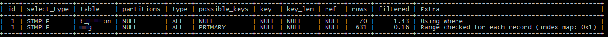

1. 没有分区。
2. 不包含子查询或者union操作。
3. 全表扫描。
4. 第一个表所查有70行，第二个表所查有631行，此值仅做为参考，并不精准。
5. 第一个表返回结果只占了读取行数的1.43%（优化点），第二个表返回结果只占了0.16%（优化点）。
6. 在第一个表中，Extra有一个值，using where。
7. 在第二个表中，Extra有一个值，Range checked for each record (index map: 0x1) 。

SQL2的执行计划：


1. 没有分区。
2. 不包含子查询或者union操作。
3. 非唯一索引查找，也列出了具体的索引。
4. 第一个表索引列上有102570行，第二个表索引列上有118行。此值仅做为参考，并不精准。
5. 第一个表返回结果只占了读取行数的3.33%（优化点），第二个表返回结果占了100%。
6. 在第一个表中，Extra有三个值，using index condition; using where; using filesort。
7. 在第二个表中，Extra有一个值，using where。

这里我要敲黑板了！！！你是不是不记得Extra这些值的含义了？是不是要祭出你的搜索引擎，要开始查了！

我们这里再来回顾一遍。

using where：对结果用where子句中的条件过滤。

Range checked for each record (index map: 0x1)：MySQL没有找到可以使用的索引，如果前面的表的列值已知，可能会部分使用索引。

using index condition：先条件过滤索引，找到所有符合索引条件的数据行，再用where子句中的条件做过滤。

using filesort：Query中有Order By操作，又无法用索引完成排序，MySQL不得不选择相应的排序算法来实现。是不是对应上了前面的sorts per second？

知道了这些基础知识之后，下面再来看一下，两句语句很显然都有优化的空间，尽量使用filtered的比例能大一些，至于能不能用到索引，那就看业务的需要了，如果确实是要查很大的索引，表扫还能快点。所以这两个语句，要丢给开发做业务分析了。

### 优化结果

对数据库，我们有两个优化的方向还记得吧，第一个是SQL语句，第二个是 Query Cache。

我们先做第2个，将Query Cache开启，看一下效果如何。

```
mysql> show variables like 'query_cache%';

```

查看结果如下：

```
query_cache_type  ON
query_cache_size  1048576

```

再执行起来场景，看系统资源：

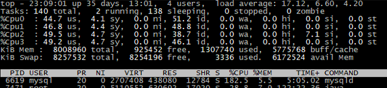

效果还不错哦，us CPU降到了50%以下。

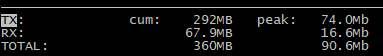

网络峰值时能达到90Mbps了，又快把带宽占完了。

查看网络队列：

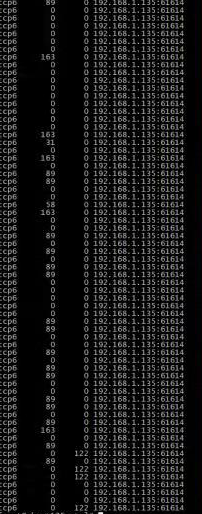

再检查下队列，这时看到已经有接收队列了。

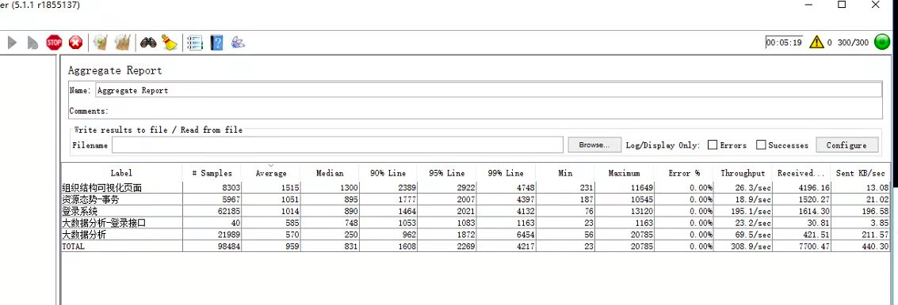

从TPS上来看，现在能到300多一点，同时网络接收发送加在一起8M左右。

### 后续性能工作建议

接下来数据库的优化方向就是优化SQL。

当然还有别的优化建议，我们将在后面再说。

## 总结

这个案例从一个概括的描述开始，到各阶段的分析定位，是一个非常完整的过程。从一个项目的角度上来说，现在是不是性能已经达标，要有两方面的判断。

1. 技术方面来说，显然这系统还有很多优化的空间，我们在文中也留了不少的扣。
2. 业务方面来说，系统是否可以上线，就取决于业务指标了。

但是这个性能是不是已经做得完整了呢？显然还没有。现在只是调了一个节点而已。因为这是在测试环境中做的，硬件环境显得非常简单。线上部署结构也会包括分布式多节点集群等。所以从一个性能项目的角度来说，还远远没有结束。我想如果把这个项目完整地写下来，一本书的容量应该不为过。

从技术细节上来说，通过几个阶段的具体操作，可以让你有一个性能分析定位的宏观感受，这也是这两篇内容的初衷。性能优化是无止境的，我们要做的是以最少的时间和金钱成本，达到最大的优化效果。

## 思考题

这一篇文章延续上一篇的分析思路，你能讲一下Swap的原理和逻辑，以及分析思路吗？另外，慢SQL如何定位出来呢？

欢迎你在评论区写下你的思考，也欢迎把这篇文章分享给你的朋友或者同事，一起交流一下。