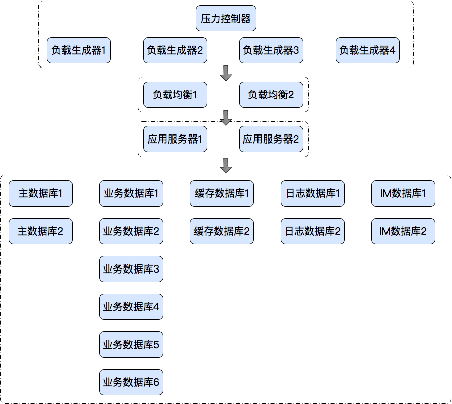
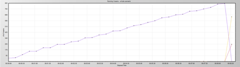
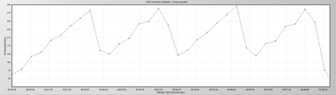
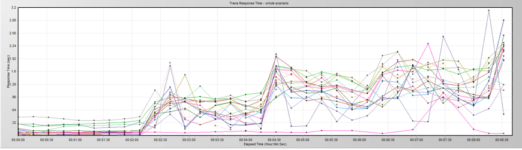
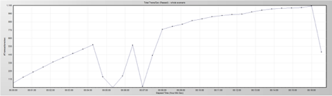

# 29丨案例：如何应对因网络参数导致的TPS呈锯齿状？
在苍茫的性能分析道路上，不管你是一只多老的鸟，在经历了多个性能测试的项目之后，你都会发现对于性能问题而言，你仍然不敢说能全部解决。因为下一个问题可能真的是你完全没有见过的。

再加上技术的飞速发展，想跟得上技术的进步都是一件痛苦的事情，更别说要完全掌握并且融会贯通了。

我经常看到有些人在简历中动辄说自己做过上百个性能项目，以彰显自己有充足的经验。事实上，如果一个性能项目需要做两个星期的话，基本上做不到调优的层面，最多是弄个脚本压个报告。在我的经验中，基本上一个完整的架构级的性能项目从准备开始到写出测试报告、调优报告，需要1.5个月以上。你可以想像，这样的项目，就算一年不停地做，做10个都算是非常快的了，而要做上百个这样的项目，至少需要10年的时间。

并且不是每一个项目都能让你有分析性能瓶颈的机会，因为有很多问题都是重复的。

所以性能分析是一个需要不断总结出自己的分析逻辑的工作，有了这些分析逻辑，才能在新项目中无往不利。请注意我的描述，我强调的是要有自己分析的逻辑，而不是经历多少个性能问题。因为问题可能会遇到新的，但是分析逻辑却是可以复用的。

在今天的文章中，我仍然用一个之前项目中出现过的案例给你讲一讲性能分析的思路。

## 案例问题描述

这个项目是我调优过两次的项目。我介入这个项目之后，和同事们一起从100TPS调到1000TPS。

但是调到这个阶段，也只是在测试环境中调的，并没有按生产的架构调优。从测试部署架构上来说，就是Tomcat+Redis+MySQL，负载均衡的Nginx部分还没有加进去。

本来想着如果只是加个Nginx，也复杂不到哪里去。于是，我就撤了。但是当我离开一周之后，那个项目组同事又给我打电话，说这个项目仍然有问题，加了Nginx之后，TPS达不到1000了。啊，这还得了，要砸我招牌呀。

于是我又介入这个项目了，直到再次解决这个新的性能问题。

在今天的内容里，我会将记忆中所有的细节都记录下来，有些是同事调的步骤，有些是我调的步骤。在这个久远的项目中，希望我能写的完整。

下面来看这个具体的问题分析过程。

这个系统的简单架构图如下所示：



## 压力工具图

照例，我们先看压力工具中给出来的重要曲线。

用户递增图：



TPS图：



响应时间图：



从上面的曲线可以看到，TPS在上升到一个量级的时候就会掉下来，然后再上到同样的量级再掉下来，非常规律。而响应时间呢，在第一次TPS掉下来之后，就变得乱七八糟了。响应时间不仅上升了，而且抖动也很明显。

这是什么情况？从来没见过呀。

## 分析过程

我们需要经过一系列的工作——看操作系统的CPU、I/O、Memory、NET等资源；看数据库、Tomcat、Nginx监控数据等等。

经过分析，我们觉得其他数据显示正常，网络连接状态是有问题的。如下所示：

```
tcp        0      0 ::ffff:192.168.1.12:59103   ::ffff:192.168.1.11:3306    TIME_WAIT   timewait (0.00/0/0)
tcp        0      0 ::ffff:192.168.1.12:59085   ::ffff:192.168.1.11:3306    TIME_WAIT   timewait (0.00/0/0)
tcp        0      0 ::ffff:192.168.1.12:59331   ::ffff:192.168.1.11:3306    TIME_WAIT   timewait (0.00/0/0)
tcp        0      0 ::ffff:192.168.1.12:46381   ::ffff:192.168.1.104:3306   TIME_WAIT   timewait (0.00/0/0)
tcp        0      0 ::ffff:192.168.1.12:59034   ::ffff:192.168.1.11:3306    TIME_WAIT   timewait (0.00/0/0)
tcp        0      0 ::ffff:192.168.1.12:59383   ::ffff:192.168.1.11:3306    TIME_WAIT   timewait (0.00/0/0)
tcp        0      0 ::ffff:192.168.1.12:59138   ::ffff:192.168.1.11:3306    TIME_WAIT   timewait (0.00/0/0)
tcp        0      0 ::ffff:192.168.1.12:59407   ::ffff:192.168.1.11:3306    TIME_WAIT   timewait (0.00/0/0)
tcp        0      0 ::ffff:192.168.1.12:59288   ::ffff:192.168.1.11:3306    TIME_WAIT   timewait (0.00/0/0)
tcp        0      0 ::ffff:192.168.1.12:58905   ::ffff:192.168.1.11:3306    TIME_WAIT   timewait (0.00/0/0)
tcp        0      0 ::ffff:192.168.1.12:58867   ::ffff:192.168.1.11:3306    TIME_WAIT   timewait (0.00/0/0)
tcp        0      0 ::ffff:192.168.1.12:58891   ::ffff:192.168.1.11:3306    TIME_WAIT   timewait (0.00/0/0)
tcp        0      0 ::ffff:192.168.1.12:59334   ::ffff:192.168.1.11:3306    TIME_WAIT   timewait (0.00/0/0)
tcp        0      0 ::ffff:192.168.1.12:46129   ::ffff:192.168.1.100:3306   TIME_WAIT   timewait (0.00/0/0)
tcp        0      0 ::ffff:192.168.1.12:59143   ::ffff:192.168.1.11:3306    TIME_WAIT   timewait (0.00/0/0)

```

从这里我们可以看到，网络中有大量的timewait存在，这是有价值的信息了，但也只是现象。

## 尝试优化

### 尝试一：为TIME\_WAIT修改TCP参数

通过检查sysctl.conf，我们看到所有的配置均为默认，于是尝试如下修改。

其实这个修改，应该说是在分析得不够精准的情况下做的判断。

因为在服务端出现大量的timewait，说明是服务端主动断开的TCP连接。而我们处理这样的连接，无非就是释放服务端的句柄和内存资源，但是不能释放端口，因为服务端只开了一个listen端口。

```
net.ipv4.tcp_tw_recycle = 1
net.ipv4.tcp_tw_reuse = 1
net.ipv4.tcp_fin_timeout = 3
net.ipv4.tcp_keepalive_time = 3

```

回归测试，问题依旧。

### 尝试二：修改Nginx的proxy\_ignore\_client\_abort

考虑到当客户端主动断开时，服务器上也会出现大量的timewait，所以我们打开proxy\_ignore\_client\_abort，让Nginx忽略客户端主动中断时出现的错误。

```
proxy_ignore_client_abort on;

```

修改后，重启Nginx，问题依旧。

这个操作纯属根据经验做的猜测。因为是加了Nginx之后才出现的问题。但是这个调整并没有起到作用，可见不是压力端主动断开连接而导致的问题，也就是说，和压力机无关了。

### 尝试三：换Nginx和Nginx所在的服务器

因为这个案例是通过Nginx服务器才看到TPS上到300就会下降，所以我们考虑是Nginx的问题。但是查来查去，也没看到Nginx有什么明显的问题，于是我们就下载了Nginx的源码，重新编译一下，什么模块都不加，只做转发。

通过回归测试发现，并没有解决问题。

到这里，那就显然和Nginx本身没什么关系了，那么我们就换个服务器吧。于是我们在另一台机器上重新编译了Nginx，但是问题依旧。

服务器和Nginx都换了，但还是没有解决问题，那么问题会在哪呢？想来想去，还是在操作系统层面，因为Nginx实在是没啥可调的，只做转发还能复杂到哪去。

但是操作系统层面又有什么东西会影响TPS到如此规律的状态呢？在考虑了应用发送数据的逻辑之后（请参考 [《18丨CentOS：操作系统级监控及常用计数器解析（下）》](https://time.geekbang.org/column/article/191522) 中的网络部分中的“数据发送过程”和“数据接收过程”），我觉得操作系统本身应该不会存在这样的限制，网络配置参数我也看过，不会导致这样的问题。

那么在操作系统发送和接收数据的过程中，只有一个大模块我们还完全没有涉及到，那就是防火墙。于是我查了一下系统的防火墙状态。

激活状态的防火墙是如下这样的：

```
[root@node-1 zee]# systemctl status firewalld.service
● firewalld.service - firewalld - dynamic firewall daemon
   Loaded: loaded (/usr/lib/systemd/system/firewalld.service; disabled; vendor preset: enabled)
   Active: active (running) since Mon 2015-02-17 23:34:55 CST; 2s ago
     Docs: man:firewalld(1)
 Main PID: 32052 (firewalld)
    Tasks: 2
   Memory: 32.4M
   CGroup: /system.slice/firewalld.service
           └─32052 /usr/bin/python -Es /usr/sbin/firewalld --nofork --nopid

```

从上面的“active (running)”可以看到防火墙确实是开着的。那怎么办？果断地先停掉再说。

### 尝试四：停掉防火墙

和网络连接有关的内容，剩下的就只有防火墙了。于是执行如下命令：

```
Service iptables stop

```

之后我们就会看到TPS立即就上去了，这就明显和防火墙相关了。

dmesg查下系统日志，可以看到如下的大量信息：

```
Nov  4 11:35:48 localhost kernel: __ratelimit: 108 callbacks suppressed
Nov  4 11:35:48 localhost kernel: nf_conntrack: table full, dropping packet.
Nov  4 11:35:48 localhost kernel: nf_conntrack: table full, dropping packet.
Nov  4 11:35:48 localhost kernel: nf_conntrack: table full, dropping packet.
Nov  4 11:35:48 localhost kernel: nf_conntrack: table full, dropping packet.
Nov  4 11:35:48 localhost kernel: nf_conntrack: table full, dropping packet.
Nov  4 11:35:48 localhost kernel: nf_conntrack: table full, dropping packet.
Nov  4 11:35:48 localhost kernel: nf_conntrack: table full, dropping packet.
Nov  4 11:35:48 localhost kernel: nf_conntrack: table full, dropping packet.
Nov  4 11:35:48 localhost kernel: nf_conntrack: table full, dropping packet.
Nov  4 11:35:48 localhost kernel: nf_conntrack: table full, dropping packet.
Nov  4 11:35:53 localhost kernel: __ratelimit: 592 callbacks suppressed
Nov  4 11:35:53 localhost kernel: nf_conntrack: table full, dropping packet.
Nov  4 11:35:53 localhost kernel: nf_conntrack: table full, dropping packet.
Nov  4 11:35:57 localhost kernel: nf_conntrack: table full, dropping packet.
Nov  4 11:35:57 localhost kernel: nf_conntrack: table full, dropping packet.
Nov  4 11:35:57 localhost kernel: nf_conntrack: table full, dropping packet.
Nov  4 11:35:57 localhost kernel: nf_conntrack: table full, dropping packet.
Nov  4 11:35:57 localhost kernel: nf_conntrack: table full, dropping packet.
Nov  4 11:35:57 localhost kernel: nf_conntrack: table full, dropping packet.
Nov  4 11:35:57 localhost kernel: nf_conntrack: table full, dropping packet.
Nov  4 11:35:57 localhost kernel: nf_conntrack: table full, dropping packet.
Nov  4 11:35:58 localhost kernel: __ratelimit: 281 callbacks suppressed
Nov  4 11:35:58 localhost kernel: nf_conntrack: table full, dropping packet.
Nov  4 11:35:58 localhost kernel: nf_conntrack: table full, dropping packet.
Nov  4 11:35:58 localhost kernel: nf_conntrack: table full, dropping packet.
Nov  4 11:35:58 localhost kernel: nf_conntrack: table full, dropping packet.
Nov  4 11:35:58 localhost kernel: nf_conntrack: table full, dropping packet.
Nov  4 11:35:58 localhost kernel: nf_conntrack: table full, dropping packet.
Nov  4 11:35:58 localhost kernel: nf_conntrack: table full, dropping packet.
Nov  4 11:35:58 localhost kernel: nf_conntrack: table full, dropping packet.
Nov  4 11:35:58 localhost kernel: nf_conntrack: table full, dropping packet.
Nov  4 11:35:58 localhost kernel: nf_conntrack: table full, dropping packet.
Nov  4 11:36:14 localhost kernel: __ratelimit: 7 callbacks suppressed

```

这个信息很明显，那就是nf\_conntrack的表满了，于是把包给丢了。可是看到这里的时候，我还不知道nf\_conntrack是个啥玩意。

后来通过查资料才知道，nf\_conntrack（以前叫ip\_conntrack）是Linux中一个跟踪TCP连接条目的模块，它会用一个哈希表记录TCP的连接信息。当这个哈希表满了之后，就会报 `nf_conntrack: table full,dropping packet` 这样的错误。

`__ratelimit: N callbacks suppressed` 的意思是系统中这样重复的日志太多了，达到了内核参数中的net\_ratelimit()的上限。Linux中也是用这个参数来避免DDos的。

可是，为啥要丢掉这些包呢？满就满了呗，你可以报错呀。丢人家的包，这一招不是很地道呀。

## 原理分析

下面来看一下nf\_conn的数据结构：

```
struct nf_conn {
        / Usage count in here is 1 for hash table/destruct timer, 1 per skb, plus 1 for any connection(s) we are `master' for /
        struct  nf_conntrack  ct_general;                / 连接跟踪的引用计数 /
        spinlock_t  lock;
        /* Connection tracking(链接跟踪)用来跟踪、记录每个链接的信息(目前仅支持IP协议的连接跟踪)。每个链接由“tuple”来唯一标识，这里的“tuple”对不同的协议会有不同的含义，例如对TCP,UDP来说就是五元组: (源IP，源端口，目的IP, 目的端口，协议号)，对ICMP协议来说是: (源IP, 目的IP, id, type, code), 其中id,type与code都是icmp协议的信息。链接跟踪是防火墙实现状态检测的基础，很多功能都需要借助链接跟踪才能实现，例如NAT、快速转发、等等。*/
        struct  nf_conntrack_tuple_hash  tuplehash[IP_CT_DIR_MAX];

        unsigned long  status;  / 可以设置由enum ip_conntrack_status中描述的状态 /

        struct  nf_conn  master;  / 如果该连接是某个连接的子连接，则master指向它的主连接 */
        / Timer function; drops refcnt when it goes off. /
        struct  timer_list  timeout;

        union nf_conntrack_proto proto;                / 用于保存不同协议的私有数据 /
        / Extensions /
        struct nf_ct_ext ext;                        / 用于扩展结构 */
}

```

上面的nf\_conn有最大个数限制，它是通过nf\_conntrack\_max来限制的，默认值是65535。

通过查找资料，我发现nf\_conn的主要作用，如下描述：

> 在nf\_conntrack模块中，实现了对连接跟踪。它利用netfilter框架中的nf\_register\_hook/nf\_unregister\_hook函数来注册钩子项，调用nf\_conntrack\_in来建立相应连接，ipv4\_conntrack\_in挂载在NF\_IP\_PRE\_ROUTEING点上（该函数主要实现了创建连接），从而实现连接跟踪。

从上面的描述我们就可以看到，原来这个模块并不是防火墙必须的模块，并且从实现手法上来说，是通过注册hook函数实现的功能。有黑客经验的人应该经常听到hook函数，很多病毒软件都用这个思路往其他的应用中插入自己的代码模块的。

## 参数调整

知道了是什么模块之后，就很容易找到和它相关的参数了，这个信息你可以直接在操作系统的官网信息中找得到。

那么nf\_conntrack的参数是什么呢？

```
net.netfilter.nf_conntrack_max
//是允许的最大跟踪连接条目，是在内核内存中netfilter可以同时处理的“任务”。
net.netfilter.nf_conntrack_tcp_timeout_established
//是TCP连接创建时的超时时间。

```

其实还有其他参数，只是这两个和性能相关，所以我在这里单独列了出来。

根据官方的公式，nf\_conntrack\_max的最大值是 `CONNTRACK_MAX = RAMSIZE(in bytes)/16384/(ARCH/32)`。

其中，RAMSIZE是物理内存大小，ARCH是操作系统位数，16384是netfilter框架中hash桶参数nf\_conntrack\_buckets的默认大小。

以32G内存，64位操作系统为例：

```
CONNTRACK_MAX = 32*10241024*1024/16384/2 = 1048576条

```

也就是说，如果你有内存，就可以把这个值调大点。

我在这里就直接往后面加了个0，改为：

```
net.netfilter.nf_conntrack_max=655350

```

知道了原理，就不止一个调优方案了，下面我们就来看看。

## 其他解决方案

### 关闭防火墙

```
chkconfig iptables off
chkconfig ip6tables off
service iptables stop
service ip6tables stop

```

### 禁用在这个端口上跟踪（也称为使用裸表）

在防火墙规则中这样配置：

```
-A PREROUTING -p tcp -m tcp --dport 80 -j NOTRACK

```

你也可以直接对TCP禁用跟踪，至于规则配置，就看你的想像力了（这也是我比较不喜欢弄防火墙的原因，配置也太灵活了，容易乱）。

### 删除跟踪模块

你还可以直接删除跟踪模块。首先，查看有哪些模块：

```
lsmod | grep nf_conntrack

```

再用rmmod删除它们。

总之，不管你用什么方式，都需要再你的应用可以安全并能正常提供服务的前提下使用。

知道了解决方案之后，我们就来看下解决之后的TPS是怎样的。

## 解决问题后的TPS图



上图中有两次TPS下降的过程，这是因为我又尝试修改了防火墙的禁用参数配置，重启了两次防火墙。并不是出现了新的问题，所以不要紧张。

后来在这个项目中又调优了一些其他的参数，下面是最终达到的调优效果。


蓝色是调优前的，红色是调优后的。

我们可以看到响应时间下降了很多，TPS也上去了，客户非常满意，还请我吃了顿忘不了的牛肉火锅。哈。

## 总结

性能问题总是层出不穷，不管你以前多有经验，都可能会遇到不懂的性能问题。

如果建立了分析问题的思路逻辑，并且又善于学习和查找各种资料，找到根本原因，最后都会给出完整的解决方案。

这个案例应该说是个比较偏门的性能问题了，解决问题的思路就是我上面说的那样。

其实你也可以看到，有很多时候，我们的性能问题和代码并没有关系，所以这里也提醒那些一玩性能就想看代码的人，眼光要放开阔一些。还有就是遇到性能问题时，一定要记住，不要慌！

## 思考题

这是个刁钻的案例，你能说一下为什么在本例中，最后想到了看防火墙呢？以及，为什么说timewait的TCP链接只是问题的现象呢？

欢迎你在评论区写下你的思考，也欢迎把这篇文章分享给你的朋友或者同事，一起交流一下。