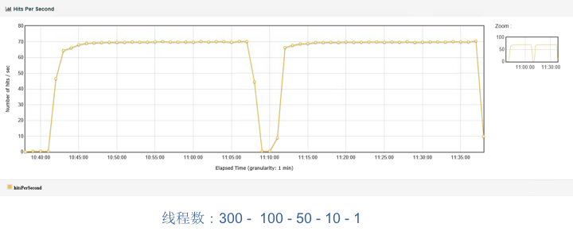
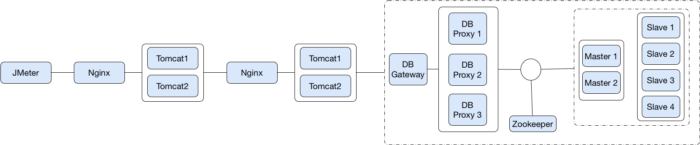
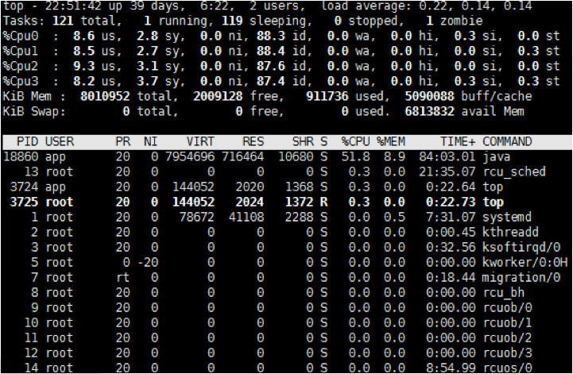
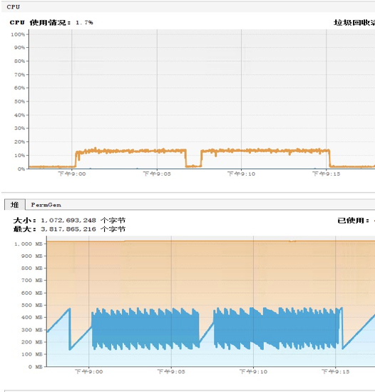
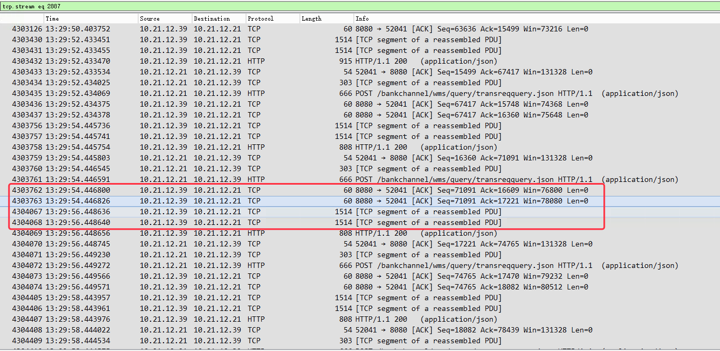
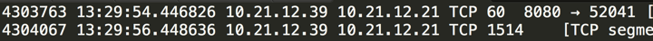
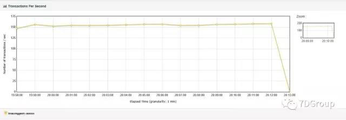

# 30丨案例：为什么参数化数据会导致TPS突然下降？
写这篇文章的时候，我想起来一句似乎无关紧要的话：“我离你如此之近，你却对我视而不见。”

在性能测试中，参数化数据是少有的每个性能测试工程师都会用得到，却经常出现问题的技术点之一。从我的角度来说，究其原因，大部分是因为对性能参数化数据的理解不足。导致的结果就是用了参数化，但和真实的用户场景不一致，从而使得整个性能测试场景都失去了意义。

这样的例子不在少数。

一个项目开始之初，由于没有历史沉淀的数据，所以我们需要造一些数据来做性能测试。造多少呢？并不是按未来生产的容量来造，而是按性能场景中需要的数据量级来造。这种错误的做法是很多项目中真实出现的事情。

这并不止是性能测试工程师之过，还有很多其他的复杂原因，比如时间不够；经验不足，只能造重复的数据等等。

那么性能测试参数化数据的获取逻辑到底是什么呢？我们来看一个图吧。


在这个图中，我用不同的颜色表示不同组件中的数据。压力工具中的参数化数据有两种，这一点，我们前面有提到过，参数化数据有两大类型：

1. 用户输入的数据同时在后台数据库中已存在。
2. 用户输入的数据同时在后台数据库中不存在。

当我们使用数据库中已存在的数据时，就必须考虑到这个数据是否符合真实用户场景中的数据分布。当我们使用数据库中不存在的数据时，就必须考虑输入是否符合真实用户的输入。

在本篇要说的案例中，我们来看一下参数化数据如果做错了，对性能结果会产生什么样的影响。

## 案例问题描述

在一次压力测试的过程中，出现了如下所示的TPS数据（本篇文章中一些截图会有些模糊，因为来自于之前项目中的具体案例，在当时截图时，也并没有考虑清晰度，不过我们只要看趋势就好）。

在下图中，我们可以看到，在压力测试过程中，出现了TPS陡减到底的情况。这显然是不合理的。



这个曲线的趋势把性能瓶颈呈现得非常明显。在出现这个问题之后，当时我们也尝试过把线程数降低，观察TPS的趋势，结果从300到100到50到10，最后到1，发现都会出现这样的TPS陡减到底的情况，只是时间长度不同而已。

这非常像某个资源因为处理业务量的累积达到了某个临界点而产生的情形。

但不管怎样，我们还是要按正常分析的思路来分析它。

## 分析过程

首先，仍然是画一个架构图。



在这个图中，我们可以看到，JMeter是连接到第一层服务（这里是有两个Tomcat实例），再到第二层服务（这里是也有两个Tomcat实例），然后再连到DB中。这个DB是一个互联网金融DB（通过MySQL改造来的）。

了解了架构图之后，现在就开始查看下性能数据吧。

### 查操作系统

先看一下操作系统的性能数据：



从top中，我们可以看到这个应用服务器没啥压力，在这样的状态中，你可能都不用再去查其他的操作系统信息了，因为目前的压力对这个系统来说确实是小了点。

### 查应用

再看下应用的状态，这里用的工具仍然是前文中提到过多次的JvisualVM（请你在用性能监控工具的时候，不要纠结，只要工具好使，用到吐都行，不用跟风）。



从这个图中可以看到的是，这个应用使用到的CPU确实很低，并且堆也没用多少。其实在这一步，我查了四个Tomcat的状态，只是截了一个图而已。

在这里还是要啰嗦一下了，对这样的曲线，我们一定要一眼就能看出问题在哪里。出现上图这样的情况是因为以下两个原因：

1. 应用CPU使用率（橙色CPU线）确实是太低了，才15%左右。这和前面的top也是能对得上的。Java的GC几乎没占CPU（蓝色CPU线），也就是说Tomcat在这里没压力。
2. 从堆曲线的趋势上来看，1G的堆才到了400M多一点，并且回收一直都非常正常。怎么判断这个“正常”呢？首先，年轻代、年老代回收很有规律，并且没消耗什么CPU；其次，每次FullGC都能回到150M左右，非常平稳。可见这个内存使用没啥问题。

当然到了这里，我当时也是查了网络的，只是也没什么压力，所以没做具体的记录（从这点可以看出，如果你在做性能测试的时候，要想记录性能瓶颈的分析过程，一定要记得把数据记全了，不然以后你可能都想不起来当时做了什么事情）。

### 查DB

既然上面都没啥问题，DB又是一个MySQL，所以这里，我先手动执行了几个常规的查询语句。在DB中查看如下信息。

查 `processlist`、 `innodb_trx`、 `innodb_locks`、 `innodb_lock_waits`。在没有监控工具时，这几个是我经常在MySQL数据库检查的表，因为数据库如果慢的话，基本上会在这几个表中留些蛛丝马迹。

processlist是看当前数据库中的session的，并且也会把正在执行的SQL列出来，快速刷新几次，就可以看到是不是有SQL一直卡在那里。

`innodb_trx` 是正在执行的SQL事务表，这个表很重要。

`innodb_locks` 和 `innodb_lock_waits` 是为了看有没有锁等待。

拿一条业务SQL执行一下，看看在压力之中会不会慢。这是在没有数据库监控时，快速判断业务的方法。因为这个业务很单一，用的SQL也单一，所以我在这里可以这样做。执行了之后，并没有发现业务SQL慢。

由此基本判断DB没什么问题。

注意，判断到了这里，其实已经出现了证据不完整产生的方向偏离！

### 陷入困局之后的手段

更悲催的是这个业务系统的日志记录的非常“简洁”，连时间消耗都没有记录下来。想来想去，在这么简单的一个架构中，没什么可查的东西了吧，除非网络中有设备导致了这个问题的出现？

在没有其它监控工具的情况下，当时我们上了最傻最二最基础又最有效的时间拆分手段：抓包！

抓包其实是个挺需要技巧的活，不止是说你能把包抓出来，还要能分析出来时间消耗在谁那里。这时我提醒一下，当你学会抓包工具的使用时，不要在每个场景下都想露一手你的抓包能力，通过抓的包分析响应时间的消耗点。

在我的工作中，只有万般无奈时才会祭出“抓包”这样的手段，并不是因为我对网络不够了解。恰恰是因为了解得足够多的，我才建议不要随便抓包。因为但凡在应用层有工具可以分析响应时间，都会比抓网络层的包来得更加简单直观。

经过一段段的分析之后，在数据库的一个主机上看到了如下信息：



看到这里的TCP segment of a reassembled PDU没有？它之上是ACK。放大一下，看看这里的时间：



看到没有，这里有两秒的时间才发数据，那它是在干吗呢？

这里就要说明一下 `TCP segment of a reassembled PDU` 了，PDU就是 `Protocol Data Unit`。

以下高能烧脑，不喜可跳过！

它是指在TCP层接收到应用层发的非常大的数据之后，需要将数据大刀阔斧地砍成几段之后再发出去。就是这个砍数据的过程消耗了2秒的时间。

可是为什么TCP层要干这个事呢？上层应用给了你一大块数据包，你直接往外扔不就行了吗？还要自己reassemble（重新装配），费老大劲。

这其实TCP的一个参数来决定的，它就是MSS（Maximum Segment Size）。在TCP一开始打招呼的时候（就是握手的过程），已经通过MSS这个可选项告诉对方自己能接收的最大报文是多少了，这是不加任何信息的大小，纯的。而在以太网上，这个值是设置为1460字节的，为啥是1460呢？因为加上TCP头的20个字节和IP头的20个字节，刚好不大不小1500字节。

当你看到1500字节的时候，是不是有一种似曾相识的感觉？它就是现在普遍设置的MTU（Maximum Transmission Unit）的大小呀。

这时你可能会说了，那我可以把MTU设置大嘛。可是你自己设置不行呀，别人（各主机和网络设备）都得跟着你设置才行，要不然到了MTU不大的地方，还得分包，还是要费时间。

而接收端呢？接数据时接到这些包的ACK序号都是一样的，但Sequence Number不同，并且后一个Sequence Number是前一个Sequence Number+报文大小的值，那接收端就可以判断这是一个TCP Segment了。

好了，解释完这些之后，回到前面的问题。数据库自己耗时了两秒来做reassemble PDU。至于吗？不就是过来查个数据吗？考虑了一下业务特征，这就是根据客户ID查一个帐户的一个月或三个月的记录信息，通常是100条左右，最多也就200条，也不至于有这么大。但是不管怎么样，还是数据库的问题！

这就是我前面说的查DB的时候，由于证据不全导致了分析思路的偏差。因为我手动执行了这个语句的时候并不慢，只要10几毫秒，所以，那时候我觉得数据库不是问题点。

但是经过了抓包之后，发现问题还是出在DB上。有时候真不能那么自信呀，容易给自己挖坑，要是早把活干得细致一点，也不至于要抓包了。

### 接着分析DB

那我们肯定要接着看DB上的信息了，既然数据量大，SQL执行得慢，那就先捞出慢日志看看。

查看如下负载信息：

```
# Profile

# Rank Query ID           Response time     Calls R/Call  V/M   Item
# ==== ================== ================= ===== ======= ===== ==========
#    1 0xB5DEC0207094BA2F 117365.8906 44.9% 14120  8.3120  8.46 SELECT
#    2 0xFF8A1413823E401F  62050.0287 23.7% 12078  5.1374  2.78 SELECT
#    3 0xC861142E667B5663  36004.3209 13.8% 21687  1.6602  0.13 SELECT
#    4 0xFB7DBC1F41799DDD  32413.9030 12.4% 19615  1.6525  0.09 SELECT
#    5 0xC065900AEAC5717F  11056.5444  4.2%  9304  1.1884  0.02 SELECT
#    9 0x6422DFBA813FC194    202.4342  0.1%    54  3.7488  1.83 INSERT
#   11 0x197C9DCF5DB927C8    137.4273  0.1%    36  3.8174  1.14 INSERT
#   13 0x1A9D64E72B53D706     97.9536  0.0%    31  3.1598  2.65 UPDATE
#   36 0x3B44178A8B9CE1C3     20.1134  0.0%    16  1.2571  0.04 INSERT
#   39 0x370753250D9FB9EF     14.5224  0.0%    11  1.3202  0.04 INSERT
# MISC 0xMISC               2152.2442  0.8%   151 14.2533   0.0 <72 ITEMS>

```

你可以看到确实有四个SQL消耗了更多的时间，并且时间还不短。这是明显的性能问题，但是我把这SQL拿出来执行过呀，并不慢。

怎么回事呢？

我让做数据库运维的人把DB proxy层的所有SQL日志拿出来分析一遍。为什么我要DB proxy层的数据呢？因为这一段会把所有执行的SQL都记录下来，而慢日志记录的是1s以上的（取决于DB中的配置）。首先是把time cost大于200ms的SQL都拉出来，结果发现，真的在TPS下降的那个时间段，出现了SQL执行超长的情况，并且和我执行的，还是同样的业务SQL。

怎么办？既然到这个层面了，这些执行的SQL只有一点区别，那就是查询条件。慢的SQL的查询条件，我拿回来试了，果然是慢，查出来的数据也是完全不一样的，居然能查出几万条数据来。前面说了，这个语句是根据客户ID查出记录数的，那么就根据客户ID，做一次group by，看下数据量为啥有这么多大差别。

于是得到了如下的结果：

```
客户ID, 数量
'这一列只是客户id，无它', '91307'
'这一列只是客户id，无它', '69865'
'这一列只是客户id，无它', '55075'
'这一列只是客户id，无它', '54990'
'这一列只是客户id，无它', '54975'
'这一列只是客户id，无它', '54962'
'这一列只是客户id，无它', '54899'
'这一列只是客户id，无它', '54898'
'这一列只是客户id，无它', '54874'
'这一列只是客户id，无它', '54862'
....................
'这一列只是客户id，无它', '161'
'这一列只是客户id，无它', '161'
'这一列只是客户id，无它', '161'
'这一列只是客户id，无它', '161'
'这一列只是客户id，无它', '161'
'这一列只是客户id，无它', '161'
'这一列只是客户id，无它', '160'
'这一列只是客户id，无它', '160'

```

从这个结果可以看到，不同客户ID的记录条数差别太大了。这是谁干的好事？！我们一开始就强调数据需要造均衡，要符合生产真实用户的数据分布。

到这里，问题基本上就明确了，查一下参数化的数据，里面有10万条数据，而取到记录数在五六万左右的客户ID的时候，才出现了响应时间长的问题。

而我之前的执行的SQL，恰好试了多次都是数据量少的。

下面怎么办呢？先做个最规矩的实验，把5万条往后的数据全都删掉！场景再执行一遍。

于是就得到了如下的结果：



问题完美解决。

可是问题怎么出现的呢？

经过询问负责产生基础数据的人，最后得知，一开始数据库里的基础数据不够。由于我在项目中要求基础数据量和参数化数据量要达到生产级别。于是把这个工作安排给了一个同事，就是造出每个客户都和生产环境中差不多量级的记录。当时是用压力脚本做客户ID的参数化，然后用执行压力的方式造的数据。

本来这个事情在做的时候，应该是把每个客户ID都加到差不多的记录的。但是这个人在做的时候，觉得一个个循环加下去实在是太消耗时间了，终于等不急了，于是在干了几个小时之后，觉得每个客户ID上都有了一些数据量之后，自己做了个决定，把客户ID减少到只有几百个，这样很快就干完了！

哭笑不得的感觉有没有？！

## 总结

很多性能问题，在出现的时候，都会觉得无从下手，而当分析到根本原因的时候，就觉得啼笑皆非。

但很多时候，在真实的场景中，很多性能问题连原因都没有分析出来，连啼笑皆非的机会都没有，就开始寻找规避的手段了，这就像用一个坑去埋另一个坑，于是大坑套小坑、小坑套水洼。

还有，在做性能分析的时候，有经验固然是好事，但是经验也并不是在所有的场景中都能有效地帮你解决问题，相反，它们有时也会成为累赘，成为判断出现偏差的原因。

所以我现在都会诚心地告诫一些性能测试从业人员：一定要全局监控、定向监控一层层数据查，不要觉得查了某个点就判断这个组件没问题了。像我这样的老鸟也照样得从全局查起，不然也是掉坑里。而这个“全局-定向”的思路，也照样适用一些新手，可以形成排查手册。

在我带过的项目中，我经常会讲这样的思路，制作排查手册（因为每个项目用的东西都会有些区别），而这些思路和排查手册，现在就变成了你一篇篇看过的文章。

所以我希望看专栏的人都能知道真正的分析性能瓶颈的过程是什么样子。不要在意自己现在会什么，要多在意以后会什么。

## 问题

讲完了今天的内容，你能说一下为什么通过抓包可以判断出响应时间的拆分吗？以及，数据分布不均衡还会带来哪些性能问题？

欢迎你在评论区写下你的思考，也欢迎把这篇文章分享给你的朋友或者同事，一起交流一下。