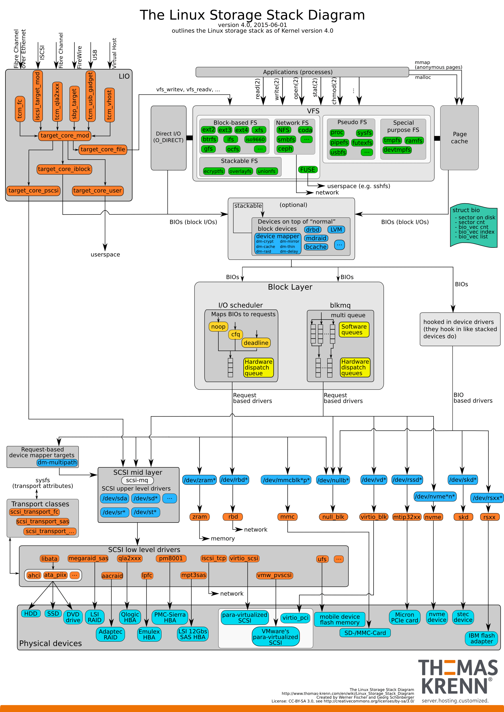
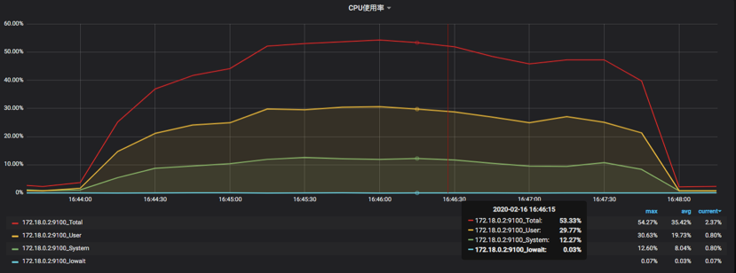
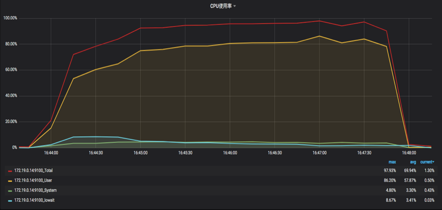
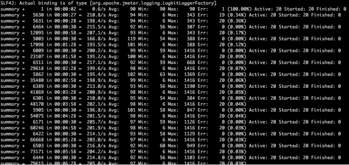
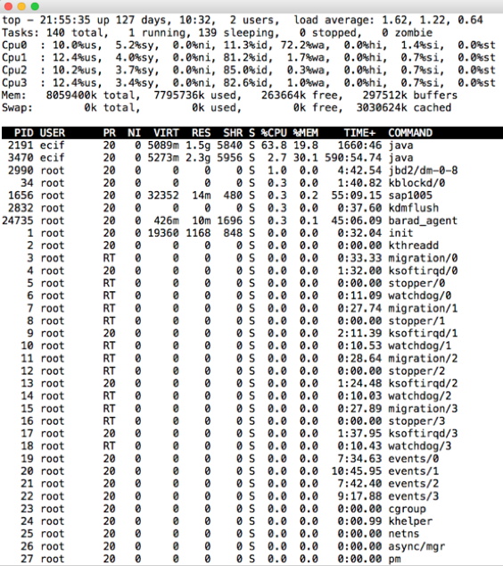
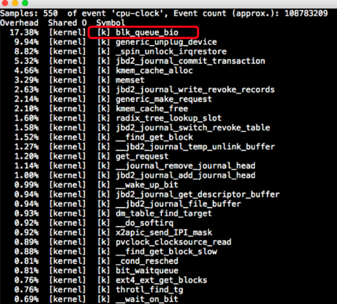
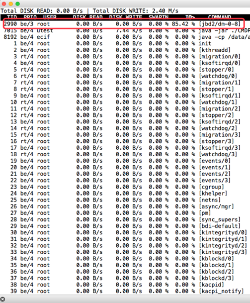
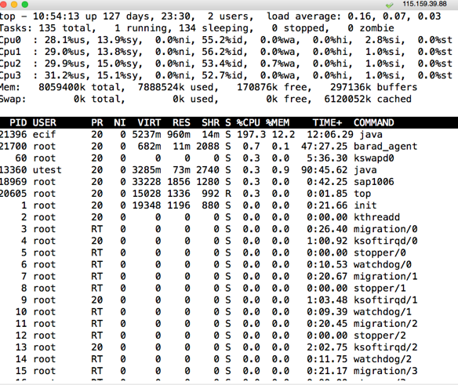
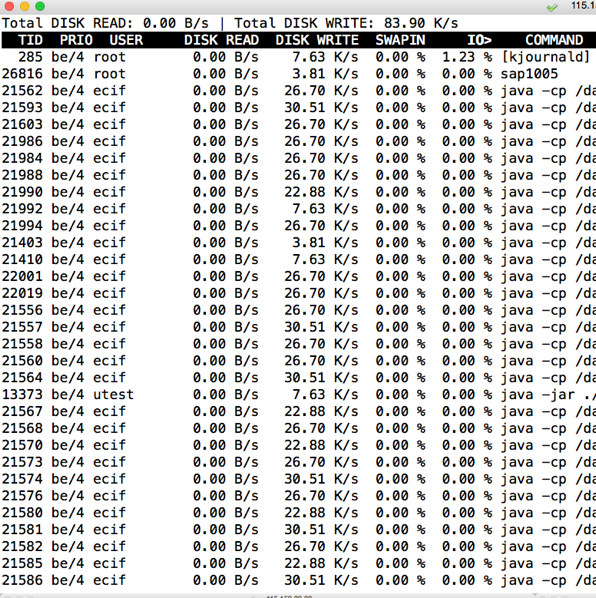

# 31丨案例：当磁盘参数导致I/O高的时候，应该怎么办？
在大部分的性能项目中，当系统调优到一定程度的时候，性能的瓶颈往往会体现在两类计数器上：一个是CPU，另一个就是磁盘I/O了。所以我们也经常会在一些性能优化的文章中看到两个分类，分别是CPU密集型和磁盘I/O密集型。

有人说为什么不说内存呢？内存是那么重要。不是说内存不会成为瓶颈，只不过内存的瓶颈基本上都可以转嫁给CPU和磁盘I/O。当内存不够的时候，大不了就是清理得快一点。内存能表现出来的，就是满不满，而谁去清理呢？那就是CPU了。清理得快就得CPU转得快。

我们经常会听到有人说什么性能优化到最后就是“空间转时间、时间转空间的优化”。如此带有禅意的一句话，其实意思就是，CPU不够用，就扩大内存；内存不够，就让CPU计算得更快一些。

举个例子，当我们需要在内存中使用很多变量时，如果内存不够，就会导致CPU不断清理内存中没被引用的变量来释放内存，这就导致了释放内存的动作会消耗更多的CPU。而这时，我们就可以用增加内存的方式，让CPU不那么繁忙。

但这个“空间、时间转化”的论点并不会在所有的场景下成立。比如说一个应用并不需要多大内存，就是纯计算型的，那你加内存也没啥用。另外这里提到的“空间”也不是硬盘，因为如果CPU不够用，拿再多磁盘补也无济于事。

所以这句话只能是做为高深谒语让初入性能的小白们仰望，实际上适用的场景非常少。

而磁盘I/O和内存有很大的区别。只要系统需要保存运行过程中留下的数据，那就必然会用到磁盘I/O。分析磁盘I/O的时候，相对于其他的分析环节还是要复杂一些，因为磁盘I/O栈是比较长的。有了Direct I/O技术之后，磁盘I/O栈短了一段，速度快了，但是同样也没有给性能测试分析人员带来什么福音，因为从分析的角度来说，我们看计数器并没有减少什么。

在性能分析过程中，操作系统是绕不过去的一个环节。在当前的技术栈中，我们仍然要把操作系统当成一个非常重要的环节。

现在对于I/O的分析和判断，大部分还停留在磁盘百分比、队列、磁盘延时之类上。可是这样的计数器的值多了，少了，你要干什么呢？怎么解决它呢？是磁盘参数有问题，还是应用有问题？还是磁盘硬件能力就那样了？

这是性能分析人员应该给出的答案,可是有很多性能测试工程师还真的给不出来这样的答案，甚至有些人连哪个线程导致的I/O高都判断不出来。至少现在的状态说明了，性能测试行业还远远不够成熟，我们还有很多的机会。

现在我们所说的I/O，基本上把File I/O和Disk I/O都说进去了，所以在分析上，层级更是非常模糊。如下图所示的一个I/O栈：



(此图来自于： [https://www.thomas-krenn.com/de/wikiDE/images/b/ba/Linux-storage-stack-diagram\_v4.0.png](https://www.thomas-krenn.com/de/wikiDE/images/b/ba/Linux-storage-stack-diagram_v4.0.png))

在这个图中，我们可以明确看到磁盘I/O栈有多长。从应用层开始，产生系统调用，再通过visual FS Layer → FS Layer → Block Layer这样一层一层地调用下去，最后才写到了硬件存储里。

当然还有一层，我们需要关注的就是从系统的全局状态到具体的线程，这个我在操作系统那一篇的I/O部分已经描述过。

下面我们来看一个I/O高的分析案例。

## 案例现象

在这个项目的压力测试过程当中，发现了经典的现象：

1. **TPS上不去**；
2. **硬件资源用不上**。

应该说，性能分析要是分类比较宽泛，基本上是两种。

**第一种是资源用不上，TPS上不去，响应时间随压力而增加**，如下图所示：



**第二种是资源用得上，TPS上不去，响应时间随压力而增加**。如下图所示：



这样的划分方式看似有调侃味道，却是很多人疑惑的起点。为什么这么说呢？

我们在开始做性能分析的时候，经常会面对这种情况，那就是资源用不上去。也就是路不够宽，硬件资源才用不上的。我们要解决的，就是把路扩宽一些。

但是，当我们面对一些客户或领导的时候，如果去汇报某资源使用率达到100%这样高的值的时候，有可能得到的一个反馈是，能不能把资源使用率降下来，因为资源使用率高会让人有种不安全感，而TPS反而不是关注的重点。这就让我们很疑惑：TPS上去了，资源必然用得多呀，难道让资源使用率稳定保持在50%，而TPS蹭蹭往上涨吗？这不现实呀。

我的建议是，不用怕资源使用率高，做为专业性能分析人员，更应该怕的是资源使用率不高！

在这个例子中，一开始同事跟我描述的时候，说 **资源怎么也用不上去，TPS也上不去**。这样的描述很常见。

还是看看压力结果，如下所示：



（场景开始时报了少量的错，不过这不是我们这个案例要分析的部分，请看官忽略。）

像这种描述，基本上没办法让人分析，因为信息太少了。特别是有些人直接给一个固定线程数的压力结果，用来描述资源上不去的情况，这就更得不到有用的信息了，所以问性能问题的人一定要注意收集足够的信息，不然只能让人从头查一遍。

## 分析过程

因为没有什么具体的信息，所以我只能让同事把压力再压起来。

我登录到服务器上之后，顺手执行了一个top命令：



这里给个小提醒，执行top的时候一定要习惯性地点一下数字1，这样可以把所有的CPU都列出来，因为我要看到每个CPU的各个计数器的使用率。别看这个动作不起眼，就算是这一个小小的操作，也是工作经验的积累。

果不其然，看到了一个问题，那就是上图中CPU0的wa达到了72%。像这样的问题，如果不看每个CPU的每个计数器，是发现不了的。

看到这样的东西，我们要有个基本的判断，对于一般的Java应用来说，I/O线程数基本上不会是1个，除非是特别的理由，所以这种情况还是很少的。

不过既然是I/O的问题导致了wa CPU使用率高，那么我来看一下CPU的热点在哪个层面。这是我在工作中经常执行的一个动作，因为我不想在后面的分析过程中偏离方向，而看CPU热点可以让我记得这个方向。

如下图所示：



有人说，即然wa CPU使用率已经高了，接下去直接看磁盘I/O不就行了，看不看CPU热点还重要吗？我要说，当然重要！看到前面的磁盘I/O栈了吗？那么长，怎么知道是在哪一层呢？

这是定向细化分析过程中的经验之一。

在CPU热点中我们看到了，是内核模块中的blk\_queue\_bio消耗的CPU大。blk\_queue\_bio是用来做I/O调度合并的，可以对I/O请求进入后向、前向合并操作，互斥方式就是加锁。

根据它我们就可以知道，这是一个有queue的调度过程，再接着看它下面的几个函数也可以看出，都是kernel级的调用，并没有user级的调用，这几个函数基本上也说明了当前系统忙于journal写。

接着执行iotop，看是哪个进程在做这个动作。这里可以看到jbd2，和上面CPU热点的函数也是对应得上的。



那么jbd2是个啥玩意呢？jbd2英文名是这样的：Journaling Block Device 2。

它是跟着ext4格式来的，当然它也可以在其他磁盘格式下工作。这个进程的工作原理是这样的：文件系统写入数据，要提交给驱动程序，而jbd2就是在文件系统调用驱动之前工作的。文件系统要先调用jbd2，然后jbd2会根据系统的设置（设置有writeback、ordered、journal），进行数据的备份，然后再让文件系统提交数据。当文件系统将数据写入了块设备之后，jbd2就会把备份的数据删除。如果文件系统写块设备时出了问题（比如说可悲的断电），那jbd2这里还有一个备份，在进行完整性检查时就会把数据补全，所以数据不会丢。

jbd2就是这样保证数据的完整性的。

但是！对嘛，我就喜欢说但是。jbd2保证的数据完整性也只是一个原子操作的完整性，即一个原子操作如果操作了2M的数据，它就只能保证这2M的数据不会丢失。如果你一下子操作了1T的数据，jbd2也不能保证完整性。

jbd2有一个参数barrier，它用来开启磁盘屏障。就是设置一个栅栏，要先把barrier之前的数据全都写到磁盘设备之后，才会写barrier之后的数据，也就是说它是用来保证原子操作中数据的完整性的。当然了，开启barrier的一个后果就是性能下降。

了解了这些内容之后，我们就要判断一下了。这个应用有没有必要用这个功能来保证原子操作的完整性？我考虑了一下之后，觉得这个应用就是写日志而已，也没有其他什么重要的东西是要写日志的，重要的业务数据都写到数据库去了。

所以，没必要保证数据写入的完整性，就算丢了一些日志数据又怎么样呢？如果真的就那么寸，应用出现大bug，恰好块设备也出问题，或者断电，那真的只有烧香拜佛了。

于是我觉得这个功能不用也罢，把原理说明白之后，和架构组、开发组、运维组以及领导层们沟通了一圈，告诉了他们原理，实在是没有打开的必要。

最后大家一致同意：关掉！

我们再回过头来看下这个参数：

```
[root@主机A]# cat /proc/mounts
/dev/mapper/data_lvm-data_lv /data ext4 rw,relatime,barrier=1,data=ordered 0 0

```

上面的这个barrier=1，就是我们要找的目标。想关了它，就是挂载磁盘的时候使用挂载选项-o barrier=0或者nobarrier。我这里是直接设置为0的。

你也可以直接关掉journal功能：

```
tune2fs -o journal_data_writeback /dev/mapper/data_lvm-data_lv tune2fs -O "^has_journal" /dev/mapper/data_lvm-data_lv e2fsck -f /dev/mapper/data_lvm-data_lv

```

## 问题解决之后

我们再来看下问题解决后的压力工具结果：


从压力结果来看，同样的压力之下，TPS增加了一倍，响应时间快了一倍。

top如下所示：



集中的wa CPU也消失不见了，现在使用的也挺均衡的了。

iotop：



在I/O top的结果中，也看不到I/O非常高的jbd2了。

问题得到了完美地解决。

## 总结

不管是什么样的性能问题，其实从分析思路上仍然逃不开我一直提到的思路——那就是一个分析的完整链路。当你一层一层往下找问题时，只要抓住了重点，思路不断，找到根本原因就可以解决问题。

在这个I/O的问题中，难点在于怎么能知道jbd2的原理和参数。应该说，不管是谁，都不能保证自己的知识体系是完整的，那怎么办呢？查资料，各种学习，看源码，看逻辑。实在看不懂，那也没办法，接着修炼基础内功呗。

所以说性能测试行业中，经常只测不分析，也是因为做性能分析需要的背景知识量有点大，还要不断分析各种新的知识点。不过也就是因为如此，性能测试和性能分析才真的有价值。只测不调只是做了一半工作，价值完全体现不出来。

## 思考题

最后问你两个问题吧：为什么TPS上不去时，资源用不上才是更让人着急的问题？以及为什么要在CPU高时查看CPU热点函数呢？

欢迎你在评论区写下你的思考，我会和你一起交流。也欢迎你把这篇文章分享给你的朋友或者同事，一起交流一下。