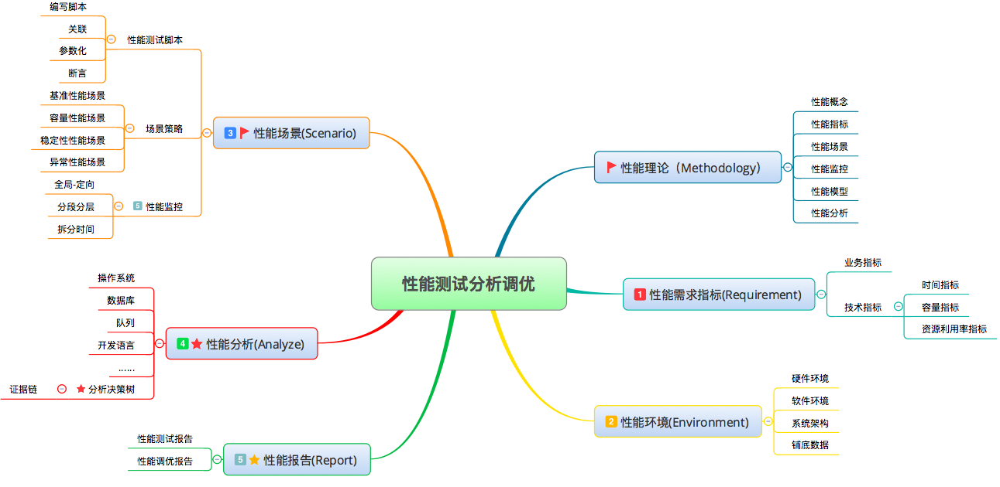

# 结束语丨见过林林总总的乱象，才知未来的无限可能
这是专栏的结束语了。

我是不是应该用欢乐范表达一下？

> （眉飞色舞地）时光飞逝，终于就写完了，顿感轻松。如今大赦，心情特好，就等着疫情结束出门去浪？

或者用获奖感言范表达一下？

> （声泪俱下地）专栏写得真辛苦，我搭建了很多环境来证明一个个技术点。每天干到一两点，一周也可能憋不出一篇。为了一个k8s截图，我自己搭了一个k8s环境，并且弄个应用跑起来，以确保我所有的内容都是原创（除了为了抨击而引用的部分）。

亦或者用胸怀天下范（又称喷子范）表达一下？

> （痛心疾首地）当今性能市场杂乱无章，误导横行。写这个专栏就是为了给性能领域中一些迷途的羔羊以指导，让你找到职业的方向。也让你知道，在性能领域中，还有很多真正在干性能的人，而不是只有那些会一两个压力工具出一个罗列数据的报告就在各个场合张牙舞爪吹嘘的人。

然而以上各个角度的描述都显得单调了。虽然专栏完成之后有轻松感，但是从真实的感觉上说，也没有特别轻松，就是平平淡淡地完成了一件事情，一个项目。

性能市场还是有很大空间，性能也还有很长的路要走，它远远没有到精致的程度。

我在很多安全性很高的机房中看到过大量的硬件资源浪费，也看到过很多的线上系统配置得一塌糊涂，也看到过经过了性能测试但上线就死的系统，也见过明知道会死但为了任务必须上线的系统。

我也优化过上线多年的系统，发现长年运行在性能瓶颈已经出现的状态当中，就是因为没有性能调优，业务部门苦不堪言，技术团队频招白眼。其实只需几个优化步骤就能让各方满意。

这林林总总的现象都告诉我，性能的价值是完全可以体现出来的。但为什么现在的性能和性能分析职位却如此没落？

绝大部分性能工程师只是懂些压力工具、监控工具的使用，但对分析一筹莫展。业务团队、架构团队，包括老板们对性能团队的期望均因为立场、角度不同，才让性能团队左右为难。最典型的体现就是性能需求的不确定性以及沟通的困难。

而性能行业不具备统一的专业认识也让行业迷失在众多岔道之中。人人各持己见，却少有人能结合实际工作经验做精致的落地。让空中楼阁似的理念和实施过程产生了严重脱节。

而初入性能行业的人因为看不到全景概貌，从而云里雾里，东一榔头西一棒槌地学习着片面的知识点，又使职场和行业更为混乱。

那希望在哪里呢？

其实我在很多场合都说过，技术职位的存在是由于业务发展的需要。至少经过测试分析优化之后，生产环境不会出现低端的问题以及资源的大量浪费。

说到这里，性能优化的价值其实就已经非常明确了，性能团队的存在也就有了充分的理由。

那就是 **必须有结论**。

如何才能合理地看待性能这个话题呢？

我一直都觉得性能应该是从需求到运维的视角去解析。只有这样去看它，只有这样去具体实施它，它才具有真正的价值。

而在这个时候，它就不再是测试角度的一个附属，它就是一个 **完整的性能工程**。

前几年，我也一直在思考一个问题，那就是：我的经验，我走过的弯路，能给这个行业，或者说相关的从业者带来什么？

工具的使用？我觉得没有什么价值。对于一个爱学习的人来说，工具只要看说明书，也能玩个八九不离十了，为什么要花钱买工具使用的书或专栏呢？

写分析的逻辑吗？一个个具体的分析案例，兴许是一个可写的点，可是这些分析的逻辑如果不能复用，它们存在的价值就只能是“仅供参考”。

我在很长的时间内都只做企业内训，因为我觉得站在企业架构级的视角，性能才有价值。

后来我终于想明白写专栏的价值，那就是：将性能领域中的理念和分析逻辑按自己认为正确的方向梳理一遍。

整体来说，我的性能测试分析调优观就如下图所示：

我把这个提炼逻辑总结一下就是： **RESAR性能方法论**。

这里不是在简单的描述测试过程，而强调其中每个环节中要做的事情，注重每个环节的精致细节。

希望你能体会到这一点。

这个梳理的过程，更多的是为了把我认为有价值的东西抛出去，不再死守着自己认为对而别人又不知道的道理，痛心疾首地埋怨着行业的不争。写出去之后，我就可以放下这些内容再往前走了。

不管你看到这个专栏的感觉是什么样，可能会不认可，也可能认可我说的话。无论你觉得我自大自负也好，觉得我狂悖也好，觉得酣畅淋漓也好，我都接受。

因为我写出了自己想写的内容。

专栏已经完结，里面的案例、分析思路都是经验所得，可能有些细节上不够考究，所以我会在后面把这些不考究的点在思维中完善起来，也很感谢给我提过意见的你。

希望你能喜欢这个专栏，能记得有一个做性能的人如此偏执。

我会一直站在性能的路上，希望以后和你有切磋的机会！

