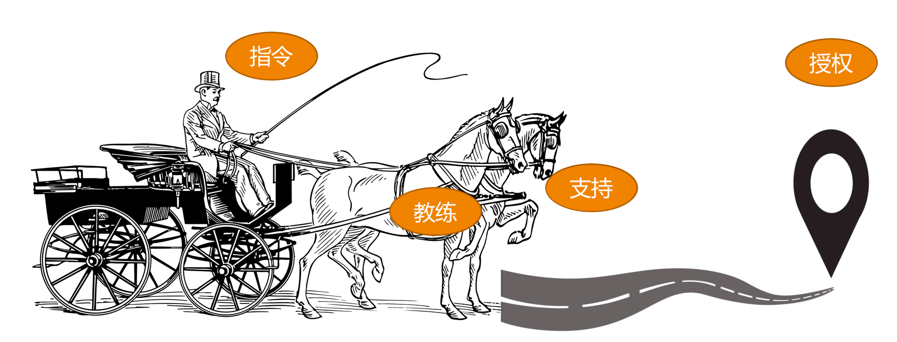

# 06 | 我这样的风格能做管理吗？
有不少管理候选人，会小心翼翼地问我：“我是个内向的人，不像A那么热情洋溢，让我慷慨激昂地给大家打鸡血会很有挑战；我也不像B那么强势和有威严，让大家都服我似乎并不容易。这样看起来，我是不是不适合做管理呢？”

在女经理群体中，有一个常见的困惑是：“我是个女生，不喜欢和大家抽烟喝酒扯闲篇，很难和大家打成一片，带团队对我来说太挑战了！”

还有些管理者很苦恼地说：“我也想成为像某某那样的管理者，可是长时间下来我做不到，怎么办呢？”

甚至有位做了五年管理、带几十人团队的经理，问我一个困惑他多年的问题：“管理者是不是不能太nice？”因为在他看来，亲和力太强的领导，下属会不敬重，因为不够威严。

类似这样的疑问还有很多，它们的共同模式是：先设置一个所谓“好”的管理方式和行为风格，然后发现自己做不到，于是很苦恼。

下面，我就来谈一谈管理风格的问题。

模仿，是人们学习新技能非常重要和常用的方式。当你尝试做管理的时候，也可能在不断模仿那些你认为“最优秀”的管理者，并希望像他们一样“成功”。

榜样给了你前进的方向、动力和信心，这对你的成长是很积极的影响。但不经意间，榜样同时也左右了你的认知，所以需要提醒自己一个问题：别让榜样限制住你对优秀管理者的想象，以及别把领导力的风格和领导力的高低划上等号。

事实上，优秀的管理者风格各异，比如马云、马化腾和马斯克，都能把企业做那么大，而且名字里都有“马”字，但是你能感受到他们的风格是如此不同。可见，领导力风格的差异并不妨碍你成为一个优秀的管理者。那么到底什么是领导力风格呢？而你自己又最适合哪种风格呢？

关于领导力风格，或者叫管理风格，如果你去网上搜索，会看到很多不同的视角和说法。如果真要给这些不同的说法找到一个底层的逻辑，我认为 **所谓管理风格，本质就是你和团队的协作方式，也就是你和团队的“位置关系”，即你站在团队的什么位置**。如果还是难以想象，你可以把带团队，看作是在驾驭一辆马车，你和这几匹马是如何协作，一起把车拉到目的地呢？

其位置关系大体可以有这样四类：

四类管理风格示意图

**第一类是发号施令型**。管理者和团队的关系是：管理者发号施令，全程指挥，但不会亲力亲为去操作，团队成员只要按管理者说的做好执行，不需要问为什么。就好像一位坐在马车上驾驶车辆的车夫，他不参与拉车，但是马匹的一举一动，都听命于他的指令。所以，我们常常把这种管理风格，叫做 **指令式管理**、命令式管理，或者指导式管理。

这样的管理者带给团队的往往是很强的控制气场和压迫感，没有人情味，让人有距离感，最符合大众眼中的“领导”的形象。这类管理者往往 **重事不重人**，眼睛盯着目标和结果，对人的发展和成长关注较少。所以，通常团队执行力很强，但是梯队很难培养起来。

**第二类是以身作则型**。和指令式管理者很少亲力亲为的做法相反，以身作则的管理者凡事冲在最前面，是站在马匹中间，和大家一起奋力拉车的人。这类管理者非常享受和团队打成一片，很像一位身先士卒的将军，战斗力很强，很受团队拥戴，所以往往团队凝聚力也很强。

他们非常在意团队成员的想法和感受，并愿意提供帮助和支持，分担他们的工作和困难，因此我们称之为 **支持式管理**。对于这类管理者来说， **重人不重事**，不过他们并不会忽视做事，只是不太去指导员工做事，而是倾向于直接替员工做事。

这类管理者更像一个带头大哥，员工会特别有归属感，但是这类管理者往往带不了大规模团队。

**第三类是激发辅导型**。这类管理者不会亲力亲为去帮员工做事，但是会去辅导和启发员工怎么去完成工作，并且提供鼓励、支持和反馈。换句话说，他们不会去替马拉车，但是会陪着马一起赶路，同时辅导马匹怎么样能够把路走好，以及要往哪里走。

这有点像球场上的教练，他们不上场，但会把握比赛节奏和方向，不断给球员提供指导和反馈。所以我们把这类管理风格称为 **教练式管理**。教练式管理者既关心员工在做事的过程中有没有得到锻炼和成长，也关心事情本身有没有很好地完成，整体的步调和节奏如何，以及最后结果的好坏，属于 **重事也重人**。

在这类管理者团队做事，个人成长是最显著的，团队梯队也能快速完善起来。但是由于这类风格对于管理者精力消耗比较大，很难覆盖到全体成员，所以比较适用于核心梯队的培养。

**第四类是无为而治型**。无为而治，似乎是很多管理者向往的境界，很多高级管理者都认为好的管理者应该是“没有我的时候，团队完全能自行运转”，第四类风格就有点这个意思。

他们往往安排好任务就“撒手不管”了，把工作完全授权给了团队成员，只是在约定的时间去检查结果是否达成，所以这类风格我们称之为 **授权式管理**。就任务执行过程来看，他们是 **不重人也不重事** 的。

这类管理者对团队成员做事表现得非常放心，甚至让大家感觉有点漠不关心；对任务执行过程不关心，关心的只是他最在乎的目标和结果。在这类管理者团队中做事，对于不成熟的团队，成员就会变成野蛮生长；而对于成熟的团队，成员就会有很好的发挥空间和舞台，反而会得心应手。

综合上面所描述的四类领导力风格，简单概况如下：

1. **指令式管理：重事不重人**，关注目标和结果，喜欢发号施令但不亲力亲为。
2. **支持式管理：重人不重事**，希望带头冲锋亲力亲为，特别在意团队成员的感受，并替他们分担工作。
3. **教练式管理：重人也重事**，关注全局和方向，并在做事上给予教练式辅导和启发。
4. **授权式管理：不重人也不重事**，关注目标和结果，不关心过程和人员发展。

为了加深理解，我再用一个案例来示意一下。

三国的故事，中国人都耳熟能详，其中有一段叫“刘备入川”：刘备在落凤坡损失军师庞统之后，就调集荆州的诸葛亮来支援西川，这时诸葛亮就需要把守卫荆州的重担交给刘备的二弟关羽。那他将会怎么样嘱托关羽呢？

我们来看看四类不同风格的诸葛亮，会如何对关羽说呢？

**指令式** 的诸葛亮会说：“我把荆州托付给你，你对曹操要采取抵抗的策略，而对东吴一定要采取联合的策略，你一定要照我说的做，否则荆州肯定会丢。”

**支持式** 的诸葛亮会说：“兄弟，我去支援主公，没法和你一起守荆州了，但是有什么问题你随时告诉我，我全力支持！”

**教练式** 的诸葛亮会说：“云长，荆州这个重担就交给你了，如果曹操来打荆州，你打算怎么应对呢？如果曹操和孙权一起来打，你又会怎么应对呢？”听完关羽的方案，教练式的诸葛亮会给出自己的建议：“你这么做荆州比较危险，你可以参考我的策略：北拒曹操，东和孙权。”

而 **授权式** 的诸葛亮会说：“云长，荆州就交给你了，你要确保万无一失，我相信你一定能搞定！”

所以你看，不同的风格，对于同一个事情，做法差别是很大的。那么，你会是哪种管理风格呢？你的上级和你认识的管理者，他们又偏重于哪个风格呢？我相信你心里已经有数了。

也许你会再问：“到底哪种风格最好呢？文章开头的几个问题还是没有答案啊。”

我想说，既然叫风格，就是手段层面的东西， **评价手段我们往往是用有效无效来衡量，而不会用好坏来衡量，所以，这四类风格无所谓谁好谁坏**。一个成熟的管理者应该对这四类风格都能有很好的了解和认知，甚至是能驾驭。

不过，不同的风格，在不同的场景下，的确会有不同的适用程度，我就简单列出几个场景做一些说明：

当一项工作不容有闪失，而你又是唯一熟悉、且最有掌控力的人时，一个命令式的你可能更能降低风险、达成目标。所以，命令式管理最适用于需要强执行的场景。

当一个团队特别需要凝聚力和斗志，需要攻坚的时候，一个支持式的你会促成很好的效果。所以，支持式管理特别能带团队士气和凝聚力，在带动大家热情和积极性方面很有优势。

当有一些核心人才需要重点培养，团队需要发展梯队的时候，一个教练式的你会带来明显的效果。他们不但能把事情做好，个人能力还能成长。虽然执行速度通常不会太快，但是不会偏离方向。

当团队梯队很成熟，团队成员需要发挥空间的时候，一个授权式的你能提供最恰当的管理方式。

当然，如果你能驾驭多种风格，那是非常厉害的。大部分管理者都还是以自己最拿手的风格来带团队，其他方式仅在必要时使用。

既然管理风格的本质就是你和团队的协作方式，是手段层面的东西，那么，不同的风格并不会妨碍你成为优秀的管理者，你自然也可以有自己的管理风格，不是吗？在专栏的后期，我还会继续探讨如何基于自己的风格，走出一条属于自己的管理之路，一起期待吧！