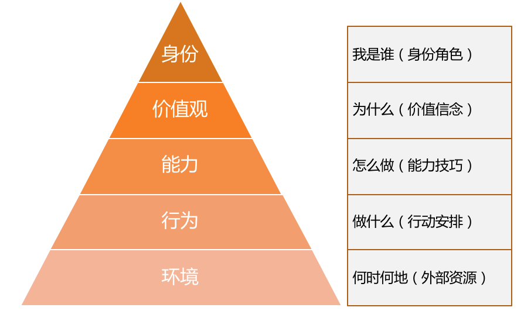
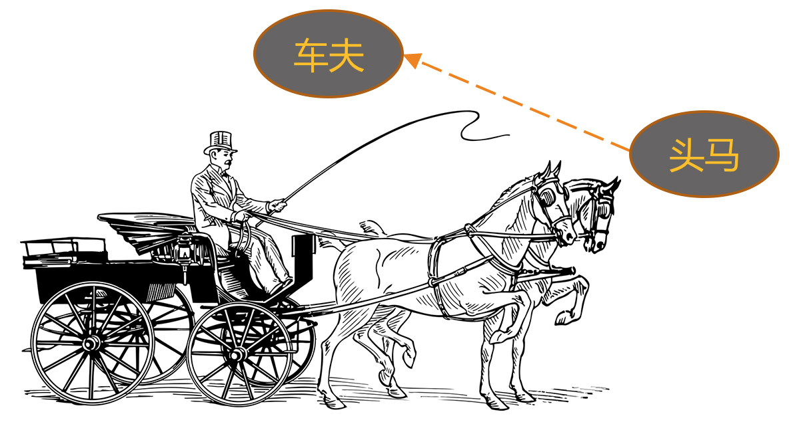
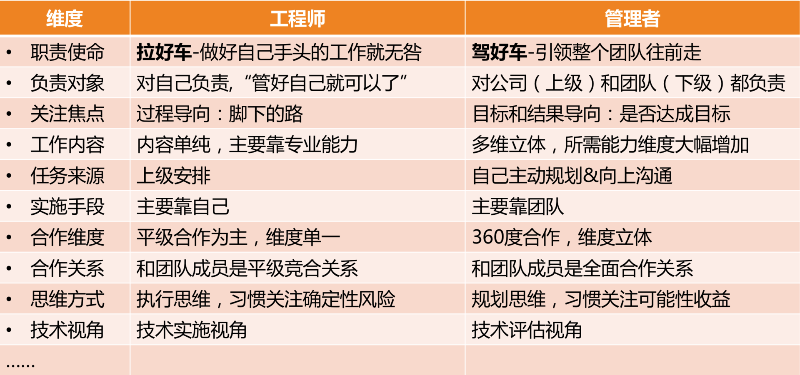

# 09 | 从工程师到管理者，角色都发生了哪些变化？
我们常常会用“很职业”去形容一个人某项工作做得很棒，意思是说，他很出色地做到了职位所期待和所要求的标准。那么，一个职业的管理者应该是什么样的呢？显然，他也要符合管理者这个角色的期待和要求，具体是什么呢？今天我们就来聊聊管理者角色认知的问题。

我曾经系统地访谈过一家著名互联网公司的几十位新经理和他们的上级经理，发现了一个很有意思的现象：新经理们希望我能够提供给他们一些工具和方法，让他们应对好日常的管理事务；而他们的上级经理，则无一例外地认为新经理最需要提升的是管理认知，其中最核心的就是管理者角色的认知和理解。

难道是他们之间存在分歧吗？我发现并不是，他们所期待的其实是同一个需求，只不过是同一个需求的不同层次，新经理的需求在能力层，即我们常说的“术”的层次；而他们上级的需求则在认知层，即我们常说的 “道”的层次。

显然，上级是希望新经理通过认知的改变，从而达到他们能力和行为上的改善。这恰恰呼应了罗伯特·迪尔茨的“NLP逻辑层次图”，一个人的行为、能力、价值观，都源于一个最根本的认知，就是自我角色的设定。

NLP逻辑层次图

今天我们就来详细地探讨一下，从一名职业的工程师，到一名职业的管理者，在角色上都有哪些东西发生了转变。

为了让这个角色的转换过程更加生动易懂，我再次拿出之前提到的“马车模型”。当你是一名出色工程师时，就好像马队里的“头马”，显然你是团队里最给力的人，也是你的上级最倚重的人；而当你成为这个团队的管理者，你就实现了一次蜕变，从“头马”转变为“车夫”，这个角色的转变对你来说意味着什么呢？

角色转换示意图

下面，我从以下十个角度，来说说我的看法。

**第一个角度**，从 **工作职责** 来看。作为“头马”时，你的核心职责是“拉好车”，其他事情都是次要的；而成为“车夫”后，虽然你依然可以去帮你的马队拉车，但你的核心职责却是“赶好车”，即如何确保这辆马车良好地行驶在正确的方向上，才是最需要你关心的。

对应到工作中就是，你做工程师时，完成好上级安排给你的工作就诸事大吉；而作为一个管理者，你要做的是带领整个团队往前走，上级只是帮你设定一个目标，剩下做什么、怎么做，都是你要考虑的，所有对达成目标有帮助的工作都是份内的。这就是“赶车”和“拉车”的不同。

**第二个角度**，从 **负责对象** 来看，即，你需要对谁负责。作为一名工程师，用他们自己的话说，“管好自己就可以了”，所以主要是对自己和自己的工作负责。而作为一名管理者，由于团队是上级和公司给你的资源，你需要对上级负责；你还得关心团队成员的发展和成长，对下级负责。

所以一个同学曾经幽默地比喻：做工程师是“一个人吃饱全家不饿”，做管理就是“上有老下有小”。我觉得非常贴切，更高的职位的确意味着更多的责任。

**第三个角度**，从 **关注焦点** 来看，也就是什么对你来说是最关注的。工程师一般是过程导向的，因为他们需要一步一步把工作执行到位，眼睛盯着的常常是“脚下的路”；而管理者是目标和结果导向的，他们时时关心目标和前进方向，盯着“远方的目标”，因为他们得决定要带着团队去哪里。

**第四个角度**，从 **工作内容和能力要求** 来看。工程师属于个人贡献者，也就是HR口中说的IC（Individual Contributor），是靠个人专业能力来产生业绩的，工作内容以发挥专业能力为主，相对比较单一；而管理者要做成一项工作，除了技术判断力，还需要目标管理能力、团队规划能力、项目管理能力、沟通协调能力、团队建设能力等等，需要看方向的、带人的、做事的更加多维和立体的能力。

**第五个角度**，从 **任务来源** 来看。工程师的工作任务来源，主要是上级安排，听上级指挥；而管理者的工作内容，虽然也有上级工作的拆解和安排，但更多是靠自己筹划，然后和上级去沟通确认，从被动“等活儿”变为主动规划。

**第六个角度**，从 **实施手段** 来看。大部分工程师的工作还是要亲力亲为的，因为工程师角色是个人贡献者角色，所以主要靠自己完成。而管理者的工作清单涵盖了整体团队的工作，靠自己一个人是无论如何都做不完的，因此主要是依靠团队来完成。

**第七个角度**，从 **合作维度** 来看。工程师主要的合作内容就是和平级的伙伴共同做好执行，因此主要以平级合作为主。而作为管理者，合作的内容非常丰富，比如，需要和上级合作规划好整个团队的目标，和下级合作做好落地执行，和平级管理者合作完成联合项目，有时候还需要和平级的上、下级去一起协调资源和进度。所以合作的维度变得非常立体。

**第八个角度**，从和团队成员的 **合作关系** 来看。之前做工程师的时候，和大家都是平等竞合关系，以合作为主，也有“竞”的成分。

我们通常爱把“竞”和“争”连在一起说，但“竞”和“争”还是不同的。“争”意味着大家拼抢同一个东西，我得到的多就意味着你得到的少，此消彼长，比如摔跤、乒乓球、下棋等都是典型的“争”。而“竞”是朝向同一方向做比较的，比如百米赛跑、跳高、跳远等田径类比赛是典型的“竞”。

在之前平级的时候，你和其他同事虽然不会有“争”，但是有“竞”的成分在。而当你成为大家的上级，作为管理者来带领这个团队的时候，你和大家反而形成了全面合作的关系，“竞”的因素不存在了。因为“竞”和“争”都是发生在同一层次上的，要在同一个场地和同一个起跑线上，才有所谓的“竞争”；而随着你的晋升，你和之前的同事已经不在同一个层面上工作了，也就不存在“竞”的关系了，而是彼此间荣辱与共、休戚与共、成败与共的全面合作关系。

这一点新经理一定要认识到。我之所以特别强调这个观点，是因为很多新经理成为之前同事的上级之后，和大家相处有心理障碍，不太好意思指挥和安排他们的工作，用他们的话说，“毕竟之前都是平级”。我想告诉你的是，你们的关系其实比以前更好相处了，前提是你得认识到这一点。

**第九个角度**，从 **思维方式** 来看。做工程师的时候，大部分工作内容和工作要求都是执行，所以是明显的“ **执行思维**”，特点是关注过程和细节，更重要的是关注风险和成本，希望通过对风险的排除和成本的掌控，来保证工作交付的确定性。

所以技术出身的人往往在项目执行，尤其是过程控制管理方面，有明显优势，他们天然就认为这不是什么难事。当然，他们估算排期一般也会比较保守，因为他们需要确保能完成才愿意答应。

而作为管理者，虽然也考虑风险和成本，但是更习惯于去关注做一件事能带来的可能性收益，并以此来判断是否值得投入资源去做，我们把这种叫“ **规划思维**”。

由于管理者总是在盘算和筹划一些可能会对公司和团队有价值的事情，而没有仔细考虑风险和成本，所以在工程师的眼中，管理者时不时会提出一些“不靠谱”的期望和需求，但这正是两个角色关注的东西不同造成的。而这恰恰是一种很好的合作与互补：赶车的看方向选路径，而拉车的排除各种风险和困难，把车拉向前方。

**第十个角度**，从 **技术视角** 来看，即两个角色该如何看待技术。这个角度我们在前面的文章中已经探讨过，因为很多新经理都担心做了管理会丢掉技术，而其实只是看待技术的视角发生了变化。

做工程师的时候，技术是用来做事情的，掌握好技术的目的就是为了做好实施，看待技术是从如何运用的角度出发。而对于管理者来说，技术是达成目标的手段之一，所以看待技术是从如何评估的角度出发，评估该项技术是否是最合理的手段，以及如何选择才合理，并据此做出决策，因此常常被称为技术判断力。我们的老领导经常会告诫我们，即使做了管理，技术判断力不能丢，就是指这种能力。

至此，我从十个角度阐述了从一名工程师到一名管理者，角色上所发生的各种变化（如下图），但这就是全部了吗？显然还不是，你可以根据自己的经验，以及在管理工作中的体会和思考，不断丰富你对管理者这个角色的认知和理解。

工程师到管理者的角色转换

事实上，角色认知的改变，并不是一蹴而就的，需要你不断自我觉察和有意识地纠偏。也正是它足够基础和稳定，才会成为价值观、能力和行为这些层次的源头。

**很多新经理的上级经理和高管，在找我给新经理做培训时，都无一例外地明确提出，要“提升大家的管理认知”**。为什么呢？因为他们非常清楚，很多事情没做好，很多行为不职业，根源是认知还没有转变过来。所以，很多管理者的不职业，就集中体现在认知水平上。这也就引出了下一篇文章我们将要探讨的管理误区的问题。

那么关于从工程师转管理的角色转变，你有什么样的认知和理解呢？欢迎你留言和我一起探讨。

* * *