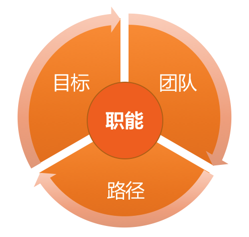

# 11 | 我刚开始带团队，从哪里着手呢？
一个快速发展的行业会推着你往前走，不会等你万事俱备了才让你带团队，泛互联网就是这样一个领域。

也许你还没想过要做管理，而且你的上级也并不希望你做纯粹的人力管理，但是“带团队”这个事情，却已经变得不可避免。换句话说，你叫什么不重要，头衔也不重要，重要的是，你很快就得带着一个小团队做事了。

很多人对于做技术，那是胸有成竹、毫不含糊，但是对于带团队这事儿，却常常不知道该从哪里下手。你是否也有这个困惑呢？类似的情形还有：

- 你需要接手一个新团队，而这个团队并不是你一点一点逐渐带起来的时候。
- 组织调整，把两个或多个团队的人塞给你，你正在考虑怎么整合这个团队的时候。
- 季度交替，或者年度交替之际，你需要给上级做一个阶段性的管理汇报，虽然有前人的汇报模板，但是“知其然不知其所以然”，不太能抓住核心的时候。

这样的一些时刻，你是否历历在目呢？还记得你是如何应对的吗？很多技术leader就这种情形给我出的题目常常是这样的：

- “新团队人员各种问题，各种人心惶惶，非常棘手，该怎么应对呢？”
- “新接手的服务各种问题，手忙脚乱，各种不靠谱……”
- “成天开会，各种业务讨论，顾不上和员工熟悉……”
- ……

诸如此类疑惑比比皆是。

显然，这些问题是不可回避的，而且这些其实都在正常的管理工作范畴内。只是，这类困惑有一个共性的问题在于，管理者都一下子陷在问题里了，期待着解决掉这些问题之后，事情就都好了，这是典型的 **问题驱动型思维**。

大家应该都知道大禹治水的故事：当洪水泛滥的时候，大禹之前的治理者都试图通过“堵漏”的方式来解决，效果并不好；直到大禹从之前的失败中汲取教训，采取“疏导”的方式来治理，引导洪水流向某一个方向，大水才由此得到了有效的控制。

这个道理大家都明白，只是我们在茫然和忙乱的时候，就一时全忘了。而作为一个leader，“堵漏”的工作固然要做，但是有没有一个“全盘规划”的指引，清不清楚把团队带往何方，这才是不同leader领导水平的差距所在。

而我们今天要谈论的“管理规划”，就是要回答“把团队带往何方”的这个方向性问题。通过理清未来的发展来理顺当前问题的带团队思路，我称之为 **规划驱动型思维**。

那么，关于团队方向的规划，具体该怎么操作呢？

你一定还记得我们前文中提到的“马车模型”，一个类似的问题是，一辆马车交给你，在驾驶它上路之前，你先做哪件事呢？

你可能会有很多的想法，但我觉得你至少需要思考四个问题。

## 第一个问题是，你需要先看一下，这是辆什么车。

你可能会问，“这是辆什么车有这样重要吗？”“管你是什么车，我都给你拉到目的地就行了呗！”而问题恰恰在于，如果你不清楚拉的是辆什么车，你就没法设定你的目的地，也不清楚该找什么马来拉，更不知道该走哪条路。

有这么严重吗？还真有。我举例来说明下：

- 如果你拉的是一辆长途旅行车。你的目的地就可以设定的非常清楚和鲜明，平安、快速、舒适地把客人送到指定目的地，就是你的职责和使命。你的车内是否舒适、马匹的选择是否快速、选择的路线是否安全等等都是你要考虑的。
- 而如果你拉的是一辆观光旅游车。你的目的地可以很清楚，也可以不清楚，因为你这辆车的使命在路上，核心是这个过程能否让观光客满意。此时，你的车体设计能否让乘客很方便观赏路上的景色、你的马匹选择是否速度适中、以及路线的选择是否风景优美，就变成了此时你要考虑的。
- 而如果你拉的是一辆送货的货车，那么你需要考虑的就是你的车是否满足货物要求的环境、一车次能拉多少货、以及马匹和路线的选择，以尽快到达交货地点。要考虑的问题和长途旅行、旅游观光，显然有着巨大的差异。

你还可以想到很多种马车，比如马拉雪橇、古代的战车等等。每辆车设计出来，都是为了满足特定需求的，你的团队亦是如此。

弄清楚它是一个背负着什么样职责和使命的团队，决定了你需要设定什么样的工作目标，并通过哪些要素来衡量你的目标；决定了你需要什么样的人加入你的团队，以及需要多少；还决定了你选择什么样手段，投入什么样的资源来完成工作。

这个问题是如此重要，以至于我把对于这个问题的回答，作为管理规划的第一个要素，称之为团队“ **职能**”。这是管理工作的起点。关于如何设定团队的职能，我将在下一篇文章详细介绍。而此时我最关心的是， **你是否可以毫不迟疑、非常简练地说出你团队的职责和使命呢**？

## 第二个必须要思考的问题是，你得看看，你要把这辆车拉到哪里去。

只有明确了要去的目的地在哪里，才能评估需要什么样的马、多少匹，以及有哪些路线可以选择。这个关于“目的地在哪里”的问题，是管理规划的第二个要素，称为“ **目标**”。

对于为什么要设定目标，很少会有人质疑，因为大家都认为设定目标是理所当然的事情。那么你有没有想过，为团队设定清晰的目标，可以带来哪些好处呢？

目标设定的最基本的初衷就是 **着眼自己想要的结果，去实现资源的有效配置**。除此之外，目标还有非常好的几个附加效果：

- 首先，清晰明确的目标可以凝聚团队成员的力量，让大家劲往一处使，提升团队凝聚力；
- 其次，清晰的目标还是执行力的必要要素，你可以回想团队取得的每一个执行出色的项目，目标一定是非常清晰；
- 再次，清晰的目标还能提升判断力，如果你能够对某个突发状况快速决策，你一定非常清晰你当时想要的是什么；
- 最后，清晰的目标本身就是激励，当员工很清楚自己的工作目标，方向感很清晰的时候，他们更容易进入心流状态，即，一种投入度非常高，沉浸其中、物我两忘的工作状态。

所以，你是否更加重视目标设定了呢？实际上，没有目标的团队很少，但是想设定清晰明确的目标，对于技术团队来说又是非常困难的，因为工程师的工作大部分难以量化。那么，如何设定清晰明确的目标呢？我们在后面的文章还会专门全面来探讨的。

## 第三个必须要思考的问题是，你得盘点一下你有哪些马，它们情况如何。

做管理的主要工作内容是“带团队”，因为所有的工作，都是靠团队来落地完成的，他们是真正“拉车”的人。就好像马匹是马车的动力之源一样，团队就是你达成团队目标和使命的发动机。

所以，盘点自己的团队，以及看看在整个“赶路“的过程中要如何升级完善自己的团队，并思考在达成目标之后你期待收获一个什么样的团队，都是必须要考虑的问题。这就是管理规划的第三个要素，称之为“ **团队**”，我们将会在后续的文章中专门探讨团队组织规划。

## 第四个必须要思考的问题是，你选择走哪条路。

也许你会说，前面有了职责，有了目标，有了团队，接下来不应该就是赶路了吗？我想说，在赶路之前，你还得先看看有哪些路可以走，即，你有哪些不同的选择，各自需要多少资源预算。

如果你选崎岖的近路，可能你需要非常贵重的马中的“特种兵”，并配给高精尖的装备；而如果你选择宽阔的大路，你可能需要跑得快、耐力强的马，路上带的补给也会因为路况而有所差异。因此，路径的不同选择，会带来资源投入的差异，从而，你向公司申请资源的类别和规模也是不同的。由于公司的预算是要提前做的，因此在马车出发前，即在规划的时候，就要算好。

这里我还需要说明一下，不要混淆路径选择和计划制定。这二者最大的区别在于，路径选择主要是为了预算资源，而制定计划主要是为了执行过程可控。

至此，我们已分别探讨了管理规划的四个要素，对应明确回答了下面这四个问题：

1. 你团队是干什么的？
2. 你团队想做出什么成果？
3. 你依靠什么样的团队？
4. 你需要投入哪些资源？

你的上级会很关心这四个问题（也可参考下图）。当你能系统地把这些问题清晰地呈现给上级时，说明你对团队已有了很好的掌控力，并且还会让上级觉得，这辆车，跑不偏！

“马车模型之规划四要素”

综上所述，所谓的管理规划，其实就是要管理者说明白一个问题，即，你想要什么目标，以及你需要投入什么资源。由于目标取决于团队的职能，而团队又是管理者的核心资源。所以，一份合格的规划报告，至少需要体现 **职能、目标、团队、路径** 这四个要素。

值得说明的是，这四个要素并不是彼此孤立和静止的，而是相互关联、动态平衡的（如下图）。其中最稳定的要素是职能，它是管理的起点。

“规划四要素”关系图

中国有句谚语叫“磨刀不误砍柴工”，磨刀虽然看上去花些时间，却能让后续的砍柴工作更加有效。作为管理者，花些时间来做做自己团队的管理规划，绝对是值得和必要的。那么，你大约多久会审视一下自己团队的规划呢？

* * *