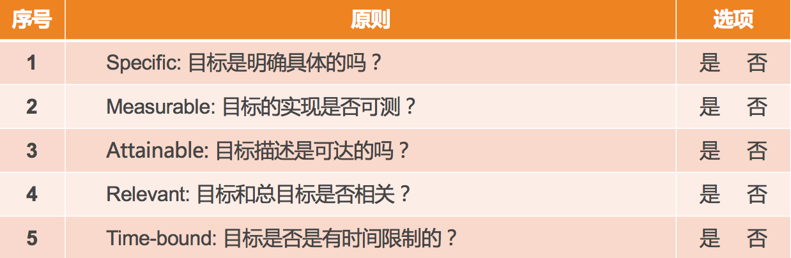

# 13 | 如何为团队设定合理的目标呢？
管理规划有四个相互关联的要素：职能、目标、团队和路径。在上一篇文章中，我们已经探讨了第一个要素，也就是如何界定团队职能。我想现在你应该很清楚自己团队该承担什么样的基本职责，以及希望背负什么样的使命了。

那么，接下来的一个问题就是，未来的一段时间里，三个月、六个月也好，一年也好，你希望带着你的团队抵达一个什么样的目的地呢？这就是我们通常所说的“目标”。今天这篇文章我们就一起来看看目标到底该如何设定。

目标是个大话题，网上关于目标管理的文章数不胜数，公司里安排的目标管理培训一般也得讲一两天，而我这短短几千字的文章，能够带给你什么呢？我想是如下三点：

第一，你会更加清楚目标都意味着什么，它可不是让团队有事儿干那么简单。

第二，你会掌握目标设定的要点，即使你之前没做过目标管理，你也可以实际操作了。

第三，一起探讨在团队频繁调整，公司战略都不稳定的情况下，如何管理团队目标。

下面我就一一道来。

如果我问你，目标重要不重要？你可能会不假思索地说，重要！或者你会心里默默骂我白痴！似乎，目标的重要性是不言而喻的。那么我想问你一句，Why？为什么目标会那么重要？

对“Why”的回答里蕴藏着动力，我希望你做目标设定的时候，是基于你自己的动力，而不是被惯性推着走。那么，目标对于团队管理到底都意味着什么呢？

第一，最基本的，目标包含着 **你和上级的诉求**，即，你们希望收获的东西。

第二，目标意味着 **资源的有效配置**。明确的目标可以让你把资源投注在有效的方向上，从“该做什么”去调配资源，而不是“能干什么”。

第三，目标意味着 **执行力**。很多管理者都把执行力和目标分开来谈，其实在我的访谈和观察中，技术管理者在任务执行上大多是很强的，并不是短板；而表现出“执行力不够”的最大的原因，都在于目标的不清晰或多变。我让他们回想自己做的执行力最棒的项目是不是都具有精确的目标，结果无一例外都是肯定的答案。显然，清晰的目标是高效执行的必要条件。

第四，目标意味着 **凝聚力**。很多管理者问我到底该如何提升团队的凝聚力，我都会告诉他们：明确的团队目标和愿景，就是提升团队凝聚力的重要手段之一。大家因为相同的目标而并肩作战，在一起取得成就的过程中建立起深厚的“革命友情”，这对凝聚力有莫大帮助。

第五，目标也意味着 **激励**。在提升员工自驱力的要素中，员工在工作中产生沉浸其中、物我两忘的“心流”状态，就需要有清晰的目标为前提。而且，团队目标感带给员工对工作的意义感和使命感，也是提升自驱力的重要来源。

你看目标有这么多的效应，是不是都想达到呢？但是，并不是随便一个目标就有这样的效果，只有合理的目标才有效。那么，什么样的目标才是合理的目标呢？你也许听很多人说过，“踮起脚尖能够到的目标最合适”，这句话太有道理了，可是怎么操作呢？

这就涉及到目标设定的原则，即“SMART”原则。分别对应着5个英文单词，即Specific、Measurable、Attainable、Relevant和Time-bound，用中文来说就是目标的 **明确性、可衡量性、可达性、相关性和时限性**。

前面提到的“踮起脚或跳一跳能够到的目标”，只是强调了其中的 **可达性原则**，即，不能定一个完全实现不了的很高的目标，也不能定一个不需要努力就能实现的很低的目标。作为团队负责人，你会不会认为，定一个肯定能实现的相对保守的目标，对于向上级交差非常有利？

如果你真的这么想，那你就忽略了关于目标的一个重要的原则： **目标是设定给团队的，而不是设定给上级的**，其目的是为了让团队集中资源做出有效的成绩。当你为了容易交差而给团队设定一个没有挑战的目标时，团队成员是得不到激励的，也无法让员工进入“心流”状态。

另外，一个非常常见的情况是，如果你总让员工做没有挑战的工作，他很可能会因为没有成长而跟你提离职。所以，一个有挑战且努力能达到的目标，才是恰当的。

不过说老实话，对于技术出身的新经理来说，想让他把目标设定得激进些，是相当困难的，因为他做工程师时练就的“要靠谱”的价值观根深蒂固。所以，为了说到做到，而且保证高质量地完成，目标往往会定得比较保守。好在，管理是一门实践，意识到这一点后，就慢慢地调整吧！

说完 **可达性原则** 后，接下来，我们也探讨一下其他几个原则。

关于目标的 **明确性** 和 **可衡量性**，我认为这两个原则是分不开的。“目标要明确”这句话，我相信你听得耳朵都磨出茧子了。那么究竟什么叫“明确”呢？我觉得你可以简单地理解为， **把目标设定到可以衡量的程度，就叫做明确了**。比如，下面两组目标说法的对比。

第一组：

a)“我们的目标是提升某个服务的性能。”这不是一个明确的可以衡量的目标。

b)“我们的目标是把某个服务的单机性能从300qps提升到500qps。”这就是一个可以明确衡量的目标。

第二组：

a）“我们的目标是发布BI系统1.0。”这看似是一个可以衡量的目标，但是BI系统1.0如何衡量是否完成了呢？又比较模糊。

b）“我们的目标是发布BI系统1.0，支持KPI数据统计、全量数据导出功能。”这样就清楚BI系统1.0如何衡量了，要支持这样两项核心功能才行。

至此，想必你应该就清楚目标的明确性和可衡量性该如何操作了吧。

关于目标的 **相关性原则**，对于技术团队来说很难跑偏，因为技术这个角色决定了其工作内容必定是和上、下游及上级目标相关联的。所以，在这儿我就不展开细讲了。

最后说说 **时限性原则**。所有的目标都是基于一定时限的，缺少时间限制的目标没有意义。比如前面我们提到的“提升单机性能”的目标或“发布BI系统1.0”的目标，如果没有限定一个时间，就不清楚该什么时候去衡量，也就无所谓是否有挑战和是否完成。

所以，一定要有个明确的时间点，比如“到9月底，把单机性能从300qps提升到500qps”“到12月底，发布BI系统1.0，支持KPI数据统计、全量数据导出分析功能”，就是两个完整且合理的目标描述了。

所以，当你要评判一个目标是否合理时，需要从SMART这五个原则去逐个审视，如果都符合了，说明你这个目标是清晰可行的。

目标的SMART原则

那么，目标的描述一般长什么样子呢？其实，就算是你没做过管理，也肯定不止一次地看到过自己团队的目标了，所以，我简要地做一个说明。

目标的描述形式，大体分为两类：一类是可以量化的指标，就是大家常说的KPI（Key Performance Indicator，关键绩效指标）；另外一类是不可量化的目标，用关键结果来衡量，就是我们常说的KRA(Key Result Areas)或OKR(Objectives & Key Results)，总之就是对关键结果的一种描述。

它们大体上的描述形式是：

- **KPI**：到某时间点，什么指标达到什么数字；
- **KRA/OKR**：到某时间点，完成什么工作，该工作实现了哪些功能或达到了哪些效果。

看起来，制定这样一个目标是不是挺简单？事实上，新经理在目标设定上，常常会踩一些坑，面临诸多挑战，如下四类问题和挑战是最为常见的。

**第一类问题是基于现有资源做目标，而不是基于远方的目标往前推**。这类问题常见的说法就是，“我们团队只能做到个程度”“这些项目能做完就不错了”等。其实，更为合理的做法应该是，从上级的角度来讲，你的团队需要保证哪几项重要的结果，然后再看看如何调配和补充资源。 **面对这类问题和挑战的钥匙叫做“以终为始的出发点”**。

**第二类问题是目标不明确**。你可能会说，“从上面你说的来看，一个明确的目标很容易制定啊！”但问题在于，新管理者很少会因为“目标笼统或太大”导致不明确；不过，倒是常常会因为“过程化描述”而引发目标不明确的情况出现。

常见的说法是，“我们要在10月底，完成架构改造”“我们要在12月底，上线反作弊系统1.0”等等。这类描述的问题在于，主要强调“我做了什么”，而没有交代做完这些工作后，“取得了什么效果”。 因此， **面对这类问题和挑战的钥匙叫做“结果导向的描述”**。

**第三类问题是目标设定好之后**，自己和自己的上级都很清楚了，但是 **没有刻意地向团队成员来传达**，只是按照目标拆解去安排大家的工作。这样的做法，导致团队成员对于整个团队的方向感不清晰，那么前面我提到的那些目标能带来的效果就无法显现，比如起不到对团队的凝聚和激励的效果。 **面对这类问题和挑战的钥匙叫做“目标的向下同步”**。

**第四类问题**，也是大家最头疼的一个问题，就是 **目标总是被迫变来变去**。互联网领域很少有非常稳定的公司，业务总是在调整，自己的上级也时不时就换个新的，甚至于公司的战略也每隔一段时间就变一次。显然，之前为团队设定的目标，也得跟着变来变去。于是，目标慢慢变得形同虚设。 **面对这类问题和挑战的钥匙叫做“设定专业目标”，用专业目标来增强团队的内在定力**。

团队和人是一样的，如果总是被外在需求牵着走，内心必然会充满焦虑，所以还需要弄清楚自己的内在追求。而专业目标，就是为团队树立明确的内在追求。

说到这里，你可能又会问：什么是“专业目标”呢？

要解释“专业目标”，我们就得先来谈谈“业务目标”。“业务目标”简单来说就是需要完成的业务业绩目标，也就是我们常说的KPI和KRA，是公司和上级对你团队的业绩要求，这类目标一般是自上而下拆解下来的，所以来自于外部，一般不容易被忽略。

和“业务目标”来自外部要求相对应，“专业目标”来自你团队的内在要求，一般是由你和团队自己设定的，属于自我要求，所以新的管理者往往会忽略不做，有的是想不到，有的是懒得做。而恰恰是这个内在目标的设定，最能体现你的管理价值，因为这是最能展示你的自主性的地方。

**专业目标设定的核心步骤就两步：第一，选择你要提升的关键维度；第二，设定目标**，可以是量化的KPI，也可以是非量化的KRA。

关于团队的关键维度，上篇文章中我提到，就好像每个人都有自己的价值观一样，每个团队也都有自己最核心的评价维度，这是由团队职能决定的，比如服务端团队的稳定性和性能，数据团队的准确性和安全性，功能迭代团队的高效和质量，等等，这些维度是最能体现团队核心能力及价值的。

因此，即使上级没有提出要求，团队负责人也要为团队基于这些专业维度来设定目标，比如作为服务端团队，可以把“半年内提升40%的并发性能”作为团队的专业目标，以此来不断修炼团队的内功，并作为团队的内在追求。

如此，当外部的业务目标不稳定时，相对稳定的专业目标可以让团队内部一直有个“指南针”，从而降低目标频繁调整引起的员工焦虑，而且还避免了目标变来变去导致的“瞎忙”或“白忙”。

你可能会说，内在的专业目标还没有达成的时候，上级的业务目标又压下来了怎么办？这类冲突的处理办法和“重要紧急”四象限的权衡思路是一致的， **内在的专业目标属于重要的事情，而外部压过来的目标，属于紧急的事情**。重要紧急的权衡和决策是管理者的日常工作内容，慢慢你会有自己的心得体会的，现在我们先探讨的是“团队定力”的问题。

好了，到现在，你是否可以制定出自己团队的目标了呢？除了业务目标，你制定专业目标了吗？如果你已经有自己的团队目标，他们符合SMART原则吗？如果你都做得非常到位，你把这个非常棒的目标周知到团队每个成员了吗?

我期待，你通过对团队目标的驾驭，除了取得出色的业绩之外，还能打造出一个充满自驱力和凝聚力的高效执行的团队。

* * *