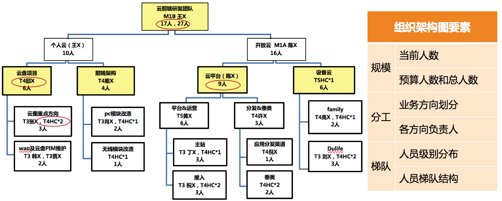

# 14 | 如何来规划团队的组织结构呢？
管理规划的四个核心要素：职能、目标、团队和路径。前面我们已经探讨了职能和目标，想必此时，你应该很清楚自己团队的基本职责和使命了，并且已经为团队设定了清晰的目标。

那么今天，我们再来接着谈一谈，该如何做团队规划。

围绕着“团队”的工作非常多，我会在“团队建设篇”中详细阐述。现在，我们只是探讨团队规划，主要从如下三个视角：

- **第一个视角是看团队目标；**
- **第二个视角是看资源；**
- **第三个视角是看人才培养。**

下面我就一一详细道来。

## 团队规划的第一个视角，是根据团队目标的设定去梳理团队。

如果说上一篇文章我们对于“目标”的探讨，主要聚焦在“业务目标”的话，那么本文我们探讨的团队规划，则包含了对“ **团队目标**”的设定。这里的“团队目标”，不是指团队所要完成的业务目标，而是 **你希望在某个时间节点到来的时候，把团队发展成什么状态**。换句话说就是，到那个时候团队会是什么样子呢？

对于某某人“长什么样子”的话题，你可能会从皮肤、样貌、身高、体重等要素来衡量。那么对于一个团队长什么样子，你要用什么指标来衡量呢？通常来说是如下三个：

首先是 **团队的规模**。也就是你团队有多少人，这其中要理清楚有多少人是现有的，有多少人是接下来要新增的，即实际人数和预算人数，加起来就是你规划的团队总规模。

其次是 **团队的分工**。即，你的团队都负责哪些业务，每个业务配置了多少人力，以及这些人员都如何分工，人力分布和业务目标是否匹配等。

最后是 **团队的梯队**。一个团队的梯队情况代表了团队的成熟度和复原力。梯队成熟的团队，不会因为一些偶然的因素（比如某个核心员工休假，或者某个技术负责人离职等）就随便垮掉。复原力强的团队只是短暂影响部分业务进展，但是不会伤筋动骨、元气大伤，很快就会恢复正常。这个复原力很像技术服务的健壮性，会让团队非常有韧劲，经得起折腾。

综上，如果你从 **规模、分工和梯队** 三个要素来描述你团队的情况，就能看清团队的“样貌”了。

## 团队规划的第二个视角，是从资源角度来审视团队。

从资源视角来看待团队，是一个成熟管理者的标志之一。因为站在公司角度来看，每个团队都是一批人力资源，所以有个专门的职能角色叫HR（人力资源）。

在现在很多互联网公司里，技术团队往往是最昂贵的资源和成本，预算人力，实质上就是预算资源。所以，作为一个管理者，在盘点自己当前人力和预算人力的时候，需要有 **成本意识**，要考虑投入这么多资源和成本是否值得，是否合理。

其实，即便你不考虑这个问题，你的上级也会考虑，所以，你预算人力的时候，最好能给出十分充分的理由：为什么你需要这些人？为什么是这么多？你的依据和估算逻辑是什么？当然，你并不需要把所有的推演过程都汇报给上级，但是这并不意味着你不需要一个令人信服的推演逻辑，毕竟光靠“拍脑袋”肯定是不行的。

那么怎样才能够合理推算呢？

1. 取决于你对业务的理解，以及你希望达成的目标。毕竟需要投入的人力和目标是息息相关的，和手段的选择也是密切相关的，换句话说你的各项决策都影响着资源的估算（下一篇文章我们会具体谈手段和路径的选择）。
2. 可以参照行业资源配比情况。比如行业里产品、设计、开发、测试、运维等不同角色都有大体的比例，虽然不可照搬，但可用于参照，尤其是业务类型相似的。

## 团队规划的第三个视角，是从人才培养角度来看梯队规划。

关于对团队的盘点，除了团队的发展目标和资源投入视角，还需要从人才培养角度来看。即，到下一个时间节点，你需要重点培养出哪些人，给他们什么样的平台和空间，以及你有能力提供给他们什么指导和支持，期待他们能够胜任什么职能和角色。

一般来说，你重点培养的都是你团队最核心的人，也包括最有潜质的人，但是一般只涉及你的直接下级和他们的个别下级这两层，其他层次的人才培养则是你下级管理者的职责。当然，对于新经理来说，只需关心自己的直接下级就可以了。

关于人才的选拔和培养，我们会在后面“团队建设”相关的章节中详细探讨，这里我们就先了解做规划的时候，要涵盖重点人才的培养目标，就可以了。

关于新人的培养和引进，这里提出一个新概念叫“团队消化能力”。鉴于团队现实的梯队情况和新人导师的精力问题，一个团队能够良性吸纳的新人是有限的；如果新人引进过快，就会快速冲淡当前的团队状态，就和新组建一个团队差别不大了，这时很多新经理会顾此失彼，团队也近乎失控。

所以，这主要看你的取舍。有的管理者倾向于有步骤、有节奏地发展，而有的管理者迫于业务压力，也就不考虑团队消化能力了。这些做法无所谓谁对谁错，只是因人而异罢了。但是无论做哪种选择，考虑你团队能消化多少新人，是你做团队规划时需要关注的一个问题。

那么如何估算团队消化能力呢？

1. 不可否认，带新人是需要花费老员工一些时间和精力的。所以要看看你团队都有谁能带人，分别带几个比较合理。所谓合理，就是需要兼顾他们对业务的投入。
2. 看看你团队的新人培养机制是否成熟健全。如果你团队有成熟的新人入职培养机制和熟悉业务的学习资料，那么能同时消化的新人就会多一些。所以，作为一个“踏实”的管理者，把这些基础的管理工作做起来，对于团队的长线发展是很有好处的。即便你的直接上级是个“急功近利”的老板，你也可以有自己的管理风格，不是吗？

上面我们从三个视角探讨了做团队规划的逻辑和要点，那么，如果真的要给上级提交一份规划报告，关于团队部分，你应该以什么形式来呈现呢？

我建议你要以你和上级约定俗成的习惯和形式来呈现。假如你们还没有明确的要求和约定，那么你可以参照下面的形式，大体上也是三个部分。

第一部分，绘制一张组织结构图。这张图需要体现我前面提到的团队状态三要素：

- **规模**，包括当前人数、预算人数和总人数。
- **分工**，体现团队人力都分布在哪些业务上，以及各个业务都由谁来负责。
- **梯队**，包括团队的级别和梯队分布情况。

组织架构图示例

第二部分，列出整个团队的资源盘点情况。大体是这样的：

- A级别：x人，其中当前m人，预算新增n人；
- B级别：y人，其中当前m人，预算新增n人；
- C级别：z人，其中当前m人，预算新增n人；
- ……

第三，列出重点培养对象，以及负责业务。大体是这样的：

- 张三，XX业务核心工程师，到年底能完全负责XX业务，并能带新人；
- 李四，YY业务负责人，到年底能带n人独立负责YY业务；
- ……

怎么样，团队规划的呈现很简单吧？所以，核心还是对规划要点的思考和梳理，经过上面的探讨，你是否可以轻易地盘点自己的团队了呢？欢迎你留言分享和交流。

* * *