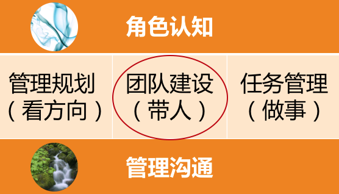
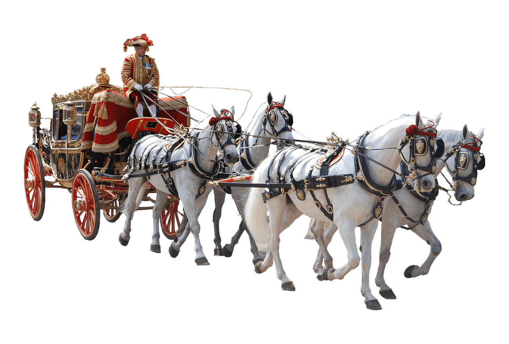

# 16 | 团队建设该从哪里入手？
上个月，我给一个技术团队的整个管理层做了一场培训。在需求调研的时候，我问技术团队的总负责人：“你期待通过这个工作坊，解决什么样的问题，并收获什么样的效果呢？”

他认真地跟我说：“我希望能够让管理者了解到，如何群策群力打胜仗！”紧接着，他又补充说：“CEO也是这么期待的。”

听他这么说，我第一反应就是，高管就是高管，说话高屋建瓴，直达要害。我们做管理工作的目标，归根结底，不就是“群策群力打胜仗”吗？“群策群力”就是如何带好团队，“打胜仗”就是如何取得好的业绩，“带人”+“做事”，齐了。可问题是，具体从哪里着手呢？

做具体的管理工作，和做一场培训是相通的，都需要有针对性的目标。“群策群力打胜仗”是终极目标，但还是不知道要解决什么问题，于是我接着问他：“你希望通过解决或改善什么问题，来更好地实现‘群策群力打胜仗’这个目标呢？毕竟这是每位管理者的理想，那么具体到你的团队，你希望着手做哪几件事呢？”

他若有所思，然后跟我说：“团队的经理大部分都是工程师转的管理，即便有人已经带过几十人的团队了，却还是不太清楚管理都该做哪些事情，有时候还没有把自己放在管理角色上来看待工作中的问题；另外呢，我们这些管理者彼此间也需要更好地融合，大家合作的时间并不长，凝聚力还不太够……”

我试着总结道：“听下来，你是希望通过做这样两件事，来更好地群策群力打胜仗：第一，提升管理者的角色认知，让他们清楚自己作为leader都要做哪些工作；第二，是团队融合，你希望工作坊之后，经理间有更好的互信和默契。”

他连连点头说：“对对对，就是这个意思……”

于是，我再一次地看到，对于管理者来说，“管理”是多么复合的一个词汇，它包含太多层次和维度，每位管理者都会有自己不同的理解和表述。做管理工作，如果仅凭感觉泛泛地去做，效果是很难预期的。因此，对于管理工作来说，有哪些具体的切入点，可以让管理者围绕这些“切入点”去开展工作，是非常值得探讨的。

关于管理者都需要做哪些工作的问题，我在前面的文章已经给出了一个管理框架，我把它称为“管理三明治”。如果你还记得的话，这个“三明治”有三根“火腿肠”，对应管理者的三项日常工作：“管理规划”“团队建设”和“任务管理”，用通俗的话来说，就是“看方向”“带人”和“做事”。今天呢，我们把镜头拉到第二根“火腿肠”，聚焦讲讲如何“带人”。

“管理三明治”

“带人”，其实就是我们常说的“带团队”“团队建设”。显然，所有的团队都需要有目标和方向感，也都需要在任务执行的过程中去锤炼和打磨，和“看方向”“做事”这两根“火腿肠”脱不开关系。但是，我们今天仅就“团队”来做一些探讨。

那么，究竟怎么带好团队呢？带团队需要从哪几个维度去展开工作呢？我采访过一些新经理，也采访过一些二线经理，大家的说法各不相同，这让我深感意外，似乎又在情理之中：

有人说：“带团队的核心是要做好人才培养。”

有人说：“最重要的是把合适的人放在合适的位置上。”

有人说：“对团队来说，最重要的是梯队和氛围。”

有人说：“一个好的团队是各有所长，协同配合。”

有人说：“激励很重要。”

有人说：“团队凝聚力很关键。”

有人说：“经理要以身作则。”

……

虽然说法不一，但每个人说的都有道理，蕴含着真知灼见和各自的管理精髓，每一个真知灼见都能在我脑海中点亮一颗明星，以至于我眼前出现了姜子牙封神时的情景，天空中的星星一颗颗亮起来，越来越多，越来越多……

突然之间，我一时有些眼花缭乱、不知所措。我到底该去摘哪一颗呢？有没有一个“星空图”，能够把这些散落的繁星连接成一幅有意义的图画呢？那样我就可以按图索骥去寻找我需要的星星了。

作为一个有追求的工程师出身的管理者，散落一地的经验是不能令我满意的，我一定要找到“带团队”这个主题的系统性框架，然后把这些宝贵的经验都安放进去。

好，既然要研究如何“带团队”，我们就先来好好分析分析“团队”这个研究对象。

为了容易理解，再次搬出我前面提到的“马车模型”，当下我们研究的是团队，也就是“马车模型”中拉车的“马队”，我们就来分析分析这个“马队”。

奔跑的马车

我们看到，观察一个马队，至少可以从三个层次来看：

- 第一个层次，就是单个的马，马队是由一匹一匹的个体的马匹组成的；
- 第二个层次，个体马匹和个体马匹之间是有连接的，如果没有连接在一起，它们就不能作为拉同一辆车的马；
- 第三个层次，马队是有其整体性的，马队的规模，马队的气势，马队整体的耐力等等。

这样，我们就把“马队”这一研究对象拆解成了三个子对象： **“马匹个体”“马匹之间”“马队整体”**。接下来，我们继续剖析。

首先，我们从“马匹个体”来看。

一个好的马队，每匹马都应该是奋力向前的。如何才能奋力向前呢？这里包含两个要素：

1. **力气**。首先一匹马本身得有力气，这是马车前进的基础。如何让一匹马有力气就是一个好的工作切入点。如何提升马匹的力气或体能，这对应到团队工作中，就像如何培养员工的工作能力一样。

2. **意愿**。只有力气是不够的，要让马匹奋力向前，除了“力气”，还得有意愿，就是得给马匹一个理由，让它愿意使劲地拉车。这对应到我们的团队工作中，就是员工激励：去提升员工的工作意愿。

还有没有其他要素呢？可能有，但是对于个体角度的工作来说，“能力+意愿”，已经足够。

接下来，我们把“马匹之间”这个层次，也来解析解析。

显然，每匹马都奋力向前，车就一定会跑得快吗？除了马匹个体用力，还有什么要素会影响车的速度呢？也有两个：

1. 马队的阵型，即排兵布阵。说白了就是，马和马之间是用什么结构连接起来的，这决定了各匹马用力的方向是什么。即便两匹马都很拼命，但是如果它们往两个相反的方向用力，马车也是不动的。具体到我们的团队，就对应到人员分工上。正常情况下，我们都不会做出相反的分工，但是如果对于同一件事情，一个员工在努力地赶进度，而另一个员工在拼命追求质量，那么显然他们是在往不同的方向努力。所以分工不是简单地“谁做啥”的问题，还包括是否有相互统一的评估维度。

2. 节奏和默契。如果阵型结构能保证所有马匹往一个方向努力，车就会快了吧？未必，还有一个要素需要考虑，就是马与马之间，有没有一致的节奏和良好的默契，这也是很重要的。具体到我们的团队就是，团队成员间有没有很好的信任和默契，协作上是否高效顺畅，是不是只需要只言片语、一个眼神、一个手势就能心领神会。这也决定了我们团队这架马车能跑多快。

除此之外，“马匹之间”还有哪些要素要考虑吗？在我看起来，如果把“分工”和“协作”搞好了，就已经抓住了最核心的要素。

最后，我们再来看“马队整体”这个层次。

如果说我们研究“马匹个体”，是为了搞清楚如何让“ **马** 跑得快”；我们研究“马匹之间”的构造，是搞清楚如何让“ **车** 跑得快”；那么我们研究“马队整体”，主要是想看看，如何才能让 **马车**“一直跑得快”，或者说，跑得远，也就是团队的耐力和可持续性问题。

我们可以从外部来给团队很多的激励，比如愿景目标和使命，比如带团队做出好的业绩和大的成就，这些方面呢，我们会在管理规划和任务管理这两根“火腿肠”中探讨。今天，我们仅从团队角度来看，如何提升团队的耐力。

也是两个要素：

1. 马队构成 vs 团队梯队。从这个角度来审视马队，对应到团队就是梯队，盘点团队新老强弱的构成。团队工作是着眼长线的工作，我们不是只赶一段路。一个团队如果没有良好的梯队，只是靠一两个成熟的高手在支撑，那么一旦这一两个高手请假、调走或者离职，整个团队就瘫痪了。所以，要把团队的战斗力放在一个更长的时间区间去考虑。

2. 马队展现出来的气势和精神面貌 vs 团队文化。团队文化如果你觉得难以捉摸，也可以叫“团队氛围”，总之就是团队成员能够在这里找到非常好的认同感，大家也非常清楚在这个团队里，什么是重要的，什么是不重要的，什么是应该的，什么是不应该的，都不需要去一点一点交代。我们可能平时也不会特别注意到，但是却无处不在。一个公司因为文化发生变化而带来的团队动荡，是灾难性的、难以缓解的，所以不能忽视团队文化的建设。

综合上面我们对“马队”3个层次的解析，就得到了团队建设时6个维度的工作要素：

- 针对员工个体的两个要素是： **能力和激励**；
- 针对员工个体之间的两个要素是： **分工和协作**；
- 针对团队整体的两个要素是： **梯队和文化**。

团队建设六要素

这样，你就知道了，虽然“带团队”是个无处下手的大概念，但是你可以着眼这6个要素去开展工作，是不是感觉清楚多了呢？

当然，你可以用自己认为更贴切的词汇和术语，去替换这6个要素的具体叫法。但是从这3个层次来审视你的团队工作，以及从6个要素去积累你的管理方法论，你是不是就看到满天繁星中的那个“星空图”了呢？

关于每一个维度或每一个团队建设的要素，我会在后续的文章中逐个来探讨，如果你今天能收到团队建设的一个工作框架，就很棒了，不是吗：）

现在，如果有人问你如何提升团队的战斗力，你清楚该怎么答复了吗？欢迎给我留言，我们继续探讨。

* * *