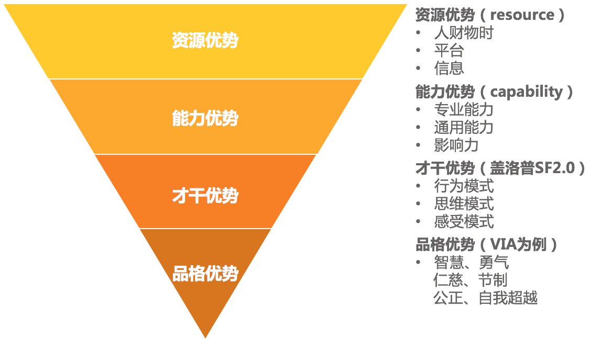
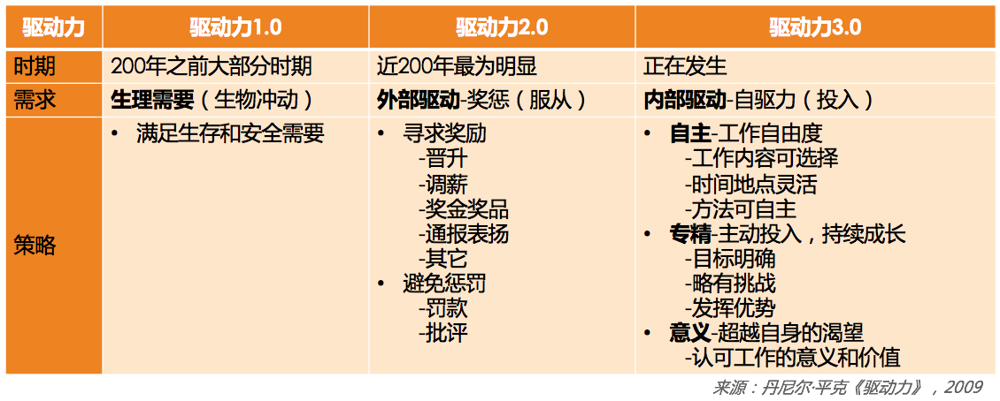
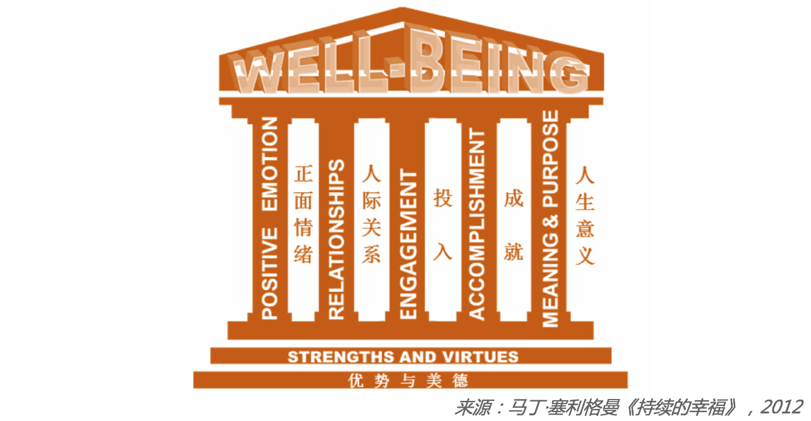

# 18 | 如何提升员工的工作意愿和积极性？
前面我们提到，一个团队战斗力的基础是每个个体的战斗力。只有每个个体员工都奋力向前，团队才有可能快速前进。那么如何提升每个个体的战斗力呢？这主要与两个要素有关，即 **个体能力** 和他 **使用能力的意愿**，如果要用一个公式来表示，那就是“个体战斗力=个体能力\*个体意愿”。

关于如何提升员工的个体能力，我们在上一篇文章中已经进行了探讨。现在，我们再来看一看如何提升员工的工作意愿和积极性，也就是很多管理者都头疼的员工激励问题。

员工激励是管理者的日常工作之一，为什么会让很多管理者头疼呢？他们大体上有如下几类说法：

1. “没有头绪，无从下手。员工激励这事，想起来就做做，忙起来就顾不上了。”
2. “员工没有工作热情，怎么激励也提不起积极性，他们依旧我行我素。”
3. “对员工激励效果最好的就是股权、晋升、调薪、奖金，我会向上级去争取，但是可能很难争取下来。”
4. “没法左右加薪和奖金，只能是给员工画饼了，但是工程师对此都很无感。”
5. ……

还有很多说法，但是我们归结起来，不外乎是如下三个问题：

第一， **激励认知不系统**。不清楚激励都有哪些手段，以及如何使用，各种零散的说法让人无所适从。

第二， **激励可用资源匮乏**。实实在在的物质激励不受自己掌控，画大饼的精神激励，员工又不买账。

第三， **激励达不到效果**。虽然激励的动作都做到位了，但是并没有收到激发员工动力的效果，或者效果不够令人满意。

接下来，我们依次看看这些问题该如何应对。

**第一个问题，关于对激励的系统认知**。于此，我们比较熟知的就是马斯洛的需求层次模型了，这个模型可以指导我们从人的五个不同层次的需求来激发动力，不过操作起来还是有点不太清楚该怎么做。

马斯洛需求模型

所以，我更喜欢丹尼尔·平克的《驱动力3.0》，他把驱动力的发展归纳为三个阶段：驱动力1.0、2.0和3.0。

**驱动力1.0**，是指驱动力主要来源于 **对生存和安全的渴望**，需求层次处于“马斯洛需求模型”的最底层。这类驱动力在200年之前的大部分时间都处于主导地位，人们为了寻求生存下去的基本要素而努力。

当然，也并不是说现在就不能用了，这和社会经济发展状况有关。比如上一代人就有个响亮的口号叫“学会数理化，走遍天下都不怕！”怕什么？还不是怕找不到工作，吃不饱肚子！这其实就体现了当时人们对于生存的恐惧。

不过，随着中国经济发展至今，人们对这个层次的需求似乎已经默认能够保障，所以不再是关注重点，在企业员工激励中，也很少会用到。

**驱动力2.0**，其基本哲学就是认为人们都是“ **寻求奖励、避免惩罚**”的，所以采取的方案是“奖励好的行为、惩罚坏的行为”，也就是人们经常念叨的“胡萝卜加大棒”。这是近200年来工业时代被广泛认同的激励方式，也是当前大部分管理者最常用的激励手段。

几乎在每一次管理培训课上，我都会邀请我班上的同学整理出他们认为最有效的激励方式。不出意外，你会发现大家呈现出的结论，80%以上都是奖金奖品、升职加薪、口头表扬、通报表彰、出国旅游、加班费等，与此对应的惩罚就是罚款、批评等。

我问他们，“效果怎么样？”一般收到的回答是，“效果还不错，但就是越用效果越差。”不得不说，这是很正常的。

为什么正常呢？

**因为无论是奖励还是惩罚，这类驱动力最大的特点是来自外部刺激**。人对外部刺激的应对机制是增强免疫力，这个道理用在害虫身上就是提升“抗药性”。所以无论是用惩罚来“威逼”，还是用奖励来“利诱”，用多了就没效果了。古人早就告诫我们“ **善用威者不轻怒，善用恩者不妄施**”，也是这个道理。

你可能会说，“既然‘善用恩者不妄施’，我以后就少奖励员工吧？”那就又因噎废食了。我认为还有一个“不妄施”的做法，就是把每一个奖励的意图都明确化以加强感知。除非是过节，否则就不要“撒胡椒面”，去搞所谓“阳光普照”奖。

我就拿“表扬”这样的小奖励来举例，表扬一个员工，若遵循下面这三个原则和要素就会让你的表扬效果倍增：

1. **具体**。就是表扬的内容和原因要非常具体，让员工和团队都知道他是因为哪一两点得到了认可。比如“员工A非常主动及时地处理了一个线上故障”“员工B在带新员工方面成绩突出”等。这样做，大家就能够清晰地接收到你在倡导什么，而且还能有效防止对没有受到表扬的人造成负激励。如果你要是泛泛地说“A很积极主动”“B干得很不错”。其他人就会心里不爽：“我也很积极主动好吧，而且我项目干得也不错。”因此，表扬一定要具体。

2. **公开**。这个原则很简单，公开表扬有两大好处，一个是被表扬的同学受到了更大的激励；另外一个更大的好处是，你其实告诉了团队每个人，什么样的行为和价值观在你们团队是被认同和倡导的。因此，表扬要公开。

3. **及时**。所有的期待都有时效性，表扬及时，其实就是对员工的反馈要及时。一个不及时的表扬不但会让激励效果大打折扣，而且还会让团队成员很不理解，“这么点事，至于挖坟拿出来说吗！”

好了，关于驱动力2.0的核心理念，以及在工作中的广泛应用，相信你已经领会到了。

接下来我们聊聊驱动力3.0。

**驱动力3.0**，目前在中国企业里正在被越来越多地应用和开展，这和中国社会已经基本解决生存和温饱，人们开始追求幸福和意义是紧密相连的。如果说驱动力2.0的核心是外驱力，那么驱动力3.0的核心就在于自驱力。

你可能会说，“胡萝卜加大棒”都搞不定，靠员工自驱岂不是更不靠谱？但我不得不告诉你的一个事实是： **用驱动力3.0的思路来激励员工，不是你愿不愿的问题，而是不可回避的选择**。

第一个原因是，驱动力2.0的效果还是会持续变差。一方面是因为用滥了，没有新意；另外一方面，随着中国经济和文化发展，物质奖惩和别人的评价变得不如从前那么令人关注。很多90后职场人有着自己笃定的价值观。

第二个原因是，在这样一个信息时代，员工的创造力更能为公司创造价值，而创造力需要更多的自主和差异。这一点和工业时代的理念几乎是相反的。在工业时代，员工恪守规则、不出差错更能体现其价值，所以 **驱动力2.0的核心价值观是“顺从”；而驱动力3.0的核心价值观是“自主”**。显然，我们无法选择让信息时代倒流到工业时代，所以，就只有努力去掌握如何使用驱动力3.0的方法去激励员工了。

既然，驱动力3.0主要是指自驱力，那么，究竟怎么激发员工的自驱力呢？丹尼尔·平克从三个方面给出了建议：

**第一，提升员工工作的自主性**。即，给员工一定程度的自主掌控感。

首先是 **工作时间和地点上的自由度**。弹性工作时间，在互联网领域非常常见，这和互联网业务特别依赖员工创造力是分不开的。时至今天，还是有不少管理者抱怨员工总是迟到，如果他们管理的是知识型工作者，我一般会建议他们把焦点放在对结果的评价上，而不是把焦点放在员工的作息习惯上。应以结果为主线开展管理工作，而不是用控制来做管理，除非你们的行业性质更强调“服从”。

其次是 **工作内容上的自由度**。员工可以在一定程度上选择自己的工作内容。Google原来有个“20%自由时间”的策略，即员工有20%的工作时间可自由支配，很受工程师们的热捧。所以，你在做季度规划的时候，也可以聊聊员工的意愿，看看能否兼顾个人兴趣和工作要求。

最后是 **工作方法上的自由度**。也就是员工可以自主选择工作的实现方法，这在技术人的日常工作中是非常常见的。

总之，一定的自由度会让员工更有自主掌控感，从而起到激发的作用。

**第二，提升员工专精度，让员工持续有成长**。这里的“专精”强调的不是要设定目标去成为某个“专家”，而是强调“自主投入”的过程，为员工创造愿意自主投入的条件，因为只有自主投入才能带来专精。那么，都要创造哪些条件呢？

1. **明确的工作目标**。即，对员工的要求越清晰，他就越愿意投入努力。那么什么叫明确呢？以明确到他能着手执行为标准。

2. **目标要略有挑战**。即，对员工的要求要有一定挑战，但又不能太高。要求太高带给员工的是焦虑；要求太低带给员工的是无聊。如果你觉得难以理解，你回想自己玩过的游戏就明白了，太难了让人放弃，太容易了没意思，难度适中的时候你才最容易沉浸其中、物我两忘。

3. **要能发挥其优势**。每个人都愿意做自己擅长的事情，如果某项工作能发挥员工的独特优势，必定会给他带来投入的热情。你可能会说，哪有那么多可以发挥员工优势的工作？我想说，优势是有很多层次的。你可能满足不了某员工所期望的工作内容，但是还有行为模式和思维模式方面可以考虑，比如某些人特别爱和人沟通协调，那就让他用沟通讨论的方式去工作；如果有人特别善于独立思考和筹划，那就发挥他的思维优势；有的人行动特别迅速，那就让他去快速启动一项工作。总之，千万别简单认为发挥员工优势，就是鼓励员工“挑活”；优势是多层次的，所以让员工发挥优势这件事并不困难。

优势层次图

**第三，给予员工意义和使命**。现在越来越多的人开始关注工作背后的意义和价值。如果说驱动力2.0的核心在于“利益”最大化，那么驱动力3.0在不拒绝利益的同时，更强调的是工作价值的最大化，希望自己做出来的工作是有意义和价值的。

作为管理者你可以亲身感受得到，总会有一批人因为工作没有价值而离职。他们不是矫情，而是真的需要看到自己给公司和社会带来什么价值。所以，管理者的一项重要修炼，就是去梳理团队的使命和项目的意义。

在前面第12篇文章中探讨团队职能时，我提到过一定要为团队设定基本职责和使命，还记得文中那个测试经理的案例吗？当他明白了自己团队不仅仅是做测试的，更是整个公司产品和服务质量的保障者之后，激发了他持续的工作热情，这就是意义的价值。

但很多时候，管理者分配工作的方式是直接交代要做什么，并不会和员工去分享和探讨这项工作的价值，以及对团队和公司意味着什么，所以起不到激励效果。

综合上面所说的，我把驱动力发展的三个阶段整理如下，供你参考。在以后设计激励方案的时候，你可以关注一下，自己正在从哪个角度去激励员工。你也许会问，驱动力3.0时代，是不是就不需要外部的奖惩激励了呢？我的看法是：需要，虽然驱动力2.0的激励效果在不断打折扣，但是基本的奖惩还是要做到位，这是基线。

驱动力发展三阶段

关于激发员工的自驱力，说到底还是要顺应员工对于“工作幸福感”的追求。

驱动力3.0所强调的“自主投入”，只是工作幸福感的来源之一，那么除此之外还有其他哪些角度呢？“积极心理学之父”，美国心理学会主席马丁·塞利格曼在《持续的幸福》一书中，提供了一个“全面可持续幸福”（well-being）模型，即“PERMA”模型，为我们提升幸福感提供了一个可操作的框架。

积极心理学“全面可持续幸福”模型（PERMA）

从上图可以看出，正面情绪、人际关系、投入、成就、人生意义，是通往全面幸福的五根支柱。若你想要提升员工工作幸福感，也可以从这五个方向去开展工作。

**第一，积极正向的情绪**。你在营造什么样的团队氛围呢？团队里是轻松愉快、互帮互助的，还是抱怨指责、死气沉沉的？现在你知道了，积极正向的情绪，本身就是提升员工工作动力、增强员工留任意愿的重要手段，那你能为此做点什么呢？

**第二，良好的人际关系**。在团队工作中，你做了哪些工作来提升员工的归属感、融入感呢？你是否设计了一些活动和机制，让彼此之间更愿意互相支持？每个团队会因为管理者的风格选择自己的有效形式，但一个常见做法是，为每位新人指定导师，你做了吗？

**第三，自主投入**。你为员工自主投入提供条件了吗？如前面我们所提及的，为员工设定清晰的目标，给他们适当的挑战，并支持他们发挥自己的优势，可以帮你的员工提升自主投入的意愿，体验到“心流”带来的愉悦。

**第四，取得成就**。迎接挑战并取得成就，是大部分工程师非常享受的事情，但是这需要一个前提，就是对于“成就”的刻画和设计。很多管理者往往缺乏这个意识，尤其对于一些长线工作，或日常的琐碎工作，员工做下来觉得没有成就感，甚至是觉得浪费时间。所以，把长线项目里程碑化，把日常工作项目化，让员工走一步有一步的成果，会提升员工的成就感。

**第五，意义和使命**。你可能会说：“工作就是工作，哪里有那么多的意义和使命啊。就别说员工了，我自己都觉得很缥缈！”但是员工越来越追求工作背后的价值和意义这件事是不可忽略的。所以，作为管理者你需要有能力为员工梳理清楚这个问题。

这里我提供一个简单实用的方法，即尽量避免用“任务性”的语言，而多使用“成果性”的语言。比如你安排一项工作给员工，常见的说法是：“把项目A抓紧做一下吧，下周要发布。”这在员工看起来，他收到了一项任务。但换成“成果性”的说法是：“项目A会帮我们验证一个结论，决定我们是否在这个方向上持续投入，下周就要做出决策，所以，你看下周能否搞定？”显然，成果性的说法会让员工更清楚自己工作的价值，完成之后也会很有成就感。

此外，你会发现，定义你团队的使命和愿景，并和团队有效传达，为大家的工作赋予更高的意义和使命，不仅仅是规划要素、是驱动力来源，还是员工工作幸福感的五大支柱之一。

以上的五根支柱，既然能提升员工幸福感，那么就可以作为激励手段的框架供使用。

通过我们探讨的“驱动力3.0”和“PERMA模型”两个框架，你是否对激励这个话题有了一个全局和系统的认识呢？

如果认知问题得到了良好解决，那么员工激励常见的第二个和第三个问题也就迎刃而解了，我们一起来看看：

**第二个问题，关于激励可用资源匮乏**。实实在在的物质激励不受自己掌控，画大饼的精神激励员工又不买账。针对这个问题， **如果你把“驱动力3.0”和“PERMA模型”两个激励框架结合起来使用，你会发现，现在你可用的激励手段已经非常丰富了**。

你之前觉得匮乏，是因为你觉得只有“胡萝卜”和“大棒”可以用，而现在，你可以设计更为立体的激励体系了，而不是靠单一的激励来决定效果。

另外，说起“画大饼”，在我看来，“画饼”越来越成为管理者的必备技能，只不过不宜过大，饼太大了是没有激励效果的，要注意和员工有切实的联系。而且作为管理者，只有言行一致，保持承诺一致性，才能赢得团队的信任。

**第三个问题，关于激励达不到效果**。虽然激励的动作都做到位了，但是并没有收到激发员工动力的效果，或者效果不够满意。关于这个问题，我认为 **效果不明显最大的原因是你只是做了一套“激励动作”**，这套“动作”可能是很多管理者前辈告诉你的，而不是你根据自己团队和员工的具体情况，结合激励框架定制化设计出来的。

实际上， **每一个激励方案都需要去思考和设计，把外驱和内驱结合起来，把长期和短期结合起来，把业务推进和职业幸福集合起来，把个人工作和团队使命结合起来**。别再把员工激励简单粗暴地甩锅给某句“名言”：“要么钱没给到，要么心受委屈了”，就好像你经常把技术问题甩锅给一个叫“bug”的东西一样。其实关键是，你打算做什么来改变这种状况呢？

这篇文章很长，最后归结起来，我希望传递这样几个理念：

**第一，激励要立体**。本文介绍了非常丰富的激励要素，你需要从单一的激励维度，升级为更加立体的激励体系，从而适应新职场环境的要求。

**第二，激励在平时**。你不能指望一些临时性刺激方案来做好激励，激励体系的搭建应在平时。当员工跟你提离职的时候，它就已经不再是一个激励问题了。

**第三，激励要设计**。由于每个人的业务特点不同、团队性质不同、管理风格不同、员工特征不同、问题挑战不同，所以不要迷信别人给你的激励建议，我更建议你充分考虑自己面临的实际情况，结合自己的特质和激励框架，来设计适用于自己的激励体系。

如果你接收到了，就为自己的团队设计一个激励方案吧！

* * *