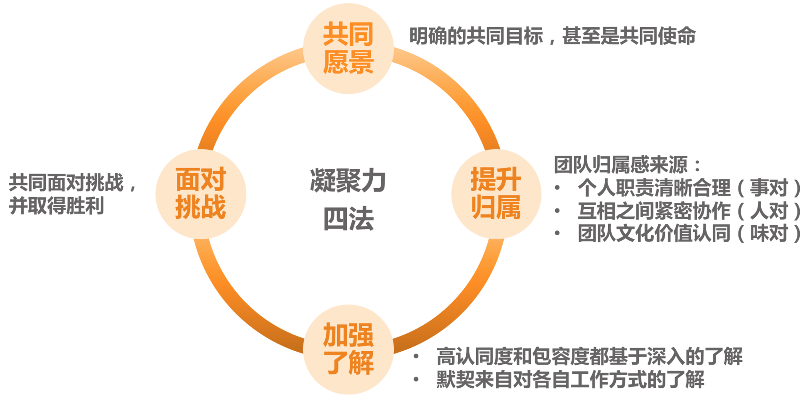

# 20 | 有什么方法可以有效提升团队凝聚力吗？
在上一篇文章中，我们共同探讨了团队分工的一些方法和要点。那么，为了达到团队成员间的良好合作，分工明确就足够了吗？显然， **分工明确只是具备了合作的前提和基础，真正能够让大家良好互动并高效产出的，是日常工作中的协作**。

如果说分工是一台电脑的硬件，决定着各个组件的拼接关系和基本性能，那么协作就是这台电脑的软件，是让这台电脑真正运转起来的关键。也就是说，是协作让团队里的各项工作开展起来的。这就是我们团建六要素中的第四个要素： **协作**。

那么，何为良好的协作呢？我们听到过很多相关的形容词：“紧密的”“顺畅的”“高效的”“默契的”……总之，所有能够用于个体之间良好互动的形容词，都可以用在这里。还有一位资深管理者很生动地描述说：“就是只要一句话，甚至是一个动作、一个眼神，对方就知道是什么意思。”显然，协作水平很高的团队，就好像一部良好运转的机器一样，既有分工，又彼此紧密连接，形成一个有机整体。

那么该如何不断提升团队的协作水平呢？主要是从两个角度来做工作：

**第一个角度是建立协作机制**，通过机制来约定协作的动作，以此来保证大家“动作协调”。关于机制怎么建，我们会在后面的第27篇文章“流程机制”中专门探讨，这属于“做事”的范畴，我们暂且不展开。

**第二个视角是提升团队凝聚力**，通过提升团队成员间的信任度、认同度和默契度来降低协作成本，提高协作效率。

团队凝聚力和协作水平是两个非常有意思的概念，他们含义不同，又紧密相关。团队凝聚力更侧重团队成员间的关系，体现他们的信任度和向心力如何；而协作水平则更关注做事过程中的互动情况。

你不难发现，一个非常有凝聚力的团队，对于良好的协作有着直接和关键的影响，而良好的协作反过来也会提升团队成员间的认同度和默契度，从而提升团队的凝聚力。他们互为因果、彼此促进。

所以，要想提升协作水平，“硬件”靠机制，而“软件”靠凝聚力。凝聚力即是团队协作的基础，又是团队协作的目标。强大的凝聚力，是战斗力强大的团队的重要特征之一。

那么，如何来提升团队凝聚力呢？

在我统计的500名左右的管理者中，有三大话题是他们最关心和认为最具挑战的，分别是前面探讨的 **员工激励**，后续即将探讨的 **向上沟通**，以及本文我们探讨的 **团队凝聚力的提升**。可见，这是管理者普遍的痛点之一，我从如下四个角度给出可参考的方法。

**第一个角度，设立共同愿景。**

当我们想提升团队凝聚力的时候，总是希望大家“心往一处想，劲往一处使”，而我们常常忽略一点，就是大家首先得清楚把劲儿用到哪“一处”。这就要求团队首先要有一个使命和愿景，有一个共同的长远目标，供大家“往一处想”。

关于团队使命的意义和价值，我们在第12篇文章探讨团队“职能定位”的时候就已经提及，并介绍了设定团队使命的要点。而且，在第13篇文章探讨团队“目标设定”的时候也提出，清晰的目标可以提升团队的凝聚力。

如果团队有着自己的使命，又能得到团队成员的普遍认同，大家会更容易朝着一个方向共同努力，也更容易肩并肩地一起迎接挑战，即所谓的“志同道合”。它是如此重要，下面我简要描述一下其设立步骤：

1. 明确你团队的职责、使命和工作目标。可参照前面的第12篇和第13篇，这里的工作目标是长远的共同目标。

2. 管理者自己要笃信第1条的内容。如果不笃信，就返回步骤1继续提炼。

3. 在各种合适的场合宣贯这一内容，比如季度会、总结会、沟通会、启动会，以及1对1沟通等，都要不失时机、不突兀地把使命和愿景同步给大家。

4. 坚持不懈地做步骤3。不要指望一蹴而就，开个会大家就都认同了的好事，现实中不会发生，只有时间长了、频次够了，才会内化，才会深深植入员工的内心。

**第二个角度，提升员工归属。**

**如果说，设立共同的愿景，是为了让员工凝聚到共同的事业上的话，那么提升员工归属感，则是为了让员工凝聚到团队上**，让员工从心里就认为自己是团队的一份子。那么，如何才能让员工有这种感觉呢？主要从以下三个层次来做：

1. **要给他一个位置，给他一个“立足之地”，也就是要分给他一份职责**。职责并不总是意味着压力，也意味着归属，人的内心深处是渴望承担适当的责任的。只有当员工清楚自己能为团队做出什么贡献的时候，才会心安，才会感受到自己是团队的一份子。所以在团队分工上，要让员工清楚他肩负的职责对于团队的意义，让他觉得自己做的事有价值，这就是所谓的“ **事对**”。

2. **要营造良好的团队人际关系，让彼此间形成紧密的连接**。团队成员间良好的关系，和团队凝聚力的提升是互为因果的，所以不要小看能促进员工间关系的一些小事，恰恰是这些小事，能够促使员工间的合作关系走上正向循环的轨道，员工会因为喜欢和团队的人相处而觉得有归属感。这就是所谓的“ **人对**”。

3. **明确亮出团队的文化价值观**。团队的文化和价值观是否是员工认同和欣赏的，决定了他能否长期留在团队。价值观方面的冲突是很难调和的，如果员工从价值观层面就不认同团队，是很难让他找到归属感的。好在团队文化本身就是一个筛选器，最终留在团队发挥核心作用的都会是认同团队价值观的人，当然前提是团队先有明确的价值取向。关于如何打造团队的文化和价值观，我们将在后面的第22篇文章中专门探讨。因喜欢一个团队的文化和氛围而产生归属感，这就是所谓的“ **味对**”。

如果一个团队能让员工觉得“ **事对**”“ **人对**”“ **味对**”，那么，他的归属感应该是很强的。

**第三个角度，加强相互了解。**

作为管理者，我们总是习惯于对员工提要求，比如，希望员工能不能更包容些，相互之间能不能多一些体谅和理解，彼此之间能不能多一些信任，等等。作为管理者，我们总是期待“不劳而获”，认为员工之间天生就要互相包容、体谅、理解和信任。殊不知，所有这些并不会自然而然地发生，都要基于团队成员间不断深入地相互了解和认同。你为此做了什么呢？你有持续地做吗？

管理者经常会做一些团建活动，但是却很少对增进大家的了解和信任做必要的设计，回头活动效果不好，就归咎于活动不够吸引人、预算不充足等等。

而实际上，经过设计的活动，不但效果很好，而且还不需要什么经费。比如我曾经尝试给大家做过1个小时的“巅峰故事会”：在1个小时内，每个人都讲出他们曾经的巅峰体验，然后请队友给出积极反馈。1个小时下来，产生了很多的化学反应，大家都说比之前更了解对方了，也更接纳对方了。

所以，这主要还是看你是否愿意为此花一点心思来稍微设计一下。无论如何，加深员工互相的了解，是提升信任和默契的良方。

**第四个角度，共同面对挑战。**

关于有哪些可以有效提升团队凝聚力的手段，在我的调研中，有不少管理者反馈，一起面对挑战的时候，特别能够让大家拧成一股绳，我也深以为然。

有一句经典台词就是这么说的：“今日谁与我共同浴血，他就是我的兄弟。”显然一起扛过枪的兄弟，感情是很铁的，毕竟是经历过不离不弃的并肩作战。虽然我们现在没有仗要打，但至少有如下两个方面的事情近似打仗：

1. 一些有挑战的大型项目或紧急事故的应对。
2. 跨团队的对抗性活动，比如趣味运动会、Dota比赛等。

毋需去说教，而是让大家在“硝烟”和“炮火”中去建立深厚的感情，这就是所谓的“事上练”。

好了，关于提升团队凝聚力的四个方面的工作，我们可归结为如下：

对于如何提升你团队的凝聚力，你认为从哪个方面入手会最有成效呢？期待这张图能对你的工作会有所启发。

* * *