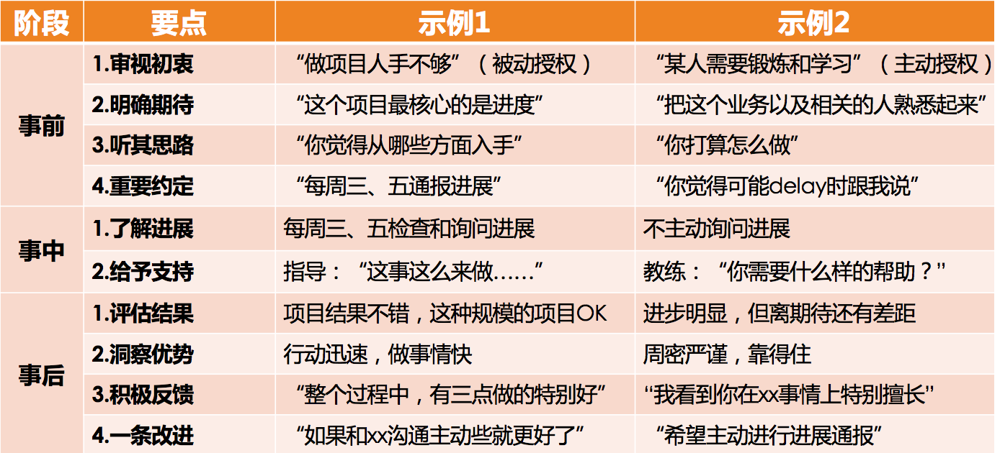

# 21 | 如何物色和培养核心人才？
能够带着团队把一件事做好，只能算是一个好的项目经理（特指以项目交付为目标的Project Manager）。如果能够带出一个良好的团队，持续不断地把一件又一件的事情做好，才算是一个好的团队管理者。所以， **团队产出是否可持续，是考量管理者价值的一个很重要的维度**，它体现了这个团队是否健康，是否有耐力和韧劲。其中，耐力让团队走得远，韧劲让团队走得稳。

在第16篇文章中我们提到，提升一个团队的耐力和韧劲，有两个要素：梯队培养和团队文化。一个团队的梯队，就好像一个团队的“骨架子”，这“骨架子”是否健康良好，决定了团队是否健壮。而团队文化就好像是团队的气质和调性，它会吸引“气味相投”的人持续加入，而把不符合团队气质的人筛选出去，越来越鲜明的团队价值观让大家紧密地聚拢在一起，从而让团队越来越“结实”，越来越“经得起折腾”，不断增强团队的耐力和韧劲。

团队文化的打造，我们下一篇文章会专门介绍，今天我们主要聊一聊梯队培养的问题。

我们通常所说的“梯队建设”，其实包含了“梯队规划”和“梯队培养”两部分内容，你可以认为规划和培养的关系，是“计划”和“实施”的关系，是“想”和“做”的关系。梯队规划的部分，我们在前面介绍“规划四要素”的时候已经做过介绍，所以今天我们把焦点就放在梯队如何培养上。

“梯队培养”实际上就是选拨一些人，并把他们培养成团队的核心骨干，也就是团队的“骨架子”。这其中包含了两个部分的工作：一个是选拨和物色培养对象，另外一个是培养这些人。

人才的选拔和物色，是个仁者见仁智者见智的话题。有“务实”派，认为“能者上”；有“务虚”派，认为“有德者居之”；有“现实”派，认为“能自己冒出来的才是人才”；有“理想”派，认为要“德才兼备，宁缺毋滥”。

在我看起来，作为管理者的你可以有自己的人才观，但是物色培养对象应该要满足以下两个原则：

**第一，要保持人才选拔和团队建设的一致性**。即，你对核心人才的选择，需要和你团队建设的理念保持一致，这主要体现在能力、协作和文化三个要素上。

1. **能力**。主要是确保其个体能力和业务特点相互匹配，能力潜质是可成长的。一般来说，技术团队的梯队，个体的专业能力肯定是要不错的，至少在业务特点方面要匹配。比如，对于功能交付的团队，其功能开发质量和效率是否突出；对于算法团队，其算法能力是否良好等。这是一个团队的能力基因。

2. **协作**。其协作的意识和能力，和你团队的要求和期待是否匹配。一般来说，团队的核心骨干都要有比较好的协作意识，才可以干更大的事情，才可以发挥一个骨干需要发挥的作用。尤其当你团队特别强调协作的时候，如果他在协作上有明显不足，那你就得考虑是否要把他作为培养对象了。

3. **文化**。其行为风格和价值观，和团队文化价值观是否匹配。比如，你团队如果倡导“积极主动”或“自驱”的团队文化，那么一个专业能力很强但是被动的人是否值得你培养？你团队如果提倡“强执行”的做事理念，那么在执行上有明显短板的人，你也就需要慎重去考虑。

所以，什么是好的高潜人才和培养对象，和你做团队建设应该是一脉相承的。应避免你一方面倡导和推崇某个理念，而在选人上又是另外一个理念。注意我这里强调的是 **一致性** 要求，而并没有说什么样的人一定是好的，因为“好”这个字充满了个人偏好，没有定数。

**第二，和你相似的人才是人才，和你互补的人才是更宝贵的人才。如果说上一条原则我们强调了价值观层面的一致性，那么这条原则就是在强调行为风格和思维方式的多样性。**

管理者作为成长发展方面的“成功人士”，多少都会有些“成功路径依赖”，也就是认为“类似自己这样的人才是好的”，所以很多管理者自然而然地会喜欢用和自己风格相近的人。事实上，风格相近的人协作效率的确会高，但是会缺乏更丰富的见地和视角。而在信息时代，多元才能带来更大的创造力，所以在价值观相近的情况下，行事风格和思维方式与自己不一样的人，更值得你关注。

比如，如果你是一个做事非常细致谨慎的管理者，不妨选拔一些行动特别迅速的人；如果你是个特别关注事的管理者，不妨选拔一下特别关注人的人……当然，这只是一个选择、一个视角，而不是说必须要这样选。

至于其他人才物色的原则，那就仁者见仁智者见智了，这里我就不展开探讨了。

接下来的问题是，人才物色出来了，要怎么培养呢？有三件事情很重要：

**第一，对齐期待，达成共识。常用方式是IDP，即个人发展计划。**

关于IDP的制定，每个公司都有自己的模板，按要求炮制就好。我的习惯是把绩效计划和IDP合二为一：其前半部分是关于绩效的约定，比重在80%左右，换句话说，培养人才也是要以做出绩效为依托，而不只是为了培养而培养；后半部分是关于成长的约定，比重在20%左右，主要约定了未来的一个绩效周期内，个人需要特别聚焦的成长有哪些，并通过“把哪几件事情做到什么标准”来体现，也为之后的评估和反馈提供了一个参照。

在对齐期待的环节，有一个原则需要引起重视，就是 **不承诺原则**。你在和培养对象共同制定培养计划的时候，最好秉承“不承诺原则”，意即，“我培养你，但是不承诺为你做职位设定和晋升”。很多管理者为了激发培养对象的成长动力，常用句式是，“如果你干得好，将会如何如何……”我的建议是，只明确培养的意向和计划就足够了，最好不要作出成长之外的承诺。

这主要有 **两个方面的原因**：一是他能否成为团队核心骨干，或晋升某个岗位，是靠他自己的影响力来获取的，而不是靠你们的约定和承诺；二是为培养失败留下退路。如果你承诺了，未来却又兑现不了，那这个人才大概率就流失了。但如果你们聚焦于个人的成长而不是承诺，那么就不存在失败之说，即使没有培养成为你期待的骨干，也有各种方法继续激励和留用他。

当然，IDP只是一个手段，只是为了对齐你和培养对象彼此的期待，让他清楚你关注和在乎的是什么，在这个事情上形成共识，从而形成良好的互动和有效的反馈。

**第二，提供机会和发挥空间，做好授权。**

做培养计划只是第一步，而能力和影响力都是在实战中积累起来的，这就需要给培养对象提供发挥空间，让他在“事上练”，所以就不可避免地要做工作授权。关于授权，我调研过的大部分管理者都有自己的心得，这里我开列出一个表格，供你参照和查漏补缺。

“工作授权三段法”

工作授权，并不只是用于人才培养，还可能是因为自己应接不暇时，迫不得已把一些工作授权给员工来做，这种授权以交付结果为核心目的，姑且叫做“被动授权”，不是今天的话题。今天我们探讨的是用于培养人才的“主动授权”，也就是图表中的“示例2”。你可能会发现我用的是“示例”这个字眼，而且其中有很多带引号的描述，就表示这不是一个标准的做法，而只是按照左侧的“要点”举的例子，只是为了方便你理解这些“要点”的。

接下来，我对要点清单逐一做个说明：

01. **审视初衷**。主要是管理者审视自己想要在此次授权中收获什么，你是想把某件事做出来，还是想把人带出来，抑或是其他？你可能想说，“我都想要！”也不是不可以，但是总得有个先后主次。明确初衷，就是为了避免“什么都想要”的心理最终导致自己决策标准模糊。

02. **明确期待**。如果说“审视初衷”是为了让你明确想要什么，那么“明确期待”就是为了让培养对象清楚你对他的期待是什么，也就是你们就授权目标达成的共识。既然是目标，也就需要符合SMART原则。这一点是管理者普遍能够想到的，可能会有不同的表述，比如明确要求、明确口径等，都是一回事。

03. **听其思路**。这一点管理者很少能想到，大家往往想到的是在授权过程中如何把控风险。我建议，当你交代好授权任务之后，你可以首先听听他对这件工作的看法和思路。你从他的思路和方案中就大体可以判断出，他独立负责这项工作的靠谱程度如何，这不失为风险把控的良方。

04. **重要约定**。即，你需要对你特别关心的事情和他做一个约定，比如在什么情况下他需要告知你。这里我想强调的是，既然是授权，你最好不要动不动、时不时就去询问和干涉他的工作。在“向上沟通”的访谈中，很多人都非常反感和抵触“上级时不时就过来问进展”，因为在他们看来，这是上级的不信任。所以，关于怎么check进展，你们最好提前有个约定。

05. **了解进展**。大多管理者都能够想到这一点，就是在工作进展过程中要了解进度、评估风险，而不是任务交代完了就撒手不管了。

06. **给予支持**。在工作执行过程中，管理者需要给予必要的支持和帮助，这一点也是大部分管理者能够想到的。在人才培养的主动授权中，我推崇的方式是教练式的引导和启发，而不是直接告诉答案，因为经过他自己的思考，他才能更好地掌握工作技能。

07. **评估结果**。对于任何一次授权，针对授权对象的工作结果和表现给予有理有据的评价和及时的反馈，都是必要环节。有些管理者在工作完成之后认为事情就了结了，其实这样授权的效果便大打折扣，因为对人的培养和激励，都蕴含在反馈之中。

08. **洞察优势**。盘点在整个授权过程中，授权对象所表现出来的突出的优势有哪些，比如特别谨慎周密、特别有责任心、思路特别灵活、特别善于合作、善于沟通表达等等。在他的工作表现中，你会对他有更多的认识和了解，也会在以后的授权中有更好的匹配。

09. **积极反馈**。就是对于授权对象的工作，一定要给出一些“正向”的反馈，即，有哪些做的好的方面。主要目的是告诉他，哪些做法是你们推崇和提倡的，哪些是需要持续保持和增强的，同时也能起到激励的作用。

10. **一条改进**。就是要给出1～2条改进建议，也许你认为他需要改进的地方非常多，但是你需要明白，要想取得良好的改进效果，就得逐条改进，所以，不妨先提出1～2条建议，剩下的以后再说。

以上就是授权的10个要点，我把它们划分为 **事前、事中、事后** 三个阶段。从要点的分布你可以看出，授权的重点在于事前的安排和事后的反馈。因为既然是授权，事中最好不要干涉太多，只做约定好的check和支持就好。

**第三，建立反馈机制。**

在前面我们探讨授权要点清单的时候，已经提及了在一次授权工作中反馈的重要性和方法。现在，我再提几点外围的建议。

1. **建立周期性沟通机制**。即，和你的重点培养对象，建立周期性的沟通机制，让沟通常规化，而不是想到了就沟通一下，想不到就不沟通，这样会比较随意，沟通不系统也不深入。至于周期是多长，就和你的具体情况、具体需要有关，两周常常是个不错的间隔周期。

2. **review IDP**。IDP做出来之后只是发挥了一部分价值，即双方明确了目标和期待；对于IDP执行情况的评估和反馈，才能体现IDP更大的价值。因为只有在反馈中，你们才能对齐对这件事情的看法和观点，这里不但蕴含着是非对错的价值观，还蕴含着指导和激励。

3. **安排第二导师，给予支持和反馈**。为了使培养对象得到更好的成长，也可以为他安排一个除你之外的“指导老师”，这个导师未必一定是团队内的，团队外的效果常常也不错。只要是你信任和认可的就好。

这样，你对于核心人才的多角度的反馈机制就建立起来了。

很多管理者托词工作太忙而没有时间带人，但如果你不把带人这件事作为你工作的“大石头”，你会发现，你只会越来越忙，而且，能做的事情也很难扩展。所以，团队核心人才的培养对于管理者来说，是一个非常重要的工作内容。

好了，在核心人才选拔和培养方面，你有遇到过哪些困惑吗？你又有哪些经验可以分享呢？欢迎给我留言。

* * *