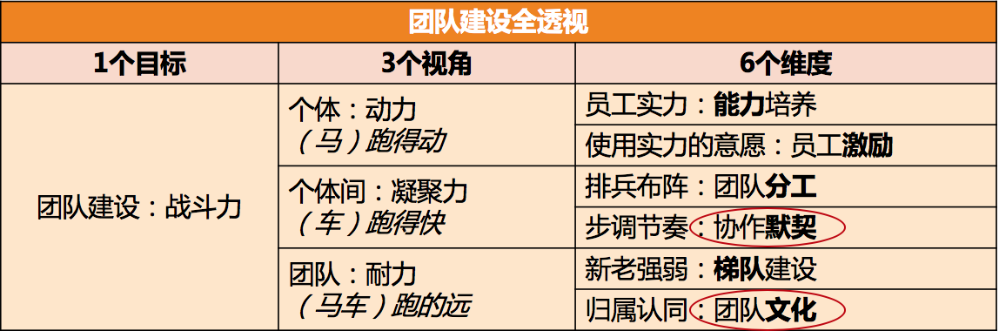

# 24 | 如何让团建活动不再“收效甚微”？
某天晚上，在技术管理群里，一位有着多年管理经验的技术总监问：“大家有什么好的团建活动推荐吗？之前的团建活动都收效甚微！”

然后，热心的群友开始七嘴八舌地出主意：

- “你多少预算啊？多少人？玩多长时间？”
- “我们上周刚去了趟沙漠徒步穿越，效果挺好的，你可以考虑。”
- “密室逃脱，特别有意思，大家玩得很开心。”
- “建议野外生存，能快速拉近团队成员间的距离。”
- “喝酒吃肉啊，喝酒特别能增进感情。”
- “可以一起去钓鱼……”
- “可以租个别墅玩桌游……”

我漫不经心地看着各种点子在屏幕上蹦现出来，大家越说越津津有味、兴趣盎然。直到一个人很不和谐地问了一句：“你希望通过团建达到什么目的呢？”看到这句话，我一下子来了精神，预感到这个话题终于要切入正题了，因为他触及到了“收效甚微”的病根。

虽说安排团建活动是管理者日常管理工作中很常见的一部分，但却很少有管理者敢说自己是团建活动的行家里手。我曾经做过几次统计，发现其中认为自己在这方面很擅长的管理者还不到10%，剩下的90%都认为自己做的团建活动效果一般，甚至是“没什么效果”。

这到底是哪里出了问题呢？经过深入访谈，并结合我之前的带人经验，我发现很多人掉入了三个误区。

**第一个误区，就是认为团建活动是万能的。**

不少管理者总是有意无意地认为，团建活动是“包治百病”的良药，所以对团建活动寄予了太多的期待，但最后的结果是 **要么期待模糊，要么期待过高**。

你不妨问问自己，也采访一下身边的管理者，一般会在什么情况下安排团建活动呢？你可能会收集到如下反馈：

- 在高强度、高压力的工作告一段落的时候；
- 在重大挑战之前给员工打气的时候；
- 在取得了重大工作成果的时候；
- 在公司庆典或者春节、圣诞等节庆日的时候；
- 在刚刚组建团队或者团队调整的时候；
- 在整个团队工作积极性不高的时候；
- 认为团队凝聚力不好或者彼此间合作不顺畅的时候；
- 希望打造团队文化的时候；
- 觉得很长时间没有做团建活动了，需要做一次的时候；
- “新人”入职的时候；
- “老人”离职的时候；
- ……

你会发现，团建的名目举不胜举，活动内容也是五花八门，相当丰富多彩。可是你是否审视过，这些活动能给你带来了什么效果呢？它们是否满足了你做这件事的初衷呢？很多管理者被问到这个问题时都会陷入沉思，因为平时很少思考这个问题。

盘点管理者安排团建活动的出发点，大体是如下三类：

1. **以团队需要为初衷**。比如提高员工积极性、提升团队凝聚力、打造团队文化、提升斗志、提升团队韧劲等。
2. **以员工需要为初衷**。常见的是调节放松，一段高强度工作之后，缓解员工的精神压力和紧张情绪。
3. **以个人需要为初衷**。比如，认为团建只是一项管理任务，需要时不时执行一次；或者只是单纯出于个人需要。

归结起来就是：为了团队、为了员工或为了自己，这三种活动定位。虽然我们习惯上把各种各样的活动都统称为TB（team building），但是我更倾向于认为，只有把团队建设作为初衷的活动才叫做团建活动，而不是所有的活动都属于团建活动。

初衷不清晰在团建活动中有两个表现： **期待模糊** 和 **期待过高**。

**期待模糊** 是指没有厘清这次团建活动要达成的效果，甚至还把团队诉求、员工诉求和个人诉求揉在一起。

比如，常常有管理者说：“大家最近很辛苦，这个项目完成后我们去郊区租个别墅玩。”我就想问了，你“租个别墅玩”，是为了什么呢？如果是为了做团建，让员工彼此之间有更好的认同度和默契，那么这个时机和方式是不是合适的呢？毕竟辛苦之后，你的员工们也许并不想再做一个团建。

而如果你是为了让员工调节和放松，这种方式就更加说不过去，毕竟休息方式是因人而异的。所谓休息方式，也就是一个人精力恢复的手段，有的是和别人聊聊天，有的是逛街逛商场，有的是玩网络游戏，而有的则是窝在沙发里发呆……你如果真的是想让你的员工们放松，就需要给他们自由度，让他们自主选择放松方式，而不是自作主张统一安排，那样员工只是“被休息”而已。

所以你看，作为管理者初衷不清晰，会给团队带来多么大的痛苦。

**期待过高** 是初衷不清晰的另一个表现，即，希望通过一次或几次团建就能打造出有凝聚力、有战斗力的团队，这种想法是很魔幻的。如果你还记得我前面介绍过的“团队建设六要素”，就不难发现，团建活动能影响到的要素，也就是其中的1.5个：这1个是指“协作默契”，0.5个是指“团队文化”。

为什么对团队文化的影响是0.5个呢？因为如果活动没有经过特别设计，是起不到“理解和认同团队文化”的作用的，最多就是增强一些团队归属感。

那对其他要素就没有作用了吗？显然，团建活动基本上不会影响能力、分工和梯队。事实上，一次活动如果影响到了这三个要素，倒也是件很可怕的事情。比如你去参加了一次活动，回来发现分工变了，你的心情可想而知吧：）

最后一个疑问是，为什么对激励也是没有效果的呢？一般来说，活动即便有刺激积极性的作用，也是非常短效的，收益并不明显。即便有时看似有收益，也是由于默契度和归属感两个要素的间接作用。

所以，团建活动直接影响的要素，仅仅是前面我提到的 **员工间的协作默契** 和 **团队上的团队文化**。而你却希望通过团建解决各种各样的团建问题，满足各种各样的团建期待，你说是不是有点魔幻呢：）

团队建设六要素

你可能会说，能取得这两个方面的效果也不错啊。事实上，即便这两个方面的效果，很多团建活动也拿不到。如果你认为活动随便做做就能收获到不错的效果，那就说明，我们需要聊聊第二个误区了。

**第二个误区，就是认为团建活动理所应当就有效果。**

实际上，没有什么好的成果是理所应当的。如果不经过设计，一次团建活动下来，甚至连员工间的默契和团队文化建设这1.5个要素的效果都达不到。

比如，如果你想让员工间尽快熟悉、增进彼此认同，而按照员工的兴趣，选用的方案是去KTV唱歌，或者去钓鱼馆钓鱼，这个效果就很难达成，因为这些活动的关键环节都不在于彼此交流和互动。你也许会说，吃饭喝酒容易拉近距离，而事实上，饭桌上的交流都很浅层，并不能深入了解；加上饭桌上话题很发散，不欢而散也是常有的事，这样效果就是负向的。

再比如，如果你团队的文化是“强执行”，但是你对整个活动中的迟到、随性的行为却没有任何反应，也没有设计什么活动环节来体现“强执行”这个理念的话，那么这个活动对于你团队文化的建设是没有任何效果的。这就是我前面提到的，团建活动只对0.5个该要素起作用。

所以，很多时候团建活动“收效甚微”，就是由于缺乏设计导致的。正如一位HR朋友所说的，“管理者们只是看到了活动内容，却看不到背后各个环节都是精心设计过的。”一旦效果不好，管理者们常见的说法，要么是活动内容不好玩，要么是经费预算太少。

其实这两个要素都不关键，主要还是看活动有没有经过设计。比如，像“烛光夜话”“裸心聊”“巅峰故事会”这类活动，基本上不需要经费，也并不算多“好玩”，但是经过设计之后，对于增进员工间了解和信任却非常有效。

所以，我想说， **缺乏设计，才是活动效果不好的主因**。

当然，作为管理者，你可能在活动设计上并不专业，思路也不见得很新颖，所以可以和别人合作来完成。但是确保活动方案和你的初衷匹配这一点，你是不可回避的。

**第三个误区，团建活动是部门助理、HR或行政的事情，管理者配合就好**。我想说，相比前面两个误区，这个才是最大的误区。

长期以来，在团建活动这件事上，很多管理者都是在配合部门助理、HR或行政的同事工作，他们干的最多的是协助组织，然后对活动品头论足。

如果你恰好看到了这篇文章，今后请务必以主人翁的姿态来看待团建活动。原因有如下：

1. **从收益看**。团建活动的主体和对象，即团队，是你的，所以活动能够在团建方面给你带来哪些帮助，是你要考虑的，这就是所谓的团建的初衷和目的。部门助理、HR和行政只是在帮你达成这个效果而已。如果你不操心这事，又怎么期待效果恰好如你预期呢？

2. **从成本看**。你付出了最大的成本，如果你不考虑收益，你就亏大了。千万别觉得团建活动只是花了你团队一些预算，其实更大的成本是整个团队要把这么多时间投入进来，这个时间和人力成本是很昂贵的。而且员工还投入了自己的意愿和耐性，你不能默认每个员工都是愿意参加活动的，也许很多人只是因为“团队活动不好推托”才参加的。所以，你能给大家带来什么效果才对得起这个成本呢？

你看， **无论从期待的收益，还是投入的成本，你都是最在乎的那个人**。因此，从现在开始，做团队活动的主人，与部门助理、HR和行政同事，一起去筹划，而不是完全假手于人。

至此，我们介绍了导致团建活动“收效甚微”的三个误区，那么如何才能做出“收效显著”的团建活动呢？

答案是，避开那三个误区，然后遵循下面的四个步骤。由于它们同时也是四个问题，所以我称之为“ **团建活动四问法**”：

**第一问，关乎初衷**：你是想做团建活动，还是调节放松，或是其他？

**第二问，关乎角色**：是你想做团建活动，还是只想配合一下助理、HR或行政的工作？

**第三问，关乎目标**：你想达成团建的什么效果？默契还是文化？

**第四问，关乎手段**：活动方案和你的目标匹配吗？

通过问自己这四个问题，你的团队活动将不会再“收效甚微”，你要不要试试看呢？

* * *