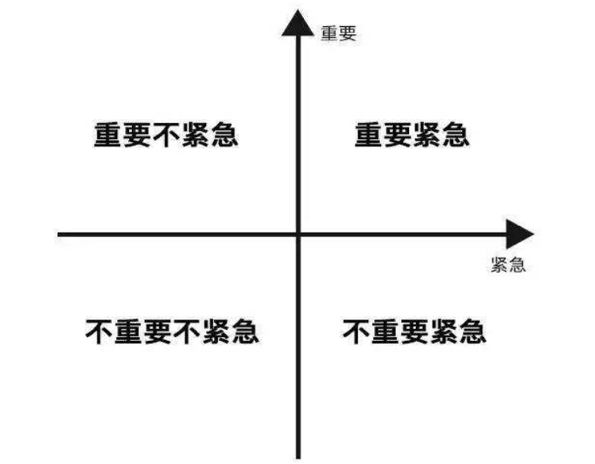
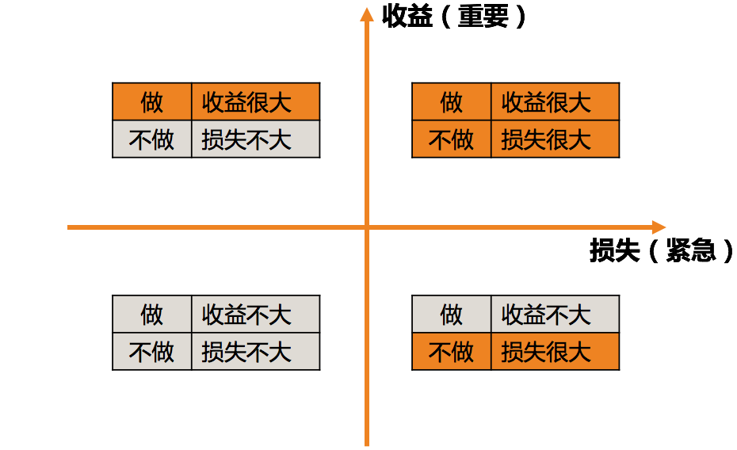

# 25 | 多任务并行该如何应对？
管理工作的三部曲——管理规划、团队建设和任务管理，到现在我们已经探讨完了管理规划和团队建设，从本文开始，我们进入任务管理的章节，也就是我们口头说的“做事”。

**如果说我们研究管理规划，是为了把事儿做对，我们研究团队建设，是为了理顺做事儿的主体，那么，我们研究任务管理，就是为了把事情做出来，产出实实在在的业绩和成果**。作为结果导向的管理者，这才是管理工作的落脚点。同时，也是验证管理规划是否合理、团队建设是否有效的最重要的标准和依据。

因此，“做事”是非常重要的管理内容。

既然这个事情这么重要，那我们是不是要花很多篇幅来探讨呢？不是的，我们从整个专栏的目录也可以看出，“任务管理”的比重并不高。这是为什么呢？因为这部分内容在大多技术管理者看起来都不是问题。

我在各种规模的公司都做过调研，所有的统计结果都显示，相对于其他管理话题，任务管理是技术管理者们最拿手的一项，不只是他们自己这么认为，他们的上级也是如此评价的。我想，这可能和工程师出身有关，工程师有一种确定性思维， “靠谱”是好的工程师天生的品质，凡是明确答应过的事情，往往都会如数兑现。

仔细回忆一下你遇到的执行问题，你也会发现，几乎大部分执行问题的主要症结不在执行本身，而是在角色认知、管理沟通、管理规划和团队建设上，因此，我们在“任务管理”这个主题上，也主要是探讨一些要点。

对于很多团队来说，大部分工作都是以“项目”形式存在的，因此，任务管理大体上又是项目管理，只是为了涵盖非项目的那些工作，我才把“做事”叫做任务管理。

话说回来，“做事”这个话题依然很大，我们要如何探讨呢？既然做事是一个过程，那么我们就分成“事前”“事中”和“事后”三段来探讨。

**在做事之前**，我们需要回答的问题是：要做哪些事？先做哪件，后做哪件？也就是分清楚轻重缓急，也叫优先级梳理。

**在做事过程中**，我们要确保事情的进展按照计划推进，尽在掌握之中，也就是有效地推进执行。

**在做事之后**，我们要复盘做事的整个过程，并从过去的经验之中抽取一些流程机制，以便以后在类似的场景下也可以做得更好、更顺畅。

因此，我们把事前的 **轻重缓急**、事中的 **有效执行** 和事后的 **流程机制**，称为任务管理三要素。这也是接下来三篇文章的三个主题。今天，我们就首先看看第一个要素，关于轻重缓急的梳理。

“做事”：任务管理三要素

虽然大部分技术管理者都不认为自己在任务管理方面是短板，但是仍然有一些问题困扰着大家，比如，“多任务并行该如何应对”，就是其中最突出的一个，特别是刚刚走上管理岗位不久的新经理尤其如此。为什么大家会头疼这个问题呢？因为大家面临的问题常常是人手不够，时间不多，但是要完成的工作却还在一件一件挤进来，这可怎么办呢？

实际上，对于每个团队来说，当下能做的工作是有限的，增加并发并不会让大家的产出更高效，所以，多任务并行问题归根结底还是优先级问题，即，你要优先保证哪项工作的顺利进行。

排项目优先级对于管理者来说是必备技能了，每月、每周甚至每天都在训练，相信你也对于“重要紧急四象限”耳熟能详了。我其实挺好奇，这个“四象限”对于盘点各项工作的优先级是否好用呢？

重要紧急四象限

我了解到的情况是，大家都很清楚“重要紧急的工作要排在最前面”“重要的工作要像大石头一样做长远安排”“紧急的工作要立即着手”“不重要不紧急的工作直接丢弃”等应对策略。可是令大家最困惑的是，到底怎么判断一项工作重要不重要，紧急不紧急呢？这个前置步骤才是最难以判断的，我举两个例子：

1. 老板刚刚口头交代的临时任务，这到底是紧急重要的、紧急不重要的，还是重要不紧急的呢？这个场景常常被倾向于认为是紧急重要的情况，必须如此吗？
2. 锻炼身体、学习培训常常被倾向于认为是重要不紧急的事情，情况真的如此吗？

对于上面的这两个场景，不同的人、不同的上级、不同的任务和不同的情况下，可能会被归入不同的象限，这并没有一个可供遵循的一定之规。那么当我们面对这样的问题时，该如何判断其是否重要紧急呢？

我采取的策略是问自己这两个问题：

1. 如果做，收益是否很大？收益越大，这个事情就越重要。
2. 如果不做，损失是否很大？损失越大，这个事情就越紧急。

你可能会有疑问，不做的损失越大，不也意味着很重要吗？为什么只强调紧急呢？我想说的是，如果想简化问题，就需要结合我们的实际工作场景。在实际的工作中，我们经常做的并不是梳理轻重缓急四象限，更常见的情形是，我们要把日常的工作分为两种情况：一种是计划内的，也就是按照我们的规划进行的；另外一种是计划外的，即突发的情况和任务。

我们的应对策略其实非常简单：

1. **对于计划内的工作**，我们更关注它在一个规划周期内的价值和收益有多大。我们会把价值足够大的任务安排进来，并持续地往前推进。
2. **对于计划外的工作**，由于是一种突发情况，是否要中断既有安排来高优先级跟进呢？中断既有安排一定是会影响正常推进的收益的，所以我们要做的决定是，是否要立刻跟进？如果不立刻跟进，带来的损失有多大？我们是否愿意并能够承担？如果不能，那就立即跟进。如果可以不立即跟进，那就转化为一个可以安排到“计划内”的工作，并参考第1条的策略就可以了。

**总结起来，对于任何工作任务，决策的步骤就两步：**

1. **对于“计划内工作”，看收益是否足够大。收益越大就越重要，也就越需要给予相匹配的优先级、资源和关注度；收益相对不大，就放入“To do list”，作为待办任务处理。**
2. **对于“计划外的工作”，看损失是否足够大。损失够大，就按照紧急任务安排，以止损为核心目的；如果损失可控，就放入“计划内工作”列表。**

这样是不是就容易操作了呢？

于是，我们可以改进一下“紧急重要四象限”，让它更加方便实操。既然我们可以通过看收益来判断重要性，通过看损失来判断紧急性，那么这个四象限我们就可以调整如下。

轻重缓急四象限（果见版）

关于任务优先级的安排，除了决策的步骤和方法，还有几个重要的原则，这里我特别交代一下，方便我们对齐认知。

**第一，目标是需要一以贯之的**。前面我们提到，通过看收益来判断一个任务是否重要，那么你参照什么来衡量收益呢？答案是目标。我们规划的目标里蕴含着我们一段时期内最重要的诉求和期待，也是衡量一项工作收益大小的坐标轴。

于是你会发现，目标的设定和评估贯穿着整个管理工作的全过程，目标越明确，在关键时刻我们的方向感就越强；反之，我们就会瞻前顾后，反复掂量却不得要领。所以，好的决断力，往往基于明确的诉求和目标。

**第二，任务安排是弹性的**。很常见的一个情况是，我们在做任务安排的时候，往往不自觉地会在心里做一个设定，即，这个项目做成某个样子才叫完成，所以需要预算这么多时间。而实际上，对于一个任务来说，其进度、质量和效果这三个要素是可以此消彼长的，所以在拆解任务的时候，对进度的预期不同，对质量的要求不同，对效果的期待不同，都会导致时间预算和优先级的变化。

所以，不能用固化的视角看待一个任务，每一个任务其实都是可以弹性安排的，不一定是你需要的4周，也不见得是上级希望的两周，根据进度、质量、效果的不同期待，你可以给出很多种排期方案。这体现一个管理者的经验是否丰富。

**第三，沟通是不可或缺的**。虽然排优先级主要是管理者来做，但是这并不意味着排好优先级之后就大功告成了。只有和所有相关的人员充分沟通了之后，才算是调整完毕，尤其是和自己的上级，一定要和他沟通新的工作安排方案。告诉他，你优先保证了什么，从而可能会影响什么。

一个有意思的情况是，上级更倾向于告诉你，他们想要什么；而不会主动告诉你，他们愿意用什么来交换。这不是他们“唯利是图”，也不是他们“只让马拉车不让马吃草”，而是因为评估影响并给出应对方案是你的工作，这是你最清楚且拿手的，而上级判断不出对你既有安排的影响到底多大。

所以，很多上级管理者跟我说，他们默认是需要沟通的，而不是默认不沟通，最怕大家最后给他们一些“surprise”。

此外，很多上级倾向于告诉你，每件工作都是重要的，都是要正常推进的。但这其实只是美好的愿望，你心里要有数。如果所有的工作都重要，那就意味着没有重要的工作，所以，你要清楚上级最核心的期待是什么，这就需要看你们长期合作磨合出的默契了。

好了，关于“做事”之前，我们如何安排任务的轻重缓急，我们就先探讨到这里。这篇文章，我们主要探讨了做事所包含的三个要素，以及在做优先级梳理时，可以遵循的步骤和原则。如果这恰好是你擅长的管理内容，欢迎你留言和大家分享你的经验和技巧。

* * *