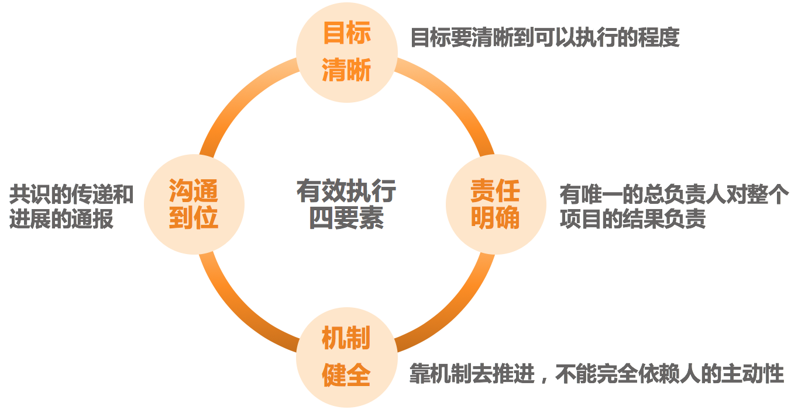

# 26 | 如何确保项目的有效执行？
在上一篇文章，我们探讨了如何梳理任务优先级，解决了“做什么”的问题。本文我们来看看如何把任务列表中的这些事儿都落实到地上，也就是“怎么做”的问题，即，如何确保执行过程可控、执行结果符合预期？

关于如何确保项目的有效执行，我们有两个探讨的角度。

第一个角度是充分条件视角，即，列出有效执行的所有要点，大家照着做就可以把项目执行好。估计这是很多新经理都希望的一个方案，但是，这基本是实现不了的。就别说是适用很多公司各个场景了，即便是总结出一套适用于一个公司多类项目的方案，也很难做到。所以，我们还是从另外一个角度来看项目执行的问题。

第二个角度是必要条件视角，即，我们探讨出一些要点，在项目执行中，只要有一个要点没有做到，项目就很难得到有效的实施。我们把这些要点整理出来，为我们的项目执行提供有价值的参考。

那么，都有哪些要点呢？换句话说，有哪几件事做不好，就必然会引发项目执行过程的不可控呢？结合我过去的项目管理经历和调研访谈来看，我发现有四大类问题最为集中。

**第一大类**，不知你是否遇到过如下的情况呢：

1. 虽然你很清楚做某项目的初衷，但是并没有去设定可以衡量的目标。比如某次技术重构、某个模块性能优化等。也就是说，虽然你知道自己想要什么，但是不知道出于什么原因，你没有设定一个清晰可衡量的目标，而目标不够清晰的话，必然会引发时间预算、人力预算，以及优先级决策的模糊。

2. 虽然在你眼中目标很清晰，比如“到年底某模块单机性能达到500qps”，但是负责项目实施的员工并不知道该从哪里下手去执行。

3. 在你看起来，两周能搞定的事情，员工却花了3周时间。诚然，完成质量的确很高，可是和质量比起来，你更希望在2周内发布。

4. 项目交付时间提前到这个周末了，员工没有完成，可他为什么还一副很无辜的样子呢？

5. 项目是如期发布了，可是这不是你想要的效果啊！

诸如此类的状况层出不穷。它们的共同特点在哪里呢？显然，它们都是有目标的，但是这个目标出现了三个情况：

1. **目标不够明确具体，至少没有具体到执行人员可以执行的程度。**
2. **上、下级对目标的理解看似一致，实则有偏差，尤其是对进度、质量和效果的拿捏上。**
3. **目标发生变化了，没有及时同步给相关的人员。**

归结起来，这三种情况都导致了目标不清晰的后果。当目标不清晰的时候，必然会引起员工在紧急程度、质量水平和效果取舍上的偏差，最后也就引发了执行上的偏离预期。你也可以回忆一下那些执行良好的项目，你应该不难发现，它们都有一个共同而又必要的条件：清晰的目标，只不过在实际执行过程中，每个人对“清晰”的理解会有所不同。

**第二大类**，请你回想一下在执行上令你不够满意的那些项目。然后问自己如下三个问题：

1. 这个项目涉及到的各个相关团队，是否都有一个明确的负责人呢？
2. 这个负责人和所有项目组成员，是否都清楚各方面的负责人呢？
3. 这个项目是否有唯一的总负责人，以及总负责人是否有效呢？

这些看上去非常普通的问题，却是很多项目执行障碍的一大源头。其中有两个模糊的地方，让“责任人”这个简单的问题变得失控。

**第一个地方是：各负责人对于“负责”的理解常常是不一致的**。很多负责开发的工程师，他们认为的“负责”就是承担自己份内的开发工作，而项目某一角色的负责人是指对该项目中所有涉及项目执行和协调的问题都要负责。

**第二个地方是：总负责人无效**。即，虽然有名义上的总负责人，但是总负责人顾不过来也好、自己不认同也好，都会在项目执行过程中“缺位”。比如，各个角色的负责人，都会把他们的共同上级作为默认的总负责人；还有些创业公司干脆是创始人号称要自己带项目，但是这些人实际上又没这个时间和精力，在其位不能谋其政，所以导致的后果就是项目总出问题，然后就怪这个怪那个……

对于这个问题，我有个经过验证的方案可供参考。即，把上级作为“客户”来看待，并另寻总负责人和这个“客户”来对接需求。而这个总负责人，是从项目的各个角色的团队负责人中产生，来总体负责和协调该项目。如果各个角色之间有长期稳定的合作关系，比如某APP的迭代团队，就可以把各个角色的负责人组织起来，组成一个项目管理的虚拟组织，大家轮流来做总负责人。这样既解决了项目总负责人缺失的问题，还培养出多个更高级的项目管理人才。并且假以时日，整个团队甚至整个公司的项目交付水平，都会有明显的提升。

这归结起来，第二类问题是集中在大家认为最简单、最容易，但又最容易忽视的项目总负责人的“缺位”上。

**第三大类**，常见的说法有：

1. “如果A也像B那么积极主动，这个项目就不会出问题了，所以A，你能不能更主动一些呢？”
2. “我们明明约好了有问题及时通报，为啥总有些人不通报呢！”
3. “我们各种各样的流程都有，很完整也很系统，但是大家就是不按照流程办事……”

你能看出上面这些说法反映了一个什么问题吗？

由于我们见识过某些优秀人员的优秀表现，所以我们就过于迷信人的主动性和职业水平，等出现了问题的时候，就总觉得是“人不行”。事实上，团队成员的能力水平都是正态分布的。另外，如果真的是“人不行”，那么人从“不行”到“行”也会是一个缓慢的过程，而此时此刻你就得做事，那你打算怎么办呢？这就要靠流程和机制了。

于是很多管理者就制定了全套的流程让团队遵循，但由于学习和执行成本很高，员工遵循起来非常痛苦，因此就干脆让流程机制去“睡大觉”。这也是很多团队的真实情况，他们有很多流程机制、规章制度的页面，但是还是做不好项目。

归结起来，这类问题主要体现为：

1. 过于依赖人的主动性，缺乏基本的流程和机制。
2. 虽然有机制，但是没有人监督执行。
3. 虽然机制有人监督执行，但是大家依然不愿意执行。

关于这个问题，我们会在下一篇文章中专门探讨，此时我们先不展开。只要了解到，这是项目执行问题的一个关注维度即可。

**第四大类**，常见的说法有：

- “我通知了啊，为啥他们就是不听呢？”
- “对方有问题不主动找我沟通，关我什么事！”
- “我不知道啊！什么时候变更的？”
- “不是说好了周五交付的吗，他们没有如期交付啊！”

类似的说法还有很多很多。相信你一眼就可以看出，这类情况就是“信息不对称”，大家在一些事情上没有达成共识，由此产生了协作上的偏差和误会。原因可能是对信息本身的理解就不一致，也可能是没有有效传递和同步，总之在沟通这个问题上有诸多的不顺畅，归结起来就是：

1. 主动意识不足，沟通不够主动。
2. 通报意识不足，没有知会到所有相关人员。
3. 闭环意识不足，广播出去了，就默认对方收到了。

无论是哪种情况，导致的后果就是沟通没有到位。关于管理沟通的问题，是我们下一个篇章的主题，到时候我们也会做更详细的探讨。这里，我们先了解到，沟通不畅，是项目执行不到位的主要原因之一。

至此，我们就了解了项目执行过程中最常见的四类问题。

当然，关于项目得不到有效执行，也许还有许许多多的其他问题，就好像“不幸的生活各有各的不幸”一样，项目执行不好也各有各的原因。上面我们阐述的，只是最常见的四类问题。如果你的项目没有这四类问题，不见得一定执行良好，但是如果出现了这四类问题中的某一类，执行上一定会有问题。

所以，我把避免这四类问题的钥匙归结为“有效执行四要素”，即 **目标清晰**、 **责任明确**、 **机制健全** 和 **沟通到位**，以方便我们梳理和诊断执行问题。

有效执行四要素

为了提升可操作性，我把这四个要素扩展为12个问题，如果你对某个项目的执行不够满意，又想了解到底是哪里出了问题的时候，就可以参照这个“问题清单”检查一下。相信很快你就可以找到问题所在，从而对症下药。

任务执行检查清单

项目或任务的管理和有效执行，是很多技术管理者的拿手好戏，本文可以算是抛砖引玉。你是否愿意分享你的心得和方法呢？欢迎你留言和大家分享。

* * *