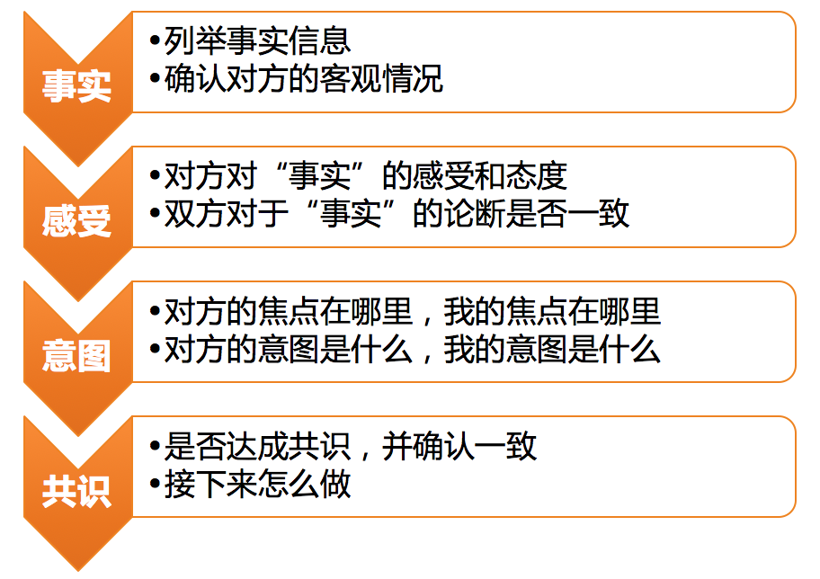

# 29 | 沟通经常鸡同鸭讲，说不到一块怎么办？
作为一个团队的管理者，你不可避免地要把很多的时间和精力花在与各种各样的合作者沟通上。而且，随着团队规模的不断扩大，以及级别的不断提高，对沟通能力的要求也会“水涨船高”。

在做工程师的时候，和你沟通合作的往往都是你熟悉的一群人。走上管理之路后，你会发现，随着做管理的时间越来越长，跟你打交道的人会变得越来越五花八门，什么样的人都有。沟通中常常会遇到的一个情况就是，你说你的、他说他的，好似“鸡同鸭讲”，用东北话说就是“费老劲了”！这怎么办呢？

显然，这类问题，说到底是一个沟通效率的问题，即，无论是同步信息也好，还是影响说服也好，如何才能轻松搞定，高效达成呢？

关于沟通效率，我们可以从两个角度着手去提升：

1. 提升沟通通道的品质；
2. 提升沟通的技能。

上篇文章中我们提到，沟通通道的品质，主要是从稳定性和效率来衡量的。

所谓 **稳定性**，就是这个通道是稳定可靠的，不会动不动就谈崩或断了联系，即使有点误会，双方也能够相互包容和谅解。在这个因素上，信任关系和信任水平就起了决定性作用。当你被对方充分信任的时候，你会发现很多不必要的沟通都可以省掉了，这种合作当然高效。

所谓 **效率**，就是这个沟通通道的效果和成本之比。所谓高效，是指双方只需要非常少量的成本，就可以达成很好的沟通效果。在这个维度上，双方的默契程度起了决定性作用。当你们之间高度默契的时候，一举手一投足、一个眼神一个表情、只言片语就可以心领神会了，所谓“心有灵犀一点通”即是如此，相信你曾经有过这种神清气爽的体验。只是，这种体验换一个人沟通就可能会消失，因为你不会和每个人都拥有这种默契。毕竟两个人的默契，不是一朝一夕产生的，需要长时间的磨合和调适。

所以，信任也好，默契也罢，都体现了沟通通道品质的这两个因素是需要长期经营的，它们更像是用来体现结果的，而不是可以灵活使用的手段。那么，如何在这两个因素上进行积累，以达成那样的结果呢？以及，我立刻就要解决鸡同鸭讲、沟通低效的问题，该怎么办呢？

这就是我要说的第二个角度，即，靠沟通技能，使用沟通工具和沟通技巧来解决当下的沟通问题。有什么好用的工具吗？我们先来看一个真实案例：

> （背景）某项目原定于6月7日完成，可是实际到6月9日才完成，于是研发经理刘备就找负责的工程师张飞沟通。
>
> 刘备说：“咱们这个项目按计划7号完成，你delay了两天也不跟我说一声，我是最后一个知道的！”
>
> 张飞说：“我跟负责项目的产品经理孔明说了啊，他也觉得没问题，大家没有异议就行了呗，项目不是成功发布了吗！”
>
> 刘备说：“那也应该提前跟我说一声啊，我如果提前知道就会让子龙来帮你，最后也不至于delay两天。”
>
> 张飞说：“我觉得我能搞定，你不要动不动就让子龙来帮我，这是对我的不信任。要不是最近孩子生病我也不会delay。即便delay了，我也和合作方都沟通好了，什么事都没耽误。而且我已经尽最大努力了啊，你还要怎么样呢？信不过我的话，下次这样的项目你交给二哥去做吧！”
>
> 刘备说：“我就是想让你提前告诉我一声，你急啥！”
>
> 张飞说：“你先急的好不好！”
>
> ……

好，案例我们先看到这里，你觉得接下来会发生什么事情呢？如果你是其中的刘备或者张飞，接下来你会怎么沟通呢？

在日常的管理沟通中，类似的场景数不胜数。有的会互怼下去，僵持不下；也有的会选择逃避，敷衍了事。但是这都达不到彼此沟通的意图和目的。那么，怎么沟通才能达到彼此的目的呢？

下面，我介绍一个工具，在沟通中，我们可以使用它来对齐彼此的信息、感受和意图，具体如下图所示：

基于“3F”倾听的沟通层次图

学过教练技术的同学一眼就可以看得出，这个工具的前三步，其实就是“3F”倾听，只是在相互倾听的基础之上，又走到了第四步，去确认有没有达成共识。

所谓“ **3F**” **倾听**，就是要从对方的谈话中听出三层信息：

**第一，事实信息（FACT）**。即，对方说了哪些事实性信息？和你掌握的信息相比有没有什么不同？这是沟通的第一层，也是最基础的一层。如果双方连基本的事实信息都不一致，达成有效的沟通结果就无从谈起了。

我们来看看，在上述案例中，刘备和张飞的沟通是基于一致的事实信息吗？不难发现，对于这三点重要的事实：

1. 项目delay了两天完成；
2. 张飞没有提前和刘备打招呼；
3. 项目结果各角色都认同，没有耽误事儿。

双方都认同，是没有异议的，可见他们沟通的基础信息没有分歧。

由于事实信息的客观性，只要肯沟通，这层信息是最容易达成一致的。所以，在发生意见和看法不一致的情况下，首先来对齐事实信息是必要且有效的。当然，随着双方背景信息的不断同步和默契度的不断提升，在一些沟通中该步骤常常被省略。但是，被省略并不意味着不重要，一旦发生分歧的时候，就需要把这层内容拿出来检视和对齐一下了。

**第二，感受和判断（FEELING）**。即，对于上述事实信息，双方是什么样的感受和判断。由于每个人生活的环境不同，所处的角色不同，惯用的思维方式不同，沟通的初衷也不同，所以，即便是针对同样的客观事实，双方的感受和看法也常常是不同的。这就是沟通中最容易发生分歧的地方。

我们还是通过前面的例子来看，基于同一个事实，刘备和张飞各自的感受和判断是什么。

在刘备看起来：如果张飞提前告诉他这个风险，这个项目本可以不用delay；而且，自己作为张飞的直接上级，最后才知道有这回事，无论怎么说，自己和张飞之间的协作方式都需要改进。

在张飞看起来：delay两天确实不应该，但也是不可抗拒的客观情况造成的，而且为了不给刘备添麻烦，自己主动协调好了各个合作方，并保证项目成功发布，刘备不但不领情，还一副信不过我的样子，显然在他眼里子龙更能干。

当然，我不是刘备，也不是张飞，这些内心的感受和观点，也是我采访他们之后得知的。你可以看到他们对于同一个事实，双方的感受、判断和期待是很不一样的，之所以会发生后面的情绪对抗，其实就是从这里开始的。

实际上，我们常说的“默契”，就主要体现在沟通双方对彼此的感受和判断逻辑的理解程度上。因此，你们越是熟悉彼此的立场、思维方式和沟通风格，就越是容易和对方达成默契。所以，默契是在不断合作的过程中磨合出来的，很难自然而然地形成。

那么，在还没有这种默契的时候该怎么办呢？难道就要像刘备和张飞一样争执和互怼吗？

我的回答是， **有意识地去询问**，而不是默认对方一定清楚自己的逻辑和判断。怎么询问呢？如果我是刘备或者张飞的话，我可以这样说：“对于这些事实情况，我的看法是这样的……我想了解下，你的看法是什么呢？”这样一确认，就避免了“猜测”和“想当然”带来的各种各样的误会。

**第三，意图（FOCUS）**。即，对方沟通的焦点在哪里，各自为了达到什么意图和目的。每一次沟通，都是基于某个特定的目的和初衷的，无论这个问题你有没有在沟通之前去刻意厘清，都是如此。

上一篇文章我们提到，沟通的目的不外乎四个：建立通道、同步信息、表达情感和输出影响。显然，在前面的案例中，刘备沟通的目的和意图是想说服张飞，让他在以后的工作中，提前通报风险，而不是瞒而不报，他从来没有质疑过张飞的能力。而张飞的目的和意图是什么呢？他在表达一种不满，这种不满情绪的背后，是他希望刘备可以给他一些认可和鼓励，并信任他的能力。

所以你会发现，他们的意图并没有矛盾和冲突，这场沟通，完全可以达到彼此满意的结果。只是因为他们在沟通中，不在一个频道上，把事实、判断、感受、责任、原因、方案等统统揉到一起来说了：你讲事实他说原因，你说原因他说感受，你说感受他说逻辑，你说逻辑他说责任，你说责任他说解决方案，你说解决方案他说困难……最终就成了“鸡同鸭讲”，互相的不理解和不认同。

通过用“3F”倾听和沟通层次图对上面的案例进行分层拆解，你不难发现，如果我们在沟通中，有意识地分事实、感受、意图这三个层次去理解对方的话，并且从这三个层次分别和自己的事实、感受、意图做一个对应，就可以减少很多不必要的误会，同时避免情绪对抗，从而达成有效的沟通结果。

对于一个经常沟通的对象，你可以用这个工具，在和对方不断地倾听与确认中，形成默契；在不断地默契合作中，提升信任。当信任和默契程度越来越高，也就是沟通通道品质越来越好时，很多工具和技巧也就可以省略和简化了。于是，你也就知道了，越是在信任度和默契度低的情况下，这个工具越有用武之地；越是在人多口杂的时候，越容易让大家在同一个框架下达成沟通成果。

所以，如何高效顺畅地沟通呢？用一句话来说就是，通道品质好就靠通道，通道品质不好就靠沟通技术。用什么沟通技术呢？从基于“3F”倾听的沟通层次图开始练起吧，练到“心中有剑，手上无剑”，很多沟通困境也就不攻自破了。

* * *