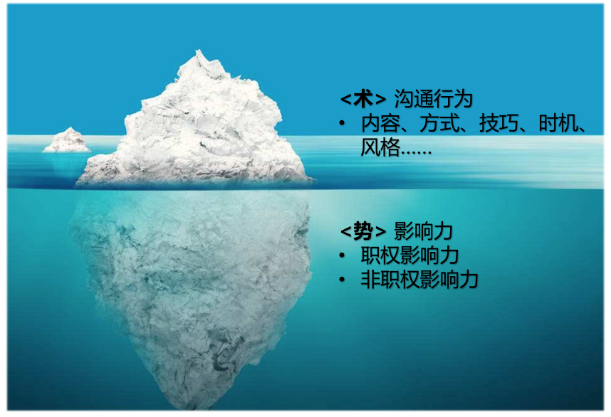

# 31 | 我各方面做得都很好，就是做不好向上沟通
在前面第28篇文章中我们提到，根据实际统计结果显示，向上沟通是技术管理者们最挑战的管理主题之一。那么具体是哪些事情，让管理者们感到头痛呢？

基于上百个关于向上沟通的问题反馈，我发现有如下四类问题是最为普遍的。

**第一类：和上级能不聊就不聊**。主要说法有：

- “上级太忙了，我的事情好像没有那么重要，等他闲了再说吧。”
- “找不到上级，他很少在工位，每次碰到他都急匆匆地走开，没机会聊。”
- “把领导交代的工作做好就行了呗，有事没事找领导聊啥，最讨厌有事没事讨好领导！”
- “总是觉得和上级有距离感，很难聊到一块儿。”
- “每次见了上级说话都不利索，能用邮件沟通就写邮件吧。”

**第二类：拿捏不好该不该和上级聊的分寸和尺度**。主要说法有：

- “最近取得了一个不错的成绩，要不要和上级说一说呢？”
- “感觉自己离技术越来越远，有些焦虑，是不是可以把上级当作朋友来聊聊呢？”
- “某项目很可能会delay，上次和领导打过招呼了，他不置可否，随着形势越来越严峻，我要不要再跟他说一次呢？”
- “我和合作者有些隔阂，不知道适不适合告诉上级。”
- “上级招我们来是解决问题的，而不是来给上级制造问题的！”

**第三类：很难领会到上级的意图**。主要说法有：

- “上级告诉我这个项目要加紧了，可是要加紧到什么程度呢？”
- “上级把这个工作交给我负责，却又安排别人参与进来，这是不信任我吗？”
- “上级让我去做一个调研，也没有说什么时候要结论，到底急不急呢？”
- “老板到底在想什么呢？他最近突然不找我了……”

**第四类：如何影响上级的一些观点和决策**。主要说法有：

- “老板常常有不靠谱的需求和新想法，我就不知道该如何柔和又不失礼貌地拒绝。”
- “上级对项目进度的需求总是很高，如何管理上级的预期呢？”
- “有个项目需要向领导申请增加人力，如何跟他说呢？”
- “上级总是不采纳我的建议，有何良策吗？”
- “上级不懂业务，还喜欢拍板做决策，怎么应对？”

怎么样，上面四类问题，有覆盖到你的情况吗？

由于向上沟通永远是你和上级的“私事”，所以我们无法给出一个普遍适用、一劳永逸的标准答案，也无法穷举所有的向上沟通的场景。但是，我们来逐个分析一下这四类最集中的问题，也不失为一个好的探讨方法，不是吗？

接下来，我们就逐类来分析一下。

**第一类，关于“和上级能不聊就不聊”**。你不难发现，无论是所谓的“上级太忙了”，还是“找不到上级”，甚至干脆认为就不该和上级沟通，归结起来，都是没有意识、意愿或能力和上级建立良好的“沟通通道”。

那么如何建立良好的沟通通道呢？你可以从以下四个方面来着手和审视。

**第一，沟通意愿**。这是基本前提。作为一名工程师，你不主动和上级沟通问题也不大，因为上级一般会有意识地主动和你沟通。但是，如果作为一名管理者，你还不主动和上级沟通的话，那就相当于已经上大学了，还要家长和老师逼着做作业一样。又如何指望你能带领别人往前走呢？

实际上，在我和中层管理者聊他们对下属的期待时，他们大多都会明确表示，希望我和初级管理者们澄清一个事情，那就是：“上级默认是需要管理者们主动向上沟通和反馈的，而非默认不需要。”

关于沟通的意愿，你可以首先审视一下你的角色：你是一名工程师还是一名管理者？然后再审视下自己的初衷：你是为了自己而沟通，还是为了团队去沟通？

通过问自己这两个问题，让你的角色给你沟通的力量和动力。关于角色认知，我们前面的文章已经有过明确的探讨，这里不再赘述。

**第二，事务特点**。即，根据事务的特点，比如是否重大、是否紧急、是否敏感、是否正式等，来确定沟通的方式和频次。这很容易理解。

**第三，沟通风格**。如果说审视事务的特点，是根据“事”来选沟通方式，那么审视沟通对象的风格，就是根据“人”来选择沟通方式。探讨沟通风格和管理风格的工具比较多，比如大家都熟悉的DISC，以及盖洛普的“四大优势领域”等，如果感兴趣你也可以去了解和学习一下，核心是根据沟通对象的风格特点，来选用你们更高效和易接受的沟通方式。

**第四，信任关系**。如果说前面提到的沟通意愿、事务特点和沟通风格，都是为了鼓励你主动加强沟通的话。那么对于你和上级信任关系的审视，就是让你看看，是否可以简化沟通。比如你原本需要长篇大论的汇报，对于默契度很高的上级，可能也就是一条消息的事儿；你原本需要多次沟通的问题，对于信任度很高的上级，可能只要简单一句话，甚至都可以免掉沟通。

所以，你需要花多大精力去准备沟通，很大程度上取决于你和上级的沟通通道的品质。也就是前面的文章中我们提到的信任和默契。信任决定着你们沟通关系的稳定性，默契代表着你们沟通关系的效率和性能。

好了，你如果从 **沟通意愿、事务特点、沟通风格、信任关系** 盘点下来，还是不需要和上级去沟通，那么这种不沟通就是你有意识的不沟通，它可能带来的破坏性和损失也就可控了，这和消极的不沟通，是两码事。

**第二类，关于“拿捏不好该不该和上级聊的分寸和尺度”**。我曾经在课堂上做过这个练习，把这些问题作为候选清单，让管理者们选出他们认为需要沟通的选项，结果大家给出的建议五花八门。如果我是个管理者，听到这么多建议，估计会更晕了。

为什么不同的管理者的看法会有这么大差异呢？原因是，每个人在评判“该不该聊”的时候，都是基于自己的管理常识（common sense），而每个人在和不同的上级打交道的过程中，形成的常识是不同的，所以会给出不同的答案。

在我看起来，大多拿捏不好“该不该聊”这个问题的情况，都是由于还没有厘清自己想通过这次沟通拿到什么，即沟通的目的和初衷不清晰。很多管理者甚至不清楚该如何来描述自己的初衷。

我这里给出一个参考：你是否还记得在前面第28篇文章中，我们提到“沟通总体上有四个目的”的说法吗？这四个目的就是 **建立通道、同步信息、表达情感** 和 **输出影响**。而你和上级想要沟通的目的，也跳不出这四个，只是你需要明确“就什么事”达到上述四种目的中的一个或几个。

比如我们来看前面的案例：

- “最近取得了一个不错的成绩，要不要和上级说一说呢？”这时你可以问下自己：“我是想就此向上级表达我很有成就感？”

- “感觉自己离技术越来越远，有些焦虑，是不是可以把上级当作朋友来聊聊呢？”这时你可以问下自己：“我是想就此寻求上级的支持和帮助，成功地让他给我一些建议？”

- “某项目很可能会delay，上次和领导打过招呼了，他不置可否，随着形势越来越严峻，我要不要再跟他说一次呢？”这时你就可以问下自己：“我是想就这个问题再和他做一次信息同步，如果有可能，我会进一步说服他给我提供一些资源和支持吗？”

- ……

在这类问题上，我们无法去评判哪个目的更重要，或者更应该和上级聊，因为我们不是当事人，只有当事人自己才最清楚这个目的对他来说意味着什么。所以，我唯一能做的，就是给你这个方法帮你厘清沟通的目的，至于每个目的有多重要，你还可以问自己两个问题：

1. 这次沟通能给你带来什么价值？
2. 这次沟通能给上级带来什么价值？

然后，你根据自己的目的，做出自己的选择和判断吧！

**第三类，关于“很难领会到上级的意图”**。对于沟通意图的领会，其实就是对于信息的无失真传递和接收。但是你知道，由于每个人都有自己一套独特的认知体系，所以对于同一个概念的理解都会不同。那又怎么可能做到无失真的领会呢。

相信你也听过这样一个说法：看似是两个人之间的沟通，其实至少是“四个人”之间的对话，哪“四个人”呢？也就是：你想表达的、你实际表达的、对方听到的和对方对于听到内容的理解，这其中每一步传递都会造成失真，所以很难领会到对方的真实意图也就情理之中了。

那么如何降低这种失真所带来的沟通误差呢？在第29篇文章中，我已经给出了方案： **通道品质足够高的话就靠沟通通道；如果沟通通道品质不高，信任和默契程度不够，就需要靠沟通工具来对齐了，沟通层次图及“3F”倾听是个不错的工具**。

另外，用一些“回放”的句式来确认，也是个好方法，比如你可以用下面的话来回放和复述你所听无误：

- “你是不是这个意思，……”
- “你看我理解的是否准确，……”

可别小看它，在沟通重要的事务，以及和不熟悉的人沟通时，这个小技巧能帮你避免大的沟通偏差。

**第四类，关于“如何影响上级的一些观点和决策”**。这是向上沟通中的一大类需求，无论是“希望上级接受自己的建议”或者“拒绝上级的不合理需求”，还是“调整上级的预期”或者“说服上级给予资源和支持”，归结起来都是让上级听从自己的看法和方案，即把自己的认知和期待输出给上级。所以，这类需求其沟通的目的就在于“输出影响”。

为了达到“输出影响”这一目的，你可能会根据上级的风格去选取合适的沟通方式，根据上级的关切去选取合适的内容和呈现逻辑，并根据上级的状态去选取合适的沟通时机，等等。我想说，这么做都没问题，而且有时会很奏效。可是，既然这个问题能够成为管理者们普遍头疼的事情，说明这些效果是有限的，因为问题还是依然棘手。

那么，如何才能有效地对上级实施影响呢？我给大家用下面的冰山模型做一个提示：

“说服影响”的冰山模型示意图

从上图你不难看出，说服一个人时，沟通技巧是在“术”的层面起作用；而对说服效果影响更大的因素，却是水面下的冰山，即“势”的部分，也就是你对他的影响力如何。

当你对他的影响力很小的时候，你的技术和方案再优秀，影响力也是非常有限的。举个例子，对于一个完全相同的建议，一线工程师提给CEO，和CTO提给CEO，极有可能是完全不同的结果。究其原因，就是你们两个对于CEO的相对影响力差别是很大的。也就是说，如果你要想有效地对上级实施影响和说服，你的影响力是至关重要的。

那么，该如何盘点和提升自己的影响力呢？我们下一篇文章再来继续探讨。

* * *