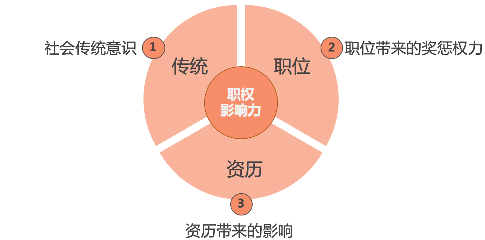
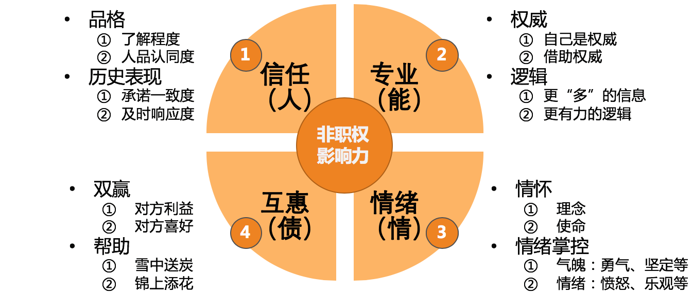

# 32 | 横向沟通和非职权影响力
**向上沟通**、 **向下沟通** 和 **横向沟通** 构成了管理沟通的主体，所以我把它们称为管理沟通的三大典型场景。在上一篇文章中，我们已经探讨了向上沟通。今天，我们就来聊一聊横向沟通，也就是和没有直接汇报关系的合作方之间的沟通。

首先我们来看，横向沟通有哪些目的呢？既然横向沟通也是一种沟通，那么就不外乎前面我们提到的四个目的：建立通道、同步信息、表达情感和输出影响。在真实的横向合作中，你不难发现，大多都是以同步信息和寻求支持为目的。其中，寻求支持就是通过说服对方来支持自己，其目的也就是“输出影响”。

关于同步信息，对于技术出身的管理者们来说主要是意识层面的挑战。一般只要意识到了，大都就能做到，因为他们是信息传输方面的行家里手。所以，横向沟通更核心的挑战在于：对于没有汇报关系的合作者，如何获得他们的支持和帮助呢？

我的回答是，和向上沟通中希望“说法影响上级”一样，无非是靠沟通的“术”和“势”，而且重点在于“势”，即，你对对方有多大的影响力。

从探讨沟通话题的第一篇文章，到向上沟通，再到横向沟通，我们反复提到影响力的决定性作用，但限于文章篇幅一直没有展开，现在看来已经避无可避，是时候详细探讨一下影响力这个话题了。

**影响力，是一种不使用强制性力量却能改变别人的看法和行为的能力。一般又分为职权影响力和非职权影响力。**

所谓 **职权影响力**，主要是指你的职位因素所提供给你的影响力。在我们工作中常见的是如下三个因素：

1. **传统因素**。即在社会传统意识和社会规范当中，对于上级的基本姿态是要服从的。所以人们对于上级有一种天然的服从感。

2. **职位因素**。即从组织架构的角度，由于上级对于下级有奖惩和评价的权力，使得下级对他们有一种敬畏感，从而更容易遵从上级。

3. **资历因素**。即有资历的人，在人们的眼中是值得敬重的。虽然在互联网领域里，已经很少提及论资排辈了，但不可否认的是，你新加入一家公司时，对于公司里资深的老员工常会有一种敬重感，这是人之常情。

职权影响力要素

虽然职权影响力是影响力的一个重要组成部分，但是我们只要能大体了解，或者知道什么是职权影响力就可以了，这并不是我们探讨的重点，因为这个影响力的发挥和发展，受到职位因素的影响比人为因素的影响更大。所以，我们还是来聚焦于我们通过努力可以提升的影响力，即非职权影响力。

**非职权影响力**，即，不是利用你的职位因素而提供的影响力。那么，非职权影响力有哪些因素呢？

在非职权影响力方面，美国社会心理学家罗伯特·B.西奥迪尼的《影响力》可以说是殿堂级的著作，他主要从互惠、承诺一致、社会认同、喜好、权威和稀缺这六个方面，探讨了影响力是如何影响人们的。你如果感兴趣也可以去仔细阅读一下这本书。这里我并没有完全套用这六个因素，而是基于我们管理沟通中的实际场景，并结合技术管理者日常可以采用的手段，整理出如下 **四个维度、八个因素**。

非职权影响力的四维八因素（果见）

**第一个维度是信任，是关于“人”的**。其影响力发挥的逻辑是：“你之所以能影响我，是因为你是XX，我信任你这个人。”这个维度有两个因素比较有效：

**一、人品和品格**。这个看上去挺虚的因素，在人们实际的决策中却起着非常重要的作用。我访谈过几位高级别的管理者，问他们愿意对什么样的下属委以重任，他们基本都会提到“人品”这个因素， **人品比较“正”的人他们更愿意信任**。所以要想提升自己在这个因素上的影响力，不妨去盘点一下别人经常用什么正向的词来形容你，并进一步地把它们打磨得更加鲜明。一旦对方认同你的人品，就有了很好的信任基础。

**二、历史表现**。我经常和新经理们说：“你们当前的影响力，很大程度上来源于你们之前的历史表现，所以，要想之后有更好的影响力，就从现在的事情做起吧！”那么，怎么做呢？ **去承诺，然后去兑现承诺，即秉承我们常说的“承诺一致性”**。这个方法是我最习惯于使用的。我曾两次空降做技术VP或CTO，两次都和CEO建立了良好的信任，主要就是靠“承诺一致性”。

关于这一点，我相信很多技术管理者们都能做到兑现承诺，但是，却只有少数能做到“事前承诺”。比如，和上级约定好一段时间内所要完成的重点工作，并承诺完成。多数管理者会说“我尽量完成”，甚至是不置可否，就着手去推进这些工作了。虽然你的上级知道你在负责，但是他们心里对你能不能搞定并没有底。如果你能多次匹配到上级的预期，信任感也能建起来，但是如果你能事前做出承诺，并且成功兑现承诺的话，上级对你的信任会提升得更加迅速。

你可能会说：“如果我承诺了，兑现不了怎么办？”

首先，你不能做很多承诺，而只要去承诺那些你和上级都认为最重要的1~3件工作。

其次，如果中途发生变化，提前做出更合理的调整，并和上级重新明确约定。

最后，既然是你和上级都认为重要的工作，就全力以赴去确保兑现，尽可能避免上面“其次”中那种情况的发生。

总之，要通过这个因素去提升影响力，就要确保“承诺一致性”，即，要兑现承诺，而更重要的还是要去做出承诺。这虽然会有些压力，但是无论对事还是对你们的信任关系，都是更有价值的做法。

**第二个维度是专业，是关于“能力”的**。其影响力发挥的逻辑是：“你之所以能影响我，是因为我觉得你更专业，你有这个能力。”这个维度的影响力，也可以通过两个因素来提升：

1. **提升权威度**。这个很容易理解，在特定领域专业度较高的人，对于方案往往有更强的话语权。作为管理者，你不可能在各个方面都有很高的专业度，但是需要有一个专业度是显著的，要显著到什么程度呢？这和对方对你的期待有关系，比他的期待高得越多，就越有影响力。但是，现实更常见的情况是，管理者在某技术方面的专业度并不是团队里或行业里最高的，此时，借助你可以借助的权威，让这些权威人士，或是权威人士的说法给你站台，也是可以提高说服力的。

2. **提高逻辑性**。数据准确，论据充分，条理分明，逻辑清晰，都会大大提升你的观点和结论的可信度。如果你想说服别人，你的论述就要有很好的逻辑性，经得起推敲。如果你在表述一个问题的时候，三句两句就被问得一头雾水、不知所措的话，又怎么能够让别人信服呢？虽然逻辑能力也需要长期锻炼，但是相较而言，这是少数可以经过努力在短时间得到提升的影响力因素。

**第三个维度是情绪，是关于“情绪情感”的**。其影响力发挥的逻辑是：“你之所以能影响我，是我被你感染和感动了。”这个维度的影响力发挥，也有两个因素可以考虑：

1. **通过诉诸情怀来感染人**。虽然在很多人眼里情怀不能当饭吃，但是在一些吃饱饭的人眼里，情怀很重要。有的时候，对方看到你高远的视角和情怀，就会情不自禁地想帮你一把，甚至还会追随你一起努力。这就是为什么很多创业者会去宣扬自己的情怀和使命。你也可以把你的意图诉诸于你的某个情怀，当然前提是：它是真的。若勉强往情怀上靠反而会让对方反感，最后适得其反。

2. **通过情绪来感染人**。毕竟，人不是纯理性的，否则的话，那些基于“理性人”假设的经济规律早就摸透我们的前世今生了。很多时候，经济学家们之所以无法准确预测经济规律，主要还是因为他们的基本假设不成立，即，人不是纯理性的。即便是诸葛亮那么聪明睿智又小心谨慎的人，不还是在马谡的“愿立军令状”这样的决心和气魄下，委以重任去守街亭了？虽然事败，但马谡在说服影响诸葛亮的决策上，是成功的。所以，在你志在必得的事情上，也不妨拿出你的气魄和勇气来。

**第四个维度是互惠，是关于“心理债务”的**。其影响力发挥的逻辑是：“我欠你的，我会想办法还给你。”虽然叫“互惠”，但这个维度的焦点在于“施惠”。由于人们普遍有“还债”心理，所以一旦你首先去支持和帮助别人，那么以后别人也会找机会来回报，这样你的请求就容易被满足了。

关于这一点的更多论述，如果你感兴趣的话，还请参照《影响力》这本书的第2章。在我们日常的管理沟通中，有两个因素可以考虑：

1. **厘清对方的诉求，去满足对方的诉求**，然后再来满足自己的诉求。这就是我们通常意义上说的双赢。在很多临时性合作、一次性合作和对外合作中，这都是合作的基础和前提。而且，当你捕捉到对方在乎和看重的是什么的时候，也就更能说服对方接受你的方案。

2. **主动提供支持和帮助**。很多人都会觉得，主动提供了帮助，如果没有得到显性的回报，就认为自己“亏了”。那么今天我告诉你，即便对方没有显性的回报，你也收获到了对于他的影响力，所以你并没有白白付出。比如，很多管理者在和架构师合作的时候，就可以多帮他们摆平一些目标澄清、资源申请、项目协调、人员管理等方面的“杂事”，慢慢你就会发现，你对他们的影响力变得越来越强。

综合我们上面讨论的关于发挥影响力的四个维度、八个因素，你就可以梳理自己的影响力了。

当然， **审视自己的影响力大小，都是基于某个假设对象的，如果没有预先明确影响对象，影响力就无从谈起**。比如对于一些艺人来说，他们在粉丝眼中是神一般的存在，但是在另一群人眼中，他们的影响力也许趋近于零。所以，无论是对上，还是对下，抑或是对横向的合作者，明确好对象，才能去评判自己的影响力高低，以及哪个维度和因素的影响力更大。

至此，我们知道了非职权影响力所涵盖的维度，于是，该如何提升自己的影响力也就有章可循了，即，从前面提到的四个维度、八个要素去提升。具体可以参照下表：

提升非职权影响力的方法（果见）

你可能会问，影响力的提升毕竟是一个长期累积的过程，假如我当下就要去说服和影响别人，那该怎么办呢？

我想说，你个人的影响力的确是需要长期经营的，所以你当下就要发挥影响力的话，就只能基于你当下的影响力水平，因为你无法让影响力立马暴增。但是，也还是有一些影响力是短时间内可以提升的，比如上表中我用红圈圈出来的部分。如果你此时就要发挥影响力去说服和影响别人，不妨在这几个方面下下功夫：

1. 厘清对方的诉求和重要关切；
2. 找到能够支持你的权威人士或权威说法；
3. 反复打磨你的思路和逻辑，让你的观点和结论很有说服力；
4. 诉诸情怀，如果你觉得沟通对象可能买账的话；
5. 展现你的决心和气魄。

如此这般，你也算是尽了全力了。剩下的，就交给老天吧！其实这个“老天”，很大程度上，就是你之前积累的那些固有的影响力，看不到这一点的人，就归结为“天意”了。

至此，我们就讨论完了关于影响力的内容，它包括职权影响力和非职权影响力两个大类，每个大类又由多个因素构成，相信你对它们已经有了一个整体上的认识。

现在，我们回到之前遗留的两个问题：

1. 如何在有效说服上级中发挥影响力？
2. 如何在有效说服横向合作方中发挥影响力？

显然，对于这两个问题来说，你的职权影响力都无从发挥。因为对于上级来说，你的职权影响力是负的；对于横向的合作方来说，你也没有什么职权影响力。所以这两个场景下，我们发挥的都是非职权影响力。

关于第1个问题，对上级的影响力，主要体现在“信任”和“专业”这两个维度上。由于你们已经有了长时间的合作和信任积累，所以着眼于这两个维度来发挥和培养自己的影响力是最合适的。

关于第2个问题，对横向合作方的影响，我认为可以分两种情况来看：

**第一种情况，是你和合作者有共同的上级**。那么你就有一个底线，如果非职权影响力不够，你就可以诉诸你们的共同上级对于合作方的职权影响力来解决问题。当然前提是你得先向上影响你们的共同上级。

**第二种情况，是你和合作者没有明显的共同上级**。此时，非职权影响力的第四个维度——“互惠”就成为你们合作的核心。当然，也可以看对象情况，考虑使用“情绪”“专业”和“信任”来发挥影响力。

由此可见，我们通常说的横向沟通，其实可以分为两类截然不同的合作关系，针对这两类合作关系需要采取不同的合作策略。很多管理者不加以区分，所以在横向合作中踩了不少坑。

好了，关于横向沟通，以及如何盘点和提升影响力的问题，我们就先探讨到这里。这已经是一篇长文了，如果你还有想聊的话题，欢迎给我留言。

* * *