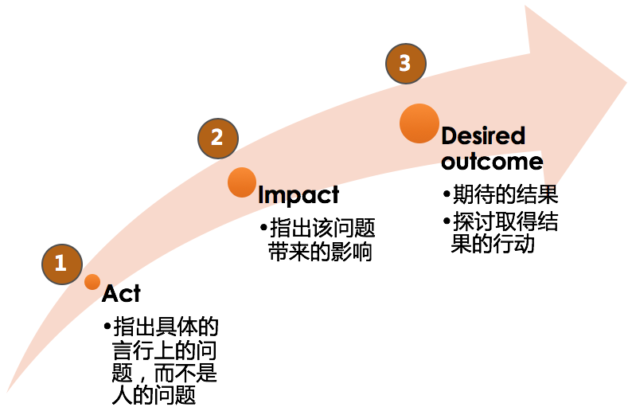
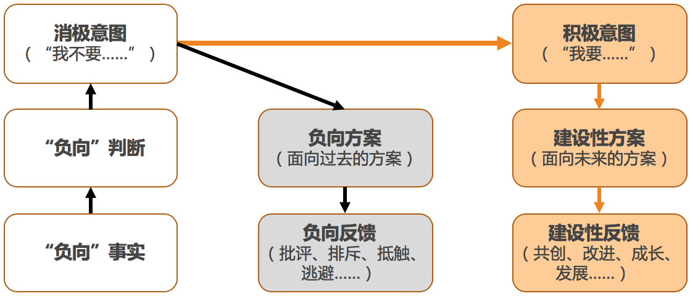
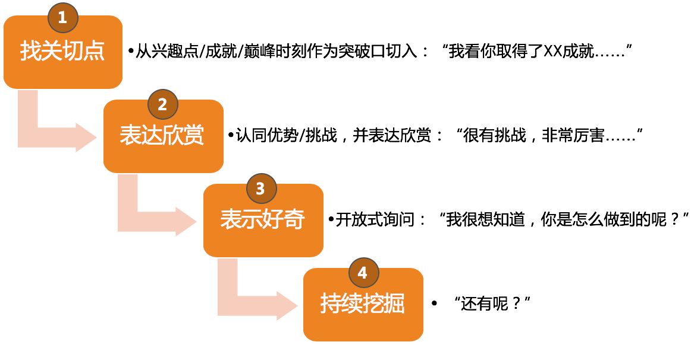
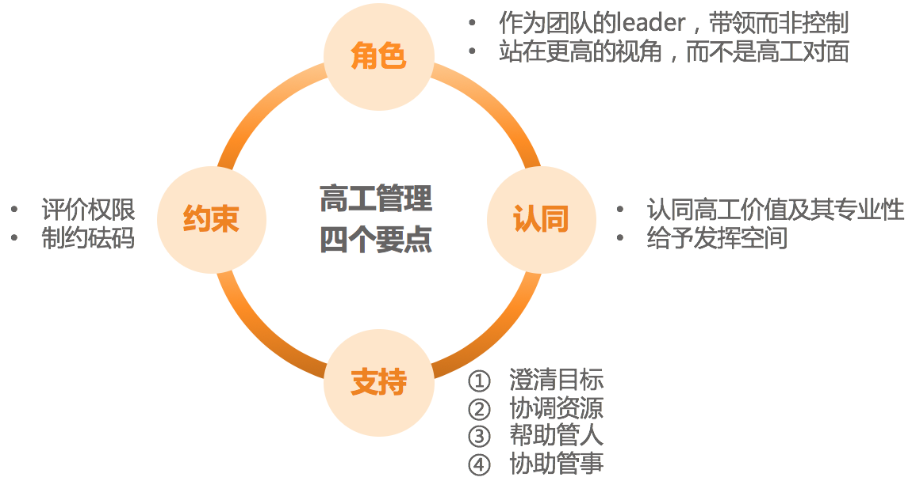
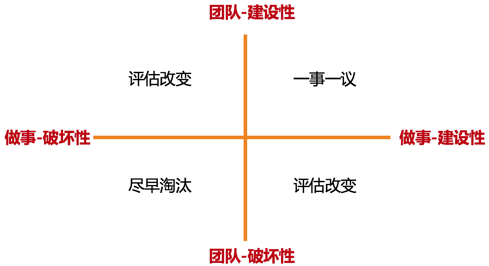
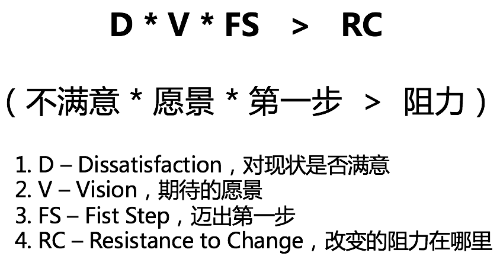

# 33 | 向下沟通的常见实例解析
谈到 **向下沟通**，技术管理者们纷纷表示有话要说，也许此时的你，就正带着一堆向下沟通的问题在读这篇文章。

只要是带团队，在日常的管理工作中，我们就离不开向下沟通这个话题。技术管理者最挑战的管理主题中，向下沟通也名列前茅，仅次于向上沟通、员工激励和团队凝聚力建设。你是否会好奇，显然我们和下级的沟通比和上级更频繁，为什么挑战反而比向上沟通要小呢？如果你还记得上一篇文章中我们探讨过的影响力问题，就很容易理解了：向下沟通，我们除了可以依靠非职权影响力之外，职权影响力也在发挥作用，因此，很多向下沟通的挑战就被职权影响力化解了。

但是由于向下沟通场景的基数太大，各种各样的下级带来的各种各样的问题也就涌现出来了。那么，向下沟通的问题有哪些特点呢？我在归纳了一百多个案例之后发现，如下四类问题特别集中。

**第一类**，也是反馈最多的一类，是 **询问“如何批评员工”**。这类常见的说法有：

- “A的项目总是delay，每次沟通她总是态度积极，表示一定改正，但行动上却还是老样子。我该怎么批评她呢？”
- “B的工作做得很粗糙，不追求精益求精，只是做完而不是做好。我要怎么批评他，才能让他改正缺点，又不打击他的干劲儿呢？”
- “C的周报发的特别水，请假也不提前打招呼，我问她什么原因，虽然她的解释有一定道理，但是我还是想让她改掉这些问题，有什么办法吗？”
- “公司实施弹性工作制，D本来10点就到公司了，但发现其他人都没有来，觉得不公平，以后他就故意来晚。结果造成部门的工作时间整体推迟，但是这又很难批评他一个人，你有什么主意吗？”
- “E不以解决问题为导向，发现问题后不主动跟进解决，总是推托说这不是他的问题。我平时也会跟他说要多担当，但是没有效果。该怎么批评他，让他改正缺点呢？”

**第二类，沟通不顺畅**。常见的说法有：

- “在沟通的时候A特别沉默，什么都不愿意反馈，问一句答半句，每次沟通都是草草了事，我也发愁后续怎么和她沟通。”
- “和B总聊不到一个频道上，我聊目标，他聊困难，我聊进展，他聊原因……毫无默契可言。”
- “我就从来不知道C在想什么，她常常口头上说的是一回事，其实内心想的是另一回事，捉摸不透，无法知道她的真实诉求。”
- “D之前经常会把做出来的成果给我看，我每次都说了‘很棒’啊，可为啥看她的反应还是情绪不高，挺闷闷不乐啊？”

**第三类，和“牛人”下属之间的较量**。常见的说法有：

- “我们团队的A技术架构能力很强，独立工作能力也很好，我很难对他的发展和工作给出建议和帮助，不知道怎么带他。”
- “我和团队里的架构师B，常常在一些技术决策上发生争执，有点合作不下去了。”
- “我团队的C成长很快，感觉他越来越不服我，我是不是得把技术捡起来了？”

**第四类，不知如何应对一些“刺头”员工**。常见的说法有：

- “A总是越级汇报，我非常反感，但是又拿他没办法，他特别会讨好我的上级。”
- “B总是挑活，还很固执，怎么辅导也改不了，真是头疼。”
- “C总是暗示我给他升职加薪，可是我觉得他能力还不够，怎么跟他沟通才能不打击他的积极性呢？”
- “D特别情绪化，动不动就跟人吵架，经常在会上乱怼一通，大家都不愿和他共事，可是他技术能力挺强的，怎么辅导他呢？”

怎么样，上面这四类问题，是不是你也关心呢？

不过，在正式探讨这些问题之前，我需要首先澄清一个理念：通过上面大家反馈的问题你会发现，虽然大家都认为这是一个“向下沟通”的问题，但是如果我们脱开管理逻辑，单纯去探讨如何“沟通”，就会掉入“舍本逐末”的陷阱，导致在和员工沟通的时候很苍白无力、收效甚微。

因此，我们探讨管理沟通问题的时候，需要有“ **管理逻辑**”和“ **沟通方法**”两个层面的视角。所谓“管理逻辑”，就是首先弄清楚这是个什么管理问题，并从管理角度来看完整的解决方案应该是什么样的，然后再来看“沟通”该如何来实施。两者不能割裂开，甚至有的管理者出现了管理逻辑和沟通思路相背离的情况，就更加不应该了。

这听上去会不会比较虚？那我们下面举例来说明一下。

例1：很多管理者会咨询我，“如何和低绩效员工做绩效沟通？”这显然没有意识到更重要的是绩效管理本身，沟通只是绩效管理的一环而已。所以要想解决低绩效员工的绩效沟通问题，首先要从绩效管理入手，然后再来看如何实施沟通。也正是因为这个原因，我并没有把绩效沟通的话题，放在管理沟通这一章来讨论。

例2：很多管理者会问，“员工积极性不高，如何和他沟通呢？”你不难发现，沟通效果好的话，的确可以对员工起到激励的作用，但是这整体上是一个员工激励的问题，沟通是不是最有效的手段呢？这需要我们从管理视角和沟通视角两个层面来思考。

好了，相信你已经明白我的意思了，就是不要把管理沟通问题单纯看成是沟通问题，其实很大的比重是在管理逻辑上，需要我们从“角色认知”和“管理规划”“团队建设”“任务管理”（还记得我们的“三明治”管理框架吗）的管理方法论上去思考整体解决方案。

接下来，我们就一起来分析一下常见的这些“向下沟通”的问题。

对于 **第一类问题，关于“如何批评员工”**。

这类问题最为普遍，为什么呢？因为对于一个我们不认可的行为，第一反应就是认定“对方不应该”，于是，我们就要通过“批评”这样的手段来“纠正他的错误”。所以你会发现，批评背后的真实意图是“促其改变”。而很多管理者并没有认识到这一点，因为他们所采取的手段和真正的意图直接产生了矛盾，不但不能促使对方改变，甚至还封闭了对方改变的道路。比如，一旦违背了如下三个批评的原则，“促其改变”的效果就很难达到：

1. **人是OK的原则**。即，对事不对人。批评事，不要打击人，更不能给人贴标签。
2. **具体性原则**。指出具体哪里做的不好，让对方容易认同。
3. **面向未来的原则**。体现负面的暂时性和过去时，并提供改变的“出口”。

那么，具体应该怎么批评呢？在教练领域有一个 **AID批评法**，大体上也遵循了上述原则，具体分为如下图中的三步：

AID批评三步法（发展性反馈）

以上呢，是和大家探讨如何批评一个员工。但我还想问的是，在一个不符合我们期望的事件发生时，批评对方真的是我们想要的吗？

比如前面案例中的一个问题，“我团队的某个员工越过我和我的上级沟通”，那我就很想知道，你真正介意的是什么呢？如果你只是希望自己和他们两个的信息是一致的，那只要约定一个同步机制就好了，你需要批评下级员工吗？所以你看，当你意图从“你不想让员工跨级汇报”变成了“我想让我们三个人之间的信息保持同步”后，批评员工就不再是最好的选择了。

所以，当你遇到一些不符合期待的问题时，建议先从“我不要……”这种意图中走出来，问问自己“我要什么”。然后再来审视采取什么手段是最合适的，这就叫 **意图转换**。具体可以参照下面的示意图。

意图转换流程（果见）

好了，我们要如何应对需要“批评”的员工呢？归结为一句话就是：先转换下意图看看是否需要批评，如果批评依然是最好的手段，那就要用AID批评法，为员工改变提供出口。

对于 **第二类问题，关于和下级员工沟通不顺畅**。

这就需要用一些工具和技巧来辅助沟通了，我针对这些场景介绍几个工具供参考：

1、对于内向沉默的员工，可以使用下图的“积极引导四步法”，引导员工打开话匣子，主要话题不必局限于工作，跟员工建立起沟通关系和沟通通道，是首要任务。

积极引导四步法（果见）

2、对于总聊不到一个频道上的员工，可以使用我们在第29篇文章中介绍的“沟通层次图”，从事实、感受（判断）和意图三个层面来和对方进行频道对齐。

3、对于捉摸不透的员工，也可以使用“沟通层次图”或“3F倾听”来分辨对方表达的内容，为了避免误会，可以做一些回放和复述，使用类似下面的话术：“你是不是这个意思？”“你看我的理解对不对？”这样就可以大幅度减少沟通偏差了。

4、对于如何给员工的表现进行反馈，我推荐使用“主动积极式反馈”，如果你感兴趣的话，可以去网上搜索一下这个工具，也很容易理解。

其实，沟通的工具很多，大多都是理解起来不难，但掌握起来并不易，如果要想达到“手中无剑、心中有剑”的境界，就更是需要长期的刻意练习。

对于 **第三类问题，关于如何应对“牛人”下属**。

从称谓就可以看出，“牛人”下属肯定属于做事很给力的那类员工，常常是专业能力很强的技术高工和架构师。作为管理者，你如果还在和自己团队的架构师在技术上一较高下，甚至是“你死我活”地争执，那么这就不是一个沟通问题，而是一个典型的管理问题，确切地说，是 **管理角色认知问题**。

你作为管理者，就要很好地认清自己的角色，认识到自己是团队的带路人和负责人，而不是要和架构师站在一个层次上去争高低输赢的。在这方面，我们得向汉高祖刘邦学习一下，他是靠什么把各个方面的“牛人”拢到一起的呢？关于如何和“牛人”技术高工相处，我的心得如下：

高工管理四个要点（果见）

从这四个方面来达成和“牛人”员工的良好协同。

对于 **第四类问题，关于如何应对一些“刺头”员工**。

首先我们得澄清一下，什么叫“刺头”员工呢？我们约定一下：那些需要你付出非常多的时间和精力去管理的员工，叫做“刺头”，也就是管理成本很高的员工。这么一说，相信你团队中某些员工就会浮现在你的眼前了吧？你通常是怎么应对的呢？

既然我们是从管理成本角度来看待这类员工，那我们就需要首先从投入产出比来评估一下，这个员工是否值得你耗费那么多管理成本。毕竟你作为一个团队的leader，是需要对整个团队的发展和业绩负责的，你的角色需要你把精力投入到那些对团队和业绩最为有效的地方，这无关情感和道德。

那么，如何判断值得不值得呢？可以从团队和做事两个方面来看，具体参考下面的“刺头”员工价值评估四象限：

“刺头”员工价值评估四象限（果见）

评价出来之后，需要淘汰的，很明确；如果有需要改变的怎么办呢？关于如何促使一个人做出改变，美国学者理查德·贝克哈德的改变公式，可以给我们一些指导：

理查德·贝克哈德的改变公式

也就是说，你要改变一人，可以从他的“痛点”“痒点”出发，并和他一起制定“迈出第一步”的行动计划，从而去帮他克服掉改变的阻力。

好了，至此，向下沟通中最常见的四类问题，我都做了一个回应，相信你对向下管理这个主题会有一个整体的了解。

考虑到文章篇幅问题，我并没有把每一个工具、步骤及其背后的逻辑都展开论述。如果你对哪一部分特别感兴趣，欢迎给我留言，或者我们也可以再找机会深入探讨。

* * *