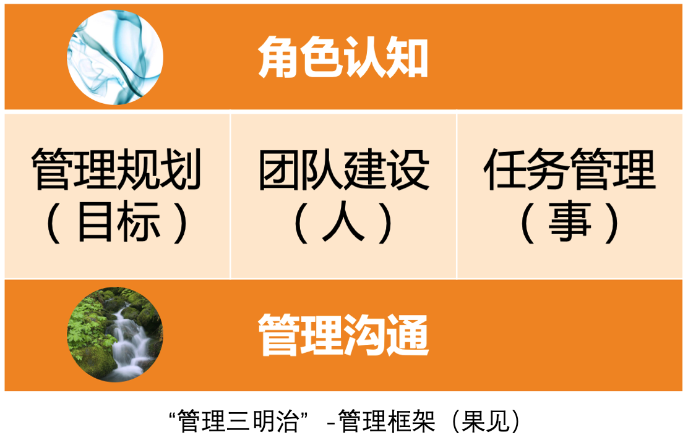
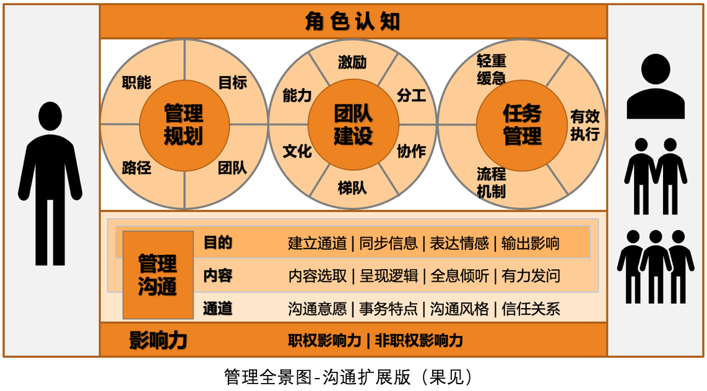

# 35 | 从空降谈管理方法论的积累
随着管理经验的不断积累，你需要不断提炼出自己的管理方法论。随着你掌握了越来越多、越来越行之有效的方法论，你管理能力的可迁移性就越来越好，也就意味着你越来越能胜任不同规模、不同业务特点的团队管理。无论是“自用”还是“带人”，都离不开方法论的积累。因此，不少公司在评估管理晋升的时候，都会把管理方法论作为一个维度来考察。

今天，我们就来探讨一下管理方法论的积累问题。

管理方法论，顾名思义，就是关于“管理”的方法论。可是管理这么大的话题，方法论的积累要从哪里着手呢？

我们不妨先来看一个管理方法论运用最为集中的场景——空降。如果你还记得我们的“马车模型”的话，那空降时你对“车”“马”“路”和“方向”都还不熟悉，当然是你运用自己管理方法论的重要时刻；而且，很多专栏读者也咨询我这个问题，所以我们就这个机会一起来聊一聊。

对于很多新管理者来说，也许还没有经历过空降，而对于很多资深管理者来说，却不可避免地要经历空降。即使没有空降到一个新的公司，也可能会空降到一个新的团队。今天，我们就选择最具挑战的空降场景，即空降到一个全新的团队，同时面临全新的上级、下级、平级合作者和新的业务。此时，如果这个空降的管理者就是你，你会首先做哪几件事呢？

同样的问题，我曾经询问过我课堂上的管理者们，大体的答复如下：

- “和几位核心下属管理者沟通，了解他们的情况、看法和期待。”
- “和上级沟通，了解一下团队的整体情况，以及团队的职责。”
- “和之前负责这个团队的管理者了解团队情况，问问有没有特别需要注意的地方。”
- “和团队每个人都聊一遍，跟大家建立联系。”
- “先评估团队的稳定性，稳定团队是首要的。”
- “先看看手头上有哪些重要的工作是要确保完成的。”
- ……

你会发现，大家的说法不一而同，不同的管理者，关注的重点也是不同的，每个人都从自己的视角和经验给出了自己的建议。我充分相信，大家都做出了自己认为的最好选择，我无意去评判谁的更好，因为管理问题不是看好坏对错，而是看是否合适、是否有效的，而是否有效，只有当事人清楚。只是在我看起来，大家这么快就聚焦到一些“点”上，未免缺少了全局感和框架性。

要是我的话，我会怎么回答呢？

我有过两次较为“成功”的空降做CTO和技术VP的经历。这里的“成功”，并不是带着团队成功上市走上人生巅峰，仅仅是就“空降”本身而言还算成功。因为满足了这样三个标准：

1. 和新同事建立起了良好的信任和协作关系，尤其是和直接上级及重要下级。
2. 交付出明确的、符合公司和上级期待的成果和价值。
3. 只要你愿意，你可以在该公司的该职位上持续做下去，上级和公司是欢迎的。

那么，是哪些做法帮我顺利完成空降过程了呢？我总结起来，最核心的是如下三点：

**第一点，诚意正心**。即，准备好自己的心态。我会问自己的初心：“你到底想要的是什么？你能为上级、下级和公司带来哪些价值呢？”通过问自己这个问题，我会秉持一种帮助公司、帮助CEO和下属的初衷，把我们的利益全部统一起来，以至于从一开始就不担心上级不信任、下级不服气以及同级排挤的问题。因为，每个人都不会拒绝你给他带来支持和帮助的。

遇到冲突时，跳出自己的角色来判断是非对错，通过审视初心来做决策，很容易让自己充满力量，以至于两家CEO和联合创始人都曾评价我“人很正”。当然，这无关管理方法论，更多的是对职场法则的认知和理解，也正是这个最基础的哲学，给予我应对冲突的基本逻辑判断。

**第二点，对齐期待**。我们首先要明白这样一个事实：虽然你进入一家新公司或一个新团队是以某个职位进去的，诸如CTO、技术VP、技术总监、技术经理等，但是你得清楚，这只是你的头衔，并不是你的工作“角色”。常常有跳槽的管理者问我“技术总监都做哪些事儿”之类的问题，这显然是混淆了头衔和角色。因为即使是同一个头衔，在不同公司所需要承担的角色可能是千差万别的，所以，不要指望按照头衔去筹划自己的工作，就可以满足上级和公司的期待。

那么，如何厘清自己的“角色”呢？我的回答是：和你的直接上级去约定（如果你的直接上级对你有充分的管理权限的话）。比如，我每次空降的时候，都会问未来上级一个问题：“长期我们很难约定，仅就我入职后的前三个月或前六个月，你觉得我做好哪三件事，你会对我的工作比较满意？”

如果对方都没有想过这个问题，你不难发现，对方聘请你的意图是不清晰的，只是觉得应该有一个技术管理者而已。如此，未来合作关系崩掉的可能性会比较大。

如果对方明确地告诉了对你的预期，那你们就相当于对入职初期的三个月到半年的工作达成了一个清晰的“工作协议”。还记得我在 [第32篇文章](https://time.geekbang.org/column/article/42770) 中提到的“承诺一致性”吗？这个“工作协议”，就是你们快速建立信任的前提。

如此以来，你和上级对于你的“角色认知”就明确了，这是开展管理工作的前提。

所以你看，你的角色是由上级和公司对你的具体期待决定的，而不是你的头衔。如果你说话的口吻是“技术总监该干啥，不该干啥……”，就掉入了头衔的误区，而忽略了对角色的厘清。

**第三点，兑现承诺**。承诺并兑现，是快速获取上级信任的有效途径。既然前面我们已经和上级约定好了“工作协议”，那么接下来要靠什么来兑现承诺呢？对于技术管理者来说，显然是靠管理价值的体现，所以首先要做这几件事：

**1、和重要相关方建立合作关系，也就是把沟通通道先建起来**。比如直接上级、核心下级、重要合作平级等。如果说我们前面搞定的角色认知问题，是管理的前提；那么现在搞定的沟通问题，则是管理工作的载体。而建立沟通通道，则又是沟通的前提。你也许会说，“这么简单的道理，还需要强调吗？”而事实上，就在这个简单的点上，管理者容易如下出现两个问题：

- **凭感觉**。没有系统盘点关键的沟通通道，凭直觉和感觉建立合作关系。
- **被忽略**。有的管理者反馈：“入职两周了，合作方有事还是找之前的管理者沟通……”这究其原因，就是没有对外建立沟通通道。

**2、盘点团队当前工作的轻重缓急**。这是为了保持工作推进的平滑稳定，不能因为你的到来耽误了重要工作的正常进展。至于长期来看是不是最合理的安排，可以后续通过管理规划来重新审视。

**3、盘点团队人员情况**。还记得“团建六要素”吗？——能力、意愿、分工、协作、梯队和文化，可以从这六个方面去审视团队现状，为管理规划提供信息。

**4、管理规划**。随着你对业务情况、团队人员的逐渐了解，你可以逐步做出自己的管理规划了，即未来三个月或半年，你希望把团队带成什么样子，做出什么业绩。

至于还有没有其他事情需要立即着手呢？就需要根据你的实际情况来看了，但上面所阐述的几个方面是必不可少的。

好了，上面就是我空降经历的一些经验和观点，经过两次亲身验证都效果不错。在我看来，进入一个全新环境中，没有什么比 **对齐期待** 和 **兑现承诺** 更加有效的建立信任的方式了。而这两者之中，对齐期待是更需要引起注意的，因为大部分管理者都能交付出业绩，但却未必是上级最想要的，从而产生分歧和争执。希望我的这些经验会给你的“空降”带来启发。

话说，通过上面对空降问题的阐述，你发现什么规律了吗？抛开“诚意正心”的心态不说，我们把前面要做的几件重要的事情开列如下：

1. 和上级对齐期待。——这一条属于角色认知。
2. 和关键角色建立沟通关系。——这一条属于管理沟通。
3. 确保当下的要事，梳理优先级。——这一条属于任务管理，即“做事”。
4. 盘点和熟悉当前的团队。——这一条属于团队建设，即“带人”。
5. 规划未来的管理愿景。——这一条属于管理规划，即“看方向”。

是不是已经很明显了？没错，这就是我们的“管理三明治”——我们在 [第8篇文章](https://time.geekbang.org/column/article/14534) 中介绍的管理框架。也就是说，对于管理者最为挑战的“空降”场景，也不外乎从这五个部分来思考管理工作该如何着手。至少从这个框架出发，总比凭感觉和经验要系统些，不是吗？

当然，如果你觉得“管理三明治”太粗略了，不够细致的话，那你还记得我们的“管理全景图”吗？你也可以按照其展示的各个要素来思考。细心的话，你会发现我在管理规划、团队建设、任务管理这三个模块的13个要素外围都有留白，我的用意就是希望你在自己的实际管理工作中，也能提炼出你自己的心得体会和方法论，并给它们起个名字放入这些空白的地方，从而形成属于你自己的“管理全景图”。

在后面的文章中，我们又对“管理沟通”进行了探讨，于是，我们进一步把管理沟通扩展开来，就得到了下面这个沟通扩展版的“管理全景图”：

随着扩展的增加，图也变得越来越复杂，所以，最好把“管理三明治”“管理全景图”和“沟通扩展版管理全景图”结合起来使用，这样就可以由粗到细，从浅入深了。

那么，现在我们就可以回答文章开头提到的问题了：到底就管理的哪些问题积累方法论呢？你不妨从我们的“管理全景图”各个要素入手，根据实际工作场景有意识地积累：

1. **角色认知**，关于角色认知和角色澄清的方法论

2. **管理规划**，关于带着团队看方向的方法论
   - **职能**，关于如何澄清团队职能定位——回答团队核心价值的方法论
   - **目标**，关于目标设定和目标管理的方法论
   - **团队**，关于团队规划的方法论
   - **路径**，关于路径选择和成本预算的方法论
3. **团队建设**，关于如何带人的方法论
   - **能力**，关于如何培养员工工作能力的方法论
   - **激励**，关于如何提升员工工作意愿和积极性的方法论
   - **分工**，关于如何做团队分工和组织架构设计的方法论
   - **协作**，关于如何提升团队凝聚力和默契的方法论
   - **梯队**，关于如何进行梯队建设的方法论
   - **文化**，关于如何打造团队文化价值观的方法论
4. **任务管理**，关于如何做事的方法论
   - **轻重缓急**，关于如何排优先级的方法论
   - **有效执行**，关于如何做项目管理或项目执行的方法论
   - **流程机制**，关于如何通过流程机制来提升工作质量和效率的方法论
5. **管理沟通**，关于如何有效沟通的方法论
   - **目的**，关于如何明确沟通初衷和目的的方法论
   - **内容**，关于如何确保信息有效传递的方法论
   - **通道**，关于如何建立和增进沟通关系的方法论
   - **职权影响力**，关于不断理解职能影响力的方法论
   - **非职权影响力**，关于提升和运用职权之外的影响力的方法论

好了，我相信，从这五大方面、18个要素去按图索骥地、系统地积累自己的方法论，假以时日，你会成为一个 **既有深度又有广度，既有框架又有方法，既有理论又有实操，既能“自用”又能“带人”的资深管理者**。

* * *