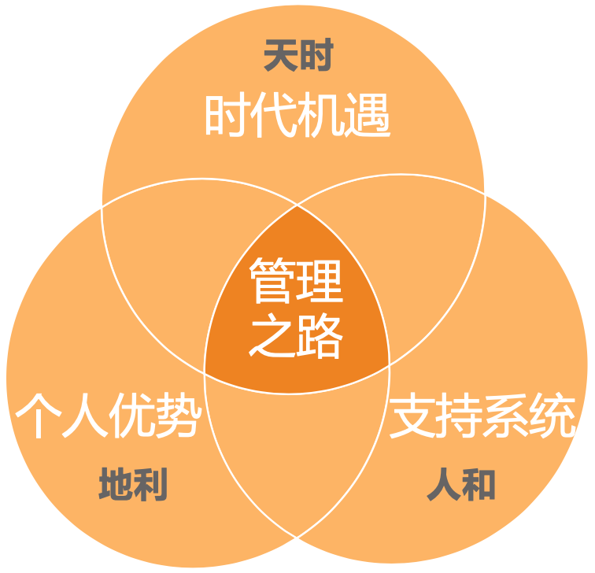

# 36 | 走出自己的管理之路
我曾设想过很多次，在写本专栏最后一篇文章时，我应该抓住这个最后的机会聊点什么，以及你可能会希望听点什么。

关于管理的 **框架、方法、技巧** 和 **工具** 我们前面都进行了探讨，虽然不能覆盖你所有的管理困惑和问题，但至少已经有了一个切入点和应对思路，不至于无从下手。倒是有另外一个问题，是我一直在思索的—— **做管理对于你，对于我，对于我们每一位技术职场人，到底意味着什么呢？**

你是否还记得在 [《开篇词》](https://time.geekbang.org/column/article/13156) 中我提到的一个统计结论呢——大约只有10%～20%的技术管理者是有明确的管理诉求的，而剩下的80%，在开始的时候都没有想过要做管理，至少，没有想好是否要做管理。于是，“到底要不要做管理”这个问题长期困扰着他们，动辄持续好几年，一直要到最终想明白自己要什么，抑或是最终到了没有其他选择时，也便放弃了挣扎和纠结，接受既成的现实。

生活就是这样， **如果你不主动去争取你想要的，你就不得不接受一些你不想要的**。因此，主动规划自己的管理之路，让我们对未来的发展有更多的掌控感，是很有必要的。

我不太清楚你是依据什么去判断自己要不要做管理的，但常见的决策依据有下面几类：

- **个人发展**。认为做管理符合自己的职业发展规划，这类人是少数。
- **看好回报**。认为做管理可以为自己带来更可观的回报。
- **兴趣爱好**。喜欢和人打交道，不喜欢和机器打交道。
- **社会认同**。在家人、朋友等周围人的眼中，做管理尤其是晋升到高管，意味着成功。
- **被迫选择**。觉得做纯技术不是长久之计，而管理就是技术之外的不二选择。
- **被迫接受**。上级要求带团队，自己不能辜负公司的信任和期待。
- ……

我想说的是，无论是主动也好，被动也罢；无论是出于使命、兴趣也好，抑或是欲望、压力也罢，只要是在职场中，就有一个基本法则在发挥作用，那就是“ **价值兑现**”，即，你能收获多少回馈，取决于你能输出多少价值。这里的回馈不仅是指物质回馈，还包括成长感、成就感、幸福感等精神回馈。所以，无论是什么初衷，以及选择了什么样的职业道路，最终都会落在一个问题上：“我能否最大化地输出自己的价值？”

那么，如何才能让自己的价值输出最大化呢？这里我提供两个视角：

1. **当下视角**：为你的客户找到你的价值。
2. **未来视角**：为你的价值找到客户。

所谓 **当下视角**，就是希望在当下或短期内取得价值输出的最大化。而在这个时刻或者短期之内，你服务的“客户”是明确而具体的，所以要考虑的问题就是如何使用和提升自己的能力去匹配“客户”的预期。对于管理者来说，最大的客户就是上级，因此，价值最大化的核心就是去匹配上级和公司的期待。

**这是一种面向客户的视角，即，围绕客户的需要去发挥和提升自己的能力和价值**。这个视角在“求生存”的时候特别好用，其逻辑是通过满足别人的期待，来获得自己生存的资源，因此也叫“ **生存视角**”。你还记得上一篇文章中我们探讨空降时的要点吗？其中最核心的就是要厘清上级的期待并努力去兑现它，这对于在新的环境中“生存”下来是非常有效的，即是这个道理。

所谓 **未来视角**，就是着眼长线，期望在更长的时间区间内价值最大化，从而让自己觉得度过的时间是值得的。如果说“生存视角”下的价值认定是围绕着“客户”的期待，那么“未来视角”的价值认定就是围绕“自我”的认同，所以也叫“ **自我实现视角**”。同理，由于参照对象不同，即使把每个“当下视角”的价值都最大化，长期来看“自我实现视角”的价值也未必达到最大化。

那么，如何才能让自己更长期的“自我实现视角”的价值最大化呢？前提是需要有一个长期的规划，关于要走一条什么样的管理之路的愿景。要规划这个愿景，就需要综合考虑外部环境和内在因素，用我们中国人的话说叫“天时地利人和”。

管理之路的“天时地利人和”

**首先，我们来看看“天时”**。要想让自己发挥出价值，就得审时度势，看看我们所处的时代，有哪些大的趋势，以及顺应趋势有哪些机遇。作为管理者，这里我分享两个管理方面正在发生的变化，这两个方面未必是最重要的，但却是技术管理者们碰到最多的。

**第一个方面，管理工作的底层逻辑正在从管控到激发**。在 [第18篇文章](https://time.geekbang.org/column/article/40313) 我们探讨员工激励的时候提到，驱动力2.0的核心逻辑是用奖惩让员工“服从”，而驱动力3.0的核心逻辑是激发员工的“自主投入”。这种思维方式的转换不仅仅适用于员工激励，也适用于整个管理逻辑。这既是时代的需要，也是人的需要。

说是 **时代的需要**，是因为我们正在从工业时代迈向信息和知识经济时代，人的价值体现，也从严格按照规程完成流水线的作业，到越来越依靠人的主动性和创造力，这在我们泛互联网领域尤其明显。

说是 **人的需要**，是指在当今的中国社会，随着经济的发展和温饱问题的基本解决，越来越多的人从生存安全的需求，转移到价值认同和自我实现上，这对于90后、95后的职场人尤其如此。

因此，作为管理者，我们需要调整管理的视角和心态，跟上时代的步伐。

**第二个方面，职位头衔已经不再体现职责要求，我们需要从固化的职位要求中跳脱出来，从实际的工作需求去定义自己的职责和角色**。虽然我们平时都习惯说要走什么技术路线、管理路线，架构师路线、经理人路线等，这都是为了降低沟通理解的门槛，却并不是职业发展的真谛和底层逻辑。底层起决定作用的还是“价值兑换”，所以，我们需要着眼于价值输出的最大化，而不是死板的职位要求。

常常有技术管理者问：

- “技术总监的职责是什么？该做什么？不该做什么呢？”
- “CTO的职责是什么呢？它和技术VP有什么区别，如何分工呢？”

问这些问题的人，可能进入了这样一个误区：面向职位做工作，而不是面向客户。因为，只有职位对应的职责固定和明确时，这样的问题才是有意义的，而在我们互联网领域这显然不现实，因为不同的上级对于你这个职位的期待是千差万别的。另外，既然你的上级就在你身边，你不和他去确认，别人又有谁可以告诉你呢？

同样，在我们的管理工作中，你也需要帮你的下属去明确他们的工作职责和角色，使得他们的表现匹配你的预期。

时代的因素还有很多，总体上，我认为我们处于一个可以发挥自己价值的时代，而且幸运的是，互联网又是一个思想和技术都处于前沿的领域，不容辜负。

**接下来，我们聊聊“地利”**。即，技术管理者在职业发展中的优势有哪些。在我长期的观察和调研中，我发现技术管理者有如下三个 **通用优势**。

1. **技术优势**。这很容易理解，既然是技术管理者，“技术”两个字就蕴含着其独特性。尤其是在技术管理之路早期，有一个鲜明的技术标签就是优势，比如你是电商类背景、社区类背景、App开发类背景、大数据类背景、人工智能背景等，这些鲜明的标签很容易让别人了解你最擅长的工作。

2. **逻辑优势**。技术管理者由于其长期的技术思维方式，已经锻炼出了非常优秀的逻辑性。于是，这个在技术人眼中理所应当的特质，在管理者这个群体中就形成了独特的优势。甚至某著名投资人招聘投资顾问都只要技术背景的，因为他认为这样的人逻辑能力强。

3. **执行力优势**。在对超过500名技术管理者的调研中发现，项目落地能力或项目执行力是技术管理者们最拿手的管理主题，而且他们的上级也认同这一点。这其实和技术人的确定性思维也是分不开的，这是技术管理者的又一明显优势。

当然，前面这三个是技术管理者普遍具有的优势。那作为个人，你自己有哪些 **独特性优势** 呢？你可以问问自己如下这几个问题：

1. 周围的亲人朋友、上下级同事都喜欢用什么词来评价和称赞你？
2. 是什么让你与众不同？在什么重要的问题上，你与其他人有不同的看法？
3. 是什么让你取得现在的成绩？你在管理工作中突出的能力是什么？
4. 你更关注事，还是关注人？如果是关注事，你更喜欢“想事”还是“做事”？如果是关注人，你更喜欢“支持人”还是“带领人”？

通过认真思考以上问题，可以让你对自己的优势有个大体的了解。而如果你想更深入了解自己，可以参考盖洛普（Gallup）的优势识别器2.0。

**最后，我们聊聊“人和”**。在职场发展中，最重要的“人和”因素是下面三个。

1. **上级。上级的信任值得珍惜**。对于做管理来说，最大的“人和”就是得到上级的信任和支持。原因很简单：我们的目标是和上级一起定的，资源是向上级申请的，工作结果是上级来评价的，你会发现我们管理中的“看方向”“带人”和“做事”都是离不开上级的。所以，如果有一个相互信任的上级，请务必珍惜，努力成长让自己配得上一直追随他；如果还没有相互信任的上级，请务必重视去经营信任关系（关于怎么经营信任关系，我们在 [第32篇文章](https://time.geekbang.org/column/article/42770) 中有介绍）。在管理之路上，“跟对人”无疑是一条“捷径”。

2. **伙伴。同事伙伴的陪伴力量很重要**。和一群优秀的人一起成长，无疑是非常有意义的事情。你们可以互相切磋一起成长，并且随着时间的推移，你们都会成为“独霸一方”的人才，你会发现你们的相互影响是指数级的。所以，请珍惜身边的同事。

3. **个人。个人的愿力是一切的源头**。关于人的因素，除了外部的人，自己的愿力也是非常重要的。如果说我们需要为自己一切的努力找到动力源泉的话，规划自己的愿景并明确自己的使命，无疑是非常有效的做法。这也是本文的意义所在。

好了，如果你从“天时”“地利”“人和”出发，分别去盘点自己的时代机遇、自己的独特性优势，以及自己的愿景和伙伴关系的话，是不是就可以回答自己这样一个问题：“在未来1年、3年或5年、10年以后，我会成为一个什么样的管理者？”

怎么样？能够回答自己了吗？

我猜想，大概率你还是不能。因为愿景规划不是一个立刻可以明确的事情，所以，不要指望看了一篇文章就清晰起来。不过，若是这篇文章能够给你提了个醒，让你开始思考这个问题，也算是非常有价值了，不是吗？

即便如此，在最后的最后，我还是有两句话要交代：

1. **请耐心地给自己成长的时间**。这个时代的快节奏带给我们很多的焦虑和不安，仿佛一不小心就会错过什么。其实，职业生涯就像一场“马拉松”，很漫长，5年或10年可以发生很多事，而你的生涯可能是20年、30年，甚至可以像我一样，贯穿整个余生。在这么漫长的岁月中，肯定有人“先胖”，有人“后胖”，不用着急。成功其实很容易，因为所有的失败都不叫“失败”，都只是“尚未成功”而已；只要有一次“成功”可以让你足慰平生，你就是个“成功者”。互联网拉平了世界，你随时都有时间和机会去赢得自己的成功，或早或晚。

2. **用自己最擅长的姿势，开创属于自己的发展之路**。不是前人走过的路才叫路，也没有什么规定好的“管理之路”是你必须要走的。因此，也就不存在所谓的“弯路”，所有你走过的路都是你的成长之路，这条路是你自己开创的。事实上，所有的路上都有一条法则是奏效的，那就是“价值兑换”，所以，做技术不重要，做管理也不重要，把技术和管理当成你职业的两条腿，在职场中输出自己最大的价值，才是最好的，才真正属于你。切记，不要被别人的路限制住，也不要被某个职位限制住，没有哪个职位可以定义你的职业发展。

好了，本专栏到此就结束了，纸短情长，后会有期。

希望这36篇文章可以带给你一个看待工作的视角、一幅管理的图纸、一颗个人发展的种子，陪你走过管理转型之路。期待你带着这个视角、这幅图纸和这颗种子，在具体的管理工作中不断“事上练”，收获属于自己的精彩。

* * *