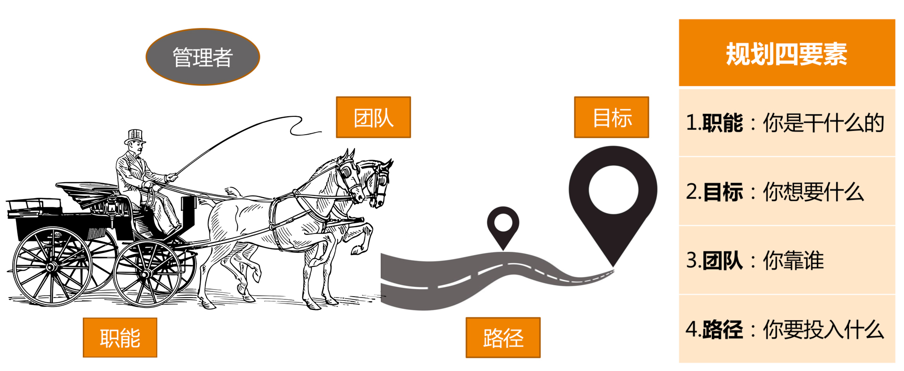
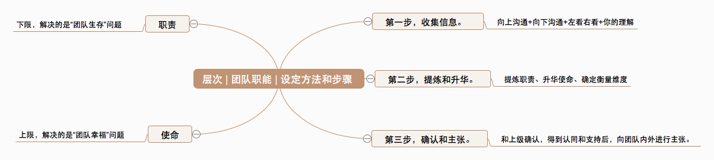
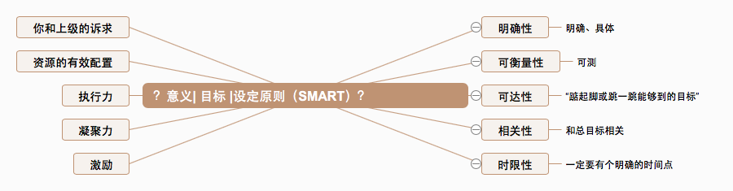
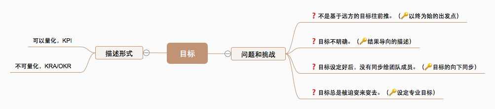
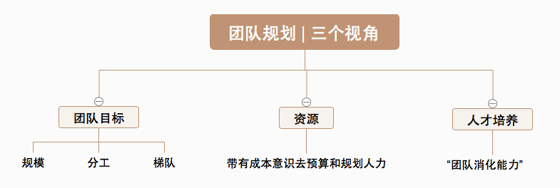
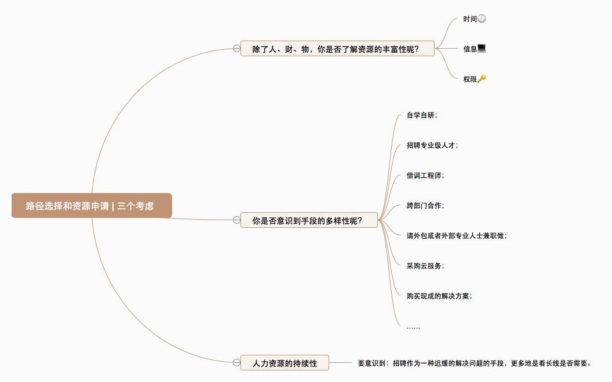

# 复习课（二） | 管理规划
* * *

继上一篇的“ **角色认知**”之后，接下来我们继续来复习“管理方法论”的另外一个方面： **管理规划**。

## （二）管理规划

管理规划，具体该怎么操作呢？

这里可以类比这样一个问题：一辆马车交给你，在驾驶它上路之前，你先做哪件事呢？

那，“驾驶马车”和管理规划就要明确回答了下面这四个问题：

1. 这是辆什么车？ **VS** 你团队是干什么的？
2. 你要把这辆车拉到哪里去？ **VS** 你团队想做出什么成果？
3. 你有哪些马，它们情况如何？ **VS** 你依靠什么样的团队？
4. 你选择走哪条路？ **VS** 你需要投入哪些资源？

“马车模型之规划四要素”

这就是相互关联且动态平衡的 **管理规划四要素：职能、目标、团队和路径**。其中，最稳定的要素是职能，它是管理的起点。

“规划四要素”关系图

（来自 [第11篇《我刚开始带团队，从哪里着手呢？》](https://time.geekbang.org/column/article/18029)）

**1\. 明确职能**

总结自 [第12篇《如何界定我团队是干什么的呢？》](https://time.geekbang.org/column/article/18040)

**2\. 设定目标**

总结自 [第13篇《如何为团队设定合理的目标呢？》](https://time.geekbang.org/column/article/20712)

**3\. 盘点团队**

总结自 [第14篇《如何来规划团队的组织结构呢？》](https://time.geekbang.org/column/article/39779)

**4\. 选择路径**

总结自 [第15篇《我都要申请哪些资源呢？》](https://time.geekbang.org/column/article/39973)

至此，我们就复习完了管理规划的全部四个要素：职能、目标、团队和路径。详细内容也可戳文中所附的链接。

* * *