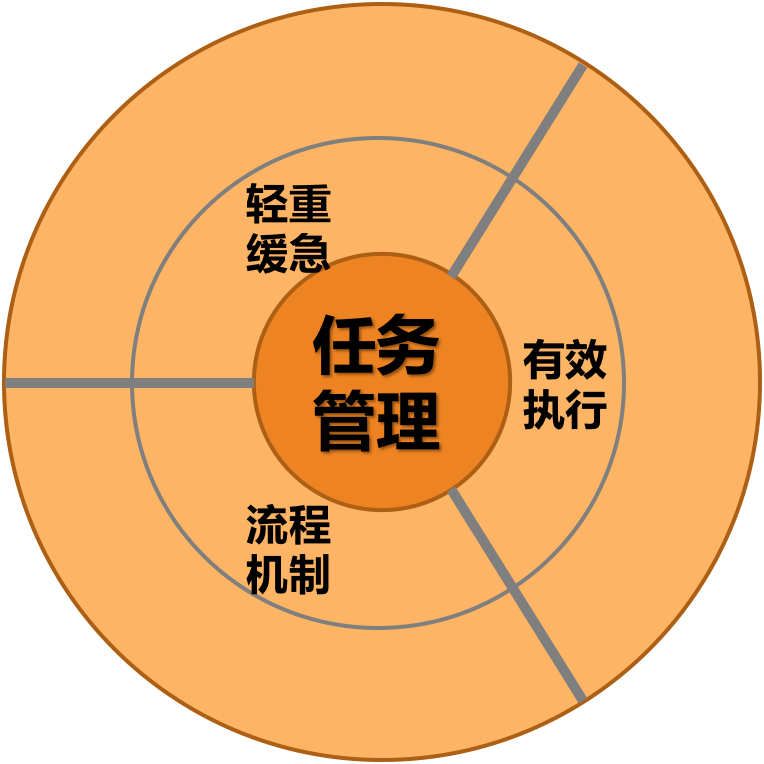
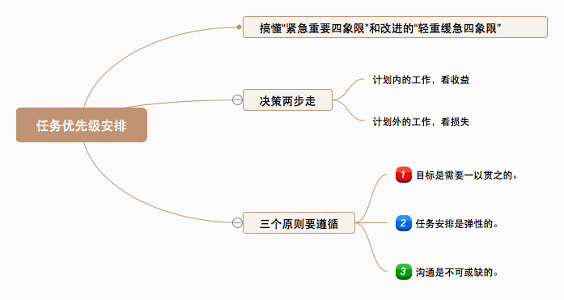
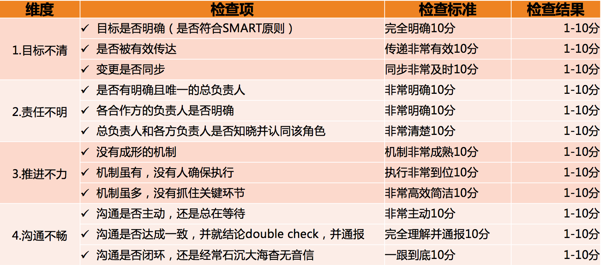
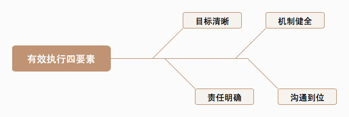

# 复习课（四） | 任务管理
* * *

继上一篇的“ **团队建设**”之后，接下来我们继续来复习“管理方法论”的另外一个方面： **任务管理**。

### （四）任务管理

任务管理——“做事”这个话题很大，要如何探讨呢？既然做事是一个过程，那么就可以将其分成“ **事前**”“ **事中**”和“ **事后**”三段来探讨。

**事前**，需要提前想清楚：要做哪些事？先做哪件，后做哪件？也就是 **分清楚轻重缓急**，也叫优先级梳理。

**事中**，要确保事情是按照计划推进的，即 **有效地推进执行**。

**事后**，要复盘做事的整个过程，并从中抽取一些 **流程机制**，以便以后在类似的场景下也可以做得更好、更顺畅。

这样就抽出了任务管理三要素：事前的 **轻重缓急**、事中的 **有效执行** 和事后的 **流程机制**。

“做事”：任务管理三要素

**1\. 轻重缓急**

总结自 [第25篇《多任务并行该如何应对？》](https://time.geekbang.org/column/article/41448)

**2\. 有效执行**

项目有效执行过程中常见的四大类问题，作者将其总结出一份 **检查清单**，我印象极其深刻，因为有了它，我就可以全面剖析“做事ing”这个过程，进行“自查”，找“病因”，开“药方”了。

任务执行检查清单

这也就引出了：

总结自 [第26篇《如何确保项目的有效执行？》](https://time.geekbang.org/column/article/41653)

**3\. 流程机制**

总结自 [第27篇《如何让流程机制得到有效的执行？》](https://time.geekbang.org/column/article/41830)

至此我们就复习完了任务管理三要素：事前的 **轻重缓急**、事中的 **有效执行** 和事后的 **流程机制**。详细内容也可戳文中所附的链接。

* * *