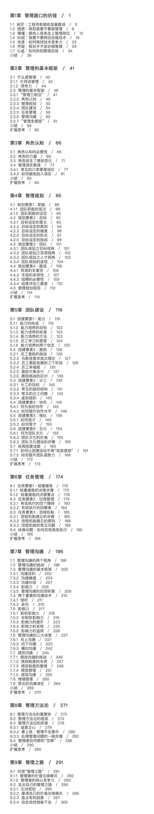

# 新书首发 | 《知行：技术人的管理之路》
各位读者朋友们，大家好，我是刘建国。距离《技术管理实战36讲》这个专栏的完成，不知不觉时间已过去了半年。这半年来我虽然没有写专栏文章，却一直在关注并回复大家的留言，从大家的评论中，我收获了很多启发，更收获到很大的力量。也正是在大家的支持和期待之下，我完成了《知行：技术人的管理之路》这本书。

现在，我把它正式介绍给大家。

首先需要跟大家说明的是，虽然本专栏促成了《知行》的诞生，但《知行》绝不是专栏文章的简单拼凑和整理，这一点从《知行》的字数是专栏的2倍多就可以看出。专栏和图书更像同根同源的兄弟，它们都源于我10年的管理感悟，以及数十场管理工作坊的实践，我用不同的方式和视角把它们呈现出来。

那么， **它们的区别是什么呢**?

从 **初衷** 来看。专栏主要是围绕技术管理者最常见的实际问题，属于问题驱动——我在回答一个个的问题；《知行》则围绕着一个完整的管理体系，属于系统地呈现，全书都在努力讲清楚一个大问题：管理都做哪些事儿，以及做每件事的要点是什么。

从 **形式** 来看。初衷的不同导致内容结构和叙述方式的不同。专栏是一篇篇较为独立的文章，每一篇文章都有一个较为独立的主题；而《知行》是总分结构的，围绕着“管理全景图”层层展开。另外，由于图书没有篇幅限制和时间限制，所以对于目标、团建、绩效等多个管理问题的探讨更深入，案例和工具也更丰富。

从 **读法** 来看。专栏的每篇文章都有一个独立而完整的主题，加上有音频格式，特别适用于碎片化学习；而《知行》则是围绕一个完整的体系，更适合于系统化学习。当然，读完一遍之后，图书就可以作为“管理手册”来使用了——既可以遇到问题备查，也可以选取“管理全景图”中感兴趣的部分进行专题化学习。

总之， **用碎片化的时间通过专栏快速了解管理的理念和方法，再通过图书来系统梳理自己的管理方法论，并深入理解背后的管理逻辑，是专栏和图书的一种良好的打开方式**。

此外，《知行》这本书和一般的管理类书籍相比，有三个明显的特点：

**第一， 全局感**。对于任何一个管理话题，我们都可以放在一个完整的管理框架中去认知它和把握它，从而有一种按图索骥的全局掌控感。

**第二， 系统化**。本书强调各个管理要素之间的关联性和系统性，不会孤立地去探讨管理问题。比如，探讨执行力的时候不会脱离目标和团队；探讨凝聚力的时候不会脱离目标和做事。每位管理者都需要从各个管理要素去审视自己面临的管理问题，从而系统地去看待和应对，避免“头痛医头，脚痛医脚”。

**第三， 逻辑性**。为了避免对于常见管理现象“知其然，而不知其所以然”，本书试图去解释一些司空见惯的管理现象的深层逻辑，以帮助管理者建立深入的认知，从而更容易作出清晰准确的判断。

当然，对于做好管理工作，成为一名优秀的技术管理者，都有“知不知”“愿不愿”和“能不能”这三个层次的努力。显然，图书和专栏，能够带给大家的帮助更多集中在“知不知”这个层次上，以及由于认知扩展带来的意愿和能力的部分提升，而要真真切切地提升管理能力，进一步做好管理工作，更多地要在管理实践中下功夫，因为对能力的掌握最终要体现在实实在在的管理工作中。这就好比把地图记得再熟练也不能代替旅游一样，地图只是让我们知道自己在做什么、下一步去哪里，以及大体该如何去。

正因为管理者的成功不仅在于知，更在于行，尤其是行的成果，所以，我才把这本书取名为《知行》。它是我10年管理经历的一个注脚，希望能够成为大家作为技术人做管理的第一本书。

## 新书首发福利

福利一：新书首发价¥ 58，原价¥ 68

福利二：首发签名版仅剩100册，先购先得

## 如何购买？

[购买地址>>>](time://mall?url=https%3A%2F%2Fh5.youzan.com%2Fv2%2Fgoods%2F3epaacv7si6co)

也可点击下图购买

## 图书目录

