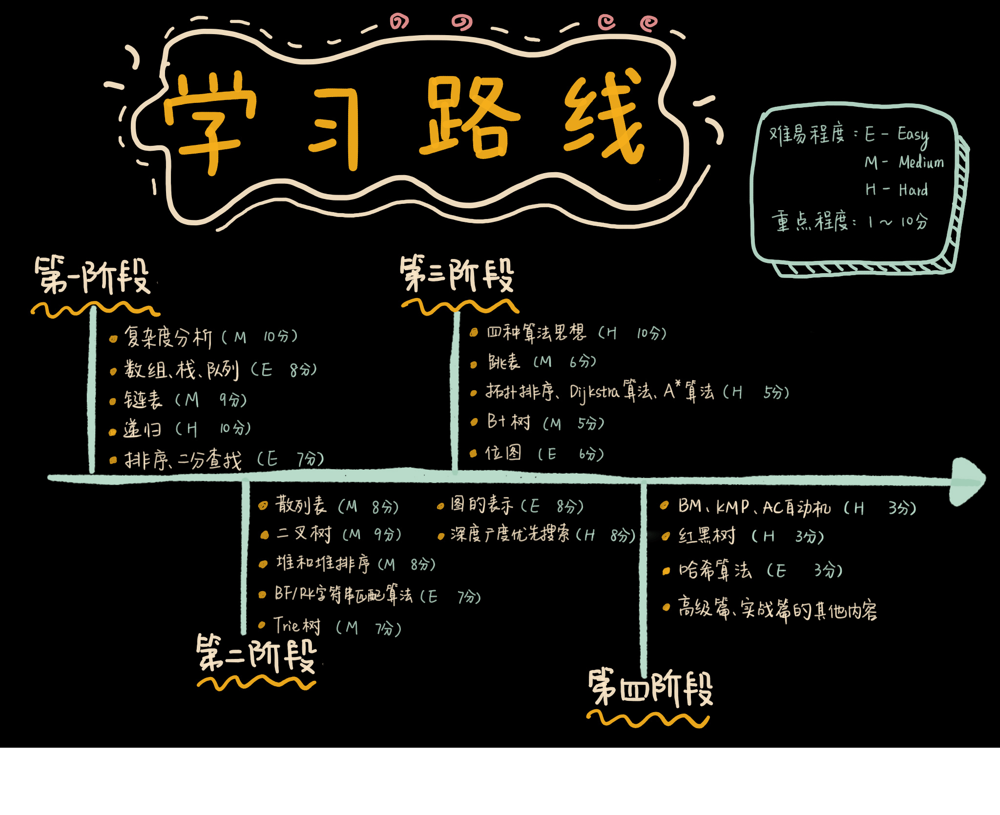
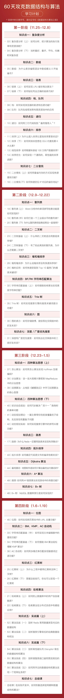

# 打卡召集令 | 60 天攻克数据结构与算法
你好，我是王争。

今年4月，专栏更新结束之后，我在专栏发布了一篇 [《数据结构与算法之美》学习指导手册》](https://time.geekbang.org/column/article/91541)，在这篇文章里，我对专栏内容重新做了一次梳理，将整个专栏拆分成四个阶段，列出了每个阶段的核心知识点、标注了每个知识点的难易程度（E-Easy，M-Medium，H-Hard），并用 1-10 分说明其重要性。

但是，我发现，很多同学还是没能坚持下来，久而久之对学习算法失去了信心。

回想起来，写专栏之初，我就立下 Flag，要做一个跟国内外经典书籍不一样、可以长期影响一些人的专栏。所以，在专栏完结 9 个月后，我想再做一些事情。

为了带你彻底拿下“数据结构与算法”这座大山，我发起了 **“60 天攻克数据结构与算法”打卡行动**，一起登顶！

下面是我为你精心规划的学习计划表：

**活动时间**：2019.11.25-2020.1.19

**你将获得**：

1.坚持 60 天，与 2000 位优秀的工程师一起，彼此激励，相互学习；

2.整个学习周期内，我会进行2次高质量的社群分享；

3.我会精心整理 4 张知识脑图，为你梳理每个阶段的学习重点，发布在专栏里；

4.我和极客时间准备了 20 万奖学金，给坚持下来的同学。

**活动规则**：

在下方申请进入活动打卡群，根据课表打卡，完成学习。

**打卡要求**：

1.每个阶段持续 2 周，每周仅需打卡 3 次，即视为完成该阶段的学习。

2.4个阶段（8 周）的学习，打卡总数仅需 30 次，即视为完成“60 天攻克数据结构与算法行动”。

3.为了让大家养成习惯，每日只计 1 次打卡，单日内多次打卡视为 1 次。

**进入打卡群后，完成学习还有如下奖励**：

- 第一阶段（第1-2周）：¥15 奖励金
- 第二阶段（第3-4周）：¥25 奖励金
- 第三阶段（第5-6周）：¥35 奖励金
- 四个阶段（第7-8周）：¥50 奖励金

（注：奖励金会以无门槛优惠券形式、分阶段进行发放，发放时间为每阶段结束后的 7 个工作日内。）

当然，优惠券只是对你的小小奖励。坚持 60 天，与 2000 位优秀的工程师一起，互相学习，彼此激励，彻底拿下数据结构与算法，我奉陪到底。

