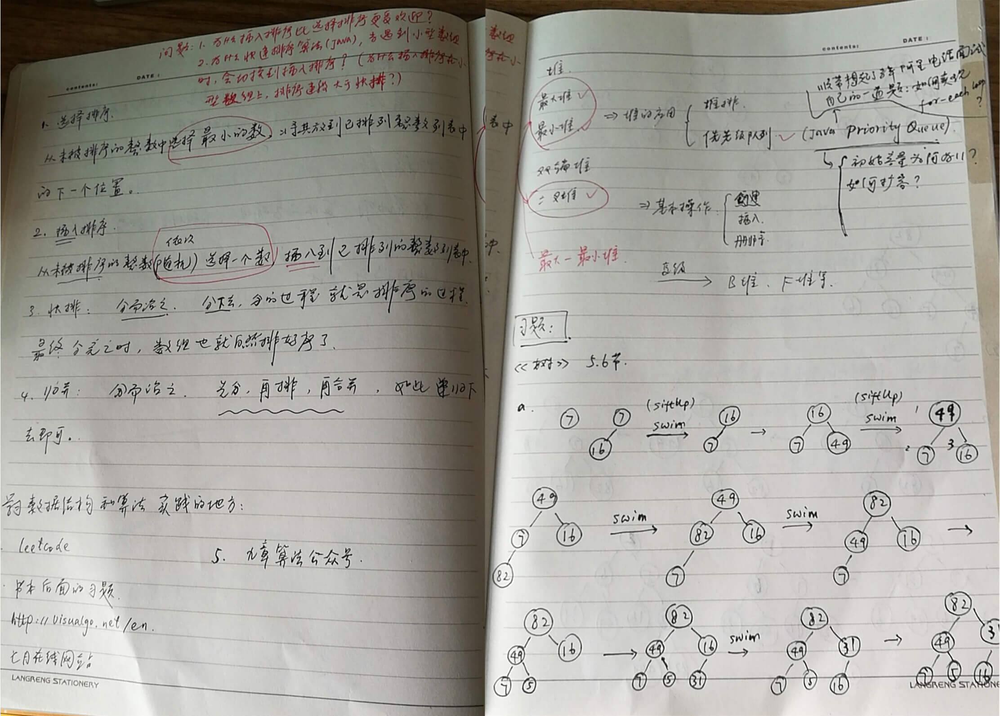
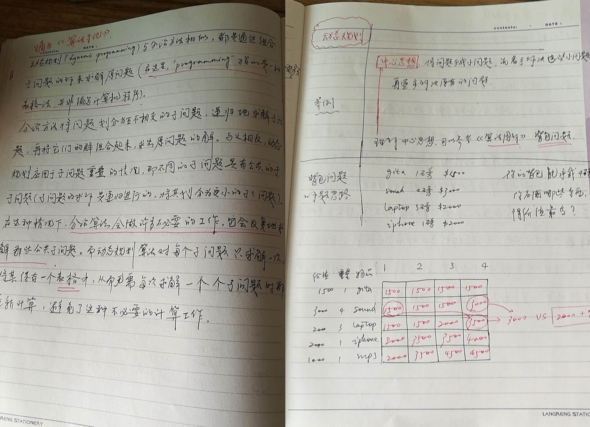

# 用户故事 | Jerry银银：这一年我的脑海里只有算法
> 比尔·盖茨曾说过：“如果你自以为是一个很好的程序员，请去读读Donald E. Knuth的《计算机程序设计艺术》吧……要是你真把它读下来了，就毫无疑问可以给我递简历了。”虽然比尔·盖茨推荐的是《计算机程序设计艺术》这本书，但是本质却折射出了算法的重要性。

大家好，我是Jerry银银，购买过算法专栏的同学应该时不时会看到我的留言！目前我是一名Android应用开发工程师，主要从事移动互联网教育软件的研发，坐标上海。

## 我为何要学算法？

细细想来，从毕业到现在，7年多的时间，我的脑海里一直没有停止过思考这样一个问题： **技术人究竟能够走多远，技术人的路究竟该如何走下去**？相信很多技术人应该有同样的感受，因为技术的更新迭代实在是太快了，但是我心里明白： **我得为长远做打算，否则，就算换公司、换工作，可能本质也不会有什么改变**。

但是，我其实不太清楚自己到底应该往什么地方努力。于是，我翻阅了好多书籍，搜寻IT领域各种牛人的观点。多方比较之后，我终于决定，从基础开始，从计算机领域最基础、最重要的一门课开始。毫无疑问，这门课就是数据结构和算法。

## 我是如何遇见极客时间的？

既然找到了方向，那就开始吧。可是问题来了，从哪儿开始呢？大方向虽然有了，可是具体的实现细节还是得慢慢摸索。大学没怎么学，工作这么多年也没有刻意练习，起初我还真不知道从哪儿开始，只是买了本书，慢慢地啃，也找了一些简单的题目开始做。有过自学经历的同学，应该有同感吧？刚开始连单链表翻转这样简单的题都要折腾半天，真心觉得“痛苦”。

之前我在极客时间上订阅过“Java核心技术36讲”，体会到了专栏和书本的不同。极客时间的专栏作者都是有着丰富的一线开发经验，能很好地把知识和实战结合在一起的大牛。这些课听起来非常爽。估计你应该经常跟我一样感叹：“哦！原来这些知识还可以这么使用！”当时我就在想，极客时间啥时候有一门算法课就好了。

说来真是巧，没多久，极客时间就推出了“数据结构与算法之美”。我试读了《为什么要学习数据结构和算法》和《数组：为什么很多编程语言中数组都从0开始编号？》这两篇之后，立即购买了。

到现在，专栏学完了，但是我依然记得，王争老师在《为什么要学习数据结构和算法》这篇文章里面提到的三句话，因为这每一句话都刺痛了我的小心脏！

> 第一句：业务开发工程师，你真的愿意做一辈子CRUD Boy吗？
>
> 第二句：基础架构研发工程师，写出达到开源水平的框架才是你的目标！
>
> 第三句：对编程还有追求？不想被行业淘汰？那就不要只会写凑合能用的代码！

## 我每天是怎么学专栏的？

于是，每天早上醒来，我的第一件事就是听专栏！专栏在每周的一、三、五更新，每周的这三天早上，我会听更新的文章。其它时间，我就听老的文章，当作复习。

听的过程，我一般会分这么几种情况。

**第一种情况，更新的内容是我之前就已经学过的，基本已经掌握了的**。这种情况下，听起来相对轻松点，基本上听一遍就够了。起床之后，再做一下老师给的思考题。这种情况在专栏的基础部分出现得比较多，像数组、链表、栈、队列、哈希表这些章节，我基本上都是这么过来的。

**第二种情况，更新的内容是我学过的，但是还不太精通的**。这种情况下，王争老师讲的内容都会将我的认知往前“推进”一步。顺利的话，我会在上班之前就搞懂今天更新的内容。这种情况是曾经没有接触过的内容，但是整体来说不难的理解的，比如跳表、递归等。

**还有一种情况，就是听一遍不够，听完再看一遍也不行，上午上班之前也搞不定的**。不过，我也不会急躁。我心里知道，我可能需要换换脑子，说不定，在上午工作期间，灵感会突然冒出来。这种情况一般出现在红黑树、字符串查找算法、动态规划这些章节。

到了中午休息时间，我会一个人在公司楼下转一圈，同样，还是听专栏、看专栏。

如果今天的文章，早上已经搞定了，我会重新看下其他同学的留言，看看其他同学是如何思考文章的课后思考题的，还有就是，我会看看其他同学学习过程中，会有哪些疑问，这些疑问自己曾经是否遇到过，现在是否已经完全解决了。

如果今天的文章，早上没有彻底搞懂，这种情况下，我会极力利用中午的时间去思考。

晚上的时间通常无法确定，我有时候会加班到很晚，回到家，再去啃算法，效率也不高。所以，我一般会在晚上“看”算法。为什么我会用双引号呢？是因为我真得只是“看”，目的就是加深印象。

以上基本是我工作日学专栏的“套路”。

等到了周末或者其它节假日，就是“打攻坚战”的时候了。估计很多上班族和我一样，只有周末才有大量集中思考的时间。这时候，我一般会通过做题来反向推动自己的算法学习。

像红黑树、Trie树、递归、动态规划这些内容，我都是在周末和节假日搞懂的。虽然到现在对其中一些知识还不能达到游刃有余的地步，但是对一般的问题，大体上我都知道该如何抽象、如何拆解了。

我在学习算法时记的笔记

## 通过学习专栏，我有什么不一样的收获？

**首先，专栏学习拓宽了我的知识面。** 例如，很多书本不讲的跳表，王争老师用了一篇文章来讲解。犹记得当我看完跳表时，心想，这么简单、易懂、高效的数据结构，为什么很多书籍都没有呢？这个专栏真的买值了！

**其次，专栏的理论和实践结合很强。** 书籍是通用性很强的教材，一般很少会涉及软件系统是如何使用具体的数据结构和算法的。在专栏中，老师把对应的知识和实践相互结合，听起来特别过瘾！比如堆这种数据结构，理解起来不难，但是要用好它，还得下点功夫，经过老师一讲解，搭配音频，我的理解也变得更加深入了。

**最后，专栏留言这个功能真的太好了，为自学带来了诸多便利，也让我获得了很多正向反馈。** 很多时候，经过相当长的一段时间思考，还是不能打通任督二脉，其实后来回想，当时就差那一层窗户纸了。于是，我在文末留下了自己的疑问，结果王争老师轻描淡写一句话我就明白了。

留言功能还有个非常大的好处。如果你用心学习，用心思考，用心留言，你的留言很大概率会被同伴点赞，很多时候还能被置顶。这本身就是一种正向反馈，也会更加促进自己的学习动力。还有一种更爽的体验，突然有一天早上，我照例醒来听专栏，突然听到了自己的名字。这个专栏4万多人订阅，老师居然记得我！可见王争老师真的认真看了每一条留言。

最后，我总结下自己学这个专栏的收获。尽管很多，但是我想用三句话来概括。

第一，写代码的时候，我会很自然地从时间和空间角度去衡量代码的优劣，时间、空间意识被加强了很多。

第二，学习算法的过程，有很多的“痛苦”，也正是因为这些“痛苦”，我学到了很多知识以外的东西。

第三，过程可能比知识更重要。要从过程中体会成长和精进的乐趣，而知识是附加产品！

专栏虽然结束，但是学习并没有结束。同学们，我们开头见！