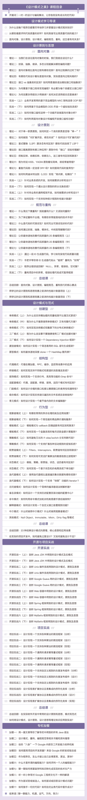

# 第2季回归 | 这一次，我们一起拿下设计模式！
你好，我是王争。“数据结构与算法之美”在今年2月底全部更新完毕。时隔8个月，我又为你带来了一个新的专栏“设计模式之美”。如果说“数据结构与算法之美”是教你如何写出高效的代码，那“设计模式之美”就是教你如何写出高质量的代码。

在设计“设计模式之美”专栏的时候，我仍然延续“数据结构与算法之美”的讲述方式。在专栏的整体设计上，我希望尽量还原一对一、手把手code review的场景，通过100篇正文和10篇不定期加餐，200多个真实的项目实战代码案例剖析，100多个有深度的课堂讨论、头脑风暴，来为你交付这个“设计模式之美”专栏。

我希望通过这个专栏，一次性把跟编写高质量代码相关的所有知识，都系统、全面地讲清楚，一次性给你讲透彻。让你看完这个专栏，就能搞清楚所有跟写高质量代码相关的知识点。

专栏共100期正文和10期不定期加餐，分为5个模块。下面是专栏的目录：

为了感谢老同学，我为你准备了一个专属福利：

11月4日，专栏上新时，我会送你一张30元专属优惠券，可与限时优惠同享，有效期48小时，建议尽早使用。点击下方图片，立即免费试读新专栏。

一段新的征程，期待与你一起见证成长！

