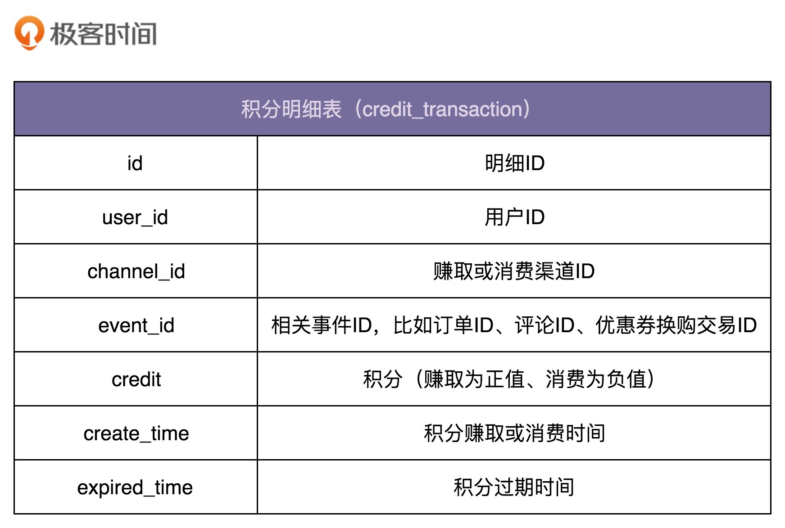
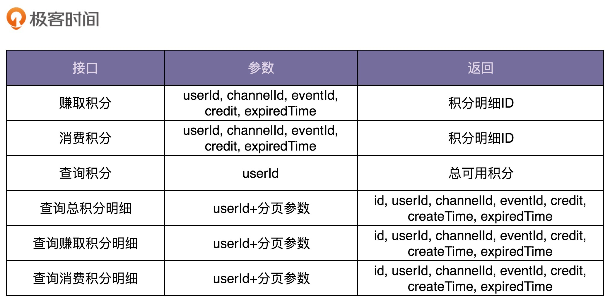
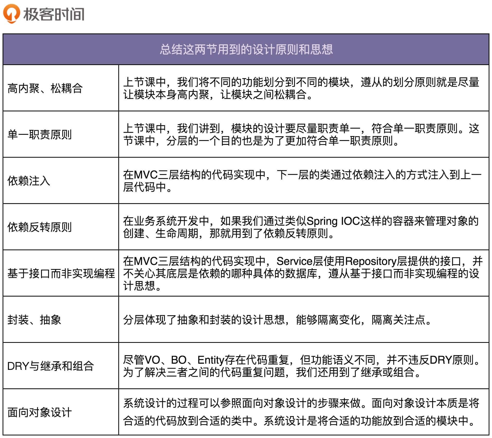

# 24 | 实战一（下）：如何实现一个遵从设计原则的积分兑换系统？
上一节课中，我们讲了积分系统的需求分析和系统设计。今天，我们来讲它的代码实现。

上一节课中，我们把积分赚取和消费的渠道和规则的管理维护工作，划分到了上层系统中，所以，积分系统的功能变得非常简单。相应地，代码实现也比较简单。如果你有一定的项目开发经验，那实现这样一个系统，对你来说并不是件难事。

所以，我们今天讲解的重点，并不是教你如何来实现积分系统的每个功能、每个接口，更不是教你如何编写SQL语句来增删改查数据，而是给你展示一些更普适的开发思想。比如，为什么要分MVC三层来开发？为什么要针对每层定义不同的数据对象？最后，我还会总结这其中都蕴含哪些设计原则和思想，让你知其然知其所以然，做到真正地透彻理解。

话不多说，让我们正式开始今天的学习吧！

## 业务开发包括哪些工作？

实际上，我们平时做业务系统的设计与开发，无外乎有这样三方面的工作要做：接口设计、数据库设计和业务模型设计（也就是业务逻辑）。

数据库和接口的设计非常重要，一旦设计好并投入使用之后，这两部分都不能轻易改动。改动数据库表结构，需要涉及数据的迁移和适配；改动接口，需要推动接口的使用者作相应的代码修改。这两种情况，即便是微小的改动，执行起来都会非常麻烦。因此，我们在设计接口和数据库的时候，一定要多花点心思和时间，切不可过于随意。相反，业务逻辑代码侧重内部实现，不涉及被外部依赖的接口，也不包含持久化的数据，所以对改动的容忍性更大。

**针对积分系统，我们先来看，如何设计数据库。**

数据库的设计比较简单。实际上，我们只需要一张记录积分流水明细的表就可以了。表中记录积分的赚取和消费流水。用户积分的各种统计数据，比如总积分、总可用积分等，都可以通过这张表来计算得到。

**接下来，我们再来看，如何设计积分系统的接口。**

接口设计要符合单一职责原则，粒度越小通用性就越好。但是，接口粒度太小也会带来一些问题。比如，一个功能的实现要调用多个小接口，一方面如果接口调用走网络（特别是公网），多次远程接口调用会影响性能；另一方面，本该在一个接口中完成的原子操作，现在分拆成多个小接口来完成，就可能会涉及分布式事务的数据一致性问题（一个接口执行成功了，但另一个接口执行失败了）。所以，为了兼顾易用性和性能，我们可以借鉴facade（外观）设计模式，在职责单一的细粒度接口之上，再封装一层粗粒度的接口给外部使用。

对于积分系统来说，我们需要设计如下这样几个接口。

**最后，我们来看业务模型的设计。**

前面我们讲到，从代码实现角度来说，大部分业务系统的开发都可以分为Controller、Service、Repository三层。Controller层负责接口暴露，Repository层负责数据读写，Service层负责核心业务逻辑，也就是这里说的业务模型。

除此之外，前面我们还提到两种开发模式，基于贫血模型的传统开发模式和基于充血模型的DDD开发模式。前者是一种面向过程的编程风格，后者是一种面向对象的编程风格。不管是DDD还是OOP，高级开发模式的存在一般都是为了应对复杂系统，应对系统的复杂性。对于我们要开发的积分系统来说，因为业务相对比较简单，所以，选择简单的基于贫血模型的传统开发模式就足够了。

从开发的角度来说，我们可以把积分系统作为一个独立的项目，来独立开发，也可以跟其他业务代码（比如营销系统）放到同一个项目中进行开发。从运维的角度来说，我们可以将它跟其他业务一块部署，也可以作为一个微服务独立部署。具体选择哪种开发和部署方式，我们可以参考公司当前的技术架构来决定。

实际上，积分系统业务比较简单，代码量也不多，我更倾向于将它跟营销系统放到一个项目中开发部署。只要我们做好代码的模块化和解耦，让积分相关的业务代码跟其他业务代码之间边界清晰，没有太多耦合，后期如果需要将它拆分成独立的项目来开发部署，那也并不困难。

相信这样一个简单的业务功能的开发，对你来说并没有太大难度。所以，具体的代码实现我就不在专栏中给出了。感兴趣的话，你可以自己实现一下。接下来的内容，才是我们这一节的重点。

## 为什么要分MVC三层开发？

我们刚刚提到，大部分业务系统的开发都可以分为三层：Contoller层、Service层、Repository层。对于这种分层方式，我相信大部分人都很认同，甚至成为了一种开发习惯，但你有没有想过，为什么我们要分层开发？很多业务都比较简单，一层代码搞定所有的数据读取、业务逻辑、接口暴露不好吗？你可以把它作为一道面试题，试着自己思考下，然后再看我下面的讲解。

对于这个问题，我总结了以下几点原因。

### 1.分层能起到代码复用的作用

同一个Repository可能会被多个Service来调用，同一个Service可能会被多个Controller调用。比如，UserService中的getUserById()接口封装了通过ID获取用户信息的逻辑，这部分逻辑可能会被UserController和AdminController等多个Controller使用。如果没有Service层，每个Controller都要重复实现这部分逻辑，显然会违反DRY原则。

### 2.分层能起到隔离变化的作用

分层体现了一种抽象和封装的设计思想。比如，Repository层封装了对数据库访问的操作，提供了抽象的数据访问接口。基于接口而非实现编程的设计思想，Service层使用Repository层提供的接口，并不关心其底层依赖的是哪种具体的数据库。当我们需要替换数据库的时候，比如从MySQL到Oracle，从Oracle到Redis，只需要改动Repository层的代码，Service层的代码完全不需要修改。

除此之外，Controller、Service、Repository三层代码的稳定程度不同、引起变化的原因不同，所以分成三层来组织代码，能有效地隔离变化。比如，Repository层基于数据库表，而数据库表改动的可能性很小，所以Repository层的代码最稳定，而Controller层提供适配给外部使用的接口，代码经常会变动。分层之后，Controller层中代码的频繁改动并不会影响到稳定的Repository层。

### 3.分层能起到隔离关注点的作用

Repository层只关注数据的读写。Service层只关注业务逻辑，不关注数据的来源。Controller层只关注与外界打交道，数据校验、封装、格式转换，并不关心业务逻辑。三层之间的关注点不同，分层之后，职责分明，更加符合单一职责原则，代码的内聚性更好。

### 4.分层能提高代码的可测试性

后面讲单元测试的时候，我们会讲到，单元测试不依赖不可控的外部组件，比如数据库。分层之后，Repsitory层的代码通过依赖注入的方式供Service层使用，当要测试包含核心业务逻辑的Service层代码的时候，我们可以用mock的数据源替代真实的数据库，注入到Service层代码中。代码的可测试性和单元测试我们后面会讲到，这里你稍微了解即可。

### 5.分层能应对系统的复杂性

所有的代码都放到一个类中，那这个类的代码就会因为需求的迭代而无限膨胀。我们知道，当一个类或一个函数的代码过多之后，可读性、可维护性就会变差。那我们就要想办法拆分。拆分有垂直和水平两个方向。水平方向基于业务来做拆分，就是模块化；垂直方向基于流程来做拆分，就是这里说的分层。

还是那句话，不管是分层、模块化，还是OOP、DDD，以及各种设计模式、原则和思想，都是为了应对复杂系统，应对系统的复杂性。对于简单系统来说，其实是发挥不了作用的，就是俗话说的“杀鸡焉用牛刀”。

## BO、VO、Entity存在的意义是什么？

在前面的章节中，我们提到，针对Controller、Service、Repository三层，每层都会定义相应的数据对象，它们分别是VO（View Object）、BO（Business Object）、Entity，例如UserVo、UserBo、UserEntity。在实际的开发中，VO、BO、Entity可能存在大量的重复字段，甚至三者包含的字段完全一样。在开发的过程中，我们经常需要重复定义三个几乎一样的类，显然是一种重复劳动。

**相对于每层定义各自的数据对象来说，是不是定义一个公共的数据对象更好些呢？**

实际上，我更加推荐每层都定义各自的数据对象这种设计思路，主要有以下3个方面的原因。

- VO、BO、Entity并非完全一样。比如，我们可以在UserEntity、UserBo中定义Password字段，但显然不能在UserVo中定义Password字段，否则就会将用户的密码暴露出去。
- VO、BO、Entity三个类虽然代码重复，但功能语义不重复，从职责上讲是不一样的。所以，也并不能算违背DRY原则。在前面讲到DRY原则的时候，针对这种情况，如果合并为同一个类，那也会存在后期因为需求的变化而需要再拆分的问题。
- 为了尽量减少每层之间的耦合，把职责边界划分明确，每层都会维护自己的数据对象，层与层之间通过接口交互。数据从下一层传递到上一层的时候，将下一层的数据对象转化成上一层的数据对象，再继续处理。虽然这样的设计稍微有些繁琐，每层都需要定义各自的数据对象，需要做数据对象之间的转化，但是分层清晰。对于非常大的项目来说，结构清晰是第一位的！

**既然VO、BO、Entity不能合并，那如何解决代码重复的问题呢？**

从设计的角度来说，VO、BO、Entity的设计思路并不违反DRY原则，为了分层清晰、减少耦合，多维护几个类的成本也并不是不能接受的。但是，如果你真的有代码洁癖，对于代码重复的问题，我们也有一些办法来解决。

我们前面讲到，继承可以解决代码重复问题。我们可以将公共的字段定义在父类中，让VO、BO、Entity都继承这个父类，各自只定义特有的字段。因为这里的继承层次很浅，也不复杂，所以使用继承并不会影响代码的可读性和可维护性。后期如果因为业务的需要，有些字段需要从父类移动到子类，或者从子类提取到父类，代码改起来也并不复杂。

前面在讲“多用组合，少用继承”设计思想的时候，我们提到，组合也可以解决代码重复的问题，所以，这里我们还可以将公共的字段抽取到公共的类中，VO、BO、Entity通过组合关系来复用这个类的代码。

**代码重复问题解决了，那不同分层之间的数据对象该如何互相转化呢？**

当下一层的数据通过接口调用传递到上一层之后，我们需要将它转化成上一层对应的数据对象类型。比如，Service层从Repository层获取的Entity之后，将其转化成BO，再继续业务逻辑的处理。所以，整个开发的过程会涉及“Entity到BO”和“BO到VO”这两种转化。

最简单的转化方式是手动复制。自己写代码在两个对象之间，一个字段一个字段的赋值。但这样的做法显然是没有技术含量的低级劳动。Java中提供了多种数据对象转化工具，比如BeanUtils、Dozer等，可以大大简化繁琐的对象转化工作。如果你是用其他编程语言来做开发，也可以借鉴Java这些工具类的设计思路，自己在项目中实现对象转化工具类。

**VO、BO、Entity都是基于贫血模型的，而且为了兼容框架或开发库（比如MyBatis、Dozer、BeanUtils），我们还需要定义每个字段的set方法。这些都违背OOP的封装特性，会导致数据被随意修改。那到底该怎么办好呢？**

前面我们也提到过，Entity和VO的生命周期是有限的，都仅限在本层范围内。而对应的Repository层和Controller层也都不包含太多业务逻辑，所以也不会有太多代码随意修改数据，即便设计成贫血、定义每个字段的set方法，相对来说也是安全的。

不过，Service层包含比较多的业务逻辑代码，所以BO就存在被任意修改的风险了。但是，设计的问题本身就没有最优解，只有权衡。为了使用方便，我们只能做一些妥协，放弃BO的封装特性，由程序员自己来负责这些数据对象的不被错误使用。

## 总结用到的设计原则和思想

前面我们提到，很多人做业务开发，总感觉就是CRUD，翻译代码，根本用不到设计原则、思想和模式。实际上，只是你没有发现而已。现在，我就给你罗列一下，今天讲解的内容中，都用到了哪些设计原则、思想和模式。

实际上，这两节课中还蕴含了很多其他的设计思想、原则、模式，你可以像我一样试着去总结一下，放在留言区说一说。

## 重点回顾

今天的内容到此就讲完了。我们一块来总结回顾一下，你需要掌握的重点内容。

**1.为什么要分MVC三层开发？**

对于这个问题，我总结了以下5点原因。

- 分层能起到代码复用的作用
- 分层能起到隔离变化的作用
- 分层能起到隔离关注点的作用
- 分层能提高代码的可测试性
- 分层能应对系统的复杂性

**2.BO、VO、Entity存在的意义是什么？**

从设计的角度来说，VO、BO、Entity的设计思路并不违反DRY原则，为了分层清晰、减少耦合，多维护几个类的成本也并不是不能接受的。但是，如果你真的有代码洁癖，对于代码重复的问题，我们可以通过继承或者组合来解决。

如何进行数据对象之间的转化？最简单的方式就是手动复制。当然，你也可以使用Java中提供了数据对象转化工具，比如BeanUtils、Dozer等，可以大大简化繁琐的对象转化工作。

尽管VO、BO、Entity的设计违背OOP的封装特性，有被随意修改的风险。但Entity和VO的生命周期是有限的，都仅限在本层范围内，相对来说是安全的。Service层包含比较多的业务逻辑代码，所以BO就存在被任意修改的风险了。为了使用方便，我们只能做一些妥协，放弃BO的封装特性，由程序员自己来负责这些数据对象的不被错误使用。

**3.总结用到的设计原则和思想**

从表面上看，做业务开发可能并不是特别有技术挑战，但是实际上，如果你要做到知其然知其所以然，做到透彻理解、真的懂，并不是件容易的事情。深挖一下，你会发现这其中还是蕴含了很多设计原则、思想和模式的。

## 课堂讨论

1. 上节课中，我们讲到，下层系统不要包含太多上层系统的业务信息。但在今天的数据库设计中，积分明细表中credit\_transaction中包含event\_id，channel\_id这些跟上层业务相关的字段，那这样的设计是否合理呢？
2. 我们经常说，修改和查询不要耦合在一个接口中，要分成两个接口来做。赚取积分和消费积分接口返回积分明细ID，这样的接口设计是否违背单一职责原则呢？是不是返回void或者boolean类型更合理呢？

欢迎在留言区写下你的答案，和同学一起交流和分享。如果有收获，也欢迎你把这篇文章分享给你的朋友。