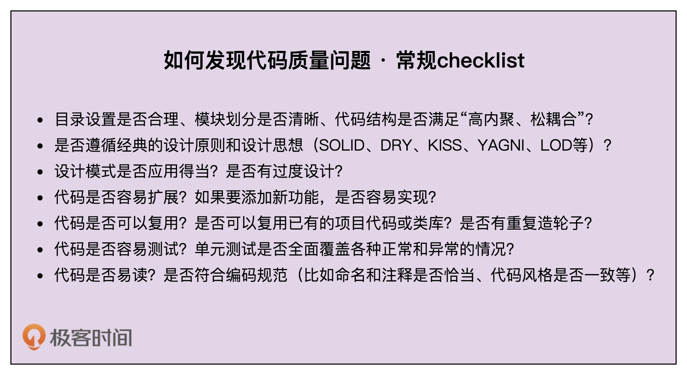
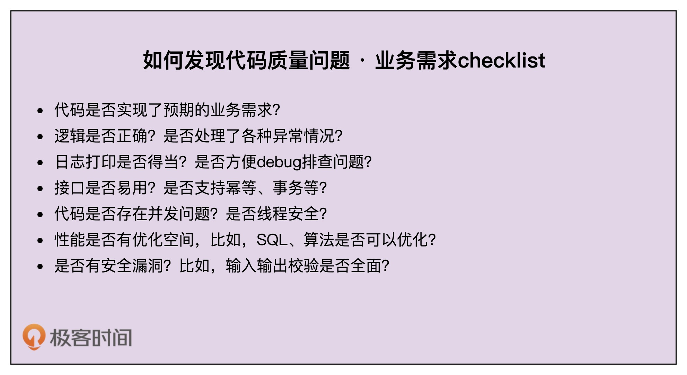

# 34 | 实战一（上）：通过一段ID生成器代码，学习如何发现代码质量问题
在前面几节课中，我们讲了一些跟重构相关的理论知识，比如：持续重构、单元测试、代码的可测试性、解耦、编码规范。用一句话总结一下，重构就是发现代码质量问题，并且对其进行优化的过程。

前面的内容相对还是偏理论。今天，我就借助一个大家都很熟悉的ID生成器代码，给你展示一下重构的大致过程。整个内容分为两节课。这一节课我们讲述如何发现代码质量问题，下一节课讲述如何针对发现的质量问题，对其进行优化，将它从“能用”变得“好用”。

话不多说，让我们正式开始今天的学习吧！

## ID生成器需求背景介绍

“ID”中文翻译为“标识（Identifier）”。这个概念在生活、工作中随处可见，比如身份证、商品条形码、二维码、车牌号、驾照号。聚焦到软件开发中，ID常用来表示一些业务信息的唯一标识，比如订单的单号或者数据库中的唯一主键，比如地址表中的ID字段（实际上是没有业务含义的，对用户来说是透明的，不需要关注）。

假设你正在参与一个后端业务系统的开发，为了方便在请求出错时排查问题，我们在编写代码的时候会在关键路径上打印日志。某个请求出错之后，我们希望能搜索出这个请求对应的所有日志，以此来查找问题的原因。而实际情况是，在日志文件中，不同请求的日志会交织在一起。如果没有东西来标识哪些日志属于同一个请求，我们就无法关联同一个请求的所有日志。

这听起来有点像微服务中的调用链追踪。不过，微服务中的调用链追踪是服务间的追踪，我们现在要实现的是服务内的追踪。

借鉴微服务调用链追踪的实现思路，我们可以给每个请求分配一个唯一ID，并且保存在请求的上下文（Context）中，比如，处理请求的工作线程的局部变量中。在Java语言中，我们可以将ID存储在Servlet线程的ThreadLocal中，或者利用Slf4j日志框架的MDC（Mapped Diagnostic Contexts）来实现（实际上底层原理也是基于线程的ThreadLocal）。每次打印日志的时候，我们从请求上下文中取出请求ID，跟日志一块输出。这样，同一个请求的所有日志都包含同样的请求ID信息，我们就可以通过请求ID来搜索同一个请求的所有日志了。

好了，需求背景我们已经讲清楚了，至于具体如何实现整个需求，我就不展开来讲解了。如果你感兴趣的话，可以自己试着去设计实现一下。我们接下来只关注其中生成请求ID这部分功能的开发。

## 一份“能用”的代码实现

假设leader让小王负责这个ID生成器的开发。对于稍微有点开发经验的程序员来说，实现这样一个简单的ID生成器，并不是件难事。所以，小王很快就完成了任务，将代码写了出来，具体如下所示：

```
public class IdGenerator {
  private static final Logger logger = LoggerFactory.getLogger(IdGenerator.class);

  public static String generate() {
    String id = "";
    try {
      String hostName = InetAddress.getLocalHost().getHostName();
      String[] tokens = hostName.split("\\.");
      if (tokens.length > 0) {
        hostName = tokens[tokens.length - 1];
      }
      char[] randomChars = new char[8];
      int count = 0;
      Random random = new Random();
      while (count < 8) {
        int randomAscii = random.nextInt(122);
        if (randomAscii >= 48 && randomAscii <= 57) {
          randomChars[count] = (char)('0' + (randomAscii - 48));
          count++;
        } else if (randomAscii >= 65 && randomAscii <= 90) {
          randomChars[count] = (char)('A' + (randomAscii - 65));
          count++;
        } else if (randomAscii >= 97 && randomAscii <= 122) {
          randomChars[count] = (char)('a' + (randomAscii - 97));
          count++;
        }
      }
      id = String.format("%s-%d-%s", hostName,
              System.currentTimeMillis(), new String(randomChars));
    } catch (UnknownHostException e) {
      logger.warn("Failed to get the host name.", e);
    }

    return id;
  }
}

```

上面的代码生成的ID示例如下所示。整个ID由三部分组成。第一部分是本机名的最后一个字段。第二部分是当前时间戳，精确到毫秒。第三部分是8位的随机字符串，包含大小写字母和数字。尽管这样生成的ID并不是绝对唯一的，有重复的可能，但事实上重复的概率非常低。对于我们的日志追踪来说，极小概率的ID重复是完全可以接受的。

```
103-1577456311467-3nR3Do45
103-1577456311468-0wnuV5yw
103-1577456311468-sdrnkFxN
103-1577456311468-8lwk0BP0

```

不过，在我看来，像小王的这份代码只能算得上“能用”，勉强及格。我为啥这么说呢？这段代码只有短短不到40行，里面却有很多值得优化的地方。你可以先思考一下，在纸上试着罗列一下这段代码存在的问题，然后再对比来看我下面的讲解。

## 如何发现代码质量问题？

从大处着眼的话，我们可以参考之前讲过的代码质量评判标准，看这段代码是否可读、可扩展、可维护、灵活、简洁、可复用、可测试等等。落实到具体细节，我们可以从以下几个方面来审视代码。

- 目录设置是否合理、模块划分是否清晰、代码结构是否满足“高内聚、松耦合”？
- 是否遵循经典的设计原则和设计思想（SOLID、DRY、KISS、YAGNI、LOD等）？
- 设计模式是否应用得当？是否有过度设计？
- 代码是否容易扩展？如果要添加新功能，是否容易实现？
- 代码是否可以复用？是否可以复用已有的项目代码或类库？是否有重复造轮子？
- 代码是否容易测试？单元测试是否全面覆盖了各种正常和异常的情况？
- 代码是否易读？是否符合编码规范（比如命名和注释是否恰当、代码风格是否一致等）？

以上是一些通用的关注点，可以作为常规检查项，套用在任何代码的重构上。除此之外，我们还要关注代码实现是否满足业务本身特有的功能和非功能需求。我罗列了一些比较有共性的问题，如下所示。这份列表可能还不够全面，剩下的需要你针对具体的业务、具体的代码去具体分析。

- 代码是否实现了预期的业务需求？
- 逻辑是否正确？是否处理了各种异常情况？
- 日志打印是否得当？是否方便debug排查问题？
- 接口是否易用？是否支持幂等、事务等？
- 代码是否存在并发问题？是否线程安全？
- 性能是否有优化空间，比如，SQL、算法是否可以优化？
- 是否有安全漏洞？比如输入输出校验是否全面？

**现在，对照上面的检查项，我们来看一下，小王编写的代码有哪些问题。**

首先，IdGenerator的代码比较简单，只有一个类，所以，不涉及目录设置、模块划分、代码结构问题，也不违反基本的SOLID、DRY、KISS、YAGNI、LOD等设计原则。它没有应用设计模式，所以也不存在不合理使用和过度设计的问题。

其次，IdGenerator设计成了实现类而非接口，调用者直接依赖实现而非接口，违反基于接口而非实现编程的设计思想。实际上，将IdGenerator设计成实现类，而不定义接口，问题也不大。如果哪天ID生成算法改变了，我们只需要直接修改实现类的代码就可以。但是，如果项目中需要同时存在两种ID生成算法，也就是要同时存在两个IdGenerator实现类。比如，我们需要将这个框架给更多的系统来使用。系统在使用的时候，可以灵活地选择它需要的生成算法。这个时候，我们就需要将IdGenerator定义为接口，并且为不同的生成算法定义不同的实现类。

再次，把IdGenerator的generate()函数定义为静态函数，会影响使用该函数的代码的可测试性。同时，generate()函数的代码实现依赖运行环境（本机名）、时间函数、随机函数，所以generate()函数本身的可测试性也不好，需要做比较大的重构。除此之外，小王也没有编写单元测试代码，我们需要在重构时对其进行补充。

最后，虽然IdGenerator只包含一个函数，并且代码行数也不多，但代码的可读性并不好。特别是随机字符串生成的那部分代码，一方面，代码完全没有注释，生成算法比较难读懂，另一方面，代码里有很多魔法数，严重影响代码的可读性。在重构的时候，我们需要重点提高这部分代码的可读性。

**刚刚我们参照跟业务本身无关的、通用的代码质量关注点，对小王的代码进行了评价。现在，我们再对照业务本身的功能和非功能需求，重新审视一下小王的代码。**

前面我们提到，虽然小王的代码生成的ID并非绝对的唯一，但是对于追踪打印日志来说，是可以接受小概率ID冲突的，满足我们预期的业务需求。不过，获取hostName这部分代码逻辑貌似有点问题，并未处理“hostName为空”的情况。除此之外，尽管代码中针对获取不到本机名的情况做了异常处理，但是小王对异常的处理是在IdGenerator内部将其吐掉，然后打印一条报警日志，并没有继续往上抛出。这样的异常处理是否得当呢？你可以先自己思考一下，我们把这部分内容放到第36、37讲中具体讲解。

小王代码的日志打印得当，日志描述能够准确反应问题，方便debug，并且没有过多的冗余日志。IdGenerator只暴露一个generate()接口供使用者使用，接口的定义简单明了，不存在不易用问题。generate()函数代码中没有涉及共享变量，所以代码线程安全，多线程环境下调用generate()函数不存在并发问题。

性能方面，ID的生成不依赖外部存储，在内存中生成，并且日志的打印频率也不会很高，所以小王的代码在性能方面足以应对目前的应用场景。不过，每次生成ID都需要获取本机名，获取主机名会比较耗时，所以，这部分可以考虑优化一下。还有，randomAscii的范围是0～122，但可用数字仅包含三段子区间（0~9，a~z，A~Z），极端情况下会随机生成很多三段区间之外的无效数字，需要循环很多次才能生成随机字符串，所以随机字符串的生成算法也可以优化一下。

**刚刚我们还讲到，有一些代码质量问题不具有共性，我们没法一一罗列，需要你针对具体的业务、具体的代码去具体分析。那像小王的这份代码，你还能发现有哪些具体问题吗？**

在generate()函数的while循环里面，三个if语句内部的代码非常相似，而且实现稍微有点过于复杂了，实际上可以进一步简化，将这三个if合并在一起。具体如何来做，我们留在下一节课中讲解。

今天的知识内容我们讲到这里其实就差不多了。那跟随我看到这里，你有没有觉得，你的内功加深了很多呢？之前看到一段代码，你想要重构，但不知道该如何入手，也不知道该如何评价这段代码写得好坏，更不知道该如何系统、全面地进行分析。而现在，你可以很轻松地罗列出这段代码的质量缺陷，并且做到有章可循、全面系统、无遗漏。之所以现在能做到这样，那是得益于前面很多理论知识的学习和铺垫。所谓“会者不难，难者不会”，其实就是这个道理！

如果我们没有前面n多知识点的铺垫，比如，面向对象和面向过程的区别、面向对象的四大特性、面向过程编程的弊端以及如何控制弊端带来的副作用、需求分析方法、类的设计思路、类之间的关系、接口和抽象类的区别、各种设计原则和思想等等，我相信很多人都不能完美地解决今天的问题。

那你可能要说了，今天这段代码并没有涉及之前所有的知识点啊？你说得没错。但是， **如果没有知识点的全面积累，我们就无法构建出大的知识框架，更不知道知识的边界在哪里，也就无法形成系统的方法论。即便你能歪打误撞回答全面，也不会像现在这样对自己的答案如此自信和笃定。**

## 重点回顾

好了，今天的内容到此就讲完了。我们来一块总结回顾一下，你需要重点掌握的内容。

今天我们其实就重点讲了一个问题，那就是，如何发现代码质量问题？这其实是我整理的一个发现代码质量问题的checklist。之后，你在review自己的代码时，可以参考这两个checklist来进行全面的review。

首先，从大处着眼的话，我们可以参考之前讲过的代码质量评判标准，看代码是否可读、可扩展、可维护、灵活、简洁、可复用、可测试等。落实到具体细节，我们可以从以下7个方面来审视代码。



这些都是一些通用的关注点，可以作为一些常规检查项，套用在任何代码的重构上。除此之外，我们还要关注代码实现是否满足业务本身特有的功能和非功能需求。一些比较共性的关注点如下所示：



## 课堂讨论

在今天的代码中，打印日志的Logger对象被定义为static final的，并且在类内部创建，这是否影响到IdGenerator类代码的可测试性？是否应该将Logger对象通过依赖注入的方式注入到IdGenerator类中呢？

欢迎在留言区写下你的答案，和同学一起交流和分享。如果有收获，也欢迎你把这篇文章分享给你的朋友。