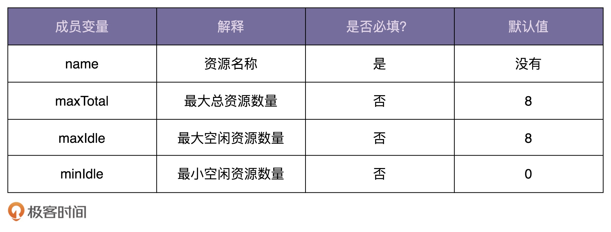

# 46 | 建造者模式：详解构造函数、set方法、建造者模式三种对象创建方式
上两节课中，我们学习了工厂模式，讲了工厂模式的应用场景，并带你实现了一个简单的DI容器。今天，我们再来学习另外一个比较常用的创建型设计模式， **Builder模式**，中文翻译为 **建造者模式** 或者 **构建者模式**，也有人叫它 **生成器模式**。

实际上，建造者模式的原理和代码实现非常简单，掌握起来并不难，难点在于应用场景。比如，你有没有考虑过这样几个问题：直接使用构造函数或者配合set方法就能创建对象，为什么还需要建造者模式来创建呢？建造者模式和工厂模式都可以创建对象，那它们两个的区别在哪里呢？

话不多说，带着上面两个问题，让我们开始今天的学习吧！

## 为什么需要建造者模式？

在平时的开发中，创建一个对象最常用的方式是，使用new关键字调用类的构造函数来完成。我的问题是，什么情况下这种方式就不适用了，就需要采用建造者模式来创建对象呢？你可以先思考一下，下面我通过一个例子来带你看一下。

假设有这样一道设计面试题：我们需要定义一个资源池配置类ResourcePoolConfig。这里的资源池，你可以简单理解为线程池、连接池、对象池等。在这个资源池配置类中，有以下几个成员变量，也就是可配置项。现在，请你编写代码实现这个ResourcePoolConfig类。



只要你稍微有点开发经验，那实现这样一个类对你来说并不是件难事。最常见、最容易想到的实现思路如下代码所示。因为maxTotal、maxIdle、minIdle不是必填变量，所以在创建ResourcePoolConfig对象的时候，我们通过往构造函数中，给这几个参数传递null值，来表示使用默认值。

```
public class ResourcePoolConfig {
  private static final int DEFAULT_MAX_TOTAL = 8;
  private static final int DEFAULT_MAX_IDLE = 8;
  private static final int DEFAULT_MIN_IDLE = 0;

  private String name;
  private int maxTotal = DEFAULT_MAX_TOTAL;
  private int maxIdle = DEFAULT_MAX_IDLE;
  private int minIdle = DEFAULT_MIN_IDLE;

  public ResourcePoolConfig(String name, Integer maxTotal, Integer maxIdle, Integer minIdle) {
    if (StringUtils.isBlank(name)) {
      throw new IllegalArgumentException("name should not be empty.");
    }
    this.name = name;

    if (maxTotal != null) {
      if (maxTotal <= 0) {
        throw new IllegalArgumentException("maxTotal should be positive.");
      }
      this.maxTotal = maxTotal;
    }

    if (maxIdle != null) {
      if (maxIdle < 0) {
        throw new IllegalArgumentException("maxIdle should not be negative.");
      }
      this.maxIdle = maxIdle;
    }

    if (minIdle != null) {
      if (minIdle < 0) {
        throw new IllegalArgumentException("minIdle should not be negative.");
      }
      this.minIdle = minIdle;
    }
  }
  //...省略getter方法...
}

```

现在，ResourcePoolConfig只有4个可配置项，对应到构造函数中，也只有4个参数，参数的个数不多。但是，如果可配置项逐渐增多，变成了8个、10个，甚至更多，那继续沿用现在的设计思路，构造函数的参数列表会变得很长，代码在可读性和易用性上都会变差。在使用构造函数的时候，我们就容易搞错各参数的顺序，传递进错误的参数值，导致非常隐蔽的bug。

```
// 参数太多，导致可读性差、参数可能传递错误
ResourcePoolConfig config = new ResourcePoolConfig("dbconnectionpool", 16, null, 8, null, false , true, 10, 20，false， true);

```

解决这个问题的办法你应该也已经想到了，那就是用set()函数来给成员变量赋值，以替代冗长的构造函数。我们直接看代码，具体如下所示。其中，配置项name是必填的，所以我们把它放到构造函数中设置，强制创建类对象的时候就要填写。其他配置项maxTotal、maxIdle、minIdle都不是必填的，所以我们通过set()函数来设置，让使用者自主选择填写或者不填写。

```
public class ResourcePoolConfig {
  private static final int DEFAULT_MAX_TOTAL = 8;
  private static final int DEFAULT_MAX_IDLE = 8;
  private static final int DEFAULT_MIN_IDLE = 0;

  private String name;
  private int maxTotal = DEFAULT_MAX_TOTAL;
  private int maxIdle = DEFAULT_MAX_IDLE;
  private int minIdle = DEFAULT_MIN_IDLE;

  public ResourcePoolConfig(String name) {
    if (StringUtils.isBlank(name)) {
      throw new IllegalArgumentException("name should not be empty.");
    }
    this.name = name;
  }

  public void setMaxTotal(int maxTotal) {
    if (maxTotal <= 0) {
      throw new IllegalArgumentException("maxTotal should be positive.");
    }
    this.maxTotal = maxTotal;
  }

  public void setMaxIdle(int maxIdle) {
    if (maxIdle < 0) {
      throw new IllegalArgumentException("maxIdle should not be negative.");
    }
    this.maxIdle = maxIdle;
  }

  public void setMinIdle(int minIdle) {
    if (minIdle < 0) {
      throw new IllegalArgumentException("minIdle should not be negative.");
    }
    this.minIdle = minIdle;
  }
  //...省略getter方法...
}

```

接下来，我们来看新的ResourcePoolConfig类该如何使用。我写了一个示例代码，如下所示。没有了冗长的函数调用和参数列表，代码在可读性和易用性上提高了很多。

```
// ResourcePoolConfig使用举例
ResourcePoolConfig config = new ResourcePoolConfig("dbconnectionpool");
config.setMaxTotal(16);
config.setMaxIdle(8);

```

至此，我们仍然没有用到建造者模式，通过构造函数设置必填项，通过set()方法设置可选配置项，就能实现我们的设计需求。如果我们把问题的难度再加大点，比如，还需要解决下面这三个问题，那现在的设计思路就不能满足了。

- 我们刚刚讲到，name是必填的，所以，我们把它放到构造函数中，强制创建对象的时候就设置。如果必填的配置项有很多，把这些必填配置项都放到构造函数中设置，那构造函数就又会出现参数列表很长的问题。如果我们把必填项也通过set()方法设置，那校验这些必填项是否已经填写的逻辑就无处安放了。
- 除此之外，假设配置项之间有一定的依赖关系，比如，如果用户设置了maxTotal、maxIdle、minIdle其中一个，就必须显式地设置另外两个；或者配置项之间有一定的约束条件，比如，maxIdle和minIdle要小于等于maxTotal。如果我们继续使用现在的设计思路，那这些配置项之间的依赖关系或者约束条件的校验逻辑就无处安放了。
- 如果我们希望ResourcePoolConfig类对象是不可变对象，也就是说，对象在创建好之后，就不能再修改内部的属性值。要实现这个功能，我们就不能在ResourcePoolConfig类中暴露set()方法。

为了解决这些问题，建造者模式就派上用场了。

我们可以把校验逻辑放置到Builder类中，先创建建造者，并且通过set()方法设置建造者的变量值，然后在使用build()方法真正创建对象之前，做集中的校验，校验通过之后才会创建对象。除此之外，我们把ResourcePoolConfig的构造函数改为private私有权限。这样我们就只能通过建造者来创建ResourcePoolConfig类对象。并且，ResourcePoolConfig没有提供任何set()方法，这样我们创建出来的对象就是不可变对象了。

我们用建造者模式重新实现了上面的需求，具体的代码如下所示：

```
public class ResourcePoolConfig {
  private String name;
  private int maxTotal;
  private int maxIdle;
  private int minIdle;

  private ResourcePoolConfig(Builder builder) {
    this.name = builder.name;
    this.maxTotal = builder.maxTotal;
    this.maxIdle = builder.maxIdle;
    this.minIdle = builder.minIdle;
  }
  //...省略getter方法...

  //我们将Builder类设计成了ResourcePoolConfig的内部类。
  //我们也可以将Builder类设计成独立的非内部类ResourcePoolConfigBuilder。
  public static class Builder {
    private static final int DEFAULT_MAX_TOTAL = 8;
    private static final int DEFAULT_MAX_IDLE = 8;
    private static final int DEFAULT_MIN_IDLE = 0;

    private String name;
    private int maxTotal = DEFAULT_MAX_TOTAL;
    private int maxIdle = DEFAULT_MAX_IDLE;
    private int minIdle = DEFAULT_MIN_IDLE;

    public ResourcePoolConfig build() {
      // 校验逻辑放到这里来做，包括必填项校验、依赖关系校验、约束条件校验等
      if (StringUtils.isBlank(name)) {
        throw new IllegalArgumentException("...");
      }
      if (maxIdle > maxTotal) {
        throw new IllegalArgumentException("...");
      }
      if (minIdle > maxTotal || minIdle > maxIdle) {
        throw new IllegalArgumentException("...");
      }

      return new ResourcePoolConfig(this);
    }

    public Builder setName(String name) {
      if (StringUtils.isBlank(name)) {
        throw new IllegalArgumentException("...");
      }
      this.name = name;
      return this;
    }

    public Builder setMaxTotal(int maxTotal) {
      if (maxTotal <= 0) {
        throw new IllegalArgumentException("...");
      }
      this.maxTotal = maxTotal;
      return this;
    }

    public Builder setMaxIdle(int maxIdle) {
      if (maxIdle < 0) {
        throw new IllegalArgumentException("...");
      }
      this.maxIdle = maxIdle;
      return this;
    }

    public Builder setMinIdle(int minIdle) {
      if (minIdle < 0) {
        throw new IllegalArgumentException("...");
      }
      this.minIdle = minIdle;
      return this;
    }
  }
}

// 这段代码会抛出IllegalArgumentException，因为minIdle>maxIdle
ResourcePoolConfig config = new ResourcePoolConfig.Builder()
        .setName("dbconnectionpool")
        .setMaxTotal(16)
        .setMaxIdle(10)
        .setMinIdle(12)
        .build();

```



实际上，使用建造者模式创建对象，还能避免对象存在无效状态。我再举个例子解释一下。比如我们定义了一个长方形类，如果不使用建造者模式，采用先创建后set的方式，那就会导致在第一个set之后，对象处于无效状态。具体代码如下所示：

```
Rectangle r = new Rectange(); // r is invalid
r.setWidth(2); // r is invalid
r.setHeight(3); // r is valid

```

为了避免这种无效状态的存在，我们就需要使用构造函数一次性初始化好所有的成员变量。如果构造函数参数过多，我们就需要考虑使用建造者模式，先设置建造者的变量，然后再一次性地创建对象，让对象一直处于有效状态。

实际上，如果我们并不是很关心对象是否有短暂的无效状态，也不是太在意对象是否是可变的。比如，对象只是用来映射数据库读出来的数据，那我们直接暴露set()方法来设置类的成员变量值是完全没问题的。而且，使用建造者模式来构建对象，代码实际上是有点重复的，ResourcePoolConfig类中的成员变量，要在Builder类中重新再定义一遍。

## 与工厂模式有何区别？

从上面的讲解中，我们可以看出，建造者模式是让建造者类来负责对象的创建工作。上一节课中讲到的工厂模式，是由工厂类来负责对象创建的工作。那它们之间有什么区别呢？

实际上，工厂模式是用来创建不同但是相关类型的对象（继承同一父类或者接口的一组子类），由给定的参数来决定创建哪种类型的对象。建造者模式是用来创建一种类型的复杂对象，通过设置不同的可选参数，“定制化”地创建不同的对象。

网上有一个经典的例子很好地解释了两者的区别。

顾客走进一家餐馆点餐，我们利用工厂模式，根据用户不同的选择，来制作不同的食物，比如披萨、汉堡、沙拉。对于披萨来说，用户又有各种配料可以定制，比如奶酪、西红柿、起司，我们通过建造者模式根据用户选择的不同配料来制作披萨。

实际上，我们也不要太学院派，非得把工厂模式、建造者模式分得那么清楚，我们需要知道的是，每个模式为什么这么设计，能解决什么问题。 **只有了解了这些最本质的东西，我们才能不生搬硬套，才能灵活应用，甚至可以混用各种模式创造出新的模式，来解决特定场景的问题。**

## 重点回顾

好了，今天的内容到此就讲完了。我们一块来总结回顾一下，你需要重点掌握的内容。

建造者模式的原理和实现比较简单，重点是掌握应用场景，避免过度使用。

如果一个类中有很多属性，为了避免构造函数的参数列表过长，影响代码的可读性和易用性，我们可以通过构造函数配合set()方法来解决。但是，如果存在下面情况中的任意一种，我们就要考虑使用建造者模式了。

- 我们把类的必填属性放到构造函数中，强制创建对象的时候就设置。如果必填的属性有很多，把这些必填属性都放到构造函数中设置，那构造函数就又会出现参数列表很长的问题。如果我们把必填属性通过set()方法设置，那校验这些必填属性是否已经填写的逻辑就无处安放了。
- 如果类的属性之间有一定的依赖关系或者约束条件，我们继续使用构造函数配合set()方法的设计思路，那这些依赖关系或约束条件的校验逻辑就无处安放了。
- 如果我们希望创建不可变对象，也就是说，对象在创建好之后，就不能再修改内部的属性值，要实现这个功能，我们就不能在类中暴露set()方法。构造函数配合set()方法来设置属性值的方式就不适用了。

除此之外，在今天的讲解中，我们还对比了工厂模式和建造者模式的区别。工厂模式是用来创建不同但是相关类型的对象（继承同一父类或者接口的一组子类），由给定的参数来决定创建哪种类型的对象。建造者模式是用来创建一种类型的复杂对象，可以通过设置不同的可选参数，“定制化”地创建不同的对象。

## 课堂讨论

在下面的ConstructorArg类中，当isRef为true的时候，arg表示String类型的refBeanId，type不需要设置；当isRef为false的时候，arg、type都需要设置。请根据这个需求，完善ConstructorArg类。

```
 public class ConstructorArg {
    private boolean isRef;
    private Class type;
    private Object arg;
    // TODO: 待完善...
  }

```

欢迎留言和我分享你的想法，如果有收获，你也可以把这篇文章分享给你的朋友。